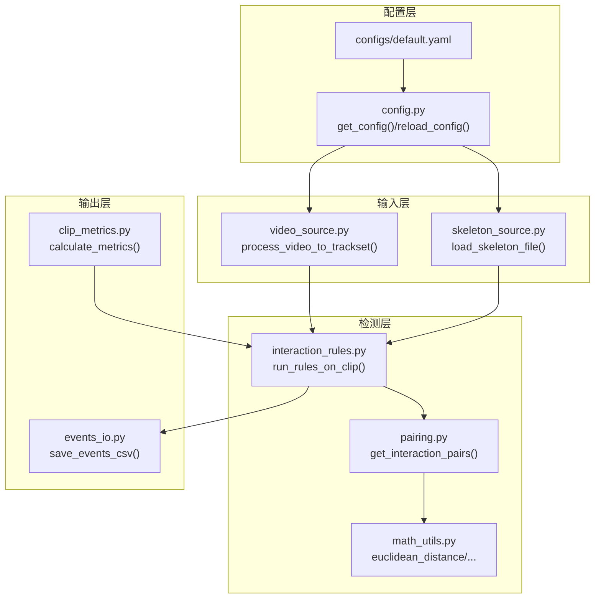
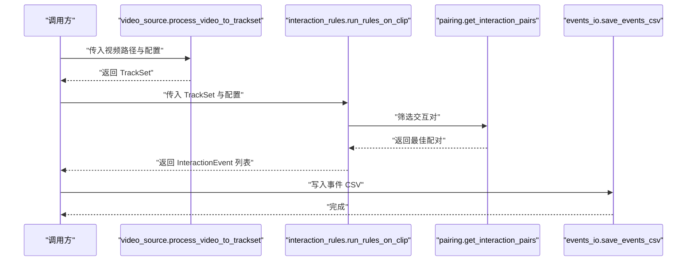
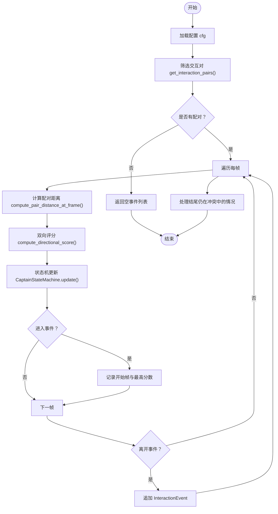
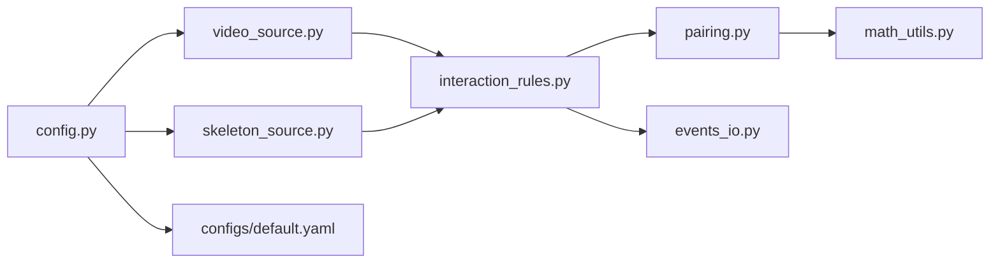

# API参考文档

<cite>
**本文引用的文件**
- [contracts.py](file://src/fightguard/contracts.py)
- [config.py](file://src/fightguard/config.py)
- [skeleton_source.py](file://src/fightguard/inputs/skeleton_source.py)
- [video_source.py](file://src/fightguard/inputs/video_source.py)
- [interaction_rules.py](file://src/fightguard/detection/interaction_rules.py)
- [pairing.py](file://src/fightguard/detection/pairing.py)
- [math_utils.py](file://src/fightguard/detection/math_utils.py)
- [events_io.py](file://src/fightguard/reporting/events_io.py)
- [clip_metrics.py](file://src/fightguard/evaluation/clip_metrics.py)
- [default.yaml](file://configs/default.yaml)
- [eval_video_dataset.py](file://scripts/eval_video_dataset.py)
- [debug_single_video.py](file://scripts/debug_single_video.py)
- [test_skeleton.py](file://test_skeleton.py)
</cite>

## 目录
1. [简介](#简介)
2. [项目结构](#项目结构)
3. [核心组件](#核心组件)
4. [架构总览](#架构总览)
5. [详细组件分析](#详细组件分析)
6. [依赖分析](#依赖分析)
7. [性能考虑](#性能考虑)
8. [故障排查指南](#故障排查指南)
9. [结论](#结论)
10. [附录](#附录)

## 简介
本文件为 KidGuard 幼儿园冲突风险管理分析系统的完整 API 参考文档。重点覆盖以下公共接口与核心函数：
- 视频到轨迹：process_video_to_trackset()
- 骨骼数据加载：load_skeleton_file()
- 规则执行：run_rules_on_clip()
- 事件持久化：save_events_csv()
- 配置管理：get_config()、reload_config()
并配套说明数据契约类（Keypoints、SkeletonTrack、TrackSet、InteractionEvent）的属性与方法，以及典型应用场景与最佳实践。

## 项目结构
系统采用模块化分层设计：
- 配置层：config.py 提供全局配置读取与校验
- 输入层：inputs/video_source.py（视频）、inputs/skeleton_source.py（NTU骨骼）负责数据读取与标准化
- 检测层：detection/interaction_rules.py（规则与状态机）、detection/pairing.py（配对）、detection/math_utils.py（几何工具）
- 输出层：reporting/events_io.py（CSV写入）、evaluation/clip_metrics.py（指标计算）
- 配置文件：configs/default.yaml

图表来源
- [config.py:32-92](file://src/fightguard/config.py#L32-L92)
- [video_source.py:57-193](file://src/fightguard/inputs/video_source.py#L57-L193)
- [skeleton_source.py:211-274](file://src/fightguard/inputs/skeleton_source.py#L211-L274)
- [interaction_rules.py:410-503](file://src/fightguard/detection/interaction_rules.py#L410-L503)
- [pairing.py:14-54](file://src/fightguard/detection/pairing.py#L14-L54)
- [math_utils.py:10-52](file://src/fightguard/detection/math_utils.py#L10-L52)
- [events_io.py:23-36](file://src/fightguard/reporting/events_io.py#L23-L36)
- [clip_metrics.py:9-47](file://src/fightguard/evaluation/clip_metrics.py#L9-L47)

章节来源
- [README.md:46-76](file://README.md#L46-L76)

## 核心组件
本节概述关键API与数据契约，帮助快速定位接口与数据结构。

- 视频骨骼提取与轨迹构建
  - process_video_to_trackset(video_path, label=-1, cfg=None, max_frames=None) -> Optional[TrackSet]
- 骨骼数据加载（NTU）
  - load_skeleton_file(filepath, cfg=None) -> Optional[TrackSet]
- 规则执行与事件生成
  - run_rules_on_clip(track_set, cfg=None) -> List[InteractionEvent]
- 事件持久化
  - save_events_csv(events: List[InteractionEvent], filepath: str) -> None
- 配置管理
  - get_config(config_path=None) -> Dict[str, Any]
  - reload_config(config_path=None) -> Dict[str, Any]
- 数据契约
  - Keypoints: Dict[str, List[float]]
  - SkeletonTrack: 轨迹对象，含 track_id、role、frames、keypoints、confidences
  - TrackSet: 片段对象，含 clip_id、label、tracks、fps、total_frames
  - InteractionEvent: 事件对象，含 clip_id、event_type、start_frame、end_frame、track_ids、score、triggered_rules、teacher_present、region

章节来源
- [video_source.py:57-193](file://src/fightguard/inputs/video_source.py#L57-L193)
- [skeleton_source.py:211-274](file://src/fightguard/inputs/skeleton_source.py#L211-L274)
- [interaction_rules.py:410-503](file://src/fightguard/detection/interaction_rules.py#L410-L503)
- [events_io.py:23-36](file://src/fightguard/reporting/events_io.py#L23-L36)
- [config.py:32-92](file://src/fightguard/config.py#L32-L92)
- [contracts.py:56-241](file://src/fightguard/contracts.py#L56-L241)

## 架构总览
KidGuard 的端到端流程如下：输入视频或NTU骨骼数据 → 标准化为 TrackSet → 人员配对 → 物理特征提取与评分 → 状态机判定 → 事件生成与持久化。

图表来源
- [video_source.py:57-193](file://src/fightguard/inputs/video_source.py#L57-L193)
- [interaction_rules.py:410-503](file://src/fightguard/detection/interaction_rules.py#L410-L503)
- [pairing.py:14-54](file://src/fightguard/detection/pairing.py#L14-L54)
- [events_io.py:23-36](file://src/fightguard/reporting/events_io.py#L23-L36)

## 详细组件分析

### API：process_video_to_trackset()
- 功能：读取视频，使用 YOLOv8-Pose（OpenVINO 加速）逐帧提取 COCO-17 关键点，构建 TrackSet。
- 参数
  - video_path: str，视频文件路径
  - label: int，视频标签（1=冲突，0=正常，默认-1）
  - cfg: Optional[dict]，配置字典；未提供时内部调用 get_config()
  - max_frames: Optional[int]，最多处理帧数（调试用）
- 返回：Optional[TrackSet]，若未检测到人则返回 None
- 异常：视频打开失败时返回 None；内部捕获 OpenCV/模型推理异常并打印错误日志
- 典型用法：见脚本 [eval_video_dataset.py:84-92](file://scripts/eval_video_dataset.py#L84-L92)

章节来源
- [video_source.py:57-193](file://src/fightguard/inputs/video_source.py#L57-L193)
- [eval_video_dataset.py:84-92](file://scripts/eval_video_dataset.py#L84-L92)

### API：load_skeleton_file()
- 功能：读取 NTU RGBD .skeleton 文件，解析帧结构，映射到 COCO-17 标准，返回 TrackSet。
- 参数
  - filepath: str，.skeleton 文件路径
  - cfg: Optional[dict]，配置字典；未提供时内部调用 get_config()
- 返回：Optional[TrackSet]，若该 clip 不在评测范围内（label=-1）则返回 None
- 异常：文件读取失败、文件名格式不符、关键点数量不匹配时抛出异常
- 典型用法：见脚本 [test_skeleton.py:32](file://test_skeleton.py#L32)

章节来源
- [skeleton_source.py:211-274](file://src/fightguard/inputs/skeleton_source.py#L211-L274)
- [test_skeleton.py:32](file://test_skeleton.py#L32)

### API：run_rules_on_clip()
- 功能：对单个片段内的轨迹执行交互规则，基于四段式状态机与物理特征评分生成 InteractionEvent 列表。
- 参数
  - track_set: TrackSet，输入片段
  - cfg: Optional[dict]，配置字典；未提供时内部调用 get_config()
- 返回：List[InteractionEvent]
- 异常：内部无显式 try/except，异常由上游模块传播
- 典型用法：见脚本 [eval_video_dataset.py:91-95](file://scripts/eval_video_dataset.py#L91-L95)

章节来源
- [interaction_rules.py:410-503](file://src/fightguard/detection/interaction_rules.py#L410-L503)
- [eval_video_dataset.py:91-95](file://scripts/eval_video_dataset.py#L91-L95)

### API：save_events_csv()
- 功能：将 InteractionEvent 列表写入 CSV 文件，便于导出事件明细。
- 参数
  - events: List[InteractionEvent]，事件列表
  - filepath: str，输出文件路径
- 返回：None
- 异常：无显式异常处理，依赖 Python 内置文件写入异常
- 典型用法：见脚本 [eval_video_dataset.py:109](file://scripts/eval_video_dataset.py#L109)

章节来源
- [events_io.py:23-36](file://src/fightguard/reporting/events_io.py#L23-L36)
- [eval_video_dataset.py:109](file://scripts/eval_video_dataset.py#L109)

### API：get_config() 与 reload_config()
- 功能
  - get_config(): 读取 configs/default.yaml，返回全局配置字典；首次调用缓存结果，后续复用
  - reload_config(): 清除缓存，强制重新读取配置
- 参数
  - config_path: Optional[str]，可选指定配置文件路径
- 返回：Dict[str, Any]，与 default.yaml 结构一致
- 异常：文件不存在、格式错误、缺少必要字段时抛出异常
- 典型用法：见脚本 [eval_video_dataset.py:29](file://scripts/eval_video_dataset.py#L29)、[test_skeleton.py:14](file://test_skeleton.py#L14)

章节来源
- [config.py:32-92](file://src/fightguard/config.py#L32-L92)
- [default.yaml:1-62](file://configs/default.yaml#L1-L62)

### 数据契约类详解

#### Keypoints
- 类型：Dict[str, List[float]]
- 描述：单帧单人的关键点字典，键为 COCO-17 名称，值为 [x, y] 或 [x, y, conf]
- 工具函数
  - make_empty_keypoints() -> Keypoints：生成全零占位字典
  - keypoints_from_array(array, names=COCO17_KEYPOINT_NAMES) -> Keypoints：数组转字典

章节来源
- [contracts.py:56-90](file://src/fightguard/contracts.py#L56-L90)

#### SkeletonTrack
- 属性
  - track_id: int
  - role: str，"child" 或 "teacher"
  - frames: List[int]
  - keypoints: List[Keypoints]
  - confidences: List[float]
- 方法
  - get_keypoint_at(frame_idx, keypoint_name) -> Optional[List[float]]
  - get_body_center(frame_idx) -> Optional[List[float]]
  - __len__() -> int

章节来源
- [contracts.py:96-148](file://src/fightguard/contracts.py#L96-L148)

#### TrackSet
- 属性
  - clip_id: str
  - label: int，-1 未标注，0 正常，1 冲突
  - tracks: List[SkeletonTrack]
  - fps: float
  - total_frames: int
- 方法
  - get_children() -> List[SkeletonTrack]
  - get_teachers() -> List[SkeletonTrack]
  - get_track_by_id(track_id) -> Optional[SkeletonTrack]

章节来源
- [contracts.py:154-186](file://src/fightguard/contracts.py#L154-L186)

#### InteractionEvent
- 属性
  - clip_id: str
  - event_type: str，如 "child_conflict"
  - start_frame: int
  - end_frame: int
  - track_ids: List[int]
  - score: float
  - triggered_rules: List[str]
  - teacher_present: bool
  - region: str
- 属性
  - duration_frames: int
  - duration_seconds(fps: float = 30.0) -> float
- 方法
  - to_dict() -> Dict

章节来源
- [contracts.py:192-241](file://src/fightguard/contracts.py#L192-L241)

### 关键流程图：run_rules_on_clip() 主流程

图表来源
- [interaction_rules.py:410-503](file://src/fightguard/detection/interaction_rules.py#L410-L503)
- [pairing.py:14-54](file://src/fightguard/detection/pairing.py#L14-L54)

## 依赖分析
- 模块耦合
  - config.py 仅依赖 YAML 与 OS，提供全局只读配置缓存
  - inputs.* 依赖 contracts.py 与 config.py，输出标准化数据结构
  - detection.* 依赖 contracts.py、config.py 与 math_utils.py，内部模块相互协作
  - reporting.* 依赖 contracts.py
- 外部依赖
  - OpenCV（cv2）、Ultralytics YOLOv8（跟踪器 bytetrack.yaml）
  - Python 标准库（yaml、os、glob、itertools、csv、threading、tqdm）

图表来源
- [config.py:32-92](file://src/fightguard/config.py#L32-L92)
- [video_source.py:57-193](file://src/fightguard/inputs/video_source.py#L57-L193)
- [skeleton_source.py:211-274](file://src/fightguard/inputs/skeleton_source.py#L211-L274)
- [interaction_rules.py:410-503](file://src/fightguard/detection/interaction_rules.py#L410-L503)
- [pairing.py:14-54](file://src/fightguard/detection/pairing.py#L14-L54)
- [math_utils.py:10-52](file://src/fightguard/detection/math_utils.py#L10-L52)
- [events_io.py:23-36](file://src/fightguard/reporting/events_io.py#L23-L36)
- [default.yaml:1-62](file://configs/default.yaml#L1-L62)

## 性能考虑
- 模型加载缓存：YOLOv8 模型在模块级缓存，避免重复加载
- 时空对齐：视频轨迹按帧序对齐，确保每帧严格对应物理时间
- 追踪器选择：使用 ByteTrack 提升低分检测框的稳定性
- 配置缓存：配置仅读取一次并缓存，减少 IO
- 批处理与进度：评测脚本使用多线程秒表与 tqdm，改善长时间任务体验

章节来源
- [video_source.py:41-49](file://src/fightguard/inputs/video_source.py#L41-L49)
- [video_source.py:167-181](file://src/fightguard/inputs/video_source.py#L167-L181)
- [config.py:32-82](file://src/fightguard/config.py#L32-L82)
- [eval_video_dataset.py:64-81](file://scripts/eval_video_dataset.py#L64-L81)

## 故障排查指南
- 视频无法打开
  - 现象：process_video_to_trackset() 返回 None
  - 排查：确认路径存在、权限正确、视频可读
  - 参考：[video_source.py:80-84](file://src/fightguard/inputs/video_source.py#L80-L84)
- 未检测到任何人
  - 现象：process_video_to_trackset() 返回 None
  - 排查：降低检测阈值（conf=0.2）、更换追踪器、检查光照与遮挡
  - 参考：[video_source.py:118](file://src/fightguard/inputs/video_source.py#L118)
- 配置文件缺失或格式错误
  - 现象：get_config() 抛出 FileNotFoundError 或 ValueError
  - 排查：检查 configs/default.yaml 是否存在、结构是否为 dict、是否包含必需键
  - 参考：[config.py:60-82](file://src/fightguard/config.py#L60-L82)、[config.py:95-106](file://src/fightguard/config.py#L95-L106)
- 事件 CSV 为空
  - 现象：save_events_csv() 未写入任何行
  - 排查：确认 events 非空；检查阈值与状态机参数
  - 参考：[events_io.py:25-26](file://src/fightguard/reporting/events_io.py#L25-L26)
- 单点爆破诊断
  - 使用脚本 [debug_single_video.py:18-80](file://scripts/debug_single_video.py#L18-L80) 逐帧打印状态机与特征，定位问题环节

章节来源
- [video_source.py:80-84](file://src/fightguard/inputs/video_source.py#L80-L84)
- [config.py:60-82](file://src/fightguard/config.py#L60-L82)
- [events_io.py:25-26](file://src/fightguard/reporting/events_io.py#L25-L26)
- [debug_single_video.py:18-80](file://scripts/debug_single_video.py#L18-L80)

## 结论
本参考文档梳理了 KidGuard 的核心 API 与数据契约，明确了从视频/骨骼输入到规则判定与事件输出的完整流程。建议在真实监控场景中：
- 先用 get_config() 读取默认配置，再按需 reload_config() 调参
- 使用 process_video_to_trackset() 提取轨迹，再调用 run_rules_on_clip() 得到事件
- 将事件写入 CSV 以便审计与复盘
- 结合 debug 脚本进行单点诊断，逐步定位问题环节

## 附录

### 配置项速览（来自 default.yaml）
- dataset：NTU 冲突/正常动作类别列表
- output：事件/指标/可视化输出开关
- paths：输出目录与数据目录
- rules：规则阈值与状态机参数
- skeleton：关键点名称与标准
- state_machine：状态机启用与状态定义

章节来源
- [default.yaml:1-62](file://configs/default.yaml#L1-L62)

### 典型应用场景与最佳实践
- 实时视频监控
  - 使用 process_video_to_trackset() + run_rules_on_clip()
  - 调整 rules 中 proximity_window_frames、smoothing_window_frames、alert_threshold
  - 参考：[eval_video_dataset.py:29-34](file://scripts/eval_video_dataset.py#L29-L34)
- NTU 数据集验证
  - 使用 load_skeleton_file() + run_rules_on_clip()
  - 参考：[test_skeleton.py:32](file://test_skeleton.py#L32)
- 事件导出与指标计算
  - 使用 save_events_csv() + calculate_metrics()
  - 参考：[eval_video_dataset.py:109](file://scripts/eval_video_dataset.py#L109)、[clip_metrics.py:9-47](file://src/fightguard/evaluation/clip_metrics.py#L9-L47)

章节来源
- [eval_video_dataset.py:29-34](file://scripts/eval_video_dataset.py#L29-L34)
- [test_skeleton.py:32](file://test_skeleton.py#L32)
- [eval_video_dataset.py:109](file://scripts/eval_video_dataset.py#L109)
- [clip_metrics.py:9-47](file://src/fightguard/evaluation/clip_metrics.py#L9-L47)