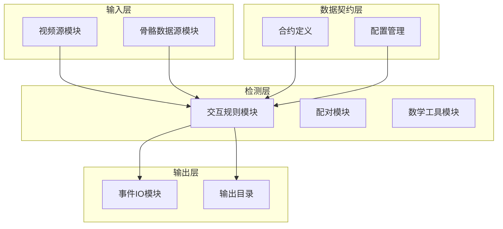
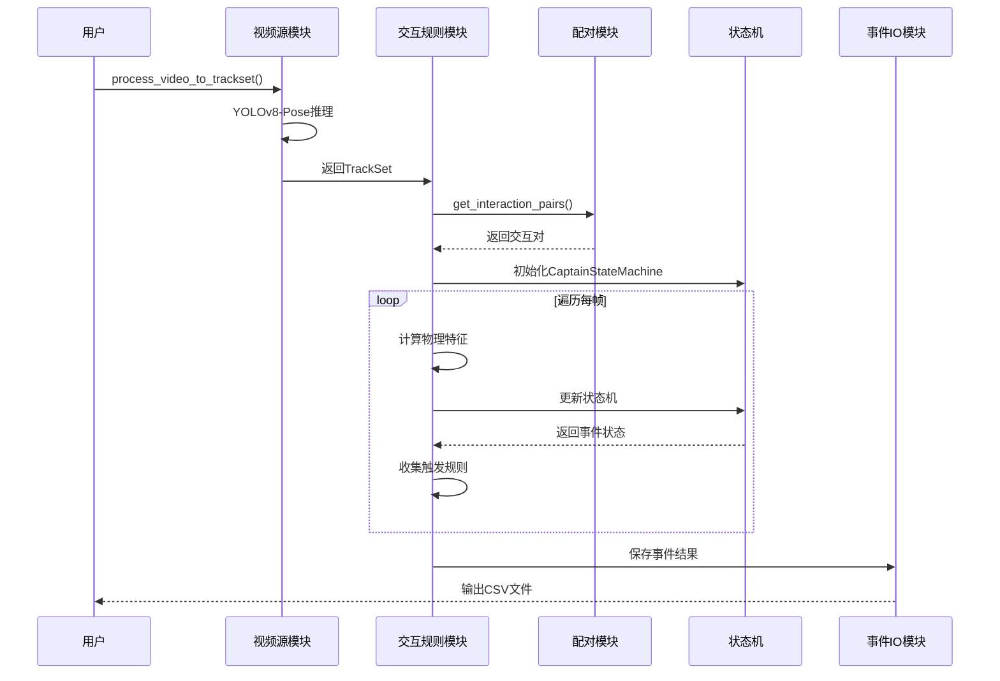
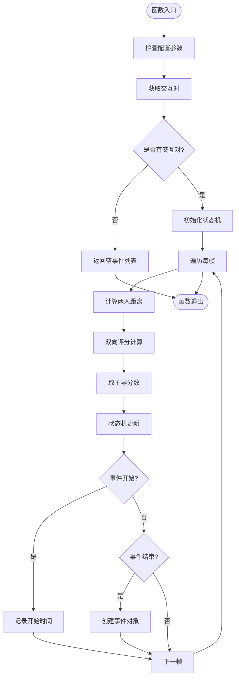
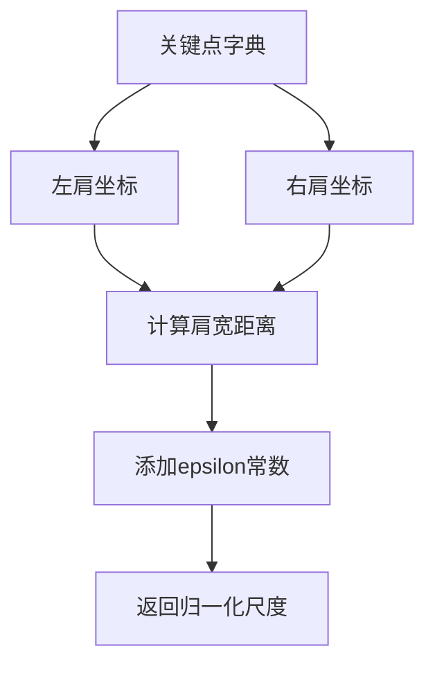
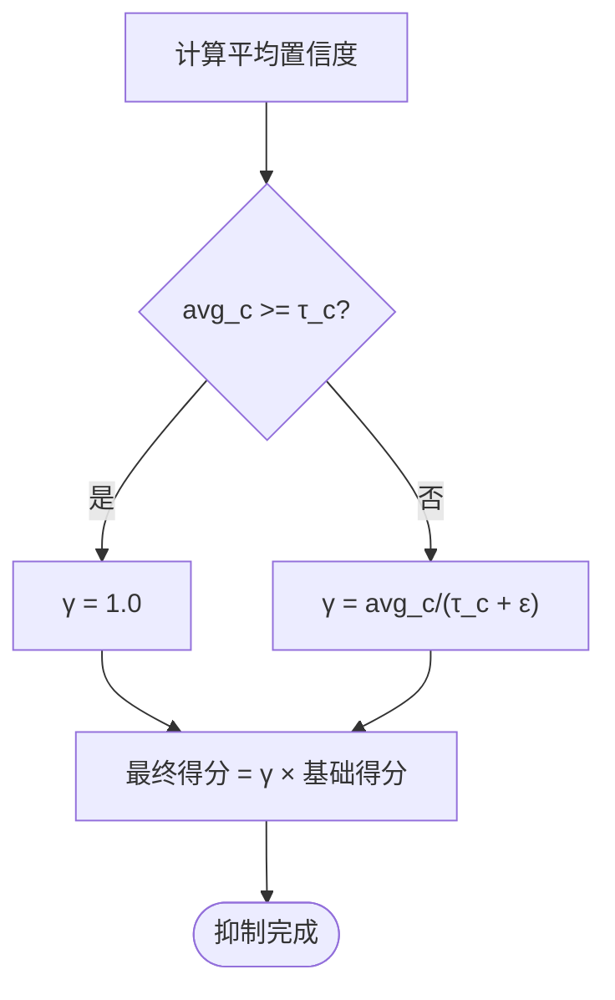
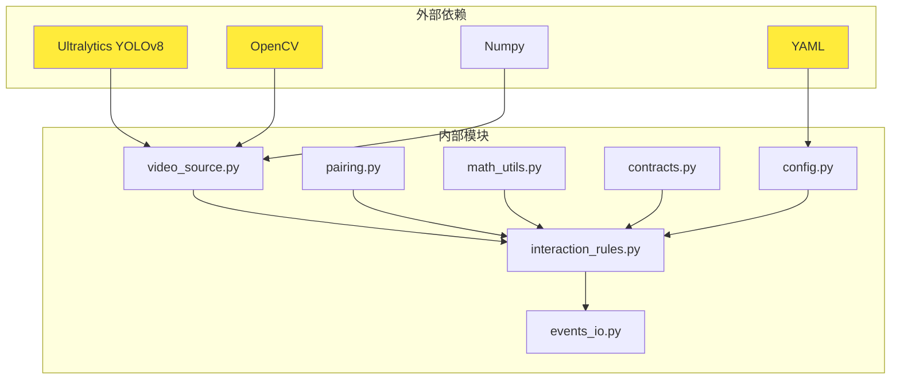

# 冲突检测API

<cite>
**本文档引用的文件**
- [interaction_rules.py](file://src/fightguard/detection/interaction_rules.py)
- [math_utils.py](file://src/fightguard/detection/math_utils.py)
- [pairing.py](file://src/fightguard/detection/pairing.py)
- [contracts.py](file://src/fightguard/contracts.py)
- [config.py](file://src/fightguard/config.py)
- [default.yaml](file://configs/default.yaml)
- [video_source.py](file://src/fightguard/inputs/video_source.py)
- [skeleton_source.py](file://src/fightguard/inputs/skeleton_source.py)
- [events_io.py](file://src/fightguard/reporting/events_io.py)
- [test_skeleton.py](file://test_skeleton.py)
</cite>

## 目录
1. [简介](#简介)
2. [项目结构](#项目结构)
3. [核心组件](#核心组件)
4. [架构概览](#架构概览)
5. [详细组件分析](#详细组件分析)
6. [依赖关系分析](#依赖关系分析)
7. [性能考虑](#性能考虑)
8. [故障排除指南](#故障排除指南)
9. [结论](#结论)
10. [附录](#附录)

## 简介
KidGuard冲突检测API是一个基于物理特征的幼儿冲突检测系统，专门设计用于幼儿园等教育环境中的安全监控。该系统通过分析多人骨骼轨迹的物理特征，使用四段式状态机和规则判定逻辑来识别潜在的冲突行为。

系统的核心功能包括：
- 基于YOLOv8-Pose的骨骼关键点检测
- 多人轨迹配对和距离计算
- 物理特征提取和归一化
- 四段式状态机冲突检测
- 置信度抑制机制
- 事件触发和报告生成

## 项目结构
项目采用模块化设计，主要分为以下几个层次：



**图表来源**
- [video_source.py:1-193](file://src/fightguard/inputs/video_source.py#L1-L193)
- [interaction_rules.py:1-531](file://src/fightguard/detection/interaction_rules.py#L1-L531)
- [contracts.py:1-241](file://src/fightguard/contracts.py#L1-L241)

**章节来源**
- [video_source.py:1-193](file://src/fightguard/inputs/video_source.py#L1-L193)
- [skeleton_source.py:1-331](file://src/fightguard/inputs/skeleton_source.py#L1-L331)
- [interaction_rules.py:1-531](file://src/fightguard/detection/interaction_rules.py#L1-L531)

## 核心组件
本系统的核心组件包括：

### 1. 主检测函数
- `run_rules_on_clip()`: 主要的冲突检测入口函数
- `run_rules_symmetric()`: 兼容旧接口的对称检测函数

### 2. 物理特征提取模块
- 肩宽尺度归一化
- 肢体加速度计算
- 关节角加速度计算
- 躯干倾斜变化计算
- 骨盆速度计算
- 相对接近速度计算

### 3. 状态机模块
- 四段式状态机（接近阶段、动作激活阶段、作用-响应阶段、事件确认阶段）
- 同步因果律实现
- 置信度抑制机制

### 4. 数据结构
- `SkeletonTrack`: 单人多帧骨骼轨迹
- `TrackSet`: 片段内所有人的轨迹集合
- `InteractionEvent`: 冲突事件结构化描述

**章节来源**
- [interaction_rules.py:410-503](file://src/fightguard/detection/interaction_rules.py#L410-L503)
- [contracts.py:96-241](file://src/fightguard/contracts.py#L96-L241)

## 架构概览
系统采用分层架构设计，确保各模块职责明确、耦合度低：



**图表来源**
- [video_source.py:57-193](file://src/fightguard/inputs/video_source.py#L57-L193)
- [interaction_rules.py:410-503](file://src/fightguard/detection/interaction_rules.py#L410-L503)
- [pairing.py:14-54](file://src/fightguard/detection/pairing.py#L14-L54)

## 详细组件分析

### run_rules_on_clip() 函数详解

#### 函数签名和参数
```python
def run_rules_on_clip(track_set: TrackSet, cfg: Optional[dict] = None) -> List[InteractionEvent]:
```

**参数说明：**
- `track_set`: 输入的轨迹集合，包含多个参与者的骨骼轨迹
- `cfg`: 配置字典，可选参数，不提供时使用全局配置

**返回值：**
- `List[InteractionEvent]`: 检测到的冲突事件列表

#### 核心检测流程



**图表来源**
- [interaction_rules.py:410-503](file://src/fightguard/detection/interaction_rules.py#L410-L503)

#### 详细处理步骤

1. **配置参数处理**
   - 如果未提供配置，自动从全局配置中获取
   - 提取规则参数：距离阈值、警报阈值、帧率等

2. **交互对筛选**
   - 使用`get_interaction_pairs()`函数筛选潜在的交互对
   - 基于平均距离和存活时间进行优化

3. **状态机初始化**
   - 为每对交互对象实例化`CaptainStateMachine`
   - 设置状态机参数：接近帧数、冲突帧数、接触帧数等

4. **逐帧处理**
   - 计算两人身体中心距离
   - 双向计算物理特征得分
   - 取主导方向的分数
   - 更新状态机状态

5. **事件生成**
   - 当状态机进入冲突状态时开始记录
   - 收集触发的具体规则
   - 创建`InteractionEvent`对象

**章节来源**
- [interaction_rules.py:410-503](file://src/fightguard/detection/interaction_rules.py#L410-L503)
- [pairing.py:14-54](file://src/fightguard/detection/pairing.py#L14-L54)

### 物理特征提取模块

#### 肩宽尺度归一化


**图表来源**
- [math_utils.py:37-46](file://src/fightguard/detection/math_utils.py#L37-L46)

#### 肢体加速度计算
系统同时计算手腕和脚踝的线加速度，取最大值作为肢体加速度特征。

#### 关节角加速度计算
计算肘部和膝部的角加速度，反映关节运动的动态变化。

#### 躯干倾斜变化
通过颈部和骨盆坐标的倾斜角度变化来检测身体姿态的快速改变。

#### 骨盆速度计算
计算骨盆位置的变化速度，反映身体重心的移动。

**章节来源**
- [interaction_rules.py:57-155](file://src/fightguard/detection/interaction_rules.py#L57-L155)
- [math_utils.py:14-46](file://src/fightguard/detection/math_utils.py#L14-L46)

### 四段式状态机工作原理

#### 状态定义
- **状态0 (初始)**: 系统等待接近阶段
- **状态1 (接近阶段)**: 两人距离小于阈值，进入接近状态
- **状态2 (动作激活阶段)**: 检测到明显的动作特征
- **状态3 (作用-响应阶段)**: 物理链条闭环，确认冲突

#### 同步因果律实现
状态机严格按照同步因果律工作，确保只有在当前帧的瞬间物理量满足条件时才触发状态转换。

```mermaid
stateDiagram-v2
[*] --> 初始
初始 --> 接近阶段 : 距离<threshold & prox_buffer>=W
接近阶段 --> 动作激活阶段 : 检测到动作特征
动作激活阶段 --> 作用-响应阶段 : 物理链条闭环
作用-响应阶段 --> 事件确认阶段 : 平滑分数>阈值
事件确认阶段 --> 初始 : 分离距离>阈值 & sep_buffer>=R
note right of 作用-响应阶段
必须严格同步满足：
- 肢体加速度>τ_a
- 相对接近速度>τ_v
- (躯干倾斜变化>τ_φ OR 骨盆速度>τ_p)
end note
```

**图表来源**
- [interaction_rules.py:258-357](file://src/fightguard/detection/interaction_rules.py#L258-L357)

#### 状态转换条件
- **接近阶段**: 距离小于阈值且接近缓冲帧数达到W
- **动作激活阶段**: 检测到肢体加速度、相对接近速度或关节角加速度超过阈值
- **作用-响应阶段**: 同时满足肢体加速度、相对接近速度和躯干倾斜变化或骨盆速度的条件
- **分离重置**: 距离大于阈值且分离缓冲帧数达到R

**章节来源**
- [interaction_rules.py:258-357](file://src/fightguard/detection/interaction_rules.py#L258-L357)

### 置信度抑制机制

#### 抑制原理
当两人的平均关键点置信度低于阈值τ_c时，使用置信度抑制系数γ来降低最终得分，避免低质量检测导致的误报。

#### 抑制计算


**图表来源**
- [interaction_rules.py:206-246](file://src/fightguard/detection/interaction_rules.py#L206-L246)

**章节来源**
- [interaction_rules.py:206-246](file://src/fightguard/detection/interaction_rules.py#L206-L246)

### 规则判定逻辑

#### 触发规则收集
系统会收集导致冲突事件触发的具体物理特征：

- `high_limb_accel`: 肢体加速度过高
- `high_joint_angular_accel`: 关节角加速度过高  
- `torso_tilt_change`: 躯干倾斜变化过大
- `pelvis_velocity_change`: 骨盆速度变化过大
- `low_confidence_suppressed`: 置信度过低被抑制

#### 阈值设置
所有阈值都通过配置文件进行管理，支持在线调整和优化。

**章节来源**
- [interaction_rules.py:464-474](file://src/fightguard/detection/interaction_rules.py#L464-L474)

## 依赖关系分析



**图表来源**
- [video_source.py:14-26](file://src/fightguard/inputs/video_source.py#L14-L26)
- [config.py:15-17](file://src/fightguard/config.py#L15-L17)

### 模块间依赖关系

| 模块 | 依赖模块 | 用途 |
|------|----------|------|
| interaction_rules.py | contracts.py, config.py, math_utils.py, pairing.py | 主检测逻辑 |
| pairing.py | contracts.py, math_utils.py | 交互对筛选 |
| math_utils.py | 无 | 基础数学计算 |
| video_source.py | contracts.py, config.py | 视频骨骼提取 |
| events_io.py | contracts.py | 事件结果保存 |

**章节来源**
- [interaction_rules.py:16-24](file://src/fightguard/detection/interaction_rules.py#L16-L24)
- [pairing.py:3-4](file://src/fightguard/detection/pairing.py#L3-L4)

## 性能考虑

### 1. 计算复杂度优化

#### 时间复杂度
- **单帧处理**: O(F × N) 其中F为帧数，N为交互对数
- **特征计算**: O(N) 每帧对每个交互对计算5个物理特征
- **状态机更新**: O(1) 每帧常数时间

#### 空间复杂度
- **轨迹存储**: O(T × K) 其中T为总帧数，K为关键点数量
- **状态机缓存**: O(M) 其中M为平滑窗口大小

### 2. 实际优化措施

#### 模型加速
- 使用OpenVINO硬件加速的YOLOv8-Pose模型
- ByteTrack追踪器减少重复检测开销
- 模型缓存避免重复加载

#### 算法优化
- 早期停止：当距离超过阈值时提前终止计算
- 缓冲区优化：合理设置状态机缓冲帧数
- 并行处理：多进程处理不同视频片段

### 3. 内存管理
- 轨迹对齐：确保所有轨迹具有相同长度
- 缺失值处理：使用零向量表示无效关键点
- 配置缓存：避免重复读取配置文件

**章节来源**
- [video_source.py:41-49](file://src/fightguard/inputs/video_source.py#L41-L49)
- [config.py:22-22](file://src/fightguard/config.py#L22-L22)

## 故障排除指南

### 常见问题及解决方案

#### 1. 检测不到任何事件
**可能原因：**
- 阈值设置过高
- 轨迹质量差，关键点置信度过低
- 视频分辨率过低

**解决方法：**
- 降低`alert_threshold`和`proximity_threshold`
- 检查摄像头安装高度和角度
- 调整视频曝光和对比度

#### 2. 误报过多
**可能原因：**
- 置信度抑制阈值设置不当
- 状态机参数过于敏感
- 环境光线变化影响检测

**解决方法：**
- 调整`tau_c`阈值
- 增加`R`和`M`参数
- 添加环境光照补偿

#### 3. 性能问题
**可能原因：**
- 视频分辨率过高
- 模型推理速度慢
- 内存不足

**解决方法：**
- 降低视频分辨率
- 使用OpenVINO加速
- 增加系统内存

### 调试工具

#### 诊断模式
系统提供了详细的诊断功能，可以分析视频中的物理特征极值：

```python
# 诊断最小距离
min_dist = compute_pair_distance_at_frame(a, b, fi)

# 诊断最大加速度
_, details = compute_frame_score(a, b, fi, cfg, dt)
max_accel = details.get("a_A", 0.0)
```

**章节来源**
- [test_skeleton.py:44-71](file://test_skeleton.py#L44-L71)

## 结论
KidGuard冲突检测API提供了一个完整、高效的幼儿冲突检测解决方案。通过结合物理特征分析和四段式状态机，系统能够在复杂的多人交互场景中准确识别潜在的冲突行为。

### 主要优势
1. **物理基础**: 基于真实的物理特征，减少误报
2. **实时性**: 优化的算法设计支持实时检测
3. **可解释性**: 详细的规则触发信息便于调试和优化
4. **可配置性**: 完善的参数配置支持不同场景的适配

### 应用建议
- 根据具体应用场景调整阈值参数
- 结合教师监督提高检测准确性
- 定期更新模型和算法以适应新的行为模式
- 建立完善的事件响应机制

## 附录

### API使用示例

#### 基本使用流程
```python
# 1. 加载配置
cfg = get_config()

# 2. 处理视频获取轨迹
track_set = process_video_to_trackset(video_path, label=1, cfg=cfg)

# 3. 运行冲突检测
events = run_rules_on_clip(track_set, cfg)

# 4. 处理检测结果
for event in events:
    print(f"发现冲突: {event.score}分, 触发规则: {event.triggered_rules}")
```

#### 高级配置
```python
# 针对真实2D监控视频的参数调整
cfg["rules"]["proximity_window_frames"] = 2
cfg["rules"]["smoothing_window_frames"] = 2
cfg["rules"]["alert_threshold"] = 0.20
```

### 配置参数说明

| 参数名 | 类型 | 默认值 | 说明 |
|--------|------|--------|------|
| alert_threshold | float | 0.3 | 事件确认阈值 |
| proximity_threshold | float | 0.5 | 距离阈值 |
| tau_c | float | 0.5 | 置信度抑制阈值 |
| W | int | 5 | 接近阶段缓冲帧数 |
| R | int | 8 | 分离重置缓冲帧数 |
| M | int | 5 | 平滑窗口大小 |

**章节来源**
- [default.yaml:16-30](file://configs/default.yaml#L16-L30)
- [test_skeleton.py:16-21](file://test_skeleton.py#L16-L21)