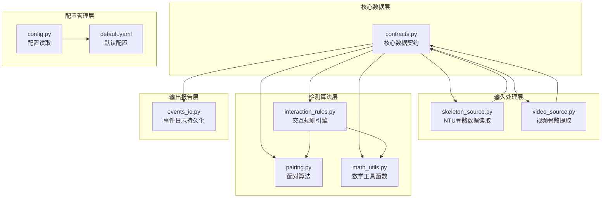
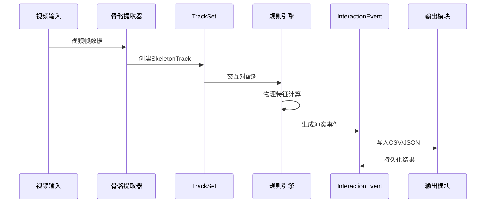
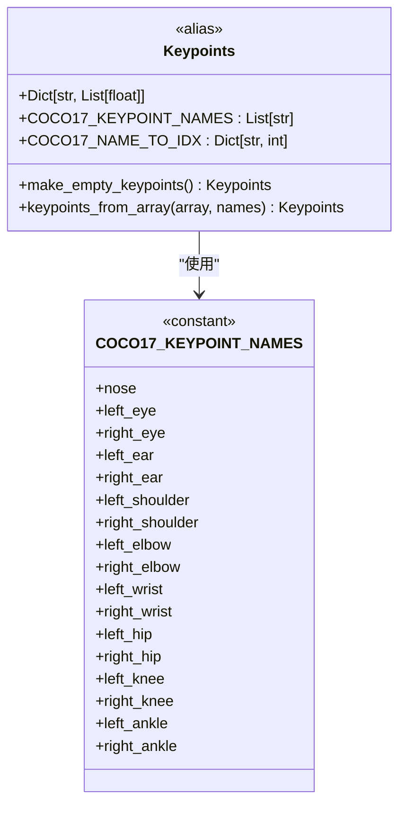
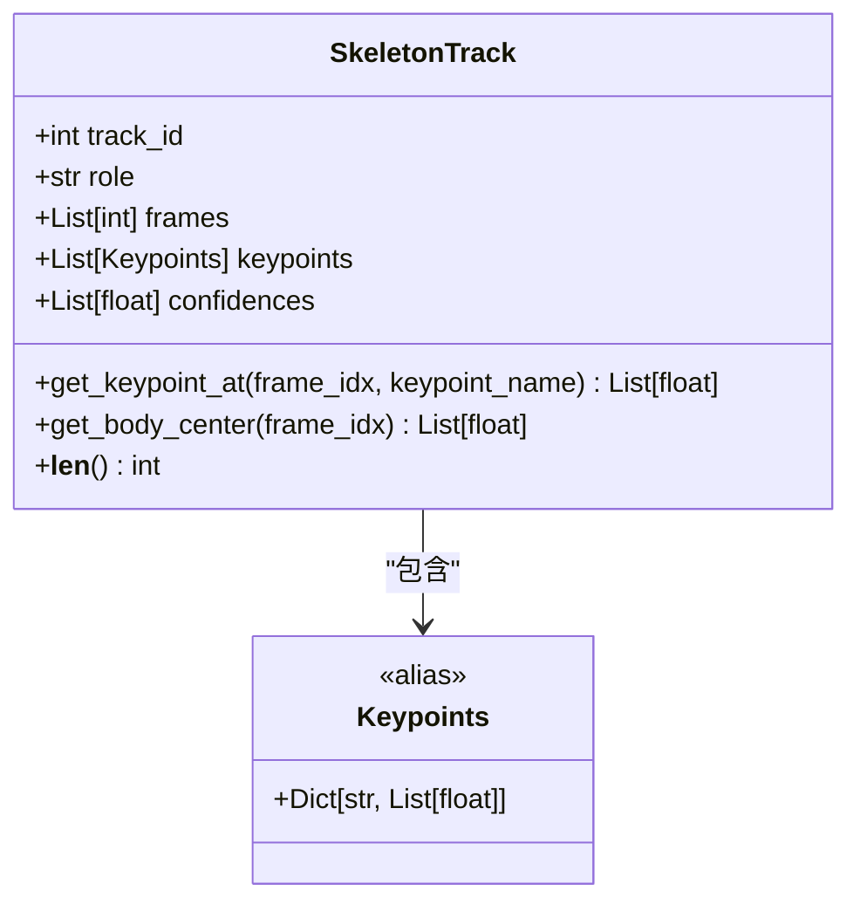
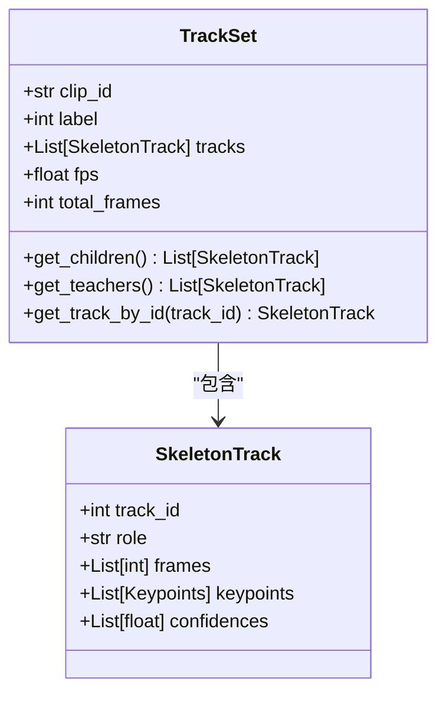
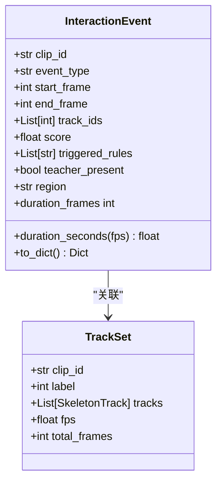
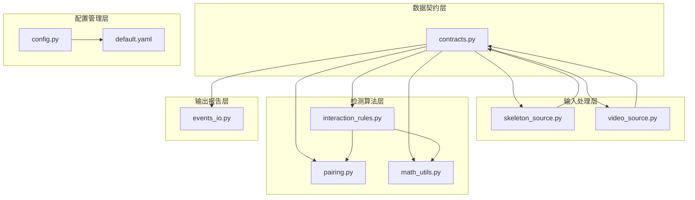
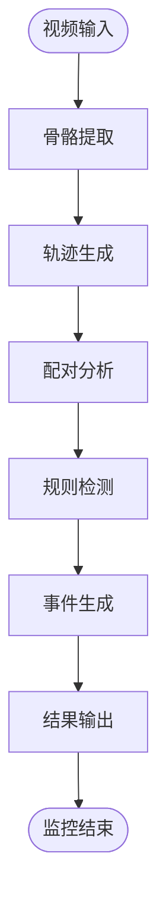
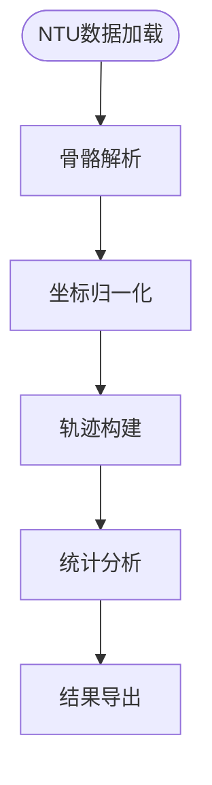

# 核心数据结构API

<cite>
**本文档引用的文件**
- [contracts.py](file://src/fightguard/contracts.py)
- [interaction_rules.py](file://src/fightguard/detection/interaction_rules.py)
- [skeleton_source.py](file://src/fightguard/inputs/skeleton_source.py)
- [video_source.py](file://src/fightguard/inputs/video_source.py)
- [pairing.py](file://src/fightguard/detection/pairing.py)
- [math_utils.py](file://src/fightguard/detection/math_utils.py)
- [events_io.py](file://src/fightguard/reporting/events_io.py)
- [config.py](file://src/fightguard/config.py)
- [default.yaml](file://configs/default.yaml)
- [test_skeleton.py](file://test_skeleton.py)
</cite>

## 目录
1. [简介](#简介)
2. [项目结构](#项目结构)
3. [核心组件](#核心组件)
4. [架构概览](#架构概览)
5. [详细组件分析](#详细组件分析)
6. [依赖关系分析](#依赖关系分析)
7. [性能考虑](#性能考虑)
8. [故障排除指南](#故障排除指南)
9. [结论](#结论)
10. [附录](#附录)

## 简介
本文件详细介绍了KidGuard项目的核心数据结构API，包括Keypoints、SkeletonTrack、TrackSet和InteractionEvent四个核心数据契约类。这些数据结构构成了整个冲突检测系统的数据基础，确保了数据的一致性、可操作性和可扩展性。

KidGuard项目专注于幼儿园冲突风险监测，通过计算机视觉技术实时分析视频中儿童的行为模式，识别潜在的冲突行为并发出预警。系统采用统一的数据契约设计，确保各个模块间的数据传递规范一致。

## 项目结构
项目采用模块化架构设计，核心数据结构位于contracts.py文件中，其他功能模块围绕这些数据结构进行扩展和应用。



**图表来源**
- [contracts.py:1-241](file://src/fightguard/contracts.py#L1-L241)
- [skeleton_source.py:1-331](file://src/fightguard/inputs/skeleton_source.py#L1-L331)
- [video_source.py:1-193](file://src/fightguard/inputs/video_source.py#L1-L193)
- [interaction_rules.py:1-531](file://src/fightguard/detection/interaction_rules.py#L1-L531)

**章节来源**
- [contracts.py:1-241](file://src/fightguard/contracts.py#L1-L241)
- [config.py:1-120](file://src/fightguard/config.py#L1-L120)

## 核心组件
本节详细介绍四个核心数据结构类的属性、方法和使用方式。

### Keypoints数据契约
Keypoints是单帧单人的骨骼关键点字典，采用COCO-17标准命名规范。

**字段定义**：
- 类型别名：`Dict[str, List[float]]`
- 关键点名称：nose, left_eye, right_eye, left_ear, right_ear, left_shoulder, right_shoulder, left_elbow, right_elbow, left_wrist, right_wrist, left_hip, right_hip, left_knee, right_knee, left_ankle, right_ankle
- 坐标格式：[x, y] 归一化坐标，相对于画面宽高
- 置信度：可选第三维，表示关键点的置信度

**关键方法**：
- `make_empty_keypoints()`: 生成空白关键点字典
- `keypoints_from_array()`: 将数组格式转换为字典格式

**使用示例**：
```python
# 创建空白关键点
empty_kp = make_empty_keypoints()

# 从数组转换
kp_dict = keypoints_from_array(raw_array, COCO17_KEYPOINT_NAMES)

# 访问坐标
x_coord = kp_dict["left_wrist"][0]
y_coord = kp_dict["left_wrist"][1]
```

**约束条件**：
- 所有关键点名称必须来自COCO-17标准
- 坐标值应在[0,1]范围内
- 置信度值应在[0,1]范围内

### SkeletonTrack数据契约
SkeletonTrack表示单人在一段时间内的骨骼轨迹，是系统的核心数据结构之一。

**属性定义**：
- `track_id: int` - 人员唯一标识
- `role: str` - 角色标签，默认"child"，可选"teacher"
- `frames: List[int]` - 帧索引列表
- `keypoints: List[Keypoints]` - 每帧对应的关键点字典列表
- `confidences: List[float]` - 每帧的整体置信度列表

**关键方法**：
- `get_keypoint_at(frame_idx, keypoint_name)`: 获取指定帧、指定关键点的坐标
- `get_body_center(frame_idx)`: 计算指定帧的躯干中心点
- `__len__()`: 返回轨迹长度

**使用示例**：
```python
# 获取特定帧的坐标
coord = track.get_keypoint_at(10, "left_wrist")

# 计算躯干中心
center = track.get_body_center(5)

# 获取轨迹长度
length = len(track)
```

**约束条件**：
- `frames`、`keypoints`、`confidences`列表长度必须相等
- 帧索引必须按递增顺序排列
- 关键点坐标必须符合Keypoints约束

### TrackSet数据契约
TrackSet表示一个视频片段内所有被检测到的人的轨迹集合。

**属性定义**：
- `clip_id: str` - 片段唯一标识
- `label: int` - 片段级标签，默认-1，1=冲突，0=正常
- `tracks: List[SkeletonTrack]` - 所有人的轨迹列表
- `fps: float` - 视频帧率，默认30.0
- `total_frames: int` - 片段总帧数

**关键方法**：
- `get_children()`: 返回所有角色为'child'的轨迹
- `get_teachers()`: 返回所有角色为'teacher'的轨迹
- `get_track_by_id(track_id)`: 根据track_id查找轨迹

**使用示例**：
```python
# 获取所有儿童轨迹
children = track_set.get_children()

# 根据ID查找轨迹
track = track_set.get_track_by_id(123)

# 获取标签
label = track_set.label
```

**约束条件**：
- `tracks`列表不能为空
- 所有轨迹必须属于同一片段
- 帧率必须为正数

### InteractionEvent数据契约
InteractionEvent表示一次被规则流检测到的交互事件。

**属性定义**：
- `clip_id: str` - 来源片段ID
- `event_type: str` - 事件类型，如"child_conflict"
- `start_frame: int` - 事件开始帧
- `end_frame: int` - 事件结束帧
- `track_ids: List[int]` - 涉及的人员track_id列表
- `score: float` - 规则触发的置信度分数，默认0.0
- `triggered_rules: List[str]` - 触发的具体规则列表
- `teacher_present: bool` - 事件发生时教师是否在场，默认False
- `region: str` - 事件发生的功能区域，默认"unknown"

**关键方法**：
- `duration_frames`: 事件持续帧数属性
- `duration_seconds(fps)`: 事件持续秒数
- `to_dict()`: 转换为字典格式用于持久化

**使用示例**：
```python
# 计算事件持续时间
duration = event.duration_frames
seconds = event.duration_seconds(30.0)

# 转换为字典
event_dict = event.to_dict()
```

**约束条件**：
- `start_frame` ≤ `end_frame`
- `track_ids`列表不能为空
- `score`值应在[0,1]范围内

**章节来源**
- [contracts.py:56-241](file://src/fightguard/contracts.py#L56-L241)

## 架构概览
系统采用分层架构设计，核心数据结构贯穿整个数据流。



**图表来源**
- [video_source.py:57-193](file://src/fightguard/inputs/video_source.py#L57-L193)
- [interaction_rules.py:410-503](file://src/fightguard/detection/interaction_rules.py#L410-L503)
- [events_io.py:12-36](file://src/fightguard/reporting/events_io.py#L12-L36)

## 详细组件分析

### Keypoints类分析
Keypoints采用字典结构存储关键点信息，确保了数据的灵活性和易用性。



**图表来源**
- [contracts.py:24-90](file://src/fightguard/contracts.py#L24-L90)

**实现特点**：
- 使用COCO-17标准确保跨平台兼容性
- 支持置信度信息的扩展存储
- 提供便捷的转换函数

### SkeletonTrack类分析
SkeletonTrack是系统的核心数据载体，承载着单人多帧的完整轨迹信息。



**图表来源**
- [contracts.py:96-148](file://src/fightguard/contracts.py#L96-L148)

**关键特性**：
- 时间序列数据结构，支持帧间关联
- 提供便捷的查询接口
- 支持躯干中心计算用于距离分析

### TrackSet类分析
TrackSet管理一个片段内的所有轨迹，是多目标跟踪的核心容器。



**图表来源**
- [contracts.py:154-186](file://src/fightguard/contracts.py#L154-L186)

**设计优势**：
- 统一管理多目标轨迹
- 提供角色分类功能
- 支持片段级标签管理

### InteractionEvent类分析
InteractionEvent封装了检测到的冲突事件信息，用于后续分析和报告。



**图表来源**
- [contracts.py:192-241](file://src/fightguard/contracts.py#L192-L241)

**数据完整性**：
- 包含完整的事件描述信息
- 支持可解释性分析
- 提供标准化的输出格式

## 依赖关系分析



**图表来源**
- [contracts.py:1-241](file://src/fightguard/contracts.py#L1-L241)
- [interaction_rules.py:16-24](file://src/fightguard/detection/interaction_rules.py#L16-L24)

**依赖特点**：
- 所有模块都依赖于contracts.py中的数据契约
- 检测算法模块相互协作形成完整的规则引擎
- 输入输出模块独立于核心算法逻辑

**章节来源**
- [interaction_rules.py:16-24](file://src/fightguard/detection/interaction_rules.py#L16-L24)

## 性能考虑

### 数据结构优化
1. **内存效率**：使用dataclass减少内存开销
2. **访问速度**：提供直接的属性访问接口
3. **序列化**：支持高效的字典转换

### 算法性能
1. **特征计算**：采用向量化操作提高计算效率
2. **状态机**：使用滑动窗口减少重复计算
3. **配对算法**：优化的时间复杂度O(n²)

### 实际应用场景

#### 视频监控场景


**图表来源**
- [video_source.py:57-193](file://src/fightguard/inputs/video_source.py#L57-L193)
- [interaction_rules.py:410-503](file://src/fightguard/detection/interaction_rules.py#L410-L503)

#### 数据集分析场景


**图表来源**
- [skeleton_source.py:211-274](file://src/fightguard/inputs/skeleton_source.py#L211-L274)

## 故障排除指南

### 常见问题及解决方案

#### 数据格式错误
**问题**：关键点坐标超出范围
**解决方案**：检查坐标归一化过程，确保值在[0,1]范围内

#### 内存不足
**问题**：长时间视频导致内存溢出
**解决方案**：使用分批处理策略，及时释放不再使用的数据

#### 性能问题
**问题**：规则引擎运行缓慢
**解决方案**：优化配对算法，使用更高效的数据结构

### 调试技巧
1. **配置验证**：使用`get_config()`确保配置正确加载
2. **数据检查**：定期验证关键点坐标的合理性
3. **性能监控**：监控内存使用和处理时间

**章节来源**
- [config.py:32-82](file://src/fightguard/config.py#L32-L82)

## 结论
KidGuard项目的核心数据结构API设计合理，具有以下特点：

1. **一致性**：统一的数据契约确保各模块间的数据交换规范
2. **可扩展性**：模块化设计支持功能扩展和算法改进
3. **实用性**：针对实际应用场景优化，满足幼儿园冲突检测需求
4. **可靠性**：完善的错误处理和配置管理机制

这些数据结构为整个系统的稳定运行奠定了坚实基础，为后续的功能扩展和性能优化提供了良好的支撑。

## 附录

### 最佳实践建议
1. **数据验证**：始终验证关键点坐标的有效性
2. **内存管理**：及时清理不再使用的数据结构
3. **配置管理**：使用统一的配置接口，避免硬编码
4. **错误处理**：建立完善的异常处理机制

### 常见错误避免
1. **索引越界**：在访问轨迹数据前检查边界条件
2. **类型不匹配**：确保数据类型与预期一致
3. **内存泄漏**：及时释放大型数据结构的引用
4. **配置错误**：使用配置验证函数确保配置正确性

### 性能优化建议
1. **算法优化**：考虑使用更高效的配对和检测算法
2. **并行处理**：利用多核CPU进行并行计算
3. **缓存策略**：合理使用缓存减少重复计算
4. **内存池**：对于大量相似对象考虑使用对象池