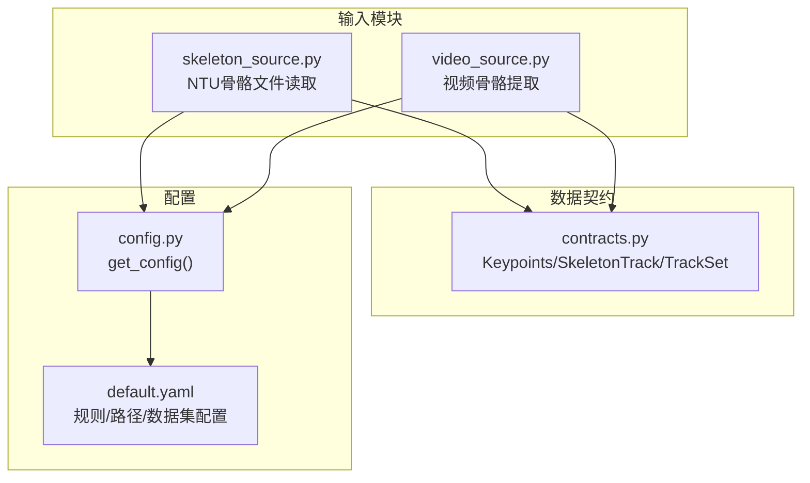
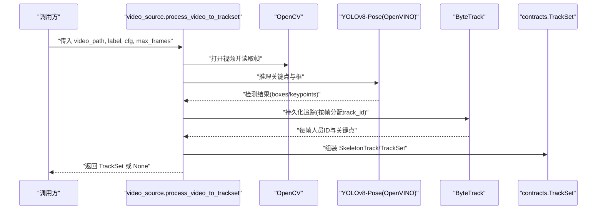
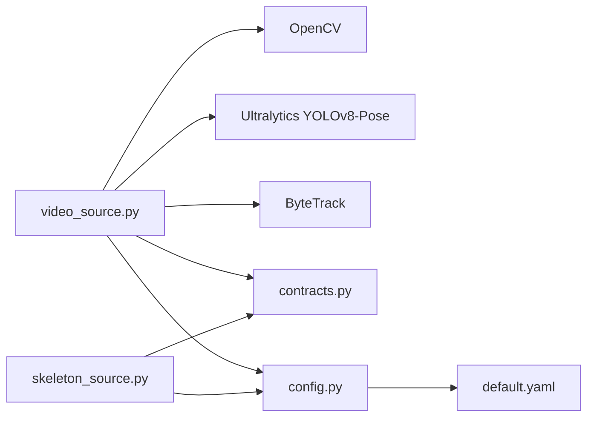
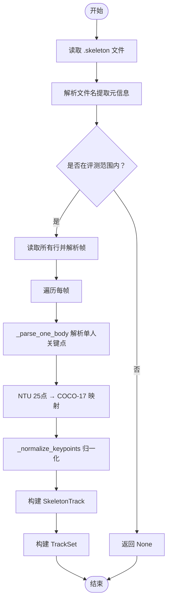

# 输入处理API

<cite>
**本文引用的文件**
- [skeleton_source.py](file://src/fightguard/inputs/skeleton_source.py)
- [video_source.py](file://src/fightguard/inputs/video_source.py)
- [contracts.py](file://src/fightguard/contracts.py)
- [config.py](file://src/fightguard/config.py)
- [default.yaml](file://configs/default.yaml)
- [test_skeleton.py](file://test_skeleton.py)
- [eval_video_dataset.py](file://scripts/eval_video_dataset.py)
- [debug_single_video.py](file://scripts/debug_single_video.py)
- [README.md](file://README.md)
</cite>

## 目录
1. [简介](#简介)
2. [项目结构](#项目结构)
3. [核心组件](#核心组件)
4. [架构总览](#架构总览)
5. [详细组件分析](#详细组件分析)
6. [依赖分析](#依赖分析)
7. [性能考虑](#性能考虑)
8. [故障排查指南](#故障排查指南)
9. [结论](#结论)
10. [附录](#附录)

## 简介
本文件面向“输入处理API”的使用者，系统性说明两类输入数据的处理流程与API：
- 骨骼数据读取API：load_skeleton_file()
- 视频数据处理API：process_video_to_trackset()

文档涵盖参数类型、返回值格式、异常处理机制、数据预处理与格式转换、错误处理策略、性能优化建议，以及实际使用场景与最佳实践。

## 项目结构
输入处理API位于 fightguard.inputs 包中，配合 contracts.py 的数据契约与 config.py 的配置读取模块共同工作。核心文件如下：
- 输入模块：skeleton_source.py、video_source.py
- 数据契约：contracts.py（定义 Keypoints、SkeletonTrack、TrackSet 等）
- 配置读取：config.py（统一读取 configs/default.yaml）
- 配置文件：default.yaml（规则阈值、数据集类别、路径等）

图表来源
- [skeleton_source.py:1-331](file://src/fightguard/inputs/skeleton_source.py#L1-L331)
- [video_source.py:1-193](file://src/fightguard/inputs/video_source.py#L1-L193)
- [contracts.py:1-241](file://src/fightguard/contracts.py#L1-L241)
- [config.py:1-120](file://src/fightguard/config.py#L1-L120)
- [default.yaml:1-62](file://configs/default.yaml#L1-L62)

章节来源
- [README.md:46-76](file://README.md#L46-L76)

## 核心组件
- Keypoints：单帧单人的关键点字典，键为 COCO-17 名称，值为 [x, y] 或 [x, y, conf]。
- SkeletonTrack：单人多帧骨骼轨迹，包含 frames 与 keypoints 列表。
- TrackSet：一个片段内所有人的轨迹集合，包含 clip_id、label、tracks、fps、total_frames。

章节来源
- [contracts.py:56-171](file://src/fightguard/contracts.py#L56-L171)

## 架构总览
输入处理API的调用链如下：
- load_skeleton_file()：读取 .skeleton 文件，解析帧与关键点，按 COCO-17 标准归一化，构建 TrackSet。
- process_video_to_trackset()：读取视频，YOLOv8-Pose 推理，ByteTrack 追踪，按帧对齐构建 TrackSet。

图表来源
- [video_source.py:57-193](file://src/fightguard/inputs/video_source.py#L57-L193)

## 详细组件分析

### API：load_skeleton_file(filepath, cfg=None) → Optional[TrackSet]
- 功能概述
  - 读取单个 NTU RGBD .skeleton 文件，解析帧结构与关键点，按 COCO-17 标准构建 TrackSet。
  - 依据文件名解析动作类别，结合配置判断是否属于评测范围（label=1/0/-1），非评测范围返回 None。
- 参数
  - filepath: str，.skeleton 文件完整路径
  - cfg: Optional[dict]，配置字典；未提供时内部调用 get_config()
- 返回值
  - Optional[TrackSet]：成功返回 TrackSet；若 label=-1（不在评测范围）返回 None
- 异常处理
  - 文件名格式不符合 NTU 标准时抛出 ValueError
  - 读取文件失败时由外层调用方捕获异常并记录
- 数据预处理与格式转换
  - 从文件名提取 clip_id、setup、camera、subject、repeat、action_id
  - 根据 action_id 判断 label（冲突/正常/其他）
  - 解析每帧关键点，按映射表将 NTU 25点映射到 COCO-17 名称
  - 对有效关键点进行 min-max 归一化至 [0,1]，缺失点置零
  - 每个文件最多两人的骨骼轨迹，按 body_no 分配 track_id
- 使用示例（路径）
  - 读取单个 .skeleton 文件并构建 TrackSet：[skeleton_source.py:211-274](file://src/fightguard/inputs/skeleton_source.py#L211-L274)
  - 批量读取目录下所有 .skeleton 文件：[skeleton_source.py:281-330](file://src/fightguard/inputs/skeleton_source.py#L281-L330)
- 最佳实践
  - 优先使用 get_config() 获取配置，避免硬编码阈值与类别
  - 对于大规模数据集，建议分批读取并记录跳过统计
  - 若需调试，可限制 max_clips 控制读取数量

章节来源
- [skeleton_source.py:64-114](file://src/fightguard/inputs/skeleton_source.py#L64-L114)
- [skeleton_source.py:120-205](file://src/fightguard/inputs/skeleton_source.py#L120-L205)
- [skeleton_source.py:211-274](file://src/fightguard/inputs/skeleton_source.py#L211-L274)
- [skeleton_source.py:281-330](file://src/fightguard/inputs/skeleton_source.py#L281-L330)
- [contracts.py:23-47](file://src/fightguard/contracts.py#L23-L47)
- [config.py:32-82](file://src/fightguard/config.py#L32-L82)
- [default.yaml:1-62](file://configs/default.yaml#L1-L62)

### API：process_video_to_trackset(video_path, label=-1, cfg=None, max_frames=None) → Optional[TrackSet]
- 功能概述
  - 读取视频文件，使用 YOLOv8-Pose（OpenVINO 加速）逐帧提取人体关键点，ByteTrack 追踪人员，构建 TrackSet。
- 参数
  - video_path: str，视频文件路径
  - label: int，默认 -1，通常传入 1（冲突）或 0（正常）
  - cfg: Optional[dict]，配置字典；未提供时内部调用 get_config()
  - max_frames: Optional[int]，调试用，限制最多处理帧数
- 返回值
  - Optional[TrackSet]：若视频无法打开或未检测到人，返回 None；否则返回 TrackSet
- 异常处理
  - 视频打开失败：返回 None 并打印错误日志
  - 未检测到人：返回 None 并打印警告日志
  - 模型加载失败：由 YOLO/Tracer 抛出异常，建议在外层捕获并记录
- 数据预处理与格式转换
  - 读取视频元信息（fps、宽高、总帧数），受 max_frames 影响
  - 每帧推理关键点，提取 COCO-17 17个点的 (x, y) 与置信度 conf
  - 使用 ByteTrack 持久化追踪，按帧分配 track_id
  - 时空绝对对齐：将所有轨迹填充到相同总帧数，确保 track.keypoints[i] 对应物理第 i 帧
  - 构建 SkeletonTrack 与 TrackSet
- 使用示例（路径）
  - 单视频演示：[test_skeleton.py:22-41](file://test_skeleton.py#L22-L41)
  - 批量评测与实时秒表：[eval_video_dataset.py:84-102](file://scripts/eval_video_dataset.py#L84-L102)
  - 诊断漏报视频：[debug_single_video.py:36-50](file://scripts/debug_single_video.py#L36-L50)
- 最佳实践
  - 针对真实监控视频，建议缩短 proximity_window_frames 与 smoothing_window_frames，降低阈值以提升敏感度
  - 使用 max_frames 限制单次处理时长，便于快速迭代
  - 若视频中人物较少或遮挡严重，可适当降低 conf 阈值（注意：当前代码中 conf=0.2 用于 ByteTrack）

章节来源
- [video_source.py:57-193](file://src/fightguard/inputs/video_source.py#L57-L193)
- [contracts.py:96-171](file://src/fightguard/contracts.py#L96-L171)
- [config.py:32-82](file://src/fightguard/config.py#L32-L82)
- [default.yaml:16-30](file://configs/default.yaml#L16-L30)
- [test_skeleton.py:22-41](file://test_skeleton.py#L22-L41)
- [eval_video_dataset.py:84-102](file://scripts/eval_video_dataset.py#L84-L102)
- [debug_single_video.py:36-50](file://scripts/debug_single_video.py#L36-L50)

## 依赖分析
- 模块耦合
  - inputs.* 依赖 contracts.py 的数据契约，确保跨模块数据格式一致
  - inputs.* 依赖 config.py 的 get_config() 获取配置，避免硬编码
  - video_source.py 依赖 OpenCV 与 YOLOv8-Pose（OpenVINO 加速），并使用 ByteTrack 进行追踪
- 外部依赖
  - OpenCV：视频读取与属性查询
  - Ultralytics YOLOv8-Pose：骨骼关键点检测
  - ByteTrack：人员轨迹持久化追踪
- 配置依赖
  - default.yaml 提供规则阈值、路径、数据集类别等

图表来源
- [video_source.py:14-49](file://src/fightguard/inputs/video_source.py#L14-L49)
- [skeleton_source.py:18-29](file://src/fightguard/inputs/skeleton_source.py#L18-L29)
- [config.py:32-82](file://src/fightguard/config.py#L32-L82)
- [default.yaml:1-62](file://configs/default.yaml#L1-L62)

章节来源
- [video_source.py:14-49](file://src/fightguard/inputs/video_source.py#L14-L49)
- [skeleton_source.py:18-29](file://src/fightguard/inputs/skeleton_source.py#L18-L29)
- [config.py:32-82](file://src/fightguard/config.py#L32-L82)
- [default.yaml:1-62](file://configs/default.yaml#L1-L62)

## 性能考虑
- 模型加速
  - 使用 OpenVINO 加速的 YOLOv8-Pose 模型，显著降低推理延迟
- 追踪策略
  - 采用 ByteTrack 追踪器，对低分检测框更鲁棒，适合多人重叠场景
- 视频处理优化
  - 使用 max_frames 限制帧数，避免长时间视频带来的内存与时间压力
  - 仅在必要时加载模型，避免重复初始化
- 数据对齐
  - 通过“时空绝对对齐”将轨迹填充到相同总帧数，减少后续配对与评分的复杂度
- 批量处理
  - skeleton_source.load_dataset() 支持目录批量读取，建议分批处理并记录跳过统计

章节来源
- [video_source.py:41-49](file://src/fightguard/inputs/video_source.py#L41-L49)
- [video_source.py:94-96](file://src/fightguard/inputs/video_source.py#L94-L96)
- [video_source.py:115-118](file://src/fightguard/inputs/video_source.py#L115-L118)
- [video_source.py:167-181](file://src/fightguard/inputs/video_source.py#L167-L181)
- [skeleton_source.py:281-330](file://src/fightguard/inputs/skeleton_source.py#L281-L330)

## 故障排查指南
- 常见问题与定位
  - 视频无法打开：检查路径是否存在、权限是否足够、编解码器是否可用
  - 未检测到人：确认摄像头角度、光照条件、遮挡情况；适当降低 conf 阈值（当前代码中 conf=0.2）
  - 骨骼提取失败：确认 YOLO 模型已正确安装与加载；检查 OpenVINO 环境
  - 文件名不符合 NTU 标准：确保 .skeleton 文件名为 S001C001P001R001A049.skeleton 格式
  - 配置文件缺失或字段不全：检查 configs/default.yaml 是否存在且包含必需字段
- 调试工具
  - 单视频诊断脚本：[debug_single_video.py:18-81](file://scripts/debug_single_video.py#L18-L81)，逐帧打印状态机与关键指标
  - 批量评测脚本：[eval_video_dataset.py:24-132](file://scripts/eval_video_dataset.py#L24-L132)，带实时秒表线程，便于长时间评测
  - 演示脚本：[test_skeleton.py:9-94](file://test_skeleton.py#L9-L94)，展示从视频提取骨骼并进入规则引擎的完整流程

章节来源
- [video_source.py:80-84](file://src/fightguard/inputs/video_source.py#L80-L84)
- [video_source.py:163-165](file://src/fightguard/inputs/video_source.py#L163-L165)
- [skeleton_source.py:64-89](file://src/fightguard/inputs/skeleton_source.py#L64-L89)
- [config.py:60-82](file://src/fightguard/config.py#L60-L82)
- [debug_single_video.py:18-81](file://scripts/debug_single_video.py#L18-L81)
- [eval_video_dataset.py:24-132](file://scripts/eval_video_dataset.py#L24-L132)
- [test_skeleton.py:9-94](file://test_skeleton.py#L9-L94)

## 结论
- load_skeleton_file() 适用于 NTU RGBD 数据集的骨骼轨迹读取与预处理，返回标准化的 TrackSet，便于后续规则判定与配对。
- process_video_to_trackset() 适用于真实监控视频的骨骼提取与轨迹构建，结合 ByteTrack 追踪与时空对齐，确保轨迹完整性与时序一致性。
- 两者均遵循统一的数据契约（contracts.py）与配置读取（config.py），具备良好的可维护性与可扩展性。

## 附录

### API 参数与返回值一览
- load_skeleton_file
  - 参数：filepath: str，cfg: Optional[dict]
  - 返回：Optional[TrackSet]
  - 异常：文件名格式错误时抛出 ValueError
- process_video_to_trackset
  - 参数：video_path: str，label: int，cfg: Optional[dict]，max_frames: Optional[int]
  - 返回：Optional[TrackSet]
  - 异常：视频打开失败或未检测到人时返回 None；模型/追踪异常由外层捕获

章节来源
- [skeleton_source.py:211-274](file://src/fightguard/inputs/skeleton_source.py#L211-L274)
- [video_source.py:57-193](file://src/fightguard/inputs/video_source.py#L57-L193)

### 数据预处理与格式转换流程图

图表来源
- [skeleton_source.py:211-274](file://src/fightguard/inputs/skeleton_source.py#L211-L274)
- [skeleton_source.py:120-205](file://src/fightguard/inputs/skeleton_source.py#L120-L205)