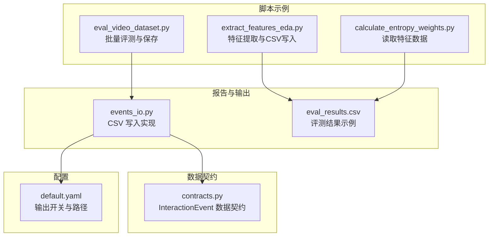
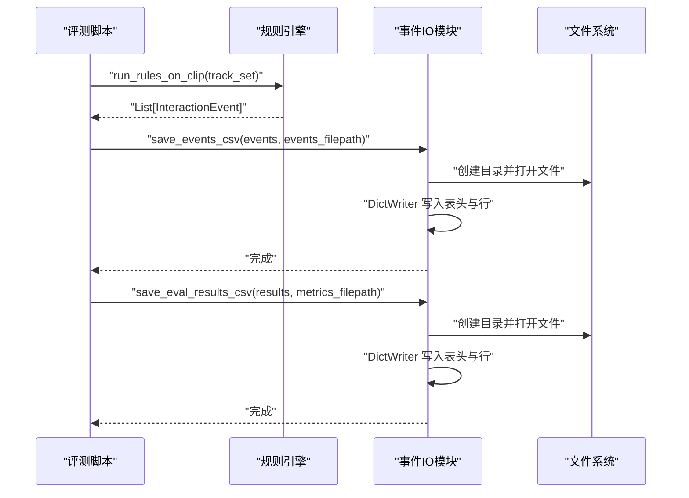
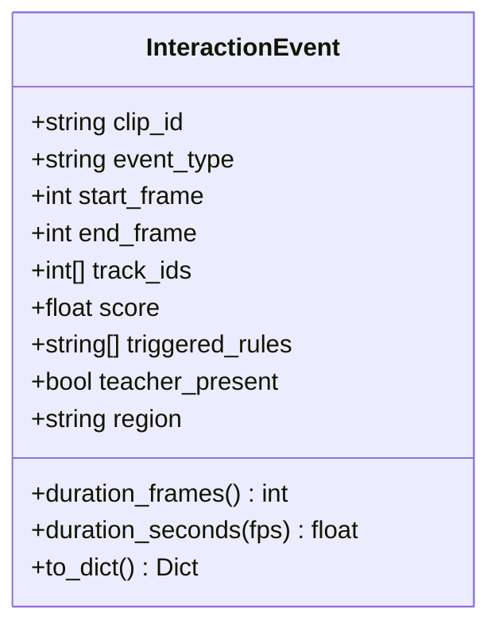
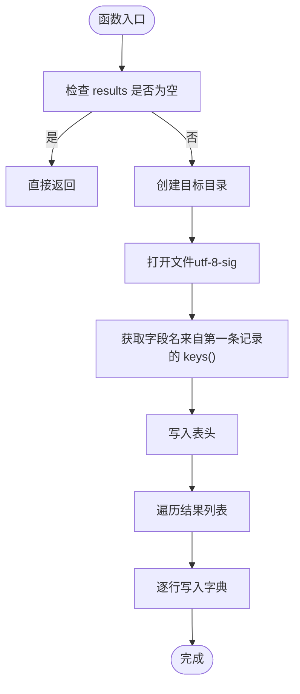
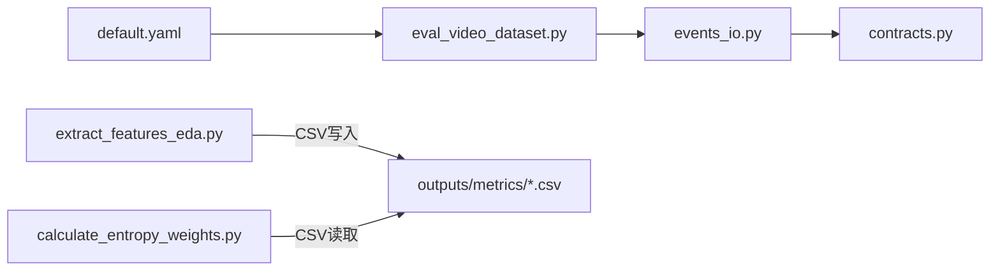

# 输出管理API

<cite>
**本文引用的文件**
- [events_io.py](file://src/fightguard/reporting/events_io.py)
- [contracts.py](file://src/fightguard/contracts.py)
- [default.yaml](file://configs/default.yaml)
- [eval_results.csv](file://outputs/metrics/eval_results.csv)
- [eval_video_dataset.py](file://scripts/eval_video_dataset.py)
- [extract_features_eda.py](file://scripts/extract_features_eda.py)
- [calculate_entropy_weights.py](file://scripts/calculate_entropy_weights.py)
</cite>

## 目录
1. [简介](#简介)
2. [项目结构](#项目结构)
3. [核心组件](#核心组件)
4. [架构概览](#架构概览)
5. [详细组件分析](#详细组件分析)
6. [依赖分析](#依赖分析)
7. [性能考虑](#性能考虑)
8. [故障排查指南](#故障排查指南)
9. [结论](#结论)
10. [附录](#附录)

## 简介
本文件面向“输出管理API”，聚焦于事件数据的持久化与加载能力，重点介绍以下两个函数：
- save_events_csv(events, filepath): 将检测到的交互事件列表写入 CSV 文件
- save_eval_results_csv(results, filepath): 将评测明细写入 CSV 文件

文档将说明事件数据的格式规范、存储结构、字段含义、批量处理与数据验证方法，并提供输出格式转换与自定义导出选项的指导，以及性能优化与错误处理建议。

## 项目结构
与输出管理API直接相关的模块与文件如下：
- reporting/events_io.py：事件与评测结果的 CSV 写入实现
- contracts.py：事件数据契约（InteractionEvent）及其 to_dict() 转换
- configs/default.yaml：输出开关与路径配置
- outputs/metrics/eval_results.csv：评测结果示例文件
- scripts/eval_video_dataset.py：批量评测流程，展示如何收集评测结果并调用保存函数
- scripts/extract_features_eda.py：特征提取脚本，演示 DictWriter 的使用模式
- scripts/calculate_entropy_weights.py：读取特征数据并进行统计分析

图表来源
- [events_io.py:12-35](file://src/fightguard/reporting/events_io.py#L12-L35)
- [contracts.py:192-240](file://src/fightguard/contracts.py#L192-L240)
- [default.yaml:6-15](file://configs/default.yaml#L6-L15)
- [eval_results.csv:1-10](file://outputs/metrics/eval_results.csv#L1-L10)
- [eval_video_dataset.py:97-102](file://scripts/eval_video_dataset.py#L97-L102)
- [extract_features_eda.py:92-99](file://scripts/extract_features_eda.py#L92-L99)

章节来源
- [events_io.py:12-35](file://src/fightguard/reporting/events_io.py#L12-L35)
- [contracts.py:192-240](file://src/fightguard/contracts.py#L192-L240)
- [default.yaml:6-15](file://configs/default.yaml#L6-L15)
- [eval_results.csv:1-10](file://outputs/metrics/eval_results.csv#L1-L10)
- [eval_video_dataset.py:97-102](file://scripts/eval_video_dataset.py#L97-L102)
- [extract_features_eda.py:92-99](file://scripts/extract_features_eda.py#L92-L99)

## 核心组件
- 事件数据契约（InteractionEvent）
  - 作用：统一事件记录的数据结构，提供 to_dict() 以便持久化
  - 字段：clip_id、event_type、start_frame、end_frame、duration_frames、track_ids、score、triggered_rules、teacher_present、region
  - 转换：to_dict() 将属性转为字典，其中 duration_frames 由 end_frame - start_frame 计算，score 四舍五入保留4位小数，track_ids 与 triggered_rules 转为字符串表示

- CSV 写入实现
  - save_events_csv(events, filepath)
    - 输入：事件列表（InteractionEvent）
    - 行为：若非空，创建目标目录，使用 DictWriter 写入表头与逐行数据
    - 注意：字段名来源于第一个事件的 to_dict().keys()
  - save_eval_results_csv(results, filepath)
    - 输入：评测明细列表（Dict）
    - 行为：若非空，创建目标目录，使用 DictWriter 写入表头与逐行数据
    - 注意：字段名来源于第一条记录的 keys()

章节来源
- [contracts.py:192-240](file://src/fightguard/contracts.py#L192-L240)
- [events_io.py:12-35](file://src/fightguard/reporting/events_io.py#L12-L35)

## 架构概览
事件输出与评测结果保存的典型调用链如下：

图表来源
- [eval_video_dataset.py:92-102](file://scripts/eval_video_dataset.py#L92-L102)
- [events_io.py:12-35](file://src/fightguard/reporting/events_io.py#L12-L35)

## 详细组件分析

### 事件数据契约与字段说明
- 数据结构：InteractionEvent
- 字段含义
  - clip_id：片段标识
  - event_type：事件类型（如 child_conflict）
  - start_frame/end_frame：事件起止帧
  - duration_frames：由 end_frame - start_frame 计算
  - track_ids：参与人员的 track_id 列表
  - score：置信度分数（四舍五入到 0.0001）
  - triggered_rules：触发的具体规则列表
  - teacher_present：教师是否在场
  - region：功能区域（如 activity_zone）

图表来源
- [contracts.py:192-240](file://src/fightguard/contracts.py#L192-L240)

章节来源
- [contracts.py:192-240](file://src/fightguard/contracts.py#L192-L240)

### 事件CSV写入 API：save_events_csv()
- 函数签名与行为
  - 输入：List[InteractionEvent]、文件路径
  - 行为：若事件列表非空，创建目录并写入 CSV；字段名来自首个事件的 to_dict().keys()
- 数据验证与健壮性
  - 空列表保护：当 events 为空时直接返回
  - 目录创建：使用 os.makedirs(..., exist_ok=True)
  - 编码与BOM：使用 utf-8-sig 编码，避免 Excel 打开乱码
- 输出格式要点
  - 表头：字段名来自第一个事件的 to_dict().keys()
  - 行数据：逐行写入每个事件的 to_dict()

图表来源
- [events_io.py:23-35](file://src/fightguard/reporting/events_io.py#L23-L35)
- [contracts.py:227-240](file://src/fightguard/contracts.py#L227-L240)

章节来源
- [events_io.py:23-35](file://src/fightguard/reporting/events_io.py#L23-L35)
- [contracts.py:227-240](file://src/fightguard/contracts.py#L227-L240)

### 评测结果CSV写入 API：save_eval_results_csv()
- 函数签名与行为
  - 输入：List[Dict]、文件路径
  - 行为：若结果列表非空，创建目录并写入 CSV；字段名来自第一条记录的 keys()
- 数据验证与健壮性
  - 空列表保护：当 results 为空时直接返回
  - 目录创建：使用 os.makedirs(..., exist_ok=True)
  - 编码与BOM：使用 utf-8-sig 编码
- 输出格式要点
  - 表头：字段名来自第一条记录的 keys()
  - 行数据：逐行写入字典

图表来源
- [events_io.py:12-21](file://src/fightguard/reporting/events_io.py#L12-L21)

章节来源
- [events_io.py:12-21](file://src/fightguard/reporting/events_io.py#L12-L21)

### 事件记录的数据结构与字段含义
- 字段清单与类型
  - clip_id：字符串
  - event_type：字符串
  - start_frame：整数
  - end_frame：整数
  - duration_frames：整数（由 end_frame - start_frame 计算）
  - track_ids：字符串（列表的字符串表示）
  - score：浮点数（保留4位小数）
  - triggered_rules：字符串（规则列表的字符串表示）
  - teacher_present：布尔
  - region：字符串

- 字段来源与转换
  - to_dict() 将属性转换为字典，供 CSV 写入使用
  - duration_frames 为派生字段，不直接存储于原数据结构中

章节来源
- [contracts.py:192-240](file://src/fightguard/contracts.py#L192-L240)

### 批量处理与数据验证
- 批量处理
  - 评测脚本 eval_video_dataset.py 展示了典型的批量处理流程：遍历视频集合，调用规则引擎，收集 InteractionEvent 列表，最终调用 save_events_csv 与 save_eval_results_csv
  - 特征提取脚本 extract_features_eda.py 展示了 DictWriter 的使用模式，可用于评测明细的批量写入
- 数据验证
  - 空列表保护：两个 API 均对空输入进行保护，避免无意义写入
  - 字段一致性：事件 CSV 写入使用首个事件的字段名作为表头，后续事件需保持字段一致；评测 CSV 写入使用第一条记录的字段名作为表头
  - 目录存在性：自动创建输出目录，减少外部依赖

章节来源
- [eval_video_dataset.py:92-102](file://scripts/eval_video_dataset.py#L92-L102)
- [extract_features_eda.py:92-99](file://scripts/extract_features_eda.py#L92-L99)
- [events_io.py:12-35](file://src/fightguard/reporting/events_io.py#L12-L35)

### 输出格式转换与自定义导出选项
- 当前实现
  - 仅支持 CSV 写入（utf-8-sig 编码，带 BOM）
  - 字段名由数据决定（事件 CSV 使用 to_dict().keys()，评测 CSV 使用第一条记录的 keys()）
- 自定义导出选项建议
  - 扩展 save_events_csv/save_eval_results_csv：增加 format 参数（如 "csv" | "json"），并在 format == "json" 时使用 json.dump 写入
  - 增加列排序控制：允许传入 fieldnames 参数，固定输出列顺序
  - 增加编码与BOM控制：允许传入 encoding 与 newline 参数
  - 增加追加模式：允许 append 模式写入（注意表头仅写一次）

章节来源
- [events_io.py:12-35](file://src/fightguard/reporting/events_io.py#L12-L35)

### 使用示例与最佳实践
- 将检测结果保存为 CSV
  - 步骤：收集 InteractionEvent 列表 → 调用 save_events_csv(events, events_filepath)
  - 参考：eval_video_dataset.py 中的事件收集与保存流程
- 从文件中加载事件数据
  - 方案：使用 pandas.read_csv 或 csv.DictReader 读取 CSV 文件
  - 注意：由于 track_ids 与 triggered_rules 以字符串形式存储，读取后需自行解析为列表
- 评测结果加载
  - 方案：pandas.read_csv 读取 outputs/metrics/eval_results.csv
  - 参考：calculate_entropy_weights.py 中的读取流程

章节来源
- [eval_video_dataset.py:92-102](file://scripts/eval_video_dataset.py#L92-L102)
- [eval_results.csv:1-10](file://outputs/metrics/eval_results.csv#L1-L10)
- [calculate_entropy_weights.py:18-26](file://scripts/calculate_entropy_weights.py#L18-L26)

## 依赖分析
- 模块耦合
  - events_io.py 依赖 contracts.InteractionEvent 的 to_dict() 接口
  - 评测写入 save_eval_results_csv 依赖传入字典的 keys() 作为表头
- 外部依赖
  - Python 标准库：os、csv
  - 第三方库：pandas（用于读取特征数据与评测结果）
- 配置集成
  - 输出开关与路径由 default.yaml 提供，脚本中通过相对路径拼接输出目录

图表来源
- [events_io.py:10](file://src/fightguard/reporting/events_io.py#L10)
- [contracts.py:192-240](file://src/fightguard/contracts.py#L192-L240)
- [eval_video_dataset.py:92-102](file://scripts/eval_video_dataset.py#L92-L102)
- [extract_features_eda.py:92-99](file://scripts/extract_features_eda.py#L92-L99)
- [calculate_entropy_weights.py:18-26](file://scripts/calculate_entropy_weights.py#L18-L26)
- [default.yaml:12-13](file://configs/default.yaml#L12-L13)

章节来源
- [events_io.py:10](file://src/fightguard/reporting/events_io.py#L10)
- [contracts.py:192-240](file://src/fightguard/contracts.py#L192-L240)
- [eval_video_dataset.py:92-102](file://scripts/eval_video_dataset.py#L92-L102)
- [extract_features_eda.py:92-99](file://scripts/extract_features_eda.py#L92-L99)
- [calculate_entropy_weights.py:18-26](file://scripts/calculate_entropy_weights.py#L18-L26)
- [default.yaml:12-13](file://configs/default.yaml#L12-L13)

## 性能考虑
- I/O 模式
  - 使用 newline="" 与 utf-8-sig 编码，避免跨平台换行与 Excel 乱码问题
- 批量写入
  - 使用 csv.DictWriter 的 writerows(writer.writerows(results)) 可减少多次系统调用
- 目录创建
  - os.makedirs(..., exist_ok=True) 避免重复创建目录带来的异常
- 大数据量建议
  - 若事件规模较大，可考虑分批写入或使用缓冲区
  - 对于评测明细，建议在收集阶段即保证字段一致性，避免动态扩展列

## 故障排查指南
- 无法写入文件
  - 检查目标目录权限与磁盘空间
  - 确认 filepath 指向有效路径
- CSV 乱码或 Excel 打开异常
  - 确认使用 utf-8-sig 编码（当前实现已内置）
- 字段不一致导致写入失败
  - 事件 CSV：确保所有事件具有相同的 to_dict().keys()
  - 评测 CSV：确保所有字典具有相同的 keys()
- 读取 CSV 后 track_ids 与 triggered_rules 为字符串
  - 使用 ast.literal_eval 或 eval 解析为列表（推荐使用 ast.literal_eval 更安全）

章节来源
- [events_io.py:12-35](file://src/fightguard/reporting/events_io.py#L12-L35)
- [eval_results.csv:1-10](file://outputs/metrics/eval_results.csv#L1-L10)

## 结论
输出管理API提供了简洁可靠的事件与评测结果 CSV 写入能力。通过 InteractionEvent 的 to_dict() 接口，事件数据得以结构化持久化；通过 save_eval_results_csv，评测明细也能统一写入。结合配置文件与脚本示例，用户可以快速实现批量处理、数据验证与自定义导出选项的扩展。

## 附录
- 配置项参考
  - 输出开关：output.save_events_csv、output.save_metrics_csv
  - 输出路径：output_events_dir、output_metrics_dir
- 示例文件
  - 评测结果示例：outputs/metrics/eval_results.csv
  - 特征提取示例：scripts/extract_features_eda.py

章节来源
- [default.yaml:6-15](file://configs/default.yaml#L6-L15)
- [eval_results.csv:1-10](file://outputs/metrics/eval_results.csv#L1-L10)
- [extract_features_eda.py:92-99](file://scripts/extract_features_eda.py#L92-L99)