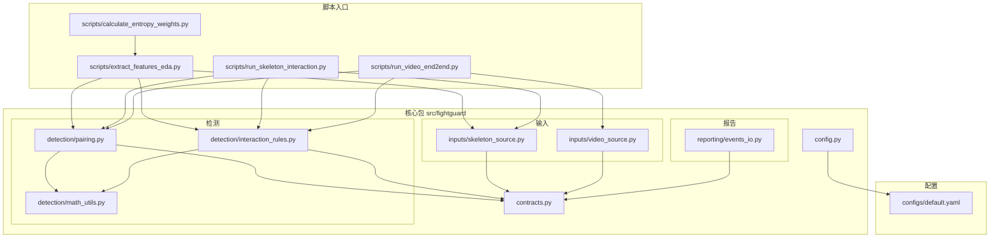
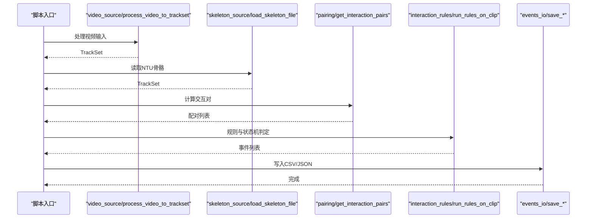
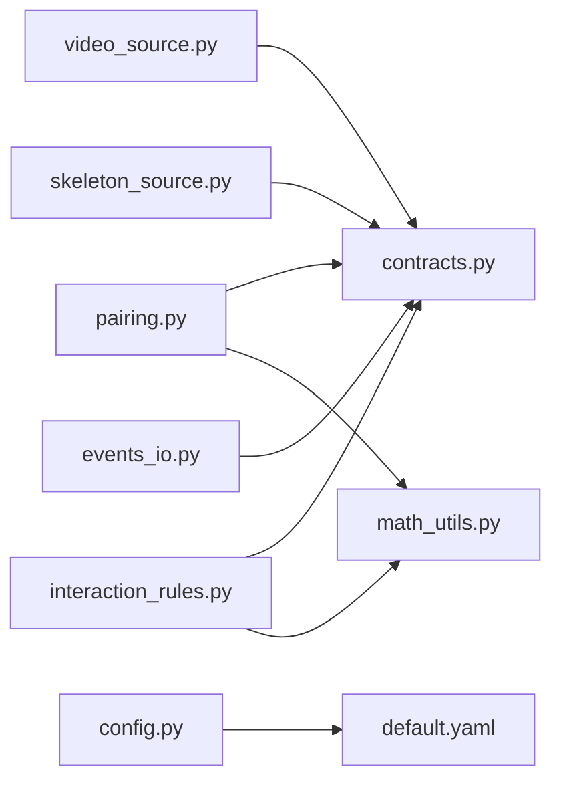

# 代码规范

<cite>
**本文引用的文件**   
- [README.md](file://README.md)
- [hello.py](file://hello.py)
- [test_skeleton.py](file://test_skeleton.py)
- [configs/default.yaml](file://configs/default.yaml)
- [src/fightguard/config.py](file://src/fightguard/config.py)
- [src/fightguard/contracts.py](file://src/fightguard/contracts.py)
- [src/fightguard/detection/math_utils.py](file://src/fightguard/detection/math_utils.py)
- [src/fightguard/detection/pairing.py](file://src/fightguard/detection/pairing.py)
- [src/fightguard/detection/interaction_rules.py](file://src/fightguard/detection/interaction_rules.py)
- [src/fightguard/inputs/skeleton_source.py](file://src/fightguard/inputs/skeleton_source.py)
- [src/fightguard/inputs/video_source.py](file://src/fightguard/inputs/video_source.py)
- [src/fightguard/reporting/events_io.py](file://src/fightguard/reporting/events_io.py)
- [scripts/extract_features_eda.py](file://scripts/extract_features_eda.py)
- [scripts/calculate_entropy_weights.py](file://scripts/calculate_entropy_weights.py)
</cite>

## 目录
1. [引言](#引言)
2. [项目结构](#项目结构)
3. [核心组件](#核心组件)
4. [架构总览](#架构总览)
5. [详细组件分析](#详细组件分析)
6. [依赖分析](#依赖分析)
7. [性能考虑](#性能考虑)
8. [故障排查指南](#故障排查指南)
9. [结论](#结论)
10. [附录](#附录)

## 引言
本文件为 KidGuard 项目的代码规范文档，面向项目开发者与贡献者，旨在统一 Python 编码风格、注释规范、错误处理与日志记录、代码组织原则，并提供可操作的正反面示例路径，帮助团队在保持一致性的同时提升可读性、可维护性与可扩展性。

## 项目结构
KidGuard 采用模块化分层组织：核心业务逻辑集中在 src/fightguard 下，按功能划分为 detection（规则与状态机）、inputs（数据输入）、evaluation（评测指标）、reporting（事件与输出）。脚本 scripts/ 提供阶段性的运行入口，configs/ 提供全局配置，data/ 与 outputs/ 用于存放数据与结果。

**图示来源**
- [scripts/extract_features_eda.py:1-106](file://scripts/extract_features_eda.py#L1-L106)
- [scripts/calculate_entropy_weights.py:1-71](file://scripts/calculate_entropy_weights.py#L1-L71)
- [src/fightguard/inputs/skeleton_source.py:1-331](file://src/fightguard/inputs/skeleton_source.py#L1-L331)
- [src/fightguard/inputs/video_source.py:1-193](file://src/fightguard/inputs/video_source.py#L1-L193)
- [src/fightguard/detection/pairing.py:1-54](file://src/fightguard/detection/pairing.py#L1-L54)
- [src/fightguard/detection/interaction_rules.py:1-531](file://src/fightguard/detection/interaction_rules.py#L1-L531)
- [src/fightguard/detection/math_utils.py:1-52](file://src/fightguard/detection/math_utils.py#L1-L52)
- [src/fightguard/reporting/events_io.py:1-36](file://src/fightguard/reporting/events_io.py#L1-L36)
- [src/fightguard/config.py:1-120](file://src/fightguard/config.py#L1-L120)
- [configs/default.yaml:1-62](file://configs/default.yaml#L1-L62)

**章节来源**
- [README.md:46-76](file://README.md#L46-L76)

## 核心组件
- 配置与契约
  - 配置读取与校验：统一从配置文件加载并缓存，提供 get_config()/reload_config()，并在缺失字段或格式错误时抛出明确异常。
  - 数据契约：定义 Keypoints、SkeletonTrack、TrackSet、InteractionEvent 等核心数据结构，统一键名与字段语义，避免硬编码索引。
- 输入层
  - 视频输入：封装 YOLOv8-Pose 推理与 ByteTrack 追踪，输出标准化 TrackSet。
  - 骨骼数据输入：解析 NTU .skeleton 文件，映射到 COCO-17 标准键名，输出 TrackSet。
- 检测层
  - 几何与物理工具：提供欧氏距离、肩宽尺度、身体中心点等基础计算。
  - 人员配对：基于轨迹存活帧与平均距离筛选交互对。
  - 冲突规则与状态机：实现四段式状态机，结合多物理特征与置信度抑制，输出 InteractionEvent。
- 报告层
  - 事件持久化：将事件与评测结果写入 CSV/JSON。

**章节来源**
- [src/fightguard/config.py:32-120](file://src/fightguard/config.py#L32-L120)
- [src/fightguard/contracts.py:1-241](file://src/fightguard/contracts.py#L1-L241)
- [src/fightguard/inputs/video_source.py:57-193](file://src/fightguard/inputs/video_source.py#L57-L193)
- [src/fightguard/inputs/skeleton_source.py:211-331](file://src/fightguard/inputs/skeleton_source.py#L211-L331)
- [src/fightguard/detection/math_utils.py:10-52](file://src/fightguard/detection/math_utils.py#L10-L52)
- [src/fightguard/detection/pairing.py:6-54](file://src/fightguard/detection/pairing.py#L6-L54)
- [src/fightguard/detection/interaction_rules.py:36-531](file://src/fightguard/detection/interaction_rules.py#L36-L531)
- [src/fightguard/reporting/events_io.py:12-36](file://src/fightguard/reporting/events_io.py#L12-L36)

## 架构总览
KidGuard 的运行流程自上而下可分为“数据输入 → 轨迹提取 → 人员配对 → 物理特征与规则判定 → 事件生成 → 结果输出”。脚本入口负责编排各模块，配置文件贯穿全局参数与阈值。

**图示来源**
- [scripts/extract_features_eda.py:28-106](file://scripts/extract_features_eda.py#L28-L106)
- [src/fightguard/inputs/video_source.py:57-193](file://src/fightguard/inputs/video_source.py#L57-L193)
- [src/fightguard/inputs/skeleton_source.py:211-331](file://src/fightguard/inputs/skeleton_source.py#L211-L331)
- [src/fightguard/detection/pairing.py:14-54](file://src/fightguard/detection/pairing.py#L14-L54)
- [src/fightguard/detection/interaction_rules.py:410-531](file://src/fightguard/detection/interaction_rules.py#L410-L531)
- [src/fightguard/reporting/events_io.py:12-36](file://src/fightguard/reporting/events_io.py#L12-L36)

## 详细组件分析

### 配置与契约规范
- 配置读取与校验
  - 统一入口：通过 get_config() 获取全局配置，内部缓存避免重复 IO。
  - 校验策略：检查顶层必需键与 rules 子键，缺失时报错并给出修复建议。
  - 异常类型：文件不存在与格式错误分别抛出 FileNotFoundError 与 ValueError，错误消息包含路径与期望类型。
- 数据契约
  - 命名约定：COCO17_KEYPOINT_NAMES 使用 snake_case，键名均为字符串，避免数值索引。
  - 类型别名：Keypoints、SkeletonTrack、TrackSet、InteractionEvent 明确定义字段与用途。
  - 工具函数：keypoints_from_array、make_empty_keypoints 提供安全构造与转换。

**章节来源**
- [src/fightguard/config.py:32-120](file://src/fightguard/config.py#L32-L120)
- [src/fightguard/contracts.py:24-241](file://src/fightguard/contracts.py#L24-L241)

### 输入层规范
- 视频输入
  - 模型懒加载：模块级缓存避免重复初始化。
  - 追踪器：使用 ByteTrack 提升低分框关联稳定性。
  - 轨迹对齐：强制将所有轨迹对齐到相同帧数，保证时序一致性。
- 骨骼输入
  - 文件名解析：从 NTU 文件名提取 clip_id 与动作类别。
  - 映射策略：仅在映射表中出现一次 NTU 数字索引，其余模块仅使用 COCO-17 键名。
  - 归一化：将世界坐标映射到 [0,1]，保留置信度。

**章节来源**
- [src/fightguard/inputs/video_source.py:41-193](file://src/fightguard/inputs/video_source.py#L41-L193)
- [src/fightguard/inputs/skeleton_source.py:64-331](file://src/fightguard/inputs/skeleton_source.py#L64-L331)

### 检测层规范
- 几何与物理工具
  - 函数职责单一：距离、肩宽尺度、身体中心点、特征归一化等纯计算函数，无副作用。
- 人员配对
  - 存活帧过滤：剔除短暂出现的幽灵轨迹。
  - 最佳配对：基于平均距离选择最可能的交互对。
- 冲突规则与状态机
  - 四段式状态机：接近、动作激活、作用-响应、事件确认，严格同步因果律。
  - 特征提取：手腕/脚踝加速度、相对接近速度、肘/膝角加速度、躯干倾角变化、骨盆速度。
  - 置信度抑制：根据平均置信度动态调整得分，减少低质量帧干扰。

**章节来源**
- [src/fightguard/detection/math_utils.py:10-52](file://src/fightguard/detection/math_utils.py#L10-L52)
- [src/fightguard/detection/pairing.py:6-54](file://src/fightguard/detection/pairing.py#L6-L54)
- [src/fightguard/detection/interaction_rules.py:258-531](file://src/fightguard/detection/interaction_rules.py#L258-L531)

### 报告与输出规范
- 事件持久化
  - CSV 写入：使用 DictWriter，自动写入表头与行。
  - 字段序列：按 InteractionEvent.to_dict() 输出，确保列名一致。
- 脚本输出
  - EDA 特征提取：将峰值特征写入 CSV，供熵权法使用。
  - 熵权法：读取 CSV，计算权重并打印结果。

**章节来源**
- [src/fightguard/reporting/events_io.py:12-36](file://src/fightguard/reporting/events_io.py#L12-L36)
- [scripts/extract_features_eda.py:28-106](file://scripts/extract_features_eda.py#L28-L106)
- [scripts/calculate_entropy_weights.py:12-71](file://scripts/calculate_entropy_weights.py#L12-L71)

## 依赖分析
- 模块耦合
  - detection.* 依赖 contracts 与 config，避免跨模块硬编码。
  - inputs.* 依赖 contracts 与 config，提供标准化数据结构。
  - reporting.* 依赖 contracts，仅负责输出。
- 外部依赖
  - OpenCV、Ultralytics YOLO、ByteTrack、pandas/numpy 等，均在各自模块内封装，避免全局污染。

**图示来源**
- [src/fightguard/inputs/video_source.py:19-26](file://src/fightguard/inputs/video_source.py#L19-L26)
- [src/fightguard/inputs/skeleton_source.py:22-29](file://src/fightguard/inputs/skeleton_source.py#L22-L29)
- [src/fightguard/detection/pairing.py:3-4](file://src/fightguard/detection/pairing.py#L3-L4)
- [src/fightguard/detection/interaction_rules.py:16-24](file://src/fightguard/detection/interaction_rules.py#L16-L24)
- [src/fightguard/reporting/events_io.py:10-10](file://src/fightguard/reporting/events_io.py#L10-L10)
- [src/fightguard/config.py:15-17](file://src/fightguard/config.py#L15-L17)
- [configs/default.yaml:1-62](file://configs/default.yaml#L1-L62)

**章节来源**
- [src/fightguard/inputs/video_source.py:19-26](file://src/fightguard/inputs/video_source.py#L19-L26)
- [src/fightguard/inputs/skeleton_source.py:22-29](file://src/fightguard/inputs/skeleton_source.py#L22-L29)
- [src/fightguard/detection/pairing.py:3-4](file://src/fightguard/detection/pairing.py#L3-L4)
- [src/fightguard/detection/interaction_rules.py:16-24](file://src/fightguard/detection/interaction_rules.py#L16-L24)
- [src/fightguard/reporting/events_io.py:10-10](file://src/fightguard/reporting/events_io.py#L10-L10)
- [src/fightguard/config.py:15-17](file://src/fightguard/config.py#L15-L17)

## 性能考虑
- 模型懒加载与缓存：避免重复初始化，显著降低首帧延迟。
- 轨迹对齐：统一帧数，减少后续索引与边界判断开销。
- 状态机平滑：滑动窗口与阈值平滑，降低瞬时噪声影响。
- I/O 优化：批量读取与写入，尽量减少磁盘往返。

[本节为通用指导，无需特定文件来源]

## 故障排查指南
- 配置相关
  - 缺失字段：检查 default.yaml 中 paths、rules、dataset、output 是否齐全。
  - 格式错误：确认 YAML 语法正确，类型为字典。
- 视频输入
  - 无法打开视频：确认路径存在且格式受支持。
  - 未检测到人：降低检测阈值或更换追踪器配置。
- 骨骼输入
  - 文件名格式不符：确保 NTU 文件名符合 S/C/P/R/A 格式。
  - 映射失败：核对 NTU_TO_COCO17 映射表与关键点数量。
- 规则判定
  - 无交互对：检查轨迹存活帧与帧数对齐。
  - 事件为空：调整阈值或检查特征归一化范围。

**章节来源**
- [src/fightguard/config.py:61-120](file://src/fightguard/config.py#L61-L120)
- [src/fightguard/inputs/video_source.py:80-92](file://src/fightguard/inputs/video_source.py#L80-L92)
- [src/fightguard/inputs/skeleton_source.py:77-114](file://src/fightguard/inputs/skeleton_source.py#L77-L114)
- [src/fightguard/detection/pairing.py:19-33](file://src/fightguard/detection/pairing.py#L19-L33)

## 结论
本规范以项目现有代码为依据，总结了编码风格、注释与文档字符串、错误处理与日志记录、代码组织原则，并提供了与源码一一对应的示例路径。建议在新增模块与修改既有模块时，严格遵循本规范，以确保一致性与可维护性。

[本节为总结性内容，无需特定文件来源]

## 附录

### Python 编码风格与命名约定
- PEP8 要求
  - 缩进：使用 4 个空格，禁止混用制表符。
  - 行宽：每行不超过 100 个字符。
  - 空行：模块级函数/类之间留空行，方法内部合理分组。
- 命名约定
  - 类名：PascalCase（如 SkeletonTrack、CaptainStateMachine）。
  - 变量与函数：snake_case（如 get_config、process_video_to_trackset）。
  - 常量：UPPER_CASE（如 COCO17_KEYPOINT_NAMES）。
  - 模块与包：尽量使用简短、全小写的 snake_case。
- 注释与文档字符串
  - 模块头部注释：说明模块职责、核心工作与注意事项。
  - 函数/类文档字符串：描述用途、参数、返回值与异常。
  - 行内注释：解释复杂逻辑或特殊处理，避免显而易见的注释。
- 异常与日志
  - 异常类型：使用合适的内置异常（FileNotFoundError、ValueError），并在必要时抛出自定义异常。
  - 错误消息：清晰、具体，包含上下文与修复建议。
  - 日志记录：使用 print 或标准库 logging，避免在生产环境使用 print，但脚本演示中可接受 print。
- 代码组织
  - 导入顺序：标准库 → 第三方库 → 项目内模块，每组之间空一行。
  - 函数长度：单函数控制在 100 行以内，必要时拆分为私有辅助函数。
  - 类设计：单一职责，属性与方法围绕数据契约展开，避免跨模块硬编码。

**章节来源**
- [src/fightguard/contracts.py:96-148](file://src/fightguard/contracts.py#L96-L148)
- [src/fightguard/detection/interaction_rules.py:258-358](file://src/fightguard/detection/interaction_rules.py#L258-L358)
- [src/fightguard/config.py:32-83](file://src/fightguard/config.py#L32-L83)
- [src/fightguard/inputs/video_source.py:57-92](file://src/fightguard/inputs/video_source.py#L57-L92)
- [src/fightguard/inputs/skeleton_source.py:64-114](file://src/fightguard/inputs/skeleton_source.py#L64-L114)

### 错误处理与日志记录最佳实践
- 错误类型选择
  - 文件不存在：FileNotFoundError。
  - 配置格式错误：ValueError。
  - 数据解析异常：ValueError 或自定义异常。
- 错误消息格式
  - 包含文件路径、期望类型与修复建议。
- 日志记录
  - 脚本演示中使用 print 输出状态与警告。
  - 生产环境建议使用 logging 模块替代 print。

**章节来源**
- [src/fightguard/config.py:61-120](file://src/fightguard/config.py#L61-L120)
- [src/fightguard/inputs/skeleton_source.py:87-114](file://src/fightguard/inputs/skeleton_source.py#L87-L114)
- [src/fightguard/inputs/video_source.py:82-92](file://src/fightguard/inputs/video_source.py#L82-L92)

### 代码组织原则
- 模块导入顺序
  - 标准库：os、glob、itertools、math 等。
  - 第三方库：cv2、ultralytics、pandas、numpy、yaml 等。
  - 项目内模块：from fightguard.* import ...
- 函数长度限制
  - 建议不超过 100 行，复杂逻辑拆分为私有辅助函数。
- 类设计原则
  - 以数据契约为核心，属性与方法围绕 TrackSet/SkeletonTrack/InteractionEvent 展开。
  - 避免在类外直接访问内部结构，统一通过方法与属性访问。

**章节来源**
- [src/fightguard/detection/pairing.py:1-54](file://src/fightguard/detection/pairing.py#L1-L54)
- [src/fightguard/detection/interaction_rules.py:410-531](file://src/fightguard/detection/interaction_rules.py#L410-L531)
- [src/fightguard/inputs/video_source.py:14-26](file://src/fightguard/inputs/video_source.py#L14-L26)
- [src/fightguard/inputs/skeleton_source.py:18-30](file://src/fightguard/inputs/skeleton_source.py#L18-L30)

### 具体示例（示例路径）
- 正确示例
  - 配置读取与校验：[src/fightguard/config.py:32-120](file://src/fightguard/config.py#L32-L120)
  - 数据契约定义：[src/fightguard/contracts.py:96-241](file://src/fightguard/contracts.py#L96-L241)
  - 视频输入与轨迹对齐：[src/fightguard/inputs/video_source.py:57-193](file://src/fightguard/inputs/video_source.py#L57-L193)
  - 骨骼输入与映射：[src/fightguard/inputs/skeleton_source.py:211-331](file://src/fightguard/inputs/skeleton_source.py#L211-L331)
  - 几何与物理工具：[src/fightguard/detection/math_utils.py:10-52](file://src/fightguard/detection/math_utils.py#L10-L52)
  - 人员配对：[src/fightguard/detection/pairing.py:14-54](file://src/fightguard/detection/pairing.py#L14-L54)
  - 冲突规则与状态机：[src/fightguard/detection/interaction_rules.py:258-531](file://src/fightguard/detection/interaction_rules.py#L258-L531)
  - 事件持久化：[src/fightguard/reporting/events_io.py:12-36](file://src/fightguard/reporting/events_io.py#L12-L36)
  - EDA 特征提取：[scripts/extract_features_eda.py:28-106](file://scripts/extract_features_eda.py#L28-L106)
  - 熵权法权重计算：[scripts/calculate_entropy_weights.py:12-71](file://scripts/calculate_entropy_weights.py#L12-L71)
- 反面案例（常见问题）
  - 硬编码阈值与路径：应通过 get_config() 获取，而非直接写死数字或字符串。
  - 直接使用数值索引访问关键点：应统一使用 COCO-17 键名。
  - 未校验配置字段：应在读取后执行 _validate_config。
  - 未对齐轨迹帧数：需在 video_source 中进行时空绝对对齐。
  - 未捕获异常：在读取文件或解析数据时应抛出明确异常并给出修复建议。

**章节来源**
- [src/fightguard/config.py:95-120](file://src/fightguard/config.py#L95-L120)
- [src/fightguard/inputs/video_source.py:167-181](file://src/fightguard/inputs/video_source.py#L167-L181)
- [src/fightguard/inputs/skeleton_source.py:39-57](file://src/fightguard/inputs/skeleton_source.py#L39-L57)
- [src/fightguard/inputs/skeleton_source.py:225-229](file://src/fightguard/inputs/skeleton_source.py#L225-L229)
- [src/fightguard/inputs/video_source.py:115-119](file://src/fightguard/inputs/video_source.py#L115-L119)