# 开发指南

<cite>
**本文引用的文件**
- [README.md](file://README.md)
- [default.yaml](file://configs/default.yaml)
- [config.py](file://src/fightguard/config.py)
- [contracts.py](file://src/fightguard/contracts.py)
- [skeleton_source.py](file://src/fightguard/inputs/skeleton_source.py)
- [video_source.py](file://src/fightguard/inputs/video_source.py)
- [pairing.py](file://src/fightguard/detection/pairing.py)
- [interaction_rules.py](file://src/fightguard/detection/interaction_rules.py)
- [clip_metrics.py](file://src/fightguard/evaluation/clip_metrics.py)
- [events_io.py](file://src/fightguard/reporting/events_io.py)
- [extract_features_eda.py](file://scripts/extract_features_eda.py)
- [calculate_entropy_weights.py](file://scripts/calculate_entropy_weights.py)
- [debug_single_video.py](file://scripts/debug_single_video.py)
- [test_skeleton.py](file://test_skeleton.py)
</cite>

## 目录
1. [简介](#简介)
2. [项目结构](#项目结构)
3. [核心组件](#核心组件)
4. [架构总览](#架构总览)
5. [详细组件分析](#详细组件分析)
6. [依赖分析](#依赖分析)
7. [性能考虑](#性能考虑)
8. [故障排查指南](#故障排查指南)
9. [结论](#结论)
10. [附录](#附录)

## 简介
KidGuard 是一个面向幼儿园等儿童聚集场所的冲突风险管理分析系统，基于计算机视觉与骨骼关键点的空间几何关系，构建规则库实现冲突行为的轻量化识别与风险评估。系统采用模块化设计，支持骨骼数据与视频数据两类输入，提供从特征提取、规则判定到事件记录与评测指标的完整流水线。

- 核心能力：骨骼关键点提取、冲突行为识别、风险管理分析、事件记录、数据驱动赋权
- 技术要点：YOLOv8n-pose 实时骨骼提取、基于状态机的冲突判定、动作特征（腕部加速度、相对接近速度、肘部角加速度、躯干倾角变化）、熵权法科学赋权
- 性能特性：轻量化模型、实时性、准确性、可解释性、可扩展性

**章节来源**
- [README.md:1-131](file://README.md#L1-L131)

## 项目结构
项目采用“脚本入口 + 核心包 + 配置 + 数据/输出”的组织方式，核心逻辑集中在 src/fightguard 下，按功能划分为 inputs（输入）、detection（检测）、evaluation（评测）、reporting（报告）等子模块。

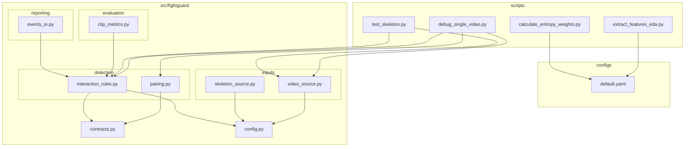

**图示来源**
- [README.md:46-76](file://README.md#L46-L76)
- [default.yaml:1-62](file://configs/default.yaml#L1-L62)
- [config.py:1-120](file://src/fightguard/config.py#L1-L120)
- [contracts.py:1-241](file://src/fightguard/contracts.py#L1-L241)
- [skeleton_source.py:1-331](file://src/fightguard/inputs/skeleton_source.py#L1-L331)
- [video_source.py:1-193](file://src/fightguard/inputs/video_source.py#L1-L193)
- [pairing.py:1-54](file://src/fightguard/detection/pairing.py#L1-L54)
- [interaction_rules.py:1-531](file://src/fightguard/detection/interaction_rules.py#L1-L531)
- [clip_metrics.py:1-47](file://src/fightguard/evaluation/clip_metrics.py#L1-L47)
- [events_io.py:1-36](file://src/fightguard/reporting/events_io.py#L1-L36)
- [extract_features_eda.py:1-106](file://scripts/extract_features_eda.py#L1-L106)
- [calculate_entropy_weights.py:1-71](file://scripts/calculate_entropy_weights.py#L1-L71)
- [debug_single_video.py:1-81](file://scripts/debug_single_video.py#L1-L81)
- [test_skeleton.py:1-94](file://test_skeleton.py#L1-L94)

**章节来源**
- [README.md:46-76](file://README.md#L46-L76)

## 核心组件
- 配置系统：集中读取与校验 configs/default.yaml，提供统一配置访问接口，支持热重载
- 数据契约：定义 Keypoints、SkeletonTrack、TrackSet、InteractionEvent 等统一数据结构
- 输入模块：视频输入（YOLOv8-Pose + ByteTrack）与骨骼数据（NTU RGBD）读取与归一化
- 检测模块：配对、规则与状态机、置信度抑制、特征提取与评分
- 评测模块：Clip 级指标计算（Accuracy/Precision/Recall/FPR/F1）
- 报告模块：事件 CSV/JSON 输出
- 脚本管线：EDA 特征提取、熵权法赋权、单点诊断、演示运行

**章节来源**
- [config.py:32-120](file://src/fightguard/config.py#L32-L120)
- [contracts.py:56-241](file://src/fightguard/contracts.py#L56-L241)
- [skeleton_source.py:211-331](file://src/fightguard/inputs/skeleton_source.py#L211-L331)
- [video_source.py:57-193](file://src/fightguard/inputs/video_source.py#L57-L193)
- [pairing.py:14-54](file://src/fightguard/detection/pairing.py#L14-L54)
- [interaction_rules.py:363-531](file://src/fightguard/detection/interaction_rules.py#L363-L531)
- [clip_metrics.py:9-47](file://src/fightguard/evaluation/clip_metrics.py#L9-L47)
- [events_io.py:12-36](file://src/fightguard/reporting/events_io.py#L12-L36)
- [extract_features_eda.py:28-106](file://scripts/extract_features_eda.py#L28-L106)
- [calculate_entropy_weights.py:12-71](file://scripts/calculate_entropy_weights.py#L12-L71)
- [debug_single_video.py:18-81](file://scripts/debug_single_video.py#L18-L81)
- [test_skeleton.py:9-94](file://test_skeleton.py#L9-L94)

## 架构总览
系统采用“输入 → 预处理 → 配对 → 特征提取 → 规则判定 → 事件输出”的端到端流水线。配置贯穿始终，确保参数一致性与可调性。

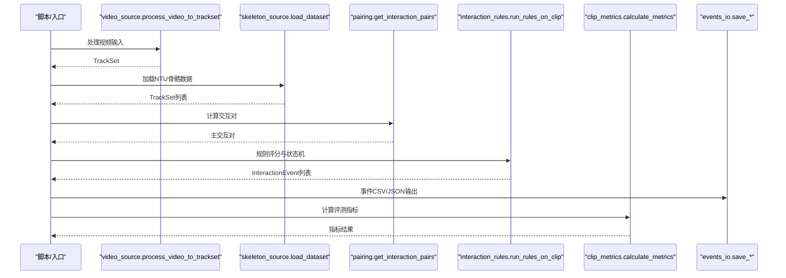

**图示来源**
- [video_source.py:57-193](file://src/fightguard/inputs/video_source.py#L57-L193)
- [skeleton_source.py:281-331](file://src/fightguard/inputs/skeleton_source.py#L281-L331)
- [pairing.py:14-54](file://src/fightguard/detection/pairing.py#L14-L54)
- [interaction_rules.py:410-503](file://src/fightguard/detection/interaction_rules.py#L410-L503)
- [clip_metrics.py:9-47](file://src/fightguard/evaluation/clip_metrics.py#L9-L47)
- [events_io.py:12-36](file://src/fightguard/reporting/events_io.py#L12-L36)

## 详细组件分析

### 配置系统（config.py）
- 设计要点
  - 模块级缓存：首次读取后缓存配置，后续调用直接返回，避免重复 IO
  - 统一入口：get_config()/reload_config() 提供一致的配置访问与热重载能力
  - 校验机制：校验顶层必需键与 rules 子键，缺失时报错并给出明确提示
- 使用建议
  - 所有模块读取配置统一通过 get_config()，禁止硬编码阈值
  - 调参阶段使用 reload_config() 无需重启进程
- 扩展建议
  - 新增规则阈值或状态机参数时，在 default.yaml 中新增键并在校验清单中补充
  - 若引入新配置文件，新增读取与校验函数，保持统一风格

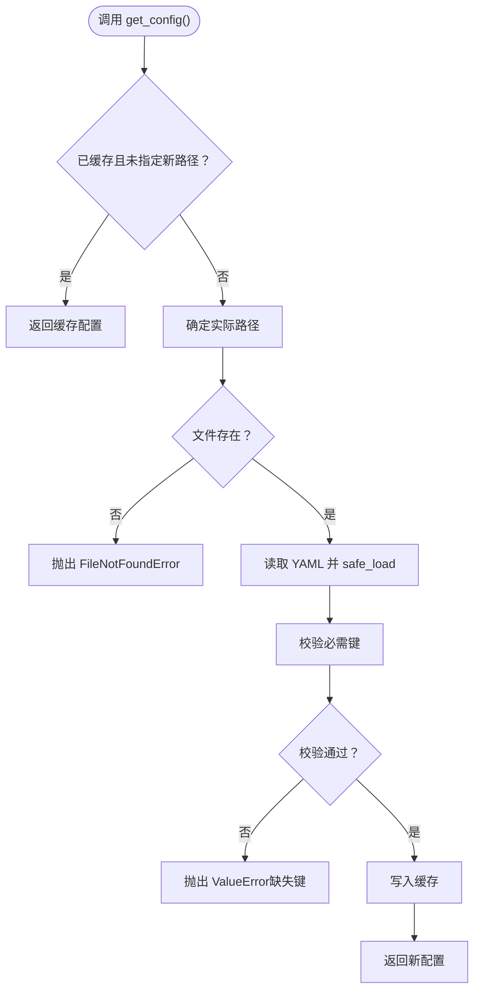

**图示来源**
- [config.py:32-120](file://src/fightguard/config.py#L32-L120)
- [default.yaml:16-62](file://configs/default.yaml#L16-L62)

**章节来源**
- [config.py:32-120](file://src/fightguard/config.py#L32-L120)
- [default.yaml:16-62](file://configs/default.yaml#L16-L62)

### 数据契约（contracts.py）
- 设计要点
  - 统一关键点命名：COCO-17 标准键名，禁止硬编码数字索引
  - 数据结构：Keypoints、SkeletonTrack、TrackSet、InteractionEvent
  - 工具函数：make_empty_keypoints、keypoints_from_array、轨迹查询与时间换算
- 使用建议
  - 外部模块仅通过键名访问关键点，避免数组索引耦合
  - TrackSet 作为片段级容器，统一管理 fps、总帧数与标签
- 扩展建议
  - 新增事件类型或字段时，修改 InteractionEvent 并同步更新事件输出模块

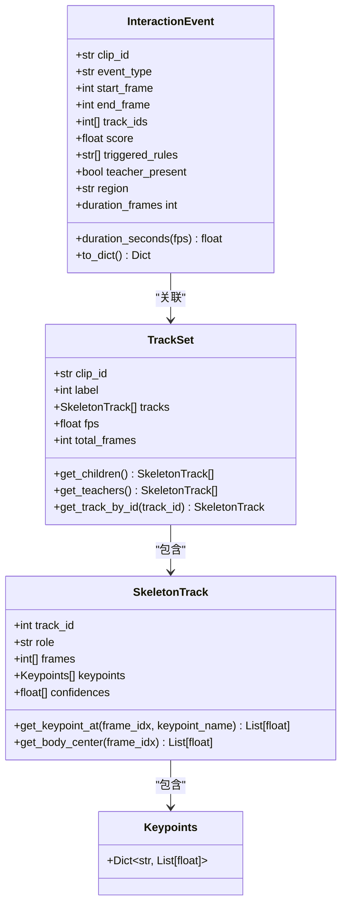

**图示来源**
- [contracts.py:56-241](file://src/fightguard/contracts.py#L56-L241)

**章节来源**
- [contracts.py:56-241](file://src/fightguard/contracts.py#L56-L241)

### 输入模块

#### 视频输入（video_source.py）
- 设计要点
  - 懒加载 YOLOv8-Pose（OpenVINO 加速），减少首帧延迟
  - 使用 ByteTrack 追踪器提升多人重叠场景稳定性
  - 时空绝对对齐：将轨迹填充到相同总帧数，保证严格帧对齐
- 使用建议
  - 视频输入时注意帧率与总帧数的恢复，确保后续时间换算正确
  - 调试时可通过 max_frames 控制处理长度
- 扩展建议
  - 可接入更强大的追踪器（如 DeepSORT）以提升跨帧稳定性

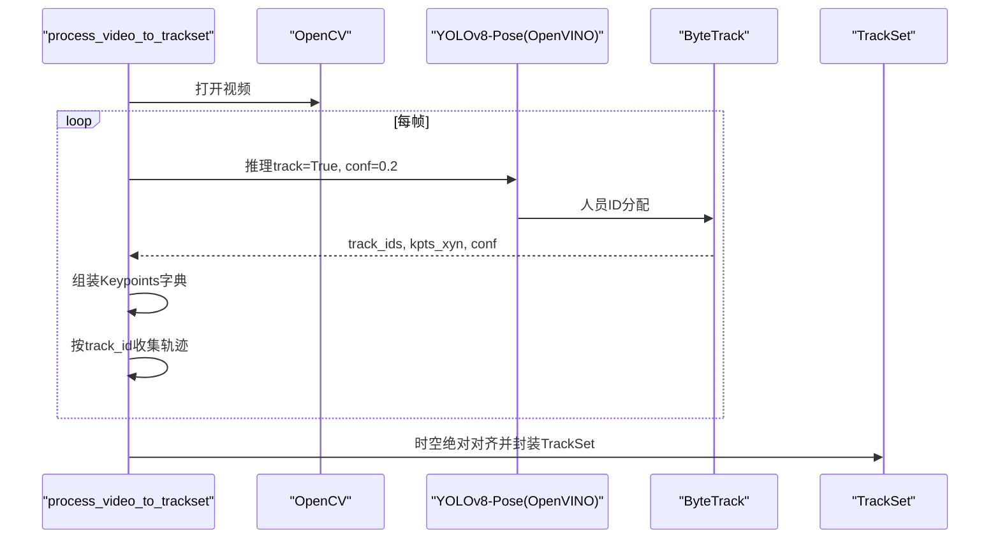

**图示来源**
- [video_source.py:57-193](file://src/fightguard/inputs/video_source.py#L57-L193)

**章节来源**
- [video_source.py:57-193](file://src/fightguard/inputs/video_source.py#L57-L193)

#### 骨骼数据输入（skeleton_source.py）
- 设计要点
  - NTU 25点 → COCO-17 映射表（唯一允许出现 NTU 数字索引处）
  - 文件名解析与动作类别标签提取
  - 归一化到 [0,1]，保留置信度第三维
- 使用建议
  - 仅在本文件内部使用映射表，外部模块只感知 COCO-17 键名
  - 冲突/正常样本标签由配置决定，不在评测范围的 clip 将被过滤
- 扩展建议
  - 可增加更多数据集的映射与标签规则

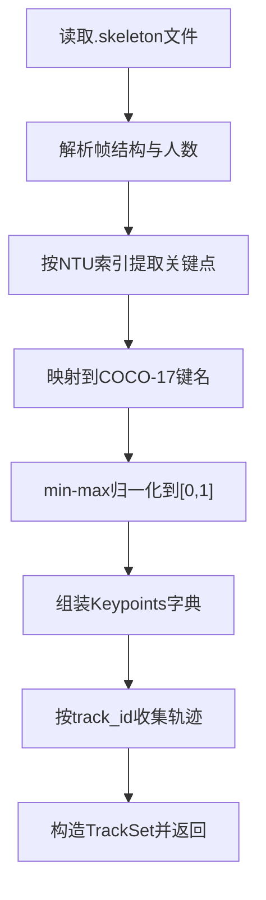

**图示来源**
- [skeleton_source.py:211-331](file://src/fightguard/inputs/skeleton_source.py#L211-L331)

**章节来源**
- [skeleton_source.py:211-331](file://src/fightguard/inputs/skeleton_source.py#L211-L331)

### 检测模块

#### 配对与距离（pairing.py）
- 设计要点
  - 以“躯干中心”（髋关节中点）为代表点计算两人距离
  - 过滤短寿命（<0.5秒）的碎片化轨迹，降低误报
  - 选择平均距离最小的一对作为主交互对
- 使用建议
  - 配对失败时检查轨迹存活帧数与画面中人物数量
- 扩展建议
  - 可引入更复杂的轨迹关联与跨帧匹配策略

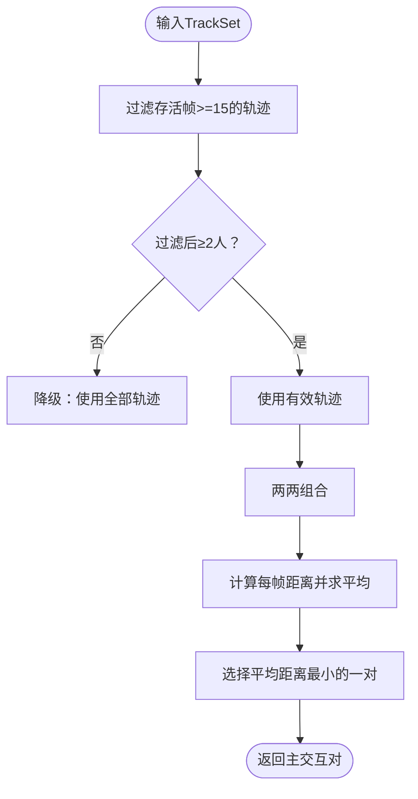

**图示来源**
- [pairing.py:14-54](file://src/fightguard/detection/pairing.py#L14-L54)

**章节来源**
- [pairing.py:14-54](file://src/fightguard/detection/pairing.py#L14-L54)

#### 规则与状态机（interaction_rules.py）
- 设计要点
  - 肩宽尺度归一化、四段式状态机（同步因果律）、相对接近速度约束、骨盆速度特征、置信度抑制
  - 特征提取：腕部线加速度、肘部角加速度、躯干倾角变化、骨盆速度、相对接近速度
  - 主入口：run_rules_on_clip，支持双向评分与事件生成
- 使用建议
  - 调参时优先调整 rules 中的阈值与状态机帧数，结合 reload_config() 热重载
  - 观察 triggered_rules 了解触发的具体物理特征
- 扩展建议
  - 新增特征时在 compute_directional_score 中扩展归一化与权重，并在状态机中加入相应条件

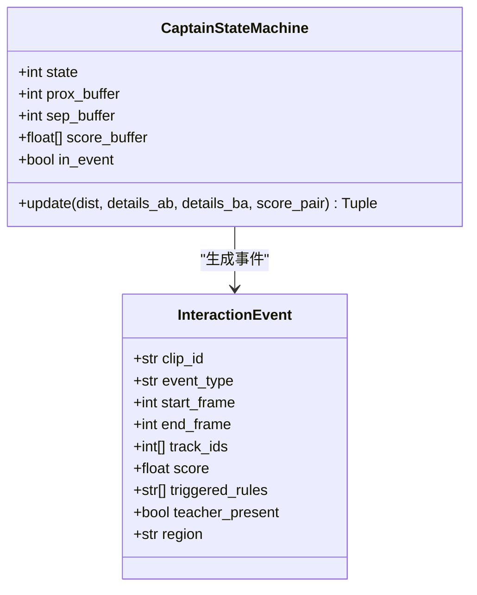

**图示来源**
- [interaction_rules.py:258-358](file://src/fightguard/detection/interaction_rules.py#L258-L358)
- [contracts.py:192-241](file://src/fightguard/contracts.py#L192-L241)

**章节来源**
- [interaction_rules.py:363-531](file://src/fightguard/detection/interaction_rules.py#L363-L531)

### 评测与报告

#### 指标计算（clip_metrics.py）
- 设计要点
  - 基于 TP/FP/TN/FN 计算 Accuracy、Precision、Recall、FPR、F1
- 使用建议
  - 将预测结果与实际标签对齐后调用，确保字段一致

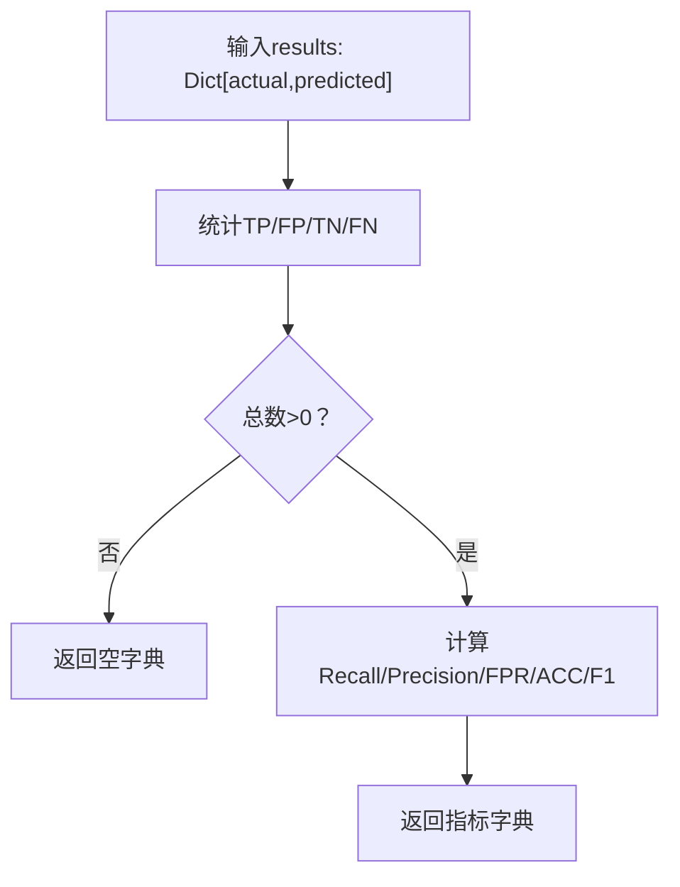

**图示来源**
- [clip_metrics.py:9-47](file://src/fightguard/evaluation/clip_metrics.py#L9-L47)

**章节来源**
- [clip_metrics.py:9-47](file://src/fightguard/evaluation/clip_metrics.py#L9-L47)

#### 事件输出（events_io.py）
- 设计要点
  - 将 InteractionEvent 列表写入 CSV/JSON，字段由 to_dict() 提供
- 使用建议
  - 输出目录通过配置控制，确保目录存在

**章节来源**
- [events_io.py:12-36](file://src/fightguard/reporting/events_io.py#L12-L36)

### 数据驱动与脚本管线

#### EDA 特征提取（extract_features_eda.py）
- 设计要点
  - 遍历数据集，提取单帧物理特征峰值（腕部线加速度、相对接近速度、肘部角加速度、躯干倾角变化）
  - 保存为 CSV，供熵权法使用
- 使用建议
  - 使用 tqdm 显示进度，合理设置 max_clips 以控制采样规模

**章节来源**
- [extract_features_eda.py:28-106](file://scripts/extract_features_eda.py#L28-L106)

#### 熵权法赋权（calculate_entropy_weights.py）
- 设计要点
  - 读取 EDA 特征 CSV，使用信息熵理论客观推导权重
  - 输出各特征权重，指导后续规则评分
- 使用建议
  - 更新权重后在规则评分中生效，确保与特征归一化范围一致

**章节来源**
- [calculate_entropy_weights.py:12-71](file://scripts/calculate_entropy_weights.py#L12-L71)

## 依赖分析
模块间依赖清晰，遵循“输入 → 预处理 → 配对 → 规则 → 评测/输出”的单向依赖链。配置模块为全局依赖中心，其他模块通过 get_config() 获取参数。

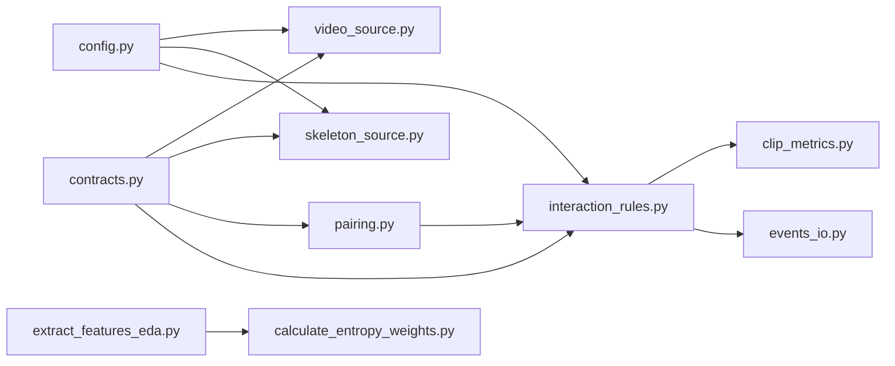

**图示来源**
- [config.py:32-120](file://src/fightguard/config.py#L32-L120)
- [video_source.py:57-193](file://src/fightguard/inputs/video_source.py#L57-L193)
- [skeleton_source.py:211-331](file://src/fightguard/inputs/skeleton_source.py#L211-L331)
- [pairing.py:14-54](file://src/fightguard/detection/pairing.py#L14-L54)
- [interaction_rules.py:410-503](file://src/fightguard/detection/interaction_rules.py#L410-L503)
- [clip_metrics.py:9-47](file://src/fightguard/evaluation/clip_metrics.py#L9-L47)
- [events_io.py:12-36](file://src/fightguard/reporting/events_io.py#L12-L36)
- [extract_features_eda.py:28-106](file://scripts/extract_features_eda.py#L28-L106)
- [calculate_entropy_weights.py:12-71](file://scripts/calculate_entropy_weights.py#L12-L71)

**章节来源**
- [config.py:32-120](file://src/fightguard/config.py#L32-L120)
- [contracts.py:56-241](file://src/fightguard/contracts.py#L56-L241)
- [interaction_rules.py:410-503](file://src/fightguard/detection/interaction_rules.py#L410-L503)

## 性能考虑
- 模型推理加速
  - 使用 OpenVINO 加速 YOLOv8-Pose，显著降低推理延迟
  - 采用 ByteTrack 追踪器，提升低分检测框的稳定性
- 数据处理优化
  - 配对阶段过滤短寿命轨迹，减少无效计算
  - 时空绝对对齐确保帧级严格对齐，避免跨帧错位带来的误判
- 参数调优
  - 通过配置文件统一管理阈值与状态机帧数，结合 reload_config() 实现热重载
  - 针对真实监控视频缩短时间窗口，提升系统对快速动作的敏感度

**章节来源**
- [video_source.py:41-49](file://src/fightguard/inputs/video_source.py#L41-L49)
- [video_source.py:115-118](file://src/fightguard/inputs/video_source.py#L115-L118)
- [pairing.py:17-28](file://src/fightguard/detection/pairing.py#L17-L28)
- [test_skeleton.py:16-21](file://test_skeleton.py#L16-L21)

## 故障排查指南
- 常见问题与定位
  - 骨骼提取失败：检查视频路径、模型加载与摄像头权限；确认视频可被 OpenCV 正常读取
  - 未检测到人：降低检测阈值或更换追踪器；检查画面质量与光照条件
  - 配对失败：确认画面中存在至少两人且存活帧足够；检查轨迹填充是否正确
  - 状态机无触发：检查阈值设置与置信度抑制；使用单点诊断脚本逐帧回放状态机
- 诊断工具
  - 单点诊断脚本：逐帧打印距离、置信度抑制、特征得分与状态机阶段，快速定位问题环节
  - 演示脚本：展示真实视频的特征极值，辅助阈值标定
- 建议流程
  1) 确认输入数据可用
  2) 检查配对与轨迹填充
  3) 逐步放宽阈值观察状态机变化
  4) 使用诊断脚本定位具体帧与特征

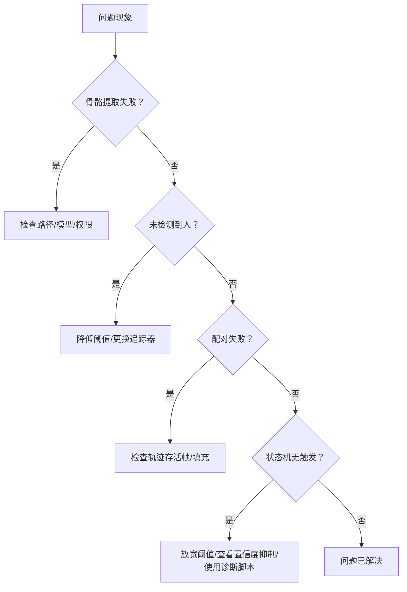

**图示来源**
- [debug_single_video.py:18-81](file://scripts/debug_single_video.py#L18-L81)
- [test_skeleton.py:9-94](file://test_skeleton.py#L9-L94)

**章节来源**
- [debug_single_video.py:18-81](file://scripts/debug_single_video.py#L18-L81)
- [test_skeleton.py:9-94](file://test_skeleton.py#L9-L94)

## 结论
KidGuard 通过模块化设计与数据驱动方法，实现了从输入到输出的完整冲突检测流水线。配置系统提供统一参数入口，数据契约确保结构一致性，检测模块融合状态机与物理特征，评测与报告模块完善闭环。建议在扩展新功能时遵循统一的数据结构与配置规范，利用诊断脚本与热重载机制快速迭代。

[本节不直接分析具体文件，故无“章节来源”]

## 附录

### 代码规范与最佳实践
- 编码风格
  - 使用 Python 类型注解，明确参数与返回值类型
  - 函数与类保持单一职责，避免过长函数
  - 常量与阈值统一从配置读取，禁止硬编码
- 注释规范
  - 模块顶部提供简要说明与核心职责
  - 关键函数提供参数、返回值与异常说明
  - 复杂逻辑添加步骤注释与伪代码说明
- 错误处理
  - 对文件路径、网络请求、模型加载等易失败操作进行异常捕获与清晰错误提示
  - 对空输入与边界条件进行显式检查与保护
- 日志记录
  - 使用 INFO/WARNING/ERROR 等级别区分不同严重程度
  - 输出关键参数与中间结果，便于问题定位

[本节为通用指导，不直接分析具体文件，故无“章节来源”]

### 扩展新功能模块指南
- 新模块添加
  - 在 src/fightguard 下新建子模块，遵循现有目录结构与命名
  - 通过 config.get_config() 获取参数，避免直接依赖全局变量
  - 在 contracts.py 中定义必要的数据结构与工具函数
- 规则扩展
  - 在 detection/interaction_rules.py 中新增特征提取与评分逻辑
  - 在状态机中加入同步因果条件，确保规则的时序一致性
  - 通过配置文件新增阈值键，配合校验清单
- 模型替换
  - 在 video_source.py 中替换模型加载逻辑，保持输入输出格式一致
  - 更新追踪器配置与阈值，确保与新模型特性匹配
- 性能优化
  - 使用缓存与懒加载减少重复初始化
  - 采用 OpenVINO 加速与更高效的追踪器
  - 在配对与特征计算中引入早期退出与剪枝策略

[本节为通用指导，不直接分析具体文件，故无“章节来源”]

### 单元测试与集成测试
- 单元测试
  - 针对独立函数（如特征提取、距离计算、状态机更新）编写测试用例
  - 使用 mock 替换外部依赖（如文件读取、模型推理），确保测试稳定
- 集成测试
  - 使用小规模数据集运行完整流水线，验证端到端正确性
  - 对比评测指标，确保规则变更不会显著影响整体性能
- 测试脚本
  - 可参考演示脚本与诊断脚本的组织方式，将关键步骤封装为可复用函数

[本节为通用指导，不直接分析具体文件，故无“章节来源”]

### 贡献流程与代码审查标准
- 开发流程
  - 新功能在独立分支开发，提交前确保通过本地测试
  - 更新文档与配置，确保与现有模块风格一致
- 代码审查
  - 关注模块职责划分、数据契约一致性、配置统一性
  - 重点检查错误处理、边界条件与性能影响
  - 确保新增功能具备可测试性与可观测性

[本节为通用指导，不直接分析具体文件，故无“章节来源”]