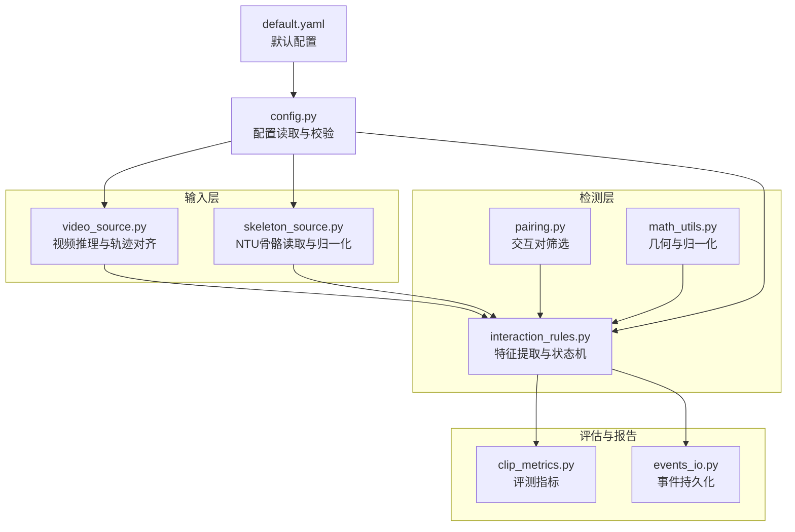
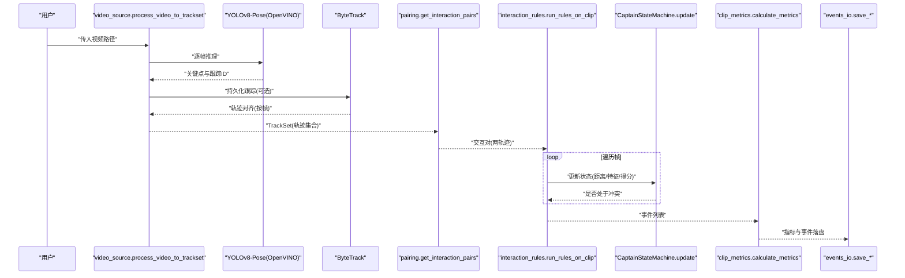
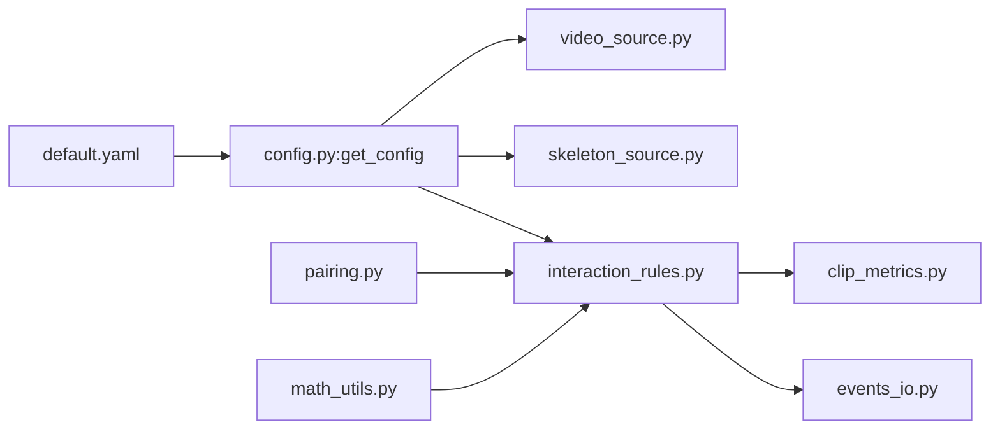

# 性能优化

<cite>
**本文引用的文件**
- [README.md](file://README.md)
- [default.yaml](file://configs/default.yaml)
- [config.py](file://src/fightguard/config.py)
- [math_utils.py](file://src/fightguard/detection/math_utils.py)
- [pairing.py](file://src/fightguard/detection/pairing.py)
- [interaction_rules.py](file://src/fightguard/detection/interaction_rules.py)
- [skeleton_source.py](file://src/fightguard/inputs/skeleton_source.py)
- [video_source.py](file://src/fightguard/inputs/video_source.py)
- [clip_metrics.py](file://src/fightguard/evaluation/clip_metrics.py)
- [events_io.py](file://src/fightguard/reporting/events_io.py)
- [extract_features_eda.py](file://scripts/extract_features_eda.py)
- [calculate_entropy_weights.py](file://scripts/calculate_entropy_weights.py)
- [eval_video_dataset.py](file://scripts/eval_video_dataset.py)
</cite>

## 目录
1. [简介](#简介)
2. [项目结构](#项目结构)
3. [核心组件](#核心组件)
4. [架构总览](#架构总览)
5. [详细组件分析](#详细组件分析)
6. [依赖分析](#依赖分析)
7. [性能考虑](#性能考虑)
8. [故障排查指南](#故障排查指南)
9. [结论](#结论)
10. [附录](#附录)

## 简介
本指南面向KidGuard项目，聚焦于算法优化、内存管理、并行处理、性能监控与缓存机制设计，提供可落地的优化建议与实践案例，帮助在保持检测精度的同时提升实时性与稳定性。

## 项目结构
项目采用模块化分层组织，核心模块包括：
- 输入层：视频与骨骼数据读取与预处理
- 检测层：关键点几何与物理特征提取、状态机判定
- 评估与报告：指标计算与事件持久化
- 配置与脚本：参数配置、特征提取与评测脚本

图表来源
- [video_source.py:1-193](file://src/fightguard/inputs/video_source.py#L1-L193)
- [skeleton_source.py:1-331](file://src/fightguard/inputs/skeleton_source.py#L1-L331)
- [pairing.py:1-54](file://src/fightguard/detection/pairing.py#L1-L54)
- [math_utils.py:1-52](file://src/fightguard/detection/math_utils.py#L1-L52)
- [interaction_rules.py:1-584](file://src/fightguard/detection/interaction_rules.py#L1-L584)
- [clip_metrics.py:1-47](file://src/fightguard/evaluation/clip_metrics.py#L1-L47)
- [events_io.py:1-36](file://src/fightguard/reporting/events_io.py#L1-L36)
- [config.py:1-120](file://src/fightguard/config.py#L1-L120)
- [default.yaml:1-67](file://configs/default.yaml#L1-L67)

章节来源
- [README.md:46-76](file://README.md#L46-L76)

## 核心组件
- 配置系统：统一读取与缓存配置，支持热重载，避免重复I/O与硬编码阈值。
- 几何与归一化：提供关键点中心、肩宽尺度、欧氏距离等基础工具，支撑特征稳定化。
- 人员配对：基于轨迹中心与平均距离筛选交互对，剔除短暂/无效轨迹。
- 物理特征与状态机：提取加速度、角加速度、相对接近速度、躯干倾角变化等，结合四段式状态机与时间窗确认，抑制瞬时噪声。
- 视频推理与轨迹对齐：使用YOLOv8-Pose（OpenVINO加速）+ ByteTrack进行追踪，对齐到相同帧数以保证时序一致性。
- 指标与事件输出：计算评测指标并持久化事件结果。

章节来源
- [config.py:32-92](file://src/fightguard/config.py#L32-L92)
- [math_utils.py:10-52](file://src/fightguard/detection/math_utils.py#L10-L52)
- [pairing.py:14-54](file://src/fightguard/detection/pairing.py#L14-L54)
- [interaction_rules.py:38-556](file://src/fightguard/detection/interaction_rules.py#L38-L556)
- [video_source.py:41-193](file://src/fightguard/inputs/video_source.py#L41-L193)
- [clip_metrics.py:9-46](file://src/fightguard/evaluation/clip_metrics.py#L9-L46)
- [events_io.py:12-36](file://src/fightguard/reporting/events_io.py#L12-L36)

## 架构总览
KidGuard的处理链路自上而下为：输入 → 预处理 → 配对 → 特征提取 → 状态机判定 → 事件生成与评估。

图表来源
- [video_source.py:57-193](file://src/fightguard/inputs/video_source.py#L57-L193)
- [pairing.py:14-54](file://src/fightguard/detection/pairing.py#L14-L54)
- [interaction_rules.py:463-556](file://src/fightguard/detection/interaction_rules.py#L463-L556)
- [clip_metrics.py:9-46](file://src/fightguard/evaluation/clip_metrics.py#L9-L46)
- [events_io.py:12-36](file://src/fightguard/reporting/events_io.py#L12-L36)

## 详细组件分析

### 算法优化技巧

#### 关键点计算优化
- 优先使用字典键名访问关键点，避免硬编码索引，减少维护成本与错误风险。
- 在配对前对轨迹进行“存活时间过滤”，剔除仅少量有效帧的短轨迹，降低无效计算。
- 使用轨迹中心近似代替复杂几何计算，减少每帧开销。

章节来源
- [skeleton_source.py:39-57](file://src/fightguard/inputs/skeleton_source.py#L39-L57)
- [skeleton_source.py:211-274](file://src/fightguard/inputs/skeleton_source.py#L211-L274)
- [pairing.py:17-28](file://src/fightguard/detection/pairing.py#L17-L28)
- [math_utils.py:14-35](file://src/fightguard/detection/math_utils.py#L14-L35)

#### 距离算法优化
- 使用轨迹中心平均距离作为候选对筛选依据，避免对所有帧逐一计算两两距离。
- 对无效关键点（全零）进行早返回，减少无效分支的计算。

章节来源
- [pairing.py:6-12](file://src/fightguard/detection/pairing.py#L6-L12)
- [pairing.py:34-48](file://src/fightguard/detection/pairing.py#L34-L48)
- [math_utils.py:10-12](file://src/fightguard/detection/math_utils.py#L10-L12)

#### 状态机执行优化
- 反瞬移过滤：对异常归一化特征直接置零，阻止状态机升级，减少后续无效计算。
- 时间窗确认：仅在满足作用-响应条件的帧数达到阈值时才进入冲突态，避免误报。
- 得分平滑：对最终得分进行滑动窗口平滑，降低波动影响。

章节来源
- [interaction_rules.py:258-411](file://src/fightguard/detection/interaction_rules.py#L258-L411)
- [interaction_rules.py:294-410](file://src/fightguard/detection/interaction_rules.py#L294-L410)

#### 特征提取与归一化
- 肩宽尺度作为归一化标尺，避免不同身高个体带来的尺度偏差。
- 特征归一化采用区间映射，确保不同物理量在同一尺度下比较。
- 置信度抑制：对低置信度帧降低得分权重，避免噪声干扰。

章节来源
- [interaction_rules.py:38-51](file://src/fightguard/detection/interaction_rules.py#L38-L51)
- [interaction_rules.py:420-444](file://src/fightguard/detection/interaction_rules.py#L420-L444)
- [interaction_rules.py:206-246](file://src/fightguard/detection/interaction_rules.py#L206-L246)

### 内存管理最佳实践

#### 数据结构优化
- 轨迹对齐：将所有轨迹填充到相同帧数，保证索引一致性，避免频繁查找与拼接。
- 关键点字典：统一使用COCO-17键名，减少类型转换与额外封装。

章节来源
- [video_source.py:167-180](file://src/fightguard/inputs/video_source.py#L167-L180)
- [skeleton_source.py:174-204](file://src/fightguard/inputs/skeleton_source.py#L174-L204)

#### 缓存策略设计
- 配置缓存：模块级缓存配置字典，首次读取后复用，避免重复I/O。
- 模型缓存：模块级缓存YOLO模型实例，避免重复加载与初始化开销。

章节来源
- [config.py:20-22](file://src/fightguard/config.py#L20-L22)
- [config.py:85-92](file://src/fightguard/config.py#L85-L92)
- [video_source.py:28-31](file://src/fightguard/inputs/video_source.py#L28-L31)
- [video_source.py:41-49](file://src/fightguard/inputs/video_source.py#L41-L49)

#### 垃圾回收控制
- 避免在热路径中创建临时对象（如频繁构造列表/字典），尽量复用容器。
- 控制状态机内部缓冲区长度，及时弹出过期元素，防止无限增长。

章节来源
- [interaction_rules.py:288-292](file://src/fightguard/detection/interaction_rules.py#L288-L292)
- [interaction_rules.py:384-396](file://src/fightguard/detection/interaction_rules.py#L384-L396)
- [interaction_rules.py:399-401](file://src/fightguard/detection/interaction_rules.py#L399-L401)

### 并行处理实现方法

#### 多线程处理
- 后台秒表线程：在评测脚本中使用守护线程实时显示耗时，避免主线程阻塞导致终端假死。
- 建议：将视频读取、模型推理与特征计算拆分为独立线程池，注意线程安全与共享状态保护。

章节来源
- [eval_video_dataset.py:64-106](file://scripts/eval_video_dataset.py#L64-L106)

#### GPU加速利用
- OpenVINO硬件加速：直接加载OpenVINO导出的模型目录，Ultralytics自动识别并使用Intel GPU/NPU。
- 建议：在资源允许时启用多设备并行推理，或结合批处理提升吞吐。

章节来源
- [video_source.py:41-49](file://src/fightguard/inputs/video_source.py#L41-L49)

#### OpenVINO硬件加速配置
- 模型路径：使用OpenVINO导出的模型目录，确保设备驱动与运行时环境正确安装。
- 建议：根据目标设备选择合适的精度（FP16/INT8）与批大小，平衡延迟与吞吐。

章节来源
- [video_source.py:41-49](file://src/fightguard/inputs/video_source.py#L41-L49)

### 性能监控方法

#### 关键指标测量
- 评测指标：Accuracy、Precision、Recall、FPR、F1，用于评估系统整体性能。
- 建议：在脚本中记录每类样本的TP/FP/TN/FN，便于定位误报/漏报场景。

章节来源
- [clip_metrics.py:9-46](file://src/fightguard/evaluation/clip_metrics.py#L9-L46)
- [eval_video_dataset.py:109-122](file://scripts/eval_video_dataset.py#L109-L122)

#### 瓶颈识别技术
- 视频推理：YOLO推理时间占主导，可通过OpenVINO加速与批处理优化。
- 状态机：滑动窗口与时间窗确认带来一定计算开销，可通过阈值调整与缓冲区长度优化。
- I/O：配置与事件落盘为顺序I/O，建议批量写入与异步落盘。

章节来源
- [video_source.py:97-159](file://src/fightguard/inputs/video_source.py#L97-L159)
- [interaction_rules.py:294-410](file://src/fightguard/detection/interaction_rules.py#L294-L410)
- [events_io.py:12-36](file://src/fightguard/reporting/events_io.py#L12-L36)

#### 性能回归检测
- 建议：在CI中集成评测脚本，对比关键指标与总耗时，发现回归立即报警。
- 建议：对不同阈值组合进行A/B测试，记录指标与延迟，形成性能基线。

章节来源
- [eval_video_dataset.py:24-132](file://scripts/eval_video_dataset.py#L24-L132)

### 缓存机制设计

#### 配置缓存
- 首次读取后缓存配置字典，后续调用直接返回缓存，支持强制重载。

章节来源
- [config.py:20-22](file://src/fightguard/config.py#L20-L22)
- [config.py:85-92](file://src/fightguard/config.py#L85-L92)

#### 中间结果缓存
- 建议：对特征提取与配对结果进行短期缓存（按clip_id），避免重复计算。
- 建议：对状态机历史窗口进行LRU缓存，减少滚动窗口维护成本。

章节来源
- [pairing.py:14-54](file://src/fightguard/detection/pairing.py#L14-L54)
- [interaction_rules.py:288-292](file://src/fightguard/detection/interaction_rules.py#L288-L292)

#### 模型权重缓存
- 建议：将OpenVINO模型缓存在模块级变量中，避免重复加载。
- 建议：在部署环境中预热模型，减少首帧延迟。

章节来源
- [video_source.py:28-31](file://src/fightguard/inputs/video_source.py#L28-L31)
- [video_source.py:41-49](file://src/fightguard/inputs/video_source.py#L41-L49)

### 优化示例

#### 视频处理流水线优化
- 使用ByteTrack进行持久化跟踪，降低每帧匹配成本。
- 对齐轨迹到相同帧数，保证时序一致性，减少跨帧查找。
- 启用OpenVINO加速，显著降低推理延迟。

章节来源
- [video_source.py:115-159](file://src/fightguard/inputs/video_source.py#L115-L159)
- [video_source.py:167-180](file://src/fightguard/inputs/video_source.py#L167-L180)
- [video_source.py:41-49](file://src/fightguard/inputs/video_source.py#L41-L49)

#### 批量处理优化
- EDA特征提取脚本中使用tqdm显示进度，避免长时间无反馈。
- 批量读取数据集时限制最大clip数量，便于快速迭代。

章节来源
- [extract_features_eda.py:28-106](file://scripts/extract_features_eda.py#L28-L106)
- [skeleton_source.py:281-330](file://src/fightguard/inputs/skeleton_source.py#L281-L330)

#### 实时性改进
- 后台秒表线程缓解终端假死，提升开发体验。
- 通过阈值与窗口参数微调，平衡误报与漏报，提升用户体验。

章节来源
- [eval_video_dataset.py:64-106](file://scripts/eval_video_dataset.py#L64-L106)
- [eval_video_dataset.py:31-34](file://scripts/eval_video_dataset.py#L31-L34)

## 依赖分析

图表来源
- [default.yaml:1-67](file://configs/default.yaml#L1-L67)
- [config.py:32-92](file://src/fightguard/config.py#L32-L92)
- [video_source.py:25-26](file://src/fightguard/inputs/video_source.py#L25-L26)
- [skeleton_source.py:29](file://src/fightguard/inputs/skeleton_source.py#L29)
- [interaction_rules.py:17](file://src/fightguard/detection/interaction_rules.py#L17)
- [pairing.py:3](file://src/fightguard/detection/pairing.py#L3)
- [math_utils.py:8](file://src/fightguard/detection/math_utils.py#L8)
- [clip_metrics.py:7](file://src/fightguard/evaluation/clip_metrics.py#L7)
- [events_io.py:10](file://src/fightguard/reporting/events_io.py#L10)

## 性能考虑
- 算法层面：优先使用高效的数据结构与早停策略，减少无效计算。
- 内存层面：缓存热点数据与模型，避免重复I/O与初始化。
- 并行层面：利用OpenVINO硬件加速与多线程，提升吞吐与响应。
- 监控层面：建立指标与耗时基线，持续检测回归。

## 故障排查指南
- 配置文件缺失或格式错误：检查配置读取与校验逻辑，确保必需字段齐全。
- 视频读取失败：确认视频路径与OpenCV可用性，检查FPS与尺寸合法性。
- 未检测到人员：检查YOLO阈值与ByteTrack配置，适当降低置信度阈值。
- 事件输出为空：确认事件持久化路径与权限，检查事件生成逻辑。

章节来源
- [config.py:61-82](file://src/fightguard/config.py#L61-L82)
- [video_source.py:80-84](file://src/fightguard/inputs/video_source.py#L80-L84)
- [video_source.py:115-124](file://src/fightguard/inputs/video_source.py#L115-L124)
- [events_io.py:17-35](file://src/fightguard/reporting/events_io.py#L17-L35)

## 结论
通过在关键点计算、距离算法、状态机执行上的针对性优化，配合配置与模型缓存、OpenVINO硬件加速以及多线程监控，KidGuard可在保证检测精度的前提下显著提升实时性与稳定性。建议在持续集成中引入性能回归检测，确保优化效果可追踪、可量化。

## 附录
- 配置参数参考：规则阈值、状态机参数、输出设置、数据集定义等。
- 数据驱动赋权：使用EDA特征与熵权法计算客观权重，指导特征融合。

章节来源
- [default.yaml:16-67](file://configs/default.yaml#L16-L67)
- [extract_features_eda.py:28-106](file://scripts/extract_features_eda.py#L28-L106)
- [calculate_entropy_weights.py:12-71](file://scripts/calculate_entropy_weights.py#L12-L71)