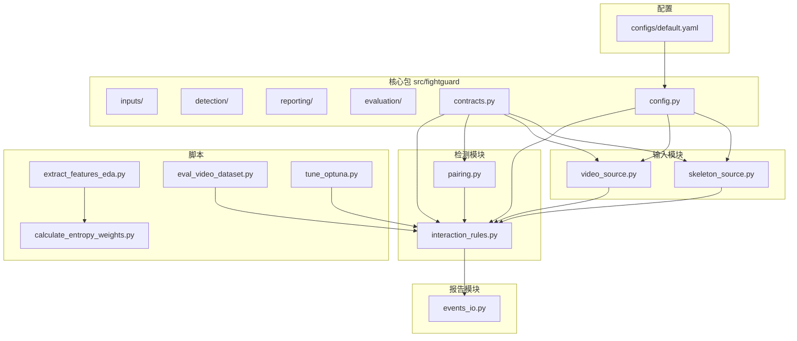
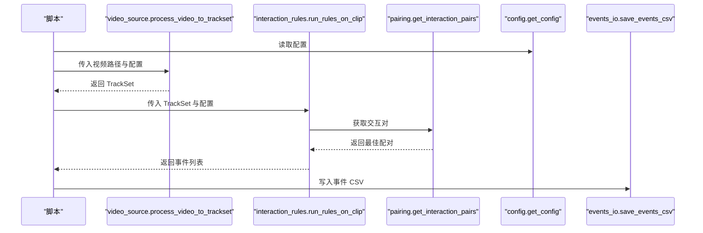
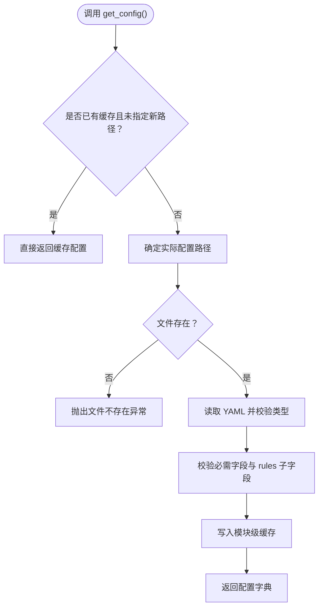
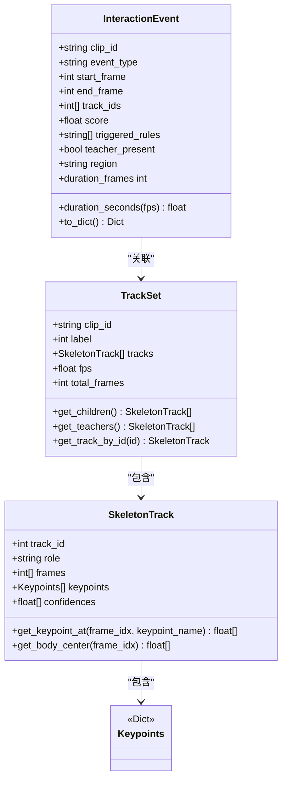
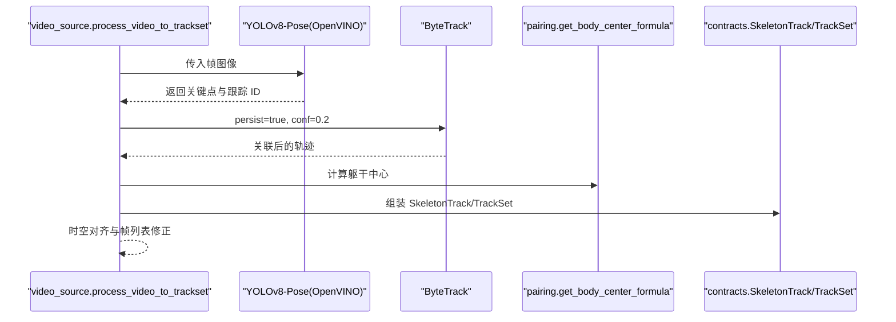
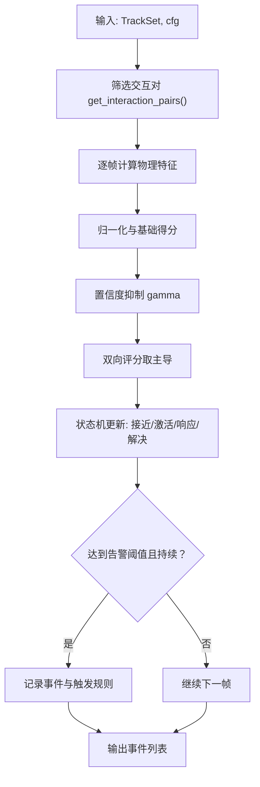
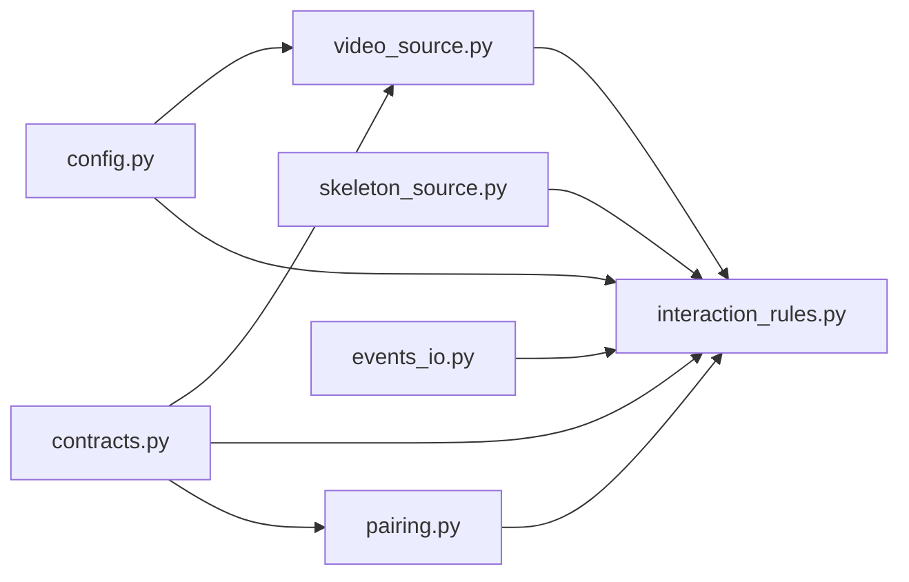

# 扩展开发

<cite>
**本文引用的文件**
- [README.md](file://README.md)
- [default.yaml](file://configs/default.yaml)
- [config.py](file://src/fightguard/config.py)
- [contracts.py](file://src/fightguard/contracts.py)
- [interaction_rules.py](file://src/fightguard/detection/interaction_rules.py)
- [pairing.py](file://src/fightguard/detection/pairing.py)
- [skeleton_source.py](file://src/fightguard/inputs/skeleton_source.py)
- [video_source.py](file://src/fightguard/inputs/video_source.py)
- [events_io.py](file://src/fightguard/reporting/events_io.py)
- [extract_features_eda.py](file://scripts/extract_features_eda.py)
- [calculate_entropy_weights.py](file://scripts/calculate_entropy_weights.py)
- [eval_video_dataset.py](file://scripts/eval_video_dataset.py)
- [tune_optuna.py](file://scripts/tune_optuna.py)
</cite>

## 目录
1. [简介](#简介)
2. [项目结构](#项目结构)
3. [核心组件](#核心组件)
4. [架构总览](#架构总览)
5. [详细组件分析](#详细组件分析)
6. [依赖分析](#依赖分析)
7. [性能考虑](#性能考虑)
8. [故障排查指南](#故障排查指南)
9. [结论](#结论)
10. [附录](#附录)

## 简介
本指南面向希望为 KidGuard 项目添加新功能模块、扩展规则、替换检测模型、优化性能与实现插件化扩展的开发者。文档基于仓库现有代码与配置，给出模块结构设计、接口定义、依赖关系管理、规则扩展方法、模型替换步骤、性能优化策略以及插件使用建议，并提供可操作的扩展示例与测试方法。

## 项目结构
项目采用模块化分层组织，核心包 fightguard 下按职责划分为输入、检测、评估、报告等子模块；scripts 提供阶段性的运行入口；configs 提供全局配置；outputs 保存中间与最终结果。

**图表来源**
- [default.yaml:1-62](file://configs/default.yaml#L1-L62)
- [config.py:32-82](file://src/fightguard/config.py#L32-L82)
- [contracts.py:15-241](file://src/fightguard/contracts.py#L15-L241)
- [interaction_rules.py:1-531](file://src/fightguard/detection/interaction_rules.py#L1-L531)
- [pairing.py:1-54](file://src/fightguard/detection/pairing.py#L1-L54)
- [skeleton_source.py:1-331](file://src/fightguard/inputs/skeleton_source.py#L1-L331)
- [video_source.py:1-193](file://src/fightguard/inputs/video_source.py#L1-L193)
- [events_io.py:1-36](file://src/fightguard/reporting/events_io.py#L1-L36)
- [extract_features_eda.py:1-106](file://scripts/extract_features_eda.py#L1-L106)
- [calculate_entropy_weights.py:1-71](file://scripts/calculate_entropy_weights.py#L1-L71)
- [eval_video_dataset.py:1-132](file://scripts/eval_video_dataset.py#L1-L132)
- [tune_optuna.py:1-132](file://scripts/tune_optuna.py#L1-L132)

**章节来源**
- [README.md:46-76](file://README.md#L46-L76)

## 核心组件
- 配置系统：集中读取与校验 configs/default.yaml，提供统一配置访问接口，支持强制重载。
- 数据契约：定义 Keypoints、SkeletonTrack、TrackSet、InteractionEvent 等统一数据结构与工具函数。
- 输入模块：视频输入（YOLOv8-Pose + ByteTrack）与骨骼数据（NTU RGBD）读取与归一化。
- 检测模块：交互规则与状态机、特征提取、置信度抑制、配对策略。
- 报告模块：事件日志 CSV 写入。
- 脚本：特征提取（EDA）、熵权法赋权、视频数据集评测、自动化调参。

**章节来源**
- [config.py:32-120](file://src/fightguard/config.py#L32-L120)
- [contracts.py:15-241](file://src/fightguard/contracts.py#L15-L241)
- [video_source.py:57-193](file://src/fightguard/inputs/video_source.py#L57-L193)
- [skeleton_source.py:211-331](file://src/fightguard/inputs/skeleton_source.py#L211-L331)
- [interaction_rules.py:360-531](file://src/fightguard/detection/interaction_rules.py#L360-L531)
- [events_io.py:12-36](file://src/fightguard/reporting/events_io.py#L12-L36)

## 架构总览
KidGuard 的处理管线自输入到检测再到评测与报告，形成一条稳定的端到端流水线。配置系统贯穿始终，确保参数一致性与可调性。

**图表来源**
- [eval_video_dataset.py:84-102](file://scripts/eval_video_dataset.py#L84-L102)
- [video_source.py:57-193](file://src/fightguard/inputs/video_source.py#L57-L193)
- [interaction_rules.py:410-503](file://src/fightguard/detection/interaction_rules.py#L410-L503)
- [pairing.py:14-53](file://src/fightguard/detection/pairing.py#L14-L53)
- [events_io.py:23-36](file://src/fightguard/reporting/events_io.py#L23-L36)

## 详细组件分析

### 配置系统与依赖管理
- 统一入口：通过 config.get_config() 读取并缓存配置，后续模块统一从该接口获取配置。
- 校验机制：在首次加载时校验必需字段（paths、rules、dataset、output），缺失时报错。
- 重载能力：reload_config() 支持在调试过程中无需重启即加载新阈值。
- 依赖关系：检测与输入模块均依赖配置系统，确保规则阈值、追踪器、输出路径等集中管理。

**图表来源**
- [config.py:32-120](file://src/fightguard/config.py#L32-L120)

**章节来源**
- [config.py:32-120](file://src/fightguard/config.py#L32-L120)
- [default.yaml:1-62](file://configs/default.yaml#L1-L62)

### 数据契约与结构设计
- Keypoints：COCO-17 名称到坐标字典，支持置信度透传。
- SkeletonTrack：单人多帧轨迹，提供按帧查询与身体中心计算。
- TrackSet：片段级轨迹集合，包含标签、FPS、总帧数等元信息。
- InteractionEvent：事件结构化描述，包含类型、起止帧、触发规则、教师在场等。

**图表来源**
- [contracts.py:56-241](file://src/fightguard/contracts.py#L56-L241)

**章节来源**
- [contracts.py:15-241](file://src/fightguard/contracts.py#L15-L241)

### 输入模块：视频与骨骼数据
- 视频输入：使用 YOLOv8-Pose（OpenVINO 加速）逐帧推理，结合 ByteTrack 追踪器进行 ID 关联；对轨迹进行时空对齐，保证每帧严格对应。
- 骨骼数据（NTU）：解析 .skeleton 文件，按映射表将 NTU 25 点映射到 COCO-17，归一化坐标并构造 TrackSet；支持按动作类别判断冲突/正常样本。

**图表来源**
- [video_source.py:57-193](file://src/fightguard/inputs/video_source.py#L57-L193)
- [pairing.py:6-12](file://src/fightguard/detection/pairing.py#L6-L12)

**章节来源**
- [video_source.py:57-193](file://src/fightguard/inputs/video_source.py#L57-L193)
- [skeleton_source.py:211-331](file://src/fightguard/inputs/skeleton_source.py#L211-L331)

### 检测模块：规则与状态机
- 特征提取：肢体加速度、相对接近速度、关节角加速度、躯干倾角变化、骨盆速度等。
- 置信度抑制：基于平均关键点置信度动态调整得分，缓解低质量检测带来的误报。
- 状态机：四段式状态机（接近、动作激活、作用-响应、解决），严格同步因果律，配合平滑窗口与告警阈值。
- 主流程：对交互对逐帧评分，主导方向得分，状态机判定事件，收集触发规则并生成事件。

**图表来源**
- [interaction_rules.py:410-503](file://src/fightguard/detection/interaction_rules.py#L410-L503)
- [pairing.py:14-53](file://src/fightguard/detection/pairing.py#L14-L53)

**章节来源**
- [interaction_rules.py:360-531](file://src/fightguard/detection/interaction_rules.py#L360-L531)
- [pairing.py:1-54](file://src/fightguard/detection/pairing.py#L1-L54)

### 报告模块：事件持久化
- 事件 CSV：将 InteractionEvent 转换为字典写入 CSV。
- 指标 CSV：评测明细写入 CSV，便于后续分析。

**章节来源**
- [events_io.py:12-36](file://src/fightguard/reporting/events_io.py#L12-L36)

### 脚本与工作流
- 特征提取（EDA）：遍历数据集，提取四个核心特征峰值，保存为 CSV。
- 熵权法赋权：读取 EDA 结果，使用信息熵客观计算权重。
- 视频数据集评测：批量处理视频，统计指标并输出结果。
- 自动化调参：基于 Optuna 在认知层搜索最优规则阈值与状态机参数。

**章节来源**
- [extract_features_eda.py:28-102](file://scripts/extract_features_eda.py#L28-L102)
- [calculate_entropy_weights.py:12-71](file://scripts/calculate_entropy_weights.py#L12-L71)
- [eval_video_dataset.py:24-132](file://scripts/eval_video_dataset.py#L24-L132)
- [tune_optuna.py:21-132](file://scripts/tune_optuna.py#L21-L132)

## 依赖分析
- 模块内聚：输入、检测、报告各自职责明确，通过 contracts 统一数据契约。
- 模块耦合：检测模块依赖输入模块提供的 TrackSet；配置系统被输入与检测共同依赖；报告模块依赖检测输出的事件。
- 外部依赖：OpenCV、Ultralytics YOLOv8、Optuna、pandas/numpy 等。

**图表来源**
- [video_source.py:1-193](file://src/fightguard/inputs/video_source.py#L1-L193)
- [skeleton_source.py:1-331](file://src/fightguard/inputs/skeleton_source.py#L1-L331)
- [interaction_rules.py:1-531](file://src/fightguard/detection/interaction_rules.py#L1-L531)
- [pairing.py:1-54](file://src/fightguard/detection/pairing.py#L1-L54)
- [config.py:1-120](file://src/fightguard/config.py#L1-L120)
- [contracts.py:1-241](file://src/fightguard/contracts.py#L1-L241)
- [events_io.py:1-36](file://src/fightguard/reporting/events_io.py#L1-L36)

**章节来源**
- [README.md:46-76](file://README.md#L46-L76)

## 性能考虑
- 模型推理加速：使用 OpenVINO 加速 YOLOv8-Pose 推理，显著降低 CPU 占用与延迟。
- 追踪器优化：启用 ByteTrack，降低低分检测框的抖动与 ID 跳变，提升轨迹稳定性。
- 时空对齐：将轨迹对齐到相同总帧数，避免跨帧不一致导致的额外判断成本。
- 状态机平滑：通过平滑窗口与告警阈值减少瞬时噪声误报。
- 缓存与懒加载：配置系统模块级缓存与 YOLO 模型懒加载，避免重复初始化。
- 批处理与并发：评测脚本使用多线程实时秒表与进度条，改善交互体验；可进一步在数据加载与规则执行阶段引入并行策略（注意线程安全与共享资源竞争）。

**章节来源**
- [video_source.py:41-49](file://src/fightguard/inputs/video_source.py#L41-L49)
- [video_source.py:115-118](file://src/fightguard/inputs/video_source.py#L115-L118)
- [video_source.py:167-181](file://src/fightguard/inputs/video_source.py#L167-L181)
- [interaction_rules.py:258-358](file://src/fightguard/detection/interaction_rules.py#L258-L358)
- [config.py:22-29](file://src/fightguard/config.py#L22-L29)
- [eval_video_dataset.py:64-81](file://scripts/eval_video_dataset.py#L64-L81)

## 故障排查指南
- 配置文件缺失或格式错误：检查 configs/default.yaml 是否存在与结构正确；若缺失必填字段，将触发校验异常。
- 视频读取失败：确认视频路径可读、OpenCV 能打开视频；若未检测到人，process_video_to_trackset 将返回 None。
- NTU 文件名不符合规范：解析 clip_id 时会抛出异常，需检查文件命名格式。
- 事件 CSV 写入失败：确认输出目录存在或可创建，字段名与事件对象一致。
- 调参与评测中断：评测脚本提供后台秒表线程与进度条，异常退出时会安全关闭线程；调参脚本建议固定随机种子以复现结果。

**章节来源**
- [config.py:61-82](file://src/fightguard/config.py#L61-L82)
- [video_source.py:80-92](file://src/fightguard/inputs/video_source.py#L80-L92)
- [skeleton_source.py:77-89](file://src/fightguard/inputs/skeleton_source.py#L77-L89)
- [events_io.py:17-21](file://src/fightguard/reporting/events_io.py#L17-L21)
- [eval_video_dataset.py:103-107](file://scripts/eval_video_dataset.py#L103-L107)

## 结论
KidGuard 采用模块化设计与统一数据契约，实现了从输入到检测再到评测与报告的完整链路。通过配置系统集中管理参数，检测模块以状态机与物理特征为核心，辅以置信度抑制与轨迹对齐，具备良好的可解释性与可扩展性。开发者可在不破坏现有契约的前提下，按本文指南扩展规则、替换模型、优化性能并实现插件化扩展。

## 附录

### 扩展开发指南（按主题）

#### 一、添加新功能模块
- 模块结构设计
  - 新模块置于 src/fightguard/ 下合适子目录（如 inputs/new_module.py），遵循现有命名与职责划分。
  - 通过 contracts 定义输入输出数据结构，避免直接操作索引。
- 接口定义
  - 输入：接收配置与数据契约对象（如 TrackSet）。
  - 输出：返回事件或中间结果（如 InteractionEvent 列表）。
- 依赖关系管理
  - 仅依赖 config.get_config() 与 contracts，避免直接依赖第三方库或外部模块。
  - 若需外部库，优先通过脚本入口或配置项注入，保持模块内聚。

**章节来源**
- [contracts.py:15-241](file://src/fightguard/contracts.py#L15-L241)
- [config.py:32-82](file://src/fightguard/config.py#L32-L82)

#### 二、规则扩展方法
- 新规则类型的添加
  - 在 detection/interaction_rules.py 中新增特征提取函数与评分逻辑，保持与现有归一化与抑制机制一致。
  - 更新事件触发规则收集逻辑，将新规则纳入 triggered_rules。
- 现有规则的修改
  - 修改阈值与权重时，优先通过 configs/default.yaml 的 rules 字段进行配置化管理；必要时在代码中提供默认值与注释说明。
- 规则参数的配置
  - 使用 config.get_config() 读取 rules 下的阈值与窗口参数；在调试阶段可用 reload_config() 实时生效。

**章节来源**
- [interaction_rules.py:360-531](file://src/fightguard/detection/interaction_rules.py#L360-L531)
- [default.yaml:16-30](file://configs/default.yaml#L16-L30)

#### 三、模型替换实现
- 新检测模型的集成
  - 在 inputs/video_source.py 中替换 YOLO 模型加载逻辑，保持输出关键点字典与置信度格式一致。
  - 确保模型输出与 contracts.Keypoints 的键名一致（COCO-17）。
- 模型接口适配
  - 保持 process_video_to_trackset 的返回值为 TrackSet，内部轨迹对齐与帧列表修正逻辑不变。
- 性能对比方法
  - 使用 scripts/eval_video_dataset.py 与 scripts/tune_optuna.py 对比不同模型在相同数据集上的评测指标与最优参数组合。

**章节来源**
- [video_source.py:41-49](file://src/fightguard/inputs/video_source.py#L41-L49)
- [video_source.py:185-192](file://src/fightguard/inputs/video_source.py#L185-L192)
- [eval_video_dataset.py:24-132](file://scripts/eval_video_dataset.py#L24-L132)
- [tune_optuna.py:21-132](file://scripts/tune_optuna.py#L21-L132)

#### 四、性能优化策略
- 算法优化技巧
  - 使用 OpenVINO 加速推理；启用 ByteTrack 提升轨迹稳定性；对轨迹进行时空对齐。
- 内存管理最佳实践
  - 配置系统模块级缓存；视频轨迹对齐后复用关键点列表；及时释放不再使用的中间变量。
- 并行处理实现
  - 在脚本层引入多进程/多线程（如评测与特征提取），注意线程安全与共享资源竞争；对规则执行阶段谨慎并行，避免状态机共享状态造成竞态。

**章节来源**
- [video_source.py:28-49](file://src/fightguard/inputs/video_source.py#L28-L49)
- [video_source.py:167-181](file://src/fightguard/inputs/video_source.py#L167-L181)
- [config.py:22-29](file://src/fightguard/config.py#L22-L29)
- [eval_video_dataset.py:64-81](file://scripts/eval_video_dataset.py#L64-L81)

#### 五、插件系统使用指南
- 扩展点识别
  - 配置扩展：在 configs/default.yaml 中新增字段，通过 config.get_config() 读取。
  - 规则扩展：在 detection/interaction_rules.py 中新增特征与评分逻辑。
  - 输入扩展：在 inputs/ 新增数据源读取模块，保持返回 TrackSet。
- 钩子函数注册
  - 通过脚本入口（scripts/*.py）注册与调度新模块；在 run_rules_on_clip 中按需调用新规则。
- 配置文件扩展
  - 在 default.yaml 中新增 rules 或 paths 子项，确保校验通过；在 config._validate_config 中补充必填字段校验。

**章节来源**
- [default.yaml:1-62](file://configs/default.yaml#L1-L62)
- [config.py:95-120](file://src/fightguard/config.py#L95-L120)
- [interaction_rules.py:410-503](file://src/fightguard/detection/interaction_rules.py#L410-L503)
- [video_source.py:57-193](file://src/fightguard/inputs/video_source.py#L57-L193)

#### 六、扩展示例与测试方法
- 扩展示例
  - 新增规则：在 interaction_rules.py 添加特征与评分函数，在事件收集处加入触发规则标识。
  - 新增输入：在 inputs/ 新建模块，实现 load_dataset/load_skeleton_file/process_video_to_trackset 等函数，返回 TrackSet。
- 测试方法
  - 使用 scripts/extract_features_eda.py 与 scripts/calculate_entropy_weights.py 验证特征提取与赋权流程。
  - 使用 scripts/eval_video_dataset.py 在真实视频数据集上评测，观察指标变化。
  - 使用 scripts/tune_optuna.py 进行自动化调参，定位最优规则阈值组合。

**章节来源**
- [extract_features_eda.py:28-102](file://scripts/extract_features_eda.py#L28-L102)
- [calculate_entropy_weights.py:12-71](file://scripts/calculate_entropy_weights.py#L12-L71)
- [eval_video_dataset.py:24-132](file://scripts/eval_video_dataset.py#L24-L132)
- [tune_optuna.py:21-132](file://scripts/tune_optuna.py#L21-L132)