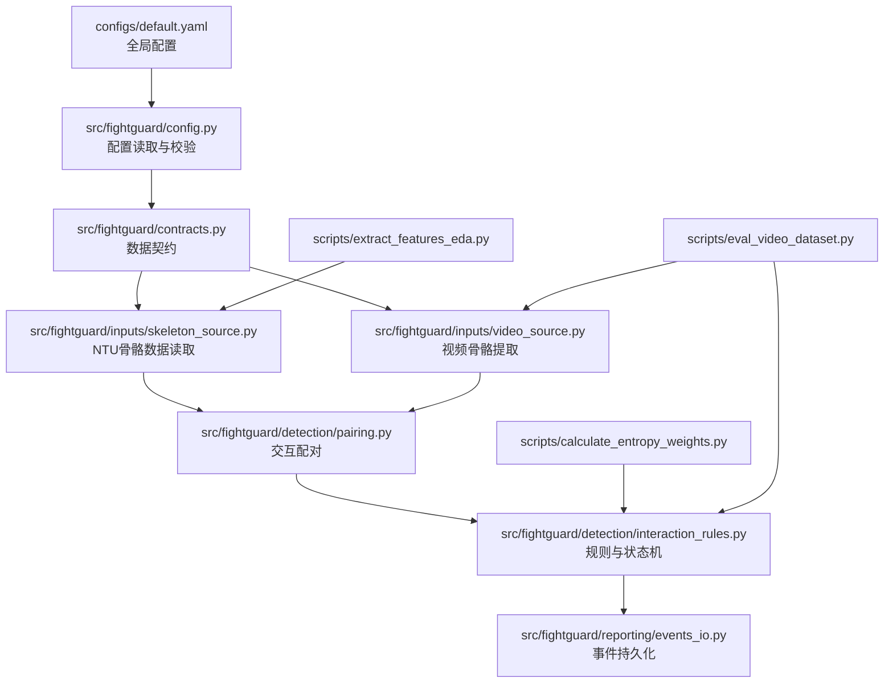
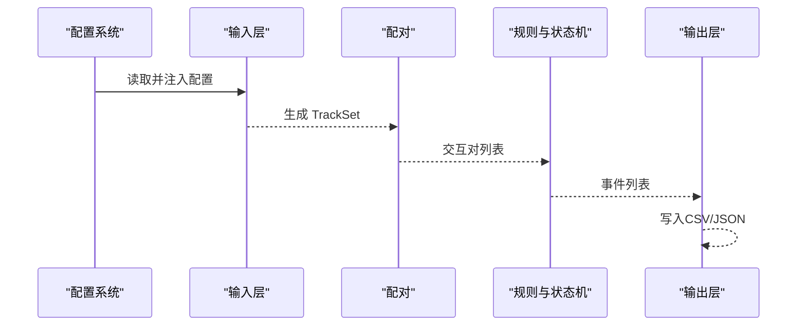
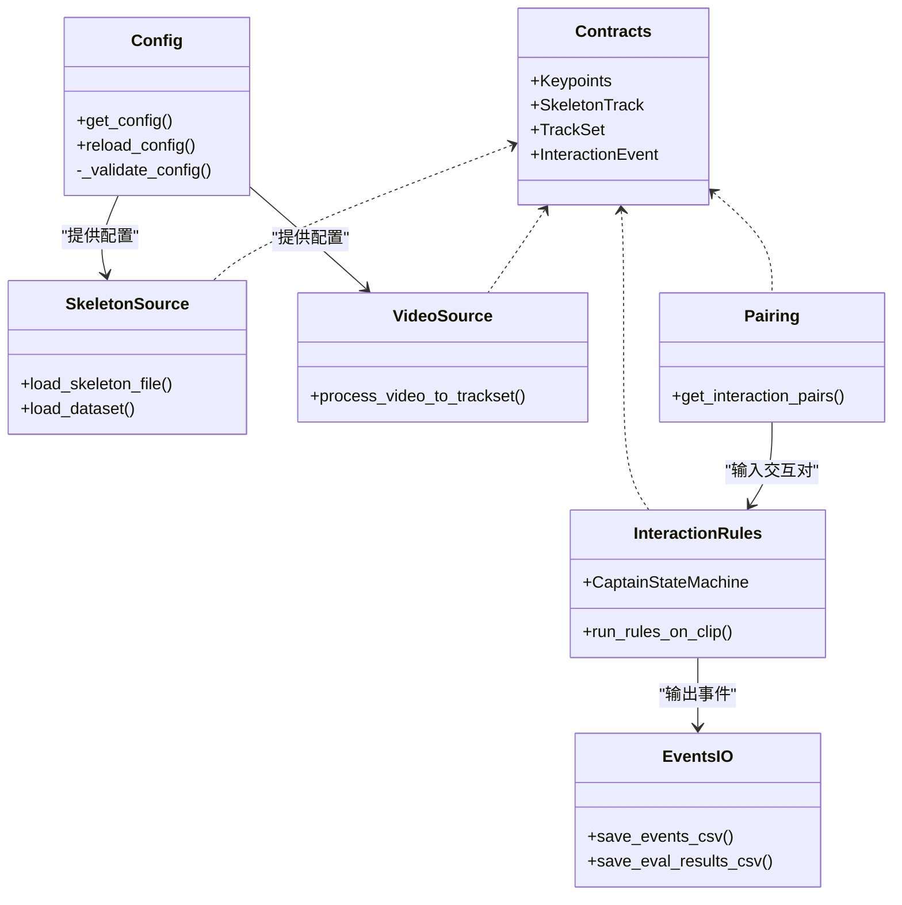
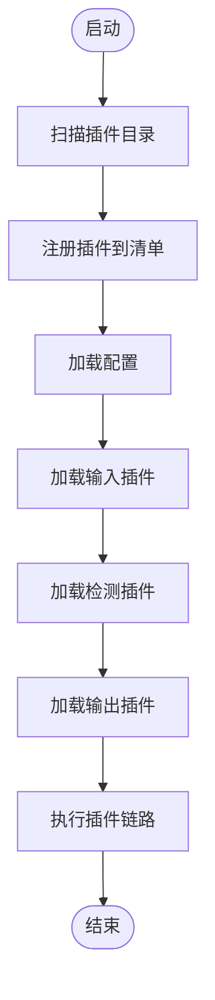
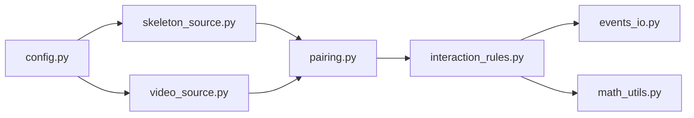

# 插件系统

<cite>
**本文引用的文件**
- [README.md](file://README.md)
- [default.yaml](file://configs/default.yaml)
- [config.py](file://src/fightguard/config.py)
- [contracts.py](file://src/fightguard/contracts.py)
- [skeleton_source.py](file://src/fightguard/inputs/skeleton_source.py)
- [video_source.py](file://src/fightguard/inputs/video_source.py)
- [pairing.py](file://src/fightguard/detection/pairing.py)
- [interaction_rules.py](file://src/fightguard/detection/interaction_rules.py)
- [math_utils.py](file://src/fightguard/detection/math_utils.py)
- [events_io.py](file://src/fightguard/reporting/events_io.py)
- [extract_features_eda.py](file://scripts/extract_features_eda.py)
- [calculate_entropy_weights.py](file://scripts/calculate_entropy_weights.py)
- [eval_video_dataset.py](file://scripts/eval_video_dataset.py)
</cite>

## 目录
1. [简介](#简介)
2. [项目结构](#项目结构)
3. [核心组件](#核心组件)
4. [架构总览](#架构总览)
5. [详细组件分析](#详细组件分析)
6. [依赖分析](#依赖分析)
7. [性能考虑](#性能考虑)
8. [故障排查指南](#故障排查指南)
9. [结论](#结论)
10. [附录](#附录)

## 简介
本指南面向KidGuard项目，提供一套可扩展的插件系统开发框架。目标是在不破坏现有模块化结构的前提下，为以下方面提供扩展点：
- 数据输入层：自定义数据源（如新的骨架数据格式、视频流协议）
- 检测层：第三方检测模型接入、自定义规则与状态机扩展
- 输出层：自定义事件输出格式、可视化扩展
- 配置层：新增配置项、默认值与校验规则扩展

本指南将给出扩展点识别方法、插件接口规范、生命周期管理、注册与发现机制、配置扩展方法、测试策略以及完整示例。

## 项目结构
KidGuard采用分层模块化组织，核心目录与职责如下：
- configs：全局配置与规则阈值
- src/fightguard：核心业务包，按功能划分为 inputs、detection、evaluation、reporting 等子模块
- scripts：阶段化运行入口与评测脚本
- outputs：运行结果输出目录

**图示来源**
- [default.yaml:1-67](file://configs/default.yaml#L1-L67)
- [config.py:32-120](file://src/fightguard/config.py#L32-L120)
- [contracts.py:1-241](file://src/fightguard/contracts.py#L1-L241)
- [skeleton_source.py:1-331](file://src/fightguard/inputs/skeleton_source.py#L1-L331)
- [video_source.py:1-193](file://src/fightguard/inputs/video_source.py#L1-L193)
- [pairing.py:1-54](file://src/fightguard/detection/pairing.py#L1-L54)
- [interaction_rules.py:1-584](file://src/fightguard/detection/interaction_rules.py#L1-L584)
- [events_io.py:1-36](file://src/fightguard/reporting/events_io.py#L1-L36)
- [extract_features_eda.py:1-106](file://scripts/extract_features_eda.py#L1-L106)
- [calculate_entropy_weights.py:1-71](file://scripts/calculate_entropy_weights.py#L1-L71)
- [eval_video_dataset.py:1-132](file://scripts/eval_video_dataset.py#L1-L132)

**章节来源**
- [README.md:46-76](file://README.md#L46-L76)

## 核心组件
- 配置系统：统一读取与校验 configs/default.yaml，提供全局配置访问接口，支持强制重载。
- 数据契约：定义 Keypoints、SkeletonTrack、TrackSet、InteractionEvent 等核心数据结构，确保模块间数据格式一致。
- 输入层：NTU骨骼数据读取与视频骨骼提取，二者均产出标准化的 TrackSet。
- 检测层：交互配对、规则与状态机，产出 InteractionEvent 列表。
- 输出层：事件 CSV/JSON 持久化。

**章节来源**
- [config.py:32-120](file://src/fightguard/config.py#L32-L120)
- [contracts.py:56-241](file://src/fightguard/contracts.py#L56-L241)
- [skeleton_source.py:211-331](file://src/fightguard/inputs/skeleton_source.py#L211-L331)
- [video_source.py:57-193](file://src/fightguard/inputs/video_source.py#L57-L193)
- [pairing.py:14-54](file://src/fightguard/detection/pairing.py#L14-L54)
- [interaction_rules.py:463-556](file://src/fightguard/detection/interaction_rules.py#L463-L556)
- [events_io.py:12-36](file://src/fightguard/reporting/events_io.py#L12-L36)

## 架构总览
KidGuard的数据流从输入层产生标准化轨迹，经配对与规则判定生成事件，最终由输出层落盘。配置系统贯穿始终，为各模块提供统一参数来源。

**图示来源**
- [config.py:32-92](file://src/fightguard/config.py#L32-L92)
- [skeleton_source.py:211-274](file://src/fightguard/inputs/skeleton_source.py#L211-L274)
- [video_source.py:57-193](file://src/fightguard/inputs/video_source.py#L57-L193)
- [pairing.py:14-54](file://src/fightguard/detection/pairing.py#L14-L54)
- [interaction_rules.py:463-556](file://src/fightguard/detection/interaction_rules.py#L463-L556)
- [events_io.py:12-36](file://src/fightguard/reporting/events_io.py#L12-L36)

## 详细组件分析

### 扩展点识别与接口定义
- 输入层扩展点
  - 新数据源：实现与 TrackSet 对齐的输入接口，返回标准化轨迹集合。
  - 视频输入：支持新的视频解码/追踪器，保持关键点命名与坐标体系一致。
- 检测层扩展点
  - 自定义规则：在规则流中插入新的特征与阈值，保持与状态机的同步因果一致性。
  - 第三方检测模型：替换或并行接入新的姿态估计模型，保持关键点字典格式。
- 输出层扩展点
  - 新输出格式：在事件持久化处扩展新的写入器，支持多种格式与存储介质。
- 配置扩展点
  - 新增配置项：在 default.yaml 中添加键值，通过 config.py 的校验逻辑进行约束。

**图示来源**
- [config.py:32-120](file://src/fightguard/config.py#L32-L120)
- [contracts.py:56-241](file://src/fightguard/contracts.py#L56-L241)
- [skeleton_source.py:211-331](file://src/fightguard/inputs/skeleton_source.py#L211-L331)
- [video_source.py:57-193](file://src/fightguard/inputs/video_source.py#L57-L193)
- [pairing.py:14-54](file://src/fightguard/detection/pairing.py#L14-L54)
- [interaction_rules.py:463-556](file://src/fightguard/detection/interaction_rules.py#L463-L556)
- [events_io.py:12-36](file://src/fightguard/reporting/events_io.py#L12-L36)

**章节来源**
- [skeleton_source.py:211-331](file://src/fightguard/inputs/skeleton_source.py#L211-L331)
- [video_source.py:57-193](file://src/fightguard/inputs/video_source.py#L57-L193)
- [pairing.py:14-54](file://src/fightguard/detection/pairing.py#L14-L54)
- [interaction_rules.py:258-411](file://src/fightguard/detection/interaction_rules.py#L258-L411)
- [events_io.py:12-36](file://src/fightguard/reporting/events_io.py#L12-L36)
- [config.py:95-120](file://src/fightguard/config.py#L95-L120)

### 插件开发框架
- 插件接口规范
  - 输入插件：实现统一的输入接口，返回标准化的 TrackSet；内部使用 COCO-17 关键点命名，坐标为归一化值。
  - 检测插件：实现规则流的扩展点，保持与状态机的同步因果一致性；可新增特征与阈值。
  - 输出插件：实现事件持久化接口，支持 CSV/JSON 等格式扩展。
- 生命周期管理
  - 初始化：读取配置、建立资源（模型、连接等）。
  - 运行期：接收 TrackSet，产出 InteractionEvent 列表。
  - 清理：释放资源，持久化中间结果。
- 配置文件扩展方法
  - 在 default.yaml 中新增键值，通过 config.py 的校验逻辑确保字段存在。
  - 使用 get_config() 获取配置，避免硬编码阈值。

**章节来源**
- [contracts.py:56-116](file://src/fightguard/contracts.py#L56-L116)
- [config.py:32-92](file://src/fightguard/config.py#L32-L92)
- [default.yaml:1-67](file://configs/default.yaml#L1-L67)

### 插件注册与发现机制
- 自动发现策略
  - 基于约定的插件目录与命名规范，扫描可用插件模块。
  - 通过装饰器或基类注册插件，维护插件清单。
- 插件加载顺序
  - 输入插件优先加载，确保数据可用后再进入检测阶段。
  - 检测插件按规则流顺序执行，状态机需在配对之后运行。
  - 输出插件最后执行，确保事件落盘。
- 依赖关系管理
  - 输入插件依赖配置系统与数据契约。
  - 检测插件依赖配对模块与数学工具。
  - 输出插件依赖事件契约与文件系统。

[本图为概念性流程图，不直接映射具体源文件，故不提供图示来源]

### 配置文件扩展方法
- 新增配置项
  - 在 default.yaml 中添加键值，例如新增检测器参数或输出开关。
- 配置验证机制
  - config.py 的校验函数确保必要字段存在，缺失时抛出清晰错误。
- 默认值设置
  - 在 default.yaml 中设置合理默认值，避免硬编码阈值。

**章节来源**
- [default.yaml:1-67](file://configs/default.yaml#L1-L67)
- [config.py:95-120](file://src/fightguard/config.py#L95-L120)

### 插件测试方法
- 单元测试设计
  - 针对数学工具函数（如距离、归一化）编写测试用例，覆盖边界条件。
  - 针对规则流中的特征提取函数进行单元测试，确保数值稳定性。
- 集成测试策略
  - 使用小规模数据集（如 NTU 子集）进行端到端测试，验证输入-检测-输出链路。
  - 对比不同阈值组合下的事件数量与质量，评估鲁棒性。
- 兼容性测试
  - 验证不同视频分辨率、帧率下的检测一致性。
  - 验证新输出格式与既有 CSV/JSON 的兼容性。

**章节来源**
- [math_utils.py:10-52](file://src/fightguard/detection/math_utils.py#L10-L52)
- [interaction_rules.py:416-461](file://src/fightguard/detection/interaction_rules.py#L416-L461)
- [eval_video_dataset.py:24-132](file://scripts/eval_video_dataset.py#L24-L132)

### 插件示例

#### 示例一：自定义数据源插件
- 目标：接入新的骨架数据格式，返回标准化 TrackSet。
- 实现要点
  - 解析目标数据格式，提取每帧关键点与人物ID。
  - 将关键点映射到 COCO-17 名称，坐标归一化。
  - 组装 SkeletonTrack 与 TrackSet，设置 fps 与总帧数。
- 参考实现路径
  - [skeleton_source.py:211-274](file://src/fightguard/inputs/skeleton_source.py#L211-L274)
  - [contracts.py:96-171](file://src/fightguard/contracts.py#L96-L171)

**章节来源**
- [skeleton_source.py:211-274](file://src/fightguard/inputs/skeleton_source.py#L211-L274)
- [contracts.py:96-171](file://src/fightguard/contracts.py#L96-L171)

#### 示例二：第三方检测模型插件
- 目标：替换或并行接入新的姿态估计模型。
- 实现要点
  - 保持关键点字典格式与 COCO-17 名称一致。
  - 统一坐标系与置信度表示，确保后续配对与规则不受影响。
  - 可选：在 video_source.py 中替换模型加载逻辑。
- 参考实现路径
  - [video_source.py:41-49](file://src/fightguard/inputs/video_source.py#L41-L49)
  - [contracts.py:56-90](file://src/fightguard/contracts.py#L56-L90)

**章节来源**
- [video_source.py:41-49](file://src/fightguard/inputs/video_source.py#L41-L49)
- [contracts.py:56-90](file://src/fightguard/contracts.py#L56-L90)

#### 示例三：自定义输出格式插件
- 目标：扩展事件输出格式（如 JSON Lines、数据库）。
- 实现要点
  - 实现事件持久化接口，支持批量写入。
  - 保持字段与 InteractionEvent.to_dict() 一致，便于兼容。
- 参考实现路径
  - [events_io.py:12-36](file://src/fightguard/reporting/events_io.py#L12-L36)
  - [contracts.py:227-241](file://src/fightguard/contracts.py#L227-L241)

**章节来源**
- [events_io.py:12-36](file://src/fightguard/reporting/events_io.py#L12-L36)
- [contracts.py:227-241](file://src/fightguard/contracts.py#L227-L241)

## 依赖分析
- 模块耦合
  - 输入层与配置系统强耦合，确保参数一致。
  - 检测层依赖配对与数学工具，形成清晰的依赖链。
  - 输出层依赖事件契约与文件系统。
- 外部依赖
  - OpenCV、Ultralytics YOLOv8、Pandas、NumPy 等。
- 循环依赖规避
  - 将纯数学函数拆分至独立模块，避免循环导入。

**图示来源**
- [config.py:32-92](file://src/fightguard/config.py#L32-L92)
- [skeleton_source.py:29-30](file://src/fightguard/inputs/skeleton_source.py#L29-L30)
- [video_source.py:25-26](file://src/fightguard/inputs/video_source.py#L25-L26)
- [pairing.py:1-5](file://src/fightguard/detection/pairing.py#L1-L5)
- [interaction_rules.py:16-24](file://src/fightguard/detection/interaction_rules.py#L16-L24)
- [events_io.py:10-11](file://src/fightguard/reporting/events_io.py#L10-L11)
- [math_utils.py:1-9](file://src/fightguard/detection/math_utils.py#L1-L9)

**章节来源**
- [skeleton_source.py:29-30](file://src/fightguard/inputs/skeleton_source.py#L29-L30)
- [video_source.py:25-26](file://src/fightguard/inputs/video_source.py#L25-L26)
- [pairing.py:1-5](file://src/fightguard/detection/pairing.py#L1-L5)
- [interaction_rules.py:16-24](file://src/fightguard/detection/interaction_rules.py#L16-L24)
- [events_io.py:10-11](file://src/fightguard/reporting/events_io.py#L10-L11)
- [math_utils.py:1-9](file://src/fightguard/detection/math_utils.py#L1-L9)

## 性能考虑
- 模型加载与缓存
  - 视频输入模块对 YOLO 模型进行懒加载与缓存，避免重复初始化。
- 追踪与配对
  - 使用 ByteTrack 提升低分框的鲁棒性，减少误配对。
  - 配对阶段过滤短寿命轨迹，降低后续计算负担。
- 状态机与平滑
  - 状态机包含反瞬移过滤与时间窗确认，减少误报带来的额外计算。
- I/O 与批处理
  - 输出层采用批量写入，减少磁盘操作次数。

**章节来源**
- [video_source.py:41-49](file://src/fightguard/inputs/video_source.py#L41-L49)
- [pairing.py:17-28](file://src/fightguard/detection/pairing.py#L17-L28)
- [interaction_rules.py:275-293](file://src/fightguard/detection/interaction_rules.py#L275-L293)
- [events_io.py:12-36](file://src/fightguard/reporting/events_io.py#L12-L36)

## 故障排查指南
- 配置文件错误
  - 现象：读取配置时报错或字段缺失。
  - 处理：检查 default.yaml 的键值是否存在，确保结构为字典。
- 数据读取失败
  - 现象：NTU 文件或视频无法读取。
  - 处理：确认路径与文件格式，检查文件名解析与标签映射。
- 检测无事件
  - 现象：未检测到冲突事件。
  - 处理：调整阈值、检查配对结果与状态机参数，确认置信度抑制机制。
- 输出为空
  - 现象：事件未写入文件。
  - 处理：确认输出目录权限与文件名，检查事件列表是否为空。

**章节来源**
- [config.py:60-82](file://src/fightguard/config.py#L60-L82)
- [skeleton_source.py:312-326](file://src/fightguard/inputs/skeleton_source.py#L312-L326)
- [video_source.py:80-96](file://src/fightguard/inputs/video_source.py#L80-L96)
- [interaction_rules.py:509-556](file://src/fightguard/detection/interaction_rules.py#L509-L556)
- [events_io.py:12-36](file://src/fightguard/reporting/events_io.py#L12-L36)

## 结论
通过在输入、检测、输出与配置四个层面识别扩展点，并制定统一的接口规范与生命周期管理策略，KidGuard具备良好的可扩展性。建议在新增插件时遵循数据契约、保持配置一致性、重视测试与性能优化，以确保系统的稳定与可维护性。

## 附录
- 配置项参考
  - dataset：动作类别定义
  - output：事件与指标输出开关
  - paths：数据与输出路径
  - rules：检测阈值与状态机参数
  - skeleton：关键点名称与标准
  - state_machine：状态机启用与状态定义

**章节来源**
- [default.yaml:1-67](file://configs/default.yaml#L1-L67)