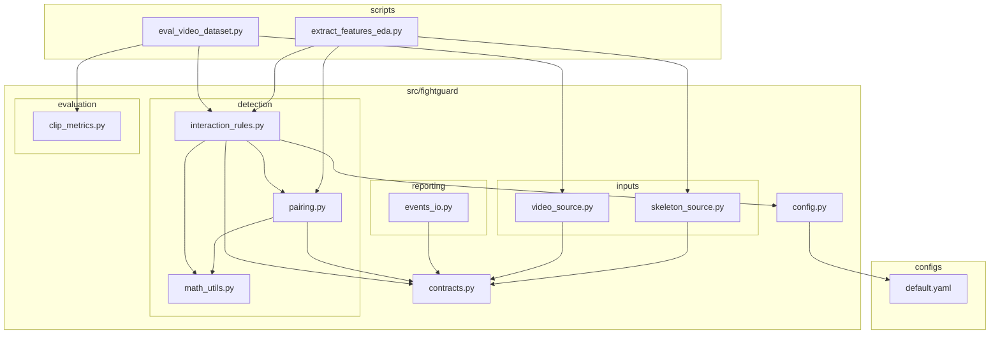
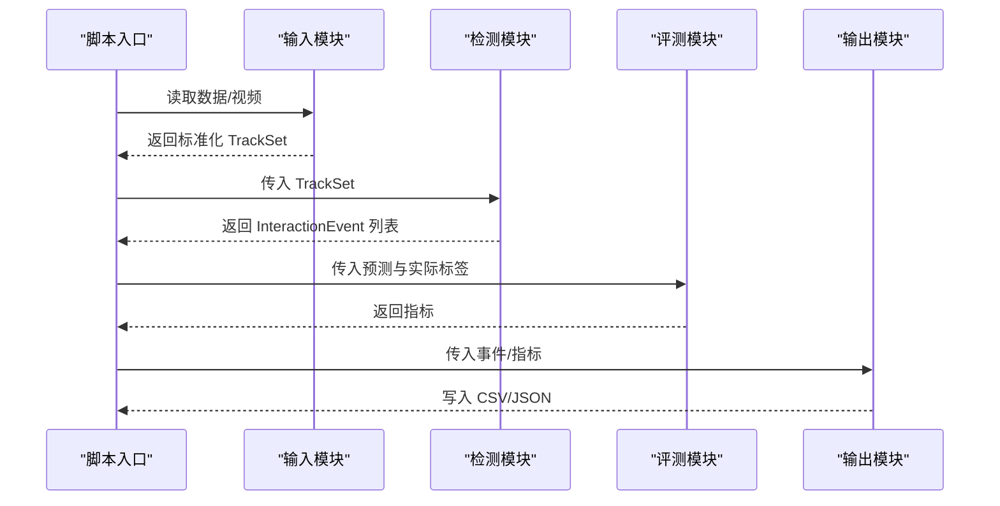
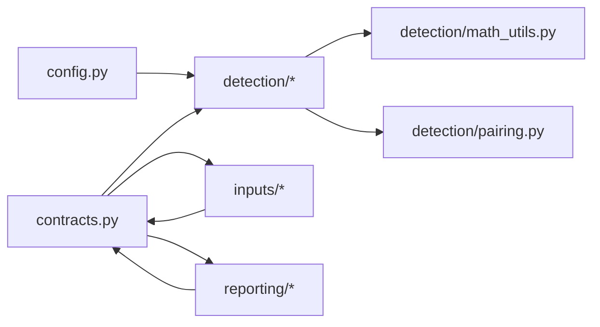

# 新模块添加

<cite>
**本文引用的文件**
- [README.md](file://README.md)
- [default.yaml](file://configs/default.yaml)
- [config.py](file://src/fightguard/config.py)
- [contracts.py](file://src/fightguard/contracts.py)
- [math_utils.py](file://src/fightguard/detection/math_utils.py)
- [pairing.py](file://src/fightguard/detection/pairing.py)
- [interaction_rules.py](file://src/fightguard/detection/interaction_rules.py)
- [skeleton_source.py](file://src/fightguard/inputs/skeleton_source.py)
- [video_source.py](file://src/fightguard/inputs/video_source.py)
- [events_io.py](file://src/fightguard/reporting/events_io.py)
- [extract_features_eda.py](file://scripts/extract_features_eda.py)
- [eval_video_dataset.py](file://scripts/eval_video_dataset.py)
</cite>

## 目录
1. [简介](#简介)
2. [项目结构](#项目结构)
3. [核心组件](#核心组件)
4. [架构总览](#架构总览)
5. [详细组件分析](#详细组件分析)
6. [依赖关系分析](#依赖关系分析)
7. [性能考虑](#性能考虑)
8. [故障排查指南](#故障排查指南)
9. [结论](#结论)
10. [附录](#附录)

## 简介
本指南面向为 KidGuard 项目新增模块的开发者，提供从结构设计、文件组织、导入关系、配置接口使用、数据契约引用，到模块间依赖管理、循环依赖规避、接口设计原则、错误处理机制、以及测试方法（单元测试、集成测试、配置验证）的完整实践路径。文档还给出可直接落地的模块模板与扩展示例，帮助你在不破坏既有模块化约定的前提下，快速、安全地添加新功能。

## 项目结构
KidGuard 采用“分层+功能域”的混合组织方式：
- configs：全局配置与规则阈值
- scripts：阶段化运行入口
- src/fightguard：核心包，按功能域划分子包
  - inputs：数据输入（骨骼/视频）
  - detection：配对与规则判定
  - evaluation：评测指标
  - reporting：事件日志与可视化输出
  - contracts.py：统一数据契约
  - config.py：统一配置读取与校验

图表来源
- [README.md:46-76](file://README.md#L46-L76)
- [default.yaml:1-62](file://configs/default.yaml#L1-L62)
- [config.py:32-82](file://src/fightguard/config.py#L32-L82)
- [contracts.py:15-241](file://src/fightguard/contracts.py#L15-L241)
- [skeleton_source.py:22-29](file://src/fightguard/inputs/skeleton_source.py#L22-L29)
- [video_source.py:19-25](file://src/fightguard/inputs/video_source.py#L19-L25)
- [pairing.py:3-4](file://src/fightguard/detection/pairing.py#L3-L4)
- [interaction_rules.py:16-24](file://src/fightguard/detection/interaction_rules.py#L16-L24)
- [events_io.py:10](file://src/fightguard/reporting/events_io.py#L10)

章节来源
- [README.md:46-76](file://README.md#L46-L76)

## 核心组件
- 配置系统：统一从配置文件读取并缓存，提供校验与热重载能力，禁止在业务代码中硬编码阈值。
- 数据契约：以字典键名访问关键点，统一 SkeletonTrack、TrackSet、InteractionEvent 等结构，确保跨模块数据一致性。
- 输入层：分别支持 NTU 骨骼文件与真实视频，输出标准化 TrackSet。
- 检测层：基于配对、规则与状态机，输出结构化事件。
- 输出层：事件日志持久化与可视化输出。

章节来源
- [config.py:32-82](file://src/fightguard/config.py#L32-L82)
- [config.py:95-120](file://src/fightguard/config.py#L95-L120)
- [contracts.py:56-241](file://src/fightguard/contracts.py#L56-L241)
- [skeleton_source.py:211-274](file://src/fightguard/inputs/skeleton_source.py#L211-L274)
- [video_source.py:57-192](file://src/fightguard/inputs/video_source.py#L57-L192)
- [events_io.py:12-36](file://src/fightguard/reporting/events_io.py#L12-L36)

## 架构总览
模块间调用遵循“自顶向下、单向依赖”的原则，避免循环依赖。配置与数据契约作为公共基础设施，被检测与输入模块消费；评测与输出模块依赖检测结果与数据契约。

图表来源
- [eval_video_dataset.py:84-102](file://scripts/eval_video_dataset.py#L84-L102)
- [interaction_rules.py:410-503](file://src/fightguard/detection/interaction_rules.py#L410-L503)
- [events_io.py:12-36](file://src/fightguard/reporting/events_io.py#L12-L36)

## 详细组件分析

### 模块结构设计原则
- 目录组织
  - 新模块建议在 src/fightguard 下新建子包，如 inputs、detection、evaluation、reporting 等，与现有结构保持一致。
  - 每个子包内按职责细分文件，避免单文件过大。
- 文件命名规范
  - 使用小写加下划线，如 my_module.py、data_processor.py。
  - 工具函数文件命名为 *_utils.py 或 *_helpers.py，便于识别。
- 模块导入关系
  - 仅从公共接口导入，禁止跨层反向依赖。
  - 公共依赖（配置、数据契约）在模块内部统一导入，避免在上层重复导入。

章节来源
- [README.md:46-76](file://README.md#L46-L76)
- [skeleton_source.py:22-29](file://src/fightguard/inputs/skeleton_source.py#L22-L29)
- [video_source.py:19-25](file://src/fightguard/inputs/video_source.py#L19-L25)
- [pairing.py:3-4](file://src/fightguard/detection/pairing.py#L3-L4)
- [interaction_rules.py:16-24](file://src/fightguard/detection/interaction_rules.py#L16-L24)

### 模块模板（通用）
以下为新增模块的标准模板骨架，包含导入声明、配置接口使用、数据契约引用、错误处理与返回值约定。请按需替换注释中的模块名与职责。

- 模板文件：src/fightguard/<new_domain>/<module_name>.py
- 导入声明
  - 从 fightguard.config 导入 get_config，统一读取配置。
  - 从 fightguard.contracts 导入所需数据契约类型。
  - 仅导入本模块需要的工具函数，避免跨层依赖。
- 配置接口使用
  - 通过 get_config() 获取全局配置字典，避免硬编码阈值。
  - 若需热重载，使用 reload_config()。
- 数据契约引用
  - 使用 Keypoints、SkeletonTrack、TrackSet、InteractionEvent 等统一结构。
  - 严禁使用数字索引访问关键点，必须使用键名。
- 错误处理
  - 对输入参数进行显式校验，抛出清晰的异常信息。
  - 对外部依赖（文件、网络、模型）进行健壮性处理，避免中断整个流程。

章节来源
- [config.py:32-82](file://src/fightguard/config.py#L32-L82)
- [config.py:85-92](file://src/fightguard/config.py#L85-L92)
- [config.py:95-120](file://src/fightguard/config.py#L95-L120)
- [contracts.py:56-241](file://src/fightguard/contracts.py#L56-L241)

### 模块间依赖关系管理
- 循环依赖避免
  - 严格限制依赖方向：inputs/detection/evaluation/reporting 仅依赖 config 与 contracts。
  - 将跨模块共享的工具函数放入 detection/math_utils.py 等纯函数模块，避免互相导入。
- 接口设计原则
  - 函数参数尽量使用数据契约类型，返回值明确、可序列化。
  - 对外暴露稳定的 API，内部实现可演进。
- 错误处理机制
  - 在模块边界捕获异常并转换为统一的错误码或异常类型。
  - 对配置缺失、文件不存在、数据格式错误等情况提供明确提示。

章节来源
- [math_utils.py:10-52](file://src/fightguard/detection/math_utils.py#L10-L52)
- [pairing.py:14-53](file://src/fightguard/detection/pairing.py#L14-L53)
- [interaction_rules.py:410-503](file://src/fightguard/detection/interaction_rules.py#L410-L503)

### 模块测试方法
- 单元测试
  - 针对纯函数（如 math_utils.py 中的几何计算）编写独立测试，覆盖边界条件与异常分支。
  - 使用最小化输入构造测试用例，例如空关键点、无效坐标、阈值边界。
- 集成测试
  - 以脚本为入口，模拟完整流程：输入 → 检测 → 评测 → 输出。
  - 使用 extract_features_eda.py 与 eval_video_dataset.py 的模式，确保模块组合正确。
- 配置验证
  - 使用 config.py 的校验逻辑，确保新增模块读取的配置项存在且类型正确。
  - 在测试中覆盖配置缺失、阈值越界等场景。

章节来源
- [extract_features_eda.py:28-105](file://scripts/extract_features_eda.py#L28-L105)
- [eval_video_dataset.py:24-131](file://scripts/eval_video_dataset.py#L24-L131)
- [config.py:95-120](file://src/fightguard/config.py#L95-L120)

### 扩展示例

#### 示例一：新增检测算法模块（如“教师行为识别”）
目标：在现有冲突检测基础上，新增对教师不当行为的识别模块。

- 设计思路
  - 在 detection 子包下新增 teacher_rules.py，定义教师行为特征与规则。
  - 复用配对逻辑与状态机框架，扩展事件类型与触发规则。
- 实现步骤
  1) 在 teacher_rules.py 中定义特征提取函数（如教师与儿童的距离、教师手势角度等）。
  2) 在 teacher_rules.py 中定义状态机或规则流，输出 InteractionEvent（event_type 可设为 teacher_misconduct）。
  3) 在脚本中调用 teacher_rules.run_rules_on_clip(...)，并与现有冲突事件合并输出。
- 关键注意
  - 严格使用数据契约与配置接口，避免硬编码阈值。
  - 对教师角色进行标注与区分，确保与儿童轨迹分离。

章节来源
- [interaction_rules.py:258-357](file://src/fightguard/detection/interaction_rules.py#L258-L357)
- [contracts.py:192-241](file://src/fightguard/contracts.py#L192-L241)

#### 示例二：新增数据预处理模块（如“关键点平滑与插值”）
目标：对输入的关键点序列进行平滑与插值，提升检测稳定性。

- 设计思路
  - 在 detection 子包下新增 preprocess.py，提供平滑与插值函数。
  - 对 SkeletonTrack.keypoints 进行就地修改或返回新序列。
- 实现步骤
  1) 在 preprocess.py 中实现平滑与插值函数，使用 math_utils 中的几何工具。
  2) 在 inputs.skeleton_source.load_skeleton_file 与 inputs.video_source.process_video_to_trackset 中调用预处理函数。
  3) 在脚本中验证预处理前后关键点分布变化。
- 关键注意
  - 保持关键点字典结构不变，仅修改坐标与置信度。
  - 对缺失帧采用合理插值策略，避免引入虚假运动。

章节来源
- [skeleton_source.py:174-204](file://src/fightguard/inputs/skeleton_source.py#L174-L204)
- [video_source.py:167-181](file://src/fightguard/inputs/video_source.py#L167-L181)
- [math_utils.py:10-52](file://src/fightguard/detection/math_utils.py#L10-L52)

## 依赖关系分析
- 模块耦合与内聚
  - detection 子包内聚度高，数学工具与规则判定分离，便于维护与测试。
  - inputs 与 detection 通过 contracts 解耦，输入层仅负责数据标准化。
- 直接与间接依赖
  - detection 依赖 detection/math_utils 与 detection/pairing，间接依赖 config 与 contracts。
  - reporting 依赖 contracts，用于事件持久化。
- 循环依赖防护
  - 通过纯函数工具模块与数据契约，避免相互导入。
  - 配置与契约作为基础设施，被所有业务模块单向依赖。

图表来源
- [config.py:32-82](file://src/fightguard/config.py#L32-L82)
- [contracts.py:56-241](file://src/fightguard/contracts.py#L56-L241)
- [math_utils.py:10-52](file://src/fightguard/detection/math_utils.py#L10-L52)
- [pairing.py:3-4](file://src/fightguard/detection/pairing.py#L3-L4)
- [events_io.py:10](file://src/fightguard/reporting/events_io.py#L10)

## 性能考虑
- 模型与硬件加速
  - 视频推理使用 OpenVINO 加速的 YOLOv8-Pose，减少 CPU 占用。
- 缓存与懒加载
  - 配置与模型采用模块级缓存，避免重复读取与初始化。
- 数据对齐与时序一致性
  - 视频轨迹需进行时空绝对对齐，确保帧级严格对应，减少状态机误判。

章节来源
- [video_source.py:41-49](file://src/fightguard/inputs/video_source.py#L41-L49)
- [video_source.py:167-181](file://src/fightguard/inputs/video_source.py#L167-L181)
- [config.py:20-29](file://src/fightguard/config.py#L20-L29)

## 故障排查指南
- 配置相关
  - 缺少必要字段：检查 configs/default.yaml 的 keys 与 rules 子字段是否完整。
  - 配置路径错误：确认 get_config() 读取路径与项目根目录一致。
- 数据契约相关
  - 键名不匹配：确保使用 COCO-17 标准键名，避免数字索引。
  - 轨迹长度不一致：视频处理后需进行时空对齐，保证帧数一致。
- 模块导入相关
  - 未从公共接口导入：检查是否直接从子模块导入，应统一从 fightguard 包导入。
- 输出与日志
  - 事件未落盘：检查输出目录权限与路径配置，确认 events_io 的写入逻辑。

章节来源
- [config.py:95-120](file://src/fightguard/config.py#L95-L120)
- [contracts.py:56-90](file://src/fightguard/contracts.py#L56-L90)
- [events_io.py:12-36](file://src/fightguard/reporting/events_io.py#L12-L36)

## 结论
通过遵循统一的模块结构设计原则、严格的导入关系与数据契约约定、完善的配置与错误处理机制，以及系统化的测试方法，你可以安全、高效地为 KidGuard 添加新模块。建议在新增模块时优先复用现有工具函数与数据契约，保持模块内聚、接口稳定，并通过脚本入口进行端到端验证，确保整体流程的正确性与可维护性。

## 附录
- 配置参数参考：configs/default.yaml
- 数据契约参考：src/fightguard/contracts.py
- 检测流程参考：src/fightguard/detection/interaction_rules.py
- 输入流程参考：src/fightguard/inputs/skeleton_source.py、src/fightguard/inputs/video_source.py
- 输出流程参考：src/fightguard/reporting/events_io.py
- 阶段化运行参考：scripts/extract_features_eda.py、scripts/eval_video_dataset.py