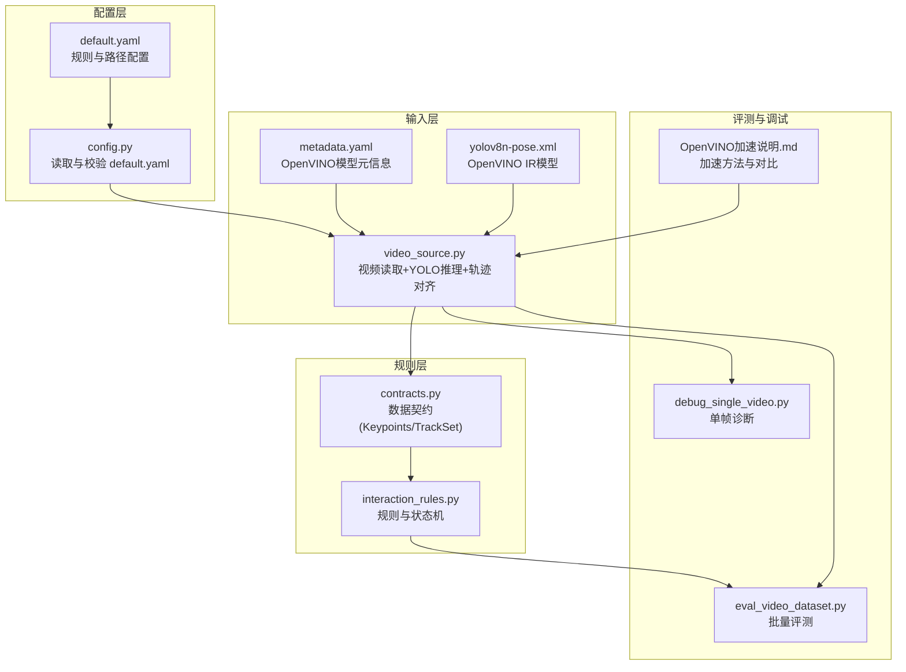
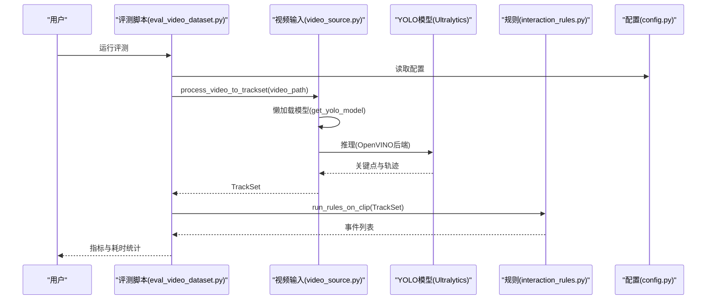
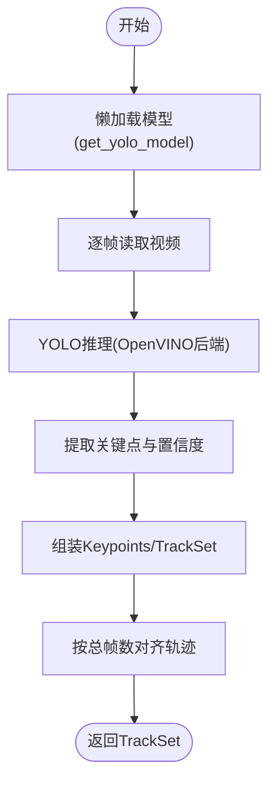
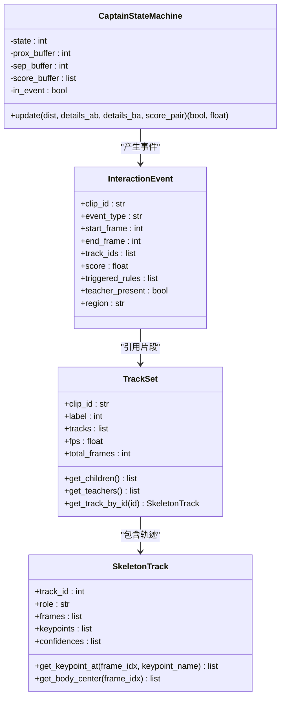
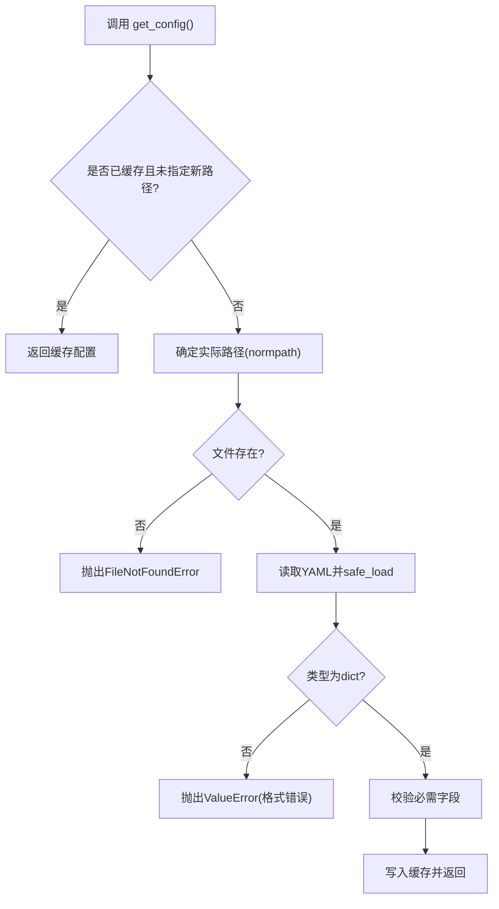
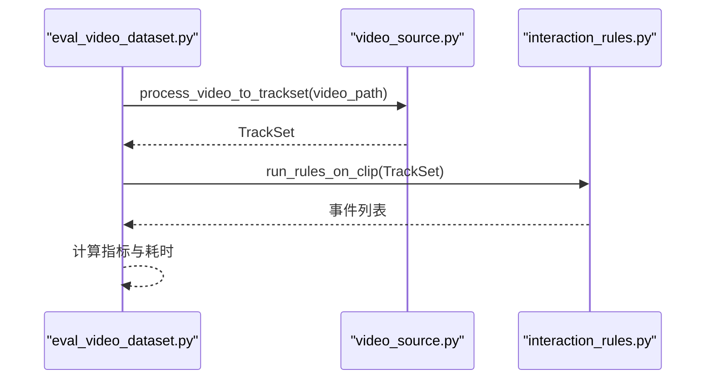
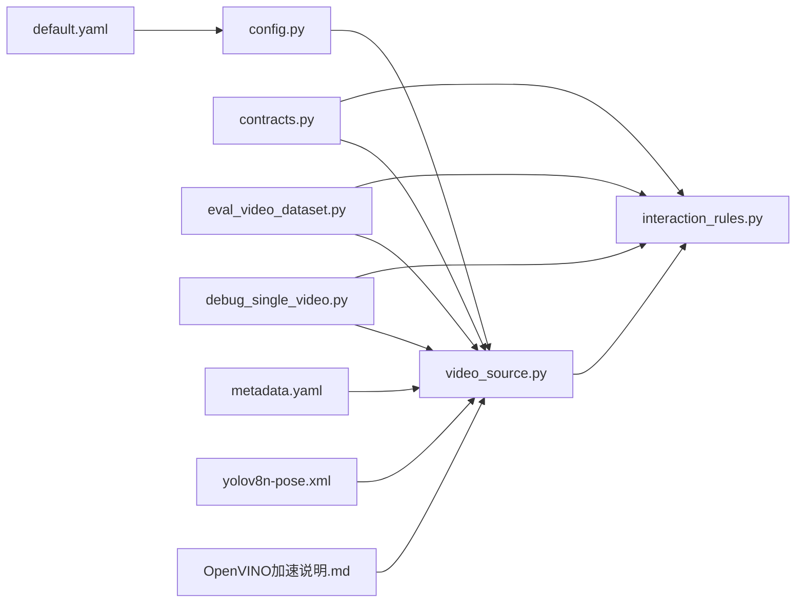

# 模型替换

<cite>
**本文引用的文件**
- [README.md](file://README.md)
- [default.yaml](file://configs/default.yaml)
- [config.py](file://src/fightguard/config.py)
- [contracts.py](file://src/fightguard/contracts.py)
- [video_source.py](file://src/fightguard/inputs/video_source.py)
- [interaction_rules.py](file://src/fightguard/detection/interaction_rules.py)
- [eval_video_dataset.py](file://scripts/eval_video_dataset.py)
- [debug_single_video.py](file://scripts/debug_single_video.py)
- [OpenVINO可以加速轻薄本电脑YOLOv8的推理.md](file://OpenVINO可以加速轻薄本电脑YOLOv8的推理.md)
- [metadata.yaml](file://yolov8n-pose_openvino_model/metadata.yaml)
- [yolov8n-pose.xml](file://yolov8n-pose_openvino_model/yolov8n-pose.xml)
</cite>

## 目录
1. [简介](#简介)
2. [项目结构](#项目结构)
3. [核心组件](#核心组件)
4. [架构总览](#架构总览)
5. [详细组件分析](#详细组件分析)
6. [依赖分析](#依赖分析)
7. [性能考量](#性能考量)
8. [故障排查指南](#故障排查指南)
9. [结论](#结论)
10. [附录](#附录)

## 简介
本指南面向KidGuard项目，提供“模型替换”的完整开发与集成方法，覆盖以下关键目标：
- 新检测模型的集成路径：模型格式转换、接口适配、推理流程改造
- 模型替换步骤：模型文件准备、配置文件更新、推理接口封装
- OpenVINO模型集成：模型优化、硬件加速配置、性能对比方法
- 不同检测模型的特性对比：精度与速度平衡、模型大小考虑、兼容性要求
- 模型性能测试：推理时间测量、准确率评估、资源消耗监控
- 替换示例：从YOLOv8-Pose替换为其他姿态估计模型、集成多模态检测模型

## 项目结构
KidGuard采用模块化设计，核心检测链路由“视频输入 -> 骨骼关键点提取 -> 规则与状态机 -> 事件输出”构成。关键文件与职责如下：
- 配置层：统一读取与校验配置，提供全局阈值与路径
- 输入层：视频读取与骨骼提取，封装YOLO推理接口
- 规则层：基于关键点的物理特征与状态机进行冲突判定
- 评测与调试：批量评测与单帧诊断脚本
- OpenVINO：提供推理加速与模型导出

**图示来源**
- [config.py:32-82](file://src/fightguard/config.py#L32-L82)
- [default.yaml:1-62](file://configs/default.yaml#L1-L62)
- [video_source.py:41-49](file://src/fightguard/inputs/video_source.py#L41-L49)
- [contracts.py:96-171](file://src/fightguard/contracts.py#L96-L171)
- [interaction_rules.py:422-515](file://src/fightguard/detection/interaction_rules.py#L422-L515)
- [eval_video_dataset.py:24-132](file://scripts/eval_video_dataset.py#L24-L132)
- [debug_single_video.py:18-81](file://scripts/debug_single_video.py#L18-L81)
- [OpenVINO可以加速轻薄本电脑YOLOv8的推理.md:56-78](file://OpenVINO可以加速轻薄本电脑YOLOv8的推理.md#L56-L78)
- [metadata.yaml:1-27](file://yolov8n-pose_openvino_model/metadata.yaml#L1-L27)
- [yolov8n-pose.xml:12559-12586](file://yolov8n-pose_openvino_model/yolov8n-pose.xml#L12559-L12586)

**章节来源**
- [README.md:46-98](file://README.md#L46-L98)
- [default.yaml:1-62](file://configs/default.yaml#L1-L62)
- [config.py:32-82](file://src/fightguard/config.py#L32-L82)
- [contracts.py:96-171](file://src/fightguard/contracts.py#L96-L171)
- [video_source.py:41-49](file://src/fightguard/inputs/video_source.py#L41-L49)
- [interaction_rules.py:422-515](file://src/fightguard/detection/interaction_rules.py#L422-L515)
- [eval_video_dataset.py:24-132](file://scripts/eval_video_dataset.py#L24-L132)
- [debug_single_video.py:18-81](file://scripts/debug_single_video.py#L18-L81)
- [OpenVINO可以加速轻薄本电脑YOLOv8的推理.md:56-78](file://OpenVINO可以加速轻薄本电脑YOLOv8的推理.md#L56-L78)
- [metadata.yaml:1-27](file://yolov8n-pose_openvino_model/metadata.yaml#L1-L27)
- [yolov8n-pose.xml:12559-12586](file://yolov8n-pose_openvino_model/yolov8n-pose.xml#L12559-L12586)

## 核心组件
- 配置系统：集中读取default.yaml，提供统一访问接口与字段校验，支持热重载
- 数据契约：定义Keypoints、SkeletonTrack、TrackSet等结构，确保模块间数据一致性
- 视频输入与推理：封装YOLOv8-Pose推理，支持OpenVINO后端与ByteTrack追踪
- 冲突规则与状态机：基于物理特征与状态机进行冲突判定，输出结构化事件
- 评测与调试：批量评测与单帧诊断，辅助定位模型与规则问题

**章节来源**
- [config.py:32-82](file://src/fightguard/config.py#L32-L82)
- [contracts.py:96-171](file://src/fightguard/contracts.py#L96-L171)
- [video_source.py:41-49](file://src/fightguard/inputs/video_source.py#L41-L49)
- [interaction_rules.py:422-515](file://src/fightguard/detection/interaction_rules.py#L422-L515)
- [eval_video_dataset.py:24-132](file://scripts/eval_video_dataset.py#L24-L132)
- [debug_single_video.py:18-81](file://scripts/debug_single_video.py#L18-L81)

## 架构总览
KidGuard的检测流水线以“配置 -> 输入 -> 推理 -> 规则 -> 评测”为主线，OpenVINO作为推理后端无缝接入，保持输出格式与行为一致。

**图示来源**
- [eval_video_dataset.py:84-102](file://scripts/eval_video_dataset.py#L84-L102)
- [video_source.py:41-49](file://src/fightguard/inputs/video_source.py#L41-L49)
- [interaction_rules.py:422-515](file://src/fightguard/detection/interaction_rules.py#L422-L515)
- [config.py:32-82](file://src/fightguard/config.py#L32-L82)

## 详细组件分析

### 组件A：视频输入与推理接口（video_source.py）
- 模型加载：懒加载YOLOv8-Pose，支持OpenVINO后端，自动识别GPU/NPU加速
- 推理流程：逐帧读取视频，调用YOLO进行姿态估计，提取COCO-17关键点，封装为TrackSet
- 追踪策略：使用ByteTrack提升低分框的稳定性，适合重叠场景
- 轨迹对齐：将各轨迹按总帧数对齐，保证时空严格对齐

**图示来源**
- [video_source.py:41-49](file://src/fightguard/inputs/video_source.py#L41-L49)
- [video_source.py:115-158](file://src/fightguard/inputs/video_source.py#L115-L158)
- [video_source.py:167-181](file://src/fightguard/inputs/video_source.py#L167-L181)

**章节来源**
- [video_source.py:41-49](file://src/fightguard/inputs/video_source.py#L41-L49)
- [video_source.py:115-158](file://src/fightguard/inputs/video_source.py#L115-L158)
- [video_source.py:167-181](file://src/fightguard/inputs/video_source.py#L167-L181)

### 组件B：规则与状态机（interaction_rules.py）
- 特征提取：肢体加速度、相对接近速度、关节角加速度、躯干倾角变化、骨盆速度
- 置信度抑制：基于平均关键点置信度动态抑制低质量帧
- 状态机：四段式状态机，严格因果律，结合时间窗确认事件
- 事件输出：结构化InteractionEvent，包含起止帧、得分、触发规则等

**图示来源**
- [interaction_rules.py:258-370](file://src/fightguard/detection/interaction_rules.py#L258-L370)
- [interaction_rules.py:192-241](file://src/fightguard/detection/interaction_rules.py#L192-L241)
- [contracts.py:192-241](file://src/fightguard/contracts.py#L192-L241)
- [contracts.py:96-171](file://src/fightguard/contracts.py#L96-L171)

**章节来源**
- [interaction_rules.py:258-370](file://src/fightguard/detection/interaction_rules.py#L258-L370)
- [interaction_rules.py:422-515](file://src/fightguard/detection/interaction_rules.py#L422-L515)
- [contracts.py:96-171](file://src/fightguard/contracts.py#L96-L171)

### 组件C：配置系统（config.py + default.yaml）
- 配置读取：统一入口get_config()，首次读取并缓存，后续复用
- 字段校验：确保必需键存在，缺失时报错并提示修复
- 热重载：reload_config()支持调试时无需重启程序即可加载新阈值

**图示来源**
- [config.py:32-82](file://src/fightguard/config.py#L32-L82)
- [config.py:95-120](file://src/fightguard/config.py#L95-L120)

**章节来源**
- [config.py:32-82](file://src/fightguard/config.py#L32-L82)
- [config.py:95-120](file://src/fightguard/config.py#L95-L120)
- [default.yaml:1-62](file://configs/default.yaml#L1-L62)

### 组件D：评测与调试（eval_video_dataset.py + debug_single_video.py）
- 批量评测：遍历冲突/正常两类视频，调用process_video_to_trackset与规则引擎，输出指标与耗时
- 单帧诊断：锁定特定视频，逐帧打印状态机与关键特征，快速定位漏报/误报原因

**图示来源**
- [eval_video_dataset.py:84-102](file://scripts/eval_video_dataset.py#L84-L102)
- [video_source.py:57-193](file://src/fightguard/inputs/video_source.py#L57-L193)
- [interaction_rules.py:422-515](file://src/fightguard/detection/interaction_rules.py#L422-L515)

**章节来源**
- [eval_video_dataset.py:24-132](file://scripts/eval_video_dataset.py#L24-L132)
- [debug_single_video.py:18-81](file://scripts/debug_single_video.py#L18-L81)

## 依赖分析
- 模块耦合：输入层依赖配置系统；规则层依赖数据契约；评测脚本依赖输入与规则
- 外部依赖：Ultralytics YOLO、OpenCV、OpenVINO
- 潜在环依赖：当前结构为单向依赖，无循环导入迹象

**图示来源**
- [config.py:32-82](file://src/fightguard/config.py#L32-L82)
- [default.yaml:1-62](file://configs/default.yaml#L1-L62)
- [video_source.py:25-26](file://src/fightguard/inputs/video_source.py#L25-L26)
- [interaction_rules.py:16-25](file://src/fightguard/detection/interaction_rules.py#L16-L25)
- [contracts.py:96-171](file://src/fightguard/contracts.py#L96-L171)
- [eval_video_dataset.py:19-23](file://scripts/eval_video_dataset.py#L19-L23)
- [debug_single_video.py:13-16](file://scripts/debug_single_video.py#L13-L16)
- [OpenVINO可以加速轻薄本电脑YOLOv8的推理.md:56-78](file://OpenVINO可以加速轻薄本电脑YOLOv8的推理.md#L56-L78)
- [metadata.yaml:1-27](file://yolov8n-pose_openvino_model/metadata.yaml#L1-L27)
- [yolov8n-pose.xml:12559-12586](file://yolov8n-pose_openvino_model/yolov8n-pose.xml#L12559-L12586)

**章节来源**
- [config.py:32-82](file://src/fightguard/config.py#L32-L82)
- [default.yaml:1-62](file://configs/default.yaml#L1-L62)
- [video_source.py:25-26](file://src/fightguard/inputs/video_source.py#L25-L26)
- [interaction_rules.py:16-25](file://src/fightguard/detection/interaction_rules.py#L16-L25)
- [contracts.py:96-171](file://src/fightguard/contracts.py#L96-L171)
- [eval_video_dataset.py:19-23](file://scripts/eval_video_dataset.py#L19-L23)
- [debug_single_video.py:13-16](file://scripts/debug_single_video.py#L13-L16)
- [OpenVINO可以加速轻薄本电脑YOLOv8的推理.md:56-78](file://OpenVINO可以加速轻薄本电脑YOLOv8的推理.md#L56-L78)
- [metadata.yaml:1-27](file://yolov8n-pose_openvino_model/metadata.yaml#L1-L27)
- [yolov8n-pose.xml:12559-12586](file://yolov8n-pose_openvino_model/yolov8n-pose.xml#L12559-L12586)

## 性能考量
- OpenVINO加速：通过导出OpenVINO IR模型并在推理时加载OpenVINO目录，实现硬件加速，输出与PyTorch一致
- 模型导出：使用Ultralytics导出OpenVINO格式，支持半精度与NMS开关
- 硬件适配：仅适用于Intel平台（CPU+集成显卡/NPU），NVIDIA CUDA用户无需改动
- 性能对比：评测脚本可直接对比启用/禁用OpenVINO的总耗时与每帧耗时

**章节来源**
- [OpenVINO可以加速轻薄本电脑YOLOv8的推理.md:56-78](file://OpenVINO可以加速轻薄本电脑YOLOv8的推理.md#L56-L78)
- [video_source.py:41-49](file://src/fightguard/inputs/video_source.py#L41-L49)
- [metadata.yaml:1-27](file://yolov8n-pose_openvino_model/metadata.yaml#L1-L27)
- [yolov8n-pose.xml:12559-12586](file://yolov8n-pose_openvino_model/yolov8n-pose.xml#L12559-L12586)

## 故障排查指南
- OpenVINO未安装：安装openvino后重试
- 设备不可用：更新Intel显卡驱动或检查电源模式
- 首次运行缓慢：OpenVINO首次编译模型属正常现象
- 速度无变化：确保插电并设置高性能模式
- 模型路径错误：确认OpenVINO目录存在且路径正确

**章节来源**
- [OpenVINO可以加速轻薄本电脑YOLOv8的推理.md:83-91](file://OpenVINO可以加速轻薄本电脑YOLOv8的推理.md#L83-L91)

## 结论
KidGuard通过模块化设计与统一的数据契约，实现了“模型替换”的低耦合与高可移植性。OpenVINO作为推理后端，可在不改变业务逻辑的前提下显著提升性能。遵循本文提供的替换步骤与最佳实践，可平滑完成从YOLOv8-Pose到其他姿态估计模型或多模态检测模型的迁移。

## 附录

### 模型替换步骤（通用流程）
- 准备模型文件
  - 若为ONNX/PT等格式，先导出为OpenVINO IR（参考OpenVINO加速说明）
  - 确认OpenVINO目录包含模型文件与元信息
- 更新配置
  - 在default.yaml中维护模型路径与任务类型（如task: pose）
  - 如需调整关键点数量或通道，同步修改contracts.py中的COCO-17映射
- 封装推理接口
  - 修改video_source.py中的模型加载路径，指向新OpenVINO目录
  - 确保推理输出格式与Keypoints/TrackSet一致
- 验证与回归
  - 使用debug_single_video.py对典型视频进行单帧诊断
  - 使用eval_video_dataset.py进行批量评测，对比指标与耗时

**章节来源**
- [OpenVINO可以加速轻薄本电脑YOLOv8的推理.md:56-78](file://OpenVINO可以加速轻薄本电脑YOLOv8的推理.md#L56-L78)
- [video_source.py:41-49](file://src/fightguard/inputs/video_source.py#L41-L49)
- [contracts.py:23-42](file://src/fightguard/contracts.py#L23-L42)
- [debug_single_video.py:18-81](file://scripts/debug_single_video.py#L18-L81)
- [eval_video_dataset.py:24-132](file://scripts/eval_video_dataset.py#L24-L132)

### OpenVINO集成要点
- 模型优化
  - 导出时启用半精度与合适NMS开关，减少内存占用
  - 使用metadata.yaml核对输入尺寸、关键点形状与任务类型
- 硬件加速
  - 自动识别Intel GPU/NPU，无需额外代码
  - 首次运行可能编译模型，后续加速明显
- 性能对比
  - 评测脚本可直接对比启用/禁用OpenVINO的总耗时与每帧耗时
  - 注意设备电源模式与驱动版本对性能的影响

**章节来源**
- [OpenVINO可以加速轻薄本电脑YOLOv8的推理.md:56-78](file://OpenVINO可以加速轻薄本电脑YOLOv8的推理.md#L56-L78)
- [metadata.yaml:1-27](file://yolov8n-pose_openvino_model/metadata.yaml#L1-L27)
- [yolov8n-pose.xml:12559-12586](file://yolov8n-pose_openvino_model/yolov8n-pose.xml#L12559-L12586)

### 不同检测模型的特性对比（示例维度）
- 精度与速度平衡
  - 轻量模型（如YOLOv8n-pose）适合CPU运行，速度较快但精度略低
  - 更大模型（如YOLOv8s/11等）在同等硬件条件下通常精度更高，但推理延迟更大
- 模型大小考虑
  - OpenVINO IR模型体积与半精度设置相关，半精度可显著降低内存占用
- 兼容性要求
  - 关键点数量与顺序需与COCO-17标准一致
  - 输出格式需满足Keypoints/TrackSet结构，确保规则层可用

**章节来源**
- [README.md:116-122](file://README.md#L116-L122)
- [metadata.yaml:10-26](file://yolov8n-pose_openvino_model/metadata.yaml#L10-L26)
- [contracts.py:23-42](file://src/fightguard/contracts.py#L23-L42)

### 模型性能测试方法
- 推理时间测量
  - 使用评测脚本的后台计时线程，观察总耗时与每帧耗时
- 准确率评估
  - 使用eval_video_dataset.py输出TP/FP/TN/FN与Accuracy/Precision/Recall/FPR
- 资源消耗监控
  - 结合系统监控工具观察CPU/GPU/NPU占用与内存使用

**章节来源**
- [eval_video_dataset.py:62-123](file://scripts/eval_video_dataset.py#L62-L123)

### 替换示例
- 从YOLOv8-Pose替换为其他姿态估计模型
  - 导出新模型为OpenVINO IR（参考OpenVINO加速说明）
  - 修改video_source.py中的模型加载路径
  - 如关键点数量不同，同步调整contracts.py映射
- 集成多模态检测模型
  - 在推理阶段输出关键点与额外模态特征（如深度/热成像）
  - 在规则层扩展特征提取与融合逻辑，保持输出事件结构不变

**章节来源**
- [OpenVINO可以加速轻薄本电脑YOLOv8的推理.md:56-78](file://OpenVINO可以加速轻薄本电脑YOLOv8的推理.md#L56-L78)
- [video_source.py:41-49](file://src/fightguard/inputs/video_source.py#L41-L49)
- [contracts.py:23-42](file://src/fightguard/contracts.py#L23-L42)
- [interaction_rules.py:375-421](file://src/fightguard/detection/interaction_rules.py#L375-L421)