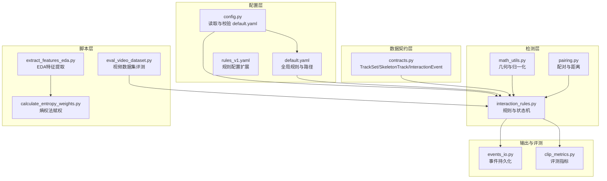
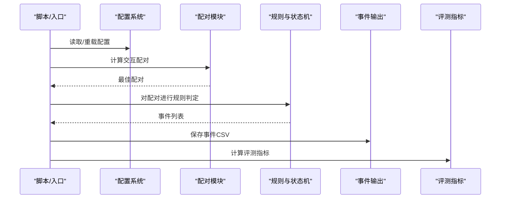
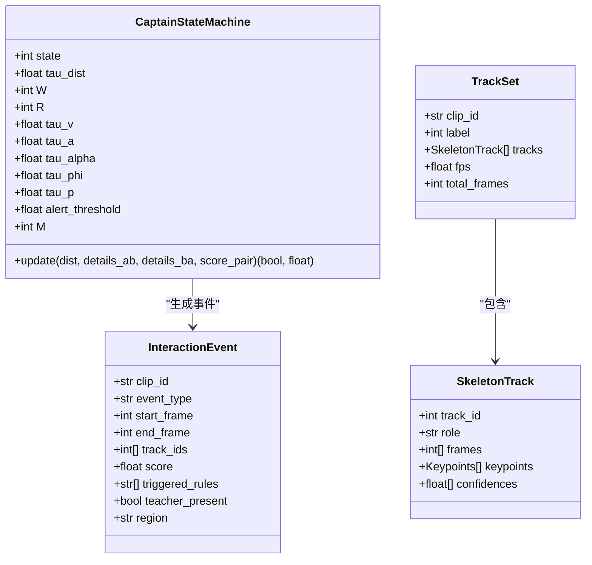
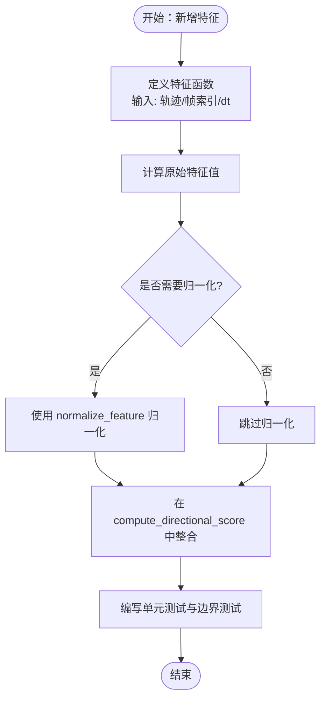
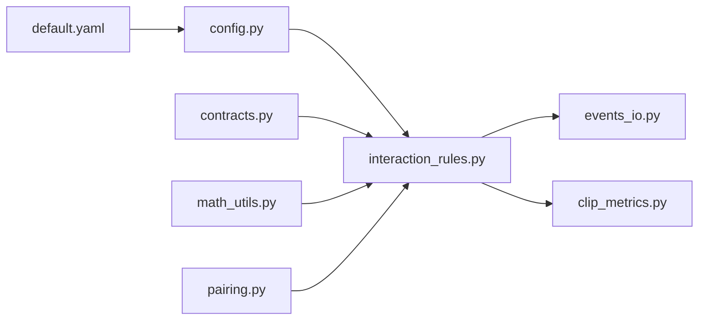

# 规则扩展

<cite>
**本文引用的文件**
- [README.md](file://README.md)
- [default.yaml](file://configs/default.yaml)
- [rules_v1.yaml](file://configs/rules_v1.yaml)
- [config.py](file://src/fightguard/config.py)
- [contracts.py](file://src/fightguard/contracts.py)
- [math_utils.py](file://src/fightguard/detection/math_utils.py)
- [pairing.py](file://src/fightguard/detection/pairing.py)
- [interaction_rules.py](file://src/fightguard/detection/interaction_rules.py)
- [events_io.py](file://src/fightguard/reporting/events_io.py)
- [clip_metrics.py](file://src/fightguard/evaluation/clip_metrics.py)
- [extract_features_eda.py](file://scripts/extract_features_eda.py)
- [calculate_entropy_weights.py](file://scripts/calculate_entropy_weights.py)
- [eval_video_dataset.py](file://scripts/eval_video_dataset.py)
</cite>

## 目录
1. [简介](#简介)
2. [项目结构](#项目结构)
3. [核心组件](#核心组件)
4. [架构总览](#架构总览)
5. [详细组件分析](#详细组件分析)
6. [依赖分析](#依赖分析)
7. [性能考虑](#性能考虑)
8. [故障排查指南](#故障排查指南)
9. [结论](#结论)
10. [附录](#附录)

## 简介
本指南面向希望为 KidGuard 项目扩展“规则与数学特征”的开发者，围绕以下目标展开：
- 新规则类型的添加流程与接口规范
- 规则与状态机的集成方式
- 现有规则的修改步骤（阈值、条件逻辑、优先级）
- 规则参数配置方法（配置文件扩展、动态参数更新、规则校验）
- 数学特征的扩展方法（新特征函数、几何计算、归一化）
- 规则测试方法（单元测试设计、边界条件、性能基准）
- 具体扩展示例（新增身体接触检测规则、手势识别规则）

## 项目结构
KidGuard 采用模块化分层组织，核心集中在 src/fightguard 下，配置集中在 configs，脚本集中在 scripts。规则与状态机位于 detection 子模块，数据契约在 contracts，配置读取在 config，评测与事件输出分别在 evaluation 与 reporting。

图示来源
- [config.py:1-120](file://src/fightguard/config.py#L1-L120)
- [default.yaml:1-62](file://configs/default.yaml#L1-L62)
- [rules_v1.yaml:1-1](file://configs/rules_v1.yaml#L1-L1)
- [contracts.py:1-241](file://src/fightguard/contracts.py#L1-L241)
- [math_utils.py:1-52](file://src/fightguard/detection/math_utils.py#L1-L52)
- [pairing.py:1-54](file://src/fightguard/detection/pairing.py#L1-L54)
- [interaction_rules.py:1-531](file://src/fightguard/detection/interaction_rules.py#L1-L531)
- [events_io.py:1-36](file://src/fightguard/reporting/events_io.py#L1-L36)
- [clip_metrics.py:1-47](file://src/fightguard/evaluation/clip_metrics.py#L1-L47)
- [extract_features_eda.py:1-106](file://scripts/extract_features_eda.py#L1-L106)
- [calculate_entropy_weights.py:1-71](file://scripts/calculate_entropy_weights.py#L1-L71)
- [eval_video_dataset.py:1-132](file://scripts/eval_video_dataset.py#L1-L132)

章节来源
- [README.md:46-76](file://README.md#L46-L76)
- [default.yaml:1-62](file://configs/default.yaml#L1-L62)
- [config.py:32-120](file://src/fightguard/config.py#L32-L120)

## 核心组件
- 配置系统：统一读取与校验 configs/default.yaml，提供 get_config()/reload_config() 接口，支持动态重载。
- 数据契约：TrackSet/SkeletonTrack/InteractionEvent 等结构化数据，确保模块间一致的数据格式。
- 几何与数学工具：euclidean_distance、get_neck_approx、get_pelvis_approx、get_shoulder_scale、normalize_feature 等。
- 配对与距离：基于人体中心点的配对策略与帧级距离计算。
- 规则与状态机：基于“四段式状态机”的冲突检测流水线，支持置信度抑制与平滑窗口。
- 事件与评测：事件持久化为 CSV，评测指标计算（TP/FP/TN/FN/Acc/Prec/Rec/FPR/F1）。
- EDA 与熵权法：提取特征峰值，使用熵权法客观赋权。

章节来源
- [config.py:32-120](file://src/fightguard/config.py#L32-L120)
- [contracts.py:96-241](file://src/fightguard/contracts.py#L96-L241)
- [math_utils.py:10-52](file://src/fightguard/detection/math_utils.py#L10-L52)
- [pairing.py:6-54](file://src/fightguard/detection/pairing.py#L6-L54)
- [interaction_rules.py:258-531](file://src/fightguard/detection/interaction_rules.py#L258-L531)
- [events_io.py:12-36](file://src/fightguard/reporting/events_io.py#L12-L36)
- [clip_metrics.py:9-47](file://src/fightguard/evaluation/clip_metrics.py#L9-L47)
- [extract_features_eda.py:28-106](file://scripts/extract_features_eda.py#L28-L106)
- [calculate_entropy_weights.py:12-71](file://scripts/calculate_entropy_weights.py#L12-L71)

## 架构总览
KidGuard 的规则扩展围绕“配置驱动 + 几何特征 + 状态机”的核心架构展开。规则参数由 default.yaml 提供默认值，可通过 reload_config 实时生效；特征计算集中在 interaction_rules.py 与 math_utils.py；状态机在 CaptainStateMachine 中实现同步因果律；最终事件落盘与评测贯穿 reporting 与 evaluation。

图示来源
- [config.py:32-92](file://src/fightguard/config.py#L32-L92)
- [pairing.py:14-54](file://src/fightguard/detection/pairing.py#L14-L54)
- [interaction_rules.py:410-503](file://src/fightguard/detection/interaction_rules.py#L410-L503)
- [events_io.py:23-36](file://src/fightguard/reporting/events_io.py#L23-L36)
- [clip_metrics.py:9-47](file://src/fightguard/evaluation/clip_metrics.py#L9-L47)

## 详细组件分析

### 规则接口与状态机集成
- 规则接口
  - 主入口函数：run_rules_on_clip 接收 TrackSet 与 cfg，返回 InteractionEvent 列表。
  - 单向评分：compute_directional_score 计算单向综合得分与特征详情，供双向比较使用。
  - 距离与配对：compute_pair_distance_at_frame 与 get_interaction_pairs 提供配对与距离计算。
- 状态机集成
  - CaptainStateMachine 实现四段式状态机，严格遵循同步因果律，包含接近、动作激活、作用-响应、事件确认四个阶段。
  - 状态机参数来源于 cfg["rules"]，支持阈值与平滑窗口等配置。
  - 事件生成：当状态进入冲突且平滑得分超过阈值时，记录事件并收集触发规则。

图示来源
- [interaction_rules.py:258-358](file://src/fightguard/detection/interaction_rules.py#L258-L358)
- [contracts.py:192-241](file://src/fightguard/contracts.py#L192-L241)
- [contracts.py:96-171](file://src/fightguard/contracts.py#L96-L171)

章节来源
- [interaction_rules.py:258-503](file://src/fightguard/detection/interaction_rules.py#L258-L503)
- [pairing.py:6-54](file://src/fightguard/detection/pairing.py#L6-L54)
- [contracts.py:96-241](file://src/fightguard/contracts.py#L96-L241)

### 数学特征与几何计算扩展
- 新特征计算函数
  - 在 interaction_rules.py 中新增特征函数，建议遵循现有模式：输入 SkeletonTrack、frame_idx、dt，返回数值并进行归一化。
  - 归一化建议使用 normalize_feature(value, min_val, max_val)，确保不同尺度特征可比。
- 几何计算方法
  - 使用 math_utils.py 中的 euclidean_distance、get_neck_approx、get_pelvis_approx、get_shoulder_scale 等基础函数。
  - 新增几何特征时，注意关键点缺失与无效坐标的处理（返回 0 或 inf）。
- 特征归一化处理
  - 保持归一化区间一致性，避免极端值导致的数值不稳定。
  - 若存在数据驱动的权重（如熵权法），可在 EDA 与权重计算脚本中同步更新。

图示来源
- [interaction_rules.py:363-408](file://src/fightguard/detection/interaction_rules.py#L363-L408)
- [math_utils.py:48-52](file://src/fightguard/detection/math_utils.py#L48-L52)
- [extract_features_eda.py:64-87](file://scripts/extract_features_eda.py#L64-L87)
- [calculate_entropy_weights.py:12-71](file://scripts/calculate_entropy_weights.py#L12-L71)

章节来源
- [interaction_rules.py:363-408](file://src/fightguard/detection/interaction_rules.py#L363-L408)
- [math_utils.py:10-52](file://src/fightguard/detection/math_utils.py#L10-L52)
- [extract_features_eda.py:28-106](file://scripts/extract_features_eda.py#L28-L106)
- [calculate_entropy_weights.py:12-71](file://scripts/calculate_entropy_weights.py#L12-L71)

### 规则参数配置方法
- 配置文件扩展
  - 在 configs/default.yaml 中添加/修改规则阈值与状态机参数，如 proximity_threshold、alert_threshold、state_machine.states 等。
  - rules_v1.yaml 可作为规则配置扩展文件，便于多版本规则并行对比。
- 动态参数更新
  - 使用 config.reload_config() 在运行时重新加载配置，无需重启进程。
- 规则验证机制
  - config._validate_config() 校验必需字段，若缺失会抛出明确错误，指导补齐配置。

章节来源
- [default.yaml:16-62](file://configs/default.yaml#L16-L62)
- [rules_v1.yaml:1-1](file://configs/rules_v1.yaml#L1-L1)
- [config.py:32-120](file://src/fightguard/config.py#L32-L120)

### 现有规则修改步骤
- 阈值调整
  - 在 default.yaml 的 rules 段落中修改相应阈值；或在运行时通过 reload_config 生效。
- 条件判断逻辑修改
  - 修改 interaction_rules.py 中的状态机条件与评分聚合逻辑，确保同步因果律与主导分数选取合理。
- 规则优先级设置
  - 在事件生成阶段收集 triggered_rules，结合特征详情阈值（如 r_a、r_alpha、r_phi、r_p、gamma）进行规则标记，便于可解释性与回溯。

章节来源
- [interaction_rules.py:409-503](file://src/fightguard/detection/interaction_rules.py#L409-L503)
- [default.yaml:16-62](file://configs/default.yaml#L16-L62)
- [config.py:85-92](file://src/fightguard/config.py#L85-L92)

### 规则测试方法
- 单元测试设计
  - 针对特征函数：构造 SkeletonTrack 与关键帧，断言输出在合理范围；对归一化函数断言输出在 [0,1]。
  - 针对状态机：构造不同 dist 与 details 输入，断言状态转移序列与事件触发时机。
- 边界条件测试
  - 关键点缺失、帧越界、dt 异常、空配对等边界场景。
- 性能基准测试
  - 使用 eval_video_dataset.py 在真实视频数据集上评测，关注吞吐与延迟；结合 EDA 与熵权法评估稳定性。

章节来源
- [interaction_rules.py:258-531](file://src/fightguard/detection/interaction_rules.py#L258-L531)
- [eval_video_dataset.py:24-132](file://scripts/eval_video_dataset.py#L24-L132)
- [clip_metrics.py:9-47](file://src/fightguard/evaluation/clip_metrics.py#L9-L47)

### 具体扩展示例

#### 示例一：添加新的身体接触检测规则
- 目标：基于手腕/脚踝侵入受力侧颈部/躯干的最小距离，设计侵入阈值触发规则。
- 实现步骤
  1) 在 interaction_rules.py 新增 compute_attack_distance 的变体或组合特征，返回侵入程度指标。
  2) 在 compute_directional_score 中整合新特征并归一化。
  3) 在状态机条件中加入侵入阈值触发分支，或在事件触发规则收集中加入“high_contact_intrusion”。
  4) 在 default.yaml 中添加 wrist_intrusion_threshold 等阈值。
  5) 编写单元测试与边界测试，覆盖侵入距离计算与阈值判断。
  6) 使用 eval_video_dataset.py 与 clip_metrics.py 验证效果。

章节来源
- [interaction_rules.py:157-201](file://src/fightguard/detection/interaction_rules.py#L157-L201)
- [interaction_rules.py:363-408](file://src/fightguard/detection/interaction_rules.py#L363-L408)
- [default.yaml:16-30](file://configs/default.yaml#L16-L30)
- [eval_video_dataset.py:24-132](file://scripts/eval_video_dataset.py#L24-L132)
- [clip_metrics.py:9-47](file://src/fightguard/evaluation/clip_metrics.py#L9-L47)

#### 示例二：添加手势识别规则
- 目标：基于肘部/腕部角度变化与速度，识别“推/拍/抓”等手势意图。
- 实现步骤
  1) 在 interaction_rules.py 新增 compute_elbow_wrist_angle_change 或类似函数，计算手部姿态变化。
  2) 设计手势阈值（如角度变化速率、持续帧数），在状态机中作为动作激活条件之一。
  3) 在 compute_directional_score 中整合手势特征并归一化。
  4) 在 default.yaml 中添加手势相关阈值与持续帧数配置。
  5) 使用 extract_features_eda.py 与 calculate_entropy_weights.py 更新特征画像与权重。
  6) 编写单元测试与边界测试，覆盖角度计算与连续性判断。

章节来源
- [interaction_rules.py:84-124](file://src/fightguard/detection/interaction_rules.py#L84-L124)
- [interaction_rules.py:363-408](file://src/fightguard/detection/interaction_rules.py#L363-L408)
- [math_utils.py:91-123](file://src/fightguard/detection/math_utils.py#L91-L123)
- [default.yaml:16-30](file://configs/default.yaml#L16-L30)
- [extract_features_eda.py:64-87](file://scripts/extract_features_eda.py#L64-L87)
- [calculate_entropy_weights.py:12-71](file://scripts/calculate_entropy_weights.py#L12-L71)

## 依赖分析
- 模块耦合
  - interaction_rules.py 依赖 contracts、config、math_utils；pairing.py 依赖 contracts 与 math_utils。
  - config 为全局配置入口，其他模块通过 get_config()/reload_config() 访问。
- 外部依赖
  - YAML 配置文件、CSV 输出、pandas/numpy（熵权法）、tqdm（进度条）。
- 循环依赖
  - 当前模块间无明显循环导入；数学工具模块保持纯函数，避免循环依赖。

图示来源
- [config.py:32-92](file://src/fightguard/config.py#L32-L92)
- [default.yaml:16-62](file://configs/default.yaml#L16-L62)
- [contracts.py:96-241](file://src/fightguard/contracts.py#L96-L241)
- [math_utils.py:10-52](file://src/fightguard/detection/math_utils.py#L10-L52)
- [pairing.py:14-54](file://src/fightguard/detection/pairing.py#L14-L54)
- [interaction_rules.py:410-503](file://src/fightguard/detection/interaction_rules.py#L410-L503)
- [events_io.py:23-36](file://src/fightguard/reporting/events_io.py#L23-L36)
- [clip_metrics.py:9-47](file://src/fightguard/evaluation/clip_metrics.py#L9-L47)

章节来源
- [config.py:32-120](file://src/fightguard/config.py#L32-L120)
- [interaction_rules.py:18-24](file://src/fightguard/detection/interaction_rules.py#L18-L24)
- [pairing.py:3-4](file://src/fightguard/detection/pairing.py#L3-L4)

## 性能考虑
- 状态机平滑窗口与事件确认窗口会影响检测延迟与稳定性，建议在 default.yaml 中平衡 M、R、W 等参数。
- 特征归一化与置信度抑制可降低噪声影响，但需避免过度抑制导致漏检。
- EDA 与熵权法仅用于静态赋权，不影响在线推理性能；实际部署时优先优化状态机与配对逻辑。

## 故障排查指南
- 配置缺失
  - 现象：启动时报错提示缺少 rules 字段。
  - 处理：补齐 default.yaml 中 rules 必填项，或在 rules_v1.yaml 中扩展。
- 事件为空
  - 现象：run_rules_on_clip 返回空事件列表。
  - 处理：检查配对逻辑（至少两人存活帧数）、阈值设置、状态机平滑窗口；使用 reload_config() 确认阈值已更新。
- 归一化异常
  - 现象：特征归一化输出异常或恒为 0。
  - 处理：检查关键点缺失与无效坐标处理；确认 normalize_feature 的 min/max 合理。
- 评测指标异常
  - 现象：FPR/Recall 等指标异常。
  - 处理：核对标签与预测逻辑，检查阈值与平滑窗口；使用 eval_video_dataset.py 的错误案例分析。

章节来源
- [config.py:95-120](file://src/fightguard/config.py#L95-L120)
- [pairing.py:19-28](file://src/fightguard/detection/pairing.py#L19-L28)
- [interaction_rules.py:258-358](file://src/fightguard/detection/interaction_rules.py#L258-L358)
- [eval_video_dataset.py:109-132](file://scripts/eval_video_dataset.py#L109-L132)

## 结论
通过配置驱动、几何特征与状态机的协同，KidGuard 提供了清晰的规则扩展路径。新增规则应遵循统一接口、归一化与阈值校验流程，并结合 EDA 与熵权法进行数据驱动的权重优化。建议在开发过程中充分利用单元测试、边界测试与性能基准测试，确保规则的稳定性与可解释性。

## 附录
- 关键实现路径参考
  - 配置读取与校验：[config.py:32-120](file://src/fightguard/config.py#L32-L120)
  - 数据契约：[contracts.py:96-241](file://src/fightguard/contracts.py#L96-L241)
  - 几何与归一化：[math_utils.py:10-52](file://src/fightguard/detection/math_utils.py#L10-L52)
  - 配对与距离：[pairing.py:6-54](file://src/fightguard/detection/pairing.py#L6-L54)
  - 规则与状态机：[interaction_rules.py:258-503](file://src/fightguard/detection/interaction_rules.py#L258-L503)
  - 事件输出与评测：[events_io.py:23-36](file://src/fightguard/reporting/events_io.py#L23-L36)、[clip_metrics.py:9-47](file://src/fightguard/evaluation/clip_metrics.py#L9-L47)
  - EDA 与熵权法：[extract_features_eda.py:28-106](file://scripts/extract_features_eda.py#L28-L106)、[calculate_entropy_weights.py:12-71](file://scripts/calculate_entropy_weights.py#L12-L71)
  - 视频评测：[eval_video_dataset.py:24-132](file://scripts/eval_video_dataset.py#L24-L132)