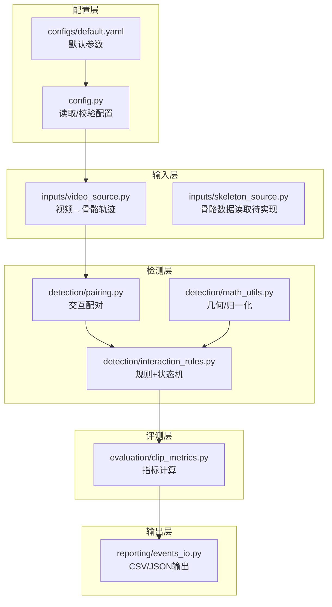
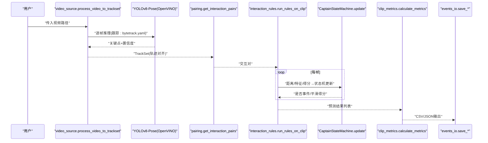
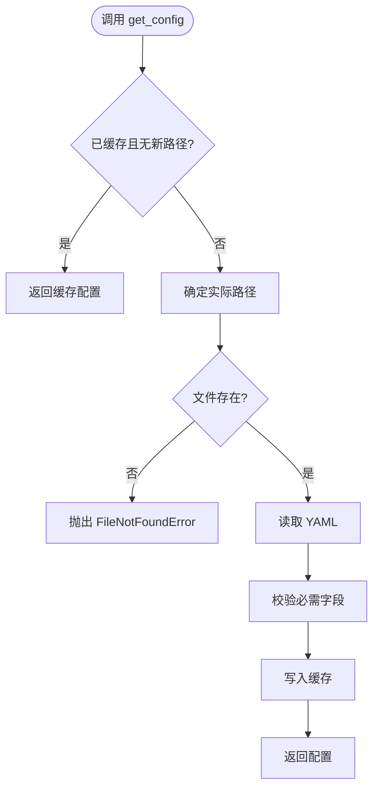
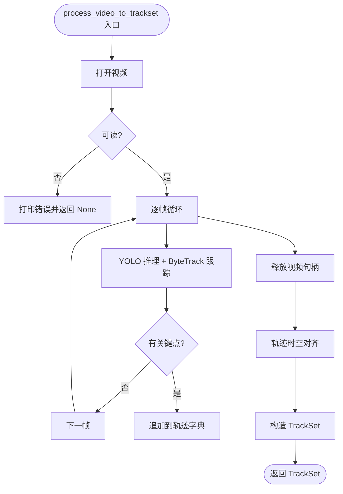
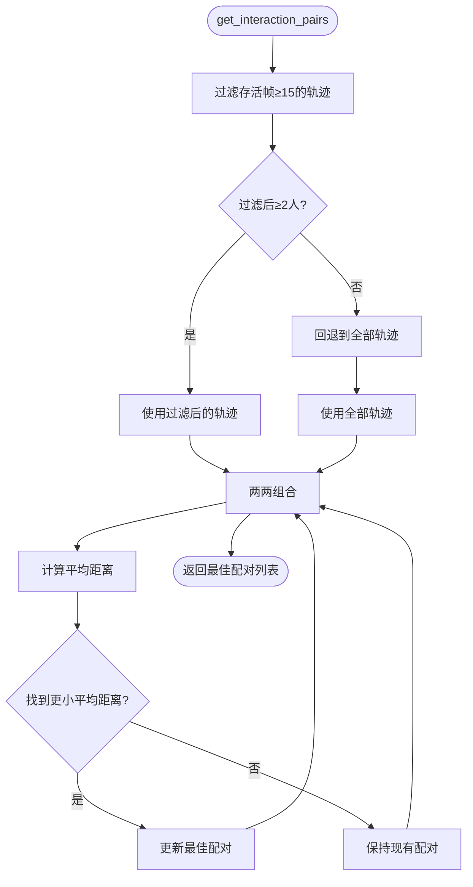
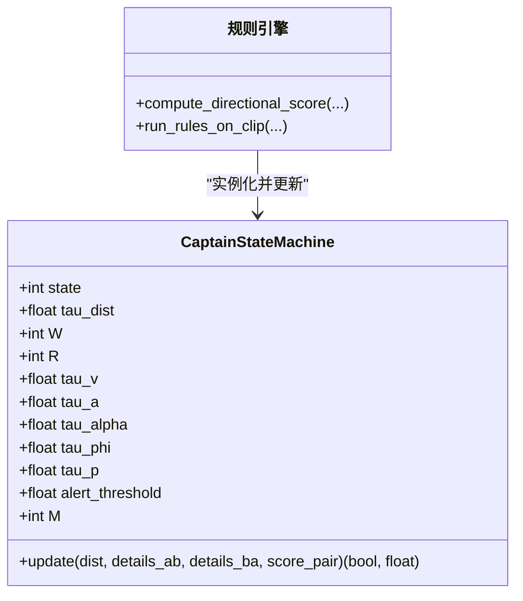
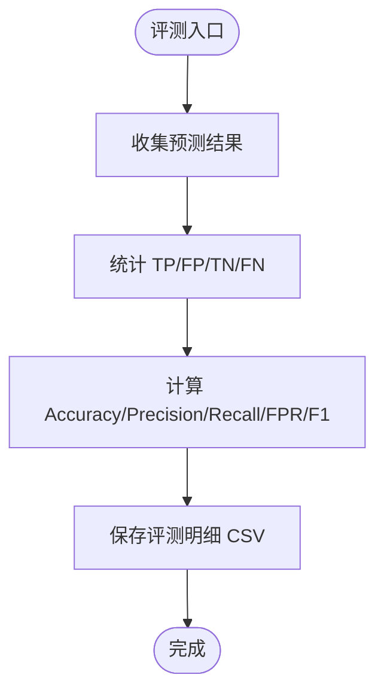
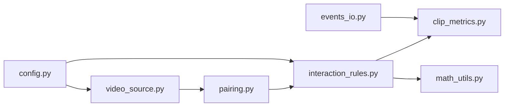
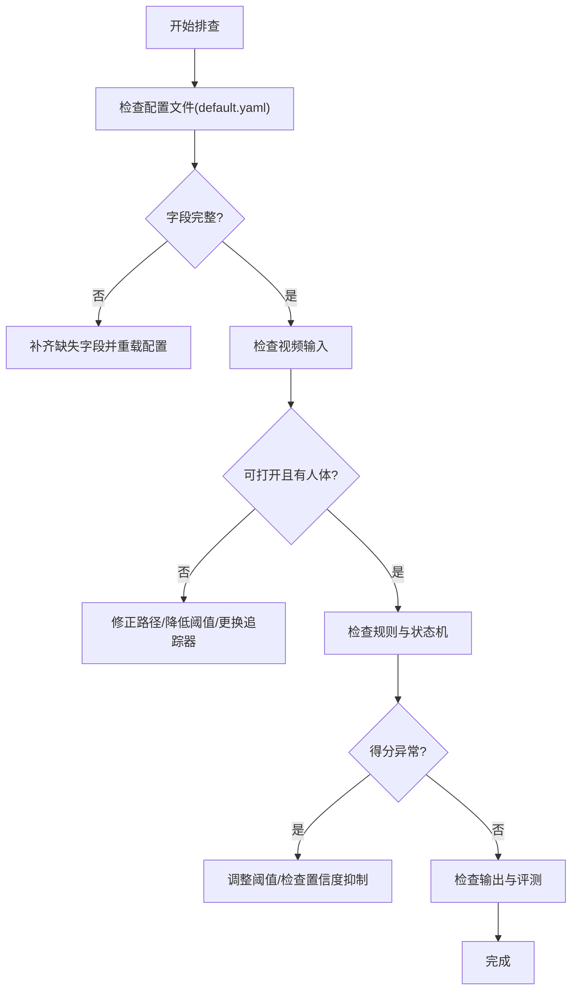

# 调试与故障排除

<cite>
**本文引用的文件**
- [README.md](file://README.md)
- [default.yaml](file://configs/default.yaml)
- [config.py](file://src/fightguard/config.py)
- [video_source.py](file://src/fightguard/inputs/video_source.py)
- [pairing.py](file://src/fightguard/detection/pairing.py)
- [interaction_rules.py](file://src/fightguard/detection/interaction_rules.py)
- [math_utils.py](file://src/fightguard/detection/math_utils.py)
- [clip_metrics.py](file://src/fightguard/evaluation/clip_metrics.py)
- [events_io.py](file://src/fightguard/reporting/events_io.py)
- [debug_single_video.py](file://scripts/debug_single_video.py)
- [eval_video_dataset.py](file://scripts/eval_video_dataset.py)
- [kernel.errors.txt](file://kernel.errors.txt)
</cite>

## 目录
1. [引言](#引言)
2. [项目结构](#项目结构)
3. [核心组件](#核心组件)
4. [架构总览](#架构总览)
5. [详细组件分析](#详细组件分析)
6. [依赖分析](#依赖分析)
7. [性能考虑](#性能考虑)
8. [故障排除指南](#故障排除指南)
9. [结论](#结论)
10. [附录](#附录)

## 引言
本指南面向KidGuard项目使用者与维护者，聚焦于“调试与故障排除”。内容覆盖问题诊断方法（日志分析、错误定位）、性能瓶颈识别与优化、内存管理最佳实践、常见问题解决方案（配置错误、模型加载失败、数据格式问题、推理性能低下）、调试脚本使用方法（单视频诊断、批量评估、可视化思路），并提供错误排查流程图与快速修复清单。

## 项目结构
KidGuard采用模块化分层组织：配置读取、输入数据（视频/骨骼）、检测规则与状态机、评测与输出。关键路径如下：
- 配置层：读取与校验全局参数
- 输入层：视频读取与关键点提取
- 检测层：配对、规则与状态机
- 评测层：指标计算
- 输出层：事件持久化

图表来源
- [config.py:32-82](file://src/fightguard/config.py#L32-L82)
- [default.yaml:1-62](file://configs/default.yaml#L1-L62)
- [video_source.py:57-193](file://src/fightguard/inputs/video_source.py#L57-L193)
- [pairing.py:14-54](file://src/fightguard/detection/pairing.py#L14-L54)
- [interaction_rules.py:410-503](file://src/fightguard/detection/interaction_rules.py#L410-L503)
- [math_utils.py:10-52](file://src/fightguard/detection/math_utils.py#L10-L52)
- [clip_metrics.py:9-47](file://src/fightguard/evaluation/clip_metrics.py#L9-L47)
- [events_io.py:12-36](file://src/fightguard/reporting/events_io.py#L12-L36)

章节来源
- [README.md:46-76](file://README.md#L46-L76)

## 核心组件
- 配置读取与校验：集中式配置缓存、字段校验、热重载
- 视频输入与关键点提取：OpenVINO加速的YOLOv8-Pose推理、ByteTrack追踪、时空对齐
- 交互配对：基于平均距离的最优配对、存活帧过滤
- 冲突规则与状态机：归一化特征、置信度抑制、四段式状态机
- 指标计算与事件输出：混淆矩阵统计、CSV持久化

章节来源
- [config.py:32-120](file://src/fightguard/config.py#L32-L120)
- [video_source.py:57-193](file://src/fightguard/inputs/video_source.py#L57-L193)
- [pairing.py:14-54](file://src/fightguard/detection/pairing.py#L14-L54)
- [interaction_rules.py:363-503](file://src/fightguard/detection/interaction_rules.py#L363-L503)
- [clip_metrics.py:9-47](file://src/fightguard/evaluation/clip_metrics.py#L9-L47)
- [events_io.py:12-36](file://src/fightguard/reporting/events_io.py#L12-L36)

## 架构总览
端到端流程：读取视频→YOLOv8-Pose推理→轨迹对齐→配对→规则评分→状态机→事件生成→指标计算→结果输出。

图表来源
- [video_source.py:57-193](file://src/fightguard/inputs/video_source.py#L57-L193)
- [pairing.py:14-54](file://src/fightguard/detection/pairing.py#L14-L54)
- [interaction_rules.py:410-503](file://src/fightguard/detection/interaction_rules.py#L410-L503)
- [clip_metrics.py:9-47](file://src/fightguard/evaluation/clip_metrics.py#L9-L47)
- [events_io.py:12-36](file://src/fightguard/reporting/events_io.py#L12-L36)

## 详细组件分析

### 组件A：配置系统（config.py）
- 设计要点
  - 单例缓存：首次读取后缓存，避免重复I/O
  - 字段校验：确保必需键存在，提升健壮性
  - 热重载：调试时可强制重新加载配置
- 关键路径
  - 读取与缓存：[get_config:32-82](file://src/fightguard/config.py#L32-L82)
  - 校验逻辑：[validate_config:95-120](file://src/fightguard/config.py#L95-L120)
  - 热重载：[reload_config:85-93](file://src/fightguard/config.py#L85-L93)
- 常见问题
  - 缺少必要字段：校验异常，需补齐default.yaml
  - 路径错误：FileNotFoundError，检查相对路径与工作目录
- 优化建议
  - 对频繁读取的键建立二级缓存
  - 提供配置Schema校验（如jsonschema）

图表来源
- [config.py:32-82](file://src/fightguard/config.py#L32-L82)
- [config.py:95-120](file://src/fightguard/config.py#L95-L120)

章节来源
- [config.py:32-120](file://src/fightguard/config.py#L32-L120)
- [default.yaml:1-62](file://configs/default.yaml#L1-L62)

### 组件B：视频输入与关键点提取（video_source.py）
- 设计要点
  - OpenVINO加速推理，自动选择硬件加速
  - ByteTrack追踪器配合低阈值检测框，增强重叠场景稳定性
  - 轨迹时空对齐：将所有轨迹填充到相同帧数，保证索引一致性
- 关键路径
  - 模型懒加载：[get_yolo_model:41-49](file://src/fightguard/inputs/video_source.py#L41-L49)
  - 视频处理主流程：[process_video_to_trackset:57-193](file://src/fightguard/inputs/video_source.py#L57-L193)
- 常见问题
  - 视频无法打开：返回None并打印错误
  - 未检测到人：返回None并提示
  - OpenVINO内核错误：参考“故障排除指南”
- 优化建议
  - 多线程批处理视频队列
  - GPU/CPU资源监控与自适应降采样

图表来源
- [video_source.py:57-193](file://src/fightguard/inputs/video_source.py#L57-L193)

章节来源
- [video_source.py:57-193](file://src/fightguard/inputs/video_source.py#L57-L193)

### 组件C：交互配对与距离计算（pairing.py）
- 设计要点
  - 过滤“幽灵ID”：仅保留有效存活帧≥阈值的轨迹
  - 最优配对：计算两两轨迹的平均距离，选择平均距离最小的一对
- 关键路径
  - 距离计算：[compute_pair_distance_at_frame:6-12](file://src/fightguard/detection/pairing.py#L6-L12)
  - 配对筛选：[get_interaction_pairs:14-54](file://src/fightguard/detection/pairing.py#L14-L54)
- 常见问题
  - 无人或人数不足：返回空列表，需检查视频输入与追踪
  - 距离为None：关键点无效，需检查配对前的数据质量

图表来源
- [pairing.py:14-54](file://src/fightguard/detection/pairing.py#L14-L54)

章节来源
- [pairing.py:14-54](file://src/fightguard/detection/pairing.py#L14-L54)

### 组件D：规则与状态机（interaction_rules.py）
- 设计要点
  - 特征提取：肢体加速度、相对接近速度、关节角加速度、躯干倾角变化、骨盆速度
  - 归一化尺度：肩宽尺度，消除尺度漂移
  - 置信度抑制：基于平均置信度动态抑制低质量帧
  - 四段式状态机：接近→动作激活→作用-响应→事件确认
- 关键路径
  - 特征与得分：[compute_directional_score:363-409](file://src/fightguard/detection/interaction_rules.py#L363-L409)
  - 状态机：[CaptainStateMachine.update:282-358](file://src/fightguard/detection/interaction_rules.py#L282-L358)
  - 端到端规则流：[run_rules_on_clip:410-503](file://src/fightguard/detection/interaction_rules.py#L410-L503)
- 常见问题
  - 得分恒为0：检查置信度抑制、特征归一化、状态机阈值
  - 状态机不触发：检查接近/接触/冲突帧阈值与平滑窗口

图表来源
- [interaction_rules.py:258-358](file://src/fightguard/detection/interaction_rules.py#L258-L358)
- [interaction_rules.py:363-503](file://src/fightguard/detection/interaction_rules.py#L363-L503)

章节来源
- [interaction_rules.py:363-503](file://src/fightguard/detection/interaction_rules.py#L363-L503)

### 组件E：评测与输出（clip_metrics.py, events_io.py）
- 设计要点
  - 指标计算：TP/FP/TN/FN→Accuracy/Precision/Recall/FPR/F1
  - 事件输出：CSV/JSON持久化，字段由事件对象导出
- 关键路径
  - 指标计算：[calculate_metrics:9-47](file://src/fightguard/evaluation/clip_metrics.py#L9-L47)
  - 事件CSV写出：[save_events_csv:23-36](file://src/fightguard/reporting/events_io.py#L23-L36)

图表来源
- [clip_metrics.py:9-47](file://src/fightguard/evaluation/clip_metrics.py#L9-L47)
- [events_io.py:12-36](file://src/fightguard/reporting/events_io.py#L12-L36)

章节来源
- [clip_metrics.py:9-47](file://src/fightguard/evaluation/clip_metrics.py#L9-L47)
- [events_io.py:12-36](file://src/fightguard/reporting/events_io.py#L12-L36)

## 依赖分析
- 组件耦合
  - 规则引擎依赖配对模块与数学工具
  - 视频输入为检测层上游数据源
  - 评测与输出独立于核心检测逻辑，便于替换
- 外部依赖
  - OpenVINO/YOLOv8-Pose、ByteTrack、OpenCV
  - YAML配置文件

图表来源
- [video_source.py:57-193](file://src/fightguard/inputs/video_source.py#L57-L193)
- [pairing.py:14-54](file://src/fightguard/detection/pairing.py#L14-L54)
- [interaction_rules.py:410-503](file://src/fightguard/detection/interaction_rules.py#L410-L503)
- [math_utils.py:10-52](file://src/fightguard/detection/math_utils.py#L10-L52)
- [clip_metrics.py:9-47](file://src/fightguard/evaluation/clip_metrics.py#L9-L47)
- [events_io.py:12-36](file://src/fightguard/reporting/events_io.py#L12-L36)
- [config.py:32-82](file://src/fightguard/config.py#L32-L82)

章节来源
- [video_source.py:57-193](file://src/fightguard/inputs/video_source.py#L57-L193)
- [pairing.py:14-54](file://src/fightguard/detection/pairing.py#L14-L54)
- [interaction_rules.py:410-503](file://src/fightguard/detection/interaction_rules.py#L410-L503)
- [math_utils.py:10-52](file://src/fightguard/detection/math_utils.py#L10-L52)
- [clip_metrics.py:9-47](file://src/fightguard/evaluation/clip_metrics.py#L9-L47)
- [events_io.py:12-36](file://src/fightguard/reporting/events_io.py#L12-L36)
- [config.py:32-82](file://src/fightguard/config.py#L32-L82)

## 性能考虑
- 推理加速
  - 使用OpenVINO硬件加速（GPU/NPU），减少CPU负载
  - ByteTrack追踪器在低分框场景更稳健，减少误配对
- 内存管理
  - 轨迹对齐时按需填充空帧，避免稀疏存储的额外拷贝
  - 配置缓存避免重复解析YAML
- 并发与I/O
  - 批量评测使用后台计时线程，缓解终端卡顿
  - 建议将视频解码与推理解耦，使用队列缓冲
- 调优建议
  - 动态调整置信度抑制阈值与状态机帧阈值
  - 对长视频启用最大帧限制进行调试

[本节为通用指导，不直接分析具体文件]

## 故障排除指南

### 一、日志分析与错误定位
- 配置相关
  - 缺失字段：检查default.yaml是否包含paths/rules/dataset/output
  - 路径错误：确认配置文件存在且路径规范
  - 解决步骤
    - 使用配置校验函数定位缺失键
    - 通过热重载接口在调试时即时生效
- 视频输入
  - 无法打开视频：检查路径与权限
  - 未检测到人：降低检测阈值或更换追踪器
- 规则与状态机
  - 得分恒为0：检查置信度抑制、特征归一化、状态机阈值
  - 状态机不触发：调整接近/接触/冲突帧阈值与平滑窗口

章节来源
- [config.py:95-120](file://src/fightguard/config.py#L95-L120)
- [video_source.py:80-92](file://src/fightguard/inputs/video_source.py#L80-L92)
- [interaction_rules.py:282-358](file://src/fightguard/detection/interaction_rules.py#L282-L358)

### 二、性能瓶颈识别
- 推理瓶颈
  - CPU占用高：确认OpenVINO是否启用GPU加速
  - 推理慢：缩短视频长度或降低分辨率
- 内存瓶颈
  - 轨迹过大：对长视频启用max_frames限制
  - 频繁I/O：使用配置缓存与批量处理

章节来源
- [video_source.py:41-49](file://src/fightguard/inputs/video_source.py#L41-L49)
- [config.py:20-29](file://src/fightguard/config.py#L20-L29)

### 三、内存管理最佳实践
- 内存泄漏检测
  - 使用进程内存监控工具观察长时间运行任务的内存曲线
  - 避免在循环中累积大型中间对象
- 大对象处理
  - 对长视频分片处理，及时释放中间变量
  - 使用生成器/迭代器替代一次性加载
- 垃圾回收优化
  - 减少循环引用
  - 控制对象生命周期，及时del或置空

[本节为通用指导，不直接分析具体文件]

### 四、常见问题与解决方案
- 配置文件错误
  - 症状：启动即报字段缺失
  - 处理：补齐default.yaml对应键，重新加载配置
- 模型加载失败
  - 症状：OpenVINO内核错误
  - 处理：参考“OpenVINO内核错误”章节
- 数据格式问题
  - 症状：关键点为空或坐标为0
  - 处理：检查配对前的关键点有效性
- 推理性能低下
  - 症状：FPS过低
  - 处理：启用OpenVINO加速、降低分辨率、减少并发

章节来源
- [default.yaml:1-62](file://configs/default.yaml#L1-L62)
- [video_source.py:41-49](file://src/fightguard/inputs/video_source.py#L41-L49)
- [pairing.py:6-12](file://src/fightguard/detection/pairing.py#L6-L12)

### 五、调试脚本使用指南
- 单视频调试（debug_single_video.py）
  - 用途：针对特定视频逐帧回放状态机与得分，定位漏报原因
  - 关键步骤
    - 覆盖规则参数以匹配批量评测
    - 锁定目标视频路径
    - 查看帧级距离、置信度抑制、状态机阶段与平滑得分
- 批量评估（eval_video_dataset.py）
  - 用途：在真实数据集上评估泛化能力，带实时计时
  - 关键步骤
    - 设置proximity/smoothing/alert阈值
    - 随机抽样两类视频
    - 输出混淆统计与错判案例

章节来源
- [debug_single_video.py:18-81](file://scripts/debug_single_video.py#L18-L81)
- [eval_video_dataset.py:24-132](file://scripts/eval_video_dataset.py#L24-L132)

### 六、OpenVINO内核错误排查
- 症状：内核头错误（如IGC检查失败）
- 可能原因
  - 驱动版本不匹配
  - OpenVINO版本与编译环境不一致
- 处理建议
  - 更新显卡驱动与OpenVINO至兼容版本
  - 清理缓存并重新安装OpenVINO
  - 在CPU模式下测试以排除硬件问题

章节来源
- [kernel.errors.txt:1-11](file://kernel.errors.txt#L1-L11)
- [video_source.py:41-49](file://src/fightguard/inputs/video_source.py#L41-L49)

### 七、错误排查流程图

[本图为概念流程图，不直接映射具体文件]

### 八、快速修复清单
- 配置
  - 确认default.yaml字段齐全
  - 使用热重载接口即时生效
- 输入
  - 校验视频路径与权限
  - 降低检测阈值或更换追踪器
- 规则
  - 调整proximity/smoothing/alert阈值
  - 检查置信度抑制与特征归一化
- 性能
  - 启用OpenVINO加速
  - 缩短视频长度或降低分辨率
- 输出
  - 确认输出目录存在且可写
  - 检查CSV/JSON写出是否成功

[本节为通用指导，不直接分析具体文件]

## 结论
通过集中式配置、OpenVINO加速推理、稳健的配对与状态机设计，KidGuard具备良好的可调试性与可维护性。建议在日常开发中结合调试脚本与批量评测，持续优化阈值与特征，确保系统在真实场景下的稳定与高效。

[本节为总结，不直接分析具体文件]

## 附录
- 相关文件路径
  - 配置：configs/default.yaml
  - 核心模块：src/fightguard/*.py
  - 调试脚本：scripts/*.py
  - 输出：outputs/

[本节为概览，不直接分析具体文件]