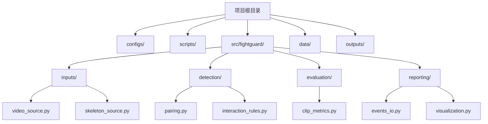
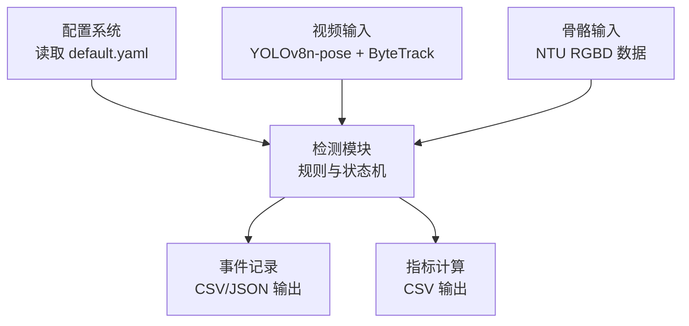
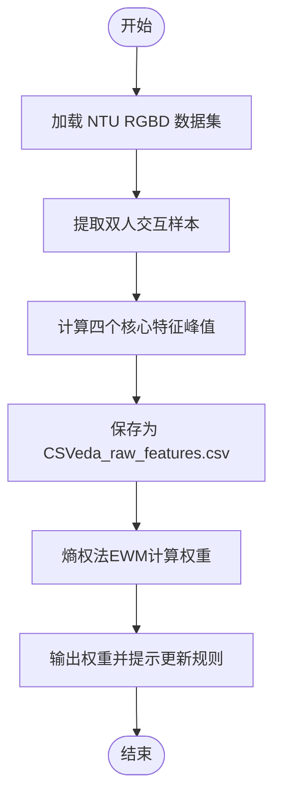
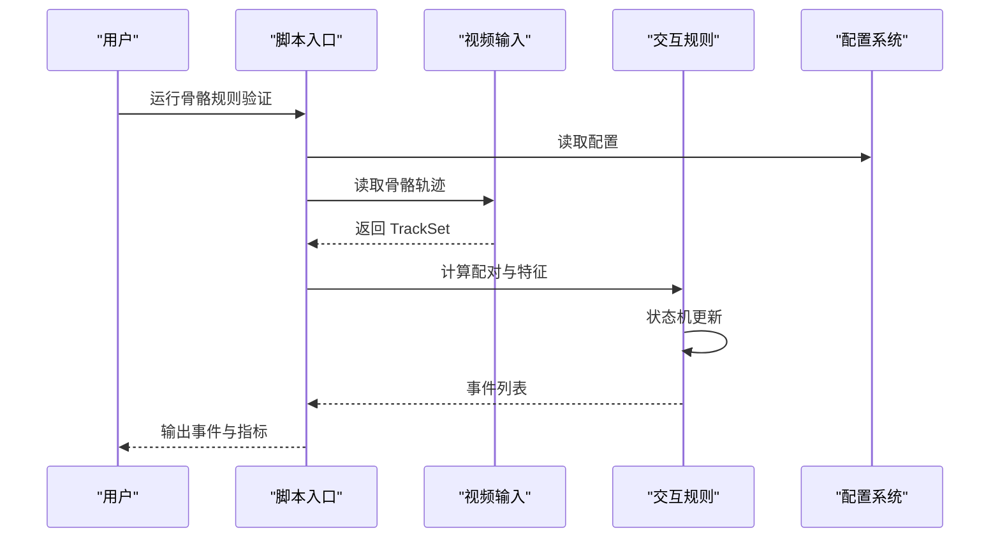
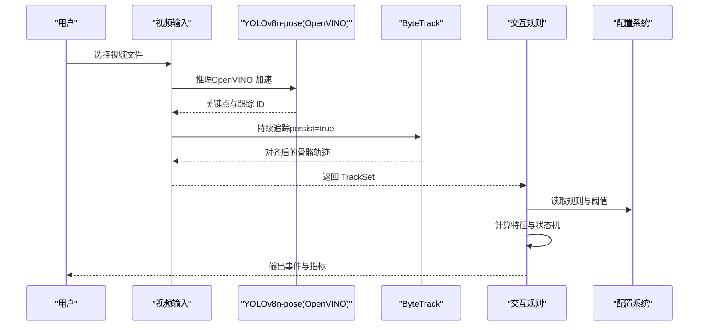
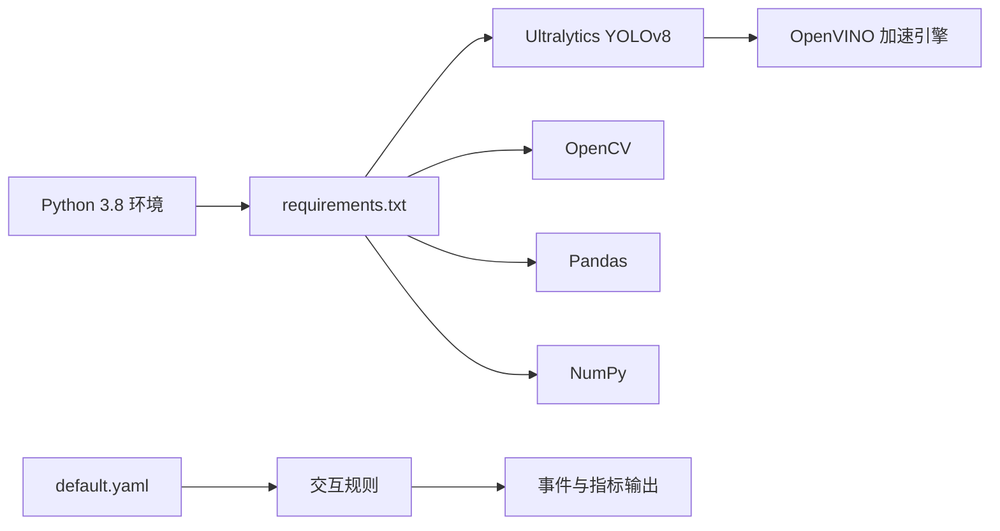

# 快速开始

<cite>
**本文引用的文件**
- [README.md](file://README.md)
- [requirements.txt](file://requirements.txt)
- [configs/default.yaml](file://configs/default.yaml)
- [scripts/extract_features_eda.py](file://scripts/extract_features_eda.py)
- [scripts/calculate_entropy_weights.py](file://scripts/calculate_entropy_weights.py)
- [scripts/debug_single_video.py](file://scripts/debug_single_video.py)
- [src/fightguard/detection/interaction_rules.py](file://src/fightguard/detection/interaction_rules.py)
- [src/fightguard/inputs/video_source.py](file://src/fightguard/inputs/video_source.py)
- [src/fightguard/config.py](file://src/fightguard/config.py)
- [src/fightguard/contracts.py](file://src/fightguard/contracts.py)
</cite>

## 目录
1. [简介](#简介)
2. [项目结构](#项目结构)
3. [核心组件](#核心组件)
4. [架构总览](#架构总览)
5. [详细组件分析](#详细组件分析)
6. [依赖分析](#依赖分析)
7. [性能考虑](#性能考虑)
8. [故障排查指南](#故障排查指南)
9. [结论](#结论)
10. [附录](#附录)

## 简介
KidGuard 是一个面向幼儿园场景的冲突风险管理分析系统，基于计算机视觉与骨骼关键点的空间几何关系，实现冲突行为的轻量化识别与风险评估。系统提供三个阶段的运行流程：阶段一（数据驱动的特征提取与赋权）、阶段二（骨骼数据规则验证）、阶段三（视频端到端检测）。项目支持使用 OpenVINO 加速 YOLOv8n-pose 推理，适合在轻薄本等资源受限设备上运行。

## 项目结构
- configs：全局参数与规则阈值配置
- scripts：各阶段运行入口与辅助脚本
- src/fightguard：核心包，包含输入、检测、评估、报告等模块
- data：数据集目录（不上传至仓库）
- outputs：运行结果目录（不上传至仓库）

图表来源
- [README.md:46-76](file://README.md#L46-L76)
- [src/fightguard/inputs/video_source.py:1-193](file://src/fightguard/inputs/video_source.py#L1-L193)
- [src/fightguard/detection/interaction_rules.py:1-531](file://src/fightguard/detection/interaction_rules.py#L1-L531)

章节来源
- [README.md:46-76](file://README.md#L46-L76)

## 核心组件
- 配置系统：集中读取与校验 configs/default.yaml，提供统一的配置访问接口
- 输入模块：视频输入（YOLOv8n-pose + ByteTrack）与骨骼数据输入
- 检测模块：基于状态机与规则的冲突判定，支持置信度抑制与特征归一化
- 评估与报告：事件记录与指标输出

章节来源
- [src/fightguard/config.py:1-120](file://src/fightguard/config.py#L1-L120)
- [src/fightguard/inputs/video_source.py:1-193](file://src/fightguard/inputs/video_source.py#L1-L193)
- [src/fightguard/detection/interaction_rules.py:1-531](file://src/fightguard/detection/interaction_rules.py#L1-L531)
- [src/fightguard/contracts.py:1-241](file://src/fightguard/contracts.py#L1-L241)

## 架构总览
系统采用“配置驱动 + 模块化”的设计，通过统一的数据契约（COCO-17）在各模块间传递数据，确保可维护性与可扩展性。

图表来源
- [src/fightguard/config.py:32-82](file://src/fightguard/config.py#L32-L82)
- [src/fightguard/inputs/video_source.py:57-193](file://src/fightguard/inputs/video_source.py#L57-L193)
- [src/fightguard/detection/interaction_rules.py:410-503](file://src/fightguard/detection/interaction_rules.py#L410-L503)
- [configs/default.yaml:1-62](file://configs/default.yaml#L1-L62)

## 详细组件分析

### 阶段一：数据驱动的特征提取与赋权
- 特征提取（EDA）：从 NTU RGBD 数据集中抽取双人交互样本，计算四个核心物理特征的峰值，保存为 CSV，供后续熵权法使用
- 熵权法赋权：基于信息熵理论客观计算四个特征的权重，替代经验参数

图表来源
- [scripts/extract_features_eda.py:28-102](file://scripts/extract_features_eda.py#L28-L102)
- [scripts/calculate_entropy_weights.py:12-67](file://scripts/calculate_entropy_weights.py#L12-L67)

章节来源
- [scripts/extract_features_eda.py:1-106](file://scripts/extract_features_eda.py#L1-L106)
- [scripts/calculate_entropy_weights.py:1-71](file://scripts/calculate_entropy_weights.py#L1-L71)

### 阶段二：骨骼数据规则验证
- 目标：验证规则与阈值在骨骼数据上的有效性
- 方法：读取骨骼轨迹，计算配对距离与特征，应用状态机与规则，输出事件与指标

图表来源
- [src/fightguard/detection/interaction_rules.py:410-503](file://src/fightguard/detection/interaction_rules.py#L410-L503)
- [src/fightguard/inputs/video_source.py:57-193](file://src/fightguard/inputs/video_source.py#L57-L193)
- [src/fightguard/config.py:32-82](file://src/fightguard/config.py#L32-L82)

章节来源
- [src/fightguard/detection/interaction_rules.py:1-531](file://src/fightguard/detection/interaction_rules.py#L1-L531)

### 阶段三：视频端到端检测
- 目标：对真实视频进行端到端检测，输出冲突事件
- 方法：使用 OpenVINO 加速的 YOLOv8n-pose 提取骨骼，ByteTrack 进行追踪，随后进入规则与状态机判定

图表来源
- [src/fightguard/inputs/video_source.py:57-193](file://src/fightguard/inputs/video_source.py#L57-L193)
- [src/fightguard/detection/interaction_rules.py:410-503](file://src/fightguard/detection/interaction_rules.py#L410-L503)
- [src/fightguard/config.py:32-82](file://src/fightguard/config.py#L32-L82)

章节来源
- [src/fightguard/inputs/video_source.py:1-193](file://src/fightguard/inputs/video_source.py#L1-L193)
- [src/fightguard/detection/interaction_rules.py:1-531](file://src/fightguard/detection/interaction_rules.py#L1-L531)

## 依赖分析
- Python 3.8 环境与依赖安装：通过 conda 创建虚拟环境并安装 requirements.txt
- OpenVINO 加速：系统内置 OpenVINO 模型目录，YOLOv8n-pose 将自动使用 OpenVINO 引擎进行推理
- 配置文件：default.yaml 提供规则阈值、输出设置、数据集定义等参数

图表来源
- [README.md:17-23](file://README.md#L17-L23)
- [src/fightguard/inputs/video_source.py:41-49](file://src/fightguard/inputs/video_source.py#L41-L49)
- [configs/default.yaml:1-62](file://configs/default.yaml#L1-L62)

章节来源
- [README.md:17-23](file://README.md#L17-L23)
- [src/fightguard/inputs/video_source.py:41-49](file://src/fightguard/inputs/video_source.py#L41-L49)
- [configs/default.yaml:1-62](file://configs/default.yaml#L1-L62)

## 性能考虑
- 轻量化模型：YOLOv8n-pose 适合 CPU 运行，结合 OpenVINO 可显著提升推理速度
- 追踪优化：使用 ByteTrack 提升低分检测框的稳定性，减少误配对
- 状态机平滑：通过平滑窗口与状态转换帧数控制，降低瞬时噪声带来的误报

章节来源
- [README.md:116-122](file://README.md#L116-L122)
- [src/fightguard/inputs/video_source.py:115-118](file://src/fightguard/inputs/video_source.py#L115-L118)
- [configs/default.yaml:50-62](file://configs/default.yaml#L50-L62)

## 故障排查指南
- 环境未创建或未激活
  - 确认已执行 conda 创建与激活命令
  - 参考：[README.md:19-23](file://README.md#L19-L23)
- 依赖安装失败
  - 检查 requirements.txt 是否存在
  - 参考：[README.md:22](file://README.md#L22)
- OpenVINO 加速未生效
  - 确认 yolov8n-pose_openvino_model 目录存在
  - 参考：[src/fightguard/inputs/video_source.py:41-49](file://src/fightguard/inputs/video_source.py#L41-L49)
- 配置文件缺失或字段不完整
  - 确认 configs/default.yaml 存在且包含必需字段
  - 参考：[src/fightguard/config.py:95-120](file://src/fightguard/config.py#L95-L120)
- 视频未检测到人
  - 降低检测阈值或更换视频
  - 参考：[src/fightguard/inputs/video_source.py:115-118](file://src/fightguard/inputs/video_source.py#L115-L118)
- 事件得分为 0.000
  - 使用单点诊断脚本定位问题帧
  - 参考：[scripts/debug_single_video.py:18-81](file://scripts/debug_single_video.py#L18-L81)

章节来源
- [README.md:19-23](file://README.md#L19-L23)
- [src/fightguard/inputs/video_source.py:41-49](file://src/fightguard/inputs/video_source.py#L41-L49)
- [src/fightguard/config.py:95-120](file://src/fightguard/config.py#L95-L120)
- [scripts/debug_single_video.py:18-81](file://scripts/debug_single_video.py#L18-L81)

## 结论
通过本快速开始指南，您可以在约 30 分钟内完成环境搭建与首次检测示例运行。建议优先完成阶段一的特征提取与赋权，再进行阶段二的规则验证，最后进行阶段三的视频端到端检测。遇到问题时，可借助诊断脚本与配置校验工具快速定位原因。

## 附录

### 环境配置步骤
- 创建并激活 Python 3.8 虚拟环境
  - 参考命令：[README.md:19-23](file://README.md#L19-L23)
- 安装依赖
  - 参考命令：[README.md:22](file://README.md#L22)
- 准备数据与输出目录
  - data/skeleton 与 data/video 目录用于存放骨骼与视频数据
  - outputs/events 与 outputs/metrics 用于保存事件与指标
  - 参考：[configs/default.yaml:6-15](file://configs/default.yaml#L6-L15)

章节来源
- [README.md:19-23](file://README.md#L19-L23)
- [configs/default.yaml:6-15](file://configs/default.yaml#L6-L15)

### 三个阶段运行方式
- 阶段一：数据驱动的特征提取与赋权
  - 提取特征数据：[scripts/extract_features_eda.py:104-106](file://scripts/extract_features_eda.py#L104-L106)
  - 计算熵权法权重：[scripts/calculate_entropy_weights.py:69-71](file://scripts/calculate_entropy_weights.py#L69-L71)
- 阶段二：骨骼数据规则验证
  - 运行规则验证入口（占位文件，实际使用时替换为具体脚本）
  - 参考：[README.md:36-40](file://README.md#L36-L40)
- 阶段三：视频端到端检测
  - 运行端到端检测入口（占位文件，实际使用时替换为具体脚本）
  - 参考：[README.md:41-44](file://README.md#L41-L44)

章节来源
- [README.md:25-44](file://README.md#L25-L44)
- [scripts/extract_features_eda.py:104-106](file://scripts/extract_features_eda.py#L104-L106)
- [scripts/calculate_entropy_weights.py:69-71](file://scripts/calculate_entropy_weights.py#L69-L71)

### OpenVINO 加速配置
- 模型位置：yolov8n-pose_openvino_model
- 自动加速：YOLOv8n-pose 将自动识别并使用 OpenVINO 引擎
- 参考：[src/fightguard/inputs/video_source.py:41-49](file://src/fightguard/inputs/video_source.py#L41-L49)

章节来源
- [src/fightguard/inputs/video_source.py:41-49](file://src/fightguard/inputs/video_source.py#L41-L49)

### 预期输出结果
- 阶段一：生成 outputs/metrics/eda_raw_features.csv
- 阶段二：生成 outputs/metrics/eval_results.csv（占位，实际以具体脚本为准）
- 阶段三：生成 outputs/events/事件记录文件（CSV/JSON，取决于配置）

章节来源
- [scripts/extract_features_eda.py:92-102](file://scripts/extract_features_eda.py#L92-L102)
- [configs/default.yaml:6-15](file://configs/default.yaml#L6-L15)