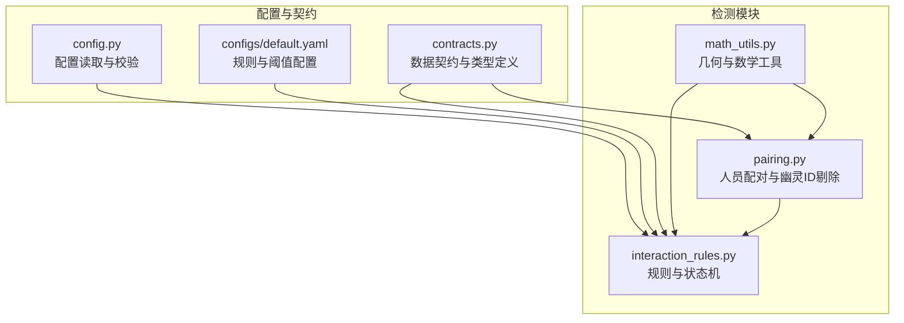
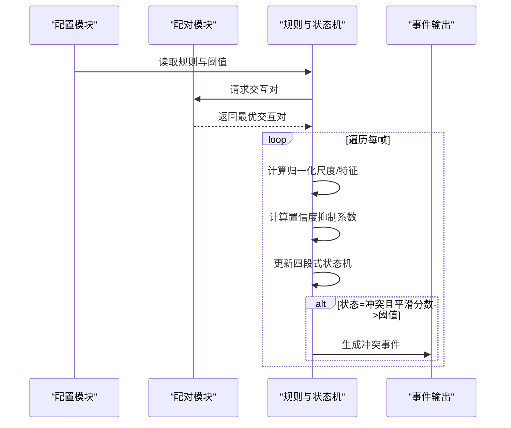
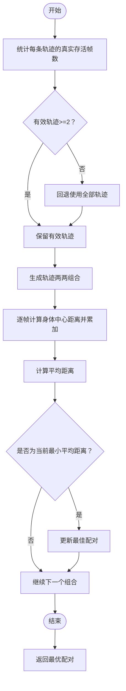
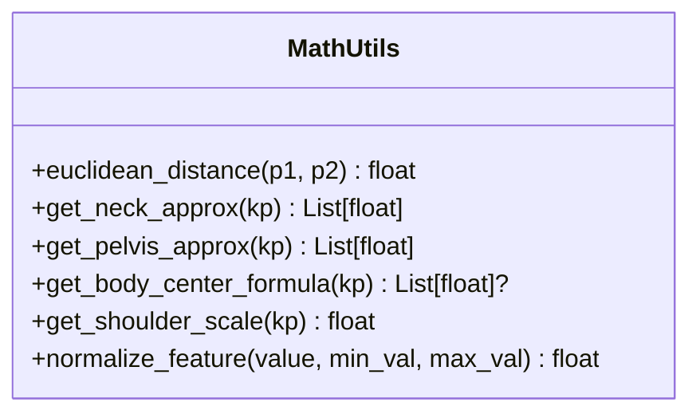
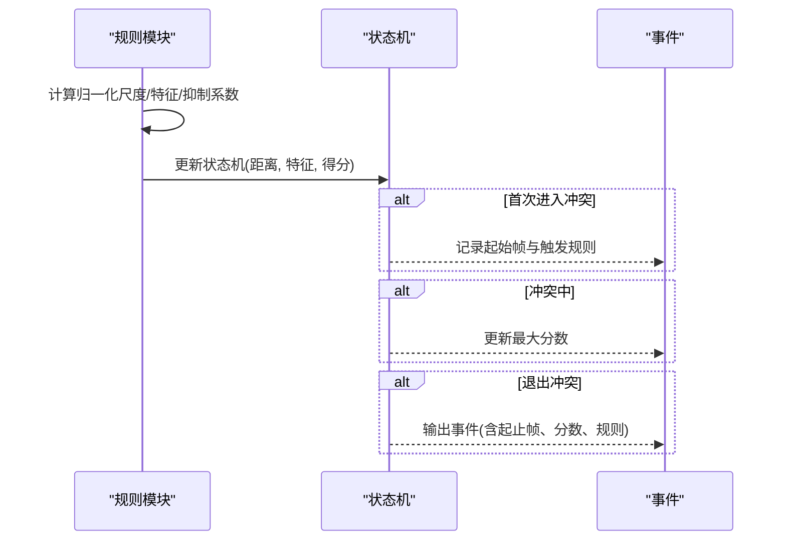
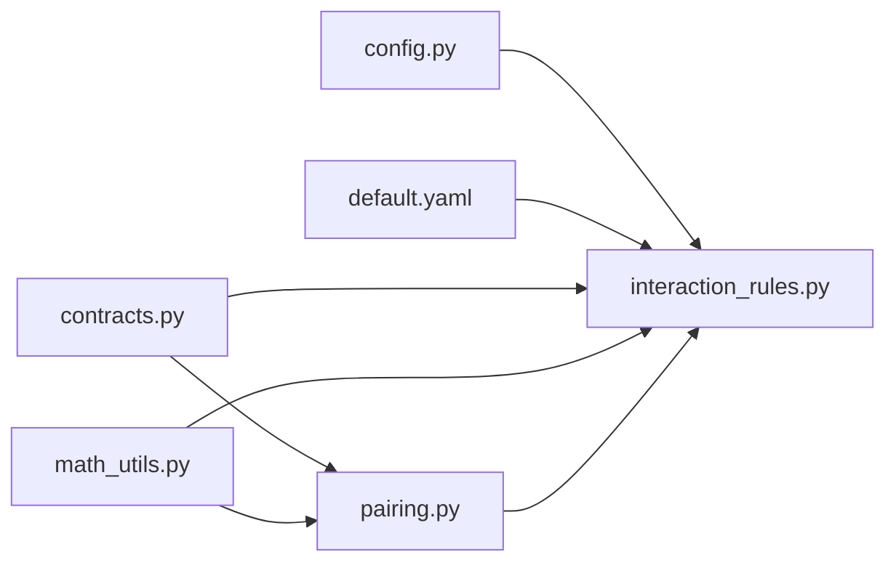

# 冲突检测算法

<cite>
**本文引用的文件**
- [src/fightguard/detection/pairing.py](file://src/fightguard/detection/pairing.py)
- [src/fightguard/detection/math_utils.py](file://src/fightguard/detection/math_utils.py)
- [src/fightguard/detection/interaction_rules.py](file://src/fightguard/detection/interaction_rules.py)
- [src/fightguard/config.py](file://src/fightguard/config.py)
- [src/fightguard/contracts.py](file://src/fightguard/contracts.py)
- [configs/default.yaml](file://configs/default.yaml)
- [README.md](file://README.md)
</cite>

## 目录
1. [简介](#简介)
2. [项目结构](#项目结构)
3. [核心组件](#核心组件)
4. [架构总览](#架构总览)
5. [详细组件分析](#详细组件分析)
6. [依赖分析](#依赖分析)
7. [性能考虑](#性能考虑)
8. [故障排查指南](#故障排查指南)
9. [结论](#结论)
10. [附录](#附录)

## 简介
本技术文档围绕“冲突检测算法”展开，聚焦于以下目标：
- 解释人员配对算法：距离计算、最优配对策略与幽灵ID剔除机制
- 阐述冲突检测核心逻辑：四段式状态机、物理特征提取、置信度抑制
- 数学工具函数：几何计算、特征归一化、身体中心计算
- 冲突判定规则体系：proximity_threshold、wrist_intrusion_threshold、velocity_threshold 等关键参数
- 完整流程说明：输入准备、特征计算、状态转换、结果输出
- 算法优化与性能调优建议、常见问题与解决方案

## 项目结构
本项目采用模块化分层组织，核心检测逻辑集中在 detection 包中，配置由 config 模块集中管理，数据契约由 contracts 模块统一。



图表来源
- [src/fightguard/config.py:1-120](file://src/fightguard/config.py#L1-L120)
- [src/fightguard/contracts.py:1-241](file://src/fightguard/contracts.py#L1-L241)
- [configs/default.yaml:1-62](file://configs/default.yaml#L1-L62)
- [src/fightguard/detection/pairing.py:1-54](file://src/fightguard/detection/pairing.py#L1-L54)
- [src/fightguard/detection/math_utils.py:1-52](file://src/fightguard/detection/math_utils.py#L1-L52)
- [src/fightguard/detection/interaction_rules.py:1-531](file://src/fightguard/detection/interaction_rules.py#L1-L531)

章节来源
- [README.md:46-76](file://README.md#L46-L76)
- [src/fightguard/config.py:32-82](file://src/fightguard/config.py#L32-L82)
- [src/fightguard/contracts.py:96-186](file://src/fightguard/contracts.py#L96-L186)

## 核心组件
- 人员配对与幽灵ID剔除：基于帧内身体中心距离的统计与筛选，剔除短暂出现的碎片化轨迹，保留稳定交互对
- 物理特征提取：肢体末端加速度、相对接近速度、关节角加速度、躯干倾角变化、骨盆速度等
- 置信度抑制：基于平均置信度的动态抑制系数，降低低质量关键点带来的误报
- 四段式状态机：接近、动作激活、作用-响应、事件确认，严格同步因果律
- 规则评分与事件生成：双向评分取主导，平滑窗口聚合，满足阈值后生成冲突事件

章节来源
- [src/fightguard/detection/pairing.py:14-53](file://src/fightguard/detection/pairing.py#L14-L53)
- [src/fightguard/detection/interaction_rules.py:363-408](file://src/fightguard/detection/interaction_rules.py#L363-L408)
- [src/fightguard/detection/interaction_rules.py:258-357](file://src/fightguard/detection/interaction_rules.py#L258-L357)
- [src/fightguard/detection/interaction_rules.py:410-503](file://src/fightguard/detection/interaction_rules.py#L410-L503)

## 架构总览
冲突检测端到端流程如下：



图表来源
- [src/fightguard/detection/interaction_rules.py:410-503](file://src/fightguard/detection/interaction_rules.py#L410-L503)
- [src/fightguard/detection/pairing.py:14-53](file://src/fightguard/detection/pairing.py#L14-L53)
- [src/fightguard/config.py:32-82](file://src/fightguard/config.py#L32-L82)

## 详细组件分析

### 人员配对与幽灵ID剔除
- 距离计算：以帧内身体中心（颈部近似与骨盆近似）的欧氏距离衡量两人接近程度
- 最优配对策略：遍历有效轨迹组合，计算平均距离，选择平均距离最小的一对
- 幽灵ID剔除：仅保留“真实存活帧数”≥阈值的轨迹，避免短暂出现的碎片化ID干扰
- 降级兜底：若有效轨迹少于2个，回退到全部轨迹继续配对



图表来源
- [src/fightguard/detection/pairing.py:14-53](file://src/fightguard/detection/pairing.py#L14-L53)
- [src/fightguard/detection/math_utils.py:26-35](file://src/fightguard/detection/math_utils.py#L26-L35)

章节来源
- [src/fightguard/detection/pairing.py:14-53](file://src/fightguard/detection/pairing.py#L14-L53)
- [src/fightguard/detection/math_utils.py:10-12](file://src/fightguard/detection/math_utils.py#L10-L12)
- [src/fightguard/detection/math_utils.py:26-35](file://src/fightguard/detection/math_utils.py#L26-L35)

### 数学工具函数
- 欧氏距离：两点间直线距离
- 颈部近似：使用鼻子关键点
- 骨盆近似：左右髋关节坐标的平均值
- 身体中心：颈部与骨盆坐标的平均值
- 肩宽尺度：左右肩距离+微小正则项，作为物理标尺
- 特征归一化：将特征映射到[0,1]区间



图表来源
- [src/fightguard/detection/math_utils.py:10-52](file://src/fightguard/detection/math_utils.py#L10-L52)

章节来源
- [src/fightguard/detection/math_utils.py:10-52](file://src/fightguard/detection/math_utils.py#L10-L52)

### 冲突判定规则与状态机
- 归一化尺度：基于双人肩宽尺度的平均值，消除尺度漂移
- 物理特征：
  - 肢体末端加速度（手腕/脚踝）
  - 相对接近速度（攻击距离的时间导数）
  - 关节角加速度（肘/膝）
  - 躯干倾角变化 Δφ_B
  - 骨盆速度
- 置信度抑制：基于平均置信度的动态抑制系数，降低低质量帧的影响
- 四段式状态机：
  - 初始/分离：当距离超过阈值并持续一定帧数后重置
  - 接近阶段：距离低于阈值并持续帧数后进入
  - 动作激活阶段：任一侧满足动作条件即进入
  - 作用-响应阶段：双方同时满足严格同步条件即进入
  - 事件确认：平滑窗口内平均分数超过阈值即确认事件

```mermaid
stateDiagram-v2
[*] --> 初始
初始 --> 接近阶段 : "距离<阈值且持续帧数>=W"
接近阶段 --> 动作激活阶段 : "任一侧满足动作条件"
动作激活阶段 --> 作用-响应阶段 : "双方满足严格同步条件"
作用-响应阶段 --> 事件确认 : "平滑分数>alert_threshold"
事件确认 --> 初始 : "分离帧数>=R"
初始 --> 事件确认 : "平滑分数>alert_threshold"
```

图表来源
- [src/fightguard/detection/interaction_rules.py:258-357](file://src/fightguard/detection/interaction_rules.py#L258-L357)

章节来源
- [src/fightguard/detection/interaction_rules.py:36-51](file://src/fightguard/detection/interaction_rules.py#L36-L51)
- [src/fightguard/detection/interaction_rules.py:57-155](file://src/fightguard/detection/interaction_rules.py#L57-L155)
- [src/fightguard/detection/interaction_rules.py:206-247](file://src/fightguard/detection/interaction_rules.py#L206-L247)
- [src/fightguard/detection/interaction_rules.py:258-357](file://src/fightguard/detection/interaction_rules.py#L258-L357)

### 规则评分与事件生成
- 双向评分：分别以 A→B 和 B→A 计算得分，取主导者
- 归一化特征：对各物理量进行区间映射
- 置信度抑制：按平均置信度动态调整
- 事件生成：首次进入冲突状态记录起始帧，期间维护最大分数与触发规则集合；退出时输出事件



图表来源
- [src/fightguard/detection/interaction_rules.py:363-408](file://src/fightguard/detection/interaction_rules.py#L363-L408)
- [src/fightguard/detection/interaction_rules.py:410-503](file://src/fightguard/detection/interaction_rules.py#L410-L503)

章节来源
- [src/fightguard/detection/interaction_rules.py:363-408](file://src/fightguard/detection/interaction_rules.py#L363-L408)
- [src/fightguard/detection/interaction_rules.py:410-503](file://src/fightguard/detection/interaction_rules.py#L410-L503)

## 依赖分析
- 配置依赖：规则阈值与状态机参数由配置文件集中提供，模块通过统一接口读取
- 数据契约：所有模块共享统一的数据结构与关键点命名规范，避免硬编码索引
- 检测模块内聚：math_utils 提供纯数学工具，pairing 负责配对，interaction_rules 负责规则与状态机



图表来源
- [src/fightguard/config.py:32-82](file://src/fightguard/config.py#L32-L82)
- [configs/default.yaml:16-30](file://configs/default.yaml#L16-L30)
- [src/fightguard/contracts.py:96-186](file://src/fightguard/contracts.py#L96-L186)
- [src/fightguard/detection/pairing.py:1-5](file://src/fightguard/detection/pairing.py#L1-L5)
- [src/fightguard/detection/math_utils.py:1-9](file://src/fightguard/detection/math_utils.py#L1-L9)
- [src/fightguard/detection/interaction_rules.py:16-24](file://src/fightguard/detection/interaction_rules.py#L16-L24)

章节来源
- [src/fightguard/config.py:32-82](file://src/fightguard/config.py#L32-L82)
- [src/fightguard/contracts.py:96-186](file://src/fightguard/contracts.py#L96-L186)
- [src/fightguard/detection/pairing.py:1-5](file://src/fightguard/detection/pairing.py#L1-L5)
- [src/fightguard/detection/math_utils.py:1-9](file://src/fightguard/detection/math_utils.py#L1-L9)
- [src/fightguard/detection/interaction_rules.py:16-24](file://src/fightguard/detection/interaction_rules.py#L16-L24)

## 性能考虑
- 时间复杂度
  - 配对阶段：对有效轨迹组合进行逐帧距离累加，整体约为 O(N^2·T)，其中 N 为有效轨迹数，T 为帧数
  - 特征提取：每帧对关键点进行常数次查询与计算，整体 O(T)
  - 状态机：每帧常数次比较与缓冲区更新，整体 O(T)
- 空间复杂度：主要为轨迹存储与状态机缓冲区，O(N·T)
- 优化建议
  - 优先保留存活帧数阈值，减少无效轨迹参与配对
  - 使用肩宽尺度归一化，降低尺度变化对特征的影响
  - 平滑窗口长度与状态机阈值配合调参，平衡灵敏度与稳定性
  - 在高分辨率视频上可先做关键点降采样或帧采样，降低计算压力

## 故障排查指南
- 配置文件缺失或字段不全
  - 现象：启动时报错，提示缺少必要字段
  - 处理：补齐 default.yaml 中 rules 与顶层字段
- 低置信度导致误报或漏报
  - 现象：关键点遮挡严重时误报或迟钝
  - 处理：调整置信度抑制阈值与状态机平滑窗口
- 幽灵ID干扰
  - 现象：短暂出现的轨迹影响最优配对
  - 处理：提升存活帧数阈值，或在输入侧加强轨迹稳定性
- 状态机频繁抖动
  - 现象：状态在冲突与非冲突之间反复切换
  - 处理：增大接近/冲突/分离帧数阈值，或延长平滑窗口

章节来源
- [src/fightguard/config.py:95-120](file://src/fightguard/config.py#L95-L120)
- [src/fightguard/detection/interaction_rules.py:206-247](file://src/fightguard/detection/interaction_rules.py#L206-L247)
- [src/fightguard/detection/pairing.py:17-28](file://src/fightguard/detection/pairing.py#L17-L28)
- [src/fightguard/detection/interaction_rules.py:258-357](file://src/fightguard/detection/interaction_rules.py#L258-L357)

## 结论
本算法通过“配对+特征+状态机”的流水线实现冲突检测，具备以下特点：
- 配对稳健：基于身体中心距离与存活帧数，有效剔除幽灵ID
- 特征全面：涵盖肢体加速度、相对接近速度、关节角加速度、躯干倾角与骨盆速度
- 判定可靠：四段式状态机与置信度抑制共同抑制瞬时噪声
- 可解释：事件记录包含触发规则，便于审计与优化

## 附录

### 关键参数与作用机制
- proximity_threshold（接近阈值）：决定两人是否进入接近阶段
- wrist_intrusion_threshold（手腕侵入阈值）：用于攻击距离的阈值化处理（在规则中体现为相对接近速度）
- velocity_threshold（速度阈值）：用于相对接近速度的阈值化处理
- alert_threshold（事件确认阈值）：平滑分数超过此值才确认事件
- smoothing_window_frames（平滑窗口）：用于状态机分数平滑
- proximity_window_frames（接近窗口）：用于接近阶段的持续帧数判定
- conflict_duration_frames（冲突持续帧数）：事件持续帧数阈值

章节来源
- [configs/default.yaml:16-30](file://configs/default.yaml#L16-L30)
- [src/fightguard/detection/interaction_rules.py:363-408](file://src/fightguard/detection/interaction_rules.py#L363-L408)
- [src/fightguard/detection/interaction_rules.py:410-503](file://src/fightguard/detection/interaction_rules.py#L410-L503)