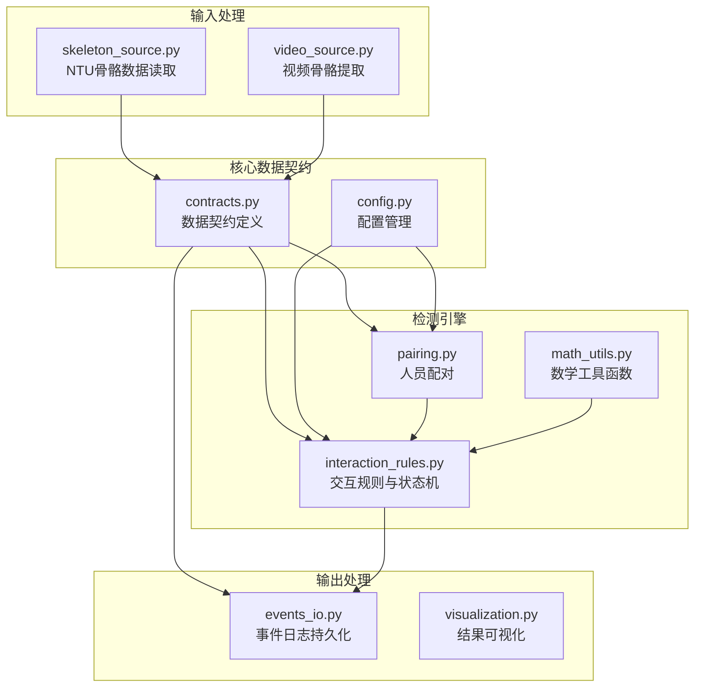
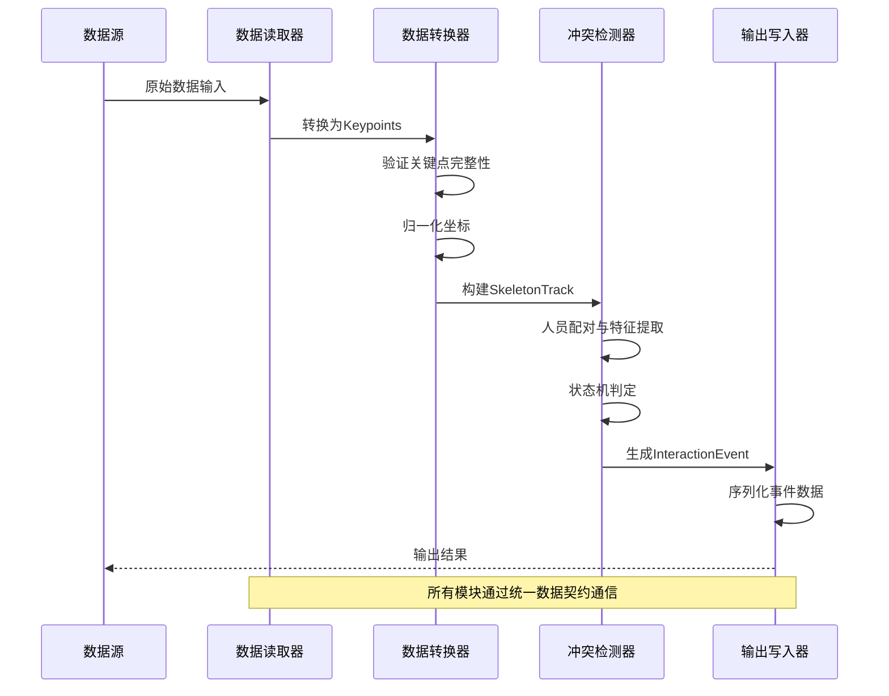
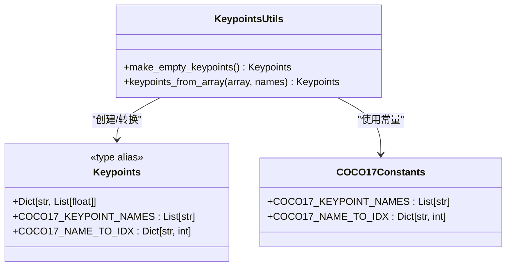
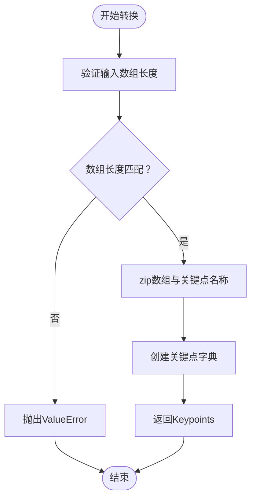
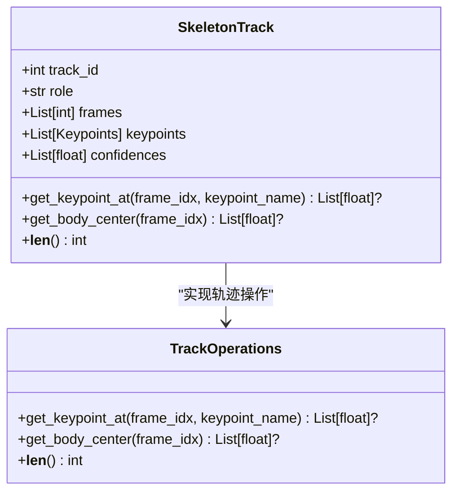
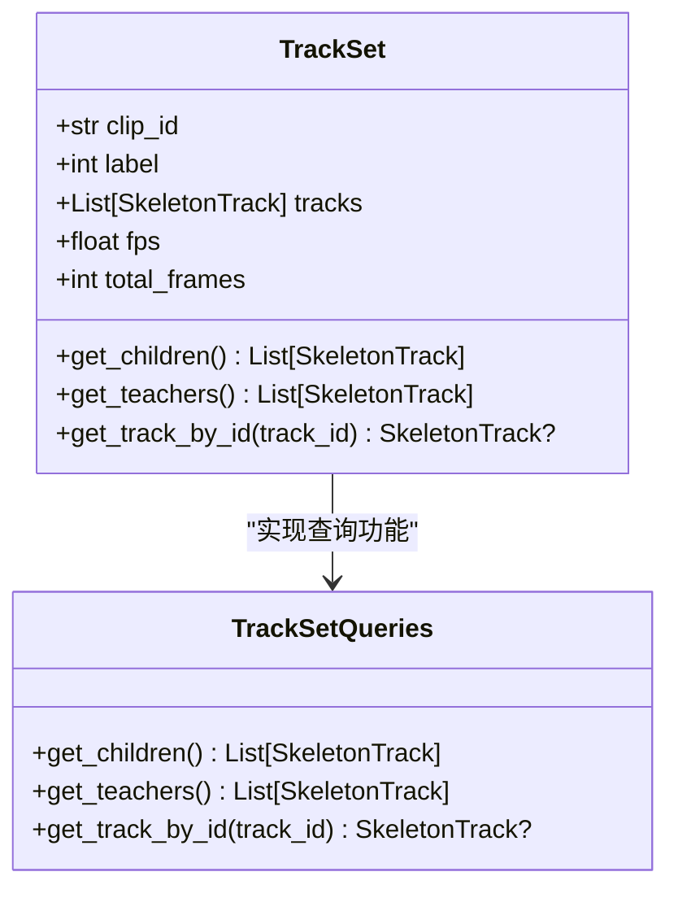
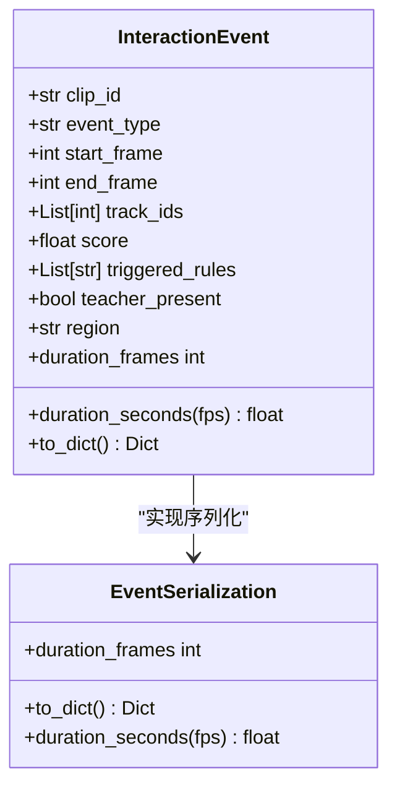
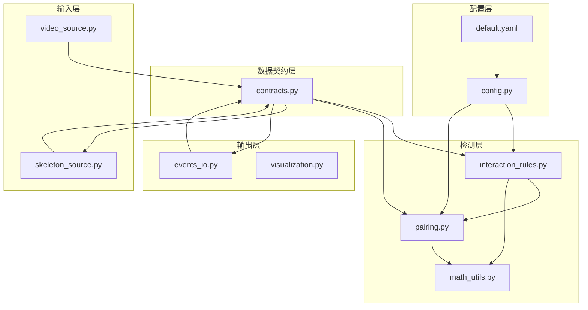

# 数据契约定义

<cite>
**本文引用的文件**
- [contracts.py](file://src/fightguard/contracts.py)
- [interaction_rules.py](file://src/fightguard/detection/interaction_rules.py)
- [events_io.py](file://src/fightguard/reporting/events_io.py)
- [skeleton_source.py](file://src/fightguard/inputs/skeleton_source.py)
- [pairing.py](file://src/fightguard/detection/pairing.py)
- [math_utils.py](file://src/fightguard/detection/math_utils.py)
- [config.py](file://src/fightguard/config.py)
- [default.yaml](file://configs/default.yaml)
- [README.md](file://README.md)
</cite>

## 目录
1. [简介](#简介)
2. [项目结构](#项目结构)
3. [核心组件](#核心组件)
4. [架构概览](#架构概览)
5. [详细组件分析](#详细组件分析)
6. [依赖关系分析](#依赖关系分析)
7. [性能考虑](#性能考虑)
8. [故障排除指南](#故障排除指南)
9. [结论](#结论)
10. [附录](#附录)

## 简介
本文件详细阐述了KidGuard项目中的数据契约定义，这是一个专注于幼儿园冲突风险管理分析系统的数据模型规范。数据契约的核心目标是：
- 统一模块间的数据交换格式，确保类型安全和接口一致性
- 通过标准化的数据结构提高代码的可维护性和可测试性
- 建立清晰的数据转换机制，支持不同数据源的集成
- 提供完整的错误预防机制，减少运行时异常

项目采用严格的COCO-17关键点标准，所有数据操作都通过字典键名而非硬编码索引进行，确保代码的可读性和可维护性。

## 项目结构
项目采用模块化架构，数据契约定义位于核心包中，各个模块通过统一的数据接口进行通信。

**图表来源**
- [contracts.py:1-241](file://src/fightguard/contracts.py#L1-L241)
- [config.py:1-120](file://src/fightguard/config.py#L1-L120)

**章节来源**
- [README.md:46-76](file://README.md#L46-L76)
- [contracts.py:1-241](file://src/fightguard/contracts.py#L1-L241)

## 核心组件
数据契约系统包含四个核心数据结构，每个都具有明确的职责和约束规则：

### Keypoints（关键点字典）
Keypoints是单帧单人的骨骼关键点字典，采用COCO-17标准的关键点名称作为键名，坐标值为归一化数值。

**关键特性：**
- 使用COCO-17标准关键点名称列表
- 坐标值采用归一化格式（0~1），相对于画面宽高
- 支持第三维置信度信息
- 提供空关键点生成和数组转换功能

**约束规则：**
- 关键点数量必须与COCO-17标准一致（17个）
- 坐标值范围应在[0,1]区间内
- 置信度值应在[0,1]区间内

### SkeletonTrack（轨迹序列）
SkeletonTrack表示单个人在一段时间内的骨骼轨迹，包含完整的时空信息。

**核心属性：**
- `track_id`: 人员唯一标识（整数）
- `role`: 角色标签，"child"或"teacher"
- `frames`: 帧索引列表，与关键点序列等长
- `keypoints`: 每帧对应的关键点字典列表
- `confidences`: 每帧的整体置信度（可选）

**功能特性：**
- 提供关键点查询接口
- 支持躯干中心点计算
- 实现长度计算和边界检查

### TrackSet（轨迹集合）
TrackSet代表一个视频片段内所有被检测到的人的轨迹集合。

**核心属性：**
- `clip_id`: 片段唯一标识（字符串）
- `label`: 片段级标签（1=冲突，0=正常，-1=未标注）
- `tracks`: 所有人的轨迹列表
- `fps`: 视频帧率
- `total_frames`: 片段总帧数

**实用功能：**
- 支持按角色筛选轨迹
- 提供按ID查找轨迹的方法
- 包含完整的数据验证机制

### InteractionEvent（冲突事件）
InteractionEvent是一次被规则流检测到的交互事件的结构化描述。

**核心属性：**
- `clip_id`: 来源片段ID
- `event_type`: 事件类型（如"child_conflict"）
- `start_frame`: 事件开始帧
- `end_frame`: 事件结束帧
- `track_ids`: 涉及的人员track_id列表
- `score`: 规则触发的置信度分数
- `triggered_rules`: 触发的具体规则列表
- `teacher_present`: 教师是否在场
- `region`: 事件发生的功能区域

**辅助功能：**
- 持续帧数计算
- 持续时间转换（秒）
- 字典格式序列化

**章节来源**
- [contracts.py:56-241](file://src/fightguard/contracts.py#L56-L241)

## 架构概览
数据契约在整个系统中的作用体现在数据流的标准化和模块间的解耦。

**图表来源**
- [skeleton_source.py:211-274](file://src/fightguard/inputs/skeleton_source.py#L211-L274)
- [interaction_rules.py:410-503](file://src/fightguard/detection/interaction_rules.py#L410-L503)
- [events_io.py:23-35](file://src/fightguard/reporting/events_io.py#L23-L35)

## 详细组件分析

### Keypoints数据结构分析
Keypoints是整个数据契约系统的基础，其设计体现了类型安全和易用性的平衡。

**图表来源**
- [contracts.py:56-90](file://src/fightguard/contracts.py#L56-L90)
- [contracts.py:24-47](file://src/fightguard/contracts.py#L24-L47)

**实现特点：**
- 使用类型别名确保编译时类型检查
- 提供完整的COCO-17关键点名称常量
- 支持从数组格式转换为字典格式
- 包含空关键点生成机制

**数据转换流程：**

**图表来源**
- [contracts.py:67-90](file://src/fightguard/contracts.py#L67-L90)

**章节来源**
- [contracts.py:56-90](file://src/fightguard/contracts.py#L56-L90)

### SkeletonTrack轨迹序列分析
SkeletonTrack实现了完整的轨迹管理功能，支持复杂的时间序列操作。

**图表来源**
- [contracts.py:96-148](file://src/fightguard/contracts.py#L96-L148)

**核心功能实现：**
- 关键点查询：通过帧索引和关键点名称获取坐标
- 躯干中心计算：基于髋关节中点计算身体中心
- 边界检查：防止越界访问和空值处理

**章节来源**
- [contracts.py:96-148](file://src/fightguard/contracts.py#L96-L148)

### TrackSet轨迹集合分析
TrackSet提供了高级的轨迹管理和查询功能，是系统的核心数据容器。

**图表来源**
- [contracts.py:154-186](file://src/fightguard/contracts.py#L154-L186)

**查询功能实现：**
- 角色筛选：快速获取特定角色的轨迹
- ID查找：通过唯一标识符定位轨迹
- 数据验证：确保查询结果的有效性

**章节来源**
- [contracts.py:154-186](file://src/fightguard/contracts.py#L154-L186)

### InteractionEvent事件分析
InteractionEvent是冲突检测结果的最终表现形式，包含了完整的事件描述和元数据。

**图表来源**
- [contracts.py:192-241](file://src/fightguard/contracts.py#L192-L241)

**序列化机制：**
- 字典格式转换：便于CSV/JSON输出
- 格式化处理：数值精度控制和字符串转换
- 元数据保护：确保事件信息的完整性

**章节来源**
- [contracts.py:192-241](file://src/fightguard/contracts.py#L192-L241)

## 依赖关系分析
数据契约系统通过清晰的依赖层次实现了模块间的松耦合。

**图表来源**
- [contracts.py:1-241](file://src/fightguard/contracts.py#L1-L241)
- [interaction_rules.py:16-24](file://src/fightguard/detection/interaction_rules.py#L16-L24)

**依赖特点：**
- 单向依赖：从输入到输出的线性数据流
- 最小依赖：每个模块只依赖必要的功能
- 明确边界：数据契约作为唯一的共享接口

**章节来源**
- [interaction_rules.py:16-24](file://src/fightguard/detection/interaction_rules.py#L16-L24)
- [skeleton_source.py:22-29](file://src/fightguard/inputs/skeleton_source.py#L22-L29)

## 性能考虑
数据契约设计充分考虑了性能优化和内存效率：

### 内存优化策略
- **数据类型选择**：使用紧凑的List和Dict结构存储轨迹数据
- **延迟计算**：关键点查询采用惰性求值，避免不必要的计算
- **缓存机制**：配置信息只读取一次并缓存

### 计算优化
- **向量化操作**：利用NumPy数组进行批量计算（在相关模块中）
- **早期退出**：在检测过程中实现快速失败机制
- **增量更新**：状态机采用增量更新策略

### I/O优化
- **批量处理**：支持批量数据读取和处理
- **流式处理**：视频数据采用流式处理模式
- **缓存策略**：频繁访问的数据进行内存缓存

## 故障排除指南
数据契约系统提供了完善的错误处理和调试机制：

### 常见问题诊断
**关键点数据异常：**
- 检查关键点数量是否符合COCO-17标准
- 验证坐标值是否在[0,1]范围内
- 确认置信度值的有效性

**轨迹数据不一致：**
- 验证帧索引与关键点序列的长度匹配
- 检查轨迹ID的唯一性
- 确认角色标签的有效性

**事件数据格式错误：**
- 验证事件时间戳的逻辑一致性
- 检查触发规则列表的完整性
- 确认序列化过程的正确性

### 调试工具
**数据验证：**
- 实现数据完整性检查函数
- 提供可视化工具展示关键点分布
- 支持数据统计和异常检测

**日志记录：**
- 详细的错误信息和堆栈跟踪
- 数据转换过程的中间结果记录
- 性能指标的实时监控

**章节来源**
- [contracts.py:85-89](file://src/fightguard/contracts.py#L85-L89)
- [skeleton_source.py:87-89](file://src/fightguard/inputs/skeleton_source.py#L87-L89)

## 结论
KidGuard项目的数据契约系统通过标准化的数据结构和严格的类型约束，成功实现了以下目标：

**类型安全保证：**
- 编译时类型检查，减少运行时错误
- 明确的数据边界和约束规则
- 统一的错误处理机制

**接口一致性维护：**
- 所有模块通过统一的数据契约通信
- 清晰的API边界和职责分离
- 简化的依赖关系管理

**错误预防机制：**
- 输入数据的完整性验证
- 边界条件的严格检查
- 异常情况的优雅处理

**可维护性和可测试性提升：**
- 模块化设计，职责单一明确
- 标准化的数据格式，便于单元测试
- 清晰的代码结构，降低维护成本

数据契约系统不仅满足了当前项目的功能需求，还为未来的功能扩展和系统演进奠定了坚实的基础。

## 附录

### 数据转换示例
以下是典型的数据转换流程示例：

**NTU骨骼数据转换：**
1. 读取NTU .skeleton文件
2. 解析关键点坐标和元数据
3. 应用NTU到COCO-17映射表
4. 进行坐标归一化处理
5. 构建SkeletonTrack对象
6. 创建TrackSet容器

**冲突检测流程：**
1. 读取TrackSet数据
2. 人员配对和距离计算
3. 特征提取和归一化
4. 状态机更新和判定
5. 事件生成和序列化
6. 结果输出和持久化

### 配置管理
系统通过统一的配置管理机制确保参数的一致性和可调性：

**配置文件结构：**
- 规则阈值配置
- 状态机参数设置
- 输出选项配置
- 数据集定义

**配置验证：**
- 必要字段的完整性检查
- 参数范围的有效性验证
- 配置文件格式的正确性

**章节来源**
- [default.yaml:1-62](file://configs/default.yaml#L1-L62)
- [config.py:95-120](file://src/fightguard/config.py#L95-L120)