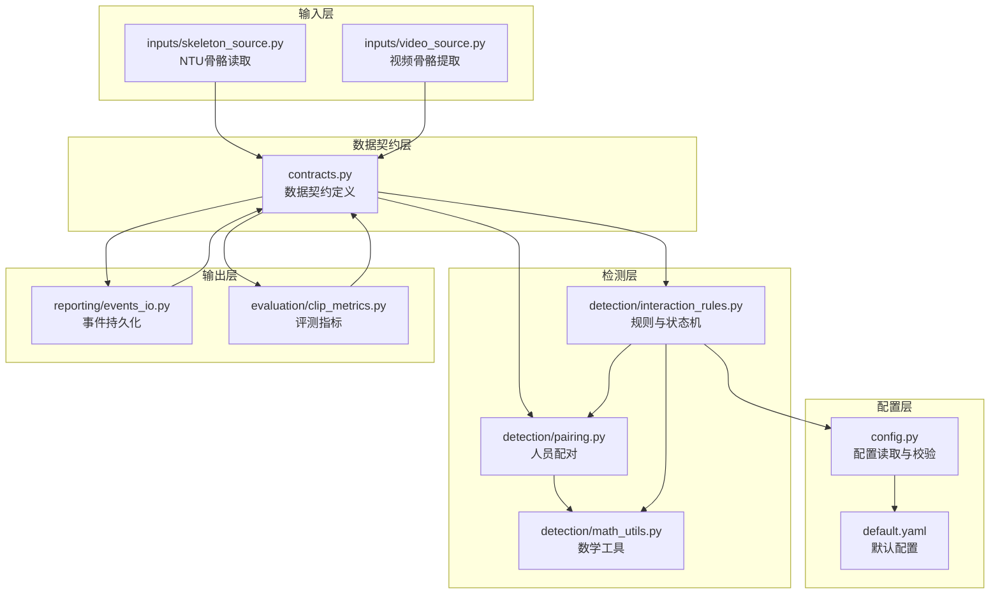
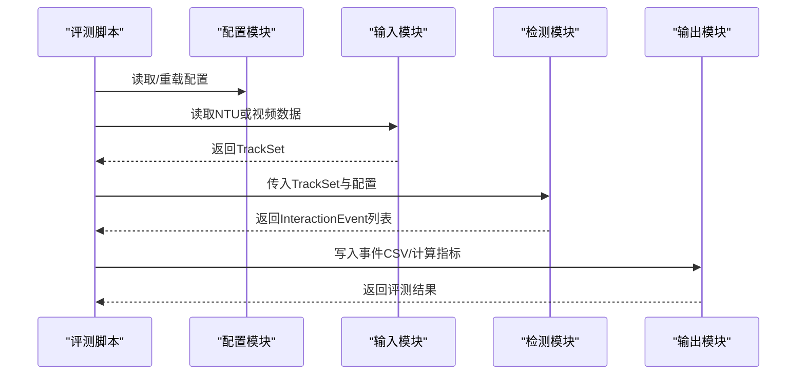
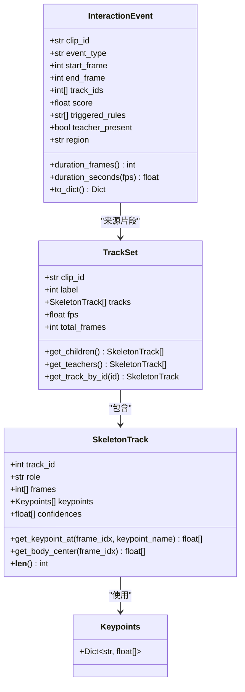
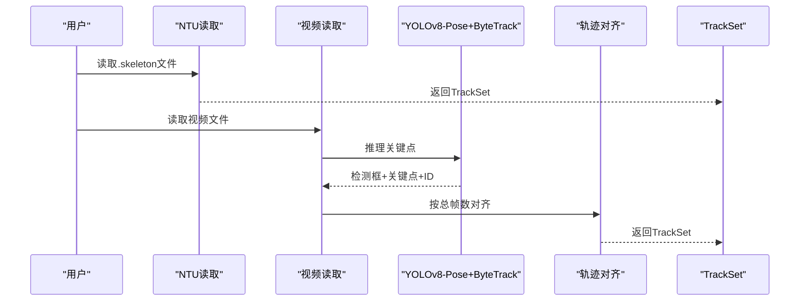
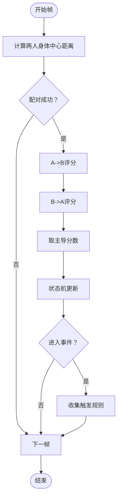
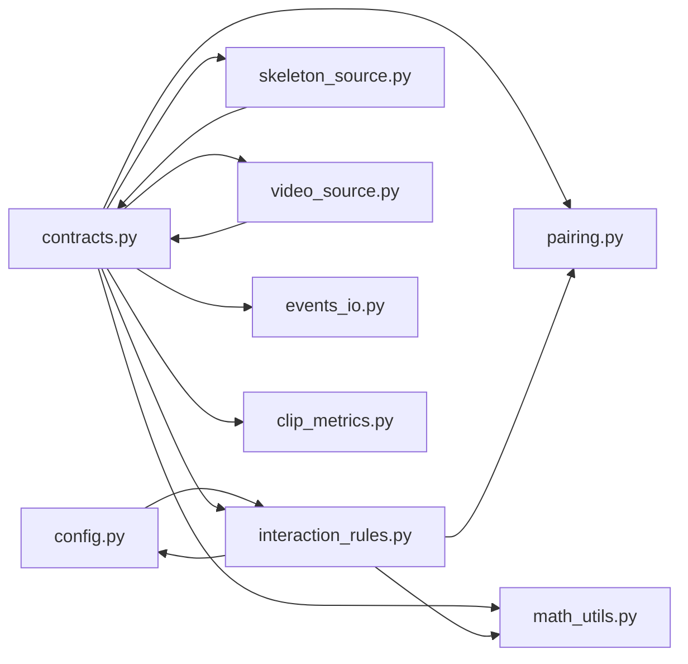

# 核心模块详解

<cite>
**本文引用的文件**
- [src/fightguard/config.py](file://src/fightguard/config.py)
- [configs/default.yaml](file://configs/default.yaml)
- [src/fightguard/contracts.py](file://src/fightguard/contracts.py)
- [src/fightguard/detection/pairing.py](file://src/fightguard/detection/pairing.py)
- [src/fightguard/detection/math_utils.py](file://src/fightguard/detection/math_utils.py)
- [src/fightguard/detection/interaction_rules.py](file://src/fightguard/detection/interaction_rules.py)
- [src/fightguard/inputs/skeleton_source.py](file://src/fightguard/inputs/skeleton_source.py)
- [src/fightguard/inputs/video_source.py](file://src/fightguard/inputs/video_source.py)
- [src/fightguard/reporting/events_io.py](file://src/fightguard/reporting/events_io.py)
- [src/fightguard/evaluation/clip_metrics.py](file://src/fightguard/evaluation/clip_metrics.py)
- [scripts/eval_video_dataset.py](file://scripts/eval_video_dataset.py)
- [scripts/debug_single_video.py](file://scripts/debug_single_video.py)
- [scripts/tune_optuna.py](file://scripts/tune_optuna.py)
- [README.md](file://README.md)
</cite>

## 目录
1. [简介](#简介)
2. [项目结构](#项目结构)
3. [核心组件](#核心组件)
4. [架构总览](#架构总览)
5. [详细组件分析](#详细组件分析)
6. [依赖分析](#依赖分析)
7. [性能考虑](#性能考虑)
8. [故障排查指南](#故障排查指南)
9. [结论](#结论)
10. [附录](#附录)

## 简介
本文件面向KidGuard核心模块，系统化梳理配置管理、数据契约、输入处理、冲突检测与输出管理五大模块的设计原理与实现细节。重点包括：
- 配置系统：YAML配置读取、参数校验与动态重载
- 数据契约：Keypoints、SkeletonTrack、TrackSet、InteractionEvent等数据结构的定义与使用
- 输入处理：NTU RGBD骨骼数据读取与视频数据处理（含YOLOv8-Pose与ByteTrack追踪）
- 冲突检测：人员配对、状态机冲突检测与数学工具函数
- 输出管理：事件记录与评估指标计算

## 项目结构
项目采用模块化分层组织，核心代码位于src/fightguard，配置位于configs，评测与脚本位于scripts，输出位于outputs。

图表来源
- [src/fightguard/config.py:1-120](file://src/fightguard/config.py#L1-L120)
- [configs/default.yaml:1-62](file://configs/default.yaml#L1-L62)
- [src/fightguard/contracts.py:1-241](file://src/fightguard/contracts.py#L1-L241)
- [src/fightguard/inputs/skeleton_source.py:1-331](file://src/fightguard/inputs/skeleton_source.py#L1-L331)
- [src/fightguard/inputs/video_source.py:1-193](file://src/fightguard/inputs/video_source.py#L1-L193)
- [src/fightguard/detection/pairing.py:1-54](file://src/fightguard/detection/pairing.py#L1-L54)
- [src/fightguard/detection/math_utils.py:1-52](file://src/fightguard/detection/math_utils.py#L1-L52)
- [src/fightguard/detection/interaction_rules.py:1-531](file://src/fightguard/detection/interaction_rules.py#L1-L531)
- [src/fightguard/reporting/events_io.py:1-36](file://src/fightguard/reporting/events_io.py#L1-L36)
- [src/fightguard/evaluation/clip_metrics.py:1-47](file://src/fightguard/evaluation/clip_metrics.py#L1-L47)

章节来源
- [README.md:46-76](file://README.md#L46-L76)

## 核心组件
- 配置管理：提供全局配置读取、缓存与校验，支持动态重载，确保规则与路径一致性
- 数据契约：统一关键点、轨迹与事件的数据结构，保障模块间接口稳定
- 输入处理：NTU骨骼文件解析与视频流骨骼提取，统一输出TrackSet
- 冲突检测：基于配对与状态机的规则引擎，结合置信度抑制与特征归一化
- 输出管理：事件CSV持久化与评测指标计算

章节来源
- [src/fightguard/config.py:32-120](file://src/fightguard/config.py#L32-L120)
- [src/fightguard/contracts.py:15-241](file://src/fightguard/contracts.py#L15-L241)
- [src/fightguard/inputs/skeleton_source.py:211-331](file://src/fightguard/inputs/skeleton_source.py#L211-L331)
- [src/fightguard/inputs/video_source.py:57-193](file://src/fightguard/inputs/video_source.py#L57-L193)
- [src/fightguard/detection/interaction_rules.py:410-503](file://src/fightguard/detection/interaction_rules.py#L410-L503)
- [src/fightguard/reporting/events_io.py:12-36](file://src/fightguard/reporting/events_io.py#L12-L36)
- [src/fightguard/evaluation/clip_metrics.py:9-47](file://src/fightguard/evaluation/clip_metrics.py#L9-L47)

## 架构总览
KidGuard采用“配置驱动 + 数据契约 + 模块解耦”的架构。配置模块提供统一参数来源；输入模块产出标准化轨迹；检测模块基于规则与状态机进行冲突判定；输出模块负责事件记录与指标统计。

图表来源
- [scripts/eval_video_dataset.py:84-102](file://scripts/eval_video_dataset.py#L84-L102)
- [src/fightguard/config.py:32-92](file://src/fightguard/config.py#L32-L92)
- [src/fightguard/inputs/skeleton_source.py:211-274](file://src/fightguard/inputs/skeleton_source.py#L211-L274)
- [src/fightguard/inputs/video_source.py:57-193](file://src/fightguard/inputs/video_source.py#L57-L193)
- [src/fightguard/detection/interaction_rules.py:410-503](file://src/fightguard/detection/interaction_rules.py#L410-L503)
- [src/fightguard/reporting/events_io.py:23-36](file://src/fightguard/reporting/events_io.py#L23-L36)

## 详细组件分析

### 配置管理系统
- 设计要点
  - 模块级缓存：首次读取后缓存配置，避免重复I/O
  - 路径解析：自动定位默认配置文件，支持自定义路径
  - 参数校验：强制检查顶层必需键与rules子键，缺失时报错
  - 动态重载：提供reload_config接口，支持调参调试时热更新
- 关键接口
  - get_config(config_path=None) -> Dict[str, Any]
  - reload_config(config_path=None) -> Dict[str, Any]
- 最佳实践
  - 所有模块统一通过get_config访问配置，禁止硬编码阈值
  - 调参阶段使用reload_config避免重启进程
  - 配置文件变更后，建议先运行单元校验再批量运行

章节来源
- [src/fightguard/config.py:32-120](file://src/fightguard/config.py#L32-L120)
- [configs/default.yaml:1-62](file://configs/default.yaml#L1-L62)

### 数据契约定义
- Keypoints
  - 字典结构：键为COCO-17关键点名称，值为[x, y]或[x, y, conf]
  - 工具函数：make_empty_keypoints、keypoints_from_array
- SkeletonTrack
  - 单人多帧轨迹：track_id、role、frames、keypoints、confidences
  - 辅助方法：get_keypoint_at、get_body_center、__len__
- TrackSet
  - 片段内所有轨迹集合：clip_id、label、tracks、fps、total_frames
  - 辅助方法：get_children、get_teachers、get_track_by_id
- InteractionEvent
  - 事件结构：clip_id、event_type、start_frame、end_frame、track_ids、score、triggered_rules、teacher_present、region
  - 工具方法：duration_frames、duration_seconds、to_dict

图表来源
- [src/fightguard/contracts.py:56-241](file://src/fightguard/contracts.py#L56-L241)

章节来源
- [src/fightguard/contracts.py:56-241](file://src/fightguard/contracts.py#L56-L241)

### 输入处理模块
- NTU RGBD骨骼读取
  - 文件名解析：从S/C/P/R/A字段提取clip元信息
  - 标签判定：依据配置中的冲突/正常动作列表
  - 坐标映射：NTU 25点映射到COCO-17，保留置信度
  - 归一化：按帧做min-max归一化，统一到[0,1]
  - 输出：标准化TrackSet
- 视频骨骼提取（阶段二核心）
  - 模型加载：OpenVINO加速的YOLOv8n-pose
  - 追踪器：ByteTrack提升低分框稳定性
  - 轨迹对齐：按总帧数对齐，保证时空严格对齐
  - 输出：标准化TrackSet

图表来源
- [src/fightguard/inputs/skeleton_source.py:211-331](file://src/fightguard/inputs/skeleton_source.py#L211-L331)
- [src/fightguard/inputs/video_source.py:57-193](file://src/fightguard/inputs/video_source.py#L57-L193)

章节来源
- [src/fightguard/inputs/skeleton_source.py:211-331](file://src/fightguard/inputs/skeleton_source.py#L211-L331)
- [src/fightguard/inputs/video_source.py:57-193](file://src/fightguard/inputs/video_source.py#L57-L193)

### 冲突检测算法
- 人员配对
  - 生存期过滤：剔除存活帧不足的碎片化轨迹
  - 距离统计：计算所有轨迹对的平均距离，选择最贴近的一对
- 数学工具
  - 几何与归一化：欧氏距离、人体中心点、肩宽尺度、特征归一化
- 规则与状态机
  - 物理特征：肢体加速度、相对接近速度、关节角加速度、躯干倾角变化、骨盆速度
  - 置信度抑制：基于平均置信度的抑制系数
  - 状态机：四段式同步因果律，严格闭环条件
  - 主流程：双向评分、主导分数、事件窗口与规则收集

图表来源
- [src/fightguard/detection/pairing.py:14-54](file://src/fightguard/detection/pairing.py#L14-L54)
- [src/fightguard/detection/math_utils.py:10-52](file://src/fightguard/detection/math_utils.py#L10-L52)
- [src/fightguard/detection/interaction_rules.py:363-503](file://src/fightguard/detection/interaction_rules.py#L363-L503)

章节来源
- [src/fightguard/detection/pairing.py:14-54](file://src/fightguard/detection/pairing.py#L14-L54)
- [src/fightguard/detection/math_utils.py:10-52](file://src/fightguard/detection/math_utils.py#L10-L52)
- [src/fightguard/detection/interaction_rules.py:363-503](file://src/fightguard/detection/interaction_rules.py#L363-L503)

### 输出管理模块
- 事件记录
  - save_events_csv：将InteractionEvent转为字典并写入CSV
  - 支持事件字段：clip_id、event_type、start_frame、end_frame、duration_frames、track_ids、score、triggered_rules、teacher_present、region
- 评测指标
  - calculate_metrics：基于TP/FP/TN/FN计算Accuracy、Precision、Recall、FPR、F1

章节来源
- [src/fightguard/reporting/events_io.py:12-36](file://src/fightguard/reporting/events_io.py#L12-L36)
- [src/fightguard/evaluation/clip_metrics.py:9-47](file://src/fightguard/evaluation/clip_metrics.py#L9-L47)

## 依赖分析
- 模块内聚与耦合
  - contracts.py为通用契约，被所有模块依赖，形成高内聚低耦合
  - detection模块内部通过math_utils与pairing协作，规则引擎依赖配置与契约
  - 输入模块分别对接NTU与视频，最终统一为TrackSet
- 外部依赖
  - OpenCV、Ultralytics YOLOv8、Optuna（调参）、tqdm（进度条）

图表来源
- [src/fightguard/config.py:32-92](file://src/fightguard/config.py#L32-L92)
- [src/fightguard/contracts.py:15-241](file://src/fightguard/contracts.py#L15-L241)
- [src/fightguard/detection/interaction_rules.py:410-503](file://src/fightguard/detection/interaction_rules.py#L410-L503)
- [src/fightguard/detection/pairing.py:14-54](file://src/fightguard/detection/pairing.py#L14-L54)
- [src/fightguard/detection/math_utils.py:10-52](file://src/fightguard/detection/math_utils.py#L10-L52)
- [src/fightguard/inputs/skeleton_source.py:211-331](file://src/fightguard/inputs/skeleton_source.py#L211-L331)
- [src/fightguard/inputs/video_source.py:57-193](file://src/fightguard/inputs/video_source.py#L57-L193)
- [src/fightguard/reporting/events_io.py:12-36](file://src/fightguard/reporting/events_io.py#L12-L36)
- [src/fightguard/evaluation/clip_metrics.py:9-47](file://src/fightguard/evaluation/clip_metrics.py#L9-L47)

## 性能考虑
- 配置缓存：避免重复读取YAML，减少I/O开销
- 轨迹对齐：统一总帧数，避免动态拼接带来的额外计算
- 状态机平滑：滑动窗口平均抑制瞬时噪声
- 模型加速：OpenVINO硬件加速YOLOv8推理
- 调参与解耦：将感知层与认知层解耦，利用缓存数据进行大规模参数搜索

## 故障排查指南
- 配置问题
  - 症状：找不到配置文件或字段缺失
  - 处理：检查default.yaml路径与字段，使用get_config校验；必要时reload_config
- 输入问题
  - NTU文件：确认文件名符合S/C/P/R/A格式；检查动作类别是否在配置中
  - 视频：确认视频可读、模型加载成功、ByteTrack追踪器可用
- 检测问题
  - 漏报：使用debug_single_video.py逐帧回放状态机与特征
  - 误报：调整规则阈值与状态机参数，或启用置信度抑制
- 评测问题
  - 指标异常：核对预测与实际标签，检查事件记录CSV字段

章节来源
- [scripts/debug_single_video.py:18-81](file://scripts/debug_single_video.py#L18-L81)
- [src/fightguard/config.py:60-82](file://src/fightguard/config.py#L60-L82)
- [src/fightguard/inputs/skeleton_source.py:77-114](file://src/fightguard/inputs/skeleton_source.py#L77-L114)
- [src/fightguard/inputs/video_source.py:80-96](file://src/fightguard/inputs/video_source.py#L80-L96)

## 结论
KidGuard通过“配置驱动 + 数据契约 + 模块解耦”的设计，在NTU与真实视频场景下实现了稳定的冲突检测与评估。建议在生产环境中：
- 使用配置缓存与动态重载提升开发效率
- 严格遵循数据契约，避免硬编码索引
- 结合状态机与置信度抑制，持续优化阈值
- 利用OpenVINO加速与Optuna调参，进一步提升性能与效果

## 附录
- API接口清单（示例）
  - 配置：get_config(), reload_config()
  - 数据契约：make_empty_keypoints(), keypoints_from_array(), SkeletonTrack.*, TrackSet.*, InteractionEvent.*
  - 输入：load_skeleton_file(), load_dataset(), process_video_to_trackset()
  - 检测：get_interaction_pairs(), compute_directional_score(), run_rules_on_clip(), CaptainStateMachine.update()
  - 输出：save_events_csv(), calculate_metrics()

章节来源
- [src/fightguard/config.py:32-92](file://src/fightguard/config.py#L32-L92)
- [src/fightguard/contracts.py:62-241](file://src/fightguard/contracts.py#L62-L241)
- [src/fightguard/inputs/skeleton_source.py:211-331](file://src/fightguard/inputs/skeleton_source.py#L211-L331)
- [src/fightguard/inputs/video_source.py:57-193](file://src/fightguard/inputs/video_source.py#L57-L193)
- [src/fightguard/detection/interaction_rules.py:410-531](file://src/fightguard/detection/interaction_rules.py#L410-L531)
- [src/fightguard/reporting/events_io.py:12-36](file://src/fightguard/reporting/events_io.py#L12-L36)
- [src/fightguard/evaluation/clip_metrics.py:9-47](file://src/fightguard/evaluation/clip_metrics.py#L9-L47)