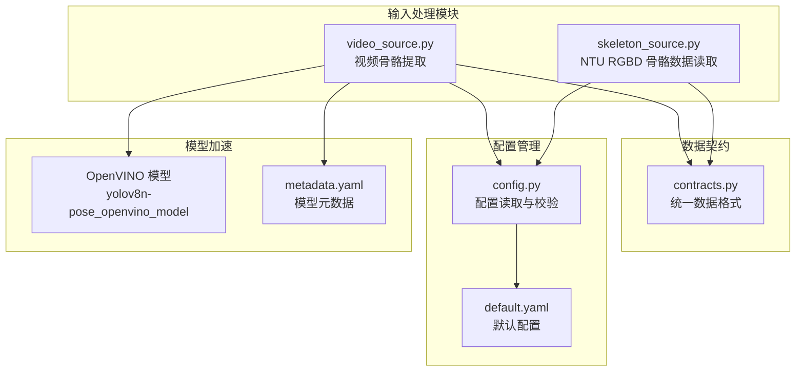
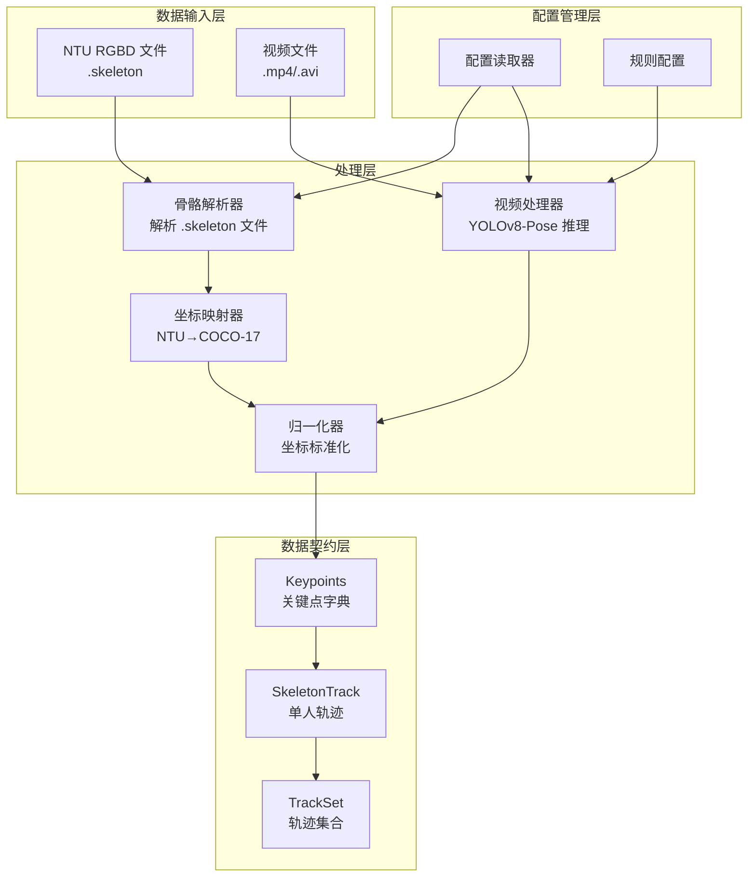
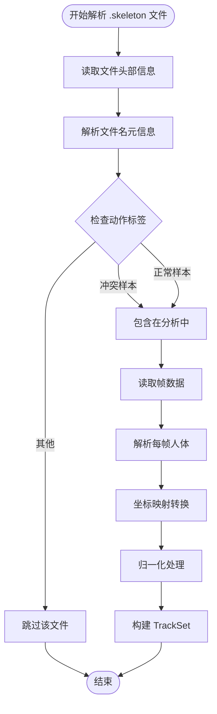
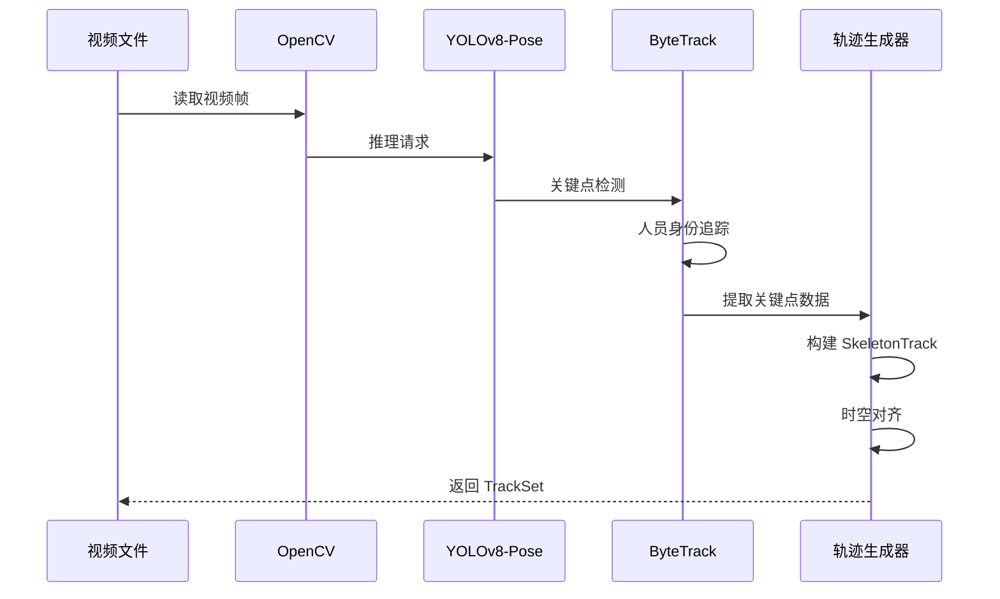
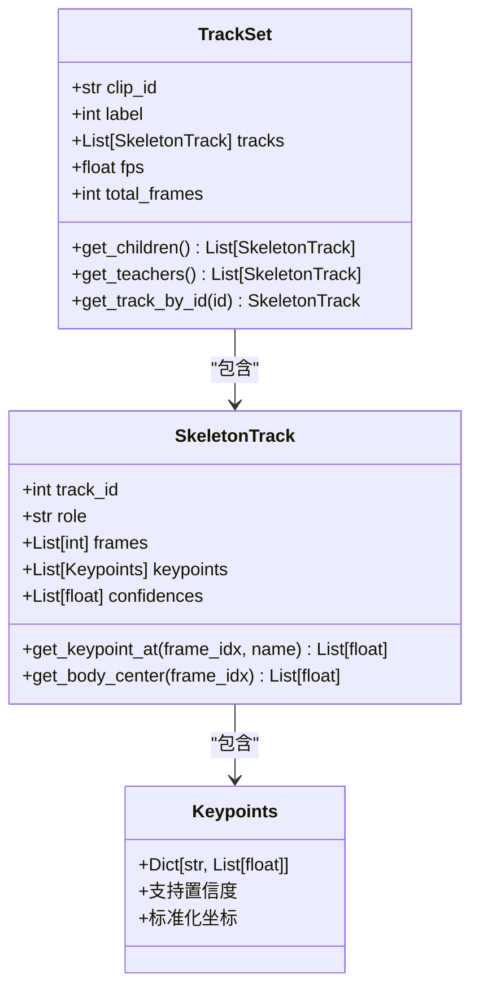
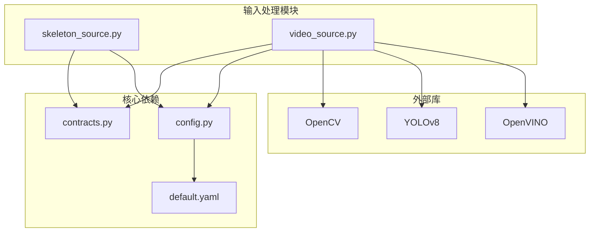

# 输入处理模块

<cite>
**本文引用的文件**
- [skeleton_source.py](file://src/fightguard/inputs/skeleton_source.py)
- [video_source.py](file://src/fightguard/inputs/video_source.py)
- [contracts.py](file://src/fightguard/contracts.py)
- [config.py](file://src/fightguard/config.py)
- [default.yaml](file://configs/default.yaml)
- [metadata.yaml](file://yolov8n-pose_openvino_model/metadata.yaml)
- [OpenVINO可以加速轻薄本电脑YOLOv8的推理.md](file://OpenVINO可以加速轻薄本电脑YOLOv8的推理.md)
- [debug_single_video.py](file://scripts/debug_single_video.py)
- [test_skeleton.py](file://test_skeleton.py)
</cite>

## 目录
1. [简介](#简介)
2. [项目结构](#项目结构)
3. [核心组件](#核心组件)
4. [架构概览](#架构概览)
5. [详细组件分析](#详细组件分析)
6. [依赖分析](#依赖分析)
7. [性能考虑](#性能考虑)
8. [故障排除指南](#故障排除指南)
9. [结论](#结论)
10. [附录](#附录)

## 简介
输入处理模块是 KidGuard 幼儿园冲突风险管理分析系统的核心数据入口，负责两类输入数据的统一处理：
- **骨骼数据读取**：解析 NTU RGBD 数据集的 .skeleton 文件，提取 25 点 3D 坐标并映射到 COCO-17 标准格式
- **视频数据处理**：使用 YOLOv8-Pose 模型（支持 OpenVINO 硬件加速）逐帧提取人体关键点，生成标准化的轨迹数据

该模块实现了从原始数据到统一数据契约的完整转换链路，为后续的冲突检测和风险评估提供高质量的输入数据。

## 项目结构
输入处理模块位于 `src/fightguard/inputs/` 目录下，包含两个核心文件：

**图表来源**
- [skeleton_source.py:1-331](file://src/fightguard/inputs/skeleton_source.py#L1-L331)
- [video_source.py:1-193](file://src/fightguard/inputs/video_source.py#L1-L193)
- [contracts.py:1-241](file://src/fightguard/contracts.py#L1-L241)
- [config.py:1-120](file://src/fightguard/config.py#L1-L120)
- [default.yaml:1-62](file://configs/default.yaml#L1-L62)
- [metadata.yaml:1-27](file://yolov8n-pose_openvino_model/metadata.yaml#L1-L27)

**章节来源**
- [skeleton_source.py:1-331](file://src/fightguard/inputs/skeleton_source.py#L1-L331)
- [video_source.py:1-193](file://src/fightguard/inputs/video_source.py#L1-L193)
- [contracts.py:1-241](file://src/fightguard/contracts.py#L1-L241)
- [config.py:1-120](file://src/fightguard/config.py#L1-L120)
- [default.yaml:1-62](file://configs/default.yaml#L1-L62)
- [metadata.yaml:1-27](file://yolov8n-pose_openvino_model/metadata.yaml#L1-L27)

## 核心组件
输入处理模块包含以下核心组件：

### 1. 骨骼数据读取器
- **功能**：解析 NTU RGBD .skeleton 文件，提取 25 点 3D 坐标
- **映射**：将 NTU 25 点坐标映射到 COCO-17 标准格式
- **标签处理**：从文件名解析动作类别标签，支持冲突/正常样本分类
- **数据标准化**：执行 min-max 归一化，统一坐标体系

### 2. 视频数据处理器
- **功能**：使用 YOLOv8-Pose 模型逐帧提取人体关键点
- **OpenVINO 集成**：支持硬件加速推理，显著提升处理速度
- **轨迹生成**：将关键点数据组织为 SkeletonTrack 和 TrackSet 格式
- **时空对齐**：确保所有轨迹严格对应视频物理帧序

### 3. 数据契约系统
- **统一格式**：定义 Keypoints、SkeletonTrack、TrackSet 等标准数据结构
- **COCO-17 标准**：使用 17 个关键点的标准命名，确保跨模块兼容性
- **类型安全**：通过 dataclass 和类型注解确保数据完整性

**章节来源**
- [skeleton_source.py:32-57](file://src/fightguard/inputs/skeleton_source.py#L32-L57)
- [video_source.py:27-49](file://src/fightguard/inputs/video_source.py#L27-L49)
- [contracts.py:18-47](file://src/fightguard/contracts.py#L18-L47)

## 架构概览
输入处理模块采用分层架构设计，确保数据处理的模块化和可维护性：

**图表来源**
- [skeleton_source.py:64-90](file://src/fightguard/inputs/skeleton_source.py#L64-L90)
- [video_source.py:57-62](file://src/fightguard/inputs/video_source.py#L57-L62)
- [contracts.py:96-171](file://src/fightguard/contracts.py#L96-L171)
- [config.py:32-82](file://src/fightguard/config.py#L32-L82)

## 详细组件分析

### 骨骼数据读取组件分析

#### 文件名解析机制
组件能够从 NTU .skeleton 文件名中提取完整的元信息：
- **格式**：S001C001P001R001A049.skeleton
- **字段**：场景(setup)、摄像机(camera)、受试者(subject)、重复(repeat)、动作类别(action_id)
- **验证**：提供完整的错误处理和格式验证机制

#### NTU 到 COCO-17 坐标映射
实现精确的坐标转换，支持：
- **一对一映射**：特定 NTU 关节点到 COCO-17 关键点
- **近似映射**：眼部和耳部点的近似处理
- **坐标转换**：从 3D 世界坐标转换为 2D 归一化坐标

#### 数据质量控制
- **缺失值处理**：对无效坐标（0.0, 0.0）标记为缺失
- **置信度管理**：保留并透传置信度信息
- **范围验证**：确保坐标在合理范围内

**图表来源**
- [skeleton_source.py:211-274](file://src/fightguard/inputs/skeleton_source.py#L211-L274)
- [skeleton_source.py:120-171](file://src/fightguard/inputs/skeleton_source.py#L120-L171)

**章节来源**
- [skeleton_source.py:64-114](file://src/fightguard/inputs/skeleton_source.py#L64-L114)
- [skeleton_source.py:120-204](file://src/fightguard/inputs/skeleton_source.py#L120-L204)
- [skeleton_source.py:211-274](file://src/fightguard/inputs/skeleton_source.py#L211-L274)

### 视频数据处理组件分析

#### YOLOv8-Pose 模型集成
组件支持多种部署方式：
- **CPU 推理**：使用轻量级 yolov8n-pose.pt 模型
- **OpenVINO 加速**：自动检测并使用硬件加速引擎
- **模型缓存**：避免重复加载，提升性能

#### OpenVINO 硬件加速集成
通过简单的文件夹替换实现硬件加速：
- **模型导出**：将 PyTorch 模型导出为 OpenVINO 格式
- **自动检测**：Ultralytics YOLO 自动识别并使用 Intel GPU/NPU
- **性能提升**：推理速度提升约 2 倍

#### 关键点提取与轨迹生成
实现完整的视频处理流水线：
- **逐帧检测**：使用 ByteTrack 追踪器维持人员身份
- **坐标提取**：提取 17 个 COCO-17 关键点坐标
- **时空对齐**：确保轨迹与视频帧严格对齐

**图表来源**
- [video_source.py:80-160](file://src/fightguard/inputs/video_source.py#L80-L160)
- [video_source.py:185-192](file://src/fightguard/inputs/video_source.py#L185-L192)

**章节来源**
- [video_source.py:41-49](file://src/fightguard/inputs/video_source.py#L41-L49)
- [video_source.py:57-192](file://src/fightguard/inputs/video_source.py#L57-L192)

### 数据契约系统分析

#### 统一数据格式
定义了完整的数据契约体系：
- **Keypoints**：单帧单人的关键点字典，支持置信度
- **SkeletonTrack**：单人的多帧轨迹，包含帧索引和关键点序列
- **TrackSet**：片段内所有人的轨迹集合，包含元数据和统计信息

#### COCO-17 标准化
确保跨模块的数据一致性：
- **标准命名**：17 个关键点的官方命名
- **索引映射**：提供名称到索引的快速查找
- **类型安全**：通过类型注解确保数据完整性

**图表来源**
- [contracts.py:56-90](file://src/fightguard/contracts.py#L56-L90)
- [contracts.py:96-148](file://src/fightguard/contracts.py#L96-L148)
- [contracts.py:154-186](file://src/fightguard/contracts.py#L154-L186)

**章节来源**
- [contracts.py:18-47](file://src/fightguard/contracts.py#L18-L47)
- [contracts.py:56-148](file://src/fightguard/contracts.py#L56-L148)
- [contracts.py:154-186](file://src/fightguard/contracts.py#L154-L186)

## 依赖分析
输入处理模块的依赖关系清晰明确，遵循单一职责原则：

**图表来源**
- [skeleton_source.py:22-29](file://src/fightguard/inputs/skeleton_source.py#L22-L29)
- [video_source.py:14-25](file://src/fightguard/inputs/video_source.py#L14-L25)
- [config.py:15-17](file://src/fightguard/config.py#L15-L17)

**章节来源**
- [skeleton_source.py:18-29](file://src/fightguard/inputs/skeleton_source.py#L18-L29)
- [video_source.py:14-25](file://src/fightguard/inputs/video_source.py#L14-L25)
- [config.py:15-17](file://src/fightguard/config.py#L15-L17)

## 性能考虑

### OpenVINO 硬件加速策略
- **自动检测**：Ultralytics YOLO 自动识别并使用 OpenVINO 引擎
- **硬件利用**：充分利用 Intel 集成显卡和 NPU 资源
- **性能提升**：推理速度提升约 2 倍，显著减少批处理时间

### 模型优化技术
- **ByteTrack 追踪器**：对低分检测框更鲁棒，适合复杂场景
- **置信度阈值调整**：conf=0.2 降低检测阈值，提升追踪稳定性
- **模型缓存**：避免重复加载，提升内存使用效率

### 内存管理
- **渐进式处理**：按帧处理，避免一次性加载整个视频
- **数据对齐**：确保轨迹与帧严格对齐，减少内存碎片
- **类型优化**：使用 dataclass 减少内存占用

**章节来源**
- [OpenVINO可以加速轻薄本电脑YOLOv8的推理.md:36-46](file://OpenVINO可以加速轻薄本电脑YOLOv8的推理.md#L36-L46)
- [video_source.py:115-118](file://src/fightguard/inputs/video_source.py#L115-L118)
- [video_source.py:28-49](file://src/fightguard/inputs/video_source.py#L28-L49)

## 故障排除指南

### 常见问题诊断
- **模型加载失败**：检查 OpenVINO 是否正确安装和配置
- **视频读取错误**：验证视频文件路径和格式支持
- **关键点提取失败**：检查摄像头或视频源连接状态
- **数据转换错误**：验证输入数据格式和坐标范围

### 调试工具使用
- **单点爆破诊断**：使用 debug_single_video.py 逐帧分析问题
- **配置重载**：通过 reload_config() 实时应用新配置参数
- **日志输出**：利用详细的错误信息定位问题根源

### 性能优化建议
- **硬件加速**：确保 OpenVINO 正确配置，充分利用硬件资源
- **批处理优化**：合理设置 max_frames 参数，平衡精度和性能
- **内存管理**：及时释放不再使用的数据，避免内存泄漏

**章节来源**
- [debug_single_video.py:18-81](file://scripts/debug_single_video.py#L18-L81)
- [config.py:85-92](file://src/fightguard/config.py#L85-L92)

## 结论
输入处理模块通过精心设计的架构和严格的实现规范，成功实现了从多种数据源到统一数据契约的转换。模块具有以下优势：

1. **模块化设计**：清晰分离骨骼数据和视频数据的处理逻辑
2. **标准化接口**：通过 contracts.py 确保跨模块数据一致性
3. **性能优化**：集成 OpenVINO 硬件加速，显著提升处理效率
4. **错误处理**：完善的异常处理和调试支持
5. **可扩展性**：灵活的配置系统支持参数调优

该模块为 KidGuard 系统提供了稳定可靠的数据输入基础，为后续的冲突检测和风险评估奠定了坚实的数据基础。

## 附录

### API 接口说明

#### process_video_to_trackset() 核心函数
- **功能**：读取视频文件，使用 YOLOv8-Pose 提取骨骼关键点，返回标准化的 TrackSet
- **参数**：
  - `video_path`: 视频文件路径
  - `label`: 视频标签（1=冲突，0=正常，-1=未标注）
  - `cfg`: 配置字典（可选）
  - `max_frames`: 最大处理帧数（调试用）
- **返回值**：TrackSet 对象，若失败返回 None
- **使用示例**：参考 test_skeleton.py 中的演示代码

#### load_skeleton_file() 骨骼数据读取
- **功能**：读取单个 .skeleton 文件，返回 TrackSet 对象
- **参数**：`filepath`: .skeleton 文件完整路径，`cfg`: 配置字典
- **返回值**：TrackSet 对象，不在评测范围返回 None

#### load_dataset() 批量数据加载
- **功能**：批量读取目录下的所有 .skeleton 文件
- **参数**：`data_dirs`: 目录路径列表，`cfg`: 配置字典，`max_clips`: 最大读取数量
- **返回值**：TrackSet 列表（已过滤无效样本）

### 数据质量检查清单
- **坐标有效性**：检查关键点坐标是否在合理范围内
- **置信度一致性**：验证置信度信息的完整性
- **轨迹连续性**：确保轨迹帧序列的连续性和完整性
- **标签准确性**：验证动作类别标签的正确性

### 最佳实践建议
- **配置管理**：统一通过 config.py 访问配置参数
- **错误处理**：实现完善的异常捕获和错误恢复机制
- **性能监控**：定期监控处理性能，及时发现瓶颈
- **数据验证**：建立数据质量检查机制，确保输入数据的可靠性