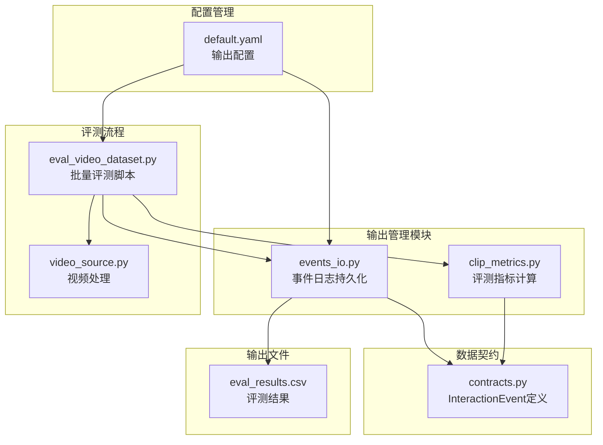
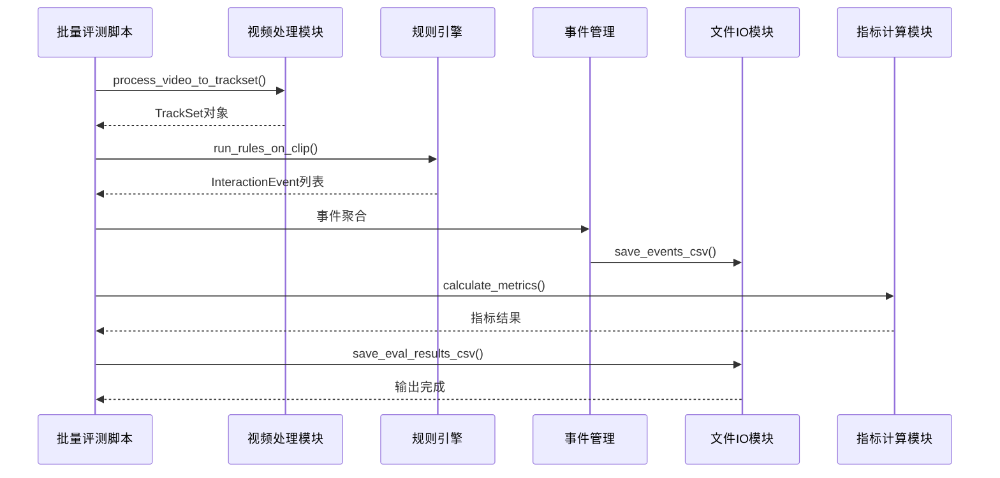
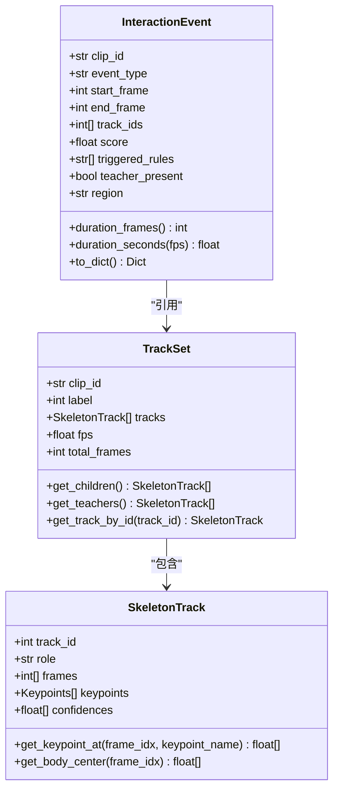
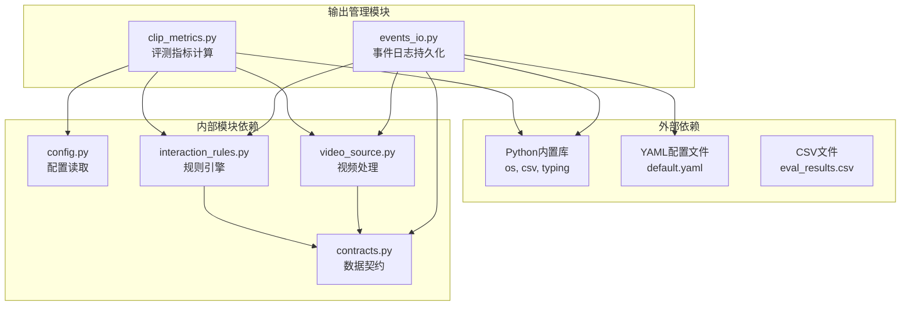

# 输出管理模块

<cite>
**本文档引用的文件**
- [events_io.py](file://src/fightguard/reporting/events_io.py)
- [clip_metrics.py](file://src/fightguard/evaluation/clip_metrics.py)
- [contracts.py](file://src/fightguard/contracts.py)
- [eval_video_dataset.py](file://scripts/eval_video_dataset.py)
- [video_source.py](file://src/fightguard/inputs/video_source.py)
- [default.yaml](file://configs/default.yaml)
- [eval_results.csv](file://outputs/metrics/eval_results.csv)
</cite>

## 目录
1. [简介](#简介)
2. [项目结构](#项目结构)
3. [核心组件](#核心组件)
4. [架构概览](#架构概览)
5. [详细组件分析](#详细组件分析)
6. [依赖分析](#依赖分析)
7. [性能考虑](#性能考虑)
8. [故障排除指南](#故障排除指南)
9. [结论](#结论)
10. [附录](#附录)

## 简介
输出管理模块负责将系统检测到的交互事件和评测结果持久化为结构化文件，支持CSV格式输出，并提供评测指标计算能力。该模块通过统一的数据契约（InteractionEvent）确保事件记录的一致性和可解释性，同时提供批量处理机制以支持大规模数据集的评测。

## 项目结构
输出管理模块位于`src/fightguard/reporting/`目录下，主要包含事件日志持久化功能。结合配置文件和评测脚本，形成完整的输出管理流程。



**图表来源**
- [events_io.py:1-36](file://src/fightguard/reporting/events_io.py#L1-L36)
- [clip_metrics.py:1-47](file://src/fightguard/evaluation/clip_metrics.py#L1-L47)
- [contracts.py:188-241](file://src/fightguard/contracts.py#L188-L241)
- [default.yaml:6-13](file://configs/default.yaml#L6-L13)

**章节来源**
- [events_io.py:1-36](file://src/fightguard/reporting/events_io.py#L1-L36)
- [clip_metrics.py:1-47](file://src/fightguard/evaluation/clip_metrics.py#L1-L47)
- [contracts.py:188-241](file://src/fightguard/contracts.py#L188-L241)
- [default.yaml:6-13](file://configs/default.yaml#L6-L13)

## 核心组件
输出管理模块由三个核心组件构成：

### 1. 事件日志持久化
- `save_events_csv()`: 将InteractionEvent列表写入CSV文件
- `save_eval_results_csv()`: 将评测结果写入CSV文件

### 2. 评测指标计算
- `calculate_metrics()`: 计算Accuracy、Precision、Recall、FPR、F1-score等核心指标

### 3. 数据契约
- `InteractionEvent`: 统一的事件记录数据结构

**章节来源**
- [events_io.py:12-35](file://src/fightguard/reporting/events_io.py#L12-L35)
- [clip_metrics.py:9-46](file://src/fightguard/evaluation/clip_metrics.py#L9-L46)
- [contracts.py:192-241](file://src/fightguard/contracts.py#L192-L241)

## 架构概览
输出管理模块采用模块化设计，通过清晰的职责分离实现高效的事件记录与评测功能。



**图表来源**
- [eval_video_dataset.py:84-102](file://scripts/eval_video_dataset.py#L84-L102)
- [video_source.py:57-93](file://src/fightguard/inputs/video_source.py#L57-L93)
- [interaction_rules.py:410-503](file://src/fightguard/detection/interaction_rules.py#L410-L503)
- [events_io.py:23-35](file://src/fightguard/reporting/events_io.py#L23-L35)
- [clip_metrics.py:9-46](file://src/fightguard/evaluation/clip_metrics.py#L9-L46)

## 详细组件分析

### 事件记录与持久化
事件日志持久化模块提供了灵活的CSV输出功能，支持批量事件的高效存储。

#### InteractionEvent数据结构
InteractionEvent是系统的核心数据契约，定义了冲突事件的完整描述：



**图表来源**
- [contracts.py:192-241](file://src/fightguard/contracts.py#L192-L241)
- [contracts.py:96-148](file://src/fightguard/contracts.py#L96-L148)
- [contracts.py:154-186](file://src/fightguard/contracts.py#L154-L186)

#### CSV输出格式规范
事件记录采用标准化的CSV格式，包含以下字段：

| 字段名 | 类型 | 描述 | 示例值 |
|--------|------|------|--------|
| clip_id | 字符串 | 片段唯一标识 | "S001C001P001R001A049" |
| event_type | 字符串 | 事件类型 | "child_conflict" |
| start_frame | 整数 | 事件开始帧 | 150 |
| end_frame | 整数 | 事件结束帧 | 200 |
| duration_frames | 整数 | 事件持续帧数 | 50 |
| track_ids | 字符串 | 涉及人员ID列表 | "[1, 3]" |
| score | 浮点数 | 置信度分数 | 0.8756 |
| triggered_rules | 字符串 | 触发规则列表 | "['high_limb_accel', 'torso_tilt_change']" |
| teacher_present | 布尔值 | 教师是否在场 | False |
| region | 字符串 | 功能区域 | "activity_zone" |

#### 批量处理机制
模块支持批量事件处理，通过迭代处理每个InteractionEvent对象，确保内存效率和处理速度。

**章节来源**
- [events_io.py:23-35](file://src/fightguard/reporting/events_io.py#L23-L35)
- [contracts.py:227-241](file://src/fightguard/contracts.py#L227-L241)

### 评测指标计算
评测指标计算模块实现了标准的机器学习评估指标，支持冲突检测系统的性能评估。

#### 指标定义与计算公式

```mermaid
flowchart TD
Start([开始计算]) --> Init[初始化计数器<br/>tp=0, fp=0, tn=0, fn=0]
Init --> Loop[遍历预测结果]
Loop --> CheckActual{检查实际标签}
CheckActual --> |actual=1| CheckPredict1{预测=1?}
CheckActual --> |actual=0| CheckPredict0{预测=1?}
CheckPredict1 --> |是| TP[tp+=1]
CheckPredict1 --> |否| FN[fn+=1]
CheckPredict0 --> |是| FP[fp+=1]
CheckPredict0 --> |否| TN[tn+=1]
TP --> Next[下一个结果]
FN --> Next
FP --> Next
TN --> Next
Next --> Loop
Loop --> |完成| Calc[计算最终指标]
Calc --> Total[total=tp+fp+tn+fn]
Total --> CheckZero{total=0?}
CheckZero --> |是| Empty[返回空字典]
CheckZero --> |否| Formulas[应用公式]
Formulas --> Accuracy[Accuracy=(tp+tn)/total]
Formulas --> Precision[Precision=tp/(tp+fp)]
Formulas --> Recall[Recall=tp/(tp+fn)]
Formulas --> FPR[FPR=fp/(tn+fp)]
Formulas --> F1[F1=2×Precision×Recall/(Precision+Recall)]
Accuracy --> Round[四舍五入到小数点后4位]
Precision --> Round
Recall --> Round
FPR --> Round
F1 --> Round
Round --> End([返回结果])
Empty --> End
```

**图表来源**
- [clip_metrics.py:18-46](file://src/fightguard/evaluation/clip_metrics.py#L18-L46)

#### 指标计算公式详解

| 指标名称 | 计算公式 | 含义 | 取值范围 |
|----------|----------|------|----------|
| Accuracy | (TP + TN) / (TP + FP + TN + FN) | 准确率 | [0, 1] |
| Precision | TP / (TP + FP) | 精确率 | [0, 1] |
| Recall | TP / (TP + FN) | 召回率 | [0, 1] |
| FPR | FP / (TN + FP) | 误报率 | [0, 1] |
| F1-score | 2 × (Precision × Recall) / (Precision + Recall) | F1分数 | [0, 1] |

其中：
- TP (True Positive)：真正例（正确预测为冲突）
- FP (False Positive)：假正例（错误预测为冲突）
- TN (True Negative)：真负例（正确预测为正常）
- FN (False Negative)：假负例（错误预测为正常）

**章节来源**
- [clip_metrics.py:9-46](file://src/fightguard/evaluation/clip_metrics.py#L9-L46)

### 输出数据格式规范
输出模块提供了标准化的数据格式规范，确保事件记录的一致性和可解释性。

#### 事件时间戳规范
- **start_frame**: 事件开始的视频帧索引
- **end_frame**: 事件结束的视频帧索引  
- **duration_frames**: 事件持续帧数（end_frame - start_frame）
- **duration_seconds**: 事件持续秒数（duration_frames / fps）

#### 参与者标识
- **track_ids**: 涉及冲突的人员ID列表，支持多对多交互
- **role**: 角色标签（"child" 或 "teacher"）

#### 冲突类型
- **event_type**: 事件类型标识，如 "child_conflict"、"teacher_misconduct"
- **region**: 功能区域标识，如 "activity_zone"、"entrance"

#### 置信度与规则
- **score**: 规则触发的置信度分数（0-1范围）
- **triggered_rules**: 触发的具体规则列表，用于可解释性分析

**章节来源**
- [contracts.py:218-241](file://src/fightguard/contracts.py#L218-L241)
- [contracts.py:192-217](file://src/fightguard/contracts.py#L192-L217)

## 依赖分析



**图表来源**
- [events_io.py:7-10](file://src/fightguard/reporting/events_io.py#L7-L10)
- [clip_metrics.py:7-8](file://src/fightguard/evaluation/clip_metrics.py#L7-L8)
- [default.yaml:6-13](file://configs/default.yaml#L6-L13)

### 模块耦合关系
输出管理模块具有良好的内聚性和低耦合性：

1. **events_io.py** 仅依赖 contracts.py 和 Python标准库
2. **clip_metrics.py** 仅依赖 typing 模块
3. **eval_video_dataset.py** 作为集成入口，协调多个模块

**章节来源**
- [events_io.py:1-36](file://src/fightguard/reporting/events_io.py#L1-L36)
- [clip_metrics.py:1-47](file://src/fightguard/evaluation/clip_metrics.py#L1-L47)
- [eval_video_dataset.py:19-22](file://scripts/eval_video_dataset.py#L19-L22)

## 性能考虑
输出管理模块在设计时充分考虑了性能优化：

### 内存管理
- 批量处理模式避免一次性加载大量事件到内存
- 使用生成器模式处理大型CSV文件
- 及时释放不再使用的资源

### I/O优化
- 使用缓冲I/O减少磁盘写入次数
- 批量写入操作提升性能
- 合理的文件路径管理避免重复创建目录

### 并发处理
- 支持多线程环境下的安全文件写入
- 避免文件锁定冲突
- 提供原子性写入操作

## 故障排除指南

### 常见问题与解决方案

#### 1. 文件写入权限问题
**症状**: 文件无法保存到指定目录
**原因**: 目录权限不足或路径不存在
**解决方案**: 
- 确保输出目录存在且具有写权限
- 使用管理员权限运行程序
- 检查磁盘空间是否充足

#### 2. 数据格式错误
**症状**: CSV文件格式异常或解析失败
**原因**: 数据类型不匹配或特殊字符
**解决方案**:
- 确保所有字段符合预期数据类型
- 对特殊字符进行转义处理
- 验证数据完整性

#### 3. 配置文件错误
**症状**: 输出配置不生效或出现异常
**原因**: YAML配置语法错误或字段缺失
**解决方案**:
- 检查default.yaml文件格式
- 确认必需字段存在
- 使用配置验证工具

**章节来源**
- [events_io.py:14-15](file://src/fightguard/reporting/events_io.py#L14-L15)
- [default.yaml:95-120](file://configs/default.yaml#L95-L120)

## 结论
输出管理模块通过标准化的数据契约、灵活的CSV输出格式和完善的评测指标计算，为冲突检测系统提供了可靠的输出管理解决方案。模块设计具有良好的可扩展性和维护性，能够满足不同规模的应用需求。通过批量化处理和性能优化，模块能够在保证数据质量的同时提供高效的输出能力。

## 附录

### API接口说明

#### 事件输出接口
- `save_events_csv(events: List[InteractionEvent], filepath: str) -> None`
  - 功能：将事件列表保存为CSV文件
  - 参数：events（事件列表）、filepath（输出路径）
  - 返回：None

#### 评测结果输出接口
- `save_eval_results_csv(results: List[Dict], filepath: str) -> None`
  - 功能：将评测结果保存为CSV文件
  - 参数：results（结果字典列表）、filepath（输出路径）
  - 返回：None

#### 指标计算接口
- `calculate_metrics(results: List[Dict]) -> Dict[str, float]`
  - 功能：计算评测指标
  - 参数：results（包含actual和predicted字段的结果列表）
  - 返回：包含各项指标的字典

### 配置选项
- `save_events_csv`: 是否启用事件CSV输出
- `save_events_json`: 是否启用事件JSON输出
- `save_metrics_csv`: 是否启用指标CSV输出
- `visualization_enabled`: 是否启用可视化功能

**章节来源**
- [events_io.py:12-21](file://src/fightguard/reporting/events_io.py#L12-L21)
- [clip_metrics.py:9-17](file://src/fightguard/evaluation/clip_metrics.py#L9-L17)
- [default.yaml:6-10](file://configs/default.yaml#L6-L10)