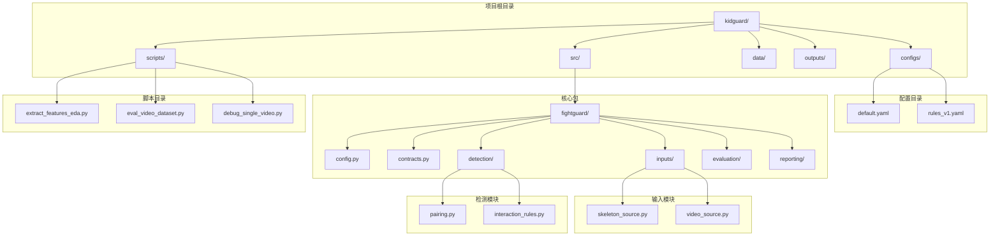
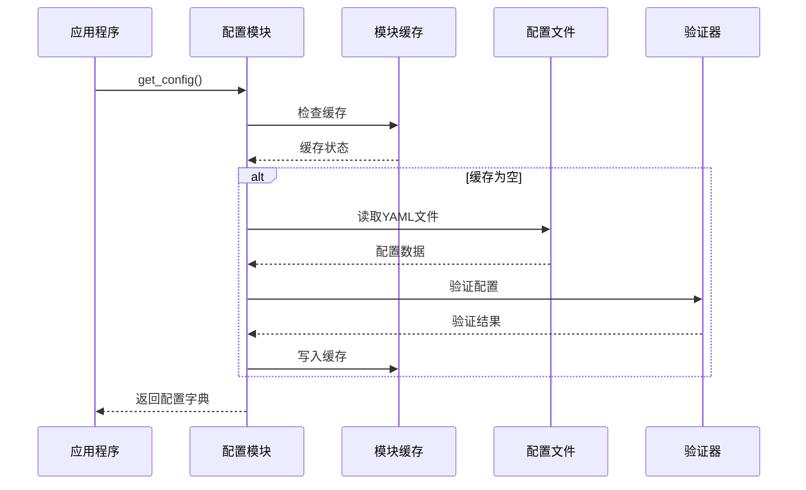
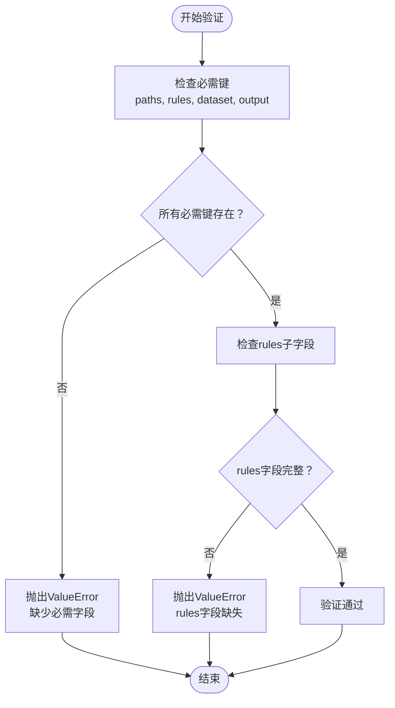
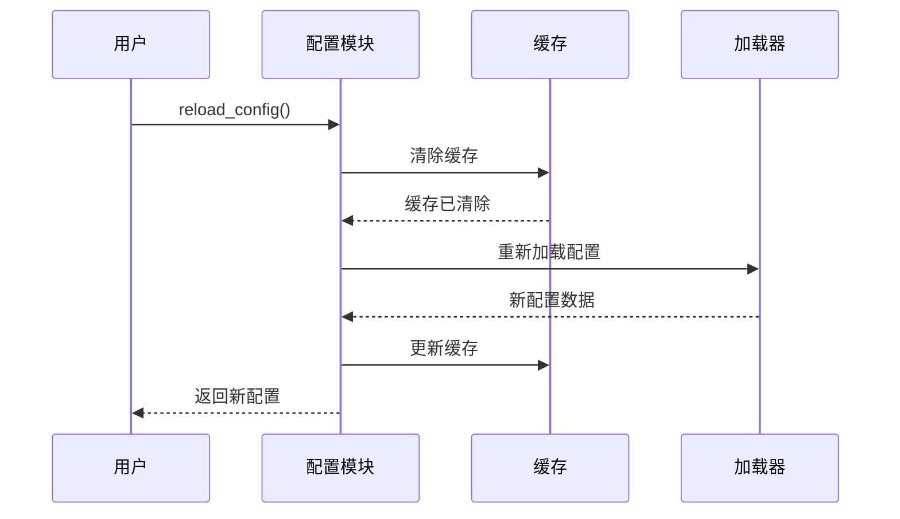
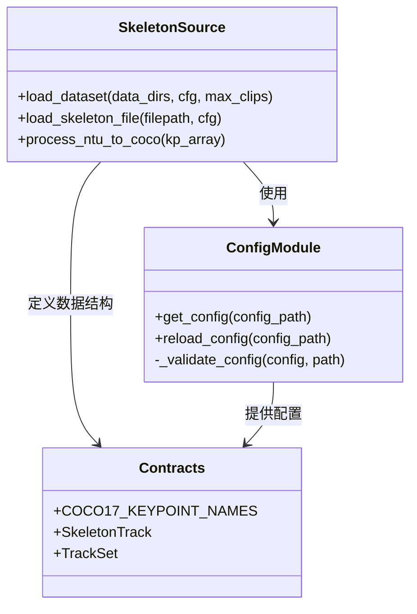
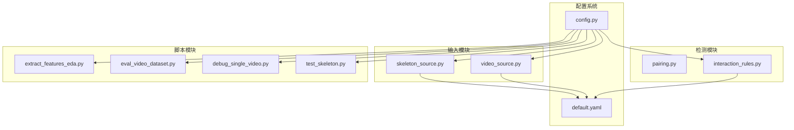

# 配置管理系统

<cite>
**本文档引用的文件**
- [default.yaml](file://configs/default.yaml)
- [rules_v1.yaml](file://configs/rules_v1.yaml)
- [config.py](file://src/fightguard/config.py)
- [README.md](file://README.md)
- [contracts.py](file://src/fightguard/contracts.py)
- [skeleton_source.py](file://src/fightguard/inputs/skeleton_source.py)
- [video_source.py](file://src/fightguard/inputs/video_source.py)
- [interaction_rules.py](file://src/fightguard/detection/interaction_rules.py)
- [extract_features_eda.py](file://scripts/extract_features_eda.py)
- [eval_video_dataset.py](file://scripts/eval_video_dataset.py)
- [debug_single_video.py](file://scripts/debug_single_video.py)
- [test_skeleton.py](file://test_skeleton.py)
</cite>

## 目录
1. [简介](#简介)
2. [项目结构](#项目结构)
3. [核心组件](#核心组件)
4. [架构概览](#架构概览)
5. [详细组件分析](#详细组件分析)
6. [依赖分析](#依赖分析)
7. [性能考虑](#性能考虑)
8. [故障排除指南](#故障排除指南)
9. [结论](#结论)
10. [附录](#附录)

## 简介

KidGuard 是一个基于计算机视觉的幼儿园冲突风险管理分析系统。该系统通过骨骼关键点空间几何关系构建规则库，实现对幼儿园场景下冲突行为的轻量化识别与风险管理分析。

配置管理系统是整个系统的核心基础设施，负责统一管理所有参数和阈值设置。本文档将深入解释配置文件的结构设计、参数组织方式、加载机制、验证机制以及动态更新功能。

## 项目结构

系统采用模块化的项目结构，配置管理位于 `configs/` 目录下，核心配置文件为 `default.yaml`：



**图表来源**
- [README.md:48-76](file://README.md#L48-L76)
- [default.yaml:1-62](file://configs/default.yaml#L1-L62)

**章节来源**
- [README.md:48-76](file://README.md#L48-L76)
- [default.yaml:1-62](file://configs/default.yaml#L1-L62)

## 核心组件

### 配置文件结构设计

配置系统采用分层结构设计，主要包含以下四个核心部分：

#### 1. paths 部分
负责定义系统运行所需的各类路径配置：
- `output_events_dir`: 事件输出目录
- `output_metrics_dir`: 指标输出目录  
- `skeleton_data_dir`: 骨骼数据目录
- `video_data_dir`: 视频数据目录

#### 2. rules 部分
包含所有检测规则相关的阈值和参数：
- `alert_threshold`: 报警阈值
- `conflict_duration_frames`: 冲突持续帧数
- `proximity_threshold`: 接近阈值
- `proximity_window_frames`: 接近窗口帧数
- `smoothing_window_frames`: 平滑窗口帧数
- `teacher_presence_threshold`: 教师存在阈值
- `velocity_threshold`: 速度阈值
- `wrist_intrusion_threshold`: 腕部侵入阈值
- `tau_c`: 置信度抑制阈值
- `tracker`: ByteTrack 追踪器配置文件
- `tracker_conf`: 追踪器置信度

#### 3. dataset 部分
定义数据集的动作分类：
- `ntu_conflict_actions`: NTU 冲突动作列表
- `ntu_normal_actions`: NTU 正常动作列表

#### 4. output 部分
控制输出行为：
- `save_events_csv`: 是否保存事件CSV
- `save_events_json`: 是否保存事件JSON
- `save_metrics_csv`: 是否保存指标CSV
- `visualization_enabled`: 是否启用可视化

**章节来源**
- [default.yaml:1-62](file://configs/default.yaml#L1-L62)

## 架构概览

配置管理系统采用单例模式和模块级缓存机制，确保配置的高效访问和一致性：



**图表来源**
- [config.py:32-82](file://src/fightguard/config.py#L32-L82)

### 配置加载机制

配置加载机制具有以下特点：

1. **模块级缓存**: 使用 `_config_cache` 全局变量存储已加载的配置，避免重复读取
2. **路径解析**: 自动解析相对路径到绝对路径，统一路径分隔符
3. **文件检查**: 在读取前检查文件是否存在
4. **格式验证**: 确保配置文件为有效的字典结构
5. **字段验证**: 检查必需字段的存在性

**章节来源**
- [config.py:19-82](file://src/fightguard/config.py#L19-L82)

## 详细组件分析

### 配置读取模块 (config.py)

配置读取模块是整个系统的核心，提供了统一的配置访问接口：

#### 主要功能

1. **配置获取**: `get_config()` 函数提供全局配置访问
2. **缓存管理**: 实现模块级缓存，提高访问性能
3. **动态更新**: `reload_config()` 支持热重载配置
4. **验证机制**: 确保配置的完整性和正确性

#### 配置结构验证

系统实现了严格的配置验证机制：



**图表来源**
- [config.py:95-120](file://src/fightguard/config.py#L95-L120)

#### 动态配置更新

系统支持在运行时动态更新配置：



**图表来源**
- [config.py:85-92](file://src/fightguard/config.py#L85-L92)

**章节来源**
- [config.py:32-120](file://src/fightguard/config.py#L32-L120)

### 配置使用示例

#### 骨骼数据处理中的配置使用

在骨骼数据处理模块中，配置通过 `get_config()` 函数获取：



**图表来源**
- [skeleton_source.py:211-317](file://src/fightguard/inputs/skeleton_source.py#L211-L317)
- [config.py:32-82](file://src/fightguard/config.py#L32-L82)

#### 规则引擎中的配置集成

在交互规则检测中，配置被广泛使用：

**章节来源**
- [skeleton_source.py:211-317](file://src/fightguard/inputs/skeleton_source.py#L211-L317)
- [interaction_rules.py:410-452](file://src/fightguard/detection/interaction_rules.py#L410-L452)

### 配置验证机制

系统实现了多层次的配置验证机制：

#### 1. 必需字段检查
- 检查顶层必需键：`paths`、`rules`、`dataset`、`output`
- 检查 `rules` 子字段的完整性

#### 2. 数据类型验证
- 确保配置文件为有效的 YAML 格式
- 验证配置数据结构为字典类型

#### 3. 错误提示设计
- 提供清晰的错误信息，指导用户修复配置
- 包含具体的字段缺失信息和修复建议

**章节来源**
- [config.py:95-120](file://src/fightguard/config.py#L95-L120)

## 依赖分析

配置系统与其他模块的依赖关系如下：



**图表来源**
- [config.py:25-29](file://src/fightguard/config.py#L25-L29)
- [skeleton_source.py:29](file://src/fightguard/inputs/skeleton_source.py#L29)

### 依赖关系分析

1. **单向依赖**: 所有模块都依赖配置模块，但配置模块不依赖其他模块
2. **松耦合设计**: 配置模块提供统一接口，其他模块通过接口访问配置
3. **无循环依赖**: 依赖关系形成清晰的层次结构

**章节来源**
- [config.py:15-29](file://src/fightguard/config.py#L15-L29)

## 性能考虑

### 缓存策略

配置系统采用了高效的缓存策略：

1. **模块级缓存**: 使用全局变量存储配置，避免重复文件I/O操作
2. **懒加载机制**: 首次访问时才读取配置文件
3. **内存效率**: 缓存整个配置字典，减少多次查询的开销

### 路径解析优化

1. **统一路径格式**: 使用 `os.path.normpath()` 统一路径分隔符
2. **相对路径解析**: 自动解析相对路径到绝对路径
3. **文件存在性检查**: 在读取前检查文件是否存在，避免不必要的I/O操作

### 验证性能

1. **一次性验证**: 配置验证只在首次加载时执行
2. **快速失败**: 发现错误立即抛出异常，避免后续无效操作
3. **增量更新**: `reload_config()` 支持局部更新，不影响其他模块

## 故障排除指南

### 常见配置错误

#### 1. 配置文件缺失
**症状**: `FileNotFoundError` 异常
**原因**: `configs/default.yaml` 文件不存在
**解决方案**: 
- 确认配置文件存在于正确路径
- 检查文件权限设置
- 验证文件路径的相对性

#### 2. 配置格式错误
**症状**: `ValueError` 异常，提示配置文件格式错误
**原因**: YAML 文件语法错误或结构不符合预期
**解决方案**:
- 使用 YAML 验证工具检查语法
- 确保配置文件为有效的字典结构
- 检查缩进和特殊字符

#### 3. 必需字段缺失
**症状**: `ValueError` 异常，提示缺少必需字段
**原因**: 配置文件缺少必要的顶级键
**解决方案**:
- 添加缺失的字段：`paths`、`rules`、`dataset`、`output`
- 确保 `rules` 子字段包含必需的阈值参数

### 动态更新注意事项

#### 1. 缓存清理
使用 `reload_config()` 后，系统会自动清理缓存并重新加载配置
**注意**: 确保在所有模块中使用相同的配置实例

#### 2. 参数覆盖时机
在运行时修改配置时，注意参数覆盖的时机和作用域
**建议**: 在处理数据之前应用参数覆盖，确保后续处理使用新配置

#### 3. 线程安全性
配置系统是线程安全的，但建议在应用启动时完成所有参数调整

**章节来源**
- [config.py:60-82](file://src/fightguard/config.py#L60-L82)
- [config.py:85-92](file://src/fightguard/config.py#L85-L92)

## 结论

配置管理系统为 KidGuard 系统提供了稳定、高效、可维护的参数管理基础设施。通过模块化的设计、严格的验证机制和灵活的动态更新功能，系统能够满足不同场景下的配置需求。

### 主要优势

1. **统一管理**: 所有参数集中在一个地方管理，避免分散配置
2. **类型安全**: 严格的配置验证确保参数的正确性
3. **性能优化**: 模块级缓存和懒加载机制提高系统性能
4. **动态更新**: 支持运行时配置调整，提高开发效率
5. **错误友好**: 清晰的错误信息帮助用户快速定位和解决问题

### 未来改进方向

1. **配置模板系统**: 支持配置模板和继承机制
2. **配置版本控制**: 跟踪配置变更历史
3. **配置加密**: 支持敏感配置的安全存储
4. **配置热备份**: 提供配置的自动备份和恢复机制

## 附录

### 配置最佳实践

#### 参数命名规范
1. 使用小写字母和下划线命名
2. 语义明确，避免缩写
3. 保持命名一致性
4. 使用复数形式表示列表参数

#### 阈值设置建议
1. **proximity_threshold**: 建议范围 0.3-0.7，根据场景调整
2. **alert_threshold**: 建议范围 0.2-0.5，平衡误报和漏报
3. **conflict_duration_frames**: 建议范围 5-15 帧，考虑帧率影响
4. **smoothing_window_frames**: 建议范围 3-7 帧，平滑噪声

#### 性能优化考虑
1. **缓存策略**: 合理使用模块级缓存，避免频繁文件I/O
2. **路径解析**: 预先解析和规范化路径，减少运行时开销
3. **验证时机**: 在应用启动时完成配置验证，运行时避免重复验证
4. **内存管理**: 控制配置大小，避免过度占用内存

#### 配置示例

**基本配置示例**:
```yaml
# 基础配置
paths:
  output_events_dir: outputs/events
  output_metrics_dir: outputs/metrics
  skeleton_data_dir: data/skeleton
  video_data_dir: data/video

rules:
  alert_threshold: 0.3
  proximity_threshold: 0.5
  velocity_threshold: 0.05
  conflict_duration_frames: 8
  smoothing_window_frames: 5

dataset:
  ntu_conflict_actions: [49, 50, 51]
  ntu_normal_actions: [52, 53, 54, 55, 56, 57, 58, 59, 60]

output:
  save_events_csv: true
  save_events_json: false
  save_metrics_csv: true
  visualization_enabled: false
```

**高级配置示例**:
```yaml
# 高级配置
rules:
  # 基础阈值
  alert_threshold: 0.3
  proximity_threshold: 0.5
  velocity_threshold: 0.05
  
  # 时间窗口参数
  proximity_window_frames: 5
  smoothing_window_frames: 5
  conflict_duration_frames: 8
  
  # 专业参数
  wrist_intrusion_threshold: 0.15
  teacher_presence_threshold: 0.5
  tau_c: 0.5
  
  # 追踪器配置
  tracker: "bytetrack.yaml"
  tracker_conf: 0.2

skeleton:
  keypoint_names:
    - nose
    - left_eye
    - right_eye
    - left_ear
    - right_ear
    - left_shoulder
    - right_shoulder
    - left_elbow
    - right_elbow
    - left_wrist
    - right_wrist
    - left_hip
    - right_hip
    - left_knee
    - right_knee
    - left_ankle
    - right_ankle
  standard: COCO-17

state_machine:
  enabled: false
  states: [NORMAL, APPROACHING, CONTACT, CONFLICT, RESOLVED]
  approach_frames: 5
  contact_frames: 3
  conflict_frames: 8
  resolve_frames: 10
```

**章节来源**
- [default.yaml:1-62](file://configs/default.yaml#L1-L62)