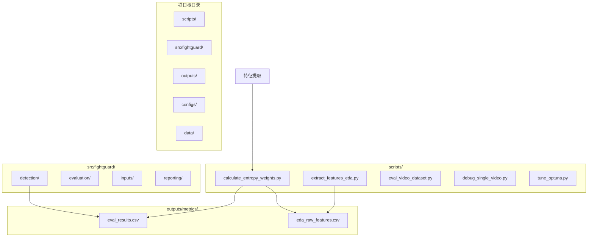
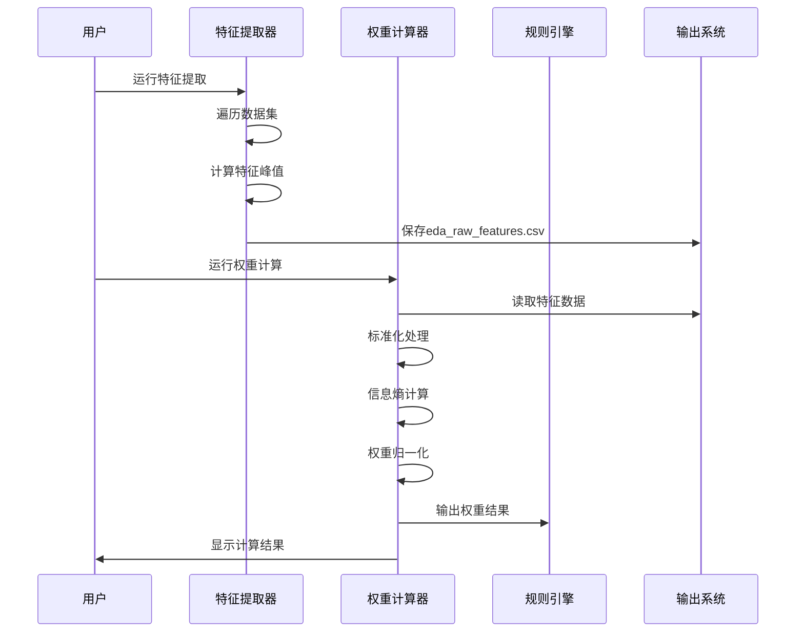
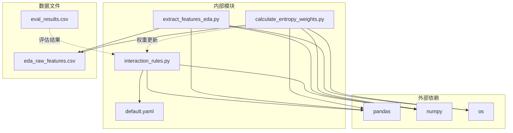

# 熵权法权重计算

<cite>
**本文档引用的文件**
- [calculate_entropy_weights.py](file://scripts/calculate_entropy_weights.py)
- [extract_features_eda.py](file://scripts/extract_features_eda.py)
- [interaction_rules.py](file://src/fightguard/detection/interaction_rules.py)
- [eval_results.csv](file://outputs/metrics/eval_results.csv)
- [eda_raw_features.csv](file://outputs/metrics/eda_raw_features.csv)
- [default.yaml](file://configs/default.yaml)
- [README.md](file://README.md)
</cite>

## 目录
1. [引言](#引言)
2. [项目结构](#项目结构)
3. [核心组件](#核心组件)
4. [架构概览](#架构概览)
5. [详细组件分析](#详细组件分析)
6. [依赖分析](#依赖分析)
7. [性能考虑](#性能考虑)
8. [故障排除指南](#故障排除指南)
9. [结论](#结论)
10. [附录](#附录)

## 引言

KidGuard是一个基于计算机视觉的幼儿园冲突风险管理分析系统。本文档专注于系统的熵权法权重计算模块，这是一个完全数据驱动的特征权重分配机制，旨在替代传统的经验参数设定，实现客观、科学的特征重要性评估。

该系统通过信息熵理论，从原始特征矩阵中客观推导出四大物理特征的权重，包括腕部线加速度、相对接近速度、肘部角加速度和躯干倾角变化。这些权重直接指导冲突检测规则的优化和冲突行为的识别。

## 项目结构

KidGuard项目采用模块化架构，熵权法权重计算系统位于scripts目录下，与核心检测逻辑分离，确保了系统的可维护性和可扩展性。



**图表来源**
- [calculate_entropy_weights.py:1-71](file://scripts/calculate_entropy_weights.py#L1-L71)
- [extract_features_eda.py:1-106](file://scripts/extract_features_eda.py#L1-L106)

**章节来源**
- [README.md:46-76](file://README.md#L46-L76)

## 核心组件

熵权法权重计算系统由三个核心组件构成：

### 1. 特征提取模块
负责从双人交互数据集中提取四个核心物理特征的峰值值，为熵权法提供原始数据。

### 2. 权重计算模块  
基于信息熵理论，使用数学公式客观计算特征权重。

### 3. 结果输出模块
将计算得到的权重值输出到控制台，并提供更新建议。

**章节来源**
- [calculate_entropy_weights.py:12-70](file://scripts/calculate_entropy_weights.py#L12-L70)
- [extract_features_eda.py:28-105](file://scripts/extract_features_eda.py#L28-L105)

## 架构概览

熵权法权重计算系统采用分层架构，实现了数据驱动的特征权重分配：



**图表来源**
- [calculate_entropy_weights.py:17-28](file://scripts/calculate_entropy_weights.py#L17-L28)
- [extract_features_eda.py:48-99](file://scripts/extract_features_eda.py#L48-L99)

## 详细组件分析

### 熵权法数学原理

熵权法基于信息论中的熵概念，通过计算特征值的离散程度来确定其权重。熵值越大，表示特征值越分散，信息量越多，权重应该越小；反之亦然。

#### 数学公式

**信息熵计算**：
E_j = -k × Σ(P_ij × log P_ij)

其中：
- k = 1/ln(n)，n为样本数量
- P_ij = x_ij / Σx_ij，特征比重

**差异系数**：
D_j = 1 - E_j

**最终权重**：
W_j = D_j / ΣD_j

#### 数据标准化处理

系统采用Min-Max标准化方法，将所有特征映射到[0,1]区间：

Y = (X - X_min) / (X_max - X_min) + ε

其中ε为防止log(0)的极小值。

**章节来源**
- [calculate_entropy_weights.py:35-57](file://scripts/calculate_entropy_weights.py#L35-L57)

### 特征重要性评估流程

```mermaid
flowchart TD
Start([开始]) --> LoadData["加载特征数据"]
LoadData --> BuildMatrix["构建特征矩阵X"]
BuildMatrix --> Normalize["Min-Max标准化"]
Normalize --> CalculateP["计算特征比重P"]
CalculateP --> CalculateE["计算信息熵E"]
CalculateE --> CalculateD["计算差异系数D"]
CalculateD --> CalculateW["计算权重W"]
CalculateW --> Output["输出结果"]
Output --> End([结束])
BuildMatrix -.->|四个特征| Features["peak_a_A<br/>peak_v_rel<br/>peak_alpha_A<br/>peak_delta_phi"]
Normalize -.->|防止除零| PreventZero["ranges[ranges==0]=1e-9"]
Normalize -.->|防止log(0)| AddEpsilon["Y+=1e-6"]
```

**图表来源**
- [calculate_entropy_weights.py:30-57](file://scripts/calculate_entropy_weights.py#L30-L57)

### 权重计算脚本实现逻辑

#### 特征提取阶段

特征提取脚本从NTU RGBD数据集中提取双人交互样本，计算每个样本四个核心特征的全局峰值：

- **腕部线加速度 (peak_a_A)**: 手腕端点的线加速度峰值
- **相对接近速度 (peak_v_rel)**: 两人之间距离变化率的峰值  
- **肘部角加速度 (peak_alpha_A)**: 肘关节角加速度峰值
- **躯干倾角变化 (peak_delta_phi)**: 受力侧躯干倾角变化量峰值

#### 权重计算阶段

权重计算脚本执行以下步骤：

1. **数据加载**：读取eda_raw_features.csv文件
2. **特征矩阵构建**：提取四个核心特征列
3. **标准化处理**：Min-Max标准化到[0,1]区间
4. **概率计算**：计算每个特征的比重矩阵P
5. **熵值计算**：应用信息熵公式计算E
6. **权重计算**：通过差异系数和归一化得到最终权重

**章节来源**
- [extract_features_eda.py:64-87](file://scripts/extract_features_eda.py#L64-L87)
- [calculate_entropy_weights.py:17-67](file://scripts/calculate_entropy_weights.py#L17-L67)

### 权重结果解读

计算得到的权重值反映了四个特征在冲突检测中的相对重要性：

- **权重越高**：特征值越分散，信息量越大，对冲突判断越重要
- **权重越低**：特征值越集中，信息量越小，对冲突判断越不重要
- **权重和为1**：确保权重的归一化特性

**章节来源**
- [calculate_entropy_weights.py:59-67](file://scripts/calculate_entropy_weights.py#L59-L67)

## 依赖分析

熵权法权重计算系统具有清晰的依赖关系：



**图表来源**
- [calculate_entropy_weights.py:8-10](file://scripts/calculate_entropy_weights.py#L8-L10)
- [extract_features_eda.py:13-26](file://scripts/extract_features_eda.py#L13-L26)

**章节来源**
- [calculate_entropy_weights.py:8-10](file://scripts/calculate_entropy_weights.py#L8-L10)
- [extract_features_eda.py:13-26](file://scripts/extract_features_eda.py#L13-L26)

## 性能考虑

### 计算复杂度

- **时间复杂度**：O(n×m)，其中n为样本数量，m为特征数量
- **空间复杂度**：O(n×m)，主要用于存储特征矩阵

### 优化策略

1. **批量处理**：使用NumPy向量化操作提升计算效率
2. **内存管理**：及时释放不需要的数据结构
3. **数值稳定性**：添加极小值防止数值计算错误

## 故障排除指南

### 常见问题及解决方案

#### 1. 数据文件缺失
**症状**：找不到特征数据文件
**原因**：未先运行特征提取脚本
**解决方案**：先运行特征提取脚本生成eda_raw_features.csv

#### 2. 数据集为空
**症状**：数据集为空，无法进行权重计算
**原因**：特征提取过程中没有找到有效的双人交互样本
**解决方案**：检查数据集路径和样本质量

#### 3. 数值计算错误
**症状**：计算过程中出现NaN或Inf值
**原因**：特征值范围异常或存在零值
**解决方案**：检查特征提取过程，确保数据质量

**章节来源**
- [calculate_entropy_weights.py:19-26](file://scripts/calculate_entropy_weights.py#L19-L26)

## 结论

熵权法权重计算系统为KidGuard提供了完全数据驱动的特征权重分配机制。通过信息熵理论，系统能够客观地评估四个核心物理特征的重要程度，避免了传统经验参数设定的主观性。

该系统的主要优势包括：

1. **客观性**：基于统计学原理，消除主观偏见
2. **可解释性**：权重值具有明确的数学含义
3. **可维护性**：模块化设计，便于更新和优化
4. **可扩展性**：支持新特征的加入和权重重新计算

通过定期重新计算权重，系统能够适应不同的数据分布和场景变化，持续优化冲突检测的准确性和可靠性。

## 附录

### 代码示例路径

#### 熵权法核心算法实现
- [权重计算函数:12-70](file://scripts/calculate_entropy_weights.py#L12-L70)
- [特征提取函数:28-105](file://scripts/extract_features_eda.py#L28-L105)

#### 数据处理示例
- [特征标准化处理:35-43](file://scripts/calculate_entropy_weights.py#L35-L43)
- [信息熵计算:48-51](file://scripts/calculate_entropy_weights.py#L48-L51)

### 权重结果文件说明

#### eval_results.csv文件内容
该文件包含冲突检测的评估结果，每行代表一个视频片段的检测结果：

- **clip_id**: 视频片段标识符
- **actual**: 实际标签（0=正常，1=冲突）
- **predicted**: 预测标签
- **result**: 结果类型（TP真阳性，FP假阳性，TN真阴性，FN假阴性）
- **top_score**: 最高检测分数
- **rules**: 触发的规则列表

#### eda_raw_features.csv文件内容
该文件包含熵权法计算所需的原始特征数据：

- **clip_id**: 视频片段标识符
- **label**: 样本标签（0=正常，1=冲突）
- **peak_a_A**: 腕部线加速度峰值
- **peak_v_rel**: 相对接近速度峰值
- **peak_alpha_A**: 肘部角加速度峰值
- **peak_delta_phi**: 躯干倾角变化峰值

**章节来源**
- [eval_results.csv:1-502](file://outputs/metrics/eval_results.csv#L1-L502)
- [eda_raw_features.csv:1-2](file://outputs/metrics/eda_raw_features.csv#L1-L2)