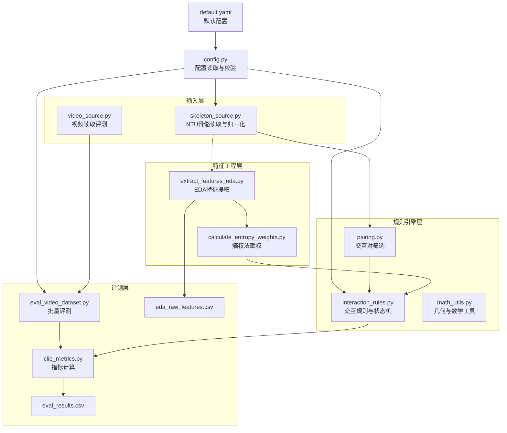
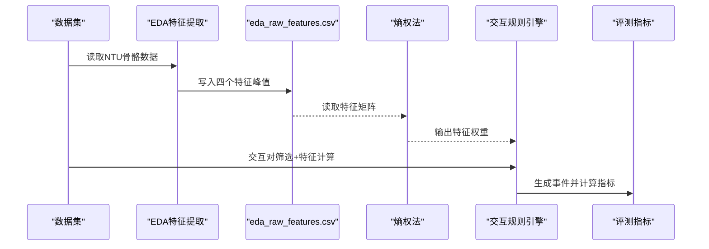
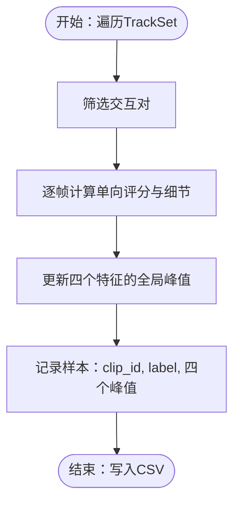
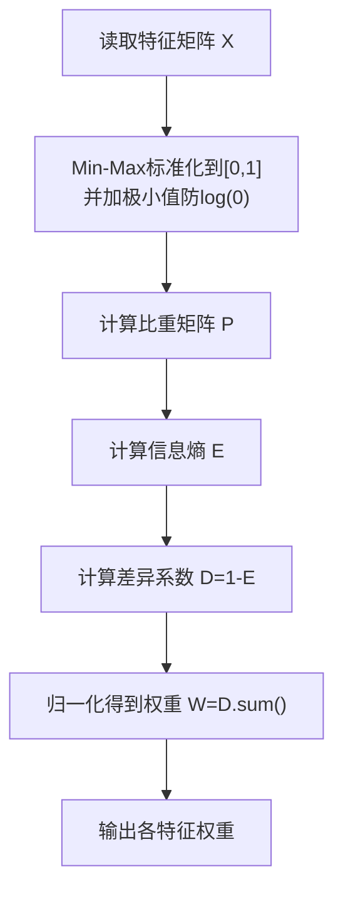
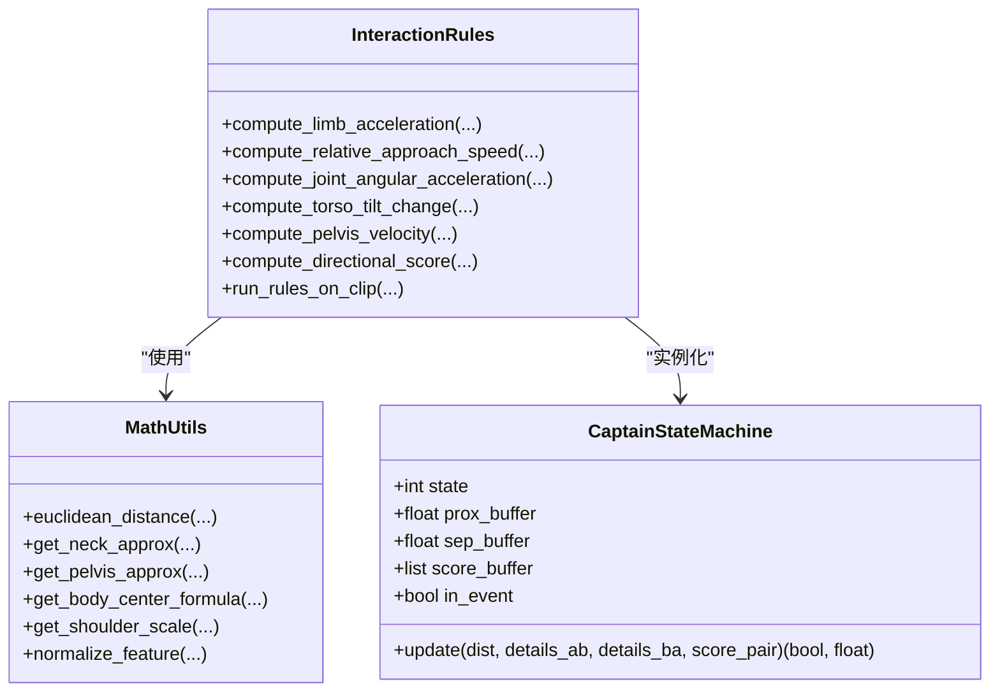
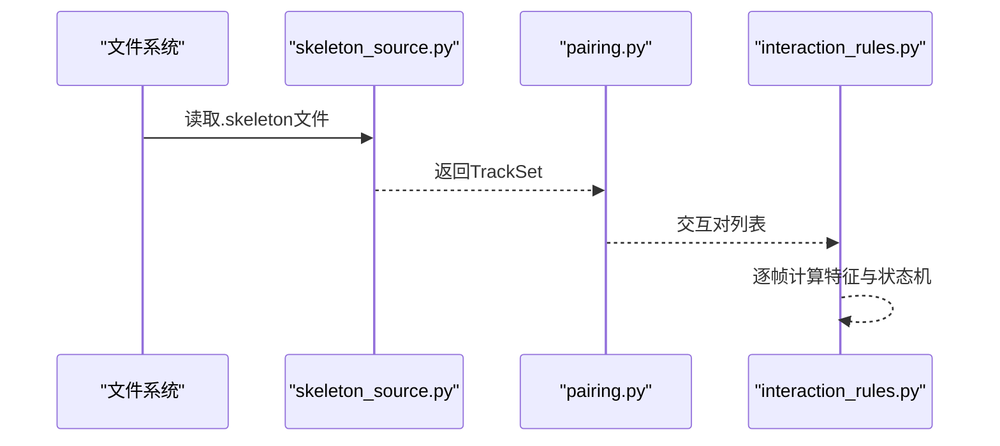
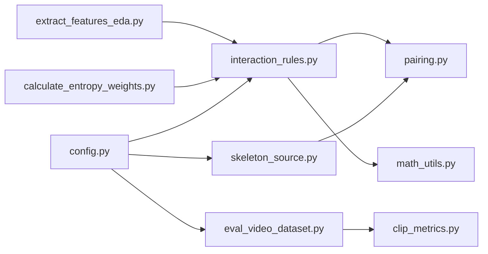

# 特征工程与数据驱动

<cite>
**本文引用的文件**
- [extract_features_eda.py](file://scripts/extract_features_eda.py)
- [calculate_entropy_weights.py](file://scripts/calculate_entropy_weights.py)
- [interaction_rules.py](file://src/fightguard/detection/interaction_rules.py)
- [math_utils.py](file://src/fightguard/detection/math_utils.py)
- [pairing.py](file://src/fightguard/detection/pairing.py)
- [skeleton_source.py](file://src/fightguard/inputs/skeleton_source.py)
- [config.py](file://src/fightguard/config.py)
- [contracts.py](file://src/fightguard/contracts.py)
- [default.yaml](file://configs/default.yaml)
- [eval_video_dataset.py](file://scripts/eval_video_dataset.py)
- [clip_metrics.py](file://src/fightguard/evaluation/clip_metrics.py)
- [eval_results.csv](file://outputs/metrics/eval_results.csv)
- [eda_raw_features.csv](file://outputs/metrics/eda_raw_features.csv)
</cite>

## 目录
1. [简介](#简介)
2. [项目结构](#项目结构)
3. [核心组件](#核心组件)
4. [架构总览](#架构总览)
5. [详细组件分析](#详细组件分析)
6. [依赖关系分析](#依赖关系分析)
7. [性能考量](#性能考量)
8. [故障排查指南](#故障排查指南)
9. [结论](#结论)
10. [附录](#附录)

## 简介
本文件面向数据科学家与算法工程师，系统阐述 KidGuard 特征工程与数据驱动体系。重点包括：
- 探索性数据分析（EDA）的特征提取流程：物理特征的计算方法、峰值提取技术、数据标准化过程
- 熵权法（EWM）的数学原理与在特征权重计算中的应用：信息熵理论、权重计算步骤、特征重要性评估
- 特征工程在系统中的作用：如何通过数据驱动优化冲突检测规则
- 输出结果的解读方法：特征统计信息与权重分布
- 提供可执行的脚本路径与关键实现位置，便于复现实验与迭代优化

## 项目结构
项目采用模块化分层设计，围绕“输入骨架数据 → 规则引擎 → 评测指标”的主线组织：
- 输入层：骨架数据读取与预处理（NTU RGBD）
- 特征工程层：EDA 特征提取与熵权赋权
- 规则引擎层：交互规则与状态机
- 评测层：指标计算与可视化输出
- 配置层：统一配置管理与缓存

图表来源
- [skeleton_source.py:1-331](file://src/fightguard/inputs/skeleton_source.py#L1-L331)
- [extract_features_eda.py:1-106](file://scripts/extract_features_eda.py#L1-L106)
- [calculate_entropy_weights.py:1-71](file://scripts/calculate_entropy_weights.py#L1-L71)
- [interaction_rules.py:1-531](file://src/fightguard/detection/interaction_rules.py#L1-L531)
- [pairing.py:1-54](file://src/fightguard/detection/pairing.py#L1-L54)
- [math_utils.py:1-52](file://src/fightguard/detection/math_utils.py#L1-L52)
- [eval_video_dataset.py:1-132](file://scripts/eval_video_dataset.py#L1-L132)
- [clip_metrics.py:1-47](file://src/fightguard/evaluation/clip_metrics.py#L1-L47)
- [config.py:1-120](file://src/fightguard/config.py#L1-L120)
- [default.yaml:1-62](file://configs/default.yaml#L1-L62)

章节来源
- [skeleton_source.py:1-331](file://src/fightguard/inputs/skeleton_source.py#L1-L331)
- [extract_features_eda.py:1-106](file://scripts/extract_features_eda.py#L1-L106)
- [calculate_entropy_weights.py:1-71](file://scripts/calculate_entropy_weights.py#L1-L71)
- [interaction_rules.py:1-531](file://src/fightguard/detection/interaction_rules.py#L1-L531)
- [pairing.py:1-54](file://src/fightguard/detection/pairing.py#L1-L54)
- [math_utils.py:1-52](file://src/fightguard/detection/math_utils.py#L1-L52)
- [eval_video_dataset.py:1-132](file://scripts/eval_video_dataset.py#L1-L132)
- [clip_metrics.py:1-47](file://src/fightguard/evaluation/clip_metrics.py#L1-L47)
- [config.py:1-120](file://src/fightguard/config.py#L1-L120)
- [default.yaml:1-62](file://configs/default.yaml#L1-L62)

## 核心组件
- 探索性数据分析（EDA）特征提取：从 NTU 骨骼数据中提取双人交互的四个核心物理特征的全局峰值，形成特征画像并保存为 CSV，用于后续熵权法赋权。
- 熵权法（EWM）权重计算：基于信息熵理论，对四个特征进行客观赋权，消除主观经验权重的影响。
- 交互规则与状态机：在规则引擎中使用归一化后的物理特征，结合置信度抑制与四段式状态机，实现冲突事件的判定与输出。
- 配置系统：统一读取与缓存配置，确保规则阈值与路径的一致性与可调性。
- 评测与指标：对真实视频数据集进行批量评测，计算准确率、精确率、召回率、误报率等指标。

章节来源
- [extract_features_eda.py:28-106](file://scripts/extract_features_eda.py#L28-L106)
- [calculate_entropy_weights.py:12-71](file://scripts/calculate_entropy_weights.py#L12-L71)
- [interaction_rules.py:363-531](file://src/fightguard/detection/interaction_rules.py#L363-L531)
- [config.py:32-120](file://src/fightguard/config.py#L32-L120)
- [eval_video_dataset.py:24-132](file://scripts/eval_video_dataset.py#L24-L132)

## 架构总览
KidGuard 的特征工程与数据驱动流程分为两大阶段：
- 阶段 A：EDA 特征提取与熵权赋权
  - 输入：NTU 骨骼数据
  - 处理：提取四个物理特征的峰值，保存为 CSV
  - 输出：eda_raw_features.csv
  - 下一步：使用熵权法计算特征权重
- 阶段 B：规则引擎与评测
  - 输入：骨架数据或视频数据
  - 处理：交互对筛选、物理特征计算、状态机判定、置信度抑制
  - 输出：事件日志与评测指标

图表来源
- [extract_features_eda.py:28-106](file://scripts/extract_features_eda.py#L28-L106)
- [calculate_entropy_weights.py:12-71](file://scripts/calculate_entropy_weights.py#L12-L71)
- [interaction_rules.py:410-503](file://src/fightguard/detection/interaction_rules.py#L410-L503)
- [eval_video_dataset.py:24-132](file://scripts/eval_video_dataset.py#L24-L132)

## 详细组件分析

### 探索性数据分析（EDA）特征提取
- 目标：从双人交互片段中提取四个核心物理特征的全局峰值，形成可用于统计分析的特征画像。
- 特征来源：基于单帧评分函数返回的细节字典，提取以下四个峰值：
  - 腕部线加速度（a_A）
  - 相对接近速度（v_rel）
  - 肘部角加速度（alpha_A）
  - 躯干倾角变化（delta_phi）
- 数据标准化：在熵权法阶段进行 Min-Max 标准化，将特征映射到 [0,1] 区间，消除量纲影响。
- 输出：保存为 CSV 文件，字段包含 clip_id、label、四个峰值特征。

图表来源
- [extract_features_eda.py:28-106](file://scripts/extract_features_eda.py#L28-L106)
- [interaction_rules.py:516-531](file://src/fightguard/detection/interaction_rules.py#L516-L531)

章节来源
- [extract_features_eda.py:28-106](file://scripts/extract_features_eda.py#L28-L106)
- [interaction_rules.py:516-531](file://src/fightguard/detection/interaction_rules.py#L516-L531)

### 熵权法（EWM）权重计算
- 数学原理：信息熵衡量特征的离散程度，熵越小，信息量越大，权重越高；差异系数 D=1-E，最终权重 W=D/D.sum()。
- 步骤：
  1) 读取特征矩阵 X（四个峰值特征）
  2) Min-Max 标准化到 [0,1]，并加入极小值防止 log(0)
  3) 计算特征比重矩阵 P
  4) 计算信息熵 E
  5) 计算差异系数 D
  6) 归一化得到最终权重 W
- 应用：将得到的权重更新到规则引擎中的等权重组合，实现数据驱动的特征融合。

图表来源
- [calculate_entropy_weights.py:12-71](file://scripts/calculate_entropy_weights.py#L12-L71)

章节来源
- [calculate_entropy_weights.py:12-71](file://scripts/calculate_entropy_weights.py#L12-L71)

### 交互规则与状态机
- 物理特征提取：
  - 腕部线加速度：计算手腕/脚踝的线加速度峰值
  - 相对接近速度：计算攻击距离的负向变化率
  - 肘部角加速度：计算肘关节角加速度峰值
  - 躯干倾角变化：计算受力侧躯干倾角短时变化量
- 归一化与组合：将各特征归一化到 [0,1]，并以等权重组合为基础得分，再乘以置信度抑制系数。
- 状态机：四段式状态机（接近、动作激活、作用-响应、事件确认），严格同步因果律，确保冲突链路闭环。
- 输出：事件列表，包含开始/结束帧、触发规则、置信度分数等。

图表来源
- [interaction_rules.py:258-358](file://src/fightguard/detection/interaction_rules.py#L258-L358)
- [interaction_rules.py:363-503](file://src/fightguard/detection/interaction_rules.py#L363-L503)
- [math_utils.py:1-52](file://src/fightguard/detection/math_utils.py#L1-L52)

章节来源
- [interaction_rules.py:363-531](file://src/fightguard/detection/interaction_rules.py#L363-L531)
- [math_utils.py:1-52](file://src/fightguard/detection/math_utils.py#L1-L52)

### 骨骼数据读取与配对
- 骨骼读取：解析 NTU .skeleton 文件，映射到 COCO-17 标准关键点，进行归一化处理，构建 TrackSet。
- 交互配对：基于人体中心点（骨盆）的平均距离选择最佳交互对，剔除存活帧过少的轨迹，保证稳定性。
- 距离计算：使用人体中心点之间的欧氏距离作为交互距离。

图表来源
- [skeleton_source.py:211-331](file://src/fightguard/inputs/skeleton_source.py#L211-L331)
- [pairing.py:14-54](file://src/fightguard/detection/pairing.py#L14-L54)
- [interaction_rules.py:410-503](file://src/fightguard/detection/interaction_rules.py#L410-L503)

章节来源
- [skeleton_source.py:1-331](file://src/fightguard/inputs/skeleton_source.py#L1-L331)
- [pairing.py:1-54](file://src/fightguard/detection/pairing.py#L1-L54)

### 配置系统与数据契约
- 配置读取：统一从 default.yaml 读取，支持缓存与热重载，校验必要字段。
- 数据契约：定义 Keypoints、SkeletonTrack、TrackSet、InteractionEvent 等数据结构，确保模块间传递一致性。

章节来源
- [config.py:32-120](file://src/fightguard/config.py#L32-L120)
- [default.yaml:1-62](file://configs/default.yaml#L1-L62)
- [contracts.py:1-241](file://src/fightguard/contracts.py#L1-L241)

### 评测与指标
- 批量评测：对真实视频数据集进行评测，支持后台实时秒表线程，缓解推理慢导致的阻塞。
- 指标计算：计算准确率、精确率、召回率、误报率、F1 分数等，输出评测结果 CSV。

章节来源
- [eval_video_dataset.py:24-132](file://scripts/eval_video_dataset.py#L24-L132)
- [clip_metrics.py:9-47](file://src/fightguard/evaluation/clip_metrics.py#L9-L47)
- [eval_results.csv:1-502](file://outputs/metrics/eval_results.csv#L1-L502)

## 依赖关系分析
- 模块耦合：
  - 特征提取依赖交互规则中的单帧评分细节键名，确保特征一致性
  - 规则引擎依赖配对模块与数学工具模块
  - 评测模块依赖指标计算模块
- 外部依赖：
  - NumPy/Pandas 用于数值计算与数据处理
  - PyYAML 用于配置文件解析
  - tqdm 用于进度条显示

图表来源
- [extract_features_eda.py:23-26](file://scripts/extract_features_eda.py#L23-L26)
- [interaction_rules.py:16-24](file://src/fightguard/detection/interaction_rules.py#L16-L24)
- [pairing.py:3-4](file://src/fightguard/detection/pairing.py#L3-L4)
- [math_utils.py:13-24](file://src/fightguard/detection/math_utils.py#L13-L24)
- [calculate_entropy_weights.py:8-10](file://scripts/calculate_entropy_weights.py#L8-L10)
- [eval_video_dataset.py:19-22](file://scripts/eval_video_dataset.py#L19-L22)
- [clip_metrics.py:7-8](file://src/fightguard/evaluation/clip_metrics.py#L7-L8)
- [skeleton_source.py:22-29](file://src/fightguard/inputs/skeleton_source.py#L22-L29)
- [config.py:32-82](file://src/fightguard/config.py#L32-L82)

章节来源
- [extract_features_eda.py:23-26](file://scripts/extract_features_eda.py#L23-L26)
- [interaction_rules.py:16-24](file://src/fightguard/detection/interaction_rules.py#L16-L24)
- [pairing.py:3-4](file://src/fightguard/detection/pairing.py#L3-L4)
- [math_utils.py:13-24](file://src/fightguard/detection/math_utils.py#L13-L24)
- [calculate_entropy_weights.py:8-10](file://scripts/calculate_entropy_weights.py#L8-L10)
- [eval_video_dataset.py:19-22](file://scripts/eval_video_dataset.py#L19-L22)
- [clip_metrics.py:7-8](file://src/fightguard/evaluation/clip_metrics.py#L7-L8)
- [skeleton_source.py:22-29](file://src/fightguard/inputs/skeleton_source.py#L22-L29)
- [config.py:32-82](file://src/fightguard/config.py#L32-L82)

## 性能考量
- 时间复杂度：
  - 特征提取：对每个 clip 遍历所有帧，复杂度 O(N×T)，其中 N 为交互对数，T 为帧数
  - 熵权法：矩阵运算 O(N×F)，F 为特征数（此处为 4）
  - 规则引擎：状态机更新与特征计算 O(T)
- 空间复杂度：
  - 特征矩阵存储 O(N×F)
  - TrackSet 存储 O(T×K)，K 为关键点数（COCO-17）
- 优化建议：
  - 并行化：对不同 clip 的特征提取可并行处理
  - 缓存：配置与中间结果缓存，减少重复 IO
  - 稀疏化：对缺失关键点的帧进行跳过或插值，减少无效计算

## 故障排查指南
- 配置文件缺失或格式错误
  - 现象：启动时报错，提示配置文件不存在或字段缺失
  - 处理：检查 default.yaml 是否存在，字段是否完整
- 特征数据文件缺失
  - 现象：熵权法脚本报错找不到 eda_raw_features.csv
  - 处理：先运行特征提取脚本，确保 CSV 已生成
- 数据集路径错误
  - 现象：骨架读取失败或未加载到数据
  - 处理：检查数据目录路径与文件命名格式
- 状态机未触发事件
  - 现象：规则引擎未输出冲突事件
  - 处理：调整阈值（proximity_threshold、alert_threshold 等），或检查置信度抑制系数

章节来源
- [config.py:67-82](file://src/fightguard/config.py#L67-L82)
- [calculate_entropy_weights.py:18-26](file://scripts/calculate_entropy_weights.py#L18-L26)
- [skeleton_source.py:302-330](file://src/fightguard/inputs/skeleton_source.py#L302-L330)

## 结论
KidGuard 通过“EDA 特征提取 + 熵权法赋权 + 数据驱动规则引擎”的闭环，实现了从物理特征到冲突事件的可解释、可验证的数据驱动流程。熵权法消除了主观经验权重的影响，使特征融合更加客观；规则引擎的状态机与置信度抑制进一步提升了鲁棒性与可解释性。配合统一的配置系统与评测指标，系统具备良好的可扩展性与可维护性。

## 附录
- 关键实现路径（仅列出路径，不展示代码内容）：
  - 特征提取：[extract_features_eda.py:28-106](file://scripts/extract_features_eda.py#L28-L106)
  - 熵权法：[calculate_entropy_weights.py:12-71](file://scripts/calculate_entropy_weights.py#L12-L71)
  - 交互规则与状态机：[interaction_rules.py:363-531](file://src/fightguard/detection/interaction_rules.py#L363-L531)
  - 骨骼读取与归一化：[skeleton_source.py:211-331](file://src/fightguard/inputs/skeleton_source.py#L211-L331)
  - 交互配对：[pairing.py:14-54](file://src/fightguard/detection/pairing.py#L14-L54)
  - 数学工具：[math_utils.py:1-52](file://src/fightguard/detection/math_utils.py#L1-L52)
  - 配置读取：[config.py:32-120](file://src/fightguard/config.py#L32-L120)
  - 数据契约：[contracts.py:1-241](file://src/fightguard/contracts.py#L1-L241)
  - 默认配置：[default.yaml:1-62](file://configs/default.yaml#L1-L62)
  - 批量评测：[eval_video_dataset.py:24-132](file://scripts/eval_video_dataset.py#L24-L132)
  - 指标计算：[clip_metrics.py:9-47](file://src/fightguard/evaluation/clip_metrics.py#L9-L47)
  - 评测结果：[eval_results.csv:1-502](file://outputs/metrics/eval_results.csv#L1-L502)
  - EDA 特征 CSV：[eda_raw_features.csv:1-2](file://outputs/metrics/eda_raw_features.csv#L1-L2)