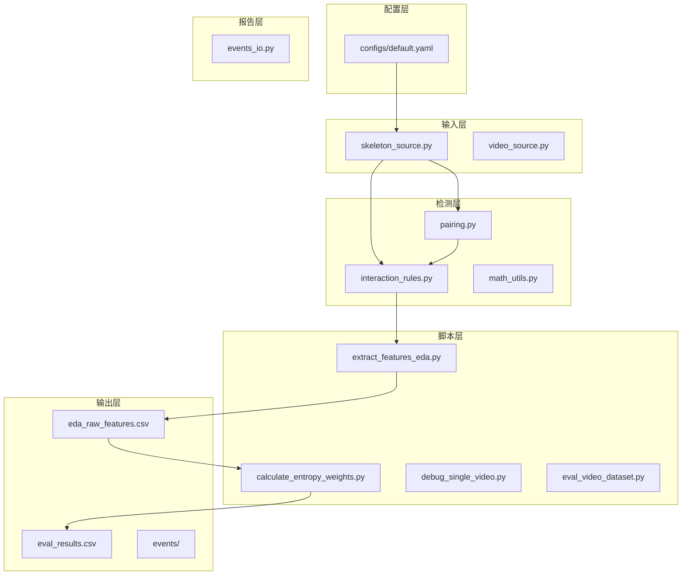
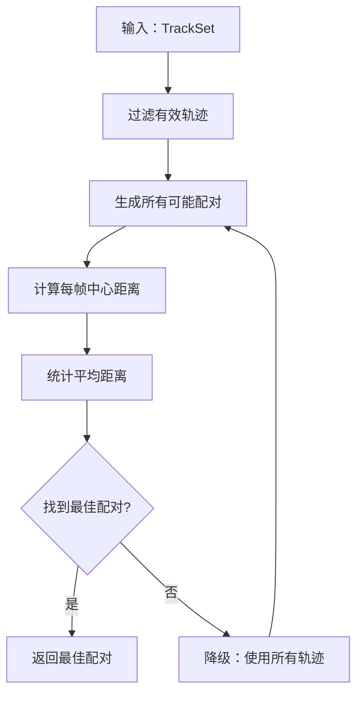
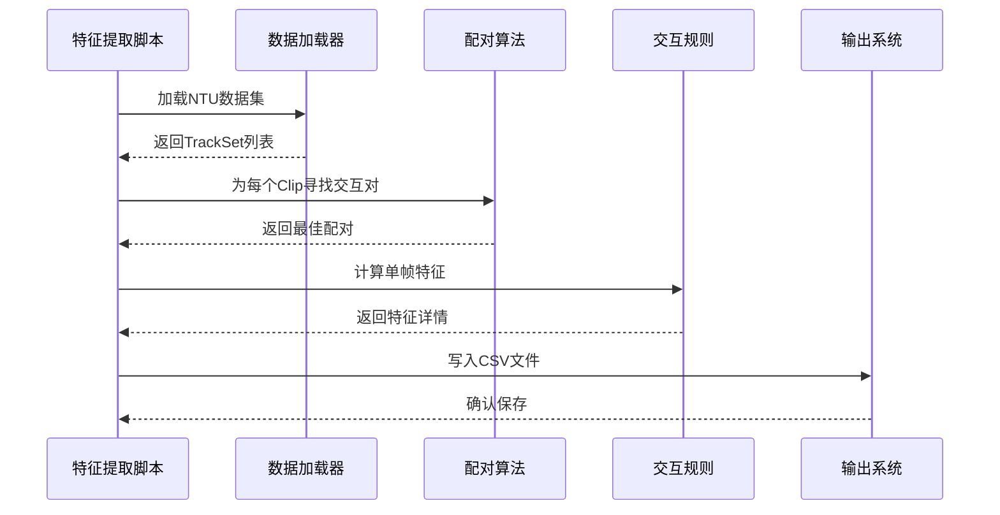
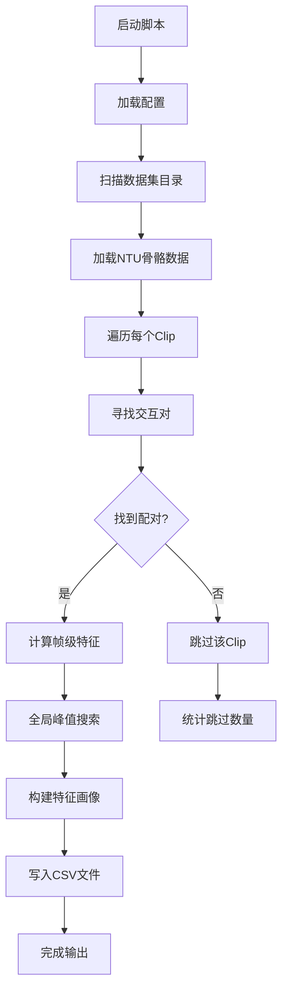
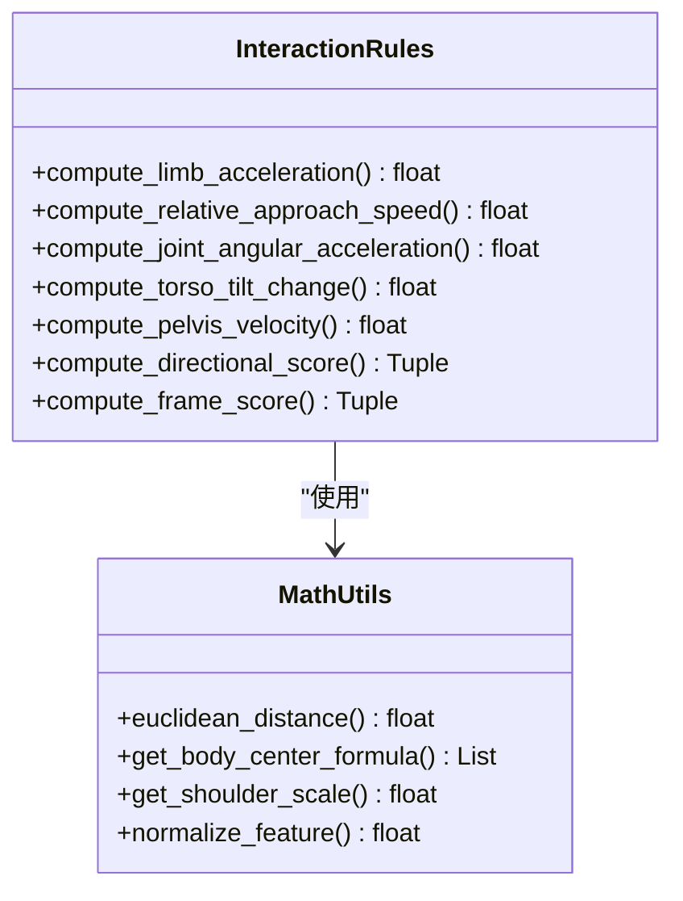
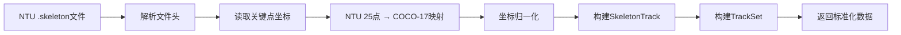
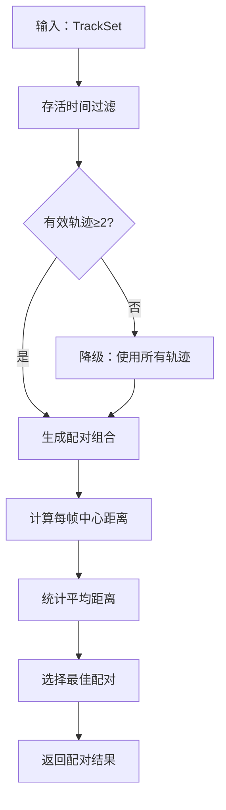
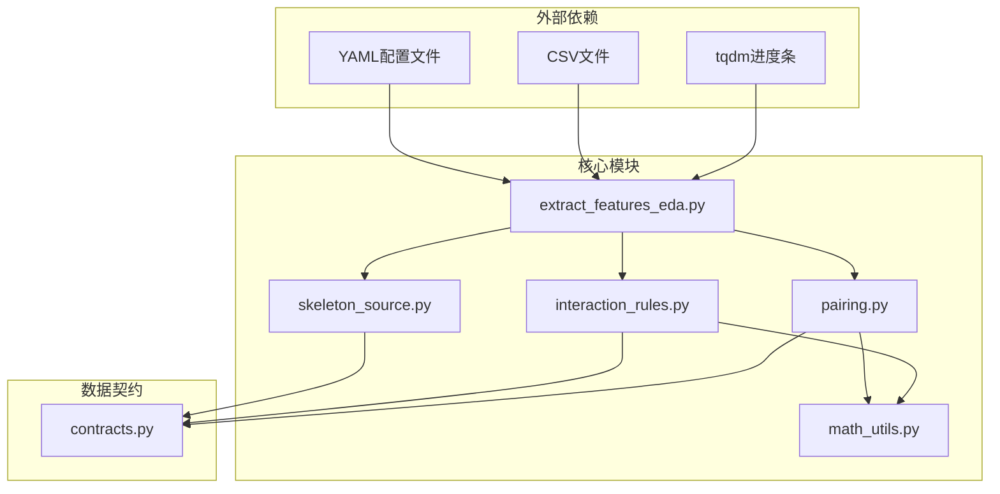

# 特征提取流程

<cite>
**本文档引用的文件**
- [extract_features_eda.py](file://scripts/extract_features_eda.py)
- [interaction_rules.py](file://src/fightguard/detection/interaction_rules.py)
- [pairing.py](file://src/fightguard/detection/pairing.py)
- [math_utils.py](file://src/fightguard/detection/math_utils.py)
- [skeleton_source.py](file://src/fightguard/inputs/skeleton_source.py)
- [contracts.py](file://src/fightguard/contracts.py)
- [default.yaml](file://configs/default.yaml)
- [calculate_entropy_weights.py](file://scripts/calculate_entropy_weights.py)
- [eda_raw_features.csv](file://outputs/metrics/eda_raw_features.csv)
</cite>

## 目录
1. [简介](#简介)
2. [项目结构](#项目结构)
3. [核心组件](#核心组件)
4. [架构概览](#架构概览)
5. [详细组件分析](#详细组件分析)
6. [依赖关系分析](#依赖关系分析)
7. [性能考虑](#性能考虑)
8. [故障排除指南](#故障排除指南)
9. [结论](#结论)

## 简介

KidGuard项目中的特征提取流程专注于探索性数据分析(EDA)，旨在从NTU RGBD数据集中提取四个核心物理特征的峰值，为后续的熵权法计算提供数据基础。该流程通过自动化脚本实现，能够高效地处理大规模骨骼数据集，并生成标准化的特征数据集。

## 项目结构

KidGuard项目采用模块化架构设计，主要包含以下核心目录和文件：



**图表来源**
- [default.yaml:1-62](file://configs/default.yaml#L1-L62)
- [skeleton_source.py:1-331](file://src/fightguard/inputs/skeleton_source.py#L1-L331)
- [interaction_rules.py:1-531](file://src/fightguard/detection/interaction_rules.py#L1-L531)

**章节来源**
- [default.yaml:1-62](file://configs/default.yaml#L1-L62)
- [skeleton_source.py:1-331](file://src/fightguard/inputs/skeleton_source.py#L1-L331)

## 核心组件

### 物理特征提取系统

KidGuard实现了四个核心物理特征的提取系统，这些特征专门针对儿童冲突检测而设计：

| 特征名称 | 英文缩写 | 物理含义 | 计算方法 | 量纲 |
|---------|---------|----------|----------|------|
| 腕部线加速度 | a_A | 手腕末端的线加速度 | 二阶差分计算 | m/s² |
| 相对接近速度 | v_rel | 两人之间攻击距离的相对接近速度 | 距离变化率 | m/s |
| 肘部角加速度 | alpha_A | 肘关节的角加速度 | 二阶角差分 | rad/s² |
| 躯干倾角变化 | delta_phi | 躯干相对于重力方向的倾角变化 | 角度差分 | rad |

### 配对算法系统

配对算法负责在多人场景中选择最具交互性的双人组合：



**图表来源**
- [pairing.py:14-53](file://src/fightguard/detection/pairing.py#L14-L53)

**章节来源**
- [pairing.py:1-54](file://src/fightguard/detection/pairing.py#L1-L54)
- [math_utils.py:1-52](file://src/fightguard/detection/math_utils.py#L1-L52)

## 架构概览

特征提取系统的整体架构采用分层设计，确保了模块间的松耦合和高内聚：



**图表来源**
- [extract_features_eda.py:28-106](file://scripts/extract_features_eda.py#L28-L106)
- [skeleton_source.py:281-331](file://src/fightguard/inputs/skeleton_source.py#L281-L331)
- [pairing.py:14-53](file://src/fightguard/detection/pairing.py#L14-L53)

## 详细组件分析

### 特征提取脚本 (extract_features_eda.py)

特征提取脚本是整个EDA流程的核心执行器，负责协调各个组件完成完整的特征提取任务：

#### 主要功能流程



**图表来源**
- [extract_features_eda.py:28-106](file://scripts/extract_features_eda.py#L28-L106)

#### 核心特征计算逻辑

脚本使用`compute_frame_score`函数获取单帧的特征详情，然后在所有帧中寻找全局峰值：

```python
# 遍历所有帧，寻找四个特征的全局峰值
max_a_A = 0.0
max_v_rel = 0.0
max_alpha_A = 0.0
max_delta_phi = 0.0

for fi in range(n_frames):
    # 复用 interaction_rules 中的计算逻辑
    _, details = compute_frame_score(track_a, track_b, fi, cfg, dt)
    
    max_a_A       = max(max_a_A,       details.get("a_A", 0.0))
    max_v_rel     = max(max_v_rel,     details.get("v_rel", 0.0))
    max_alpha_A   = max(max_alpha_A,   details.get("alpha_A", 0.0))
    max_delta_phi = max(max_delta_phi, details.get("delta_phi", 0.0))
```

**章节来源**
- [extract_features_eda.py:64-87](file://scripts/extract_features_eda.py#L64-L87)

### 交互规则引擎 (interaction_rules.py)

交互规则引擎实现了复杂的物理特征计算和状态机逻辑：

#### 物理特征计算函数



**图表来源**
- [interaction_rules.py:57-156](file://src/fightguard/detection/interaction_rules.py#L57-L156)
- [math_utils.py:10-52](file://src/fightguard/detection/math_utils.py#L10-L52)

#### 特征归一化机制

所有物理特征都经过归一化处理，确保不同特征间的可比性：

| 特征 | 归一化范围 | 理论上限 |
|------|------------|----------|
| a_A | [0, 5] | 5.0 |
| v_rel | [0, 1] | 1.0 |
| alpha_A | [0, 10] | 10.0 |
| delta_phi | [0, 0.5] | 0.5 |

**章节来源**
- [interaction_rules.py:386-391](file://src/fightguard/detection/interaction_rules.py#L386-L391)

### 骨骼数据加载系统 (skeleton_source.py)

骨骼数据加载系统负责将NTU RGBD格式的数据转换为项目内部的标准格式：

#### 数据转换流程



**图表来源**
- [skeleton_source.py:120-274](file://src/fightguard/inputs/skeleton_source.py#L120-L274)

#### NTU到COCO-17映射表

| COCO-17关键点 | NTU原始索引 | 描述 |
|---------------|-------------|------|
| nose | 3 | 头部近似 |
| left_shoulder | 4 | 左肩 |
| right_shoulder | 8 | 右肩 |
| left_elbow | 5 | 左肘 |
| right_elbow | 9 | 右肘 |
| left_wrist | 6 | 左腕 |
| right_wrist | 10 | 右腕 |
| left_hip | 12 | 左髋 |
| right_hip | 16 | 右髋 |
| left_knee | 13 | 左膝 |
| right_knee | 17 | 右膝 |
| left_ankle | 14 | 左踝 |
| right_ankle | 18 | 右踝 |

**章节来源**
- [skeleton_source.py:39-57](file://src/fightguard/inputs/skeleton_source.py#L39-L57)

### 配对算法详解 (pairing.py)

配对算法是处理多人场景的关键组件，它能够智能地选择最具交互性的双人组合：

#### 算法优化策略



**图表来源**
- [pairing.py:14-53](file://src/fightguard/detection/pairing.py#L14-L53)

#### 轨迹有效性判定

配对算法采用"存活时间"过滤策略，剔除YOLO产生的碎片化幽灵ID：

- **存活帧数阈值**：至少15帧（约0.5秒）
- **判定依据**：非全零填充帧的数量
- **降级机制**：当有效轨迹少于2个时，使用所有轨迹

**章节来源**
- [pairing.py:14-29](file://src/fightguard/detection/pairing.py#L14-L29)

## 依赖关系分析

特征提取系统的依赖关系体现了清晰的分层架构：



**图表来源**
- [extract_features_eda.py:23-26](file://scripts/extract_features_eda.py#L23-L26)
- [interaction_rules.py:16-24](file://src/fightguard/detection/interaction_rules.py#L16-L24)
- [pairing.py:3-4](file://src/fightguard/detection/pairing.py#L3-L4)

### 模块间耦合度评估

| 组件 | 内聚性 | 耦合度 | 依赖关系 |
|------|--------|--------|----------|
| extract_features_eda.py | 高 | 低 | 仅依赖核心API |
| interaction_rules.py | 高 | 中 | 依赖math_utils和contracts |
| pairing.py | 高 | 低 | 依赖math_utils和contracts |
| skeleton_source.py | 高 | 中 | 依赖contracts和配置 |
| math_utils.py | 高 | 低 | 纯数学工具函数 |

**章节来源**
- [contracts.py:1-241](file://src/fightguard/contracts.py#L1-L241)

## 性能考虑

### 计算复杂度分析

特征提取流程的时间复杂度主要由以下因素决定：

- **数据加载**：O(N × F × P)，其中N为Clip数量，F为平均帧数，P为平均轨迹数
- **配对计算**：O(C × F × D)，其中C为组合数，D为中心距离计算
- **特征计算**：O(F × K)，其中K为特征数量

### 内存优化策略

1. **流式处理**：逐Clip处理，避免同时加载所有数据
2. **增量存储**：实时更新峰值，减少内存占用
3. **类型优化**：使用float32而非float64进行数值计算

### 并行化机会

当前实现采用串行处理，但存在以下并行化机会：
- **Clip级别的并行**：不同Clip之间无依赖关系
- **帧级别的并行**：单个Clip内帧间相互独立
- **配对计算的并行**：不同轨迹组合可并行计算

## 故障排除指南

### 常见问题及解决方案

#### 数据加载问题

**问题**：未加载到数据
**原因**：数据路径配置错误或文件格式不正确
**解决**：检查`data_dirs`配置和文件扩展名

**章节来源**
- [extract_features_eda.py:42-46](file://scripts/extract_features_eda.py#L42-L46)

#### 配对算法问题

**问题**：某些Clip无法找到交互对
**原因**：轨迹数量不足或质量差
**解决**：检查`alive_count`阈值设置和数据质量

**章节来源**
- [pairing.py:26-28](file://src/fightguard/detection/pairing.py#L26-L28)

#### 特征计算异常

**问题**：特征值异常或NaN
**原因**：关键点坐标缺失或计算错误
**解决**：检查关键点映射和坐标有效性

### 调试建议

1. **启用详细日志**：逐步打印中间结果
2. **验证数据格式**：检查关键点坐标的有效性
3. **监控内存使用**：避免内存泄漏
4. **测试边界条件**：空轨迹、单人场景等

## 结论

KidGuard的特征提取流程展现了现代计算机视觉项目的设计理念，通过模块化架构、严格的契约设计和科学的特征工程，实现了高效、可靠的儿童冲突检测数据准备。该系统的主要优势包括：

1. **模块化设计**：清晰的职责分离和低耦合
2. **数据标准化**：统一的COCO-17关键点标准
3. **科学特征**：基于物理原理的特征设计
4. **可扩展性**：易于添加新特征和改进算法
5. **自动化程度高**：从数据加载到特征输出的完整流水线

该特征提取流程为后续的熵权法赋权提供了高质量的数据基础，通过客观的统计方法确定各特征的权重，避免了主观经验的影响，为KidGuard系统的智能化发展奠定了坚实基础。