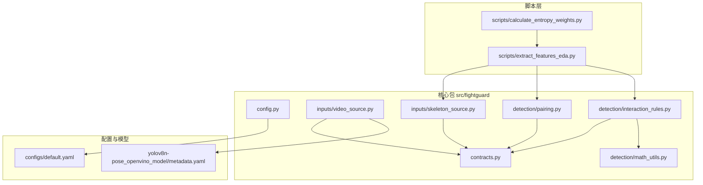
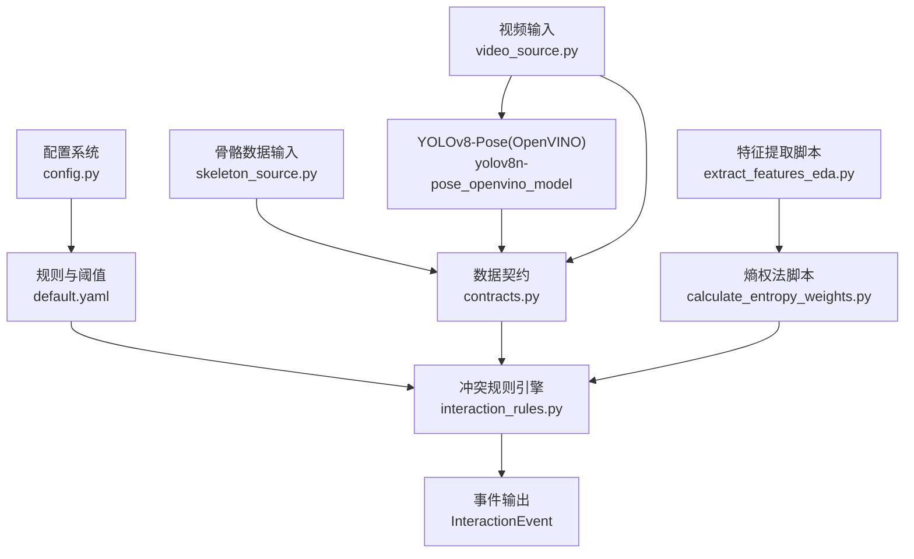
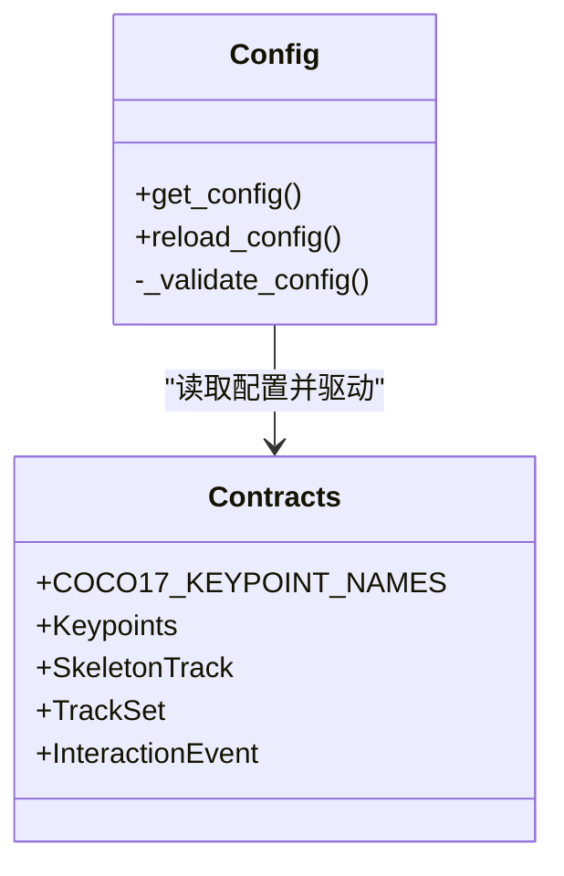
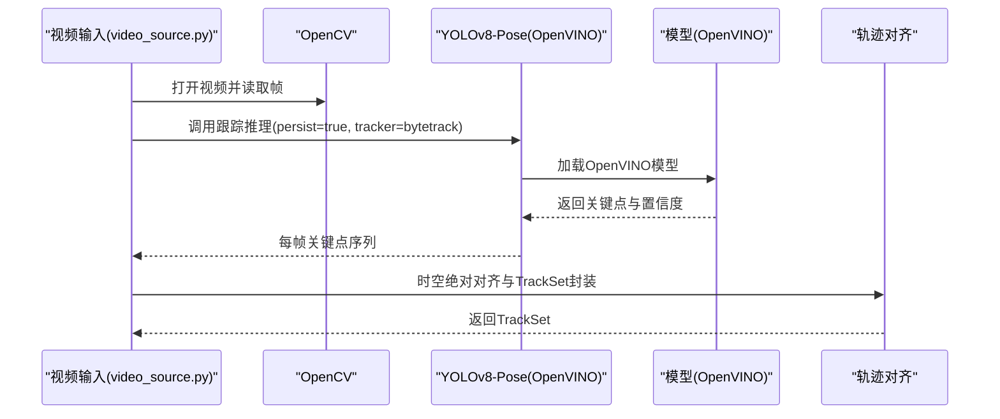
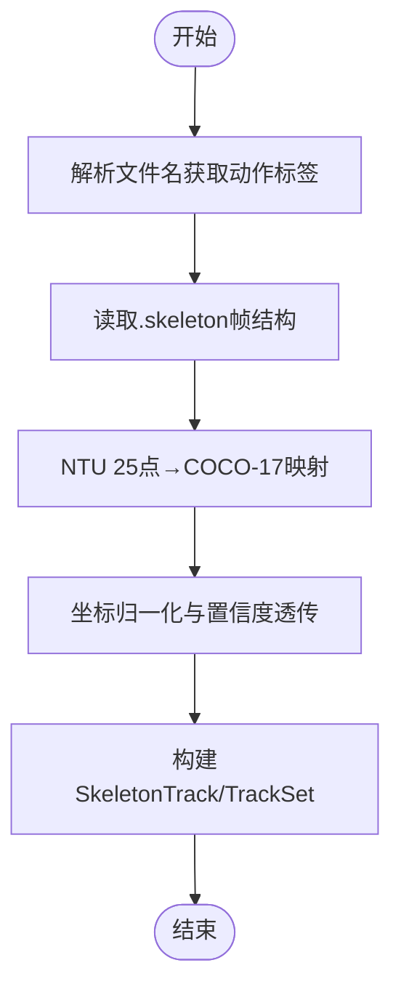
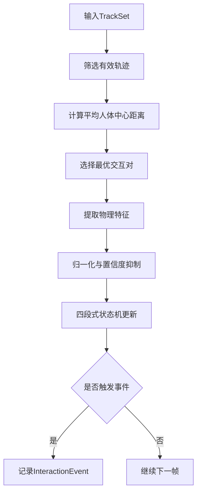
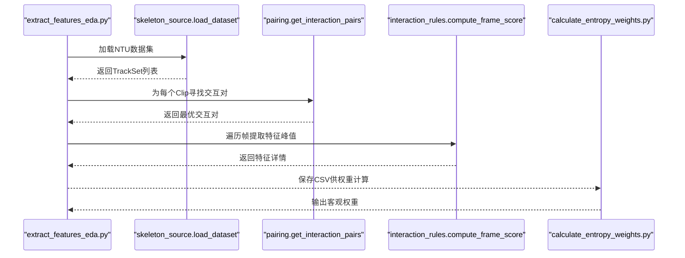
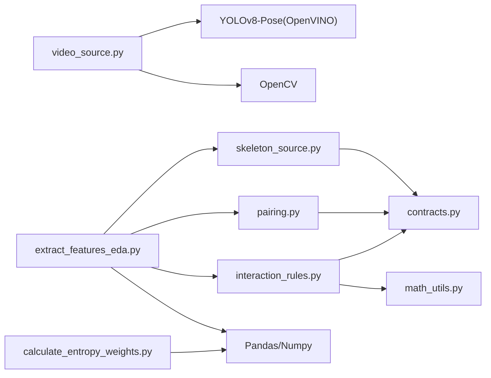

# 技术栈与集成

<cite>
**本文引用的文件**   
- [README.md](file://README.md)
- [default.yaml](file://configs/default.yaml)
- [config.py](file://src/fightguard/config.py)
- [contracts.py](file://src/fightguard/contracts.py)
- [video_source.py](file://src/fightguard/inputs/video_source.py)
- [skeleton_source.py](file://src/fightguard/inputs/skeleton_source.py)
- [pairing.py](file://src/fightguard/detection/pairing.py)
- [interaction_rules.py](file://src/fightguard/detection/interaction_rules.py)
- [math_utils.py](file://src/fightguard/detection/math_utils.py)
- [extract_features_eda.py](file://scripts/extract_features_eda.py)
- [calculate_entropy_weights.py](file://scripts/calculate_entropy_weights.py)
- [metadata.yaml](file://yolov8n-pose_openvino_model/metadata.yaml)
- [OpenVINO可以加速轻薄本电脑YOLOv8的推理.md](file://OpenVINO可以加速轻薄本电脑YOLOv8的推理.md)
</cite>

## 目录
1. [简介](#简介)
2. [项目结构](#项目结构)
3. [核心组件](#核心组件)
4. [架构总览](#架构总览)
5. [详细组件分析](#详细组件分析)
6. [依赖分析](#依赖分析)
7. [性能考量](#性能考量)
8. [故障排查指南](#故障排查指南)
9. [结论](#结论)
10. [附录](#附录)

## 简介
KidGuard 是面向幼儿园等儿童聚集场景的冲突风险分析系统，基于计算机视觉与规则引擎，通过骨骼关键点的空间几何关系与动作特征，实现冲突行为的轻量化识别与风险管理分析。系统采用模块化设计，覆盖从数据输入、关键点提取、特征工程、规则判定到事件输出的完整链路，并提供数据驱动的特征权重计算能力。

## 项目结构
项目采用“脚本驱动 + 核心包”的组织方式，核心逻辑集中在 src/fightguard 包中，配置与数据、输出目录分别位于 configs、data、outputs，阶段性脚本位于 scripts。

图表来源
- [README.md:46-76](file://README.md#L46-L76)
- [default.yaml:1-62](file://configs/default.yaml#L1-L62)
- [config.py:32-82](file://src/fightguard/config.py#L32-L82)
- [contracts.py:96-186](file://src/fightguard/contracts.py#L96-L186)
- [video_source.py:14-49](file://src/fightguard/inputs/video_source.py#L14-L49)
- [skeleton_source.py:22-29](file://src/fightguard/inputs/skeleton_source.py#L22-L29)
- [pairing.py:14-53](file://src/fightguard/detection/pairing.py#L14-L53)
- [interaction_rules.py:16-24](file://src/fightguard/detection/interaction_rules.py#L16-L24)
- [math_utils.py:10-52](file://src/fightguard/detection/math_utils.py#L10-L52)
- [metadata.yaml:1-27](file://yolov8n-pose_openvino_model/metadata.yaml#L1-L27)

章节来源
- [README.md:46-76](file://README.md#L46-L76)
- [default.yaml:1-62](file://configs/default.yaml#L1-L62)

## 核心组件
- 配置系统：统一读取与校验 configs/default.yaml，提供全局配置访问接口，支持热重载。
- 数据契约：定义 Keypoints、SkeletonTrack、TrackSet、InteractionEvent 等统一数据结构，确保模块间解耦。
- 输入层：
  - 视频输入：使用 OpenCV 读取视频，YOLOv8-Pose（OpenVINO 加速）提取骨骼关键点，转换为 TrackSet。
  - 骨骼数据输入：读取 NTU RGBD .skeleton 文件，映射为 COCO-17 标准并归一化。
- 检测与规则：
  - 人员配对：基于轨迹存活时长与平均距离筛选交互对。
  - 冲突规则：基于肩宽尺度归一化、物理特征（加速度、角加速度、相对接近速度、躯干倾角变化、骨盆速度）与置信度抑制机制，结合四段式状态机进行冲突判定。
  - 数学工具：提供几何与归一化工具函数。
- 特征工程与权重：
  - 探索性特征提取：遍历样本提取四个核心特征的峰值，输出 CSV。
  - 熵权法权重计算：基于信息熵客观计算特征权重，实现数据驱动赋权。

章节来源
- [config.py:32-120](file://src/fightguard/config.py#L32-L120)
- [contracts.py:96-241](file://src/fightguard/contracts.py#L96-L241)
- [video_source.py:57-193](file://src/fightguard/inputs/video_source.py#L57-L193)
- [skeleton_source.py:211-331](file://src/fightguard/inputs/skeleton_source.py#L211-L331)
- [pairing.py:14-54](file://src/fightguard/detection/pairing.py#L14-L54)
- [interaction_rules.py:363-531](file://src/fightguard/detection/interaction_rules.py#L363-L531)
- [math_utils.py:10-52](file://src/fightguard/detection/math_utils.py#L10-L52)
- [extract_features_eda.py:28-106](file://scripts/extract_features_eda.py#L28-L106)
- [calculate_entropy_weights.py:12-71](file://scripts/calculate_entropy_weights.py#L12-L71)

## 架构总览
系统采用“配置驱动 + 数据契约 + 规则引擎”的分层架构。输入层负责数据采集与预处理，检测层负责特征提取与规则判定，输出层负责事件记录与报告生成。OpenVINO 作为推理加速后端，透明替换 YOLO 推理引擎，提升实时性与可扩展性。

图表来源
- [config.py:32-82](file://src/fightguard/config.py#L32-L82)
- [default.yaml:16-62](file://configs/default.yaml#L16-L62)
- [interaction_rules.py:410-503](file://src/fightguard/detection/interaction_rules.py#L410-L503)
- [video_source.py:41-49](file://src/fightguard/inputs/video_source.py#L41-L49)
- [skeleton_source.py:211-274](file://src/fightguard/inputs/skeleton_source.py#L211-L274)
- [contracts.py:96-186](file://src/fightguard/contracts.py#L96-L186)
- [extract_features_eda.py:28-106](file://scripts/extract_features_eda.py#L28-L106)
- [calculate_entropy_weights.py:12-71](file://scripts/calculate_entropy_weights.py#L12-L71)

## 详细组件分析

### 配置系统与数据契约
- 配置系统：
  - 提供 get_config()/reload_config() 接口，统一读取 YAML 并进行字段校验，支持模块级缓存与热重载。
  - 配置项覆盖 paths、rules、dataset、output 等，规则阈值与状态机参数集中管理。
- 数据契约：
  - 统一关键点命名（COCO-17）、轨迹结构（SkeletonTrack/TrackSet）与事件结构（InteractionEvent），避免硬编码索引，提升可维护性与可解释性。

图表来源
- [config.py:32-120](file://src/fightguard/config.py#L32-L120)
- [contracts.py:23-241](file://src/fightguard/contracts.py#L23-L241)

章节来源
- [config.py:32-120](file://src/fightguard/config.py#L32-L120)
- [contracts.py:96-241](file://src/fightguard/contracts.py#L96-L241)
- [default.yaml:16-62](file://configs/default.yaml#L16-L62)

### 视频输入与关键点提取（YOLOv8-Pose + OpenVINO）
- 视频读取：使用 OpenCV 逐帧读取，获取 FPS、分辨率与总帧数。
- 推理加速：通过 OpenVINO 加速 YOLOv8-Pose 推理，自动利用 Intel GPU/NPU，显著降低延迟。
- 轨迹对齐：采用 ByteTrack 追踪器与“时空绝对对齐”策略，确保所有轨迹严格对应物理帧序。
- 输出格式：将关键点转换为 COCO-17 字典并封装为 TrackSet，供后续模块使用。

图表来源
- [video_source.py:80-193](file://src/fightguard/inputs/video_source.py#L80-L193)
- [metadata.yaml:1-27](file://yolov8n-pose_openvino_model/metadata.yaml#L1-L27)

章节来源
- [video_source.py:57-193](file://src/fightguard/inputs/video_source.py#L57-L193)
- [OpenVINO可以加速轻薄本电脑YOLOv8的推理.md:49-80](file://OpenVINO可以加速轻薄本电脑YOLOv8的推理.md#L49-L80)

### 骨骼数据输入（NTU RGBD）
- 文件解析：从 .skeleton 文件名解析动作类别，按帧读取多人骨骼数据。
- 坐标映射：将 NTU 25 点映射到 COCO-17，保留置信度并进行归一化。
- 轨迹构建：按帧收集关键点，构建 SkeletonTrack/TrackSet，统一坐标体系与标签。

图表来源
- [skeleton_source.py:64-274](file://src/fightguard/inputs/skeleton_source.py#L64-L274)

章节来源
- [skeleton_source.py:211-331](file://src/fightguard/inputs/skeleton_source.py#L211-L331)

### 人员配对与交互规则
- 人员配对：过滤短寿命轨迹，基于平均人体中心距离选择最优交互对。
- 冲突规则：提取多类物理特征，进行肩宽尺度归一化与特征归一化，结合置信度抑制与四段式状态机，实现冲突事件判定与评分。

图表来源
- [pairing.py:14-54](file://src/fightguard/detection/pairing.py#L14-L54)
- [interaction_rules.py:363-503](file://src/fightguard/detection/interaction_rules.py#L363-L503)
- [math_utils.py:10-52](file://src/fightguard/detection/math_utils.py#L10-L52)

章节来源
- [pairing.py:14-54](file://src/fightguard/detection/pairing.py#L14-L54)
- [interaction_rules.py:363-531](file://src/fightguard/detection/interaction_rules.py#L363-L531)
- [math_utils.py:10-52](file://src/fightguard/detection/math_utils.py#L10-L52)

### 特征工程与熵权法
- 特征提取：遍历样本，提取四个核心特征的峰值，输出 CSV。
- 权重计算：使用信息熵理论客观计算权重，消除主观经验，实现数据驱动赋权。

图表来源
- [extract_features_eda.py:28-106](file://scripts/extract_features_eda.py#L28-L106)
- [calculate_entropy_weights.py:12-71](file://scripts/calculate_entropy_weights.py#L12-L71)
- [skeleton_source.py:281-331](file://src/fightguard/inputs/skeleton_source.py#L281-L331)
- [pairing.py:14-54](file://src/fightguard/detection/pairing.py#L14-L54)
- [interaction_rules.py:516-531](file://src/fightguard/detection/interaction_rules.py#L516-L531)

章节来源
- [extract_features_eda.py:28-106](file://scripts/extract_features_eda.py#L28-L106)
- [calculate_entropy_weights.py:12-71](file://scripts/calculate_entropy_weights.py#L12-L71)

## 依赖分析
- 模块内聚与耦合：
  - contracts.py 作为数据契约，被 inputs、detection、evaluation 等模块广泛依赖，形成稳定的数据边界。
  - config.py 仅依赖 YAML 与文件系统，提供全局配置，避免业务代码中硬编码。
  - detection 模块内部通过 math_utils 独立数学函数，减少循环依赖。
- 外部依赖：
  - YOLOv8-Pose（OpenVINO 加速）：推理后端，关键性能瓶颈所在。
  - OpenCV：视频读取与基础图像处理。
  - Pandas/Numpy：特征工程与熵权法计算。
  - Ultralytics/YOLO：模型加载与导出工具链。

图表来源
- [video_source.py:14-25](file://src/fightguard/inputs/video_source.py#L14-L25)
- [skeleton_source.py:22-29](file://src/fightguard/inputs/skeleton_source.py#L22-L29)
- [pairing.py:3-4](file://src/fightguard/detection/pairing.py#L3-L4)
- [interaction_rules.py:16-24](file://src/fightguard/detection/interaction_rules.py#L16-L24)
- [math_utils.py:7-8](file://src/fightguard/detection/math_utils.py#L7-L8)
- [extract_features_eda.py:13-26](file://scripts/extract_features_eda.py#L13-L26)
- [calculate_entropy_weights.py:9-10](file://scripts/calculate_entropy_weights.py#L9-L10)

章节来源
- [video_source.py:14-25](file://src/fightguard/inputs/video_source.py#L14-L25)
- [skeleton_source.py:22-29](file://src/fightguard/inputs/skeleton_source.py#L22-L29)
- [pairing.py:3-4](file://src/fightguard/detection/pairing.py#L3-L4)
- [interaction_rules.py:16-24](file://src/fightguard/detection/interaction_rules.py#L16-L24)
- [math_utils.py:7-8](file://src/fightguard/detection/math_utils.py#L7-L8)
- [extract_features_eda.py:13-26](file://scripts/extract_features_eda.py#L13-L26)
- [calculate_entropy_weights.py:9-10](file://scripts/calculate_entropy_weights.py#L9-L10)

## 性能考量
- 推理加速：通过 OpenVINO 将 YOLOv8-Pose 推理从 CPU 迁移到 Intel 集成显卡/NPU，显著降低每帧耗时，提升整体吞吐。
- 追踪与对齐：ByteTrack 降低低分框误判带来的抖动，时空绝对对齐确保轨迹连续性，减少后续规则计算的不确定性。
- 特征工程：熵权法避免主观经验，提升规则稳定性与泛化能力，间接改善系统性能与可解释性。
- 资源占用：OpenVINO 在首次编译模型时会有冷启动开销，后续运行可快速恢复；建议在开发机上启用“最佳性能”电源模式以获得稳定算力。

章节来源
- [OpenVINO可以加速轻薄本电脑YOLOv8的推理.md:36-46](file://OpenVINO可以加速轻薄本电脑YOLOv8的推理.md#L36-L46)
- [video_source.py:115-119](file://src/fightguard/inputs/video_source.py#L115-L119)
- [video_source.py:167-181](file://src/fightguard/inputs/video_source.py#L167-L181)

## 故障排查指南
- 配置文件缺失或格式错误：
  - 现象：启动时报 FileNotFoundError 或 ValueError。
  - 处理：检查 configs/default.yaml 是否存在，字段是否完整（paths、rules、dataset、output）。
- OpenVINO 设备不可用：
  - 现象：首次运行卡顿或报 Device not found。
  - 处理：更新 Intel 驱动，确保插电并设置电源模式为“最佳性能”。
- 视频读取失败：
  - 现象：无法打开视频文件或未检测到人。
  - 处理：确认路径正确、视频可读；必要时调整 max_frames 进行调试。
- 特征数据为空：
  - 现象：熵权法脚本报错数据为空。
  - 处理：先运行特征提取脚本，确保输出 CSV 存在且非空。

章节来源
- [config.py:61-82](file://src/fightguard/config.py#L61-L82)
- [OpenVINO可以加速轻薄本电脑YOLOv8的推理.md:83-91](file://OpenVINO可以加速轻薄本电脑YOLOv8的推理.md#L83-L91)
- [video_source.py:80-84](file://src/fightguard/inputs/video_source.py#L80-L84)
- [calculate_entropy_weights.py:18-27](file://scripts/calculate_entropy_weights.py#L18-L27)

## 结论
KidGuard 通过“配置驱动 + 数据契约 + 规则引擎”的架构，实现了从关键点提取到冲突判定的完整链路。YOLOv8-Pose（OpenVINO 加速）提供了高效的实时推理能力，配合 ByteTrack 追踪与时空对齐策略，显著提升了轨迹质量与规则稳定性。特征工程与熵权法进一步增强了系统的数据驱动能力与可解释性。整体方案兼顾性能、准确性、可扩展性与部署需求，适用于幼儿园等场景的冲突风险分析与管理。

## 附录
- 技术选型考虑因素：
  - 性能：OpenVINO 在 Intel 平台上提供显著加速，满足实时性需求。
  - 准确性：基于物理特征与状态机的综合判定，降低误报与漏报。
  - 可扩展性：模块化设计与统一数据契约，便于新增规则与特征。
  - 部署需求：OpenVINO 与轻量级模型适配 CPU/集成显卡，便于在边缘设备部署。
- 版本与兼容性要点：
  - YOLOv8-Pose 模型元数据显示任务为 pose，关键点形状为 17×3，通道数为 3，支持半精度推理。
  - OpenVINO 加速后输出与 PyTorch 一致，仅替换推理后端，代码改动量极小。

章节来源
- [metadata.yaml:1-27](file://yolov8n-pose_openvino_model/metadata.yaml#L1-L27)
- [OpenVINO可以加速轻薄本电脑YOLOv8的推理.md:49-80](file://OpenVINO可以加速轻薄本电脑YOLOv8的推理.md#L49-L80)