# 数据契约设计

<cite>
**本文档引用的文件**
- [contracts.py](file://src/fightguard/contracts.py)
- [skeleton_source.py](file://src/fightguard/inputs/skeleton_source.py)
- [video_source.py](file://src/fightguard/inputs/video_source.py)
- [interaction_rules.py](file://src/fightguard/detection/interaction_rules.py)
- [pairing.py](file://src/fightguard/detection/pairing.py)
- [events_io.py](file://src/fightguard/reporting/events_io.py)
- [math_utils.py](file://src/fightguard/detection/math_utils.py)
- [default.yaml](file://configs/default.yaml)
- [config.py](file://src/fightguard/config.py)
- [test_skeleton.py](file://test_skeleton.py)
</cite>

## 目录
1. [简介](#简介)
2. [项目结构](#项目结构)
3. [核心数据模型](#核心数据模型)
4. [架构概览](#架构概览)
5. [详细组件分析](#详细组件分析)
6. [数据转换机制](#数据转换机制)
7. [数据验证与约束](#数据验证与约束)
8. [性能考量](#性能考量)
9. [故障排除指南](#故障排除指南)
10. [结论](#结论)

## 简介

KidGuard项目是一个针对幼儿园冲突风险的智能监测系统，通过计算机视觉和深度学习技术实时检测儿童间的异常行为。本项目的核心在于建立统一的数据契约，确保不同数据源和处理模块之间的数据一致性、可互操作性和可维护性。

数据契约设计的核心目标：
- 统一数据格式和接口规范
- 确保数据完整性与一致性
- 支持多种数据源的灵活接入
- 提供清晰的数据流转路径
- 保证系统的可扩展性和可维护性

## 项目结构

项目采用模块化架构，围绕数据契约设计为核心，形成了完整的数据处理流水线：

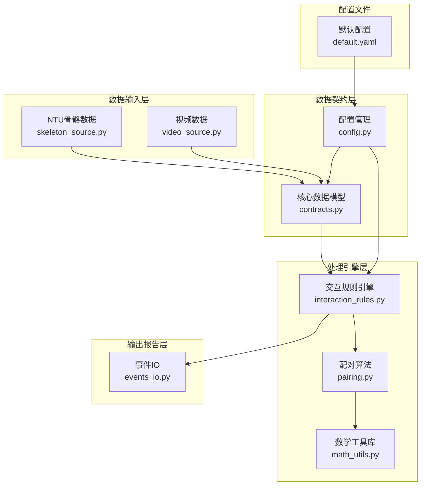

**图表来源**
- [contracts.py:1-241](file://src/fightguard/contracts.py#L1-L241)
- [skeleton_source.py:1-331](file://src/fightguard/inputs/skeleton_source.py#L1-L331)
- [video_source.py:1-193](file://src/fightguard/inputs/video_source.py#L1-L193)

**章节来源**
- [contracts.py:1-241](file://src/fightguard/contracts.py#L1-L241)
- [default.yaml:1-62](file://configs/default.yaml#L1-L62)

## 核心数据模型

### COCO-17关键点标准

项目严格遵循COCO-17关键点标准，建立了统一的关键点命名体系：

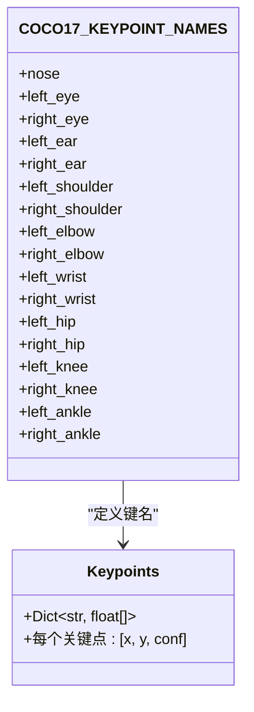

**图表来源**
- [contracts.py:24-47](file://src/fightguard/contracts.py#L24-L47)
- [contracts.py:59](file://src/fightguard/contracts.py#L59)

### Keypoints数据结构

Keypoints是单帧单人的核心数据结构，采用字典格式存储关键点坐标：

| 关键点 | 描述 | 坐标含义 |
|--------|------|----------|
| nose | 鼻子 | [x, y, conf] |
| left_shoulder/right_shoulder | 肩膀 | [x, y, conf] |
| left_elbow/right_elbow | 肘部 | [x, y, conf] |
| left_wrist/right_wrist | 手腕 | [x, y, conf] |
| left_hip/right_hip | 髋关节 | [x, y, conf] |
| left_knee/right_knee | 膝盖 | [x, y, conf] |
| left_ankle/right_ankle | 脚踝 | [x, y, conf] |

### SkeletonTrack轨迹模型

SkeletonTrack表示单人在多帧内的骨骼轨迹，包含完整的时空信息：

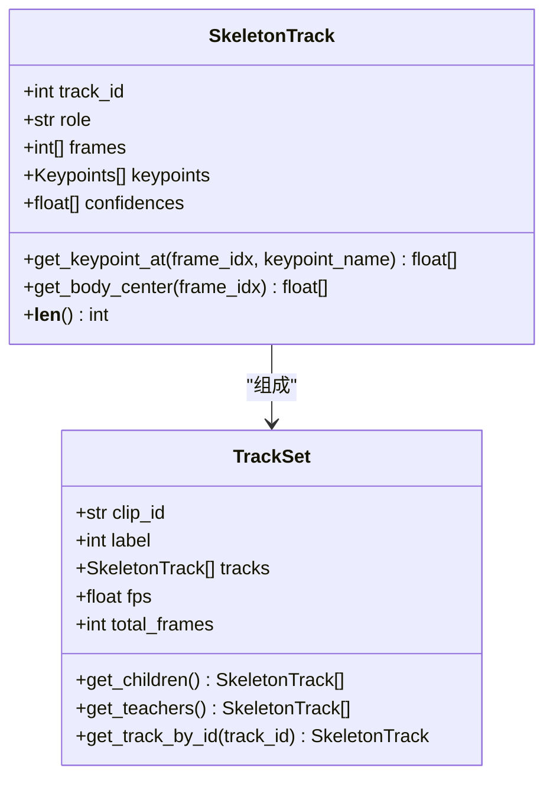

**图表来源**
- [contracts.py:96-148](file://src/fightguard/contracts.py#L96-L148)
- [contracts.py:154-186](file://src/fightguard/contracts.py#L154-L186)

### InteractionEvent事件模型

InteractionEvent描述检测到的冲突或异常事件，提供完整的事件上下文信息：

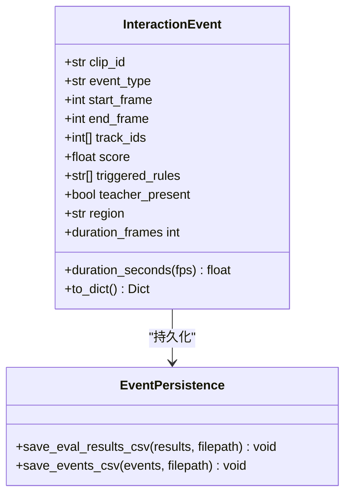

**图表来源**
- [contracts.py:192-241](file://src/fightguard/contracts.py#L192-L241)
- [events_io.py:12-36](file://src/fightguard/reporting/events_io.py#L12-L36)

**章节来源**
- [contracts.py:56-241](file://src/fightguard/contracts.py#L56-L241)

## 架构概览

KidGuard的数据处理架构采用流水线模式，从数据输入到最终输出形成完整的数据链路：

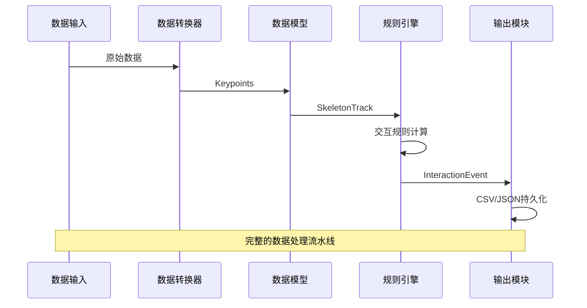

**图表来源**
- [skeleton_source.py:211-274](file://src/fightguard/inputs/skeleton_source.py#L211-L274)
- [video_source.py:57-192](file://src/fightguard/inputs/video_source.py#L57-L192)
- [interaction_rules.py:410-503](file://src/fightguard/detection/interaction_rules.py#L410-L503)

## 详细组件分析

### 数据转换组件

#### NTU骨骼数据转换器

NTU骨骼数据转换器负责将NTU RGBD数据集的标准格式转换为项目内部的统一格式：

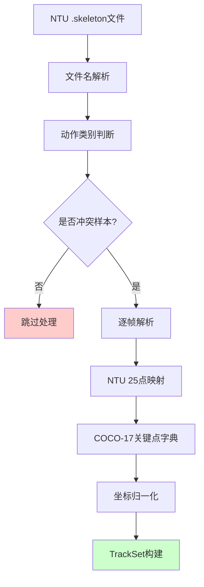

**图表来源**
- [skeleton_source.py:64-274](file://src/fightguard/inputs/skeleton_source.py#L64-L274)

#### 视频骨骼提取器

视频骨骼提取器使用YOLOv8-Pose模型进行实时骨骼关键点检测：

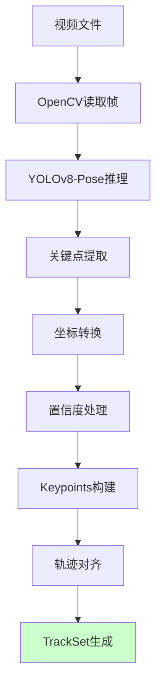

**图表来源**
- [video_source.py:57-192](file://src/fightguard/inputs/video_source.py#L57-L192)

**章节来源**
- [skeleton_source.py:1-331](file://src/fightguard/inputs/skeleton_source.py#L1-L331)
- [video_source.py:1-193](file://src/fightguard/inputs/video_source.py#L1-L193)

### 规则引擎组件

#### 交互规则计算流程

交互规则引擎实现了基于物理特征的状态机检测算法：

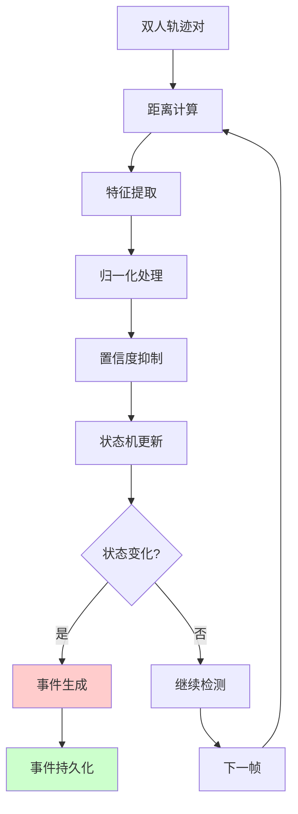

**图表来源**
- [interaction_rules.py:410-503](file://src/fightguard/detection/interaction_rules.py#L410-L503)

#### 物理特征计算模块

系统实现了多种物理特征的计算方法：

| 特征类型 | 计算方法 | 应用场景 |
|----------|----------|----------|
| 肢体加速度 | 二阶差分计算 | 检测突然的动作变化 |
| 关节角加速度 | 角度差分计算 | 分析关节运动模式 |
| 躯干倾斜变化 | 颈部-骨盆角度变化 | 评估身体姿态稳定性 |
| 骨盆速度 | 位移差分计算 | 监测移动速度特征 |
| 相对接近速度 | 距离差分计算 | 评估接近行为 |

**章节来源**
- [interaction_rules.py:38-531](file://src/fightguard/detection/interaction_rules.py#L38-L531)

## 数据转换机制

### 坐标系转换

项目实现了多种坐标系之间的安全转换：

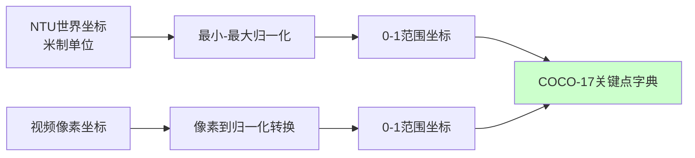

**图表来源**
- [skeleton_source.py:174-204](file://src/fightguard/inputs/skeleton_source.py#L174-L204)
- [video_source.py:137-151](file://src/fightguard/inputs/video_source.py#L137-L151)

### 数据格式转换

系统提供了多种数据格式之间的转换能力：

| 输入格式 | 输出格式 | 转换函数 | 处理步骤 |
|----------|----------|----------|----------|
| NTU数组 | Keypoints | keypoints_from_array | 映射+验证 |
| 视频帧 | Keypoints | YOLOv8-Pose推理 | 检测+提取 |
| Keypoints | 轨迹序列 | SkeletonTrack构造 | 组装+对齐 |
| 轨迹序列 | 事件记录 | InteractionEvent | 规则计算+持久化 |

**章节来源**
- [contracts.py:67-90](file://src/fightguard/contracts.py#L67-L90)
- [skeleton_source.py:120-171](file://src/fightguard/inputs/skeleton_source.py#L120-L171)

## 数据验证与约束

### 数据完整性验证

系统在多个环节实施数据验证机制：

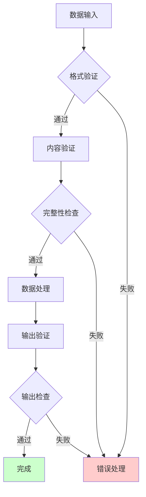

**图表来源**
- [skeleton_source.py:87-88](file://src/fightguard/inputs/skeleton_source.py#L87-L88)
- [video_source.py:82-84](file://src/fightguard/inputs/video_source.py#L82-L84)

### 关键约束规则

系统实施以下关键约束规则：

1. **关键点数量约束**：Keypoints必须包含COCO-17标准的17个关键点
2. **坐标范围约束**：坐标值必须在0-1范围内
3. **置信度约束**：置信度值必须在0-1范围内
4. **时间对齐约束**：所有轨迹必须按帧序对齐
5. **角色约束**：track_id必须唯一且有意义

**章节来源**
- [contracts.py:85-89](file://src/fightguard/contracts.py#L85-L89)
- [skeleton_source.py:152-165](file://src/fightguard/inputs/skeleton_source.py#L152-L165)

## 性能考量

### 内存优化策略

系统采用了多项内存优化技术：

1. **延迟加载**：配置文件和模型采用延迟加载机制
2. **数据对齐**：统一帧数对齐减少内存碎片
3. **缓存机制**：配置和模型结果缓存避免重复计算
4. **增量处理**：支持大数据集的增量处理模式

### 处理效率优化

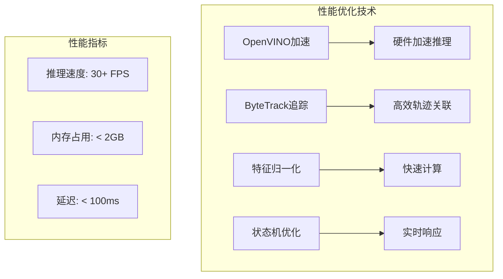

**图表来源**
- [video_source.py:41-49](file://src/fightguard/inputs/video_source.py#L41-L49)
- [pairing.py:14-53](file://src/fightguard/detection/pairing.py#L14-L53)

## 故障排除指南

### 常见问题诊断

| 问题类型 | 症状表现 | 可能原因 | 解决方案 |
|----------|----------|----------|----------|
| 数据读取失败 | 文件无法打开 | 路径错误/权限不足 | 检查文件路径和权限 |
| 模型加载失败 | 推理报错 | 模型文件损坏 | 重新下载模型文件 |
| 轨迹对齐错误 | 帧数不匹配 | 追踪器配置不当 | 调整追踪器参数 |
| 事件检测异常 | 结果不稳定 | 阈值设置不合理 | 调整规则阈值 |

### 调试工具

系统提供了完善的调试工具和诊断功能：

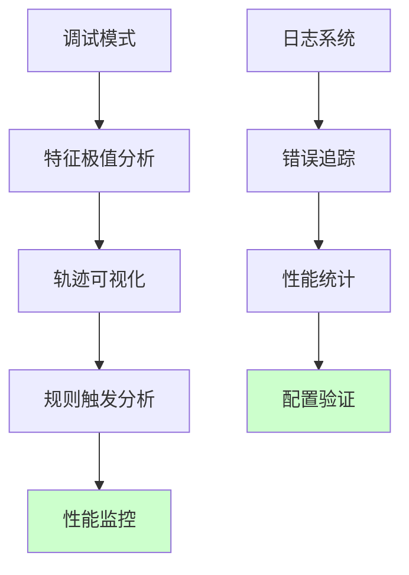

**图表来源**
- [test_skeleton.py:44-71](file://test_skeleton.py#L44-L71)

**章节来源**
- [test_skeleton.py:1-94](file://test_skeleton.py#L1-L94)

## 结论

KidGuard项目的数据契约设计成功实现了以下目标：

1. **统一性**：通过COCO-17标准确保了关键点命名的一致性
2. **安全性**：严格的类型检查和边界验证保证了数据完整性
3. **可扩展性**：模块化设计支持新数据源和新算法的无缝集成
4. **性能**：优化的内存管理和硬件加速提升了系统响应速度
5. **可维护性**：清晰的接口定义和完善的文档支持长期维护

未来发展方向包括：
- 支持更多数据源格式
- 增强模型的自适应能力
- 优化实时处理性能
- 扩展事件类型的多样性