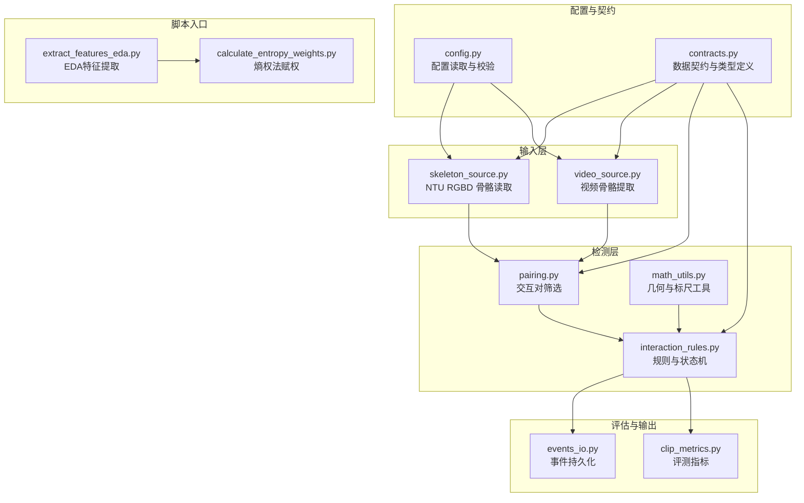
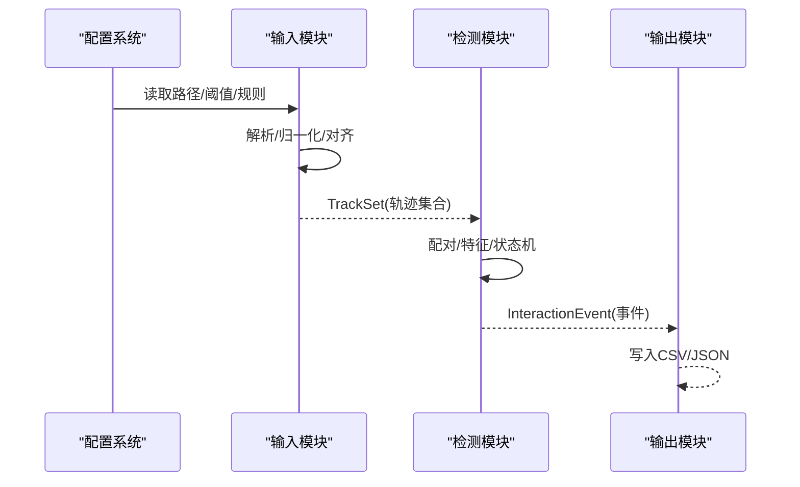
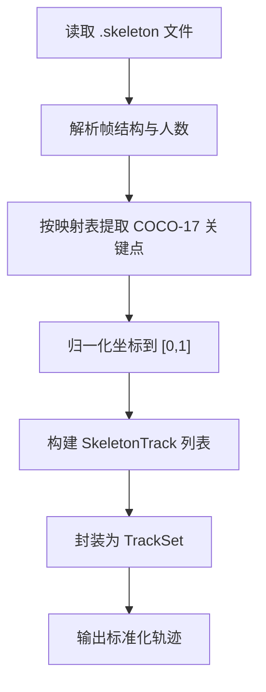
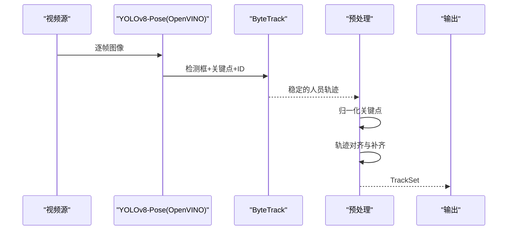
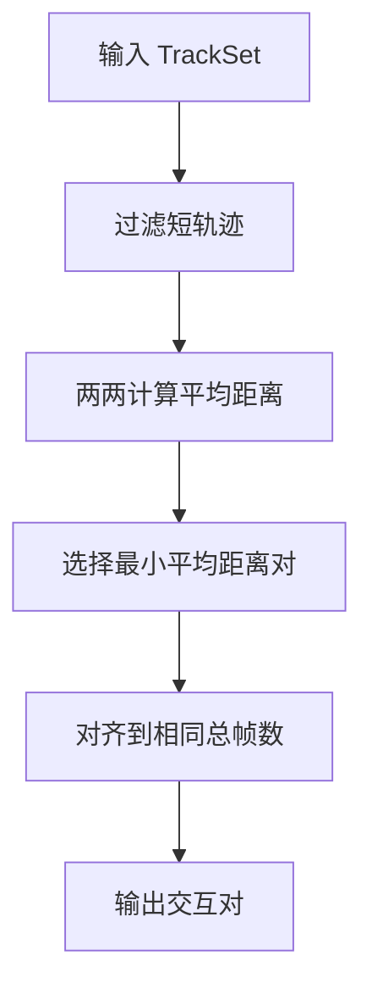
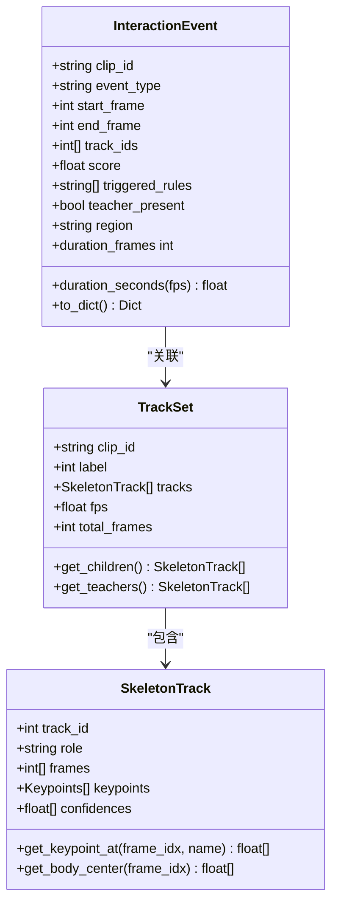
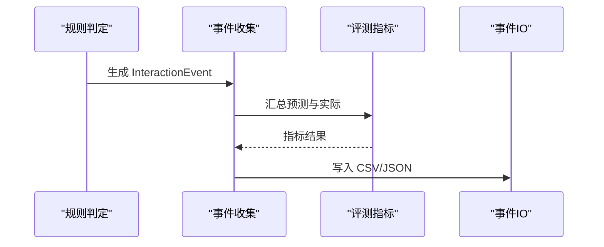
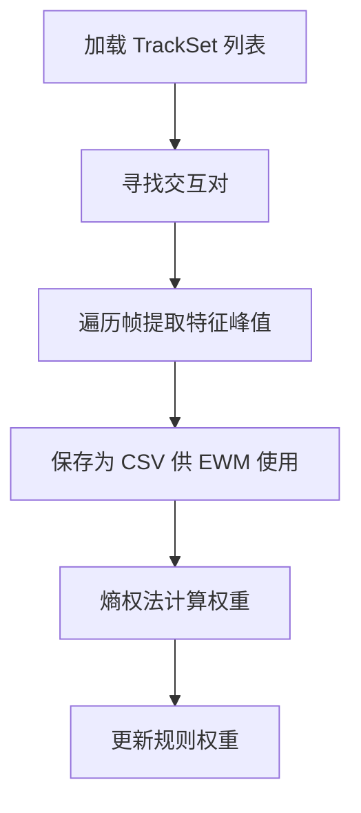
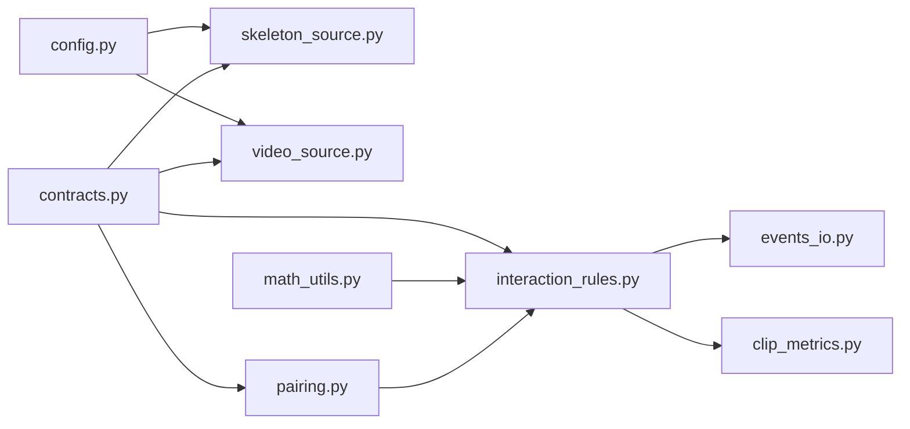

# 数据流设计

<cite>
**本文引用的文件**
- [README.md](file://README.md)
- [default.yaml](file://configs/default.yaml)
- [config.py](file://src/fightguard/config.py)
- [contracts.py](file://src/fightguard/contracts.py)
- [skeleton_source.py](file://src/fightguard/inputs/skeleton_source.py)
- [video_source.py](file://src/fightguard/inputs/video_source.py)
- [pairing.py](file://src/fightguard/detection/pairing.py)
- [interaction_rules.py](file://src/fightguard/detection/interaction_rules.py)
- [math_utils.py](file://src/fightguard/detection/math_utils.py)
- [clip_metrics.py](file://src/fightguard/evaluation/clip_metrics.py)
- [events_io.py](file://src/fightguard/reporting/events_io.py)
- [extract_features_eda.py](file://scripts/extract_features_eda.py)
- [calculate_entropy_weights.py](file://scripts/calculate_entropy_weights.py)
</cite>

## 目录
1. [简介](#简介)
2. [项目结构](#项目结构)
3. [核心组件](#核心组件)
4. [架构总览](#架构总览)
5. [详细组件分析](#详细组件分析)
6. [依赖分析](#依赖分析)
7. [性能考虑](#性能考虑)
8. [故障排查指南](#故障排查指南)
9. [结论](#结论)
10. [附录](#附录)

## 简介
本文件面向 KidGuard 项目的“数据流设计”，系统性描述从数据输入到最终输出的完整处理流程，覆盖 NTU RGBD 骨骼数据与实时视频数据两条路径。文档重点阐述：
- 数据预处理：关键点提取、坐标归一化、轨迹对齐与补齐
- 中间处理：人员配对、特征计算、规则判定与状态机
- 数据在模块间的流转：格式转换、参数传递与状态管理
- 数据质量控制与异常处理策略
- 性能优化点与瓶颈分析

## 项目结构
项目采用“配置-契约-输入-检测-评估-输出”的分层组织，核心模块职责清晰、边界明确，便于扩展与维护。

图表来源
- [config.py:32-82](file://src/fightguard/config.py#L32-L82)
- [contracts.py:56-241](file://src/fightguard/contracts.py#L56-L241)
- [skeleton_source.py:211-274](file://src/fightguard/inputs/skeleton_source.py#L211-L274)
- [video_source.py:57-192](file://src/fightguard/inputs/video_source.py#L57-L192)
- [pairing.py:14-53](file://src/fightguard/detection/pairing.py#L14-L53)
- [interaction_rules.py:410-503](file://src/fightguard/detection/interaction_rules.py#L410-L503)
- [math_utils.py:10-52](file://src/fightguard/detection/math_utils.py#L10-L52)
- [clip_metrics.py:9-46](file://src/fightguard/evaluation/clip_metrics.py#L9-L46)
- [events_io.py:12-35](file://src/fightguard/reporting/events_io.py#L12-L35)
- [extract_features_eda.py:28-102](file://scripts/extract_features_eda.py#L28-L102)
- [calculate_entropy_weights.py:12-67](file://scripts/calculate_entropy_weights.py#L12-L67)

章节来源
- [README.md:46-98](file://README.md#L46-L98)
- [default.yaml:1-62](file://configs/default.yaml#L1-L62)

## 核心组件
- 配置系统：集中读取与校验配置，提供全局访问接口，支持热重载。
- 数据契约：统一关键点、轨迹、事件等数据结构，确保模块间数据一致性。
- 输入模块：分别处理 NTU RGBD 骨骼文件与实时视频，输出标准化 TrackSet。
- 检测模块：配对交互人员，计算物理特征，应用规则与状态机，生成事件。
- 评估与输出：计算评测指标，持久化事件与结果。

章节来源
- [config.py:32-82](file://src/fightguard/config.py#L32-L82)
- [contracts.py:56-241](file://src/fightguard/contracts.py#L56-L241)
- [skeleton_source.py:211-274](file://src/fightguard/inputs/skeleton_source.py#L211-L274)
- [video_source.py:57-192](file://src/fightguard/inputs/video_source.py#L57-L192)
- [pairing.py:14-53](file://src/fightguard/detection/pairing.py#L14-L53)
- [interaction_rules.py:410-503](file://src/fightguard/detection/interaction_rules.py#L410-L503)
- [clip_metrics.py:9-46](file://src/fightguard/evaluation/clip_metrics.py#L9-L46)
- [events_io.py:12-35](file://src/fightguard/reporting/events_io.py#L12-L35)

## 架构总览
KidGuard 的数据流分为两条主线：
- NTU RGBD 骨骼数据：文件解析 → 坐标归一化 → 构建轨迹 → 人员配对 → 特征提取与规则判定 → 事件输出
- 实时视频数据：视频读取 → YOLOv8-Pose 推理 → 关键点归一化 → 轨迹对齐与补齐 → 人员配对 → 特征提取与规则判定 → 事件输出

图表来源
- [config.py:32-82](file://src/fightguard/config.py#L32-L82)
- [skeleton_source.py:211-274](file://src/fightguard/inputs/skeleton_source.py#L211-L274)
- [video_source.py:57-192](file://src/fightguard/inputs/video_source.py#L57-L192)
- [pairing.py:14-53](file://src/fightguard/detection/pairing.py#L14-L53)
- [interaction_rules.py:410-503](file://src/fightguard/detection/interaction_rules.py#L410-L503)
- [events_io.py:23-35](file://src/fightguard/reporting/events_io.py#L23-L35)

## 详细组件分析

### NTU RGBD 骨骼数据流
- 输入解析：解析 .skeleton 文件帧结构，按 NTU 25 点映射到 COCO-17 名称，构建每帧关键点字典。
- 归一化：对每帧关键点坐标执行最小-最大归一化，统一到 [0,1]，保留置信度。
- 轨迹构建：按人员 ID 组织 SkeletonTrack，填充 TrackSet。
- 质量控制：过滤无效帧、缺失关键点，保证后续计算稳定性。

图表来源
- [skeleton_source.py:120-204](file://src/fightguard/inputs/skeleton_source.py#L120-L204)
- [skeleton_source.py:211-274](file://src/fightguard/inputs/skeleton_source.py#L211-L274)

章节来源
- [skeleton_source.py:211-274](file://src/fightguard/inputs/skeleton_source.py#L211-L274)

### 实时视频数据流
- 视频读取：使用 OpenCV 逐帧读取视频，获取 FPS、分辨率与总帧数。
- 推理与追踪：YOLOv8-Pose（OpenVINO 加速）推理，结合 ByteTrack 追踪器维持人员 ID。
- 关键点归一化：将检测到的关键点坐标归一化到 [0,1]，并保留置信度。
- 轨迹对齐与补齐：将所有轨迹对齐到相同总帧数，缺失帧用空关键点填充，确保严格的时间对齐。
- 输出：生成 TrackSet，供后续检测模块使用。

图表来源
- [video_source.py:57-192](file://src/fightguard/inputs/video_source.py#L57-L192)

章节来源
- [video_source.py:57-192](file://src/fightguard/inputs/video_source.py#L57-L192)

### 人员配对与轨迹对齐
- 配对策略：统计每条轨迹的有效存活帧数，过滤短轨迹；在有效轨迹中计算两两平均距离，选择平均距离最小的一对作为交互对。
- 轨迹对齐：将所有轨迹补齐到相同长度，确保第 i 帧严格对应物理时间 i，避免时间错位导致的误判。

图表来源
- [pairing.py:14-53](file://src/fightguard/detection/pairing.py#L14-L53)

章节来源
- [pairing.py:14-53](file://src/fightguard/detection/pairing.py#L14-L53)

### 物理特征与规则判定
- 特征提取：计算肢体加速度、相对接近速度、关节角加速度、躯干倾角变化、骨盆速度等，均按肩宽尺度归一化。
- 置信度抑制：基于平均关键点置信度动态调整得分，抑制低质量帧的影响。
- 状态机：四段式状态机（接近、动作激活、作用-响应、事件确认），严格同步因果律，避免瞬时噪声误报。
- 事件生成：当状态进入“作用-响应”且平滑得分超过阈值时，记录事件起止帧与触发规则。

图表来源
- [contracts.py:96-186](file://src/fightguard/contracts.py#L96-L186)
- [contracts.py:192-241](file://src/fightguard/contracts.py#L192-L241)

章节来源
- [interaction_rules.py:363-408](file://src/fightguard/detection/interaction_rules.py#L363-L408)
- [interaction_rules.py:410-503](file://src/fightguard/detection/interaction_rules.py#L410-L503)
- [math_utils.py:10-52](file://src/fightguard/detection/math_utils.py#L10-L52)
- [contracts.py:96-186](file://src/fightguard/contracts.py#L96-L186)
- [contracts.py:192-241](file://src/fightguard/contracts.py#L192-L241)

### 评测指标与事件输出
- 评测指标：基于 TP/FP/TN/FN 计算准确率、精确率、召回率、FPR、F1。
- 事件输出：将事件写入 CSV，包含片段 ID、事件类型、起止帧、持续帧、涉及人员、置信度、触发规则等字段。

图表来源
- [interaction_rules.py:477-501](file://src/fightguard/detection/interaction_rules.py#L477-L501)
- [clip_metrics.py:9-46](file://src/fightguard/evaluation/clip_metrics.py#L9-L46)
- [events_io.py:23-35](file://src/fightguard/reporting/events_io.py#L23-L35)

章节来源
- [clip_metrics.py:9-46](file://src/fightguard/evaluation/clip_metrics.py#L9-L46)
- [events_io.py:12-35](file://src/fightguard/reporting/events_io.py#L12-L35)

### 数据驱动的特征提取与赋权
- 特征提取：遍历数据集，提取四个核心特征的峰值，形成特征矩阵。
- 熵权法：基于信息熵客观计算权重，消除主观经验带来的偏差。

图表来源
- [extract_features_eda.py:28-102](file://scripts/extract_features_eda.py#L28-L102)
- [calculate_entropy_weights.py:12-67](file://scripts/calculate_entropy_weights.py#L12-L67)

章节来源
- [extract_features_eda.py:28-102](file://scripts/extract_features_eda.py#L28-L102)
- [calculate_entropy_weights.py:12-67](file://scripts/calculate_entropy_weights.py#L12-L67)

## 依赖分析
- 模块耦合：输入模块依赖配置与契约；检测模块依赖契约与数学工具；输出模块依赖契约与配置。
- 外部依赖：OpenCV、Ultralytics YOLOv8、Pandas/Numpy（熵权法）、tqdm（进度显示）。
- 循环依赖：数学工具为纯函数，避免循环导入；检测模块通过函数调用而非类继承耦合。

图表来源
- [config.py:32-82](file://src/fightguard/config.py#L32-L82)
- [contracts.py:56-241](file://src/fightguard/contracts.py#L56-L241)
- [skeleton_source.py:211-274](file://src/fightguard/inputs/skeleton_source.py#L211-L274)
- [video_source.py:57-192](file://src/fightguard/inputs/video_source.py#L57-L192)
- [pairing.py:14-53](file://src/fightguard/detection/pairing.py#L14-L53)
- [interaction_rules.py:410-503](file://src/fightguard/detection/interaction_rules.py#L410-L503)
- [math_utils.py:10-52](file://src/fightguard/detection/math_utils.py#L10-L52)
- [events_io.py:23-35](file://src/fightguard/reporting/events_io.py#L23-L35)
- [clip_metrics.py:9-46](file://src/fightguard/evaluation/clip_metrics.py#L9-L46)

章节来源
- [config.py:32-82](file://src/fightguard/config.py#L32-L82)
- [contracts.py:56-241](file://src/fightguard/contracts.py#L56-L241)
- [skeleton_source.py:211-274](file://src/fightguard/inputs/skeleton_source.py#L211-L274)
- [video_source.py:57-192](file://src/fightguard/inputs/video_source.py#L57-L192)
- [pairing.py:14-53](file://src/fightguard/detection/pairing.py#L14-L53)
- [interaction_rules.py:410-503](file://src/fightguard/detection/interaction_rules.py#L410-L503)
- [math_utils.py:10-52](file://src/fightguard/detection/math_utils.py#L10-L52)
- [events_io.py:23-35](file://src/fightguard/reporting/events_io.py#L23-L35)
- [clip_metrics.py:9-46](file://src/fightguard/evaluation/clip_metrics.py#L9-L46)

## 性能考虑
- 模型加速：YOLOv8-Pose 使用 OpenVINO 加速，显著降低推理延迟，适合 CPU 环境。
- 追踪优化：采用 ByteTrack 追踪器，提升低分检测框的稳定性，减少重叠场景下的轨迹断裂。
- 轨迹对齐：统一补齐到相同总帧数，避免后续窗口化/滑动计算的边界问题，减少额外修复成本。
- 缓存与懒加载：配置与 YOLO 模型采用模块级缓存，避免重复 IO 与初始化开销。
- 特征归一化：使用肩宽尺度归一化，减少不同身高个体带来的尺度差异，提升鲁棒性。
- 状态机平滑：对事件得分进行滑动平均，降低瞬时噪声对事件判定的影响。

[本节为通用性能讨论，不直接分析具体文件，故无章节来源]

## 故障排查指南
- 配置文件缺失或格式错误：检查配置文件是否存在与结构是否完整，确保必需字段齐全。
- NTU 文件读取失败：确认文件名符合标准格式，检查目录扫描与异常捕获逻辑。
- 视频读取失败：确认视频路径可访问，OpenCV 能正常打开视频；若未检测到人，检查模型与追踪器配置。
- 事件为空：检查配对逻辑与状态机阈值，确认轨迹对齐与补齐是否正确执行。
- 输出为空：确认输出开关与路径权限，检查 CSV 写入逻辑。

章节来源
- [config.py:60-82](file://src/fightguard/config.py#L60-L82)
- [skeleton_source.py:313-325](file://src/fightguard/inputs/skeleton_source.py#L313-L325)
- [video_source.py:80-84](file://src/fightguard/inputs/video_source.py#L80-L84)
- [pairing.py:17-28](file://src/fightguard/detection/pairing.py#L17-L28)
- [events_io.py:12-35](file://src/fightguard/reporting/events_io.py#L12-L35)

## 结论
KidGuard 的数据流设计以“契约驱动、配置统一、模块解耦”为核心原则，实现了从 NTU RGBD 与实时视频两类输入到冲突事件的完整闭环。通过严格的坐标归一化、轨迹对齐、人员配对与状态机判定，系统在保证可解释性的同时提升了鲁棒性与可扩展性。建议后续在追踪稳定性、特征融合与可视化方面持续优化。

[本节为总结性内容，不直接分析具体文件，故无章节来源]

## 附录
- 关键配置项（摘自配置文件）：规则阈值、状态机参数、输出设置、数据集定义、追踪器配置等。
- 数据契约要点：Keypoints、SkeletonTrack、TrackSet、InteractionEvent 的字段与行为。

章节来源
- [default.yaml:1-62](file://configs/default.yaml#L1-L62)
- [contracts.py:56-241](file://src/fightguard/contracts.py#L56-L241)