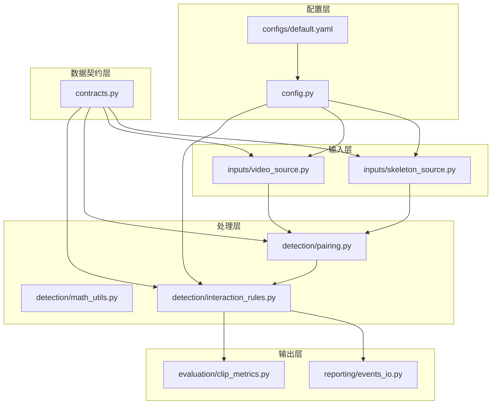
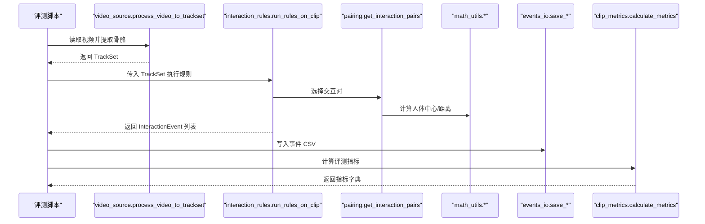
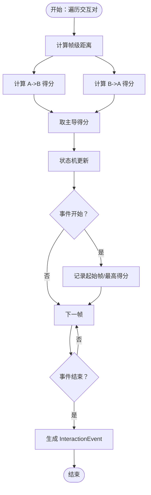
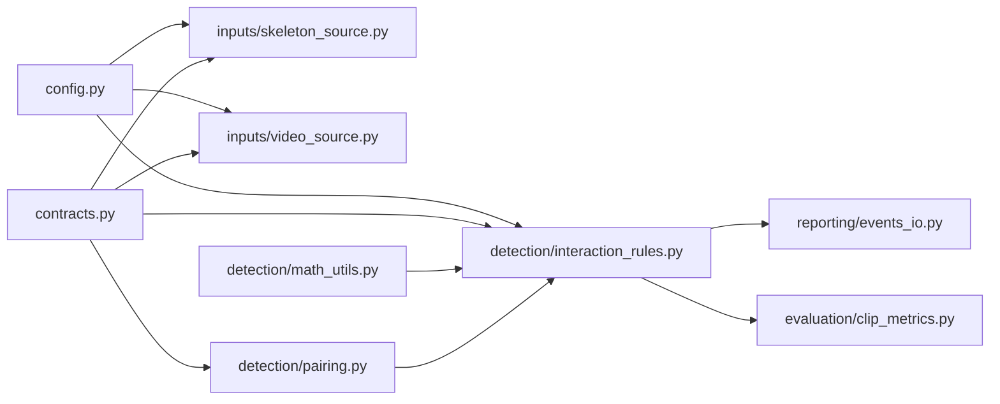

# 模块关系与交互

<cite>
**本文引用的文件**
- [src/fightguard/config.py](file://src/fightguard/config.py)
- [src/fightguard/contracts.py](file://src/fightguard/contracts.py)
- [src/fightguard/inputs/skeleton_source.py](file://src/fightguard/inputs/skeleton_source.py)
- [src/fightguard/inputs/video_source.py](file://src/fightguard/inputs/video_source.py)
- [src/fightguard/detection/pairing.py](file://src/fightguard/detection/pairing.py)
- [src/fightguard/detection/math_utils.py](file://src/fightguard/detection/math_utils.py)
- [src/fightguard/detection/interaction_rules.py](file://src/fightguard/detection/interaction_rules.py)
- [src/fightguard/reporting/events_io.py](file://src/fightguard/reporting/events_io.py)
- [src/fightguard/evaluation/clip_metrics.py](file://src/fightguard/evaluation/clip_metrics.py)
- [configs/default.yaml](file://configs/default.yaml)
- [scripts/debug_single_video.py](file://scripts/debug_single_video.py)
- [scripts/eval_video_dataset.py](file://scripts/eval_video_dataset.py)
</cite>

## 目录
1. [简介](#简介)
2. [项目结构](#项目结构)
3. [核心组件](#核心组件)
4. [架构总览](#架构总览)
5. [详细组件分析](#详细组件分析)
6. [依赖关系分析](#依赖关系分析)
7. [性能考量](#性能考量)
8. [故障排查指南](#故障排查指南)
9. [结论](#结论)
10. [附录](#附录)

## 简介
本文件面向 KidGuard 项目，系统化梳理模块关系与交互，明确输入层、处理层、输出层的职责划分与协作模式。重点解释以下模块的边界与耦合：
- config 模块：全局配置中心，提供统一配置读取与校验
- contracts 模块：数据契约，定义跨模块的数据结构与类型别名
- inputs 模块：数据输入，负责骨骼与视频数据的读取与标准化
- detection 模块：冲突检测，执行规则与状态机，生成交互事件
- reporting 模块：输出结果，负责事件与评测指标的持久化

## 项目结构
项目采用按功能域分层的组织方式：
- configs：全局配置文件
- data：输入数据目录（骨架与视频）
- outputs：输出目录（事件与指标）
- scripts：评测与调试脚本
- src/fightguard：核心业务代码，按领域划分子模块

图表来源
- [src/fightguard/config.py:32-82](file://src/fightguard/config.py#L32-L82)
- [configs/default.yaml:1-62](file://configs/default.yaml#L1-L62)
- [src/fightguard/contracts.py:56-241](file://src/fightguard/contracts.py#L56-L241)
- [src/fightguard/inputs/skeleton_source.py:22-29](file://src/fightguard/inputs/skeleton_source.py#L22-L29)
- [src/fightguard/inputs/video_source.py:19-25](file://src/fightguard/inputs/video_source.py#L19-L25)
- [src/fightguard/detection/pairing.py:1-54](file://src/fightguard/detection/pairing.py#L1-L54)
- [src/fightguard/detection/math_utils.py:10-52](file://src/fightguard/detection/math_utils.py#L10-L52)
- [src/fightguard/detection/interaction_rules.py:16-24](file://src/fightguard/detection/interaction_rules.py#L16-L24)
- [src/fightguard/reporting/events_io.py:12-36](file://src/fightguard/reporting/events_io.py#L12-L36)
- [src/fightguard/evaluation/clip_metrics.py:9-47](file://src/fightguard/evaluation/clip_metrics.py#L9-L47)

章节来源
- [src/fightguard/config.py:32-82](file://src/fightguard/config.py#L32-L82)
- [configs/default.yaml:1-62](file://configs/default.yaml#L1-L62)

## 核心组件
- config 模块
  - 职责：统一读取与缓存配置，提供配置校验与重载能力
  - 关键点：模块级缓存、路径解析、必填字段校验
- contracts 模块
  - 职责：定义跨模块通用数据结构（Keypoints、SkeletonTrack、TrackSet、InteractionEvent）
  - 关键点：COCO-17 关键点常量、类型别名、轨迹与事件的序列化接口
- inputs 模块
  - skeleton_source：读取 NTU RGBD 骨骼文件，映射为 COCO-17，构造 TrackSet
  - video_source：读取真实视频，使用 YOLOv8-Pose（OpenVINO 加速）提取关键点，构造 TrackSet
- detection 模块
  - pairing：筛选交互对，计算帧级距离
  - math_utils：几何与物理标尺计算
  - interaction_rules：规则流与状态机，生成 InteractionEvent
- reporting 模块
  - events_io：将事件与评测结果写入 CSV
- evaluation 模块
  - clip_metrics：计算评测指标（Accuracy/Precision/Recall/FPR/F1）

章节来源
- [src/fightguard/config.py:32-120](file://src/fightguard/config.py#L32-L120)
- [src/fightguard/contracts.py:56-241](file://src/fightguard/contracts.py#L56-L241)
- [src/fightguard/inputs/skeleton_source.py:211-331](file://src/fightguard/inputs/skeleton_source.py#L211-L331)
- [src/fightguard/inputs/video_source.py:57-193](file://src/fightguard/inputs/video_source.py#L57-L193)
- [src/fightguard/detection/pairing.py:14-54](file://src/fightguard/detection/pairing.py#L14-L54)
- [src/fightguard/detection/math_utils.py:10-52](file://src/fightguard/detection/math_utils.py#L10-L52)
- [src/fightguard/detection/interaction_rules.py:363-503](file://src/fightguard/detection/interaction_rules.py#L363-L503)
- [src/fightguard/reporting/events_io.py:12-36](file://src/fightguard/reporting/events_io.py#L12-L36)
- [src/fightguard/evaluation/clip_metrics.py:9-47](file://src/fightguard/evaluation/clip_metrics.py#L9-L47)

## 架构总览
系统采用“配置驱动 + 数据契约 + 分层处理”的架构：
- 输入层：从文件系统读取数据，统一转换为 TrackSet
- 处理层：基于规则与状态机，生成 InteractionEvent
- 输出层：将事件与指标持久化

图表来源
- [scripts/eval_video_dataset.py:83-102](file://scripts/eval_video_dataset.py#L83-L102)
- [src/fightguard/inputs/video_source.py:57-193](file://src/fightguard/inputs/video_source.py#L57-L193)
- [src/fightguard/detection/interaction_rules.py:410-503](file://src/fightguard/detection/interaction_rules.py#L410-L503)
- [src/fightguard/detection/pairing.py:14-54](file://src/fightguard/detection/pairing.py#L14-L54)
- [src/fightguard/detection/math_utils.py:26-35](file://src/fightguard/detection/math_utils.py#L26-L35)
- [src/fightguard/reporting/events_io.py:12-36](file://src/fightguard/reporting/events_io.py#L12-L36)
- [src/fightguard/evaluation/clip_metrics.py:9-47](file://src/fightguard/evaluation/clip_metrics.py#L9-L47)

## 详细组件分析

### config 模块
- 设计要点
  - 模块级缓存：首次读取后缓存配置，避免重复 IO
  - 路径解析：自动定位默认配置文件
  - 校验：确保必需字段存在
  - 重载：支持运行时重新加载配置
- 数据与控制流
  - 输入：配置文件路径（可选）
  - 输出：配置字典
  - 异常：文件不存在、格式错误、字段缺失
- 性能与可靠性
  - 单次读取 + 缓存，减少磁盘访问
  - 严格的字段校验，降低下游错误概率

章节来源
- [src/fightguard/config.py:32-120](file://src/fightguard/config.py#L32-L120)
- [configs/default.yaml:1-62](file://configs/default.yaml#L1-L62)

### contracts 模块
- 设计要点
  - COCO-17 关键点常量与映射
  - Keypoints 字典格式与工厂方法
  - SkeletonTrack/TrackSet/InteractionEvent 结构化数据模型
  - 事件序列化 to_dict，便于持久化
- 数据与控制流
  - 输入：原始关键点数组或字典
  - 输出：标准化的 Keypoints/SkeletonTrack/TrackSet/InteractionEvent
- 可维护性
  - 统一键名访问，避免硬编码索引
  - 明确的角色与帧索引语义

章节来源
- [src/fightguard/contracts.py:23-241](file://src/fightguard/contracts.py#L23-L241)

### inputs 模块

#### skeleton_source
- 设计要点
  - NTU .skeleton 文件解析与映射
  - 文件名解析与动作类别标签判定
  - 归一化到 [0,1] 坐标系
  - 构造 TrackSet（label 来自配置）
- 数据与控制流
  - 输入：单文件路径或目录列表
  - 输出：TrackSet 列表（过滤 label=-1 的 clip）

章节来源
- [src/fightguard/inputs/skeleton_source.py:211-331](file://src/fightguard/inputs/skeleton_source.py#L211-L331)

#### video_source
- 设计要点
  - OpenVINO 加速的 YOLOv8-Pose 推理
  - ByteTrack 追踪器提升稳定性
  - 时空对齐：将轨迹填充到相同总帧数
  - 构造 TrackSet（fps/帧数来自视频）
- 数据与控制流
  - 输入：视频路径、最大帧数（可选）
  - 输出：TrackSet（若无人则返回 None）

章节来源
- [src/fightguard/inputs/video_source.py:57-193](file://src/fightguard/inputs/video_source.py#L57-L193)

### detection 模块

#### pairing
- 设计要点
  - 交互对筛选：过滤短寿命轨迹，保留至少一定存活帧
  - 帧级距离计算：使用人体中心点（颈部+骨盆中点）欧氏距离
- 数据与控制流
  - 输入：TrackSet、配置
  - 输出：交互对列表

章节来源
- [src/fightguard/detection/pairing.py:14-54](file://src/fightguard/detection/pairing.py#L14-L54)

#### math_utils
- 设计要点
  - 几何与物理标尺：人体中心点、肩宽尺度、欧氏距离
  - 特征归一化工具
- 数据与控制流
  - 输入：关键点字典
  - 输出：几何量或标量

章节来源
- [src/fightguard/detection/math_utils.py:10-52](file://src/fightguard/detection/math_utils.py#L10-L52)

#### interaction_rules
- 设计要点
  - 归一化尺度：双人肩宽平均
  - 物理特征：肢体加速度、相对接近速度、关节角加速度、躯干倾角变化、骨盆速度
  - 置信度抑制：基于平均置信度的 γ 系数
  - 四段式状态机：接近、动作激活、作用-响应、事件确认
  - 主入口：run_rules_on_clip，返回 InteractionEvent 列表
- 数据与控制流
  - 输入：TrackSet、配置
  - 输出：InteractionEvent 列表

图表来源
- [src/fightguard/detection/interaction_rules.py:410-503](file://src/fightguard/detection/interaction_rules.py#L410-L503)
- [src/fightguard/detection/pairing.py:6-12](file://src/fightguard/detection/pairing.py#L6-L12)

章节来源
- [src/fightguard/detection/interaction_rules.py:363-503](file://src/fightguard/detection/interaction_rules.py#L363-L503)

### reporting 模块
- 设计要点
  - 事件 CSV：使用 InteractionEvent.to_dict 序列化
  - 评测明细 CSV：直接写入字典列表
- 数据与控制流
  - 输入：事件列表或评测明细
  - 输出：CSV 文件

章节来源
- [src/fightguard/reporting/events_io.py:12-36](file://src/fightguard/reporting/events_io.py#L12-L36)

### evaluation 模块
- 设计要点
  - 基于 TP/FP/TN/FN 计算 Accuracy/Precision/Recall/FPR/F1
- 数据与控制流
  - 输入：包含 actual/predicted 的结果列表
  - 输出：指标字典

章节来源
- [src/fightguard/evaluation/clip_metrics.py:9-47](file://src/fightguard/evaluation/clip_metrics.py#L9-L47)

## 依赖关系分析
模块间依赖遵循“自顶向下、单向依赖”的原则，避免循环依赖：
- config 与 contracts 为基础设施，被其他模块广泛依赖
- inputs 依赖 contracts 与 config
- detection 依赖 contracts、config、math_utils、pairing
- reporting 依赖 contracts
- evaluation 依赖结果字典

图表来源
- [src/fightguard/config.py:32-82](file://src/fightguard/config.py#L32-L82)
- [src/fightguard/contracts.py:56-241](file://src/fightguard/contracts.py#L56-L241)
- [src/fightguard/inputs/skeleton_source.py:22-29](file://src/fightguard/inputs/skeleton_source.py#L22-L29)
- [src/fightguard/inputs/video_source.py:19-25](file://src/fightguard/inputs/video_source.py#L19-L25)
- [src/fightguard/detection/pairing.py:1-54](file://src/fightguard/detection/pairing.py#L1-L54)
- [src/fightguard/detection/math_utils.py:10-52](file://src/fightguard/detection/math_utils.py#L10-L52)
- [src/fightguard/detection/interaction_rules.py:16-24](file://src/fightguard/detection/interaction_rules.py#L16-L24)
- [src/fightguard/reporting/events_io.py:12-36](file://src/fightguard/reporting/events_io.py#L12-L36)
- [src/fightguard/evaluation/clip_metrics.py:9-47](file://src/fightguard/evaluation/clip_metrics.py#L9-L47)

## 性能考量
- 配置缓存：config 模块仅读取一次，后续复用同一对象，显著降低 IO 成本
- 模型缓存：video_source 模块缓存 YOLOv8-Pose（OpenVINO 加速）模型实例，避免重复加载
- 追踪优化：ByteTrack 提升低分检测框的稳定性，减少误配对
- 时空对齐：将轨迹填充到相同总帧数，保证索引一致性，避免额外的帧对齐开销
- 状态机平滑：通过滑动窗口平滑得分，降低瞬时噪声影响
- I/O 批处理：评测脚本使用多线程秒表与进度条，改善用户体验

## 故障排查指南
- 配置相关
  - 症状：配置文件缺失或字段不全
  - 处理：检查 default.yaml 是否存在，确认 dataset、rules、output、paths 等字段齐全
- 视频推理失败
  - 症状：process_video_to_trackset 返回 None
  - 处理：确认视频路径正确、OpenVINO 模型可用、ByteTrack 配置有效
- 无人检测
  - 症状：视频中未检测到任何人
  - 处理：降低检测阈值或调整追踪器参数
- 事件为空
  - 症状：run_rules_on_clip 返回空列表
  - 处理：使用 debug_single_video.py 逐帧回放状态机，定位是配对、置信度、状态机哪个环节导致得分始终为 0
- 指标异常
  - 症状：评测指标偏低
  - 处理：检查标签与预测逻辑，核对阈值与平滑窗口设置

章节来源
- [src/fightguard/config.py:60-82](file://src/fightguard/config.py#L60-L82)
- [src/fightguard/inputs/video_source.py:80-96](file://src/fightguard/inputs/video_source.py#L80-L96)
- [scripts/debug_single_video.py:18-81](file://scripts/debug_single_video.py#L18-L81)

## 结论
KidGuard 通过“配置中心 + 数据契约 + 分层处理 + 输出持久化”的架构，实现了从视频/骨骼数据到冲突事件的端到端流水线。模块间职责清晰、依赖单向、接口稳定，具备良好的可扩展性与可维护性。建议后续在追踪器与规则阈值上继续迭代，结合调试脚本进行精细化调参。

## 附录

### 模块解耦设计原则
- 依赖倒置：高层模块仅依赖抽象（contracts），不依赖具体实现
- 单一职责：每个模块聚焦单一领域（输入/处理/输出）
- 配置驱动：规则与阈值集中管理，便于热更新与调参
- 接口稳定：通过 contracts 统一数据契约，避免内部实现变更影响外部

### 扩展性考虑
- 新输入源：实现新的输入模块，遵循 contracts 接口，即可无缝接入
- 新规则：在 detection/interaction_rules 中扩展特征与状态机，不影响其他模块
- 新输出：新增 reporting 模块，遵循事件契约即可
- 新评测：扩展 evaluation 模块，支持更多指标