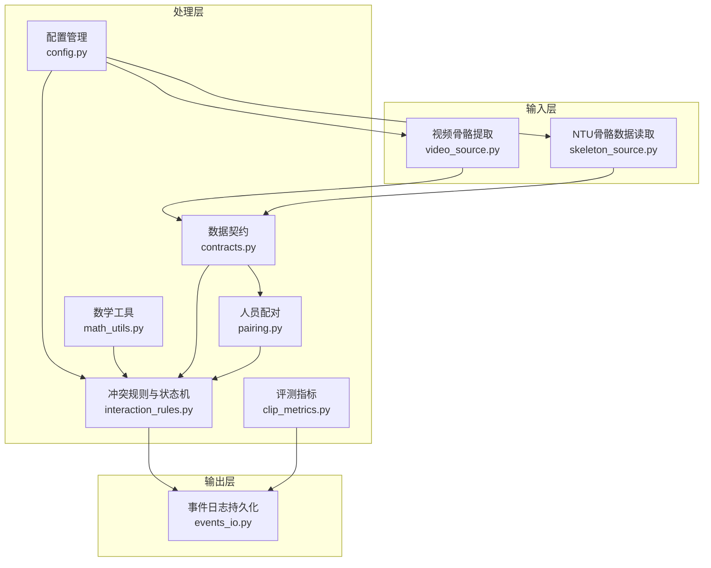
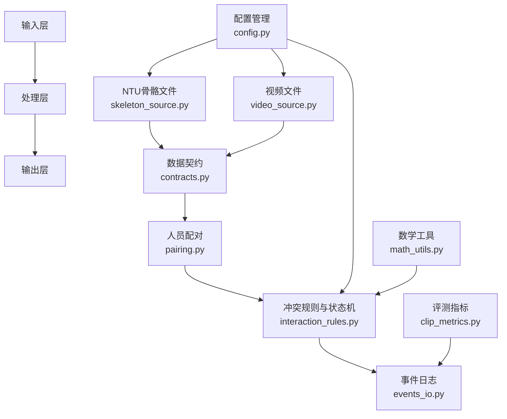
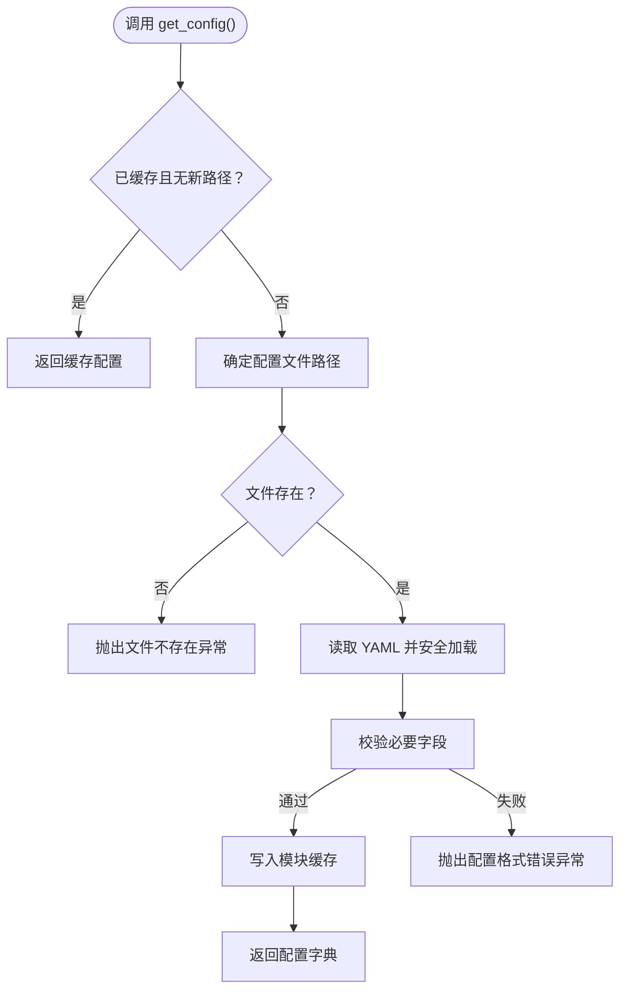
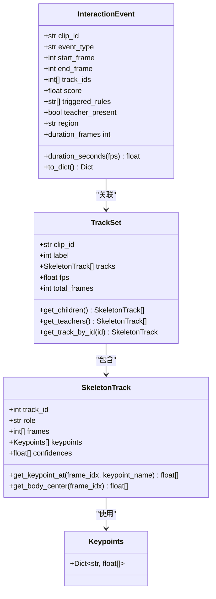
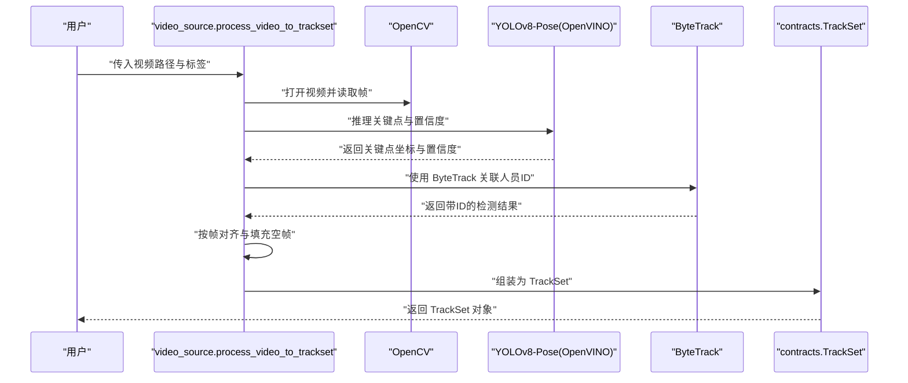
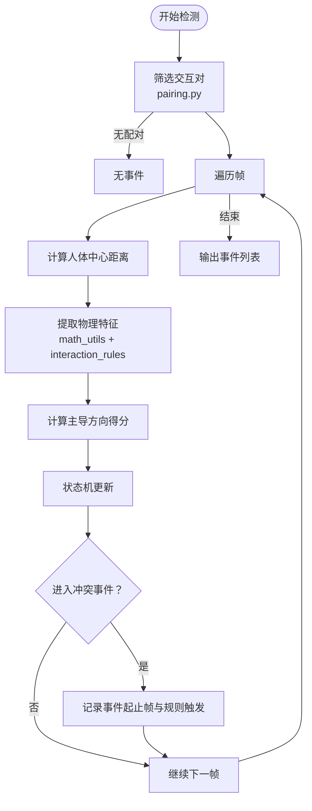
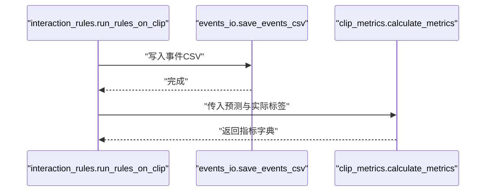
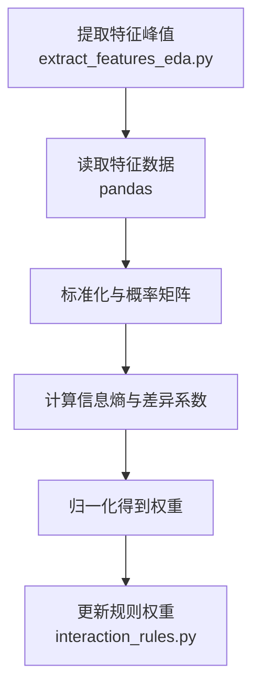
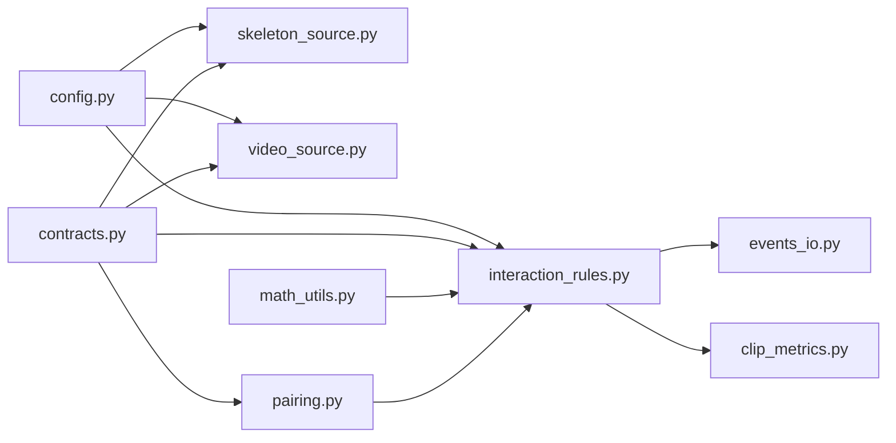

# 系统架构设计

<cite>
**本文引用的文件**
- [README.md](file://README.md)
- [default.yaml](file://configs/default.yaml)
- [config.py](file://src/fightguard/config.py)
- [contracts.py](file://src/fightguard/contracts.py)
- [skeleton_source.py](file://src/fightguard/inputs/skeleton_source.py)
- [video_source.py](file://src/fightguard/inputs/video_source.py)
- [pairing.py](file://src/fightguard/detection/pairing.py)
- [interaction_rules.py](file://src/fightguard/detection/interaction_rules.py)
- [math_utils.py](file://src/fightguard/detection/math_utils.py)
- [clip_metrics.py](file://src/fightguard/evaluation/clip_metrics.py)
- [events_io.py](file://src/fightguard/reporting/events_io.py)
- [extract_features_eda.py](file://scripts/extract_features_eda.py)
- [calculate_entropy_weights.py](file://scripts/calculate_entropy_weights.py)
</cite>

## 目录
1. [简介](#简介)
2. [项目结构](#项目结构)
3. [核心组件](#核心组件)
4. [架构总览](#架构总览)
5. [详细组件分析](#详细组件分析)
6. [依赖关系分析](#依赖关系分析)
7. [性能考量](#性能考量)
8. [故障排查指南](#故障排查指南)
9. [结论](#结论)
10. [附录](#附录)

## 简介
KidGuard 是面向幼儿园等儿童聚集场所的冲突风险管理分析系统。系统以计算机视觉为基础，通过骨骼关键点的空间几何关系与动作特征，构建规则库实现冲突行为的轻量化识别与风险管理分析。系统采用分层架构设计，覆盖输入层、处理层与输出层，核心模块包括配置管理、数据契约、输入处理、冲突检测与输出管理。技术栈围绕 YOLOv8-Pose、OpenVINO、OpenCV 等关键组件进行集成，强调实时性、可解释性与可扩展性。

## 项目结构
项目采用模块化分层组织，核心目录与职责如下：
- configs：全局参数与规则阈值配置，提供统一的配置读取与校验能力
- src/fightguard：核心业务包，包含输入、检测、评估、报告等子模块
- data：数据集与视频资源（不上传至版本控制）
- outputs：运行结果与指标（不上传至版本控制）
- scripts：阶段化运行入口与数据驱动脚本

图表来源
- [skeleton_source.py:1-331](file://src/fightguard/inputs/skeleton_source.py#L1-L331)
- [video_source.py:1-193](file://src/fightguard/inputs/video_source.py#L1-L193)
- [config.py:1-120](file://src/fightguard/config.py#L1-L120)
- [contracts.py:1-241](file://src/fightguard/contracts.py#L1-L241)
- [pairing.py:1-54](file://src/fightguard/detection/pairing.py#L1-L54)
- [interaction_rules.py:1-531](file://src/fightguard/detection/interaction_rules.py#L1-L531)
- [math_utils.py:1-52](file://src/fightguard/detection/math_utils.py#L1-L52)
- [clip_metrics.py:1-47](file://src/fightguard/evaluation/clip_metrics.py#L1-L47)
- [events_io.py:1-36](file://src/fightguard/reporting/events_io.py#L1-L36)

章节来源
- [README.md:46-76](file://README.md#L46-L76)

## 核心组件
- 配置管理系统：提供全局配置读取、缓存与校验，统一阈值与路径来源，支持热重载
- 数据契约定义：定义骨骼关键点、轨迹、事件等统一数据结构，确保模块间数据一致性
- 输入处理模块：支持 NTU RGBD 骨骼数据与真实视频输入，统一输出为 TrackSet
- 冲突检测算法：基于肩宽尺度归一化、物理特征提取、置信度抑制与四段式状态机的规则流
- 输出管理模块：事件日志 CSV 写入与评测指标计算

章节来源
- [config.py:32-120](file://src/fightguard/config.py#L32-L120)
- [contracts.py:56-241](file://src/fightguard/contracts.py#L56-L241)
- [skeleton_source.py:211-331](file://src/fightguard/inputs/skeleton_source.py#L211-L331)
- [video_source.py:57-193](file://src/fightguard/inputs/video_source.py#L57-L193)
- [interaction_rules.py:363-531](file://src/fightguard/detection/interaction_rules.py#L363-L531)
- [events_io.py:12-36](file://src/fightguard/reporting/events_io.py#L12-L36)

## 架构总览
系统采用三层架构：
- 输入层：负责从 NTU 骨骼文件或真实视频中提取骨骼关键点，构建统一的 TrackSet
- 处理层：执行人员配对、特征提取、规则判定与状态机更新，生成 InteractionEvent
- 输出层：将事件与评测结果持久化为 CSV 文件

图表来源
- [skeleton_source.py:1-331](file://src/fightguard/inputs/skeleton_source.py#L1-L331)
- [video_source.py:1-193](file://src/fightguard/inputs/video_source.py#L1-L193)
- [config.py:1-120](file://src/fightguard/config.py#L1-L120)
- [contracts.py:1-241](file://src/fightguard/contracts.py#L1-L241)
- [pairing.py:1-54](file://src/fightguard/detection/pairing.py#L1-L54)
- [interaction_rules.py:1-531](file://src/fightguard/detection/interaction_rules.py#L1-L531)
- [math_utils.py:1-52](file://src/fightguard/detection/math_utils.py#L1-L52)
- [clip_metrics.py:1-47](file://src/fightguard/evaluation/clip_metrics.py#L1-L47)
- [events_io.py:1-36](file://src/fightguard/reporting/events_io.py#L1-L36)

## 详细组件分析

### 配置管理系统
- 职责：读取 configs/default.yaml，提供统一配置访问接口，支持缓存与校验
- 关键点：模块级缓存避免重复 IO；严格校验必要字段；支持热重载
- 集成点：输入与检测模块均通过 get_config() 获取阈值与路径

图表来源
- [config.py:32-120](file://src/fightguard/config.py#L32-L120)
- [default.yaml:1-62](file://configs/default.yaml#L1-L62)

章节来源
- [config.py:32-120](file://src/fightguard/config.py#L32-L120)
- [default.yaml:16-62](file://configs/default.yaml#L16-L62)

### 数据契约定义
- 职责：定义 Keypoints、SkeletonTrack、TrackSet、InteractionEvent 等统一数据结构
- 关键点：COCO-17 关键点名称与索引映射；轨迹类提供按帧查询与身体中心计算；事件类提供序列化方法
- 价值：杜绝硬编码索引，提升可读性与可维护性

图表来源
- [contracts.py:56-241](file://src/fightguard/contracts.py#L56-L241)

章节来源
- [contracts.py:23-241](file://src/fightguard/contracts.py#L23-L241)

### 输入处理模块
- NTU 骨骼数据读取：解析 .skeleton 文件，映射到 COCO-17，构建 TrackSet
- 视频骨骼提取：使用 YOLOv8-Pose（OpenVINO 加速）逐帧提取关键点，结合 ByteTrack 追踪器进行人员 ID 关联，最终对齐到相同总帧数

图表来源
- [video_source.py:57-193](file://src/fightguard/inputs/video_source.py#L57-L193)
- [contracts.py:154-191](file://src/fightguard/contracts.py#L154-L191)

章节来源
- [skeleton_source.py:211-331](file://src/fightguard/inputs/skeleton_source.py#L211-L331)
- [video_source.py:57-193](file://src/fightguard/inputs/video_source.py#L57-L193)

### 冲突检测算法
- 人员配对：基于平均人体中心距离筛选交互对，剔除短寿命幽灵轨迹
- 特征提取：计算肢体加速度、相对接近速度、关节角加速度、躯干倾角变化、骨盆速度等
- 状态机：四段式状态机（接近、动作激活、作用-响应、确认）严格同步因果律
- 置信度抑制：基于平均关键点置信度动态抑制低质量帧的影响

图表来源
- [pairing.py:14-54](file://src/fightguard/detection/pairing.py#L14-L54)
- [interaction_rules.py:410-503](file://src/fightguard/detection/interaction_rules.py#L410-L503)
- [math_utils.py:10-52](file://src/fightguard/detection/math_utils.py#L10-L52)

章节来源
- [pairing.py:14-54](file://src/fightguard/detection/pairing.py#L14-L54)
- [interaction_rules.py:258-358](file://src/fightguard/detection/interaction_rules.py#L258-L358)
- [math_utils.py:10-52](file://src/fightguard/detection/math_utils.py#L10-L52)

### 输出管理模块
- 事件日志持久化：将 InteractionEvent 列表写入 CSV 文件，字段包含事件类型、起止帧、持续帧、触发规则、教师在场等
- 评测指标：计算 Accuracy、Precision、Recall、FPR、F1 等指标，支持评估结果 CSV 写入

图表来源
- [interaction_rules.py:477-501](file://src/fightguard/detection/interaction_rules.py#L477-L501)
- [events_io.py:23-36](file://src/fightguard/reporting/events_io.py#L23-L36)
- [clip_metrics.py:9-47](file://src/fightguard/evaluation/clip_metrics.py#L9-L47)

章节来源
- [events_io.py:12-36](file://src/fightguard/reporting/events_io.py#L12-L36)
- [clip_metrics.py:9-47](file://src/fightguard/evaluation/clip_metrics.py#L9-L47)

### 数据驱动与特征赋权
- 特征提取：遍历数据集，提取四个核心特征的峰值，保存为 CSV
- 熵权法：基于信息熵理论客观计算特征权重，替代经验参数

图表来源
- [extract_features_eda.py:28-106](file://scripts/extract_features_eda.py#L28-L106)
- [calculate_entropy_weights.py:12-71](file://scripts/calculate_entropy_weights.py#L12-L71)

章节来源
- [extract_features_eda.py:28-106](file://scripts/extract_features_eda.py#L28-L106)
- [calculate_entropy_weights.py:12-71](file://scripts/calculate_entropy_weights.py#L12-L71)

## 依赖关系分析
- 模块耦合：输入层与处理层通过 contracts.py 解耦；处理层内部通过 config.py 与 math_utils.py 组织
- 外部依赖：YOLOv8-Pose（OpenVINO 加速）、OpenCV、ByteTrack 追踪器、pandas/numpy（熵权法）

图表来源
- [config.py:1-120](file://src/fightguard/config.py#L1-L120)
- [contracts.py:1-241](file://src/fightguard/contracts.py#L1-L241)
- [skeleton_source.py:1-331](file://src/fightguard/inputs/skeleton_source.py#L1-L331)
- [video_source.py:1-193](file://src/fightguard/inputs/video_source.py#L1-L193)
- [pairing.py:1-54](file://src/fightguard/detection/pairing.py#L1-L54)
- [interaction_rules.py:1-531](file://src/fightguard/detection/interaction_rules.py#L1-L531)
- [math_utils.py:1-52](file://src/fightguard/detection/math_utils.py#L1-L52)
- [events_io.py:1-36](file://src/fightguard/reporting/events_io.py#L1-L36)
- [clip_metrics.py:1-47](file://src/fightguard/evaluation/clip_metrics.py#L1-L47)

## 性能考量
- 轻量化模型：YOLOv8n-pose 适合 CPU 运行，满足实时性需求
- OpenVINO 加速：通过 OpenVINO 引擎提升推理性能，降低延迟
- 追踪优化：使用 ByteTrack 提升低分检测框的鲁棒性，减少误配对
- 状态机平滑：通过滑动窗口与状态转换帧数要求，抑制瞬时噪声导致的误报
- 数据对齐：将轨迹按总帧数对齐，保证时序一致性与后续分析稳定性

## 故障排查指南
- 配置文件缺失或格式错误：检查 configs/default.yaml 是否存在与结构正确；确认必需字段齐全
- 视频读取失败：确认视频路径有效，OpenCV 能正常打开视频；检查帧率与尺寸读取
- 未检测到人员：确认 YOLO 模型加载成功，ByteTrack 配置可用；适当调整置信度阈值
- 事件为空：检查配对逻辑与状态机参数；确认冲突持续帧数与阈值设置合理
- 指标为空：确认评测结果包含 actual 与 predicted 字段；检查标签与预测格式

章节来源
- [config.py:61-82](file://src/fightguard/config.py#L61-L82)
- [video_source.py:80-92](file://src/fightguard/inputs/video_source.py#L80-L92)
- [interaction_rules.py:423-427](file://src/fightguard/detection/interaction_rules.py#L423-L427)

## 结论
KidGuard 通过清晰的分层架构与模块化设计，实现了从数据输入到冲突检测再到结果输出的完整链路。配置管理与数据契约确保系统可配置、可解释与可维护；输入处理模块支持多种数据源；冲突检测算法融合物理特征与状态机，兼顾准确性与鲁棒性；输出模块提供结构化日志与评测指标。技术栈选择体现了对实时性与可解释性的平衡，具备良好的扩展性与工程落地价值。

## 附录
- 系统边界图：输入层（NTU/视频）→ 处理层（配对/规则/状态机）→ 输出层（事件/指标）
- 组件关系图：见“架构总览”与“依赖关系分析”