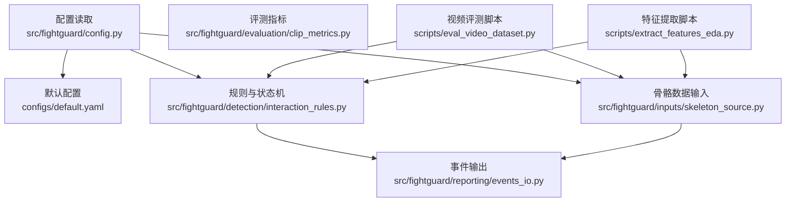
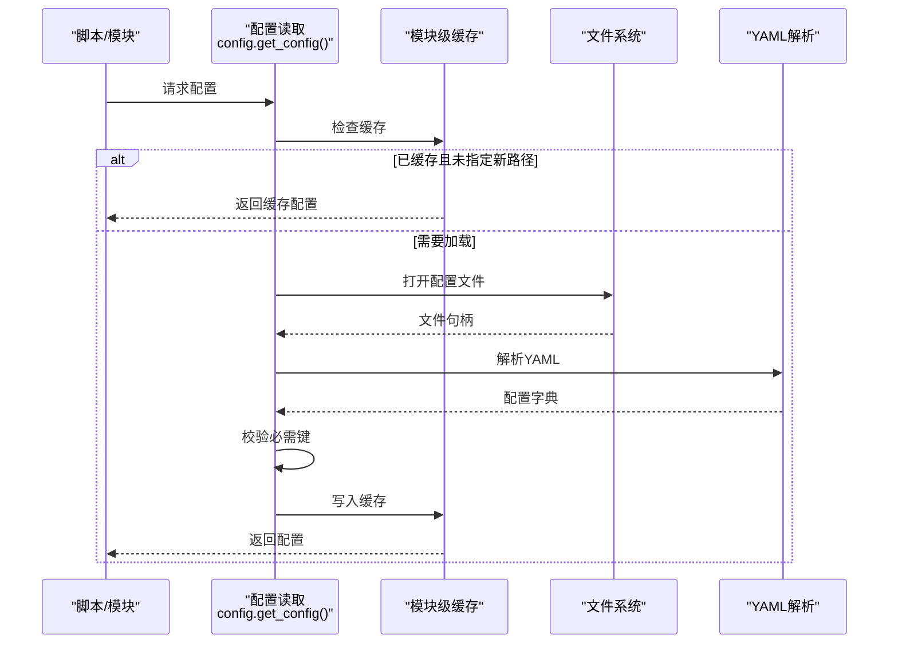
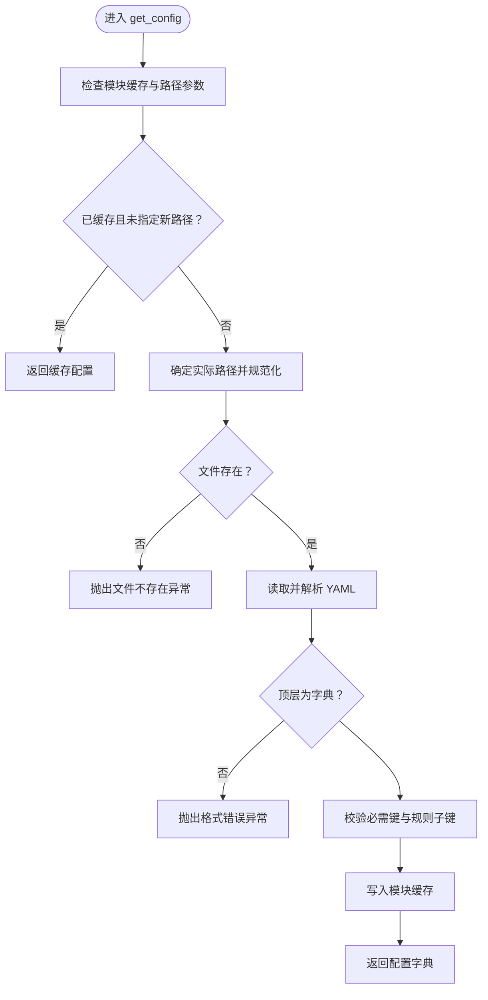
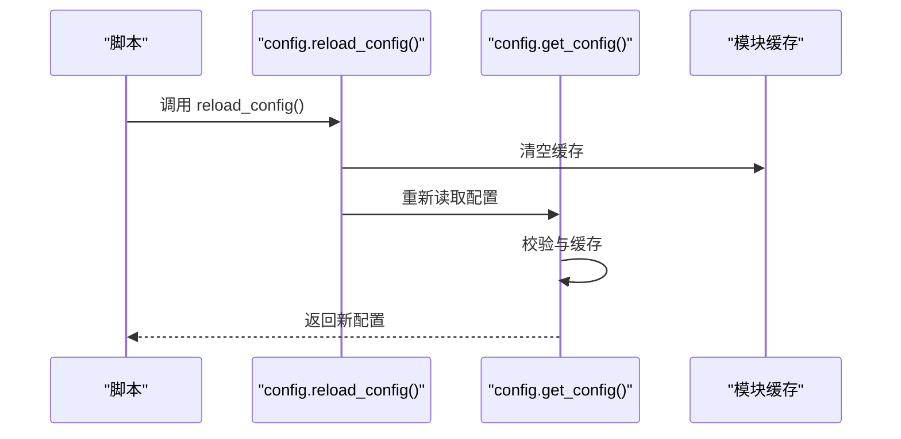
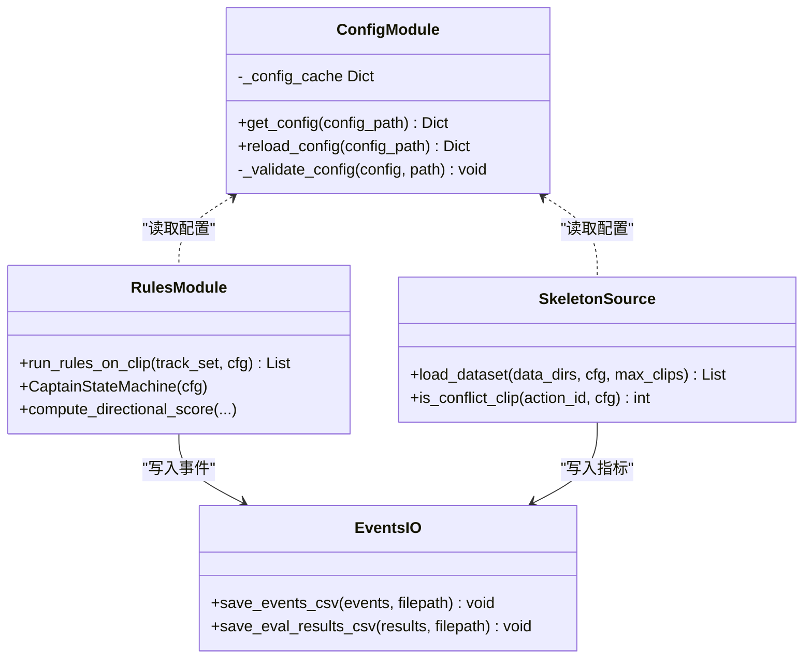
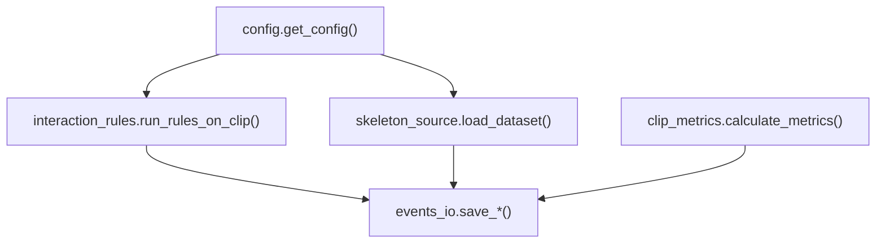

# 配置管理系统

<cite>
**本文引用的文件**
- [src/fightguard/config.py](file://src/fightguard/config.py)
- [configs/default.yaml](file://configs/default.yaml)
- [src/fightguard/detection/interaction_rules.py](file://src/fightguard/detection/interaction_rules.py)
- [src/fightguard/inputs/skeleton_source.py](file://src/fightguard/inputs/skeleton_source.py)
- [src/fightguard/reporting/events_io.py](file://src/fightguard/reporting/events_io.py)
- [src/fightguard/evaluation/clip_metrics.py](file://src/fightguard/evaluation/clip_metrics.py)
- [scripts/extract_features_eda.py](file://scripts/extract_features_eda.py)
- [scripts/eval_video_dataset.py](file://scripts/eval_video_dataset.py)
- [src/fightguard/contracts.py](file://src/fightguard/contracts.py)
</cite>

## 目录
1. [简介](#简介)
2. [项目结构](#项目结构)
3. [核心组件](#核心组件)
4. [架构总览](#架构总览)
5. [详细组件分析](#详细组件分析)
6. [依赖分析](#依赖分析)
7. [性能考虑](#性能考虑)
8. [故障排查指南](#故障排查指南)
9. [结论](#结论)
10. [附录](#附录)

## 简介
本文件面向 KidGuard 项目的配置管理系统，系统性阐述配置文件结构设计、加载机制、校验与错误处理、热更新 reload_config 的实现与使用场景，并给出最佳实践、参数命名规范、阈值设置建议与性能优化配置。读者无需深入技术背景亦可理解配置如何驱动系统运行。

## 项目结构
配置系统围绕以下关键文件展开：
- 配置读取与校验：src/fightguard/config.py
- 默认配置文件：configs/default.yaml
- 规则与状态机：src/fightguard/detection/interaction_rules.py
- 数据输入与标签：src/fightguard/inputs/skeleton_source.py
- 输出与持久化：src/fightguard/reporting/events_io.py
- 评测指标：src/fightguard/evaluation/clip_metrics.py
- 脚本示例：scripts/extract_features_eda.py、scripts/eval_video_dataset.py
- 数据契约与关键点标准：src/fightguard/contracts.py

**图表来源**
- [src/fightguard/config.py:1-120](file://src/fightguard/config.py#L1-L120)
- [configs/default.yaml:1-67](file://configs/default.yaml#L1-L67)
- [src/fightguard/detection/interaction_rules.py:1-584](file://src/fightguard/detection/interaction_rules.py#L1-L584)
- [src/fightguard/inputs/skeleton_source.py:1-331](file://src/fightguard/inputs/skeleton_source.py#L1-L331)
- [src/fightguard/reporting/events_io.py:1-36](file://src/fightguard/reporting/events_io.py#L1-L36)
- [src/fightguard/evaluation/clip_metrics.py:1-47](file://src/fightguard/evaluation/clip_metrics.py#L1-L47)
- [scripts/extract_features_eda.py:1-106](file://scripts/extract_features_eda.py#L1-L106)
- [scripts/eval_video_dataset.py:1-132](file://scripts/eval_video_dataset.py#L1-L132)

**章节来源**
- [src/fightguard/config.py:1-120](file://src/fightguard/config.py#L1-L120)
- [configs/default.yaml:1-67](file://configs/default.yaml#L1-L67)

## 核心组件
- 配置读取与缓存：提供 get_config() 与 reload_config()，统一读取 configs/default.yaml，模块级缓存避免重复 IO。
- 配置结构：包含 paths、rules、dataset、output、skeleton、state_machine 等顶层键，用于控制数据路径、规则阈值、数据集类别、输出行为、关键点标准与状态机参数。
- 配置校验：在首次加载时校验必需键是否存在，缺失时报出明确错误，帮助快速定位配置问题。
- 规则引擎集成：规则与状态机模块从配置读取阈值与参数，形成统一的判定逻辑。
- 数据输入与输出：输入模块依据 dataset 与 paths 读取数据并过滤样本；输出模块依据 output 控制 CSV/JSON 写入与可视化开关。
- 脚本示例：EDA 与视频评测脚本展示如何读取配置、覆盖特定规则参数并执行完整流程。

**章节来源**
- [src/fightguard/config.py:32-120](file://src/fightguard/config.py#L32-L120)
- [configs/default.yaml:1-67](file://configs/default.yaml#L1-L67)
- [src/fightguard/detection/interaction_rules.py:258-410](file://src/fightguard/detection/interaction_rules.py#L258-L410)
- [src/fightguard/inputs/skeleton_source.py:92-114](file://src/fightguard/inputs/skeleton_source.py#L92-L114)
- [src/fightguard/reporting/events_io.py:12-36](file://src/fightguard/reporting/events_io.py#L12-L36)
- [scripts/extract_features_eda.py:28-106](file://scripts/extract_features_eda.py#L28-L106)
- [scripts/eval_video_dataset.py:24-132](file://scripts/eval_video_dataset.py#L24-L132)

## 架构总览
配置系统采用"单一可信源"的设计：所有模块通过统一入口读取配置，避免硬编码阈值与路径，提升一致性与可维护性。

**图表来源**
- [src/fightguard/config.py:32-82](file://src/fightguard/config.py#L32-L82)

## 详细组件分析

### 配置文件结构与参数说明
- paths
  - 作用：定义数据与输出目录路径，确保系统在不同环境下可移植运行。
  - 关键项：output_events_dir、output_metrics_dir、skeleton_data_dir、video_data_dir。
  - 用途：输入模块与输出模块据此定位数据与产物目录。
- rules
  - 作用：定义冲突检测与状态机的关键阈值与窗口参数。
  - 关键项：proximity_threshold、wrist_intrusion_threshold、velocity_threshold、conflict_duration_frames、alert_threshold、proximity_window_frames、smoothing_window_frames、teacher_presence_threshold、tau_c、tracker、tracker_conf、**tau_teleport**、**confirm_window**、**min_confirm_frames** 等。
  - 用途：规则引擎与状态机据此进行物理特征评分、置信度抑制与事件判定。
- dataset
  - 作用：定义数据集的动作类别划分。
  - 关键项：ntu_conflict_actions、ntu_normal_actions。
  - 用途：输入模块据此过滤样本，区分冲突与正常动作。
- output
  - 作用：控制事件与指标的输出行为。
  - 关键项：save_events_csv、save_events_json、save_metrics_csv、visualization_enabled。
  - 用途：决定是否写入 CSV/JSON 以及是否启用可视化。
- skeleton
  - 作用：定义关键点名称与标准。
  - 关键项：keypoint_names、standard。
  - 用途：统一关键点命名，便于跨模块传递与计算。
- state_machine
  - 作用：定义状态机参数与状态集合。
  - 关键项：approach_frames、conflict_frames、contact_frames、resolve_frames、enabled、states。
  - 用途：控制状态转换的帧数要求与状态枚举。

**章节来源**
- [configs/default.yaml:1-67](file://configs/default.yaml#L1-L67)
- [src/fightguard/contracts.py:24-47](file://src/fightguard/contracts.py#L24-L47)

### 新增配置参数详解

#### 反瞬移过滤参数（tau_teleport）
- **参数名称**：tau_teleport
- **作用**：作为反瞬移过滤的第一道防线，防止 YOLO 关键点闪烁导致的非人类物理量
- **默认值**：15.0
- **工作原理**：
  - 检测 A->B 和 B->A 方向的瞬移情况
  - 当 r_a 或 r_v 超过阈值时，强制将该方向得分归零
  - 双向瞬移时清零当前帧得分
  - 防止关键点跳变导致的误判

#### 事件确认时间窗参数（confirm_window、min_confirm_frames）
- **参数名称**：confirm_window、min_confirm_frames
- **作用**：作为事件确认的第二道防线，确保冲突事件具有时间连续性
- **默认值**：confirm_window=4、min_confirm_frames=3
- **工作原理**：
  - 维护一个长度为 confirm_window 的历史记录缓冲区
  - 记录最近帧是否满足作用-响应条件
  - 只有当过去 confirm_window 帧内至少有 min_confirm_frames 帧满足条件时，才允许进入最终确认状态
  - 提高事件检测的可靠性，减少误报

**章节来源**
- [configs/default.yaml:30-34](file://configs/default.yaml#L30-L34)
- [src/fightguard/detection/interaction_rules.py:275-292](file://src/fightguard/detection/interaction_rules.py#L275-L292)
- [src/fightguard/detection/interaction_rules.py:383-396](file://src/fightguard/detection/interaction_rules.py#L383-L396)

### 配置加载机制与模块级缓存
- 模块级缓存策略：首次调用 get_config() 时读取并解析 YAML，随后将同一字典对象缓存于模块变量中，后续调用直接返回缓存，避免重复 IO 与解析开销。
- 文件路径解析：默认路径基于模块相对路径推导，支持通过参数覆盖；路径规范化统一分隔符，增强跨平台兼容性。
- 配置验证流程：检查顶层必需键是否存在；对 rules 子键进行二次校验，缺失时报出明确错误，指导用户补齐配置。
- 错误处理机制：文件不存在抛出 FileNotFoundError；YAML 格式错误或顶层非字典抛出 ValueError；规则子键缺失同样抛出 ValueError，附带清晰提示。

**图表来源**
- [src/fightguard/config.py:32-82](file://src/fightguard/config.py#L32-L82)
- [src/fightguard/config.py:95-120](file://src/fightguard/config.py#L95-L120)

**章节来源**
- [src/fightguard/config.py:32-120](file://src/fightguard/config.py#L32-L120)

### 配置热更新 reload_config 的实现与使用场景
- 实现原理：reload_config() 将模块缓存置空，随后调用 get_config() 重新加载并写入新缓存，从而在不重启进程的情况下应用新配置。
- 使用场景：
  - 调参调试：在脚本中临时覆盖 rules 某些阈值（如 proximity_window_frames、smoothing_window_frames、alert_threshold），无需修改配置文件。
  - 快速验证：在评测脚本中针对特定数据集调整参数，观察指标变化。
- 注意事项：热更新仅影响后续读取，已缓存的模块仍会沿用旧配置；建议在脚本开头统一读取一次配置，或在需要时显式调用 reload_config()。

**图表来源**
- [src/fightguard/config.py:85-92](file://src/fightguard/config.py#L85-L92)

**章节来源**
- [src/fightguard/config.py:85-92](file://src/fightguard/config.py#L85-L92)
- [scripts/eval_video_dataset.py:24-132](file://scripts/eval_video_dataset.py#L24-L132)

### 规则引擎与配置的集成
- 规则模块从配置读取阈值与参数，构建状态机并进行事件判定；同时支持从配置读取置信度抑制阈值 tau_c，实现对低置信度帧的抑制。
- 输入模块依据 dataset 与 paths 读取数据并过滤样本，输出模块依据 output 控制 CSV/JSON 写入与可视化开关。

**图表来源**
- [src/fightguard/config.py:32-120](file://src/fightguard/config.py#L32-L120)
- [src/fightguard/detection/interaction_rules.py:463-556](file://src/fightguard/detection/interaction_rules.py#L463-L556)
- [src/fightguard/inputs/skeleton_source.py:281-330](file://src/fightguard/inputs/skeleton_source.py#L281-L330)
- [src/fightguard/reporting/events_io.py:12-36](file://src/fightguard/reporting/events_io.py#L12-L36)

**章节来源**
- [src/fightguard/detection/interaction_rules.py:463-556](file://src/fightguard/detection/interaction_rules.py#L463-L556)
- [src/fightguard/inputs/skeleton_source.py:281-330](file://src/fightguard/inputs/skeleton_source.py#L281-L330)
- [src/fightguard/reporting/events_io.py:12-36](file://src/fightguard/reporting/events_io.py#L12-L36)

### 配置最佳实践
- 参数命名规范
  - 使用语义化英文小写下划线命名，如 proximity_threshold、conflict_duration_frames、smoothing_window_frames。
  - 与关键点标准保持一致，使用 skeleton.keypoint_names 中的键名作为参数引用的基础。
- 阈值设置建议
  - proximity_threshold：根据场景尺度与摄像头分辨率调整，建议先以默认值运行，再结合误报/漏报曲线微调。
  - alert_threshold：作为最终事件确认的阈值，建议在规则稳定后再调整，避免频繁抖动。
  - proximity_window_frames/smoothing_window_frames：用于平滑状态机与评分波动，较小窗口更敏感但易误报，较大窗口更稳健但响应慢。
  - teacher_presence_threshold：教师在场时可降低冲突判定概率，建议结合实际场景设定。
  - tau_c：置信度抑制阈值，低阈值可抑制低质量帧的影响，但可能漏检真实冲突。
  - **tau_teleport**：反瞬移阈值，默认15.0，可根据关键点稳定性调整，数值越小越严格。
  - **confirm_window/min_confirm_frames**：时间窗确认参数，建议先固定一个参数，调整另一个参数，避免同时调整两个参数导致效果难以评估。
- 性能优化配置
  - 使用模块级缓存减少重复 IO：确保仅在需要时调用 reload_config()。
  - 合理设置输出开关：在大规模评测时关闭 visualization_enabled，减少 I/O 压力。
  - 路径规划：将数据与输出目录放置在本地 SSD，缩短读写延迟。
- 配置示例与常见错误
  - 示例：在脚本中临时覆盖 rules 参数以快速验证效果。
  - 常见错误与解决：
    - 缺少顶层键：如 paths、rules、dataset、output 任一缺失，将抛出 ValueError，检查 default.yaml 顶层键是否齐全。
    - rules 子键缺失：如 proximity_threshold、conflict_duration_frames 等缺失，将提示补齐。
    - 文件不存在：配置文件路径错误或权限不足，将抛出 FileNotFoundError，检查路径与权限。

**章节来源**
- [configs/default.yaml:1-67](file://configs/default.yaml#L1-L67)
- [src/fightguard/config.py:95-120](file://src/fightguard/config.py#L95-L120)
- [scripts/eval_video_dataset.py:24-132](file://scripts/eval_video_dataset.py#L24-L132)

## 依赖分析
配置系统与其他模块的耦合关系如下：
- 配置读取模块被规则引擎、输入模块、输出模块广泛依赖。
- 规则引擎依赖配置中的阈值与状态机参数。
- 输入模块依赖 dataset 与 paths，用于样本过滤与路径解析。
- 输出模块依赖 output，控制 CSV/JSON 写入与可视化。

**图表来源**
- [src/fightguard/config.py:32-120](file://src/fightguard/config.py#L32-L120)
- [src/fightguard/detection/interaction_rules.py:463-556](file://src/fightguard/detection/interaction_rules.py#L463-L556)
- [src/fightguard/inputs/skeleton_source.py:281-330](file://src/fightguard/inputs/skeleton_source.py#L281-L330)
- [src/fightguard/reporting/events_io.py:12-36](file://src/fightguard/reporting/events_io.py#L12-L36)
- [src/fightguard/evaluation/clip_metrics.py:9-47](file://src/fightguard/evaluation/clip_metrics.py#L9-L47)

**章节来源**
- [src/fightguard/config.py:32-120](file://src/fightguard/config.py#L32-L120)
- [src/fightguard/detection/interaction_rules.py:463-556](file://src/fightguard/detection/interaction_rules.py#L463-L556)
- [src/fightguard/inputs/skeleton_source.py:281-330](file://src/fightguard/inputs/skeleton_source.py#L281-L330)
- [src/fightguard/reporting/events_io.py:12-36](file://src/fightguard/reporting/events_io.py#L12-L36)
- [src/fightguard/evaluation/clip_metrics.py:9-47](file://src/fightguard/evaluation/clip_metrics.py#L9-L47)

## 性能考虑
- 模块级缓存显著降低重复 IO 与解析成本，建议在生产环境中保持缓存不变，仅在调试阶段使用 reload_config()。
- 输出开关与路径选择直接影响 I/O 性能，建议在大规模评测时关闭可视化并使用高性能存储。
- 规则参数的窗口大小与阈值会影响状态机响应速度与稳定性，建议通过小规模实验确定最优组合。
- **新增参数性能考量**：
  - tau_teleport 参数对实时性能影响较小，主要在状态机更新时进行简单比较运算。
  - confirm_window 参数会增加内存占用（O(confirm_window)），建议根据实际需求合理设置。
  - min_confirm_frames 参数影响状态机决策逻辑，建议与 confirm_window 协同调优。

## 故障排查指南
- 配置文件缺失：检查 default.yaml 是否存在于 configs/ 目录，确认路径与权限。
- 配置格式错误：确保 YAML 语法正确，顶层为字典结构。
- 必需键缺失：根据错误提示补齐 paths、rules、dataset、output 等顶层键，以及 rules 中的必要子键。
- 规则阈值不合理：若出现大量误报或漏报，逐步调整 proximity_threshold、alert_threshold、window 参数与 tau_c。
- **新增参数相关问题**：
  - tau_teleport 设置过小：可能导致正常动作被误判为瞬移，建议从默认值开始逐步增大。
  - confirm_window 设置过大：可能导致事件检测响应延迟，建议从小值开始测试。
  - min_confirm_frames 设置过高：可能导致事件确认困难，建议与 confirm_window 协同调整。

**章节来源**
- [src/fightguard/config.py:60-82](file://src/fightguard/config.py#L60-L82)
- [src/fightguard/config.py:100-120](file://src/fightguard/config.py#L100-L120)

## 结论
KidGuard 的配置管理系统通过单一可信源与模块级缓存，实现了对路径、规则、数据集与输出行为的集中管理。配合严格的校验与清晰的错误提示，开发者可在不重启进程的前提下进行热更新与快速调参，显著提升开发与评测效率。新增的 tau_teleport、confirm_window、min_confirm_frames 三个参数进一步增强了系统的鲁棒性和准确性，通过双重防线有效提升了冲突检测的可靠性。建议在团队内统一参数命名规范与阈值设置流程，确保配置的一致性与可维护性。

## 附录
- 关键点标准：COCO-17 标准关键点名称与索引映射，确保跨模块一致的数据契约。
- 脚本示例：EDA 与视频评测脚本展示了配置读取、参数覆盖与完整流程执行。

**章节来源**
- [src/fightguard/contracts.py:24-47](file://src/fightguard/contracts.py#L24-L47)
- [scripts/extract_features_eda.py:28-106](file://scripts/extract_features_eda.py#L28-L106)
- [scripts/eval_video_dataset.py:24-132](file://scripts/eval_video_dataset.py#L24-L132)