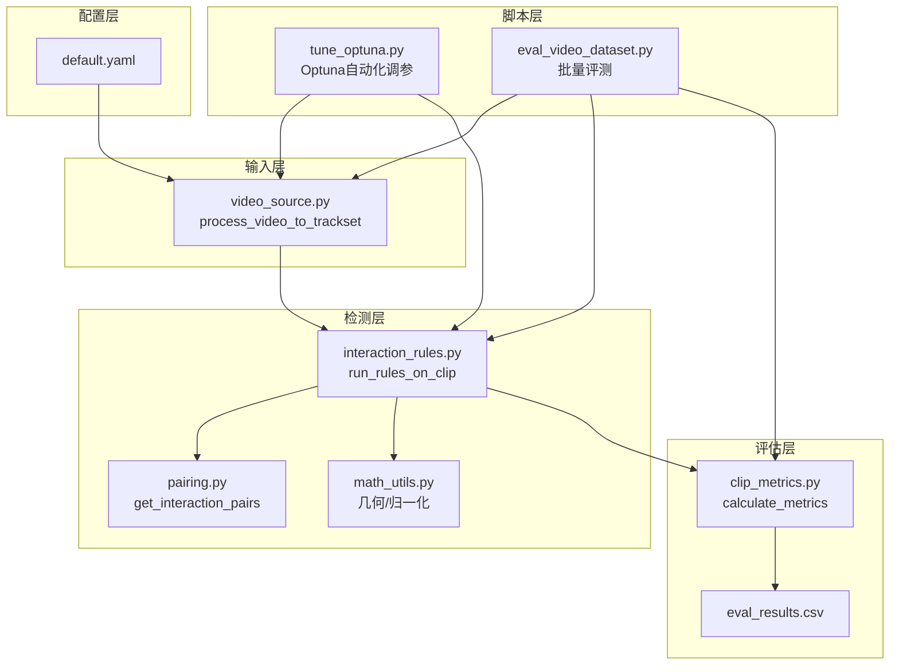
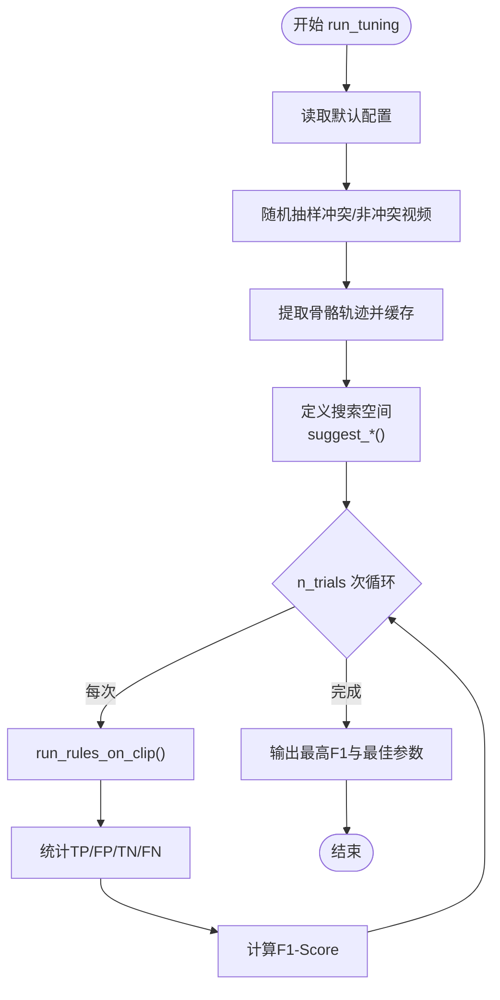
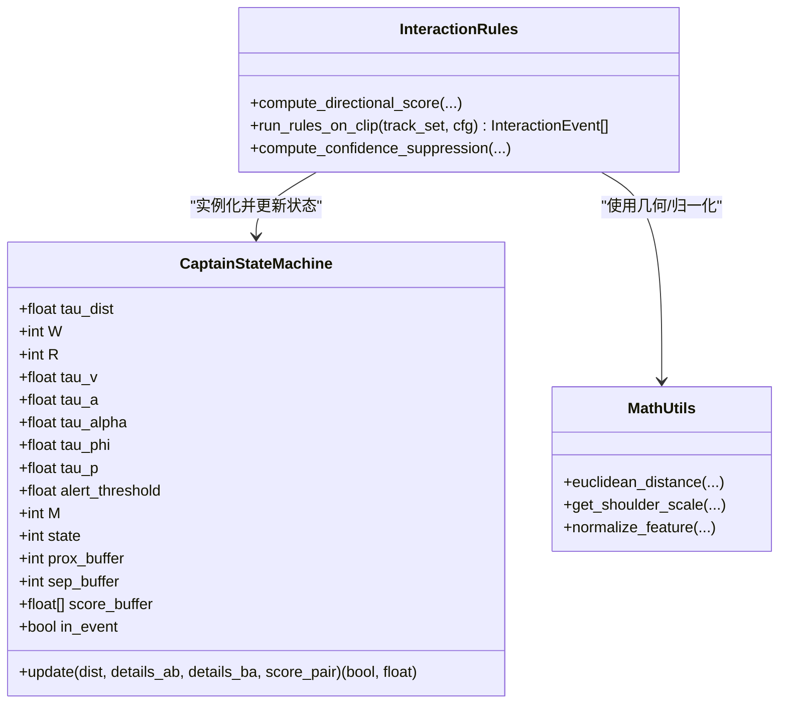
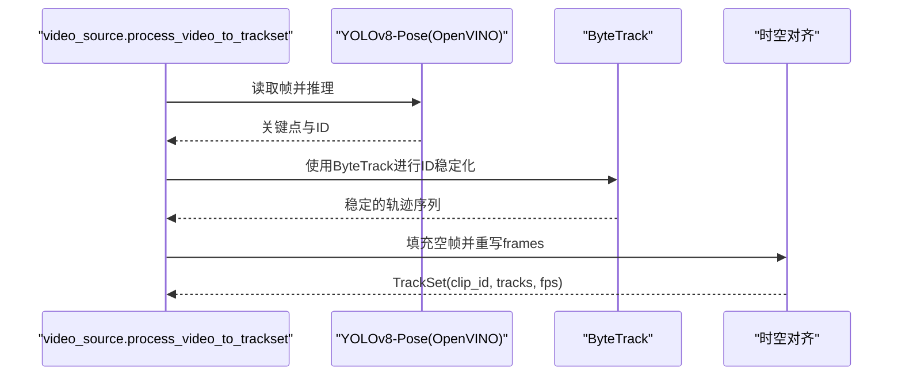
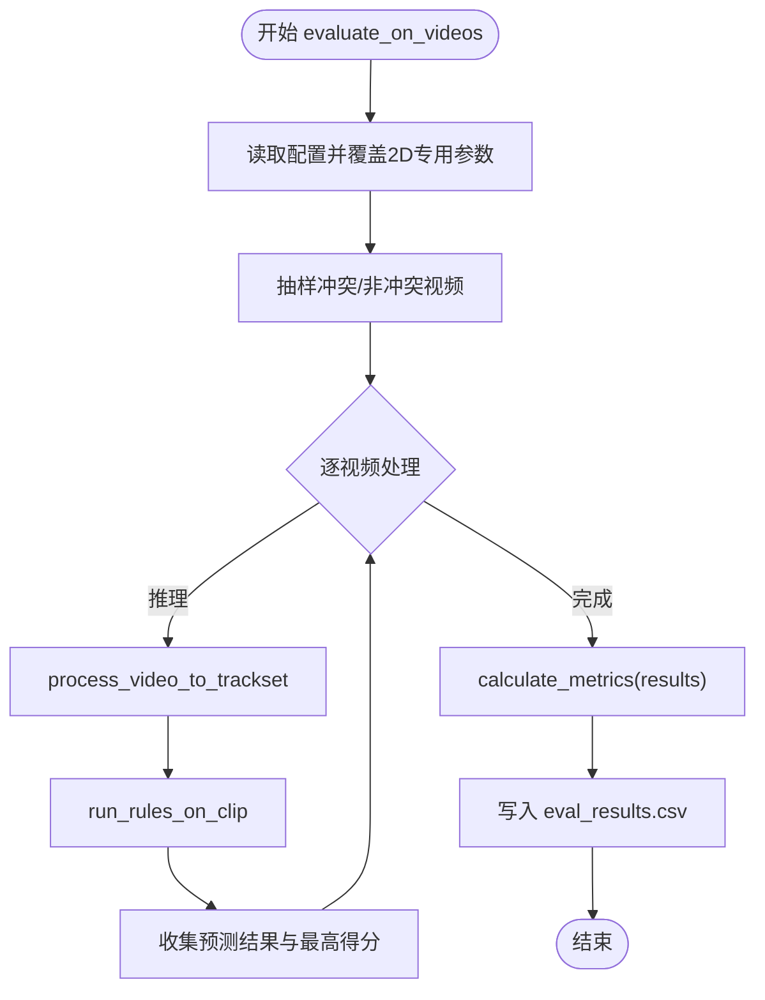
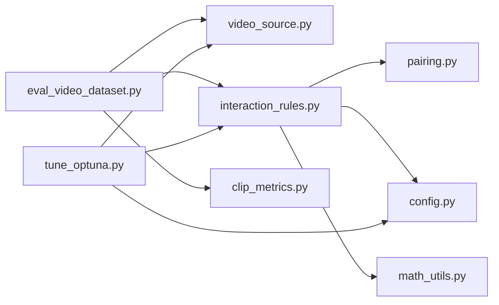

# 性能优化与调优工具

<cite>
**本文引用的文件**
- [tune_optuna.py](file://scripts/tune_optuna.py)
- [default.yaml](file://configs/default.yaml)
- [interaction_rules.py](file://src/fightguard/detection/interaction_rules.py)
- [video_source.py](file://src/fightguard/inputs/video_source.py)
- [config.py](file://src/fightguard/config.py)
- [eval_results.csv](file://outputs/metrics/eval_results.csv)
- [eval_video_dataset.py](file://scripts/eval_video_dataset.py)
- [OpenVINO可以加速轻薄本电脑YOLOv8的推理.md](file://OpenVINO可以加速轻薄本电脑YOLOv8的推理.md)
- [README.md](file://README.md)
- [phase2_todo.md](file://docs/phase2_todo.md)
</cite>

## 目录
1. [简介](#简介)
2. [项目结构](#项目结构)
3. [核心组件](#核心组件)
4. [架构概览](#架构概览)
5. [详细组件分析](#详细组件分析)
6. [依赖分析](#依赖分析)
7. [性能考虑](#性能考虑)
8. [故障排查指南](#故障排查指南)
9. [结论](#结论)
10. [附录](#附录)

## 简介
本指南面向KidGuard项目中“性能优化与调优工具”的使用，聚焦于基于Optuna的自动化超参数搜索流程，帮助开发者在真实视频数据集上高效定位规则层（交互规则与状态机）的最优参数组合，提升冲突检测的F1-Score与稳定性。文档同时提供调优结果分析方法、最佳参数选择标准以及性能基准测试与评估指标，使读者能够系统地理解不同参数配置对系统性能的影响。

## 项目结构
KidGuard采用模块化分层设计：
- 配置层：集中于YAML配置文件，提供规则阈值、输出开关、路径等参数
- 输入层：视频骨骼提取（YOLOv8-Pose + ByteTrack），输出标准化轨迹数据
- 检测层：交互规则与状态机，基于物理特征与置信度抑制进行冲突判定
- 评估层：评测指标与结果持久化，支持CSV输出与统计分析
- 脚本层：提供调优、评测、特征提取等自动化入口



图表来源
- [video_source.py:57-193](file://src/fightguard/inputs/video_source.py#L57-L193)
- [interaction_rules.py:410-503](file://src/fightguard/detection/interaction_rules.py#L410-L503)
- [pairing.py:14-54](file://src/fightguard/detection/pairing.py#L14-L54)
- [math_utils.py:10-52](file://src/fightguard/detection/math_utils.py#L10-L52)
- [eval_video_dataset.py:24-132](file://scripts/eval_video_dataset.py#L24-L132)
- [tune_optuna.py:21-132](file://scripts/tune_optuna.py#L21-L132)
- [eval_results.csv:1-502](file://outputs/metrics/eval_results.csv#L1-L502)

章节来源
- [README.md:46-76](file://README.md#L46-L76)

## 核心组件
- 调优脚本：scripts/tune_optuna.py
  - 将感知层（YOLO）与认知层（规则）解耦，先提取骨骼轨迹至内存，再在认知层进行数百次参数组合搜索，最大化F1-Score
  - 定义搜索空间：置信度抑制阈值、肢体加速度阈值、相对接近速度阈值、躯干倾角阈值、骨盆速度阈值、记忆窗口、状态机阈值等
  - 目标函数：在缓存样本上运行规则引擎，统计TP/FP/TN/FN，计算F1-Score
- 配置系统：configs/default.yaml + src/fightguard/config.py
  - 统一读取与校验配置，支持热重载，避免硬编码
  - 调优脚本通过get_config()读取并覆盖规则参数
- 规则引擎：src/fightguard/detection/interaction_rules.py
  - 基于肩宽尺度归一化、四段式状态机、相对接近速度、肢体/关节加速度、躯干倾角变化、骨盆速度等特征
  - 置信度抑制机制：当平均关键点置信度低于阈值时，对得分进行抑制
- 输入系统：src/fightguard/inputs/video_source.py
  - 使用YOLOv8-Pose + ByteTrack进行视频骨骼提取与轨迹对齐，支持OpenVINO加速
- 评测系统：scripts/eval_video_dataset.py + outputs/metrics/eval_results.csv
  - 批量评测真实视频数据集，输出混淆矩阵与指标，CSV记录每个片段的预测结果与触发规则

章节来源
- [tune_optuna.py:21-132](file://scripts/tune_optuna.py#L21-L132)
- [default.yaml:16-30](file://configs/default.yaml#L16-L30)
- [config.py:32-92](file://src/fightguard/config.py#L32-L92)
- [interaction_rules.py:258-408](file://src/fightguard/detection/interaction_rules.py#L258-L408)
- [video_source.py:57-193](file://src/fightguard/inputs/video_source.py#L57-L193)
- [eval_video_dataset.py:24-132](file://scripts/eval_video_dataset.py#L24-L132)
- [eval_results.csv:1-502](file://outputs/metrics/eval_results.csv#L1-L502)

## 架构概览
调优流程将“感知层解耦”与“认知层搜索”分离，先在缓存数据上反复评估不同参数组合，再将最优参数写入配置文件，从而显著减少重复推理成本。

```mermaid
sequenceDiagram
participant Dev as "开发者"
participant Tune as "tune_optuna.py"
participant VS as "video_source.process_video_to_trackset"
participant IR as "interaction_rules.run_rules_on_clip"
participant Opt as "Optuna Study"
participant CFG as "config.get_config"
Dev->>Tune : 运行 run_tuning()
Tune->>CFG : 读取默认配置
Tune->>VS : 提取N个样本的骨骼轨迹(缓存)
VS-->>Tune : 缓存数据(TrackSet列表)
Tune->>Opt : 创建Study并设置目标函数
loop n_trials=100
Tune->>Opt : trial.suggest_*()采样参数
Opt->>CFG : 覆盖rules参数
Opt->>IR : run_rules_on_clip(track_set, cfg)
IR-->>Opt : 事件列表/得分
Opt-->>Tune : 返回F1-Score
end
Tune-->>Dev : 输出最佳参数与最高F1
```

图表来源
- [tune_optuna.py:21-132](file://scripts/tune_optuna.py#L21-L132)
- [video_source.py:57-193](file://src/fightguard/inputs/video_source.py#L57-L193)
- [interaction_rules.py:410-503](file://src/fightguard/detection/interaction_rules.py#L410-L503)
- [config.py:32-92](file://src/fightguard/config.py#L32-L92)

## 详细组件分析

### 调优脚本：Optuna自动化超参数搜索
- 目标：在真实视频数据集上寻找规则层参数的“物理天花板”，最大化F1-Score
- 关键步骤
  - 数据准备：随机抽样冲突/非冲突视频，提取骨骼轨迹并缓存，避免重复推理
  - 搜索空间：在目标函数中通过trial.suggest_*()定义连续/离散参数范围
  - 目标函数：遍历缓存样本，运行规则引擎，统计混淆矩阵，计算F1-Score
  - 优化器：创建Study并optimize(n_trials)，自动选择最优参数组合
- 输出：打印最高F1与最佳参数组合，指导写入配置文件



图表来源
- [tune_optuna.py:21-132](file://scripts/tune_optuna.py#L21-L132)

章节来源
- [tune_optuna.py:21-132](file://scripts/tune_optuna.py#L21-L132)

### 规则引擎：交互规则与状态机
- 特征与归一化
  - 肢体末端加速度、关节角加速度、相对接近速度、躯干倾角变化、骨盆速度
  - 肩宽尺度归一化，确保2D像素空间的物理一致性
- 置信度抑制
  - 计算平均关键点置信度，低于阈值时对得分进行抑制，缓解遮挡与低置信度帧的误报
- 状态机
  - 四段式状态机：接近阶段、动作激活阶段、作用-响应阶段、事件确认阶段
  - 使用平滑窗口与阈值控制事件的触发与消退，避免瞬时噪声导致误报



图表来源
- [interaction_rules.py:258-408](file://src/fightguard/detection/interaction_rules.py#L258-L408)
- [math_utils.py:10-52](file://src/fightguard/detection/math_utils.py#L10-L52)

章节来源
- [interaction_rules.py:258-408](file://src/fightguard/detection/interaction_rules.py#L258-L408)
- [math_utils.py:10-52](file://src/fightguard/detection/math_utils.py#L10-L52)

### 输入系统：视频骨骼提取与追踪
- YOLOv8-Pose + ByteTrack：在低分检测框场景下更鲁棒，适合两人重叠打斗
- OpenVINO加速：在Intel轻薄本上显著提升推理速度，减少调参等待时间
- 时空对齐：将所有轨迹填充到相同总帧数，保证严格对齐



图表来源
- [video_source.py:57-193](file://src/fightguard/inputs/video_source.py#L57-L193)
- [OpenVINO可以加速轻薄本电脑YOLOv8的推理.md:1-105](file://OpenVINO可以加速轻薄本电脑YOLOv8的推理.md#L1-L105)

章节来源
- [video_source.py:57-193](file://src/fightguard/inputs/video_source.py#L57-L193)
- [OpenVINO可以加速轻薄本电脑YOLOv8的推理.md:1-105](file://OpenVINO可以加速轻薄本电脑YOLOv8的推理.md#L1-L105)

### 评测系统：基准测试与结果评估
- 批量评测：随机抽样冲突/非冲突视频，运行规则引擎，统计混淆矩阵与指标
- 指标输出：准确率、精确率、召回率、误报率
- 结果持久化：CSV记录每个片段的预测结果、最高得分与触发规则，便于后续分析



图表来源
- [eval_video_dataset.py:24-132](file://scripts/eval_video_dataset.py#L24-L132)
- [eval_results.csv:1-502](file://outputs/metrics/eval_results.csv#L1-L502)

章节来源
- [eval_video_dataset.py:24-132](file://scripts/eval_video_dataset.py#L24-L132)
- [eval_results.csv:1-502](file://outputs/metrics/eval_results.csv#L1-L502)

## 依赖分析
- 调优脚本依赖
  - 规则引擎：run_rules_on_clip
  - 输入系统：process_video_to_trackset
  - 配置系统：get_config
- 规则引擎依赖
  - 几何与归一化：math_utils
  - 人员配对：pairing
  - 配置：config
- 评测脚本依赖
  - 规则引擎：run_rules_on_clip
  - 输入系统：process_video_to_trackset
  - 评测指标：calculate_metrics



图表来源
- [tune_optuna.py:17-20](file://scripts/tune_optuna.py#L17-L20)
- [interaction_rules.py:410-503](file://src/fightguard/detection/interaction_rules.py#L410-L503)
- [video_source.py:57-193](file://src/fightguard/inputs/video_source.py#L57-L193)
- [config.py:32-92](file://src/fightguard/config.py#L32-L92)
- [eval_video_dataset.py:19-23](file://scripts/eval_video_dataset.py#L19-L23)

章节来源
- [tune_optuna.py:17-20](file://scripts/tune_optuna.py#L17-L20)
- [interaction_rules.py:410-503](file://src/fightguard/detection/interaction_rules.py#L410-L503)
- [video_source.py:57-193](file://src/fightguard/inputs/video_source.py#L57-L193)
- [config.py:32-92](file://src/fightguard/config.py#L32-L92)
- [eval_video_dataset.py:19-23](file://scripts/eval_video_dataset.py#L19-L23)

## 性能考虑
- 推理加速
  - OpenVINO加速：在Intel轻薄本上显著降低每帧耗时，缩短调参等待时间
  - ByteTrack追踪：在打架场景下更稳定，减少ID切换与误报
- 缓存策略
  - 调优脚本将骨骼轨迹缓存至内存，避免重复推理，提升搜索效率
- 参数搜索效率
  - 通过合理设置搜索空间边界与n_trials，平衡探索与收敛速度
- 评测效率
  - 批量评测脚本提供实时秒表与进度条，缓解长时间推理的等待焦虑

章节来源
- [OpenVINO可以加速轻薄本电脑YOLOv8的推理.md:1-105](file://OpenVINO可以加速轻薄本电脑YOLOv8的推理.md#L1-L105)
- [phase2_todo.md:11-20](file://docs/phase2_todo.md#L11-L20)
- [tune_optuna.py:46-56](file://scripts/tune_optuna.py#L46-L56)
- [eval_video_dataset.py:61-81](file://scripts/eval_video_dataset.py#L61-L81)

## 故障排查指南
- 配置文件缺失或字段不完整
  - 现象：启动时报错提示缺少必要字段
  - 处理：检查configs/default.yaml是否包含paths、rules、dataset、output等字段
- 视频目录不存在
  - 现象：找不到fight/nofight子目录
  - 处理：确认数据集路径与文件扩展名
- OpenVINO相关问题
  - 现象：首次运行卡顿、设备未找到、No module named openvino
  - 处理：安装openvino、导出OpenVINO模型、更新显卡驱动、确保电源模式为高性能
- 调优结果不理想
  - 现象：F1偏低或不稳定
  - 处理：扩大搜索空间、调整n_trials、检查缓存数据质量、核对规则参数覆盖逻辑

章节来源
- [config.py:60-82](file://src/fightguard/config.py#L60-L82)
- [tune_optuna.py:31-36](file://scripts/tune_optuna.py#L31-L36)
- [OpenVINO可以加速轻薄本电脑YOLOv8的推理.md:83-91](file://OpenVINO可以加速轻薄本电脑YOLOv8的推理.md#L83-L91)

## 结论
通过将感知层与认知层解耦，并结合Optuna的贝叶斯优化，KidGuard能够在真实视频数据集上高效定位规则层参数的最优组合，显著提升冲突检测的F1-Score与稳定性。配合OpenVINO加速与ByteTrack追踪，开发者可以在较短时间内完成多次参数迭代，快速逼近系统“物理天花板”。建议在调优完成后，将最佳参数写入配置文件，并使用评测脚本进行回归验证，确保在不同场景下的泛化能力。

## 附录

### 调优脚本使用指南
- 运行入口
  - 在项目根目录执行脚本，启动100次参数搜索
- 关键参数搜索空间
  - 置信度抑制阈值：用于置信度抑制机制
  - 肢体加速度阈值：归一化后的肢体末端加速度
  - 相对接近速度阈值：归一化后的相对接近速度
  - 躯干倾角阈值：角度制，反映躯干倾角变化
  - 骨盆速度阈值：归一化后的骨盆速度
  - 状态机时序参数：记忆窗口、状态转换阈值、告警阈值
- 输出解读
  - 最高F1与最佳参数组合，建议将参数写入configs/default.yaml

章节来源
- [tune_optuna.py:61-104](file://scripts/tune_optuna.py#L61-L104)
- [default.yaml:16-30](file://configs/default.yaml#L16-L30)

### 调优结果分析与最佳参数选择
- 分析方法
  - 查看调优脚本输出的最佳F1与参数组合
  - 对比不同参数组合的F1分布，观察收敛趋势
- 选择标准
  - 优先选择最高F1对应的参数组合
  - 若存在多个相近F1的组合，选择参数范围更小、更稳定的组合
  - 结合评测脚本的混淆矩阵与指标，验证泛化能力

章节来源
- [tune_optuna.py:116-127](file://scripts/tune_optuna.py#L116-L127)
- [eval_video_dataset.py:109-122](file://scripts/eval_video_dataset.py#L109-L122)

### 性能基准测试与评估指标
- 基准测试
  - 使用eval_video_dataset.py在真实视频数据集上进行批量评测
  - 覆盖2D场景专用参数，确保评测环境一致
- 评估指标
  - 准确率、精确率、召回率、误报率
  - 混淆矩阵：TP、FP、TN、FN
- 结果持久化
  - eval_results.csv记录每个片段的预测结果、最高得分与触发规则，便于后续分析与可视化

章节来源
- [eval_video_dataset.py:24-132](file://scripts/eval_video_dataset.py#L24-L132)
- [eval_results.csv:1-502](file://outputs/metrics/eval_results.csv#L1-L502)