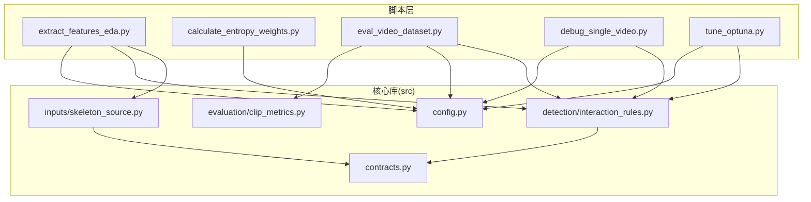
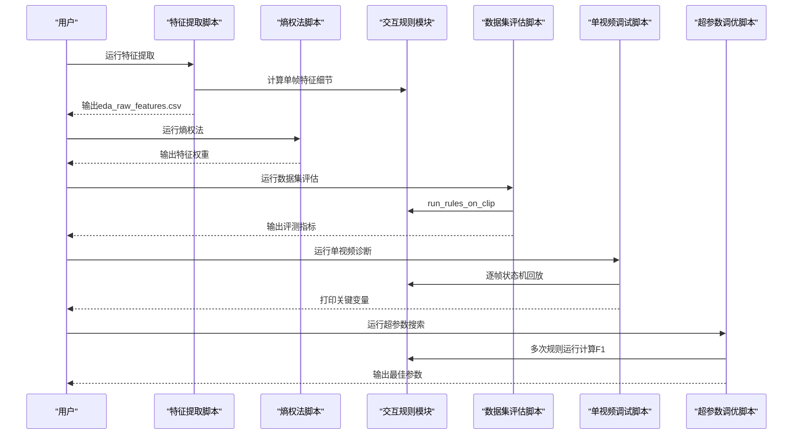
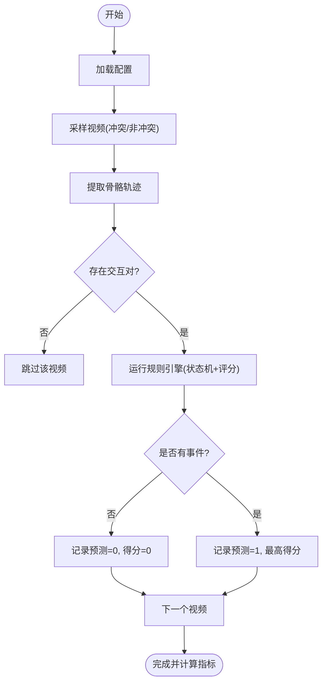
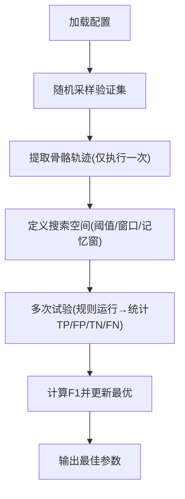
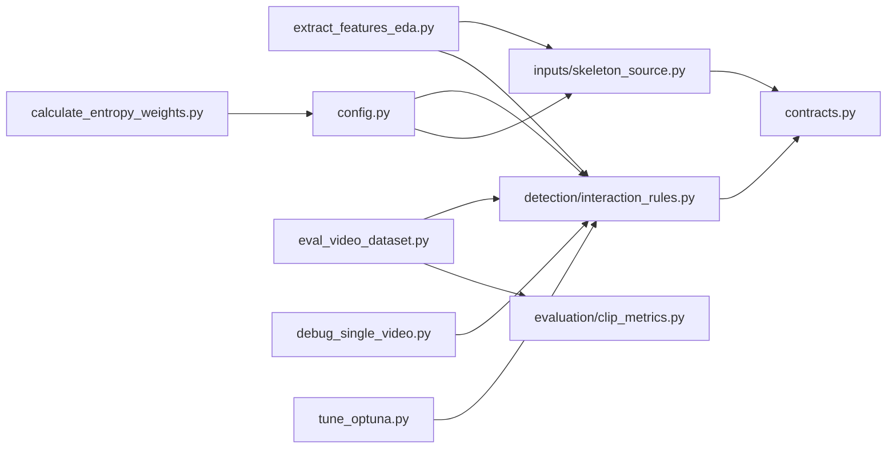

# 脚本与工具

<cite>
**本文引用的文件**
- [scripts/extract_features_eda.py](file://scripts/extract_features_eda.py)
- [scripts/calculate_entropy_weights.py](file://scripts/calculate_entropy_weights.py)
- [scripts/eval_video_dataset.py](file://scripts/eval_video_dataset.py)
- [scripts/debug_single_video.py](file://scripts/debug_single_video.py)
- [scripts/tune_optuna.py](file://scripts/tune_optuna.py)
- [configs/default.yaml](file://configs/default.yaml)
- [src/fightguard/detection/interaction_rules.py](file://src/fightguard/detection/interaction_rules.py)
- [src/fightguard/inputs/skeleton_source.py](file://src/fightguard/inputs/skeleton_source.py)
- [src/fightguard/evaluation/clip_metrics.py](file://src/fightguard/evaluation/clip_metrics.py)
- [src/fightguard/contracts.py](file://src/fightguard/contracts.py)
- [src/fightguard/config.py](file://src/fightguard/config.py)
- [README.md](file://README.md)
</cite>

## 目录
1. [简介](#简介)
2. [项目结构](#项目结构)
3. [核心组件](#核心组件)
4. [架构总览](#架构总览)
5. [详细组件分析](#详细组件分析)
6. [依赖分析](#依赖分析)
7. [性能考虑](#性能考虑)
8. [故障排查指南](#故障排查指南)
9. [结论](#结论)
10. [附录](#附录)

## 简介
本指南面向KidGuard项目的开发者与测试工程师，系统讲解各阶段运行脚本与工具的用途、参数、输入输出与预期结果，并提供典型使用场景与调试建议。重点覆盖以下工具链：
- 阶段A：特征提取与熵权法赋权
- 阶段B：规则验证（骨骼数据）
- 阶段C：视频端到端检测
- 调试工具：单视频诊断与数据集评估
- 性能优化与超参数调优

## 项目结构
项目采用“脚本入口 + 核心库模块”的分层组织，脚本位于scripts目录，核心算法与数据契约位于src/fightguard。

图表来源
- [scripts/extract_features_eda.py:1-106](file://scripts/extract_features_eda.py#L1-L106)
- [scripts/calculate_entropy_weights.py:1-71](file://scripts/calculate_entropy_weights.py#L1-L71)
- [scripts/eval_video_dataset.py:1-132](file://scripts/eval_video_dataset.py#L1-L132)
- [scripts/debug_single_video.py:1-81](file://scripts/debug_single_video.py#L1-L81)
- [scripts/tune_optuna.py:1-132](file://scripts/tune_optuna.py#L1-L132)
- [src/fightguard/config.py:1-120](file://src/fightguard/config.py#L1-L120)
- [src/fightguard/inputs/skeleton_source.py:1-331](file://src/fightguard/inputs/skeleton_source.py#L1-L331)
- [src/fightguard/detection/interaction_rules.py:1-531](file://src/fightguard/detection/interaction_rules.py#L1-L531)
- [src/fightguard/evaluation/clip_metrics.py:1-47](file://src/fightguard/evaluation/clip_metrics.py#L1-L47)
- [src/fightguard/contracts.py:1-241](file://src/fightguard/contracts.py#L1-L241)

章节来源
- [README.md:46-76](file://README.md#L46-L76)

## 核心组件
- 配置系统：统一读取与校验configs/default.yaml，供所有模块共享。
- 数据契约：定义Keypoints、SkeletonTrack、TrackSet、InteractionEvent等标准数据结构。
- 骨骼数据读取：NTU RGBD .skeleton文件解析与COCO-17映射。
- 交互规则与状态机：基于肩宽尺度归一化、置信度抑制、四段式状态机与多特征评分。
- 评测指标：Accuracy、Precision、Recall、FPR、F1等。

章节来源
- [src/fightguard/config.py:32-120](file://src/fightguard/config.py#L32-L120)
- [src/fightguard/contracts.py:15-241](file://src/fightguard/contracts.py#L15-L241)
- [src/fightguard/inputs/skeleton_source.py:211-331](file://src/fightguard/inputs/skeleton_source.py#L211-L331)
- [src/fightguard/detection/interaction_rules.py:363-531](file://src/fightguard/detection/interaction_rules.py#L363-L531)
- [src/fightguard/evaluation/clip_metrics.py:9-47](file://src/fightguard/evaluation/clip_metrics.py#L9-L47)

## 架构总览
KidGuard的工具链按阶段推进：先用EDALabel提取特征，再用熵权法客观赋权，随后在骨骼数据上验证规则，最后在视频上端到端检测，并辅以调试与调参工具。

图表来源
- [scripts/extract_features_eda.py:28-106](file://scripts/extract_features_eda.py#L28-L106)
- [scripts/calculate_entropy_weights.py:12-71](file://scripts/calculate_entropy_weights.py#L12-L71)
- [scripts/eval_video_dataset.py:24-132](file://scripts/eval_video_dataset.py#L24-L132)
- [scripts/debug_single_video.py:18-81](file://scripts/debug_single_video.py#L18-L81)
- [scripts/tune_optuna.py:21-132](file://scripts/tune_optuna.py#L21-L132)
- [src/fightguard/detection/interaction_rules.py:410-503](file://src/fightguard/detection/interaction_rules.py#L410-L503)

## 详细组件分析

### 阶段A：特征提取与熵权法赋权
- 特征提取脚本
  - 功能：遍历NTU骨骼数据集，提取每段交互双人的四个核心物理特征峰值，生成eda_raw_features.csv。
  - 输入：NTU骨骼目录（多路径）、配置文件。
  - 输出：CSV文件outputs/metrics/eda_raw_features.csv，字段包含clip_id、label以及四个峰值特征。
  - 预期结果：CSV非空，包含足够样本以支撑统计赋权。
  - 关键步骤：加载数据集→寻找交互对→逐帧提取特征→汇总峰值→写入CSV。
- 熵权法脚本
  - 功能：读取EDA特征矩阵，使用信息熵理论计算客观权重，输出四个特征的权重值。
  - 输入：eda_raw_features.csv。
  - 输出：控制台打印权重，并提示将权重写入交互规则模块的相应变量。
  - 预期结果：四个权重之和为1，避免主观经验参数。

章节来源
- [scripts/extract_features_eda.py:28-106](file://scripts/extract_features_eda.py#L28-L106)
- [scripts/calculate_entropy_weights.py:12-71](file://scripts/calculate_entropy_weights.py#L12-L71)
- [src/fightguard/inputs/skeleton_source.py:281-331](file://src/fightguard/inputs/skeleton_source.py#L281-L331)

### 阶段B：规则验证（骨骼数据）
- 说明：该阶段用于在骨骼数据上验证交互规则与状态机的有效性，通常由脚本入口承载。结合EDA特征与熵权法结果，可在骨骼级别快速验证规则鲁棒性与可解释性。
- 建议流程：先运行特征提取与熵权法，再在骨骼数据上运行规则验证脚本，观察事件触发规则与状态机流转。

章节来源
- [README.md:36-39](file://README.md#L36-L39)

### 阶段C：视频端到端检测
- 数据集评估脚本
  - 功能：在真实监控视频数据集上批量评测规则引擎，输出评测指标与错判案例。
  - 输入：视频目录（冲突与非冲突两类）、配置文件。
  - 输出：控制台打印TP/FP/TN/FN与Accuracy/Precision/Recall/FPR等指标；保存eval_results.csv（见outputs/metrics）。
  - 预期结果：指标稳定，漏报/误报可控。
  - 关键步骤：加载配置→随机采样→多线程计时→逐视频提取骨骼→规则运行→聚合统计→计算指标→打印与保存。
- 端到端检测流程（概念图）

图表来源
- [scripts/eval_video_dataset.py:24-132](file://scripts/eval_video_dataset.py#L24-L132)
- [src/fightguard/detection/interaction_rules.py:410-503](file://src/fightguard/detection/interaction_rules.py#L410-L503)

章节来源
- [scripts/eval_video_dataset.py:24-132](file://scripts/eval_video_dataset.py#L24-L132)
- [src/fightguard/evaluation/clip_metrics.py:9-47](file://src/fightguard/evaluation/clip_metrics.py#L9-L47)

### 调试工具
- 单视频调试脚本
  - 功能：针对特定视频（如漏报案例）进行“单点爆破”诊断，逐帧打印状态机与关键变量，定位问题环节。
  - 输入：固定视频路径、配置覆盖（与评测一致）。
  - 输出：控制台逐帧打印状态机阶段、距离、置信度抑制、爆发/后退特征与平滑得分。
  - 预期结果：能明确指出是追踪失败、配对失败、置信度抑制、状态机阈值不合理等问题。
- 数据集评估工具
  - 功能：批量评测并输出错判案例，辅助定位系统薄弱点。
  - 输入：冲突/非冲突两类视频目录。
  - 输出：控制台打印混淆矩阵与指标，列出误报/漏报案例及其最高得分。

章节来源
- [scripts/debug_single_video.py:18-81](file://scripts/debug_single_video.py#L18-L81)
- [scripts/eval_video_dataset.py:124-129](file://scripts/eval_video_dataset.py#L124-L129)

### 性能优化与超参数调优
- 超参数调优脚本
  - 功能：将感知层（骨骼提取）与认知层（规则）解耦，先缓存骨骼轨迹，再用Optuna在认知层进行贝叶斯优化搜索，最大化F1-Score。
  - 输入：视频数据集子集（冲突/非冲突各若干）、配置文件。
  - 输出：控制台打印最高F1与最佳参数组合，提示写入配置。
  - 预期结果：在当前架构与数据集上找到更优的规则阈值与状态机参数。
- 调参流程（概念图）

图表来源
- [scripts/tune_optuna.py:21-132](file://scripts/tune_optuna.py#L21-L132)

章节来源
- [scripts/tune_optuna.py:21-132](file://scripts/tune_optuna.py#L21-L132)

## 依赖分析
- 脚本与模块的依赖关系
  - 特征提取脚本依赖SkeletonSource与交互规则模块的单帧评分逻辑。
  - 熵权法脚本依赖EDA输出CSV。
  - 数据集评估脚本依赖交互规则模块的端到端规则流与评测指标模块。
  - 超参数调优脚本依赖交互规则模块与Optuna框架。
  - 所有模块通过配置系统统一读取配置。

图表来源
- [scripts/extract_features_eda.py:23-26](file://scripts/extract_features_eda.py#L23-L26)
- [scripts/calculate_entropy_weights.py:12-12](file://scripts/calculate_entropy_weights.py#L12-L12)
- [scripts/eval_video_dataset.py:19-22](file://scripts/eval_video_dataset.py#L19-L22)
- [scripts/debug_single_video.py:13-16](file://scripts/debug_single_video.py#L13-L16)
- [scripts/tune_optuna.py:17-19](file://scripts/tune_optuna.py#L17-L19)
- [src/fightguard/detection/interaction_rules.py:16-24](file://src/fightguard/detection/interaction_rules.py#L16-L24)
- [src/fightguard/inputs/skeleton_source.py:22-29](file://src/fightguard/inputs/skeleton_source.py#L22-L29)
- [src/fightguard/evaluation/clip_metrics.py:7-8](file://src/fightguard/evaluation/clip_metrics.py#L7-L8)
- [src/fightguard/config.py:15-29](file://src/fightguard/config.py#L15-L29)

章节来源
- [src/fightguard/config.py:32-120](file://src/fightguard/config.py#L32-L120)
- [src/fightguard/inputs/skeleton_source.py:211-331](file://src/fightguard/inputs/skeleton_source.py#L211-L331)
- [src/fightguard/detection/interaction_rules.py:363-531](file://src/fightguard/detection/interaction_rules.py#L363-L531)
- [src/fightguard/evaluation/clip_metrics.py:9-47](file://src/fightguard/evaluation/clip_metrics.py#L9-L47)

## 性能考虑
- 评测阶段的实时秒表：后台线程每秒刷新进度条后缀，缓解长时间推理导致的等待焦虑。
- 调参阶段的解耦：先缓存骨骼轨迹，减少重复推理开销，提升Optuna搜索效率。
- 状态机平滑窗口：通过滑动窗口平滑得分，降低瞬时噪声带来的误报。
- 置信度抑制：在低置信度情况下降低得分，避免不可靠关键点引发误报。

章节来源
- [scripts/eval_video_dataset.py:64-107](file://scripts/eval_video_dataset.py#L64-L107)
- [scripts/tune_optuna.py:49-56](file://scripts/tune_optuna.py#L49-L56)
- [src/fightguard/detection/interaction_rules.py:258-358](file://src/fightguard/detection/interaction_rules.py#L258-L358)

## 故障排查指南
- 配置文件缺失或格式错误
  - 现象：读取配置时报错或字段缺失。
  - 处理：检查configs/default.yaml是否存在且包含必需键；使用reload_config可强制重新加载。
- 特征数据为空
  - 现象：熵权法提示数据集为空。
  - 处理：先运行特征提取脚本，确保输出CSV存在且非空。
- 视频路径不存在
  - 现象：评估/调试脚本报错找不到视频目录。
  - 处理：确认路径与文件扩展名匹配，修正脚本中的硬编码路径。
- 漏报视频定位
  - 方法：使用单视频调试脚本，关注状态机阶段变化、置信度抑制与爆发/后退特征，逐步缩小问题范围。
- 调参不收敛或效果差
  - 方法：调整搜索空间范围与试验次数，结合数据集特性微调阈值；必要时增加缓存样本规模。

章节来源
- [src/fightguard/config.py:60-82](file://src/fightguard/config.py#L60-L82)
- [scripts/calculate_entropy_weights.py:18-27](file://scripts/calculate_entropy_weights.py#L18-L27)
- [scripts/eval_video_dataset.py:40-42](file://scripts/eval_video_dataset.py#L40-L42)
- [scripts/debug_single_video.py:32-34](file://scripts/debug_single_video.py#L32-L34)
- [scripts/tune_optuna.py:31-33](file://scripts/tune_optuna.py#L31-L33)

## 结论
通过特征提取→熵权法赋权→骨骼规则验证→视频端到端检测→调试与调参的完整流程，KidGuard提供了从数据驱动到系统优化的闭环工具链。建议开发者按阶段推进，充分利用调试与评测工具快速定位问题，结合超参数调优提升系统在真实场景中的稳定性与鲁棒性。

## 附录

### 常用命令与参数说明
- 特征提取
  - 命令：python scripts/extract_features_eda.py
  - 参数：无（内部读取配置与数据集路径）
  - 输入：NTU骨骼目录（多路径）
  - 输出：outputs/metrics/eda_raw_features.csv
- 熵权法赋权
  - 命令：python scripts/calculate_entropy_weights.py
  - 参数：无（读取EDA输出）
  - 输入：outputs/metrics/eda_raw_features.csv
  - 输出：控制台打印权重
- 数据集评估
  - 命令：python scripts/eval_video_dataset.py
  - 参数：num_samples_per_class（默认10）
  - 输入：冲突/非冲突视频目录
  - 输出：控制台打印指标与错判案例；保存eval_results.csv
- 单视频调试
  - 命令：python scripts/debug_single_video.py
  - 参数：无（固定视频路径）
  - 输入：指定视频路径
  - 输出：逐帧打印状态机与关键变量
- 超参数调优
  - 命令：python scripts/tune_optuna.py
  - 参数：num_samples（默认15）
  - 输入：冲突/非冲突视频子集
  - 输出：最佳参数与最高F1

章节来源
- [README.md:27-44](file://README.md#L27-L44)
- [scripts/extract_features_eda.py:104-106](file://scripts/extract_features_eda.py#L104-L106)
- [scripts/calculate_entropy_weights.py:69-71](file://scripts/calculate_entropy_weights.py#L69-L71)
- [scripts/eval_video_dataset.py:130-132](file://scripts/eval_video_dataset.py#L130-L132)
- [scripts/debug_single_video.py:79-81](file://scripts/debug_single_video.py#L79-L81)
- [scripts/tune_optuna.py:129-132](file://scripts/tune_optuna.py#L129-L132)

### 配置要点与规则参数
- 规则阈值与状态机参数来源于configs/default.yaml，可通过脚本覆盖或在交互规则模块中读取。
- 常用键（节选）：rules.alert_threshold、rules.proximity_window_frames、rules.smoothing_window_frames、rules.tau_c等。

章节来源
- [configs/default.yaml:16-62](file://configs/default.yaml#L16-L62)
- [src/fightguard/detection/interaction_rules.py:258-358](file://src/fightguard/detection/interaction_rules.py#L258-L358)