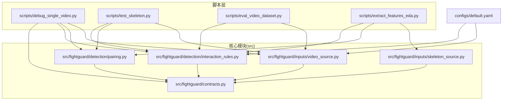
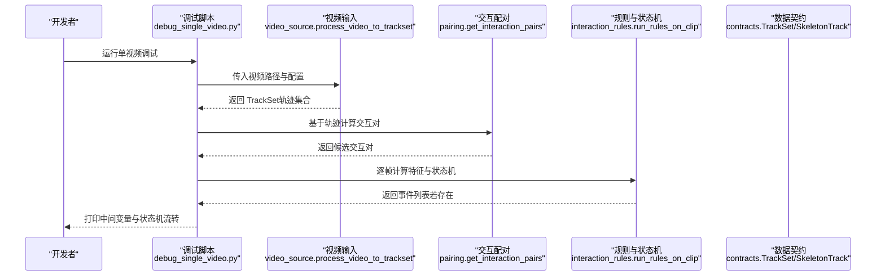
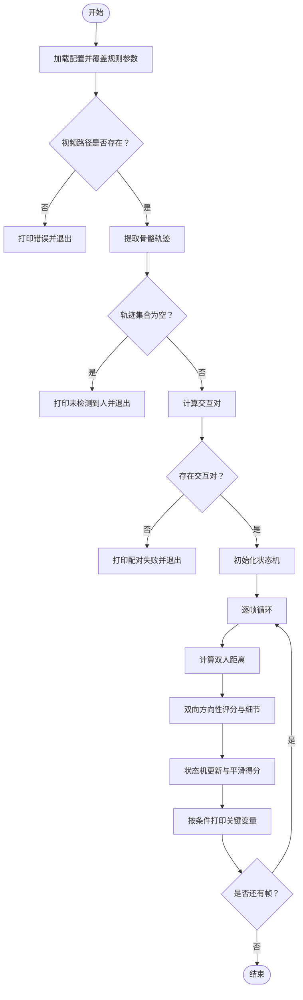
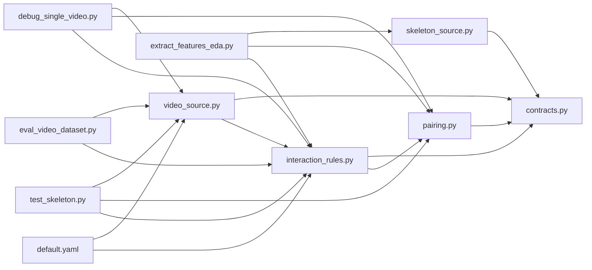

# 调试与测试工具

<cite>
**本文引用的文件**
- [scripts/debug_single_video.py](file://scripts/debug_single_video.py)
- [scripts/test_skeleton.py](file://scripts/test_skeleton.py)
- [scripts/eval_video_dataset.py](file://scripts/eval_video_dataset.py)
- [scripts/extract_features_eda.py](file://scripts/extract_features_eda.py)
- [src/fightguard/inputs/video_source.py](file://src/fightguard/inputs/video_source.py)
- [src/fightguard/detection/pairing.py](file://src/fightguard/detection/pairing.py)
- [src/fightguard/detection/interaction_rules.py](file://src/fightguard/detection/interaction_rules.py)
- [src/fightguard/inputs/skeleton_source.py](file://src/fightguard/inputs/skeleton_source.py)
- [src/fightguard/contracts.py](file://src/fightguard/contracts.py)
- [configs/default.yaml](file://configs/default.yaml)
- [README.md](file://README.md)
</cite>

## 目录
1. [简介](#简介)
2. [项目结构](#项目结构)
3. [核心组件](#核心组件)
4. [架构总览](#架构总览)
5. [详细组件分析](#详细组件分析)
6. [依赖分析](#依赖分析)
7. [性能考虑](#性能考虑)
8. [故障排查指南](#故障排查指南)
9. [结论](#结论)
10. [附录](#附录)

## 简介
本指南聚焦于 KidGuard 项目的“调试与测试工具”，围绕以下目标展开：
- 单视频调试脚本的使用方法：如何加载特定视频、执行冲突检测验证、查看中间结果与调试信息。
- 测试骨架数据的验证方法：数据格式检查、关键点可视化思路、异常检测要点。
- 常见问题诊断与解决方案：数据加载错误、模型推理失败、结果不符合预期等。
- 高效调试工作流程与问题定位技巧。

## 项目结构
项目采用“脚本入口 + 核心模块”的分层组织方式：
- scripts：提供面向任务的运行入口与评测脚本（如单视频调试、批量评测、特征提取等）
- src/fightguard：核心业务模块，按职责划分为 inputs（输入）、detection（检测规则与配对）、evaluation（指标）、reporting（事件IO）等
- configs：全局配置（规则阈值、输出开关、路径等）
- outputs：运行结果（事件、指标等）

图表来源
- [scripts/debug_single_video.py:1-81](file://scripts/debug_single_video.py#L1-L81)
- [scripts/test_skeleton.py:1-94](file://scripts/test_skeleton.py#L1-L94)
- [scripts/eval_video_dataset.py:1-132](file://scripts/eval_video_dataset.py#L1-L132)
- [scripts/extract_features_eda.py:1-106](file://scripts/extract_features_eda.py#L1-L106)
- [src/fightguard/inputs/video_source.py:1-193](file://src/fightguard/inputs/video_source.py#L1-L193)
- [src/fightguard/inputs/skeleton_source.py:1-331](file://src/fightguard/inputs/skeleton_source.py#L1-L331)
- [src/fightguard/detection/pairing.py:1-54](file://src/fightguard/detection/pairing.py#L1-L54)
- [src/fightguard/detection/interaction_rules.py:1-531](file://src/fightguard/detection/interaction_rules.py#L1-L531)
- [src/fightguard/contracts.py:1-241](file://src/fightguard/contracts.py#L1-L241)
- [configs/default.yaml:1-62](file://configs/default.yaml#L1-L62)

章节来源
- [README.md:46-76](file://README.md#L46-L76)

## 核心组件
- 视频骨骼提取模块：负责加载视频、调用 YOLOv8-Pose/OpenVINO 推理、提取 COCO-17 关键点、组装为 TrackSet。
- 骨骼数据读取模块：负责读取 NTU .skeleton 文件，映射为 COCO-17 格式，构建 TrackSet。
- 交互配对模块：基于轨迹中心与平均距离筛选交互对，过滤短寿命幽灵轨迹。
- 交互规则与状态机模块：提取物理特征（腕部加速度、相对接近速度、关节角加速度、躯干倾角变化、骨盆速度），结合置信度抑制与四段式状态机，输出冲突事件。
- 数据契约模块：统一关键点、轨迹、事件的数据结构与访问方式。
- 配置模块：读取 default.yaml，提供规则阈值、输出开关、路径等。

章节来源
- [src/fightguard/inputs/video_source.py:57-193](file://src/fightguard/inputs/video_source.py#L57-L193)
- [src/fightguard/inputs/skeleton_source.py:211-331](file://src/fightguard/inputs/skeleton_source.py#L211-L331)
- [src/fightguard/detection/pairing.py:14-54](file://src/fightguard/detection/pairing.py#L14-L54)
- [src/fightguard/detection/interaction_rules.py:363-531](file://src/fightguard/detection/interaction_rules.py#L363-L531)
- [src/fightguard/contracts.py:96-241](file://src/fightguard/contracts.py#L96-L241)
- [configs/default.yaml:16-62](file://configs/default.yaml#L16-L62)

## 架构总览
下图展示从视频输入到冲突事件输出的端到端流程，以及调试脚本如何沿用相同路径进行逐层诊断。

图表来源
- [scripts/debug_single_video.py:18-81](file://scripts/debug_single_video.py#L18-L81)
- [src/fightguard/inputs/video_source.py:57-193](file://src/fightguard/inputs/video_source.py#L57-L193)
- [src/fightguard/detection/pairing.py:14-54](file://src/fightguard/detection/pairing.py#L14-L54)
- [src/fightguard/detection/interaction_rules.py:410-503](file://src/fightguard/detection/interaction_rules.py#L410-L503)
- [src/fightguard/contracts.py:154-186](file://src/fightguard/contracts.py#L154-L186)

## 详细组件分析

### 单视频调试脚本使用指南
- 目标：针对特定视频（如漏报视频）进行“单点爆破”式诊断，逐帧打印底层变量，定位是追踪、配对、置信度、状态机中的哪一层导致真实报警被杀死。
- 使用步骤
  1) 准备：确保 OpenVINO 模型可用，配置文件加载正常。
  2) 运行：执行脚本，它会：
     - 覆盖规则参数以贴近批量评测一致性
     - 指定目标视频路径并加载
     - 调用视频输入模块提取骨骼轨迹
     - 计算交互对
     - 实例化状态机，逐帧打印距离、置信度抑制、爆发特征、状态机阶段与平滑得分
  3) 观察：关注状态机从 0 到 3 的跃迁时机，以及得分非零帧的触发特征组合。
- 关键路径
  - 视频输入：[process_video_to_trackset:57-193](file://src/fightguard/inputs/video_source.py#L57-L193)
  - 交互配对：[get_interaction_pairs:14-54](file://src/fightguard/detection/pairing.py#L14-L54)
  - 方向性评分与状态机：[compute_directional_score:363-408](file://src/fightguard/detection/interaction_rules.py#L363-L408)、[CaptainStateMachine.update:282-357](file://src/fightguard/detection/interaction_rules.py#L282-L357)
  - 调试脚本主流程：[run_debug:18-81](file://scripts/debug_single_video.py#L18-L81)

图表来源
- [scripts/debug_single_video.py:18-81](file://scripts/debug_single_video.py#L18-L81)
- [src/fightguard/inputs/video_source.py:57-193](file://src/fightguard/inputs/video_source.py#L57-L193)
- [src/fightguard/detection/pairing.py:14-54](file://src/fightguard/detection/pairing.py#L14-L54)
- [src/fightguard/detection/interaction_rules.py:282-357](file://src/fightguard/detection/interaction_rules.py#L282-L357)

章节来源
- [scripts/debug_single_video.py:18-81](file://scripts/debug_single_video.py#L18-L81)

### 测试骨架数据的验证方法
- 数据格式检查
  - 关键点命名：统一使用 COCO-17 名称，禁止硬编码数字索引
  - 坐标与置信度：关键点为 [x, y]，可选第三维 conf
  - 轨迹结构：SkeletonTrack 的 frames 与 keypoints 列表等长，且按帧顺序严格对齐
  - TrackSet：包含 clip_id、label、tracks、fps、total_frames
- 关键点可视化思路
  - 可在规则引擎之外，基于 TrackSet 的关键点字典绘制每帧的连接线（肩、肘、腕、髋、膝、踝）
  - 可叠加轨迹中心（左右髋中点）连线，观察接近趋势
- 异常检测要点
  - 全零关键点：表示该帧缺失或无效，应作为占位处理
  - 置信度抑制：当平均关键点置信度低于阈值时，得分会被抑制
  - 轨迹存活：仅保留至少一定数量有效帧的轨迹，剔除碎片化幽灵 ID
- 关键实现参考
  - 数据契约：[COCO17_KEYPOINT_NAMES:24-47](file://src/fightguard/contracts.py#L24-L47)、[SkeletonTrack:96-148](file://src/fightguard/contracts.py#L96-L148)、[TrackSet:154-186](file://src/fightguard/contracts.py#L154-L186)
  - 骨骼数据读取与归一化：[load_skeleton_file:211-274](file://src/fightguard/inputs/skeleton_source.py#L211-L274)、[_normalize_keypoints:174-204](file://src/fightguard/inputs/skeleton_source.py#L174-L204)
  - 交互配对与存活过滤：[get_interaction_pairs:14-54](file://src/fightguard/detection/pairing.py#L14-L54)

章节来源
- [src/fightguard/contracts.py:24-186](file://src/fightguard/contracts.py#L24-L186)
- [src/fightguard/inputs/skeleton_source.py:174-274](file://src/fightguard/inputs/skeleton_source.py#L174-L274)
- [src/fightguard/detection/pairing.py:14-54](file://src/fightguard/detection/pairing.py#L14-L54)

### 批量评测与演示脚本
- 批量评测脚本
  - 功能：在真实 2D 监控视频数据集上评估规则引擎泛化能力，带后台秒表线程缓解终端假死
  - 关键路径：[evaluate_on_videos:24-132](file://scripts/eval_video_dataset.py#L24-L132)，调用 [process_video_to_trackset:57-193](file://src/fightguard/inputs/video_source.py#L57-L193) 与 [run_rules_on_clip:410-503](file://src/fightguard/detection/interaction_rules.py#L410-L503)
- 演示脚本
  - 功能：加载视频、提取骨骼、打印诊断信息（最小近身距离、最大腕部加速度）、输出事件
  - 关键路径：[run_demo:9-94](file://scripts/test_skeleton.py#L9-L94)，调用 [process_video_to_trackset:57-193](file://src/fightguard/inputs/video_source.py#L57-L193)、[run_rules_symmetric:508-510](file://src/fightguard/detection/interaction_rules.py#L508-L510)

章节来源
- [scripts/eval_video_dataset.py:24-132](file://scripts/eval_video_dataset.py#L24-L132)
- [scripts/test_skeleton.py:9-94](file://scripts/test_skeleton.py#L9-L94)

### 特征提取与权重计算（EDA）
- 功能：遍历 NTU 骨骼数据集，提取交互双人四类物理特征的峰值，保存为 CSV，供熵权法使用
- 关键路径：[run_feature_extraction:28-106](file://scripts/extract_features_eda.py#L28-L106)，调用 [load_dataset:281-330](file://src/fightguard/inputs/skeleton_source.py#L281-L330)、[get_interaction_pairs:14-54](file://src/fightguard/detection/pairing.py#L14-L54)、[compute_frame_score:516-530](file://src/fightguard/detection/interaction_rules.py#L516-L530)

章节来源
- [scripts/extract_features_eda.py:28-106](file://scripts/extract_features_eda.py#L28-L106)
- [src/fightguard/inputs/skeleton_source.py:281-330](file://src/fightguard/inputs/skeleton_source.py#L281-L330)
- [src/fightguard/detection/pairing.py:14-54](file://src/fightguard/detection/pairing.py#L14-L54)
- [src/fightguard/detection/interaction_rules.py:516-530](file://src/fightguard/detection/interaction_rules.py#L516-L530)

## 依赖分析
- 组件耦合与内聚
  - 视频输入模块与规则模块通过 TrackSet 解耦，便于替换底层模型或追踪器
  - 配对模块与规则模块通过 SkeletonTrack 接口耦合，保持关键点访问的一致性
  - 状态机与特征提取模块通过细节字典（如 r_a、r_v、r_alpha、r_phi、r_p、gamma）解耦，利于独立调试
- 外部依赖
  - OpenCV、Ultralytics YOLOv8、ByteTrack（通过 YOLO 调用）
  - OpenVINO 模型目录（yolov8n-pose_openvino_model）
- 配置依赖
  - default.yaml 提供规则阈值、状态机参数、输出开关、路径等

图表来源
- [src/fightguard/inputs/video_source.py:57-193](file://src/fightguard/inputs/video_source.py#L57-L193)
- [src/fightguard/inputs/skeleton_source.py:211-331](file://src/fightguard/inputs/skeleton_source.py#L211-L331)
- [src/fightguard/detection/pairing.py:14-54](file://src/fightguard/detection/pairing.py#L14-L54)
- [src/fightguard/detection/interaction_rules.py:410-503](file://src/fightguard/detection/interaction_rules.py#L410-L503)
- [src/fightguard/contracts.py:154-186](file://src/fightguard/contracts.py#L154-L186)
- [scripts/debug_single_video.py:13-16](file://scripts/debug_single_video.py#L13-L16)
- [scripts/test_skeleton.py:5-7](file://scripts/test_skeleton.py#L5-L7)
- [scripts/eval_video_dataset.py:19-22](file://scripts/eval_video_dataset.py#L19-L22)
- [scripts/extract_features_eda.py:23-26](file://scripts/extract_features_eda.py#L23-L26)
- [configs/default.yaml:16-62](file://configs/default.yaml#L16-L62)

章节来源
- [configs/default.yaml:16-62](file://configs/default.yaml#L16-L62)

## 性能考虑
- 模型推理加速：使用 OpenVINO 加速的 YOLOv8-Pose 模型，显著降低 CPU 推理时间
- 追踪器优化：启用 ByteTrack，对低分检测框更鲁棒，适合两人重叠打斗场景
- 时空对齐：将轨迹按总帧数对齐，避免帧索引错配带来的额外计算与错误
- 状态机平滑：通过滑动窗口平滑得分，减少瞬时噪声影响
- 批量评测：使用后台秒表线程与进度条，改善长时间推理过程的可观测性

章节来源
- [src/fightguard/inputs/video_source.py:41-49](file://src/fightguard/inputs/video_source.py#L41-L49)
- [src/fightguard/inputs/video_source.py:115-118](file://src/fightguard/inputs/video_source.py#L115-L118)
- [src/fightguard/inputs/video_source.py:167-181](file://src/fightguard/inputs/video_source.py#L167-L181)
- [configs/default.yaml:20-29](file://configs/default.yaml#L20-L29)
- [scripts/eval_video_dataset.py:62-81](file://scripts/eval_video_dataset.py#L62-L81)

## 故障排查指南
- 数据加载错误
  - 视频路径不存在：检查路径拼写与权限，确认文件存在
  - 视频无法打开：检查编解码器与文件完整性
  - NTU 骨骼文件名格式不符：确认符合 S/C/P/R/A 格式，否则抛出解析异常
- 模型推理失败
  - OpenVINO 模型未找到：确认 yolov8n-pose_openvino_model 目录存在且可读
  - 推理结果为空：检查 conf 阈值与 tracker 配置，必要时降低 conf 或更换追踪器
- 结果不符合预期
  - 未检测到人：检查摄像头/视频质量、光照与遮挡；调整 conf 与 tracker
  - 未配对交互：检查轨迹存活帧数阈值；必要时放宽过滤
  - 漏报/误报：调整规则阈值（proximity_threshold、alert_threshold、smoothing_window_frames 等），或增加教师行为识别
- 调试技巧
  - 使用单视频调试脚本，逐帧观察状态机跃迁与关键变量
  - 在规则引擎中打印特征详情（如 r_a、r_v、r_alpha、r_phi、r_p、gamma），定位异常来源
  - 对比真实视频与 NTU 数据的特征分布，针对性调整阈值

章节来源
- [scripts/debug_single_video.py:32-41](file://scripts/debug_single_video.py#L32-L41)
- [src/fightguard/inputs/video_source.py:82-92](file://src/fightguard/inputs/video_source.py#L82-L92)
- [src/fightguard/inputs/skeleton_source.py:64-89](file://src/fightguard/inputs/skeleton_source.py#L64-L89)
- [src/fightguard/detection/pairing.py:23-28](file://src/fightguard/detection/pairing.py#L23-L28)
- [configs/default.yaml:16-30](file://configs/default.yaml#L16-L30)

## 结论
通过单视频调试脚本与批量评测脚本的配合，开发者可以快速定位从数据输入到规则判定的各个环节问题。结合数据契约与状态机设计，能够高效地进行参数调优与阈值标定，提升系统在真实监控场景下的稳定性与可解释性。

## 附录
- 配置参数速览（摘自 default.yaml）
  - 规则阈值：alert_threshold、proximity_threshold、velocity_threshold、teacher_presence_threshold、wrist_intrusion_threshold
  - 时间窗口：proximity_window_frames、smoothing_window_frames、conflict_duration_frames
  - 状态机参数：approach_frames、contact_frames、resolve_frames、states
  - 输出设置：save_events_csv、save_metrics_csv、visualization_enabled
  - 路径：output_events_dir、output_metrics_dir、skeleton_data_dir、video_data_dir
  - 追踪器：tracker、tracker_conf

章节来源
- [configs/default.yaml:16-62](file://configs/default.yaml#L16-L62)