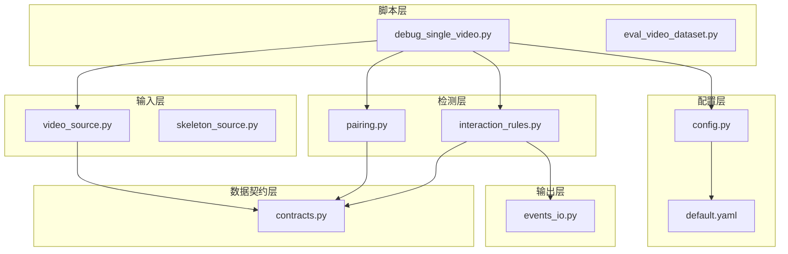
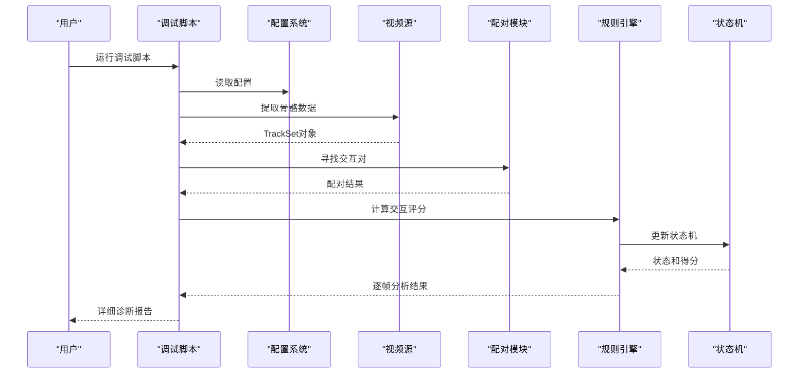
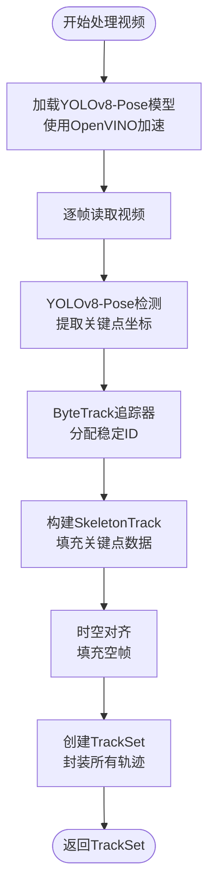
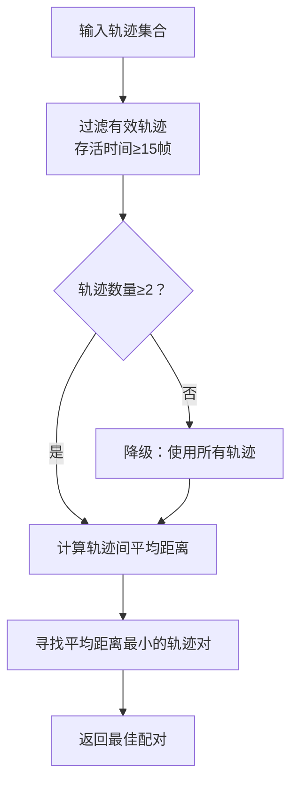
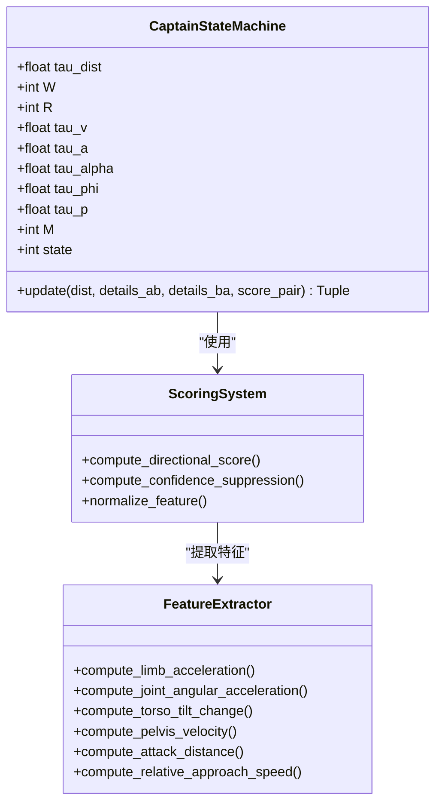
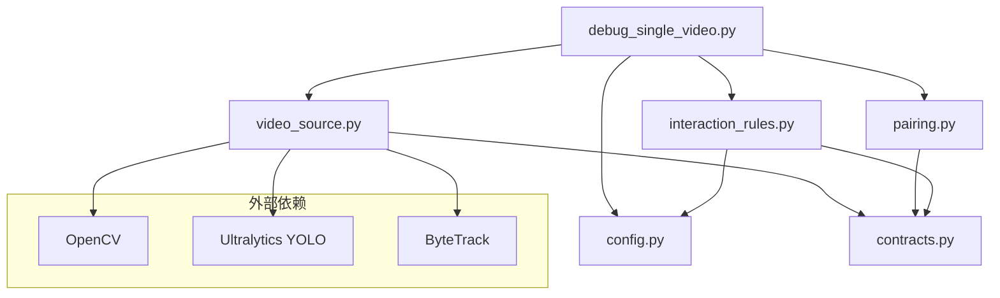

# 单视频调试脚本

<cite>
**本文引用的文件**
- [debug_single_video.py](file://scripts/debug_single_video.py)
- [default.yaml](file://configs/default.yaml)
- [README.md](file://README.md)
- [video_source.py](file://src/fightguard/inputs/video_source.py)
- [pairing.py](file://src/fightguard/detection/pairing.py)
- [interaction_rules.py](file://src/fightguard/detection/interaction_rules.py)
- [config.py](file://src/fightguard/config.py)
- [contracts.py](file://src/fightguard/contracts.py)
- [events_io.py](file://src/fightguard/reporting/events_io.py)
- [eval_video_dataset.py](file://scripts/eval_video_dataset.py)
</cite>

## 目录
1. [简介](#简介)
2. [项目结构](#项目结构)
3. [核心组件](#核心组件)
4. [架构概览](#架构概览)
5. [详细组件分析](#详细组件分析)
6. [依赖分析](#依赖分析)
7. [性能考虑](#性能考虑)
8. [故障排除指南](#故障排除指南)
9. [结论](#结论)
10. [附录](#附录)

## 简介
本指南详细介绍单视频调试脚本 debug_single_video.py 的使用方法，帮助开发者快速定位和解决视频检测中的问题。该脚本通过逐帧分析的方式，深入到检测流水线的每个环节，包括骨骼提取、人员配对、交互规则计算和状态机流转，从而精准找出导致漏报或误报的根本原因。

## 项目结构
该项目采用模块化架构，核心功能分布在以下层次：
- scripts：运行入口和工具脚本
- src/fightguard：核心业务逻辑
- configs：配置文件
- data：数据集
- outputs：结果输出



**图表来源**
- [debug_single_video.py:1-81](file://scripts/debug_single_video.py#L1-L81)
- [video_source.py:1-193](file://src/fightguard/inputs/video_source.py#L1-L193)
- [pairing.py:1-54](file://src/fightguard/detection/pairing.py#L1-L54)
- [interaction_rules.py:1-584](file://src/fightguard/detection/interaction_rules.py#L1-L584)
- [config.py:1-120](file://src/fightguard/config.py#L1-L120)
- [contracts.py:1-241](file://src/fightguard/contracts.py#L1-L241)
- [events_io.py:1-36](file://src/fightguard/reporting/events_io.py#L1-L36)

**章节来源**
- [README.md:46-76](file://README.md#L46-L76)

## 核心组件
单视频调试脚本围绕以下核心组件构建：

### 主要功能模块
1. **视频骨骼提取**：使用YOLOv8-Pose模型和ByteTrack追踪器
2. **人员配对**：基于距离和存活时间的智能配对算法
3. **交互规则计算**：多维度物理特征评分系统
4. **状态机控制**：四段式状态机确保检测稳定性
5. **配置管理**：集中化的参数控制系统

### 关键数据结构
- TrackSet：包含所有轨迹的容器
- SkeletonTrack：单人多帧轨迹
- InteractionEvent：检测到的事件记录

**章节来源**
- [debug_single_video.py:18-81](file://scripts/debug_single_video.py#L18-L81)
- [contracts.py:96-186](file://src/fightguard/contracts.py#L96-L186)

## 架构概览
调试脚本采用自顶向下的执行流程，每个步骤都有明确的错误处理和诊断输出。



**图表来源**
- [debug_single_video.py:36-79](file://scripts/debug_single_video.py#L36-L79)
- [video_source.py:57-193](file://src/fightguard/inputs/video_source.py#L57-L193)
- [pairing.py:14-54](file://src/fightguard/detection/pairing.py#L14-L54)
- [interaction_rules.py:416-462](file://src/fightguard/detection/interaction_rules.py#L416-L462)

## 详细组件分析

### 视频骨骼提取模块
视频骨骼提取是整个检测流程的起点，负责将视频帧转换为结构化的骨骼数据。



**图表来源**
- [video_source.py:57-193](file://src/fightguard/inputs/video_source.py#L57-L193)

#### 关键特性
- **OpenVINO加速**：利用Intel GPU/NPU硬件加速
- **ByteTrack追踪**：提供稳定的人员ID分配
- **时空对齐**：确保每帧都有对应的关键点数据
- **错误处理**：完善的异常捕获和用户提示

**章节来源**
- [video_source.py:41-49](file://src/fightguard/inputs/video_source.py#L41-L49)
- [video_source.py:115-159](file://src/fightguard/inputs/video_source.py#L115-L159)

### 人员配对算法
配对模块负责从多个轨迹中识别出最可能的交互对，这是冲突检测的关键步骤。



**图表来源**
- [pairing.py:14-54](file://src/fightguard/detection/pairing.py#L14-L54)

#### 配对策略
- **存活时间过滤**：剔除短暂出现的无效轨迹
- **距离优先**：选择平均距离最小的轨迹对
- **鲁棒性设计**：当有效轨迹不足时的降级策略

**章节来源**
- [pairing.py:17-28](file://src/fightguard/detection/pairing.py#L17-L28)
- [pairing.py:34-52](file://src/fightguard/detection/pairing.py#L34-L52)

### 交互规则计算引擎
规则引擎实现了复杂的多维度特征评分系统，是冲突检测的核心。



**图表来源**
- [interaction_rules.py:258-411](file://src/fightguard/detection/interaction_rules.py#L258-L411)
- [interaction_rules.py:416-462](file://src/fightguard/detection/interaction_rules.py#L416-L462)

#### 状态机设计
四段式状态机确保检测结果的稳定性和可靠性：

1. **接近阶段**：检测到近距离接触
2. **动作激活阶段**：检测到明显的身体动作
3. **作用-响应阶段**：检测到完整的攻击-反应链
4. **事件确认阶段**：平滑后的最终确认

**章节来源**
- [interaction_rules.py:258-411](file://src/fightguard/detection/interaction_rules.py#L258-L411)

### 配置管理系统
配置系统提供了统一的参数管理机制，支持运行时热更新。

```mermaid
flowchart TD
ConfigFile[default.yaml] --> LoadConfig["读取配置文件"]
LoadConfig --> ValidateConfig["验证配置完整性"]
ValidateConfig --> CacheConfig["缓存配置对象"]
CacheConfig --> GetConfig[get_config()]
GetConfig --> ReturnConfig[返回配置字典]
RuntimeUpdate[运行时更新] --> ReloadConfig[reload_config()]
ReloadConfig --> ClearCache[清除缓存]
ClearCache --> LoadConfig
```

**图表来源**
- [config.py:32-92](file://src/fightguard/config.py#L32-L92)

**章节来源**
- [config.py:32-82](file://src/fightguard/config.py#L32-L82)

## 依赖分析
调试脚本的依赖关系清晰明确，遵循单一职责原则。



**图表来源**
- [debug_single_video.py:13-16](file://scripts/debug_single_video.py#L13-L16)
- [video_source.py:14-25](file://src/fightguard/inputs/video_source.py#L14-L25)

**章节来源**
- [debug_single_video.py:9-16](file://scripts/debug_single_video.py#L9-L16)

## 性能考虑
调试脚本在设计时充分考虑了性能优化：

### 硬件加速
- **OpenVINO集成**：自动检测并使用GPU/NPU加速
- **CPU优化**：在无硬件加速环境下仍能正常运行

### 算法优化
- **早期终止**：当检测到无效数据时立即停止
- **内存管理**：及时释放不再使用的资源
- **批处理**：合理控制处理的帧数

### 调试性能建议
- 使用较小的视频片段进行初步调试
- 调整 `max_frames` 参数限制处理范围
- 在配置中适当降低阈值以减少误报

## 故障排除指南

### 常见问题及解决方案

#### 1. 视频文件找不到
**症状**：脚本直接退出并显示"找不到视频"错误
**解决方案**：
- 检查视频路径是否正确
- 确认文件权限设置
- 验证视频格式支持性

#### 2. YOLO模型加载失败
**症状**：模型加载超时或报错
**解决方案**：
- 检查OpenVINO模型文件完整性
- 确认硬件加速驱动安装
- 验证Python环境依赖

#### 3. 骨骼提取失败
**症状**：显示"未检测到任何人"
**解决方案**：
- 调整检测阈值参数
- 检查视频质量（光照、角度等）
- 验证ByteTrack追踪器配置

#### 4. 配对失败
**症状**：显示"配对失败"
**解决方案**：
- 检查视频中是否有多于一个人物
- 调整配对距离阈值
- 验证轨迹数据完整性

### 调试技巧

#### 1. 参数调优策略
- **Proximity Window Frames**：影响接近检测的稳定性
- **Smoothing Window Frames**：控制平滑滤波的敏感度
- **Alert Threshold**：决定最终事件确认的阈值

#### 2. 逐步验证方法
1. 首先验证骨骼提取是否正常
2. 检查配对算法是否找到合适的轨迹对
3. 分析状态机的流转过程
4. 最后验证最终的事件输出

#### 3. 性能监控
- 使用 `max_frames` 参数限制处理范围
- 监控内存使用情况
- 注意长时间运行的资源消耗

**章节来源**
- [debug_single_video.py:32-41](file://scripts/debug_single_video.py#L32-L41)
- [video_source.py:82-84](file://src/fightguard/inputs/video_source.py#L82-L84)

## 结论
单视频调试脚本为开发者提供了强大的问题定位工具。通过逐帧分析和详细的诊断输出，能够快速识别检测流程中的薄弱环节。建议在日常开发中结合该脚本进行单元测试和集成测试，确保系统的稳定性和准确性。

## 附录

### 使用示例

#### 基本使用
```bash
python scripts/debug_single_video.py
```

#### 自定义参数设置
在脚本中可以调整以下关键参数：
- `proximity_window_frames`：接近窗口帧数
- `smoothing_window_frames`：平滑窗口帧数  
- `alert_threshold`：告警阈值

#### 输出文件格式
调试脚本主要输出：
- 控制台诊断信息
- 逐帧状态机流转数据
- 最终结论总结

#### 可视化功能
当前版本的调试脚本专注于控制台输出，未来版本可集成：
- 实时可视化界面
- 交互式参数调节
- 事件标记和标注工具

### 性能分析工具
推荐使用以下工具进行性能分析：
- **cProfile**：Python内置性能分析器
- **memory_profiler**：内存使用情况监控
- **py-spy**：生产环境性能采样

### 最佳实践
1. 始终先运行单视频调试脚本验证核心逻辑
2. 使用小规模数据集进行快速迭代
3. 建立完整的测试用例集
4. 定期进行回归测试
5. 保持配置文件的版本控制