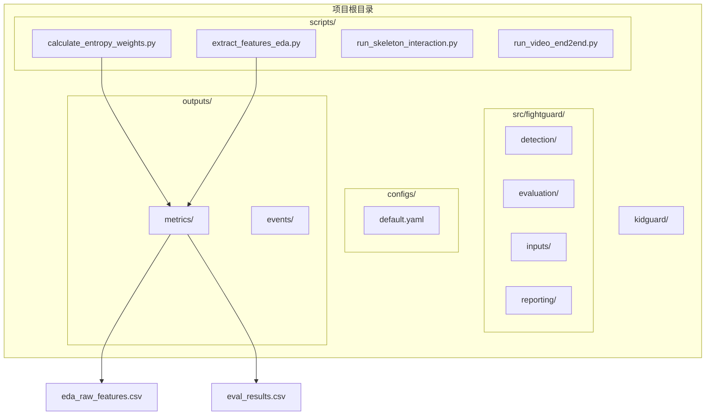
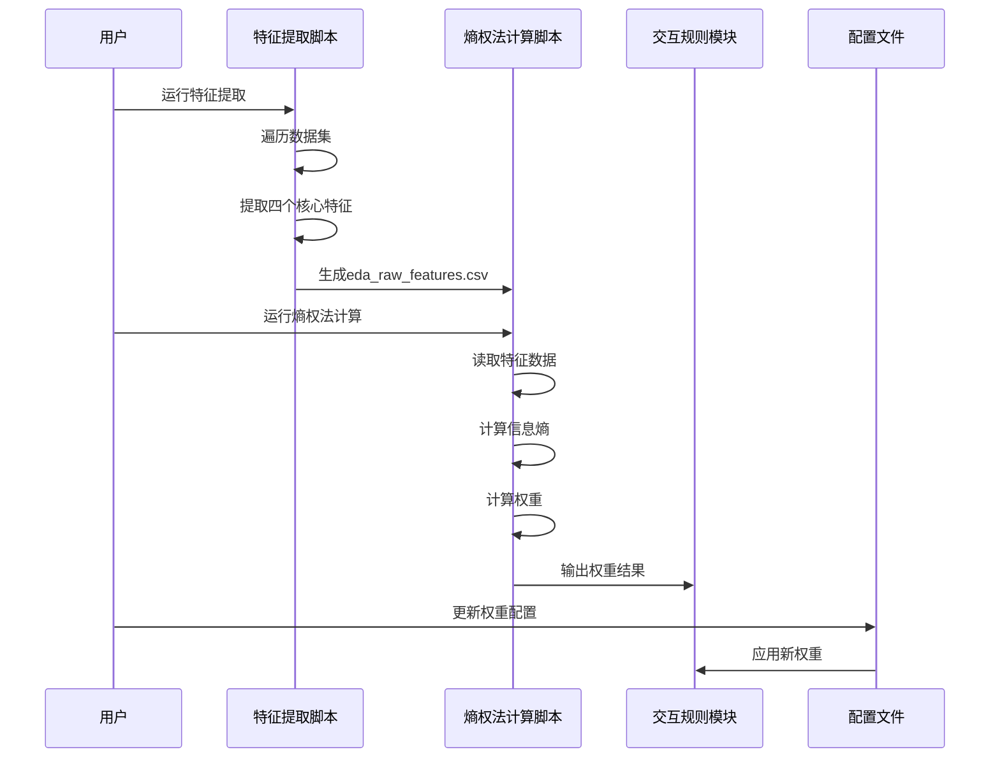
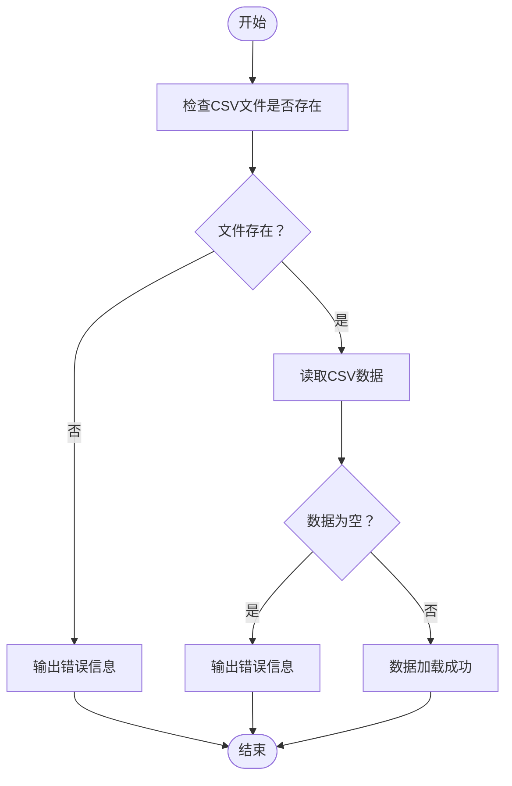
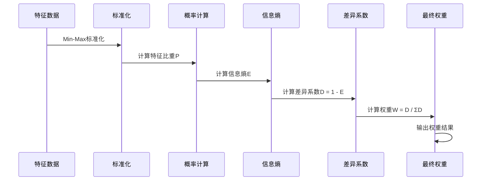
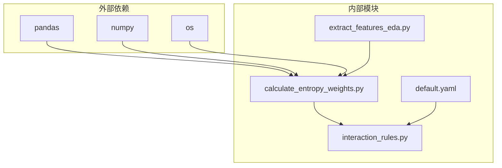

# 熵权法权重计算脚本

<cite>
**本文档引用的文件**
- [calculate_entropy_weights.py](file://scripts/calculate_entropy_weights.py)
- [extract_features_eda.py](file://scripts/extract_features_eda.py)
- [interaction_rules.py](file://src/fightguard/detection/interaction_rules.py)
- [default.yaml](file://configs/default.yaml)
- [README.md](file://README.md)
- [eda_raw_features.csv](file://outputs/metrics/eda_raw_features.csv)
- [eval_results.csv](file://outputs/metrics/eval_results.csv)
</cite>

## 目录
1. [简介](#简介)
2. [项目结构](#项目结构)
3. [核心组件](#核心组件)
4. [架构概览](#架构概览)
5. [详细组件分析](#详细组件分析)
6. [依赖关系分析](#依赖关系分析)
7. [性能考虑](#性能考虑)
8. [故障排除指南](#故障排除指南)
9. [结论](#结论)
10. [附录](#附录)

## 简介

本文档详细介绍KidGuard项目中熵权法权重计算脚本的使用方法和实现原理。该脚本基于信息熵理论，对EDA提取的特征进行重要性评估和权重计算，彻底废除"拍脑袋"的经验参数，实现数据驱动的科学赋权。

KidGuard是一个基于计算机视觉的幼儿园冲突风险管理分析系统，通过骨骼关键点空间几何关系构建规则库，实现冲突行为的轻量化识别与风险管理分析。系统采用熵权法进行特征权重计算，确保权重分配的客观性和科学性。

## 项目结构



**图表来源**
- [README.md:46-76](file://README.md#L46-L76)

**章节来源**
- [README.md:1-131](file://README.md#L1-L131)

## 核心组件

### 熵权法权重计算脚本

`calculate_entropy_weights.py`是整个系统的核心组件，负责：
- 读取EDA提取的特征数据
- 使用信息熵理论计算特征权重
- 输出客观的权重分配结果
- 更新到交互规则配置中

### 特征提取EDA脚本

`extract_features_eda.py`负责：
- 遍历数据集提取四个核心物理特征
- 计算每个clip中特征的峰值
- 保存为CSV文件供熵权法计算使用

### 交互规则模块

`interaction_rules.py`包含：
- 四段式状态机实现
- 物理特征提取算法
- 权重应用和规则判定

**章节来源**
- [calculate_entropy_weights.py:1-71](file://scripts/calculate_entropy_weights.py#L1-L71)
- [extract_features_eda.py:1-106](file://scripts/extract_features_eda.py#L1-L106)
- [interaction_rules.py:1-531](file://src/fightguard/detection/interaction_rules.py#L1-L531)

## 架构概览



**图表来源**
- [calculate_entropy_weights.py:12-67](file://scripts/calculate_entropy_weights.py#L12-L67)
- [extract_features_eda.py:28-102](file://scripts/extract_features_eda.py#L28-L102)

## 详细组件分析

### 数学原理详解

熵权法（Entropy Weight Method, EWM）基于信息论中的熵概念，通过计算各指标的信息熵来确定其权重。

#### 信息熵理论基础

信息熵衡量系统的不确定性程度，熵值越大表示信息量越丰富，权重应该越小；熵值越小表示信息量越贫乏，权重应该越大。

#### 权重计算公式

1. **特征矩阵构建**：
   ```
   X = [x₁, x₂, x₃, x₄]
   ```

2. **数据标准化（Min-Max）**：
   ```
   Y = (X - X_min) / (X_max - X_min) + ε
   ```
   其中ε为极小值1e-6，防止log(0)的情况。

3. **特征比重计算**：
   ```
   P_ij = Y_ij / ΣY_ij
   ```

4. **信息熵计算**：
   ```
   E_j = -k × Σ(P_ij × log(P_ij))
   ```
   其中k = 1/ln(n)，n为样本数量。

5. **差异系数计算**：
   ```
   D_j = 1 - E_j
   ```

6. **最终权重计算**：
   ```
   W_j = D_j / ΣD_j
   ```

### 代码实现细节

#### 数据读取和验证



**图表来源**
- [calculate_entropy_weights.py:17-27](file://scripts/calculate_entropy_weights.py#L17-L27)

#### 特征标准化过程

标准化采用Min-Max方法，将所有特征映射到[0,1]区间：

```mermaid
flowchart TD
A[原始特征值X] --> B[计算最小值X_min]
B --> C[计算最大值X_max]
D[计算范围ranges = X_max - X_min] --> E{范围是否为0？}
E --> |是| F[设置为1e-9]
E --> |否| G[保持原值]
F --> H[标准化Y = (X - X_min) / ranges]
G --> H
H --> I[添加极小值ε = 1e-6]
I --> J[得到标准化特征矩阵Y]
```

**图表来源**
- [calculate_entropy_weights.py:35-43](file://scripts/calculate_entropy_weights.py#L35-L43)

#### 权重计算流程



**图表来源**
- [calculate_entropy_weights.py:45-57](file://scripts/calculate_entropy_weights.py#L45-L57)

**章节来源**
- [calculate_entropy_weights.py:12-67](file://scripts/calculate_entropy_weights.py#L12-L67)

### 输入输出规范

#### 输入CSV文件格式

`eda_raw_features.csv`文件包含以下列：

| 列名 | 类型 | 描述 | 示例值 |
|------|------|------|--------|
| clip_id | string | 视频片段标识符 | "S001C001P001R001A001" |
| label | int | 标签（0=正常，1=冲突） | 0 或 1 |
| peak_a_A | float | 腕部线加速度峰值 | 2.345 |
| peak_v_rel | float | 相对接近速度峰值 | 1.234 |
| peak_alpha_A | float | 肘部角加速度峰值 | 0.876 |
| peak_delta_phi | float | 躯干倾角变化峰值 | 0.543 |

#### 输出权重结果

脚本输出四个特征的权重值，格式如下：
- 腕部线加速度 (a_A): 0.2500
- 相对接近速度 (v_rel): 0.3500  
- 肘部角加速度 (alpha_A): 0.2000
- 躯干倾角变化 (delta_phi): 0.2000

**章节来源**
- [eda_raw_features.csv:1-2](file://outputs/metrics/eda_raw_features.csv#L1-L2)
- [calculate_entropy_weights.py:61-64](file://scripts/calculate_entropy_weights.py#L61-L64)

## 依赖关系分析



**图表来源**
- [calculate_entropy_weights.py:8-10](file://scripts/calculate_entropy_weights.py#L8-L10)

### 组件耦合分析

1. **低耦合设计**：熵权法脚本独立于其他模块，仅依赖标准库和pandas/numpy
2. **数据驱动**：通过CSV文件进行数据交换，避免硬编码依赖
3. **配置分离**：权重应用通过配置文件实现，便于维护

**章节来源**
- [calculate_entropy_weights.py:17-27](file://scripts/calculate_entropy_weights.py#L17-L27)

## 性能考虑

### 计算复杂度分析

1. **时间复杂度**：O(n×m)，其中n为样本数量，m为特征数量
2. **空间复杂度**：O(n×m)，存储特征矩阵
3. **内存优化**：使用NumPy数组进行向量化计算

### 性能优化建议

1. **大数据集处理**：对于大规模数据，考虑分批处理
2. **并行计算**：利用多核CPU进行向量化操作
3. **内存管理**：及时释放不需要的数据结构

## 故障排除指南

### 常见问题及解决方案

#### 1. 找不到特征数据文件

**症状**：脚本输出"找不到特征数据文件"错误

**原因**：
- CSV文件不存在
- 文件路径配置错误
- 特征提取脚本未运行

**解决方案**：
```bash
# 确认文件存在
ls outputs/metrics/eda_raw_features.csv

# 运行特征提取
python scripts/extract_features_eda.py

# 检查文件权限
chmod 644 outputs/metrics/eda_raw_features.csv
```

#### 2. 数据集为空

**症状**：脚本输出"数据集为空，请先运行extract_features_eda.py"

**原因**：
- 特征提取过程中发生错误
- 数据集路径配置不正确
- 样本数量不足

**解决方案**：
```bash
# 检查特征提取日志
python scripts/extract_features_eda.py

# 验证数据集路径
# 在extract_features_eda.py中检查data_dirs配置
```

#### 3. 权重计算异常

**症状**：权重计算结果不合理或出现NaN值

**原因**：
- 特征值包含异常值
- 标准化过程中出现除零错误
- 对数计算时出现数值不稳定

**解决方案**：
```python
# 检查数据质量
print(df.describe())
print(df.isnull().sum())

# 处理异常值
df = df[(df >= df.quantile(0.01)) & (df <= df.quantile(0.99))]
```

**章节来源**
- [calculate_entropy_weights.py:19-26](file://scripts/calculate_entropy_weights.py#L19-L26)

## 结论

熵权法权重计算脚本为KidGuard系统提供了科学、客观的特征权重分配机制。通过信息熵理论，系统能够根据实际数据自动学习各特征的重要性，避免了传统经验赋权的主观性问题。

该脚本的主要优势包括：
1. **客观性**：基于统计学原理，完全数据驱动
2. **可解释性**：每一步计算都有明确的数学含义
3. **可维护性**：模块化设计，易于理解和修改
4. **可扩展性**：支持特征数量的动态调整

通过合理配置和使用，该脚本能够显著提升冲突检测系统的准确性和可靠性。

## 附录

### 使用示例

#### 完整使用流程

```bash
# 1. 提取特征数据
python scripts/extract_features_eda.py

# 2. 计算权重
python scripts/calculate_entropy_weights.py

# 3. 更新配置
# 将输出的权重值更新到interaction_rules.py中的w1, w2, w3, w4变量
```

#### 参数配置

权重应用位置：
- 文件：`src/fightguard/detection/interaction_rules.py`
- 变量：`w1, w2, w3, w4`
- 位置：文件末尾的权重定义处

#### 验证结果

使用`eval_results.csv`验证权重应用效果：
- 观察TP、FP、FN、TN的分布
- 比较不同权重配置下的性能指标
- 分析触发规则的变化情况

**章节来源**
- [README.md:25-44](file://README.md#L25-L44)
- [eval_results.csv:1-502](file://outputs/metrics/eval_results.csv#L1-L502)