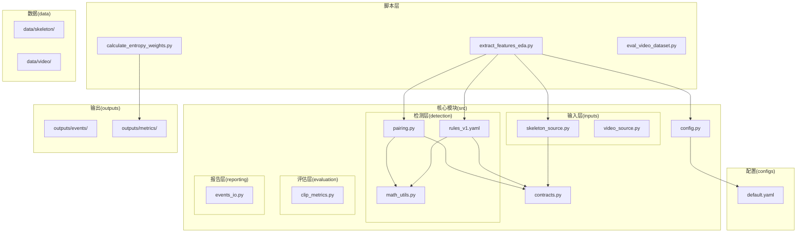
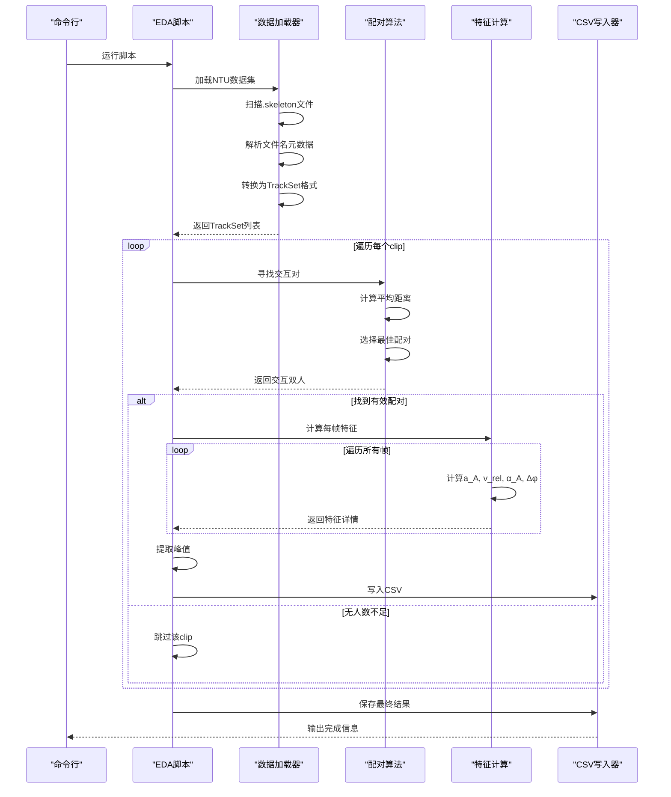
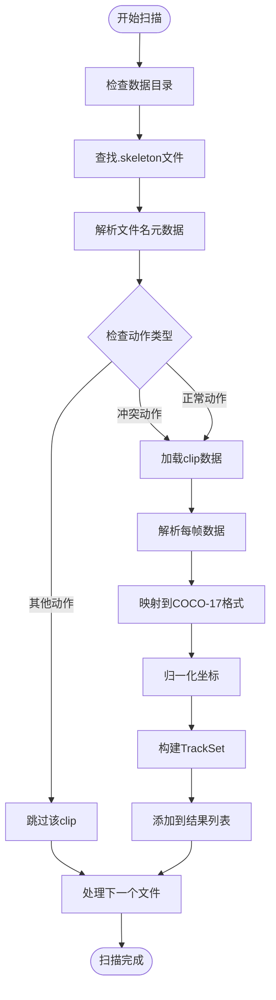
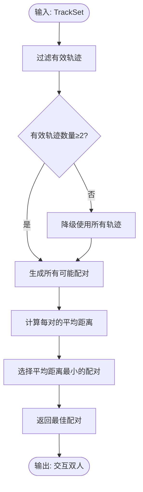
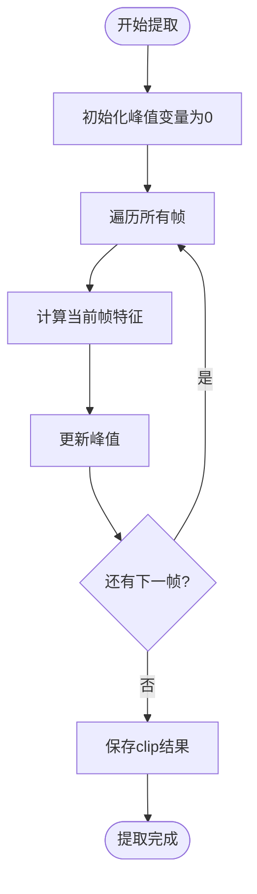
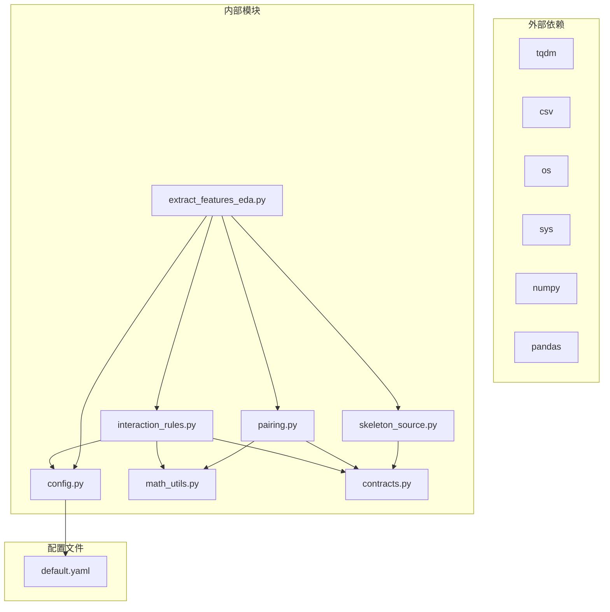
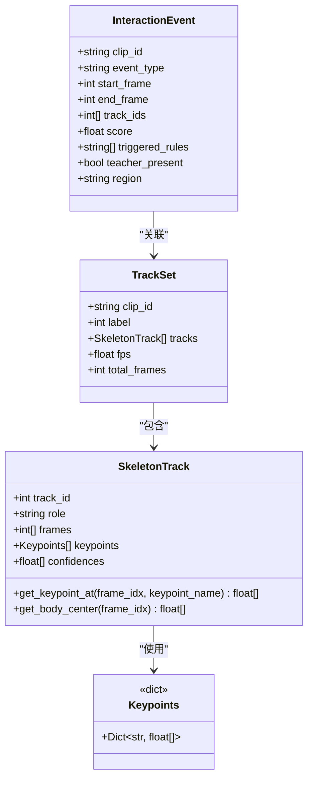

# 特征提取脚本(EDA)

<cite>
**本文档引用的文件**
- [extract_features_eda.py](file://scripts/extract_features_eda.py)
- [skeleton_source.py](file://src/fightguard/inputs/skeleton_source.py)
- [pairing.py](file://src/fightguard/detection/pairing.py)
- [interaction_rules.py](file://src/fightguard/detection/interaction_rules.py)
- [math_utils.py](file://src/fightguard/detection/math_utils.py)
- [config.py](file://src/fightguard/config.py)
- [contracts.py](file://src/fightguard/contracts.py)
- [default.yaml](file://configs/default.yaml)
- [README.md](file://README.md)
</cite>

## 目录
1. [简介](#简介)
2. [项目结构](#项目结构)
3. [核心组件](#核心组件)
4. [架构概览](#架构概览)
5. [详细组件分析](#详细组件分析)
6. [依赖关系分析](#依赖关系分析)
7. [性能考虑](#性能考虑)
8. [故障排除指南](#故障排除指南)
9. [结论](#结论)
10. [附录](#附录)

## 简介
本文档详细介绍特征提取脚本(EDA)的使用方法，该脚本专门用于从NTU RGBD数据集中提取每个clip中交互双人的四个核心物理特征峰值，为后续的熵权法(Entropy Weight Method)提供原始数据。脚本能够：
- 遍历NTU RGBD数据集，扫描并加载.skeleton文件
- 自动配对交互双人，筛选有效的交互片段
- 计算每帧的四个核心物理特征：a_A、v_rel、α_A、Δφ
- 提取每个clip的特征峰值，保存为CSV文件
- 提供进度显示和错误处理机制

## 项目结构
该项目采用模块化架构，主要包含以下关键目录和文件：



**图表来源**
- [extract_features_eda.py:1-106](file://scripts/extract_features_eda.py#L1-L106)
- [skeleton_source.py:1-331](file://src/fightguard/inputs/skeleton_source.py#L1-L331)
- [pairing.py:1-54](file://src/fightguard/detection/pairing.py#L1-L54)
- [interaction_rules.py:1-531](file://src/fightguard/detection/interaction_rules.py#L1-L531)

**章节来源**
- [README.md:46-76](file://README.md#L46-L76)

## 核心组件
特征提取脚本由以下核心组件构成：

### 主要功能模块
1. **数据集扫描器** - 负责遍历NTU RGBD数据集目录，识别.skeleton文件
2. **骨架数据加载器** - 将NTU格式的.skeleton文件转换为内部TrackSet格式
3. **交互配对算法** - 识别并配对可能的交互双人
4. **特征计算引擎** - 计算四个核心物理特征的数值
5. **峰值提取器** - 从整个clip中提取特征的最大值
6. **CSV输出器** - 将结果保存为结构化CSV文件

### 数据契约
项目使用统一的数据契约确保模块间的解耦：
- **Keypoints**: 单帧单人的关键点字典，使用COCO-17标准命名
- **SkeletonTrack**: 单人的多帧骨骼轨迹序列
- **TrackSet**: 一个片段内所有人的轨迹集合
- **InteractionEvent**: 一次冲突事件的结构化描述

**章节来源**
- [contracts.py:15-241](file://src/fightguard/contracts.py#L15-L241)

## 架构概览
特征提取脚本采用分层架构设计，确保功能模块的职责分离和可维护性：



**图表来源**
- [extract_features_eda.py:28-106](file://scripts/extract_features_eda.py#L28-L106)
- [skeleton_source.py:281-331](file://src/fightguard/inputs/skeleton_source.py#L281-L331)
- [pairing.py:14-54](file://src/fightguard/detection/pairing.py#L14-L54)
- [interaction_rules.py:516-531](file://src/fightguard/detection/interaction_rules.py#L516-L531)

## 详细组件分析

### 数据集扫描与加载
数据集扫描过程严格按照NTU RGBD的标准格式进行：

#### 文件名解析机制
脚本能够解析标准的NTU文件名格式：`S001C001P001R001A049.skeleton`
- S001: 场景(setup)编号
- C001: 摄像机(camera)编号  
- P001: 受试者(subject)编号
- R001: 重复(repeat)次数
- A049: 动作类别(action_id)

#### 数据集加载流程


**图表来源**
- [skeleton_source.py:64-90](file://src/fightguard/inputs/skeleton_source.py#L64-L90)
- [skeleton_source.py:211-274](file://src/fightguard/inputs/skeleton_source.py#L211-L274)
- [skeleton_source.py:281-331](file://src/fightguard/inputs/skeleton_source.py#L281-L331)

**章节来源**
- [skeleton_source.py:64-114](file://src/fightguard/inputs/skeleton_source.py#L64-L114)
- [skeleton_source.py:211-274](file://src/fightguard/inputs/skeleton_source.py#L211-L274)

### 交互配对算法
配对算法采用基于平均距离的最优选择策略：

#### 配对决策流程


**图表来源**
- [pairing.py:14-54](file://src/fightguard/detection/pairing.py#L14-L54)

#### 轨迹有效性筛选
算法通过统计"存活帧数"来过滤碎片化轨迹：
- 计算每条轨迹中非零关键点帧的数量
- 仅保留存活帧数≥15的轨迹（相当于至少0.5秒的有效跟踪）
- 如果过滤后少于2个有效轨迹，使用降级策略

**章节来源**
- [pairing.py:14-54](file://src/fightguard/detection/pairing.py#L14-L54)

### 帧级特征计算逻辑
特征计算基于四个核心物理量，每个都经过归一化处理：

#### 特征定义与计算
1. **a_A (肢体加速度)**: 施力侧手腕或脚踝的线加速度
2. **v_rel (相对接近速度)**: 两人之间攻击距离的相对变化率
3. **α_A (关节角加速度)**: 施力侧肘部或膝部的角加速度
4. **Δφ (躯干倾角变化)**: 受力侧躯干倾角的短时变化量

#### 归一化策略
- 使用肩宽尺度作为物理标尺，消除个体差异影响
- 将特征值映射到[0,1]区间，确保不同特征的可比性
- 采用置信度抑制机制，降低低质量检测的影响

**章节来源**
- [interaction_rules.py:363-409](file://src/fightguard/detection/interaction_rules.py#L363-L409)
- [interaction_rules.py:38-52](file://src/fightguard/detection/interaction_rules.py#L38-L52)

### 峰值提取机制
脚本采用全局峰值提取策略，确保每个clip的代表性特征：

#### 峰值提取流程


**图表来源**
- [extract_features_eda.py:64-78](file://scripts/extract_features_eda.py#L64-L78)

#### 特征映射兼容性
为了保持与现有规则系统的兼容性，脚本使用旧接口的特征命名：
- a_A → r_a
- v_rel → r_v  
- α_A → r_alpha
- Δφ → r_phi

**章节来源**
- [extract_features_eda.py:64-87](file://scripts/extract_features_eda.py#L64-L87)
- [interaction_rules.py:516-531](file://src/fightguard/detection/interaction_rules.py#L516-L531)

## 依赖关系分析

### 模块依赖图


**图表来源**
- [extract_features_eda.py:23-26](file://scripts/extract_features_eda.py#L23-L26)
- [config.py:32-82](file://src/fightguard/config.py#L32-L82)

### 关键类关系图


**图表来源**
- [contracts.py:96-171](file://src/fightguard/contracts.py#L96-L171)
- [contracts.py:192-241](file://src/fightguard/contracts.py#L192-L241)

**章节来源**
- [contracts.py:96-241](file://src/fightguard/contracts.py#L96-L241)

## 性能考虑
特征提取脚本在设计时充分考虑了性能优化：

### 时间复杂度分析
- **数据集扫描**: O(N×F)，其中N为clip数量，F为平均帧数
- **配对算法**: O(T²)，T为每clip中有效轨迹数量
- **特征计算**: O(F)，F为clip帧数
- **总体复杂度**: O(N×F×T²)

### 内存使用优化
- 采用生成器模式处理大数据集
- 及时释放中间计算结果
- 使用字典存储避免重复计算

### 进度显示机制
脚本集成tqdm库提供实时进度反馈：
- 显示当前处理的clip数量
- 显示总处理进度百分比
- 显示预计剩余时间

### 错误处理策略
- 文件读取异常捕获和跳过
- 配置文件格式校验
- 数据完整性检查
- 降级策略确保系统稳定性

## 故障排除指南

### 常见问题及解决方案

#### 数据集路径问题
**症状**: 脚本无法找到.skeleton文件
**解决方案**: 
- 确认数据目录路径正确
- 检查目录权限设置
- 验证NTU数据集格式完整性

#### 配置文件错误
**症状**: 配置文件读取失败或字段缺失
**解决方案**:
- 检查default.yaml文件格式
- 确认必需字段存在
- 验证YAML语法正确性

#### 内存不足问题
**症状**: 处理大型数据集时内存溢出
**解决方案**:
- 减少max_clips参数值
- 分批处理数据集
- 增加系统内存或使用64位Python

#### 特征提取异常
**症状**: 某些clip无法提取特征
**解决方案**:
- 检查轨迹有效性筛选条件
- 验证关键点坐标有效性
- 确认配对算法正常工作

**章节来源**
- [skeleton_source.py:323-326](file://src/fightguard/inputs/skeleton_source.py#L323-L326)
- [config.py:60-82](file://src/fightguard/config.py#L60-L82)

## 结论
特征提取脚本(EDA)为整个KidGuard系统提供了坚实的数据基础。通过严谨的NTU RGBD数据处理流程、智能的交互配对算法和精确的物理特征计算，脚本能够高效地提取高质量的特征数据。这些数据随后将用于熵权法计算，实现完全数据驱动的特征权重确定，避免了传统经验参数的主观性。

脚本的设计体现了以下优势：
- **模块化架构**: 清晰的职责分离便于维护和扩展
- **数据标准化**: 统一的COCO-17关键点标准确保跨模块兼容性
- **性能优化**: 合理的时间和空间复杂度控制
- **错误处理**: 完善的异常捕获和降级策略
- **可解释性**: 详细的日志输出和进度反馈

## 附录

### 命令行使用示例
```bash
# 基本使用
python scripts/extract_features_eda.py

# 设置最大clip数量（调试用）
python scripts/extract_features_eda.py --max-clips 100
```

### 输入输出格式说明

#### 输入格式
- **NTU RGBD .skeleton文件**: 标准NTU数据集格式
- **配置文件**: configs/default.yaml
- **数据目录**: 包含.skeleton文件的目录路径

#### 输出格式
- **CSV文件**: outputs/metrics/eda_raw_features.csv
- **CSV列结构**:
  - clip_id: 片段标识符
  - label: 标签(1=冲突, 0=正常)
  - peak_a_A: 肢体加速度峰值
  - peak_v_rel: 相对接近速度峰值
  - peak_alpha_A: 关节角加速度峰值
  - peak_delta_phi: 躯干倾角变化峰值

### 配置参数设置
主要配置参数位于configs/default.yaml文件中：

#### 数据集配置
- ntu_conflict_actions: 冲突动作类别列表
- ntu_normal_actions: 正常动作类别列表

#### 规则阈值配置
- alert_threshold: 告警阈值
- proximity_threshold: 接近阈值
- velocity_threshold: 速度阈值
- wrist_intrusion_threshold: 手腕侵入阈值

#### 输出配置
- save_events_csv: 是否保存事件CSV
- save_events_json: 是否保存事件JSON
- visualization_enabled: 是否启用可视化

### 预期结果展示
脚本执行后将在控制台显示以下信息：
- 数据集扫描进度
- 成功提取的样本数量
- 跳过的样本数量
- CSV文件保存路径
- 下一步操作提示

### 性能优化建议
1. **数据预处理**: 在运行脚本前清理无效数据
2. **内存管理**: 对于超大数据集，分批处理
3. **并行计算**: 考虑使用多进程处理不同数据集
4. **缓存策略**: 利用配置文件缓存减少I/O开销
5. **硬件优化**: 使用SSD存储提升读取速度