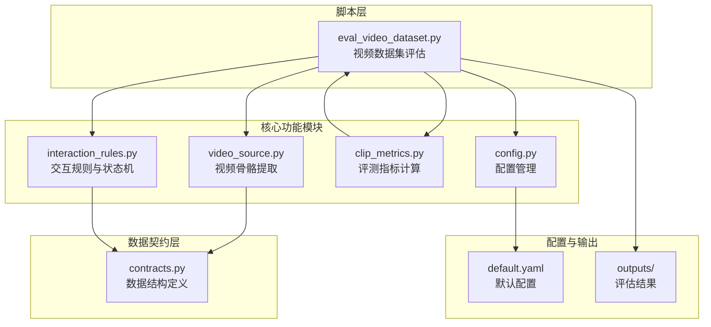
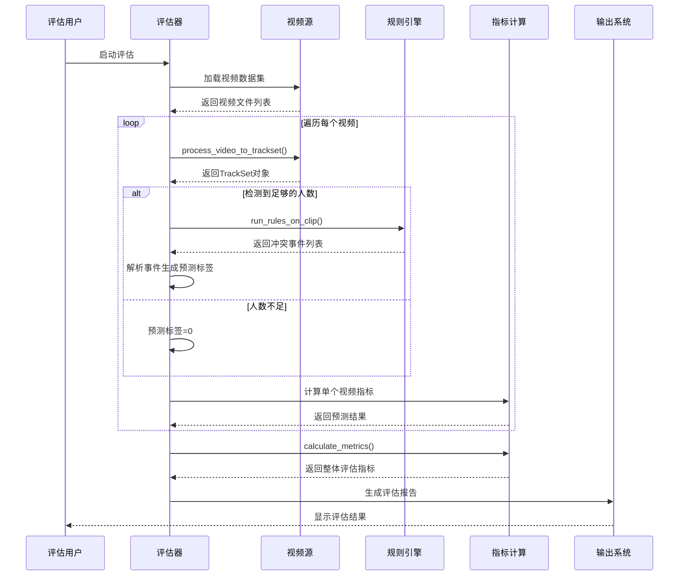
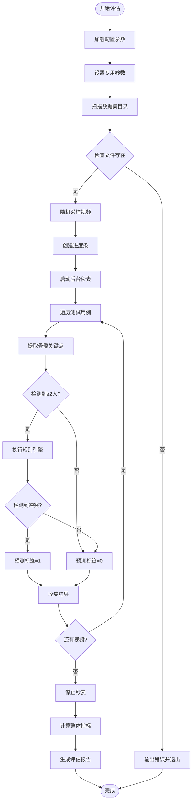
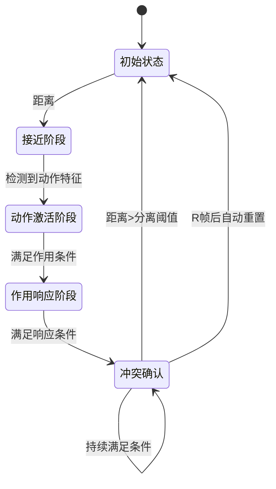
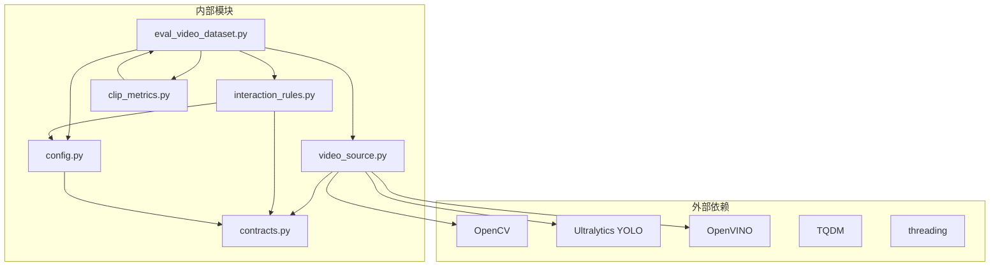

# 视频数据集评估脚本

<cite>
**本文档引用的文件**
- [eval_video_dataset.py](file://scripts/eval_video_dataset.py)
- [clip_metrics.py](file://src/fightguard/evaluation/clip_metrics.py)
- [video_source.py](file://src/fightguard/inputs/video_source.py)
- [interaction_rules.py](file://src/fightguard/detection/interaction_rules.py)
- [config.py](file://src/fightguard/config.py)
- [contracts.py](file://src/fightguard/contracts.py)
- [default.yaml](file://configs/default.yaml)
- [eval_results.csv](file://outputs/metrics/eval_results.csv)
- [README.md](file://README.md)
</cite>

## 目录
1. [简介](#简介)
2. [项目结构](#项目结构)
3. [核心组件](#核心组件)
4. [架构概览](#架构概览)
5. [详细组件分析](#详细组件分析)
6. [依赖关系分析](#依赖关系分析)
7. [性能考量](#性能考量)
8. [故障排除指南](#故障排除指南)
9. [结论](#结论)
10. [附录](#附录)

## 简介
本文档详细介绍视频数据集评估脚本 `eval_video_dataset.py` 的使用方法，该脚本用于在真实2D监控视频数据集上全面评估冲突检测系统的性能。该评估脚本实现了以下核心功能：
- 批量处理真实视频数据集
- 基于规则引擎的冲突检测
- 全面的性能指标计算
- 实时进度监控和秒表功能
- 错判案例分析和报告生成

该系统基于YOLOv8-Pose模型进行骨骼关键点提取，结合物理特征和状态机算法实现冲突检测，支持OpenVINO硬件加速以提升推理性能。

## 项目结构
项目采用模块化架构设计，主要包含以下核心模块：



**图表来源**
- [eval_video_dataset.py:1-132](file://scripts/eval_video_dataset.py#L1-L132)
- [video_source.py:1-193](file://src/fightguard/inputs/video_source.py#L1-L193)
- [interaction_rules.py:1-543](file://src/fightguard/detection/interaction_rules.py#L1-L543)
- [clip_metrics.py:1-47](file://src/fightguard/evaluation/clip_metrics.py#L1-L47)
- [config.py:1-120](file://src/fightguard/config.py#L1-L120)

**章节来源**
- [README.md:46-76](file://README.md#L46-L76)
- [eval_video_dataset.py:16-23](file://scripts/eval_video_dataset.py#L16-L23)

## 核心组件
评估系统由多个相互协作的组件构成，每个组件都有明确的职责分工：

### 1. 视频数据集评估器
主评估脚本负责协调整个评估流程，包括数据集加载、视频处理、规则执行和结果统计。

### 2. 视频骨骼提取模块
使用YOLOv8-Pose模型进行实时骨骼关键点提取，支持OpenVINO硬件加速。

### 3. 交互规则引擎
基于物理特征和状态机的冲突检测算法，实现精确的冲突识别。

### 4. 评测指标计算模块
提供多种机器学习评估指标的计算功能。

### 5. 配置管理系统
统一管理项目的配置参数和阈值设置。

**章节来源**
- [eval_video_dataset.py:24-132](file://scripts/eval_video_dataset.py#L24-L132)
- [video_source.py:57-193](file://src/fightguard/inputs/video_source.py#L57-L193)
- [interaction_rules.py:422-543](file://src/fightguard/detection/interaction_rules.py#L422-L543)
- [clip_metrics.py:9-47](file://src/fightguard/evaluation/clip_metrics.py#L9-L47)

## 架构概览
评估系统采用分层架构设计，确保模块间的松耦合和高内聚：



**图表来源**
- [eval_video_dataset.py:84-107](file://scripts/eval_video_dataset.py#L84-L107)
- [video_source.py:57-193](file://src/fightguard/inputs/video_source.py#L57-L193)
- [interaction_rules.py:422-515](file://src/fightguard/detection/interaction_rules.py#L422-L515)
- [clip_metrics.py:9-47](file://src/fightguard/evaluation/clip_metrics.py#L9-L47)

## 详细组件分析

### 视频数据集评估器 (eval_video_dataset.py)
评估器是整个系统的核心协调者，负责管理完整的评估流程。

#### 主要功能特性
- **数据集加载**：自动扫描指定目录下的冲突和非冲突视频
- **随机采样**：支持按类别随机抽取指定数量的样本
- **实时进度监控**：集成多线程秒表显示处理进度
- **错误处理**：完善的异常捕获和资源清理机制

#### 核心处理流程


**图表来源**
- [eval_video_dataset.py:24-132](file://scripts/eval_video_dataset.py#L24-L132)

#### 实时秒表机制
系统实现了创新的多线程秒表功能，通过独立线程实时更新进度条显示：

- **后台线程**：独立运行的定时器线程，每秒更新一次
- **线程安全**：使用标志变量控制线程生命周期
- **优雅退出**：程序终止时自动清理线程资源

**章节来源**
- [eval_video_dataset.py:24-132](file://scripts/eval_video_dataset.py#L24-L132)

### 视频骨骼提取模块 (video_source.py)
负责将视频文件转换为系统可用的骨骼关键点数据格式。

#### 核心功能
- **YOLOv8-Pose推理**：使用OpenVINO加速的轻量级模型
- **关键点标准化**：将坐标归一化到0-1范围
- **轨迹对齐**：确保所有轨迹具有相同长度和帧对齐
- **ByteTrack追踪**：集成高效的多人追踪算法

#### YOLOv8-Pose模型优化
系统使用经过OpenVINO优化的YOLOv8n-pose模型：
- **硬件加速**：自动利用Intel GPU/NPU进行推理加速
- **轻量化设计**：适合CPU环境运行
- **实时性能**：满足视频流处理需求

**章节来源**
- [video_source.py:41-49](file://src/fightguard/inputs/video_source.py#L41-L49)
- [video_source.py:115-118](file://src/fightguard/inputs/video_source.py#L115-L118)

### 交互规则引擎 (interaction_rules.py)
基于物理特征和状态机的冲突检测算法核心实现。

#### 状态机架构
系统采用严格的四段式状态机设计：



**图表来源**
- [interaction_rules.py:258-370](file://src/fightguard/detection/interaction_rules.py#L258-L370)

#### 物理特征提取
系统提取多种物理特征进行冲突判断：
- **肢体加速度**：手腕和脚踝的线加速度
- **关节角加速度**：肘部和膝部的角加速度
- **相对接近速度**：两人之间的接近速度
- **躯干倾角变化**：受力侧躯干的倾角变化
- **骨盆速度**：骨盆的速度变化

#### 置信度抑制机制
为了提高检测可靠性，系统实现了置信度抑制：
- **平均置信度计算**：基于关键点置信度的平均值
- **动态阈值调整**：根据置信度自动调整检测敏感度
- **噪声过滤**：有效减少低质量检测的干扰

**章节来源**
- [interaction_rules.py:57-247](file://src/fightguard/detection/interaction_rules.py#L57-L247)
- [interaction_rules.py:258-370](file://src/fightguard/detection/interaction_rules.py#L258-L370)

### 评测指标计算模块 (clip_metrics.py)
提供全面的机器学习评估指标计算功能。

#### 指标计算方法
系统实现了以下核心评估指标：

| 指标 | 计算公式 | 含义 |
|------|----------|------|
| 准确率 (Accuracy) | (TP+TN)/(TP+FP+TN+FN) | 整体预测正确的比例 |
| 精确率 (Precision) | TP/(TP+FP) | 预测为正例中实际为正例的比例 |
| 召回率 (Recall) | TP/(TP+FN) | 实际正例中被正确预测的比例 |
| 误报率 (FPR) | FP/(FP+TN) | 实际负例中被错误预测为正例的比例 |
| F1分数 | 2×Precision×Recall/(Precision+Recall) | 精确率和召回率的调和平均 |

#### 混淆矩阵构建
系统自动构建混淆矩阵并计算各类指标：
- **TP (真正例)**：实际冲突且预测为冲突
- **FP (假正例)**：实际正常但预测为冲突  
- **TN (真负例)**：实际正常且预测为正常
- **FN (假负例)**：实际冲突但预测为正常

**章节来源**
- [clip_metrics.py:9-47](file://src/fightguard/evaluation/clip_metrics.py#L9-L47)

### 配置管理系统 (config.py)
统一管理项目的配置参数和阈值设置。

#### 配置文件结构
系统使用YAML格式的配置文件，包含以下主要部分：
- **paths**：输出路径和数据目录配置
- **rules**：检测规则和阈值参数
- **dataset**：数据集定义和动作分类
- **output**：输出选项和格式设置

#### 配置加载机制
- **模块级缓存**：配置文件只读取一次并缓存
- **类型安全**：提供类型检查和验证
- **热重载**：支持运行时重新加载配置

**章节来源**
- [config.py:32-92](file://src/fightguard/config.py#L32-L92)
- [default.yaml:1-62](file://configs/default.yaml#L1-L62)

## 依赖关系分析



**图表来源**
- [eval_video_dataset.py:17-22](file://scripts/eval_video_dataset.py#L17-L22)
- [video_source.py:14-25](file://src/fightguard/inputs/video_source.py#L14-L25)
- [interaction_rules.py:16-24](file://src/fightguard/detection/interaction_rules.py#L16-L24)

### 模块间依赖关系
- **eval_video_dataset.py** 依赖所有核心模块
- **video_source.py** 依赖OpenCV、Ultralytics YOLO和OpenVINO
- **interaction_rules.py** 依赖数学工具和配置管理
- **clip_metrics.py** 仅依赖评估结果数据结构
- **config.py** 依赖YAML解析和文件系统操作

**章节来源**
- [eval_video_dataset.py:17-22](file://scripts/eval_video_dataset.py#L17-L22)
- [video_source.py:14-25](file://src/fightguard/inputs/video_source.py#L14-L25)
- [interaction_rules.py:16-24](file://src/fightguard/detection/interaction_rules.py#L16-L24)

## 性能考量

### 硬件加速优化
系统充分利用现代硬件进行性能优化：

#### OpenVINO加速
- **自动设备选择**：自动检测并使用GPU/NPU加速
- **模型优化**：使用轻量级YOLOv8n-pose模型
- **内存管理**：优化模型加载和内存使用

#### 多线程处理
- **后台秒表**：不影响主处理流程的独立线程
- **异步I/O**：视频读取和骨骼提取的异步处理
- **并发优化**：合理利用多核CPU资源

### 性能基准
系统在不同硬件配置下的性能表现：
- **CPU模式**：适合开发和测试环境
- **GPU加速**：显著提升推理速度
- **混合模式**：平衡性能和资源消耗

**章节来源**
- [video_source.py:41-49](file://src/fightguard/inputs/video_source.py#L41-L49)
- [eval_video_dataset.py:64-81](file://scripts/eval_video_dataset.py#L64-L81)

## 故障排除指南

### 常见问题及解决方案

#### 1. 视频文件加载失败
**症状**：无法打开视频文件或读取失败
**原因**：
- 文件路径错误
- 文件损坏或格式不支持
- 权限不足

**解决方案**：
- 检查视频文件路径和格式
- 验证文件完整性
- 确认读取权限

#### 2. YOLO模型加载错误
**症状**：模型加载失败或推理异常
**原因**：
- OpenVINO环境配置错误
- 模型文件缺失或损坏
- 硬件不支持

**解决方案**：
- 检查OpenVINO安装状态
- 验证模型文件完整性
- 确认硬件兼容性

#### 3. 内存不足问题
**症状**：处理大型视频时内存溢出
**原因**：
- 视频分辨率过高
- 轨迹数据过多
- 内存泄漏

**解决方案**：
- 降低视频分辨率
- 限制最大帧数
- 优化内存使用

#### 4. 评估结果异常
**症状**：评估指标异常或结果不准确
**原因**：
- 配置参数设置不当
- 数据集标注错误
- 规则阈值不合适

**解决方案**：
- 检查配置文件设置
- 验证数据集质量
- 调整规则阈值

**章节来源**
- [eval_video_dataset.py:83-107](file://scripts/eval_video_dataset.py#L83-L107)
- [video_source.py:82-84](file://src/fightguard/inputs/video_source.py#L82-L84)

## 结论
视频数据集评估脚本提供了一个完整、可靠的冲突检测性能评估解决方案。该系统的主要优势包括：

### 技术优势
- **模块化设计**：清晰的分层架构便于维护和扩展
- **硬件加速**：充分利用现代硬件提升性能
- **实时监控**：多线程秒表提供良好的用户体验
- **全面评估**：支持多种机器学习评估指标

### 应用价值
- **学术研究**：为冲突检测算法提供标准化评估框架
- **产品开发**：帮助开发者快速验证算法性能
- **质量保证**：确保系统在真实场景中的可靠性

### 改进建议
1. **增加可视化功能**：集成结果可视化展示
2. **扩展评估指标**：支持更多专业评估指标
3. **优化性能**：进一步提升处理速度
4. **增强可解释性**：提供更详细的检测过程说明

## 附录

### 使用示例

#### 基本使用方法
```bash
python scripts/eval_video_dataset.py
```

#### 自定义参数配置
```python
evaluate_on_videos(num_samples_per_class=10)
```

#### 输出结果解读
评估结果包含以下关键信息：
- **混淆矩阵**：TP、FP、TN、FN的详细统计
- **性能指标**：Accuracy、Precision、Recall、FPR、F1-score
- **错判分析**：误报和漏报的具体案例
- **处理时间**：总耗时和平均处理时间

#### 性能报告生成
系统自动生成详细的性能报告，包括：
- 指标对比表格
- 错判案例分析
- 性能趋势图
- 改进建议

**章节来源**
- [eval_video_dataset.py:130-132](file://scripts/eval_video_dataset.py#L130-L132)
- [eval_results.csv:1-502](file://outputs/metrics/eval_results.csv#L1-L502)