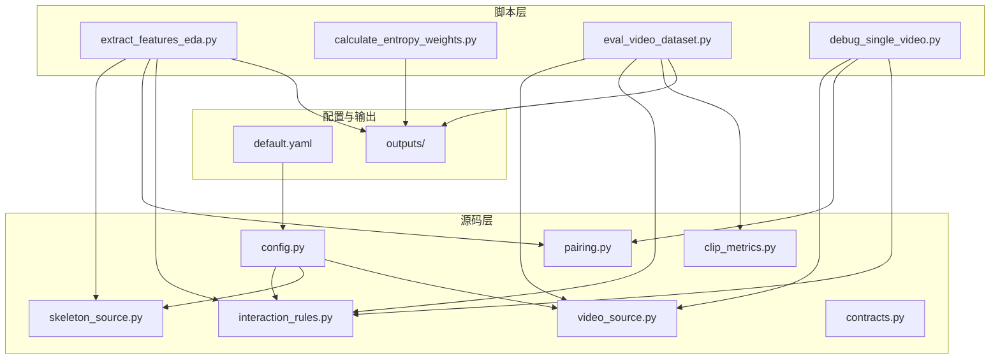
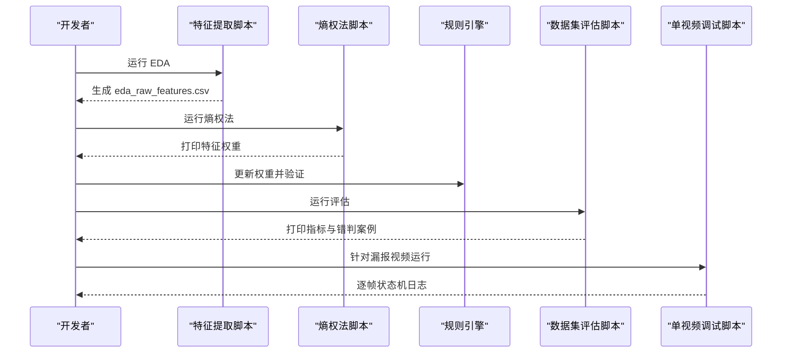
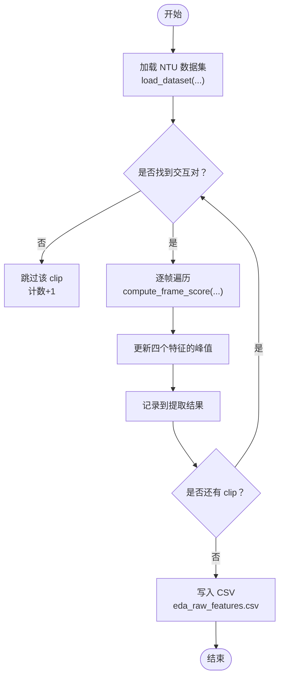
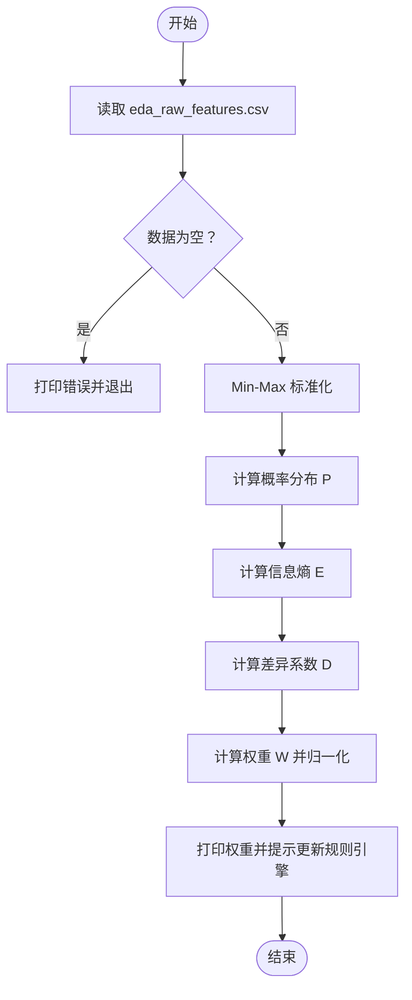
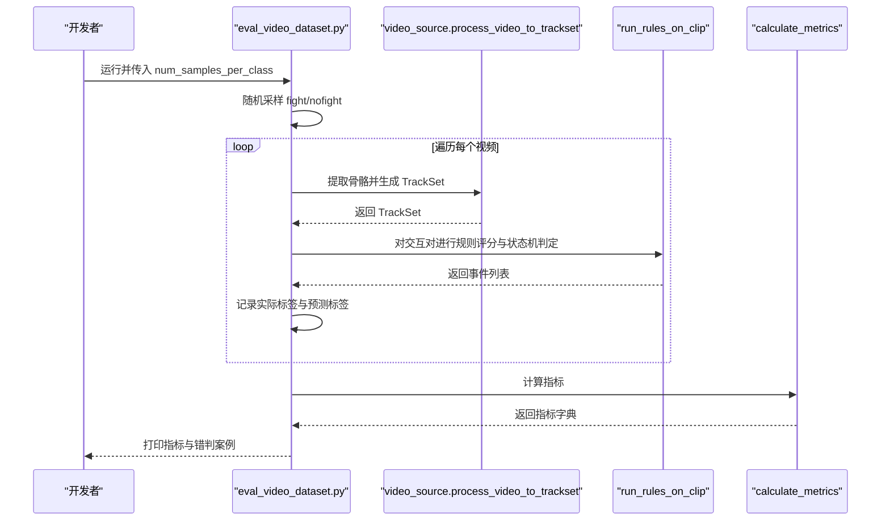
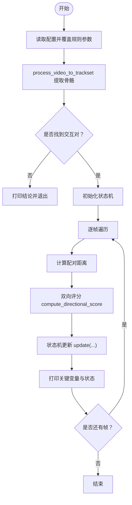
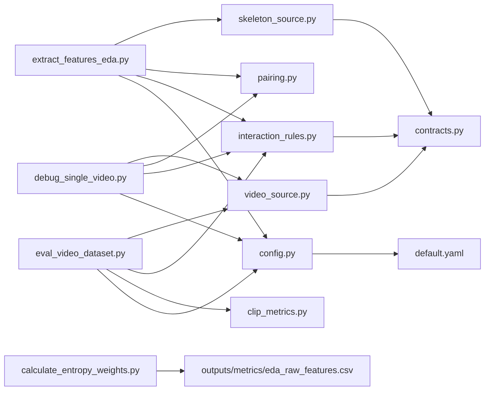

# 阶段性运行脚本

<cite>
**本文引用的文件**
- [extract_features_eda.py](file://scripts/extract_features_eda.py)
- [calculate_entropy_weights.py](file://scripts/calculate_entropy_weights.py)
- [eval_video_dataset.py](file://scripts/eval_video_dataset.py)
- [debug_single_video.py](file://scripts/debug_single_video.py)
- [default.yaml](file://configs/default.yaml)
- [interaction_rules.py](file://src/fightguard/detection/interaction_rules.py)
- [skeleton_source.py](file://src/fightguard/inputs/skeleton_source.py)
- [video_source.py](file://src/fightguard/inputs/video_source.py)
- [pairing.py](file://src/fightguard/detection/pairing.py)
- [clip_metrics.py](file://src/fightguard/evaluation/clip_metrics.py)
- [config.py](file://src/fightguard/config.py)
- [contracts.py](file://src/fightguard/contracts.py)
</cite>

## 目录
1. [简介](#简介)
2. [项目结构](#项目结构)
3. [核心组件](#核心组件)
4. [架构总览](#架构总览)
5. [详细组件分析](#详细组件分析)
6. [依赖分析](#依赖分析)
7. [性能考量](#性能考量)
8. [故障排查指南](#故障排查指南)
9. [结论](#结论)
10. [附录](#附录)

## 简介
本指南面向 KidGuard 项目不同开发阶段的阶段性运行脚本，系统讲解以下四个脚本的用途、命令行参数、输入输出格式、配置要求与预期结果：
- 特征提取脚本（EDA）：遍历数据集提取物理特征峰值，生成用于熵权法的原始特征矩阵。
- 权重计算脚本（熵权法）：基于 EDA 输出的特征矩阵，使用信息熵理论客观计算四大物理特征的权重。
- 数据集评估脚本：在真实监控视频数据集上进行整体性能测试，输出准确率、精确率、召回率、误报率等指标。
- 单视频调试脚本：针对特定视频进行逐帧回放与状态机流转诊断，定位漏报或误报的具体环节。

通过本指南，开发者可在不同阶段快速上手并正确使用这些脚本，形成从特征工程到规则验证的完整流水线。

## 项目结构
KidGuard 项目采用“脚本层 + 源码层 + 配置层”的组织方式：
- scripts：阶段性的运行脚本，直接可执行，负责数据采集、特征工程、评估与调试。
- src：核心算法与数据契约，包括输入处理、规则引擎、配对与状态机、指标计算等模块。
- configs：统一的 YAML 配置文件，提供规则阈值、路径与输出开关等全局参数。
- outputs：中间产物与评估结果的输出目录，如特征 CSV、评估指标 CSV 等。

图表来源
- [extract_features_eda.py:23-26](file://scripts/extract_features_eda.py#L23-L26)
- [calculate_entropy_weights.py:18-26](file://scripts/calculate_entropy_weights.py#L18-L26)
- [eval_video_dataset.py:19-22](file://scripts/eval_video_dataset.py#L19-L22)
- [debug_single_video.py:13-16](file://scripts/debug_single_video.py#L13-L16)
- [default.yaml:1-62](file://configs/default.yaml#L1-L62)

章节来源
- [default.yaml:1-62](file://configs/default.yaml#L1-L62)

## 核心组件
- 特征提取脚本（EDA）
  - 输入：NTU RGBD 骨骼数据集目录（包含若干 .skeleton 文件）。
  - 处理：遍历 clip，寻找交互对，逐帧计算物理特征并记录全局峰值。
  - 输出：CSV 文件，包含 clip_id、label 与四个峰值特征列。
- 权重计算脚本（熵权法）
  - 输入：EDA 输出的 CSV 特征矩阵。
  - 处理：标准化、计算概率分布、信息熵、差异系数与权重。
  - 输出：控制台打印各特征权重，并提示更新规则引擎中的权重变量。
- 数据集评估脚本
  - 输入：真实监控视频数据集（fight 与 nofight 两类）。
  - 处理：随机采样、逐视频推理、配对与规则评分、状态机判定、事件聚合。
  - 输出：控制台汇总指标与错判案例分析，并将结果写入评估 CSV。
- 单视频调试脚本
  - 输入：指定视频路径（例如某漏报视频）。
  - 处理：提取骨骼、配对、逐帧评分与状态机流转，打印关键变量。
  - 输出：控制台逐帧日志，辅助定位问题环节。

章节来源
- [extract_features_eda.py:28-106](file://scripts/extract_features_eda.py#L28-L106)
- [calculate_entropy_weights.py:12-71](file://scripts/calculate_entropy_weights.py#L12-L71)
- [eval_video_dataset.py:24-132](file://scripts/eval_video_dataset.py#L24-L132)
- [debug_single_video.py:18-81](file://scripts/debug_single_video.py#L18-L81)

## 架构总览
四个脚本分别对应 KidGuard 的四个开发阶段：
- 阶段 A：EDA 特征提取 → 熵权法权重计算 → 规则引擎权重更新
- 阶段 B：规则引擎与状态机 → 视频推理与事件检测
- 阶段 C：数据集评估 → 指标汇总与错误分析
- 阶段 D：单视频诊断 → 逐帧回放与状态机流转

图表来源
- [extract_features_eda.py:92-101](file://scripts/extract_features_eda.py#L92-L101)
- [calculate_entropy_weights.py:59-67](file://scripts/calculate_entropy_weights.py#L59-L67)
- [eval_video_dataset.py:109-131](file://scripts/eval_video_dataset.py#L109-L131)
- [debug_single_video.py:18-81](file://scripts/debug_single_video.py#L18-L81)

## 详细组件分析

### 特征提取脚本（EDA）
- 目标与流程
  - 遍历数据集，提取每个 clip 中交互双人的四个核心物理特征的峰值。
  - 四个特征来源于规则引擎的单帧评分细节，包括：腕部线加速度、相对接近速度、肘部角加速度、躯干倾角变化。
  - 将结果写入 outputs/metrics/eda_raw_features.csv，供熵权法使用。
- 关键实现要点
  - 数据加载：通过 skeleton_source.load_dataset 读取 NTU .skeleton 文件，按配置筛选冲突/正常样本。
  - 交互配对：通过 pairing.get_interaction_pairs 获取最佳交互对。
  - 特征提取：逐帧调用 interaction_rules.compute_frame_score，累积四个特征的全局最大值。
  - 结果落盘：CSV 写入包含 clip_id、label、四个峰值特征。
- 命令行参数
  - 无显式命令行参数，内部硬编码数据集路径与样本上限。
- 输入输出格式
  - 输入：NTU RGBD 骨骼数据集目录（两个子目录）。
  - 输出：CSV 文件，字段包括 clip_id、label、peak_a_A、peak_v_rel、peak_alpha_A、peak_delta_phi。
- 配置要求
  - 配置文件 default.yaml 中的 dataset、paths、rules 等字段需存在。
  - 若需调整样本数量，可在脚本中修改 max_clips。
- 预期结果
  - 成功提取若干样本，CSV 文件非空；若路径错误或无数据，打印错误并退出。
- 使用示例
  - 直接运行脚本，等待进度条完成，检查 outputs/metrics/eda_raw_features.csv 是否生成。
- 最佳实践
  - 确保数据集路径正确且包含 .skeleton 文件。
  - 若样本量不足，适当增大 max_clips 以提升统计显著性。

图表来源
- [extract_features_eda.py:43-87](file://scripts/extract_features_eda.py#L43-L87)
- [skeleton_source.py:281-330](file://src/fightguard/inputs/skeleton_source.py#L281-L330)
- [pairing.py:14-53](file://src/fightguard/detection/pairing.py#L14-L53)
- [interaction_rules.py:516-530](file://src/fightguard/detection/interaction_rules.py#L516-L530)

章节来源
- [extract_features_eda.py:28-106](file://scripts/extract_features_eda.py#L28-L106)
- [skeleton_source.py:281-330](file://src/fightguard/inputs/skeleton_source.py#L281-L330)
- [pairing.py:14-53](file://src/fightguard/detection/pairing.py#L14-L53)
- [interaction_rules.py:516-530](file://src/fightguard/detection/interaction_rules.py#L516-L530)

### 权重计算脚本（熵权法）
- 目标与流程
  - 读取 EDA 输出的特征矩阵，使用信息熵理论客观计算权重。
  - 标准化、计算概率分布、信息熵、差异系数与归一化权重。
  - 控制台打印权重，并提示更新规则引擎中的权重变量。
- 关键实现要点
  - 数据读取：从 outputs/metrics/eda_raw_features.csv 读取特征矩阵。
  - 标准化：Min-Max 归一化，避免量纲影响。
  - 熵权法：计算信息熵与差异系数，得到权重并归一化。
- 命令行参数
  - 无显式命令行参数。
- 输入输出格式
  - 输入：CSV 文件（由 EDA 生成）。
  - 输出：控制台打印权重，并提示更新规则引擎权重。
- 配置要求
  - 需要 EDA 已成功生成特征 CSV。
- 预期结果
  - 成功加载数据并计算出四个特征的权重，打印到控制台。
- 使用示例
  - 运行脚本，复制权重到规则引擎相应变量。
- 最佳实践
  - 若数据为空或文件缺失，先运行 EDA 再运行本脚本。
  - 权重更新后建议重新评估以验证效果。

图表来源
- [calculate_entropy_weights.py:17-67](file://scripts/calculate_entropy_weights.py#L17-L67)

章节来源
- [calculate_entropy_weights.py:12-71](file://scripts/calculate_entropy_weights.py#L12-L71)

### 数据集评估脚本
- 目标与流程
  - 在真实监控视频数据集上进行批量评测，评估规则引擎的泛化能力。
  - 新增后台实时秒表线程，缓解推理慢导致的终端假死。
  - 输出准确率、精确率、召回率、误报率等指标，并列出错判案例。
- 关键实现要点
  - 数据加载：随机采样 fight 与 nofight 各若干个视频。
  - 视频处理：调用 video_source.process_video_to_trackset 提取骨骼。
  - 规则评分：调用 interaction_rules.run_rules_on_clip，状态机判定事件。
  - 指标计算：调用 evaluation.calculate_metrics 汇总指标。
- 命令行参数
  - num_samples_per_class：每类采样数量，默认 5。
- 输入输出格式
  - 输入：视频数据集目录（fight 与 nofight 子目录）。
  - 输出：控制台打印指标与错判案例；评估结果写入 outputs/metrics/eval_results.csv。
- 配置要求
  - 配置文件 default.yaml 中的 rules 参数需包含 proximity_window_frames、smoothing_window_frames、alert_threshold 等。
- 预期结果
  - 成功处理若干视频，打印汇总指标与错判案例。
- 使用示例
  - python eval_video_dataset.py 10
- 最佳实践
  - 根据硬件性能调整 num_samples_per_class。
  - 若推理较慢，可适当减少 max_frames 或使用更高效的模型部署。

图表来源
- [eval_video_dataset.py:24-131](file://scripts/eval_video_dataset.py#L24-L131)
- [video_source.py:57-192](file://src/fightguard/inputs/video_source.py#L57-L192)
- [interaction_rules.py:410-503](file://src/fightguard/detection/interaction_rules.py#L410-L503)
- [clip_metrics.py:9-46](file://src/fightguard/evaluation/clip_metrics.py#L9-L46)

章节来源
- [eval_video_dataset.py:24-132](file://scripts/eval_video_dataset.py#L24-L132)
- [video_source.py:57-192](file://src/fightguard/inputs/video_source.py#L57-L192)
- [interaction_rules.py:410-503](file://src/fightguard/detection/interaction_rules.py#L410-L503)
- [clip_metrics.py:9-46](file://src/fightguard/evaluation/clip_metrics.py#L9-L46)

### 单视频调试脚本
- 目标与流程
  - 针对特定视频（如漏报视频）进行逐帧回放与状态机流转诊断。
  - 打印关键变量（距离、置信度抑制系数、爆发特征、状态机阶段、平滑得分）。
- 关键实现要点
  - 视频处理：调用 video_source.process_video_to_trackset 提取骨骼。
  - 配对与评分：调用 pairing.get_interaction_pairs 与 interaction_rules.compute_directional_score。
  - 状态机：实例化 CaptainStateMachine，逐帧更新并记录状态。
- 命令行参数
  - 无显式命令行参数，内部硬编码视频路径。
- 输入输出格式
  - 输入：指定视频路径。
  - 输出：控制台逐帧日志，包含距离、置信度抑制、爆发特征、状态机阶段与平滑得分。
- 配置要求
  - 配置文件 default.yaml 中的 rules 参数需满足状态机阈值。
- 预期结果
  - 成功提取骨骼并打印逐帧状态机日志，便于定位问题环节。
- 使用示例
  - 运行脚本，观察漏报视频的状态机流转与关键变量变化。
- 最佳实践
  - 将视频路径替换为实际漏报视频，结合日志逐步缩小问题范围。

图表来源
- [debug_single_video.py:18-81](file://scripts/debug_single_video.py#L18-L81)
- [video_source.py:57-192](file://src/fightguard/inputs/video_source.py#L57-L192)
- [pairing.py:6-12](file://src/fightguard/detection/pairing.py#L6-L12)
- [interaction_rules.py:258-357](file://src/fightguard/detection/interaction_rules.py#L258-L357)

章节来源
- [debug_single_video.py:18-81](file://scripts/debug_single_video.py#L18-L81)
- [video_source.py:57-192](file://src/fightguard/inputs/video_source.py#L57-L192)
- [pairing.py:6-12](file://src/fightguard/detection/pairing.py#L6-L12)
- [interaction_rules.py:258-357](file://src/fightguard/detection/interaction_rules.py#L258-L357)

## 依赖分析
- 脚本与模块的依赖关系
  - 特征提取脚本依赖 skeleton_source、pairing、interaction_rules、config。
  - 权重计算脚本依赖 pandas、numpy，读取 outputs/metrics/eda_raw_features.csv。
  - 数据集评估脚本依赖 video_source、interaction_rules、clip_metrics、config。
  - 单视频调试脚本依赖 video_source、pairing、interaction_rules、config。
- 配置与数据契约
  - 配置文件 default.yaml 提供规则阈值、路径与输出开关。
  - contracts.py 定义 TrackSet、SkeletonTrack、InteractionEvent 等统一数据结构。

图表来源
- [extract_features_eda.py:23-26](file://scripts/extract_features_eda.py#L23-L26)
- [calculate_entropy_weights.py:18-26](file://scripts/calculate_entropy_weights.py#L18-L26)
- [eval_video_dataset.py:19-22](file://scripts/eval_video_dataset.py#L19-L22)
- [debug_single_video.py:13-16](file://scripts/debug_single_video.py#L13-L16)
- [default.yaml:1-62](file://configs/default.yaml#L1-L62)

章节来源
- [default.yaml:1-62](file://configs/default.yaml#L1-L62)
- [contracts.py:96-186](file://src/fightguard/contracts.py#L96-L186)

## 性能考量
- 特征提取阶段
  - NTU 数据集加载与配对过程较为高效，瓶颈通常在交互配对与逐帧评分。
  - 建议合理设置 max_clips，避免过大数据集导致内存压力。
- 权重计算阶段
  - 熵权法计算复杂度较低，主要受限于 CSV 读取与数值计算。
- 评估阶段
  - YOLOv8-Pose 推理较慢，建议使用 OpenVINO 加速模型（脚本已内置）。
  - 后台秒表线程缓解终端假死，但实际耗时仍较长。
- 调试阶段
  - 单视频调试建议限制 max_frames，避免长时间等待。
- 最佳实践
  - 使用 OpenVINO 模型部署以提升推理速度。
  - 在 CI 环境中分批运行评估，避免长时间占用资源。

[本节为通用性能讨论，不直接分析具体文件]

## 故障排查指南
- 配置文件缺失或格式错误
  - 现象：运行时报错提示配置文件不存在或字段缺失。
  - 处理：确保 configs/default.yaml 存在且包含必需字段（paths、rules、dataset、output）。
- 数据集路径错误
  - 现象：EDA 无法加载数据或评估脚本找不到 fight/nofight 目录。
  - 处理：检查脚本中硬编码的数据集路径是否正确。
- 特征 CSV 为空
  - 现象：熵权法脚本报错数据集为空。
  - 处理：先运行 EDA 生成特征 CSV。
- 视频无法读取或无人
  - 现象：评估或调试脚本提示无法打开视频或未检测到人。
  - 处理：检查视频路径与权限，确认摄像头或视频文件可用。
- 状态机无触发
  - 现象：单视频调试日志中状态机始终为 0。
  - 处理：检查 proximity_window_frames、smoothing_window_frames、alert_threshold 等阈值是否合理。

章节来源
- [config.py:32-82](file://src/fightguard/config.py#L32-L82)
- [eval_video_dataset.py:40-42](file://scripts/eval_video_dataset.py#L40-L42)
- [debug_single_video.py:32-34](file://scripts/debug_single_video.py#L32-L34)

## 结论
KidGuard 的阶段性运行脚本形成了从特征工程到规则验证再到问题定位的完整闭环。通过 EDA 提取特征、熵权法客观赋权、数据集评估与单视频调试，开发者可以在不同阶段快速迭代并定位问题。建议在实际使用中结合硬件性能与数据规模，合理设置参数并分批运行，以获得稳定可靠的评估结果。

[本节为总结性内容，不直接分析具体文件]

## 附录
- 命令行使用示例
  - 特征提取：python extract_features_eda.py
  - 熵权法：python calculate_entropy_weights.py
  - 数据集评估：python eval_video_dataset.py 10
  - 单视频调试：python debug_single_video.py
- 关键配置项参考
  - rules：proximity_window_frames、smoothing_window_frames、alert_threshold、tau_c 等。
  - paths：output_events_dir、output_metrics_dir、skeleton_data_dir、video_data_dir。
  - dataset：ntu_conflict_actions、ntu_normal_actions。

章节来源
- [default.yaml:16-30](file://configs/default.yaml#L16-L30)
- [eval_video_dataset.py:24-36](file://scripts/eval_video_dataset.py#L24-L36)
- [debug_single_video.py:23-27](file://scripts/debug_single_video.py#L23-L27)