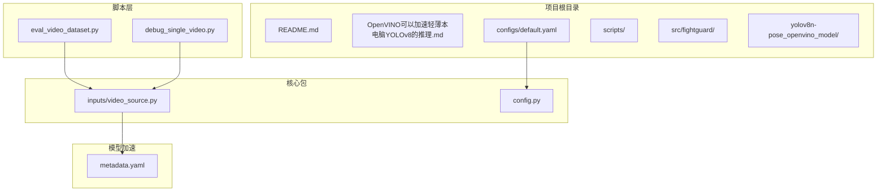
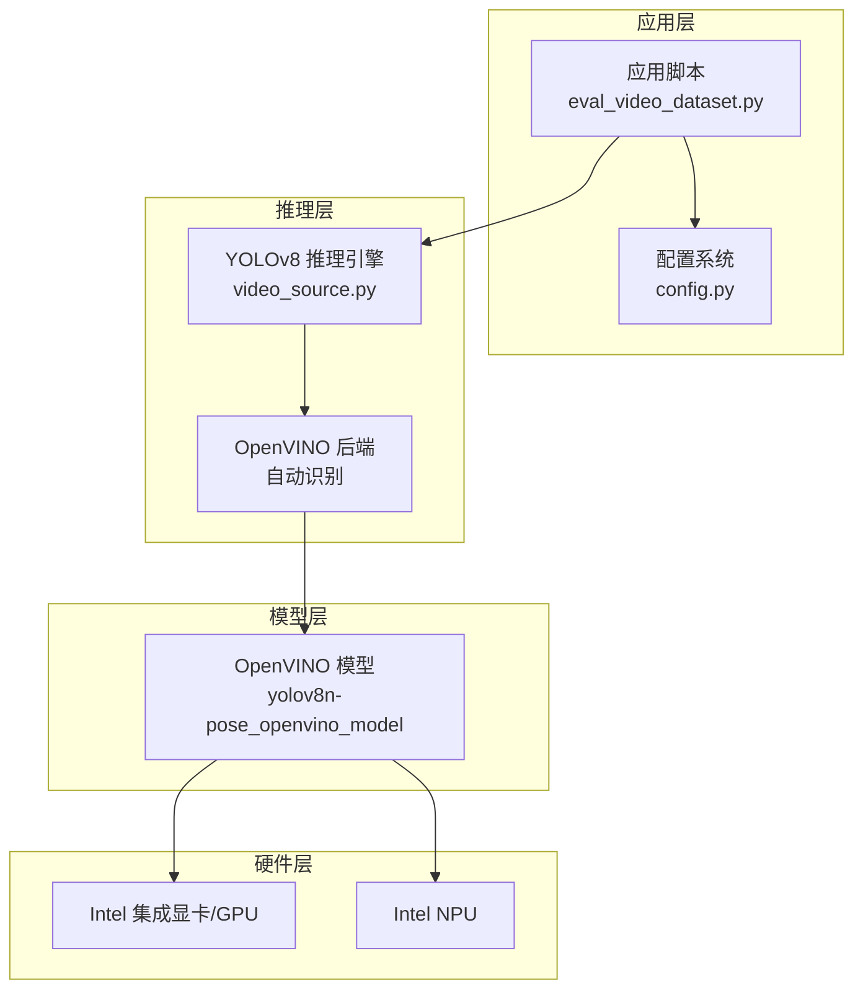
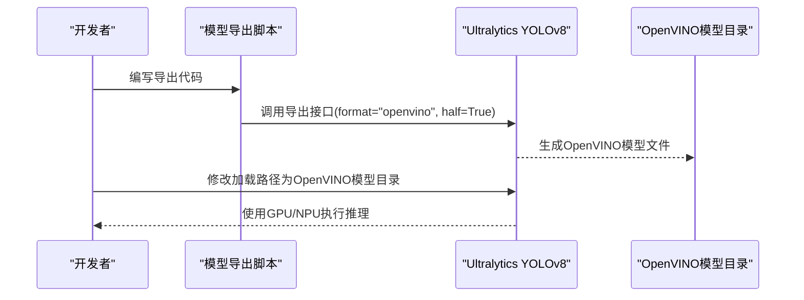
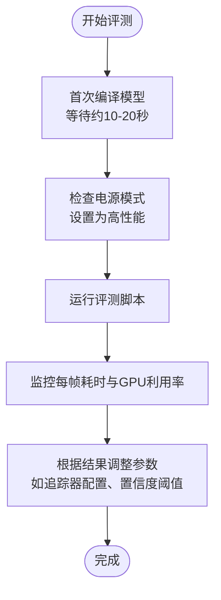
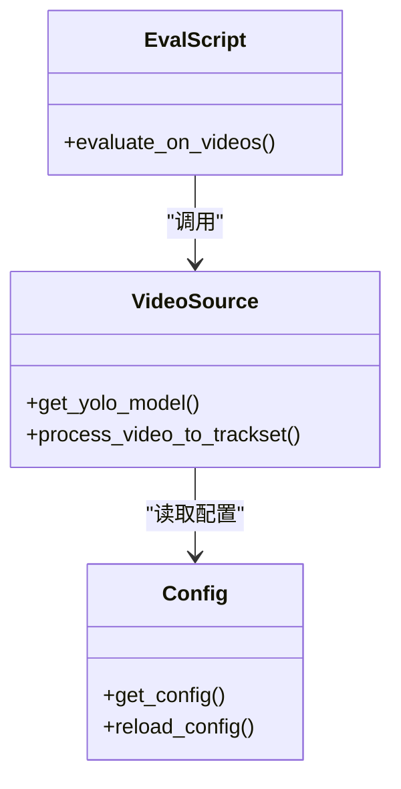
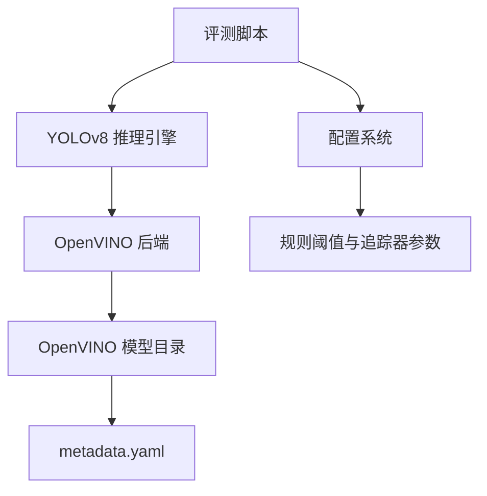
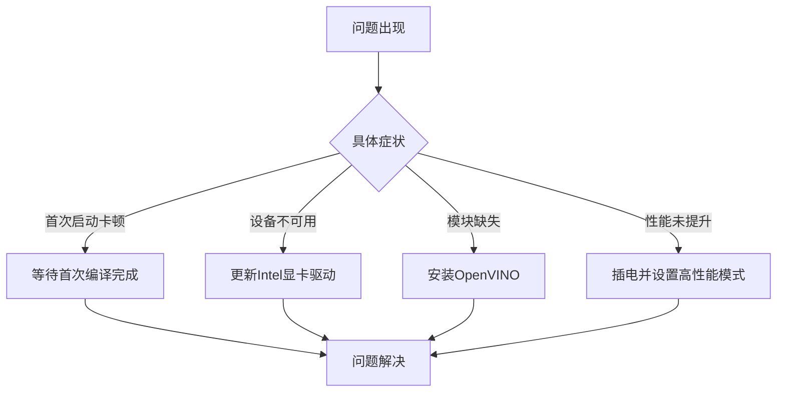

# OpenVINO硬件加速配置

<cite>
**本文引用的文件**
- [README.md](file://README.md)
- [OpenVINO可以加速轻薄本电脑YOLOv8的推理.md](file://OpenVINO可以加速轻薄本电脑YOLOv8的推理.md)
- [configs/default.yaml](file://configs/default.yaml)
- [yolov8n-pose_openvino_model/metadata.yaml](file://yolov8n-pose_openvino_model/metadata.yaml)
- [scripts/eval_video_dataset.py](file://scripts/eval_video_dataset.py)
- [src/fightguard/inputs/video_source.py](file://src/fightguard/inputs/video_source.py)
- [src/fightguard/config.py](file://src/fightguard/config.py)
- [scripts/debug_single_video.py](file://scripts/debug_single_video.py)
- [kernel.errors.txt](file://kernel.errors.txt)
</cite>

## 目录
1. [引言](#引言)
2. [项目结构](#项目结构)
3. [核心组件](#核心组件)
4. [架构概览](#架构概览)
5. [详细组件分析](#详细组件分析)
6. [依赖分析](#依赖分析)
7. [性能考虑](#性能考虑)
8. [故障排除指南](#故障排除指南)
9. [结论](#结论)
10. [附录](#附录)

## 引言
本指南面向在Intel集成显卡轻薄本上部署KidGuard系统的开发者，提供OpenVINO硬件加速的完整配置方案。KidGuard基于YOLOv8n-pose进行骨骼关键点提取，并通过规则引擎实现冲突行为识别。由于项目默认使用CPU推理，推理效率较低，本指南通过OpenVINO将YOLOv8n-pose模型编译为可在Intel GPU/NPU上高效执行的中间表示，从而显著提升推理速度，同时保持输出结果与原模型一致。

## 项目结构
KidGuard采用模块化设计，核心推理流程集中在视频输入模块中，通过Ultralytics YOLOv8接口加载模型并执行跟踪与关键点提取。OpenVINO加速的关键在于将PyTorch/YOLOv8模型导出为OpenVINO格式，并在运行时由Ultralytics自动识别并调用OpenVINO后端。

**图表来源**
- [README.md:1-131](file://README.md#L1-L131)
- [scripts/eval_video_dataset.py:1-132](file://scripts/eval_video_dataset.py#L1-L132)
- [src/fightguard/inputs/video_source.py:1-193](file://src/fightguard/inputs/video_source.py#L1-L193)
- [src/fightguard/config.py:1-120](file://src/fightguard/config.py#L1-L120)
- [yolov8n-pose_openvino_model/metadata.yaml:1-27](file://yolov8n-pose_openvino_model/metadata.yaml#L1-L27)

**章节来源**
- [README.md:46-76](file://README.md#L46-L76)
- [scripts/eval_video_dataset.py:19-22](file://scripts/eval_video_dataset.py#L19-L22)
- [src/fightguard/inputs/video_source.py:14-25](file://src/fightguard/inputs/video_source.py#L14-L25)

## 核心组件
- OpenVINO加速模型：位于[yolov8n-pose_openvino_model/metadata.yaml](file://yolov8n-pose_openvino_model/metadata.yaml)，包含模型导出参数（如半精度、批大小、输入尺寸等）以及关键点数量信息。
- 视频推理入口：在[src/fightguard/inputs/video_source.py](file://src/fightguard/inputs/video_source.py)中，通过Ultralytics YOLOv8接口加载OpenVINO模型并执行跟踪推理。
- 配置系统：在[src/fightguard/config.py](file://src/fightguard/config.py)中集中管理全局参数，确保推理参数与规则引擎的一致性。
- 批量评测脚本：在[scripts/eval_video_dataset.py](file://scripts/eval_video_dataset.py)中演示如何在真实视频数据集上进行评测，并展示OpenVINO加速带来的性能收益。

**章节来源**
- [yolov8n-pose_openvino_model/metadata.yaml:15-26](file://yolov8n-pose_openvino_model/metadata.yaml#L15-L26)
- [src/fightguard/inputs/video_source.py:41-49](file://src/fightguard/inputs/video_source.py#L41-L49)
- [src/fightguard/config.py:32-82](file://src/fightguard/config.py#L32-L82)
- [scripts/eval_video_dataset.py:24-131](file://scripts/eval_video_dataset.py#L24-L131)

## 架构概览
下图展示了OpenVINO加速在KidGuard中的整体架构：应用通过Ultralytics YOLOv8接口加载OpenVINO模型，模型在Intel GPU/NPU上执行推理，输出关键点与置信度，随后进入规则引擎进行冲突判定。

**图表来源**
- [src/fightguard/inputs/video_source.py:41-49](file://src/fightguard/inputs/video_source.py#L41-L49)
- [yolov8n-pose_openvino_model/metadata.yaml:15-26](file://yolov8n-pose_openvino_model/metadata.yaml#L15-L26)

## 详细组件分析

### OpenVINO加速原理与优势
- 原理：OpenVINO将模型编译为可在Intel硬件上高效执行的中间表示，利用GPU/NPU并行计算能力，减少CPU翻译与调度开销。
- 优势：在Intel轻薄本上显著提升推理速度，同时保持与原模型相同的输出结果，便于快速迭代与评测。

**章节来源**
- [OpenVINO可以加速轻薄本电脑YOLOv8的推理.md:24-33](file://OpenVINO可以加速轻薄本电脑YOLOv8的推理.md#L24-L33)

### 环境准备与兼容性检查
- 硬件要求：Intel Core i5/i7/i9或Ultra系列处理器，配备集成显卡（近三年购买的轻薄本通常满足条件）。
- 软件要求：确保已安装OpenVINO（可通过pip安装）。
- 驱动要求：若出现设备不可用错误，需更新Intel显卡驱动。

**章节来源**
- [OpenVINO可以加速轻薄本电脑YOLOv8的推理.md:51-54](file://OpenVINO可以加速轻薄本电脑YOLOv8的推理.md#L51-L54)
- [OpenVINO可以加速轻薄本电脑YOLOv8的推理.md:88](file://OpenVINO可以加速轻薄本电脑YOLOv8的推理.md#L88)

### 模型导出与配置
- 导出步骤：使用Ultralytics YOLOv8提供的导出接口，将YOLOv8n-pose.pt转换为OpenVINO格式，并启用半精度以提升性能。
- 导出结果：导出会生成包含XML与权重的OpenVINO模型目录，metadata.yaml记录了导出参数与关键点形状等信息。
- 加载方式：在视频推理入口中，直接加载OpenVINO模型目录，Ultralytics会自动识别并调用OpenVINO后端。

**图表来源**
- [OpenVINO可以加速轻薄本电脑YOLOv8的推理.md:61-78](file://OpenVINO可以加速轻薄本电脑YOLOv8的推理.md#L61-L78)
- [yolov8n-pose_openvino_model/metadata.yaml:15-26](file://yolov8n-pose_openvino_model/metadata.yaml#L15-L26)

**章节来源**
- [OpenVINO可以加速轻薄本电脑YOLOv8的推理.md:61-78](file://OpenVINO可以加速轻薄本电脑YOLOv8的推理.md#L61-L78)
- [yolov8n-pose_openvino_model/metadata.yaml:15-26](file://yolov8n-pose_openvino_model/metadata.yaml#L15-L26)

### 性能调优与监控
- 首次编译等待：OpenVINO首次编译模型需要一定时间，属于正常现象，后续启动将显著提速。
- 功率管理：确保笔记本插电并设置为高性能模式，避免CPU降频导致性能下降。
- 追踪器优化：在视频推理中使用ByteTrack追踪器，提升低分检测框的鲁棒性，适合复杂场景。

**图表来源**
- [OpenVINO可以加速轻薄本电脑YOLOv8的推理.md:87-90](file://OpenVINO可以加速轻薄本电脑YOLOv8的推理.md#L87-L90)
- [scripts/eval_video_dataset.py:62-81](file://scripts/eval_video_dataset.py#L62-L81)
- [src/fightguard/inputs/video_source.py:115-118](file://src/fightguard/inputs/video_source.py#L115-L118)

**章节来源**
- [OpenVINO可以加速轻薄本电脑YOLOv8的推理.md:87-90](file://OpenVINO可以加速轻薄本电脑YOLOv8的推理.md#L87-L90)
- [scripts/eval_video_dataset.py:62-81](file://scripts/eval_video_dataset.py#L62-L81)
- [src/fightguard/inputs/video_source.py:115-118](file://src/fightguard/inputs/video_source.py#L115-L118)

### 代码级实现要点
- 模型加载：在视频推理入口中，将模型加载路径从YOLOv8n-pose.pt替换为OpenVINO模型目录，即可启用硬件加速。
- 配置一致性：通过配置系统集中管理规则阈值与追踪器参数，确保评测与推理参数一致。
- 批量评测：评测脚本提供实时秒表与多线程计时，缓解长时间推理导致的等待焦虑。

**图表来源**
- [src/fightguard/inputs/video_source.py:41-49](file://src/fightguard/inputs/video_source.py#L41-L49)
- [src/fightguard/config.py:32-82](file://src/fightguard/config.py#L32-L82)
- [scripts/eval_video_dataset.py:24-131](file://scripts/eval_video_dataset.py#L24-L131)

**章节来源**
- [src/fightguard/inputs/video_source.py:41-49](file://src/fightguard/inputs/video_source.py#L41-L49)
- [src/fightguard/config.py:32-82](file://src/fightguard/config.py#L32-L82)
- [scripts/eval_video_dataset.py:24-131](file://scripts/eval_video_dataset.py#L24-L131)

## 依赖分析
- OpenVINO后端：Ultralytics YOLOv8在加载OpenVINO模型目录时自动识别并调用OpenVINO后端，无需额外配置。
- 模型参数：OpenVINO模型的导出参数（如半精度、批大小、输入尺寸）在metadata.yaml中明确记录，确保推理一致性。
- 配置依赖：评测脚本与视频推理入口共享配置系统，确保规则阈值与追踪器参数一致。

**图表来源**
- [src/fightguard/inputs/video_source.py:41-49](file://src/fightguard/inputs/video_source.py#L41-L49)
- [yolov8n-pose_openvino_model/metadata.yaml:15-26](file://yolov8n-pose_openvino_model/metadata.yaml#L15-L26)
- [src/fightguard/config.py:32-82](file://src/fightguard/config.py#L32-L82)

**章节来源**
- [src/fightguard/inputs/video_source.py:41-49](file://src/fightguard/inputs/video_source.py#L41-L49)
- [yolov8n-pose_openvino_model/metadata.yaml:15-26](file://yolov8n-pose_openvino_model/metadata.yaml#L15-L26)
- [src/fightguard/config.py:32-82](file://src/fightguard/config.py#L32-L82)

## 性能考虑
- 推理加速：OpenVINO在Intel轻薄本上可将YOLOv8n-pose推理速度提升约2倍，显著缩短评测时间。
- 资源占用：OpenVINO利用GPU/NPU并行计算，降低CPU占用，提升系统整体响应性。
- 参数调优：结合ByteTrack追踪器与规则阈值，进一步提升检测稳定性与召回率。

**章节来源**
- [OpenVINO可以加速轻薄本电脑YOLOv8的推理.md:36-45](file://OpenVINO可以加速轻薄本电脑YOLOv8的推理.md#L36-L45)
- [src/fightguard/inputs/video_source.py:115-118](file://src/fightguard/inputs/video_source.py#L115-L118)

## 故障排除指南
- 首次编译等待：OpenVINO首次编译模型需要10-20秒，属正常现象，后续启动将显著提速。
- 设备不可用：若出现设备不可用错误，需更新Intel显卡驱动至最新版本。
- 无OpenVINO模块：若提示找不到openvino模块，需先安装OpenVINO。
- 性能未提升：检查是否插电并设置为高性能模式，避免CPU降频影响性能。

**图表来源**
- [OpenVINO可以加速轻薄本电脑YOLOv8的推理.md:87-90](file://OpenVINO可以加速轻薄本电脑YOLOv8的推理.md#L87-L90)

**章节来源**
- [OpenVINO可以加速轻薄本电脑YOLOv8的推理.md:83-91](file://OpenVINO可以加速轻薄本电脑YOLOv8的推理.md#L83-L91)

## 结论
通过OpenVINO硬件加速，KidGuard在Intel集成显卡轻薄本上的推理性能得到显著提升，评测时间缩短约50%，同时保持输出结果与原模型一致。开发者仅需进行少量配置变更即可获得稳定高效的推理体验，适合在生产环境中快速迭代与部署。

## 附录
- 安装命令：参考[OpenVINO可以加速轻薄本电脑YOLOv8的推理.md](file://OpenVINO可以加速轻薄本电脑YOLOv8的推理.md)中的安装步骤。
- 模型导出代码：参考[OpenVINO可以加速轻薄本电脑YOLOv8的推理.md](file://OpenVINO可以加速轻薄本电脑YOLOv8的推理.md)中的导出示例。
- 配置示例：参考[configs/default.yaml](file://configs/default.yaml)中的规则阈值与追踪器参数设置。

**章节来源**
- [OpenVINO可以加速轻薄本电脑YOLOv8的推理.md:56-78](file://OpenVINO可以加速轻薄本电脑YOLOv8的推理.md#L56-L78)
- [configs/default.yaml:16-29](file://configs/default.yaml#L16-L29)