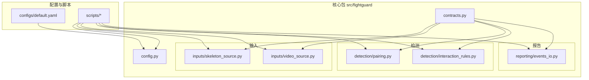
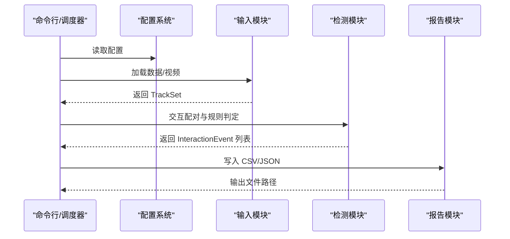
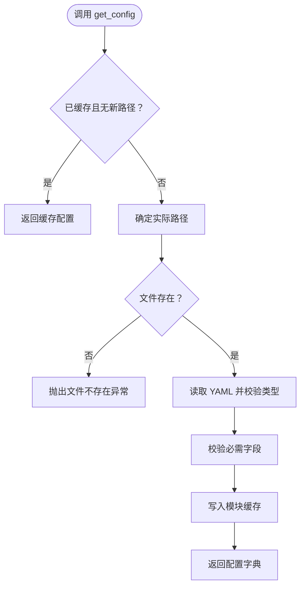
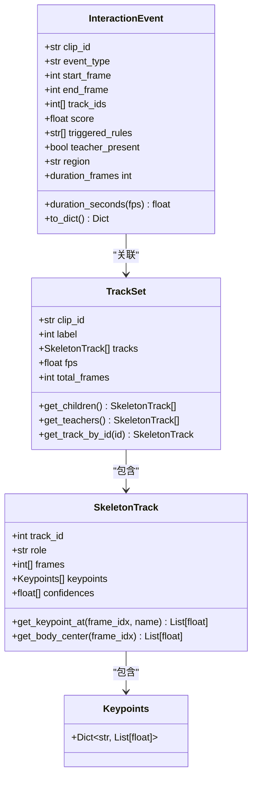
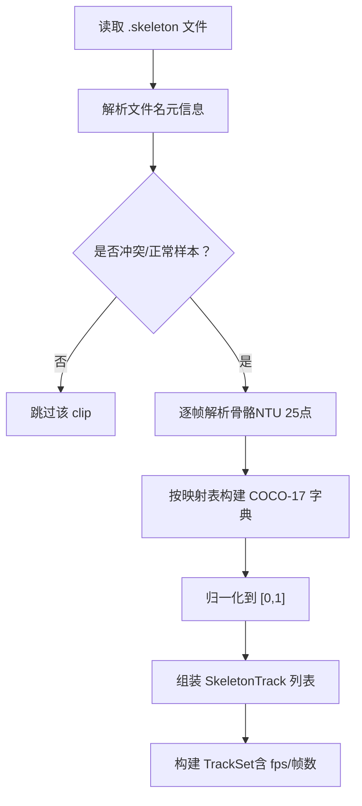
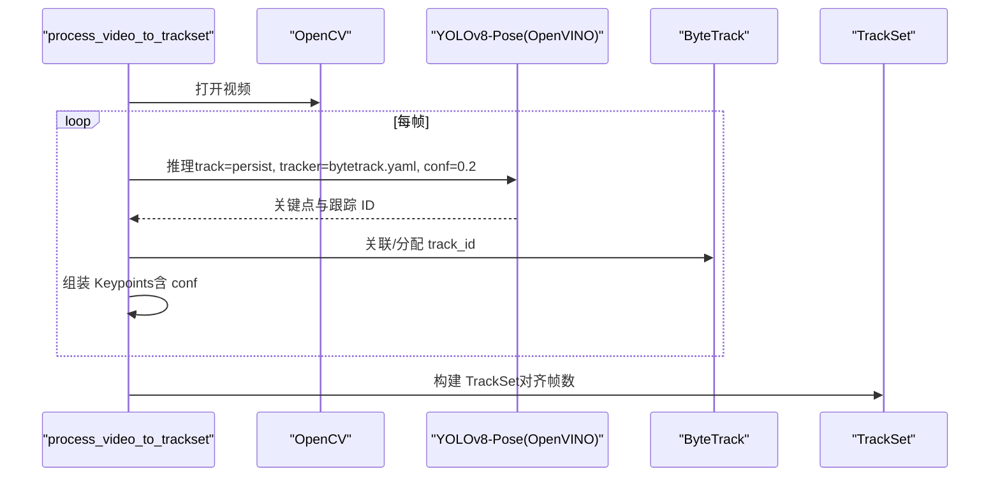
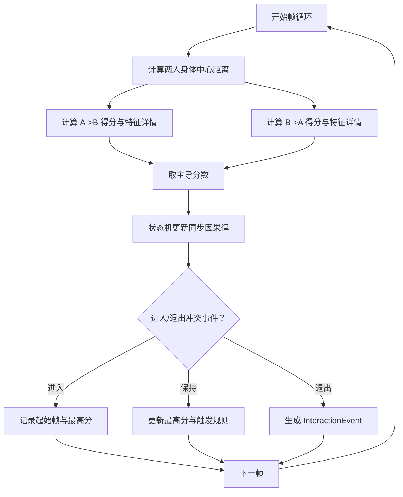
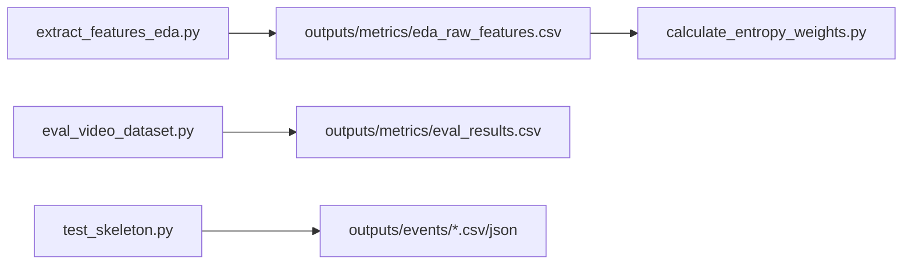
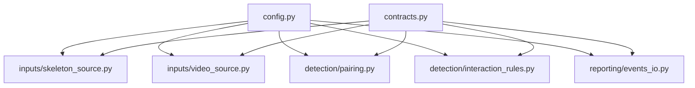

# 系统集成与部署

<cite>
**本文引用的文件**
- [README.md](file://README.md)
- [default.yaml](file://configs/default.yaml)
- [config.py](file://src/fightguard/config.py)
- [contracts.py](file://src/fightguard/contracts.py)
- [skeleton_source.py](file://src/fightguard/inputs/skeleton_source.py)
- [video_source.py](file://src/fightguard/inputs/video_source.py)
- [pairing.py](file://src/fightguard/detection/pairing.py)
- [interaction_rules.py](file://src/fightguard/detection/interaction_rules.py)
- [events_io.py](file://src/fightguard/reporting/events_io.py)
- [extract_features_eda.py](file://scripts/extract_features_eda.py)
- [calculate_entropy_weights.py](file://scripts/calculate_entropy_weights.py)
- [eval_video_dataset.py](file://scripts/eval_video_dataset.py)
- [test_skeleton.py](file://test_skeleton.py)
</cite>

## 目录
1. [简介](#简介)
2. [项目结构](#项目结构)
3. [核心组件](#核心组件)
4. [架构总览](#架构总览)
5. [详细组件分析](#详细组件分析)
6. [依赖分析](#依赖分析)
7. [性能考虑](#性能考虑)
8. [故障排查指南](#故障排查指南)
9. [结论](#结论)
10. [附录](#附录)

## 简介
KidGuard 是面向幼儿园等儿童聚集场所的冲突风险管理分析系统，基于计算机视觉与骨骼关键点几何关系，实现冲突行为的轻量化识别与风险评估。系统提供从特征提取、规则判定到事件记录的完整流水线，并支持基于熵权法的数据驱动赋权。

本指南聚焦系统集成与部署，包括：
- API 接口设计建议与数据交换格式
- 第三方系统对接方案
- 从开发到生产的部署流程
- 配置文件与环境变量管理
- 容器化与 Kubernetes 部署策略
- 监控与日志最佳实践
- 运维指南（备份、升级、故障恢复）

## 项目结构
项目采用模块化分层组织，核心目录与职责如下：
- configs：全局配置与规则阈值
- scripts：阶段化运行入口与评测脚本
- src/fightguard：核心包，按输入、检测、评估、报告划分子模块
- data/：数据集（不上传）
- outputs/：运行结果（不上传）

**图表来源**
- [README.md:46-76](file://README.md#L46-L76)
- [default.yaml:1-62](file://configs/default.yaml#L1-L62)
- [config.py:32-82](file://src/fightguard/config.py#L32-L82)
- [contracts.py:15-241](file://src/fightguard/contracts.py#L15-L241)
- [skeleton_source.py:1-331](file://src/fightguard/inputs/skeleton_source.py#L1-L331)
- [video_source.py:1-193](file://src/fightguard/inputs/video_source.py#L1-L193)
- [pairing.py:1-54](file://src/fightguard/detection/pairing.py#L1-L54)
- [interaction_rules.py:1-531](file://src/fightguard/detection/interaction_rules.py#L1-L531)
- [events_io.py:1-36](file://src/fightguard/reporting/events_io.py#L1-L36)

**章节来源**
- [README.md:46-76](file://README.md#L46-L76)

## 核心组件
- 配置系统：统一读取与校验 configs/default.yaml，提供全局配置访问接口，支持热重载。
- 数据契约：定义 Keypoints、SkeletonTrack、TrackSet、InteractionEvent 等统一数据结构，确保模块间数据一致性。
- 输入模块：
  - 骨骼数据读取：解析 NTU RGBD .skeleton 文件，映射为 COCO-17 标准，返回 TrackSet。
  - 视频输入：使用 YOLOv8-Pose/OpenVINO 加速推理，结合 ByteTrack 追踪器，输出 TrackSet。
- 检测模块：
  - 人员配对：基于平均距离与存活帧筛选，确定交互对。
  - 冲突规则与状态机：提取腕部加速度、相对接近速度、肘部角加速度、躯干倾角变化等特征，结合置信度抑制与四段式状态机进行冲突判定。
- 报告模块：事件日志 CSV/JSON 持久化。

**章节来源**
- [config.py:32-120](file://src/fightguard/config.py#L32-L120)
- [contracts.py:15-241](file://src/fightguard/contracts.py#L15-L241)
- [skeleton_source.py:211-331](file://src/fightguard/inputs/skeleton_source.py#L211-L331)
- [video_source.py:57-193](file://src/fightguard/inputs/video_source.py#L57-L193)
- [pairing.py:14-54](file://src/fightguard/detection/pairing.py#L14-L54)
- [interaction_rules.py:410-503](file://src/fightguard/detection/interaction_rules.py#L410-L503)
- [events_io.py:12-36](file://src/fightguard/reporting/events_io.py#L12-L36)

## 架构总览
系统采用“输入 → 预处理 → 配对 → 特征提取 → 规则判定 → 事件记录”的流水线架构。配置贯穿始终，确保参数一致性与可调性。

**图表来源**
- [config.py:32-82](file://src/fightguard/config.py#L32-L82)
- [skeleton_source.py:211-331](file://src/fightguard/inputs/skeleton_source.py#L211-L331)
- [video_source.py:57-193](file://src/fightguard/inputs/video_source.py#L57-L193)
- [pairing.py:14-54](file://src/fightguard/detection/pairing.py#L14-L54)
- [interaction_rules.py:410-503](file://src/fightguard/detection/interaction_rules.py#L410-L503)
- [events_io.py:12-36](file://src/fightguard/reporting/events_io.py#L12-L36)

## 详细组件分析

### 配置系统（config.py）
- 职责：读取 configs/default.yaml，提供 get_config()/reload_config()，并进行字段校验。
- 关键点：模块级缓存避免重复 IO；支持显式路径与热重载；严格校验必需字段。
- 集成要点：所有模块通过统一接口获取配置，禁止硬编码阈值。

**图表来源**
- [config.py:32-120](file://src/fightguard/config.py#L32-L120)

**章节来源**
- [config.py:32-120](file://src/fightguard/config.py#L32-L120)
- [default.yaml:1-62](file://configs/default.yaml#L1-L62)

### 数据契约（contracts.py）
- 职责：定义 Keypoints、SkeletonTrack、TrackSet、InteractionEvent 等数据结构与工具函数。
- 关键点：COCO-17 关键点名称与索引映射；SkeletonTrack 提供按帧查询与身体中心计算；InteractionEvent 提供 to_dict 便于持久化。

**图表来源**
- [contracts.py:56-241](file://src/fightguard/contracts.py#L56-L241)

**章节来源**
- [contracts.py:15-241](file://src/fightguard/contracts.py#L15-L241)

### 骨骼数据读取（skeleton_source.py）
- 职责：解析 NTU .skeleton 文件，映射为 COCO-17，归一化坐标，构建 TrackSet。
- 关键点：文件名解析、动作类别标签、映射表、归一化策略、批量加载与过滤。

**图表来源**
- [skeleton_source.py:64-331](file://src/fightguard/inputs/skeleton_source.py#L64-L331)

**章节来源**
- [skeleton_source.py:1-331](file://src/fightguard/inputs/skeleton_source.py#L1-L331)

### 视频输入（video_source.py）
- 职责：使用 YOLOv8-Pose/OpenVINO 加速推理，结合 ByteTrack 追踪器，输出 TrackSet。
- 关键点：模型懒加载、帧级关键点提取、置信度透传、时空对齐填充、轨迹对齐到总帧数。

**图表来源**
- [video_source.py:57-193](file://src/fightguard/inputs/video_source.py#L57-L193)

**章节来源**
- [video_source.py:1-193](file://src/fightguard/inputs/video_source.py#L1-L193)

### 人员配对（pairing.py）
- 职责：筛选有效轨迹，计算平均距离，选择最优交互对。
- 关键点：存活帧过滤、平均距离阈值、兜底策略。

**章节来源**
- [pairing.py:1-54](file://src/fightguard/detection/pairing.py#L1-L54)

### 冲突规则与状态机（interaction_rules.py）
- 职责：特征提取（腕部加速度、相对接近速度、肘部角加速度、躯干倾角变化、骨盆速度）、置信度抑制、四段式状态机、事件生成。
- 关键点：归一化尺度、特征归一化、双向评分、状态机同步因果律、平滑窗口与阈值。

**图表来源**
- [interaction_rules.py:410-503](file://src/fightguard/detection/interaction_rules.py#L410-L503)

**章节来源**
- [interaction_rules.py:1-531](file://src/fightguard/detection/interaction_rules.py#L1-L531)

### 事件日志（events_io.py）
- 职责：将评测明细与事件列表写入 CSV/JSON。
- 关键点：自动创建目录、字段写入、编码与 BOM。

**章节来源**
- [events_io.py:1-36](file://src/fightguard/reporting/events_io.py#L1-L36)

### 阶段化脚本与集成入口
- 特征提取与熵权法：extract_features_eda.py → calculate_entropy_weights.py
- 视频数据集评测：eval_video_dataset.py
- 演示脚本：test_skeleton.py

**图表来源**
- [extract_features_eda.py:28-106](file://scripts/extract_features_eda.py#L28-L106)
- [calculate_entropy_weights.py:12-71](file://scripts/calculate_entropy_weights.py#L12-L71)
- [eval_video_dataset.py:24-132](file://scripts/eval_video_dataset.py#L24-L132)
- [test_skeleton.py:9-94](file://test_skeleton.py#L9-L94)

**章节来源**
- [extract_features_eda.py:1-106](file://scripts/extract_features_eda.py#L1-L106)
- [calculate_entropy_weights.py:1-71](file://scripts/calculate_entropy_weights.py#L1-L71)
- [eval_video_dataset.py:1-132](file://scripts/eval_video_dataset.py#L1-L132)
- [test_skeleton.py:1-94](file://test_skeleton.py#L1-L94)

## 依赖分析
- 模块内聚：输入、检测、报告模块职责清晰，通过 contracts.py 的数据契约耦合。
- 外部依赖：OpenCV、Ultralytics YOLOv8、ByteTrack、Pandas、NumPy、PyYAML。
- 配置耦合：所有模块依赖 config.py 提供的统一配置，降低硬编码风险。

**图表来源**
- [config.py:32-120](file://src/fightguard/config.py#L32-L120)
- [contracts.py:15-241](file://src/fightguard/contracts.py#L15-L241)
- [skeleton_source.py:29-29](file://src/fightguard/inputs/skeleton_source.py#L29-L29)
- [video_source.py:25-25](file://src/fightguard/inputs/video_source.py#L25-L25)
- [pairing.py:3-4](file://src/fightguard/detection/pairing.py#L3-L4)
- [interaction_rules.py:17-24](file://src/fightguard/detection/interaction_rules.py#L17-L24)
- [events_io.py:10-10](file://src/fightguard/reporting/events_io.py#L10-L10)

**章节来源**
- [config.py:32-120](file://src/fightguard/config.py#L32-L120)
- [contracts.py:15-241](file://src/fightguard/contracts.py#L15-L241)

## 性能考虑
- 模型加速：使用 OpenVINO 加速的 YOLOv8n-pose 推理，适合 CPU 环境。
- 追踪器：ByteTrack 对低分框更鲁棒，适合重叠场景。
- 状态机平滑：通过平滑窗口与阈值控制误报，兼顾实时性与稳定性。
- 数据对齐：视频轨迹按总帧数对齐，确保时序一致性。
- I/O 优化：CSV/JSON 写入使用 UTF-8-SIG 与 BOM，便于跨平台读取。

[本节为通用性能讨论，不直接分析具体文件]

## 故障排查指南
- 配置文件缺失或格式错误：检查 configs/default.yaml 是否存在与结构正确；使用 get_config() 抛出的异常定位问题。
- 视频读取失败：确认视频路径与格式；检查 OpenCV 可打开性与帧率解析。
- 未检测到人员：检查 YOLO 推理与 ByteTrack 关联；调整 conf 与 tracker 配置。
- 事件输出为空：确认输出开关与目录权限；检查事件持久化函数调用。
- 熵权法权重未生效：确认权重更新至规则模块并重新运行评测。

**章节来源**
- [config.py:61-82](file://src/fightguard/config.py#L61-L82)
- [video_source.py:80-95](file://src/fightguard/inputs/video_source.py#L80-L95)
- [events_io.py:17-35](file://src/fightguard/reporting/events_io.py#L17-L35)

## 结论
KidGuard 通过模块化设计与统一数据契约，提供了从数据输入到冲突判定再到事件记录的完整链路。依托配置系统与脚本化流程，系统具备良好的可扩展性与可维护性。建议在集成部署时重点关注配置管理、模型加速与日志持久化，并结合监控与告警机制保障生产稳定运行。

[本节为总结性内容，不直接分析具体文件]

## 附录

### API 接口设计与数据交换格式
- 输入接口
  - 视频输入：process_video_to_trackset(video_path, label, cfg, max_frames) → TrackSet
  - 骨骼数据输入：load_skeleton_file(filepath, cfg) → TrackSet；load_dataset(data_dirs, cfg, max_clips) → List[TrackSet]
- 规则判定接口
  - run_rules_on_clip(track_set, cfg) → List[InteractionEvent]
  - get_interaction_pairs(track_set, cfg) → List[Tuple[SkeletonTrack, SkeletonTrack]]
- 输出接口
  - save_events_csv(events, filepath) → None
  - save_eval_results_csv(results, filepath) → None
- 数据交换格式
  - TrackSet：包含 clip_id、label、tracks、fps、total_frames
  - InteractionEvent：包含 clip_id、event_type、start_frame、end_frame、track_ids、score、triggered_rules、teacher_present、region

**章节来源**
- [video_source.py:57-193](file://src/fightguard/inputs/video_source.py#L57-L193)
- [skeleton_source.py:211-331](file://src/fightguard/inputs/skeleton_source.py#L211-L331)
- [interaction_rules.py:410-503](file://src/fightguard/detection/interaction_rules.py#L410-L503)
- [pairing.py:14-54](file://src/fightguard/detection/pairing.py#L14-L54)
- [events_io.py:12-36](file://src/fightguard/reporting/events_io.py#L12-L36)
- [contracts.py:154-241](file://src/fightguard/contracts.py#L154-L241)

### 第三方系统对接方案
- 视频流接入：将外部视频流转为本地文件或帧序列，调用 process_video_to_trackset。
- 事件订阅：监听 outputs/events 目录变更，或在规则判定后立即回调上报。
- 配置下发：通过 reload_config() 实现运行时参数更新，减少停机时间。

**章节来源**
- [config.py:85-92](file://src/fightguard/config.py#L85-L92)
- [video_source.py:57-193](file://src/fightguard/inputs/video_source.py#L57-L193)
- [events_io.py:12-36](file://src/fightguard/reporting/events_io.py#L12-L36)

### 部署流程（开发到生产）
- 开发环境
  - 创建虚拟环境并安装依赖
  - 准备 configs/default.yaml 与数据/输出目录
  - 运行阶段化脚本验证流程
- 生产环境
  - 部署 OpenVINO 加速推理与 ByteTrack 追踪器
  - 配置文件集中管理与密钥隔离
  - 启动服务化进程（建议封装为微服务或批处理作业）
  - 配置定时任务或事件触发执行评测与规则判定

**章节来源**
- [README.md:17-44](file://README.md#L17-L44)
- [video_source.py:41-49](file://src/fightguard/inputs/video_source.py#L41-L49)

### 配置文件管理与环境变量
- 配置文件：configs/default.yaml
  - 主要键：dataset、output、paths、rules、skeleton、state_machine
  - 建议：将敏感阈值与路径通过环境变量注入，使用 get_config() 读取
- 环境变量建议
  - 模型路径：YOLO_OPENVINO_MODEL_PATH
  - 追踪器配置：TRACKER_CONFIG_PATH
  - 输出目录：OUTPUT_EVENTS_DIR、OUTPUT_METRICS_DIR
  - 日志级别：LOG_LEVEL

**章节来源**
- [default.yaml:1-62](file://configs/default.yaml#L1-L62)
- [config.py:32-82](file://src/fightguard/config.py#L32-L82)

### 容器化与 Kubernetes 部署策略
- Docker 镜像
  - 基于 Python 3.8 基础镜像
  - 安装 OpenCV、Ultralytics、OpenVINO 运行时
  - 暴露卷挂载点：/opt/kidguard/data、/opt/kidguard/outputs
- Kubernetes
  - Deployment：副本数与资源限制
  - ConfigMap：存放 configs/default.yaml
  - PersistentVolume：挂载数据与输出目录
  - Job/CronJob：批处理评测与规则执行
  - Service/Monitoring：Prometheus/Grafana 指标采集与日志聚合

[本节为概念性部署建议，不直接分析具体文件]

### 监控与日志最佳实践
- 指标采集
  - 推理耗时、帧率、事件数量、冲突率
  - 状态机状态分布、置信度分布
- 日志
  - 结构化日志（JSON），包含 clip_id、事件类型、阈值、触发规则
  - 分级日志：DEBUG（诊断）、INFO（运行）、WARN（阈值调整）、ERROR（异常）
- 告警
  - 阈值异常波动、模型推理失败、IO 写入失败

[本节为通用运维建议，不直接分析具体文件]

### 运维指南（备份、升级、故障恢复）
- 备份
  - 配置文件与规则阈值定期备份
  - 输出目录（事件与评测结果）周期性归档
- 升级
  - 模型版本管理与灰度发布
  - 规则阈值通过配置热更新，避免停机
- 故障恢复
  - 事件回放：基于 outputs/events 重建事件
  - 配置回滚：使用版本化 ConfigMap
  - 数据修复：对不完整 TrackSet 进行重跑

[本节为通用运维建议，不直接分析具体文件]