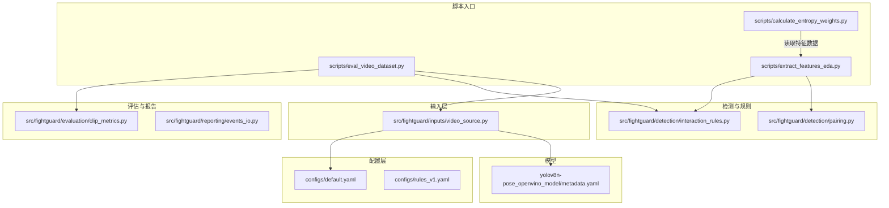
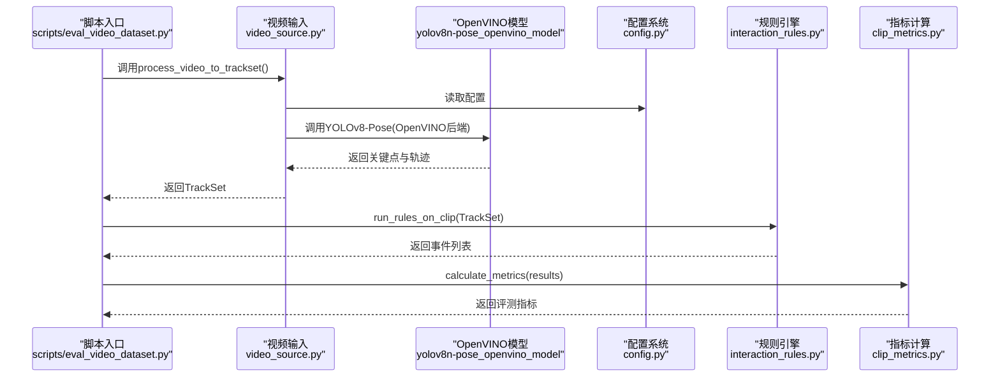
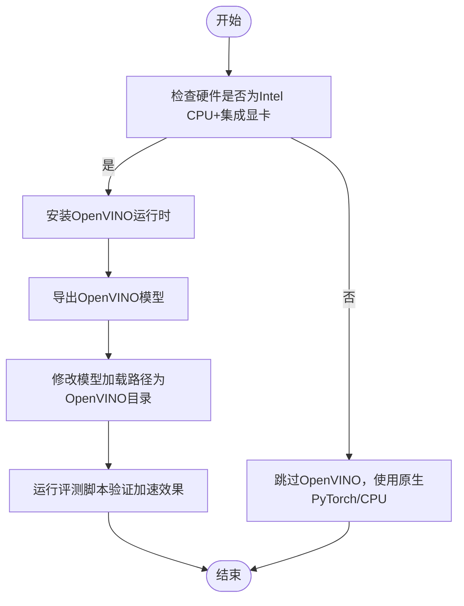
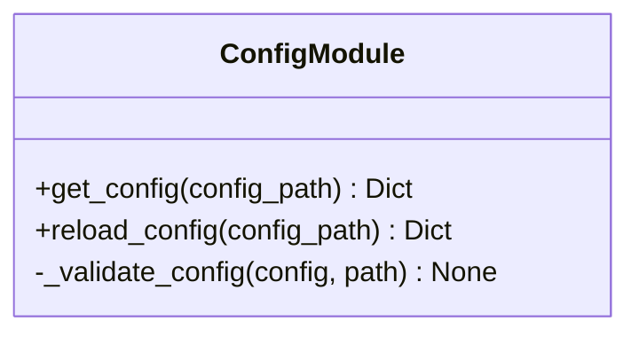
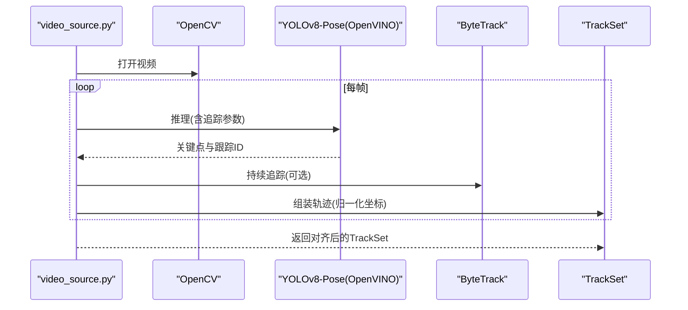
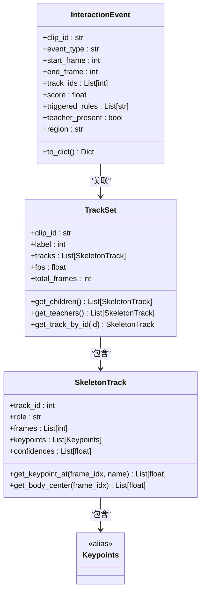
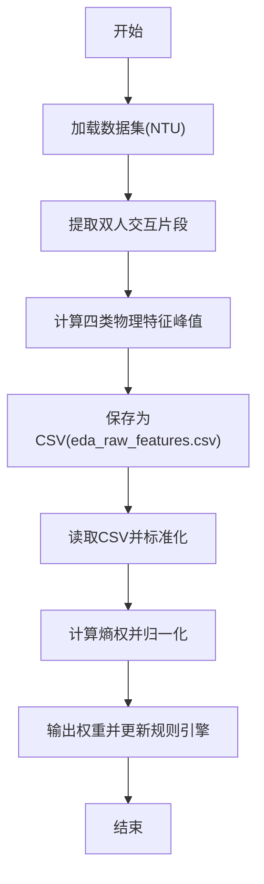
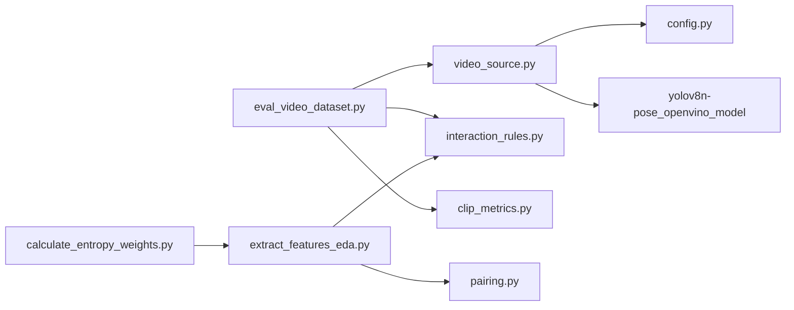

# 部署与集成

<cite>
**本文引用的文件**   
- [README.md](file://README.md)
- [OpenVINO可以加速轻薄本电脑YOLOv8的推理.md](file://OpenVINO可以加速轻薄本电脑YOLOv8的推理.md)
- [configs/default.yaml](file://configs/default.yaml)
- [configs/rules_v1.yaml](file://configs/rules_v1.yaml)
- [yolov8n-pose_openvino_model/metadata.yaml](file://yolov8n-pose_openvino_model/metadata.yaml)
- [src/fightguard/config.py](file://src/fightguard/config.py)
- [src/fightguard/contracts.py](file://src/fightguard/contracts.py)
- [src/fightguard/inputs/video_source.py](file://src/fightguard/inputs/video_source.py)
- [scripts/eval_video_dataset.py](file://scripts/eval_video_dataset.py)
- [scripts/extract_features_eda.py](file://scripts/extract_features_eda.py)
- [scripts/calculate_entropy_weights.py](file://scripts/calculate_entropy_weights.py)
- [kernel.errors.txt](file://kernel.errors.txt)
</cite>

## 目录
1. [简介](#简介)
2. [项目结构](#项目结构)
3. [核心组件](#核心组件)
4. [架构总览](#架构总览)
5. [详细组件分析](#详细组件分析)
6. [依赖关系分析](#依赖关系分析)
7. [性能考虑](#性能考虑)
8. [故障排除指南](#故障排除指南)
9. [结论](#结论)
10. [附录](#附录)

## 简介
本指南面向系统管理员与DevOps工程师，提供KidGuard系统的完整部署与集成方案。内容涵盖OpenVINO硬件加速配置与优化、模型转换与性能调优、轻薄本上YOLOv8推理加速原理与实现步骤、从环境准备到生产部署的全流程、模型文件组织与版本管理策略、与其他系统的集成（API与数据交换）、以及性能监控与故障排除实践建议。

## 项目结构
KidGuard采用模块化分层结构：配置层、输入层（视频/骨骼）、检测与规则层、评估与报告层。核心运行入口分布在scripts目录，配置集中于configs目录，模型以OpenVINO格式提供。

图表来源
- [README.md:46-76](file://README.md#L46-L76)
- [configs/default.yaml:1-62](file://configs/default.yaml#L1-L62)
- [configs/rules_v1.yaml:1-1](file://configs/rules_v1.yaml#L1-L1)
- [src/fightguard/inputs/video_source.py:1-193](file://src/fightguard/inputs/video_source.py#L1-L193)
- [scripts/eval_video_dataset.py:1-132](file://scripts/eval_video_dataset.py#L1-L132)
- [scripts/extract_features_eda.py:1-106](file://scripts/extract_features_eda.py#L1-L106)
- [scripts/calculate_entropy_weights.py:1-71](file://scripts/calculate_entropy_weights.py#L1-L71)
- [yolov8n-pose_openvino_model/metadata.yaml:1-27](file://yolov8n-pose_openvino_model/metadata.yaml#L1-L27)

章节来源
- [README.md:46-76](file://README.md#L46-L76)

## 核心组件
- 配置系统：集中读取与校验，提供全局阈值与路径参数，支持热重载。
- 视频输入与推理：封装OpenCV读取与Ultralytics YOLOv8-Pose推理，集成ByteTrack追踪器，输出标准化轨迹。
- 数据契约：统一关键点、轨迹、事件的数据结构，确保模块间一致性。
- 规则引擎与配对：基于关键点几何与运动特征的冲突判定与人员配对。
- 评测与报告：指标计算与事件日志持久化。
- OpenVINO模型：提供加速推理的OpenVINO格式模型与元数据。

章节来源
- [src/fightguard/config.py:32-120](file://src/fightguard/config.py#L32-L120)
- [src/fightguard/inputs/video_source.py:41-193](file://src/fightguard/inputs/video_source.py#L41-L193)
- [src/fightguard/contracts.py:18-241](file://src/fightguard/contracts.py#L18-L241)
- [yolov8n-pose_openvino_model/metadata.yaml:1-27](file://yolov8n-pose_openvino_model/metadata.yaml#L1-L27)

## 架构总览
KidGuard的推理链路由“视频输入 -> OpenVINO加速YOLOv8推理 -> 轨迹对齐 -> 规则判定 -> 事件输出”构成。配置系统贯穿始终，确保参数一致性与可调性。

图表来源
- [scripts/eval_video_dataset.py:19-109](file://scripts/eval_video_dataset.py#L19-L109)
- [src/fightguard/inputs/video_source.py:57-193](file://src/fightguard/inputs/video_source.py#L57-L193)
- [src/fightguard/config.py:32-82](file://src/fightguard/config.py#L32-L82)
- [src/fightguard/contracts.py:154-186](file://src/fightguard/contracts.py#L154-L186)

## 详细组件分析

### OpenVINO硬件加速与YOLOv8推理
- 加速原理：OpenVINO将Ultralytics YOLOv8模型编译为可在Intel CPU/GPU/NPU上高效执行的中间表示，显著减少推理开销。
- 实施步骤：
  1) 确认硬件：Intel CPU + 集成显卡（近三年轻薄本常见）。
  2) 安装OpenVINO运行时。
  3) 将YOLOv8模型导出为OpenVINO格式。
  4) 修改模型加载路径为OpenVINO模型目录。
- 性能收益：实测平均每帧耗时从约50ms降至约25ms，整体评测时间减半。
- 兼容性检查：首次运行可能进行模型编译，属正常现象；若出现设备不可用或驱动问题，需更新Intel显卡驱动。

图表来源
- [OpenVINO可以加速轻薄本电脑YOLOv8的推理.md:51-79](file://OpenVINO可以加速轻薄本电脑YOLOv8的推理.md#L51-L79)

章节来源
- [OpenVINO可以加速轻薄本电脑YOLOv8的推理.md:1-105](file://OpenVINO可以加速轻薄本电脑YOLOv8的推理.md#L1-L105)
- [src/fightguard/inputs/video_source.py:41-49](file://src/fightguard/inputs/video_source.py#L41-L49)

### 配置系统与参数管理
- 功能：集中读取YAML配置，提供统一访问接口与字段校验，支持强制重载。
- 关键字段：路径、规则阈值、状态机参数、输出开关等。
- 使用建议：将所有阈值与路径集中管理，避免硬编码；调试阶段使用重载接口快速生效新参数。

图表来源
- [src/fightguard/config.py:32-120](file://src/fightguard/config.py#L32-L120)

章节来源
- [src/fightguard/config.py:32-120](file://src/fightguard/config.py#L32-L120)
- [configs/default.yaml:1-62](file://configs/default.yaml#L1-L62)

### 视频输入与轨迹对齐
- 核心流程：OpenCV读取视频帧 -> YOLOv8-Pose(OpenVINO)推理 -> ByteTrack追踪 -> 关键点归一化 -> 轨迹对齐。
- 时空对齐：将所有轨迹填充到相同总帧数，确保每帧对应物理时间一致。
- 追踪器：使用ByteTrack提升低置信度框的稳定性，适合重叠打斗场景。

图表来源
- [src/fightguard/inputs/video_source.py:57-193](file://src/fightguard/inputs/video_source.py#L57-L193)

章节来源
- [src/fightguard/inputs/video_source.py:57-193](file://src/fightguard/inputs/video_source.py#L57-L193)

### 数据契约与事件结构
- 关键点命名：遵循COCO-17标准，提供名称到索引的映射。
- 数据结构：Keypoints、SkeletonTrack、TrackSet、InteractionEvent。
- 事件输出：包含片段ID、事件类型、起止帧、涉及人员、置信度、触发规则、教师在场与区域等。

图表来源
- [src/fightguard/contracts.py:56-241](file://src/fightguard/contracts.py#L56-L241)

章节来源
- [src/fightguard/contracts.py:18-241](file://src/fightguard/contracts.py#L18-L241)

### 特征提取与熵权法赋权
- 特征提取：从双人交互片段中提取四个物理特征的峰值，保存为CSV供统计分析。
- 熵权法：基于信息熵客观计算特征权重，消除主观经验带来的偏差。
- 工作流：先提取特征，再计算权重，最后在规则引擎中应用。

图表来源
- [scripts/extract_features_eda.py:28-102](file://scripts/extract_features_eda.py#L28-L102)
- [scripts/calculate_entropy_weights.py:12-67](file://scripts/calculate_entropy_weights.py#L12-L67)

章节来源
- [scripts/extract_features_eda.py:28-102](file://scripts/extract_features_eda.py#L28-L102)
- [scripts/calculate_entropy_weights.py:12-67](file://scripts/calculate_entropy_weights.py#L12-L67)

## 依赖关系分析
- 组件耦合：视频输入依赖配置系统与OpenVINO模型；评测脚本串联输入、规则与指标模块。
- 外部依赖：OpenVINO运行时、Ultralytics YOLOv8、OpenCV、NumPy/Pandas、TQDM等。
- 潜在风险：模型路径变更需同步修改；配置字段缺失会导致启动失败；OpenVINO首次编译可能阻塞初始化。

图表来源
- [scripts/eval_video_dataset.py:19-22](file://scripts/eval_video_dataset.py#L19-L22)
- [src/fightguard/inputs/video_source.py:25-26](file://src/fightguard/inputs/video_source.py#L25-L26)
- [scripts/extract_features_eda.py:23-26](file://scripts/extract_features_eda.py#L23-L26)
- [scripts/calculate_entropy_weights.py:18-26](file://scripts/calculate_entropy_weights.py#L18-L26)

章节来源
- [scripts/eval_video_dataset.py:19-22](file://scripts/eval_video_dataset.py#L19-L22)
- [src/fightguard/inputs/video_source.py:25-26](file://src/fightguard/inputs/video_source.py#L25-L26)
- [scripts/extract_features_eda.py:23-26](file://scripts/extract_features_eda.py#L23-L26)
- [scripts/calculate_entropy_weights.py:18-26](file://scripts/calculate_entropy_weights.py#L18-L26)

## 性能考虑
- OpenVINO加速要点
  - 仅需替换模型加载路径，其余代码无需改动。
  - 首次运行会进行模型编译，后续即刻加速。
  - 若CPU降频或未插电源，可能导致加速效果不明显。
- 视频处理优化
  - 使用ByteTrack提升低置信度框的稳定性。
  - 对轨迹进行时空绝对对齐，避免跨帧错位导致的误判。
- 资源与并发
  - 合理设置帧采样与最大处理帧数，平衡精度与性能。
  - 在多核CPU环境下，OpenVINO可利用多线程提升吞吐。

章节来源
- [OpenVINO可以加速轻薄本电脑YOLOv8的推理.md:70-91](file://OpenVINO可以加速轻薄本电脑YOLOv8的推理.md#L70-L91)
- [src/fightguard/inputs/video_source.py:115-118](file://src/fightguard/inputs/video_source.py#L115-L118)
- [src/fightguard/inputs/video_source.py:167-181](file://src/fightguard/inputs/video_source.py#L167-L181)

## 故障排除指南
- OpenVINO相关
  - 设备不可用：更新Intel显卡驱动。
  - No module named openvino：安装OpenVINO运行时。
  - 首次卡顿：等待模型编译完成。
  - 速度无变化：确保插电并设置高性能电源模式。
- 配置与路径
  - 配置字段缺失：补齐default.yaml中的必需字段。
  - 路径错误：确认数据与输出目录存在且可读写。
- 运行时错误
  - 视频无法打开：检查视频文件完整性与权限。
  - 未检测到人员：调整YOLO置信度或追踪参数。
  - 错误日志：参考kernel.errors.txt定位异常堆栈。

章节来源
- [OpenVINO可以加速轻薄本电脑YOLOv8的推理.md:83-91](file://OpenVINO可以加速轻薄本电脑YOLOv8的推理.md#L83-L91)
- [src/fightguard/config.py:95-120](file://src/fightguard/config.py#L95-L120)
- [scripts/eval_video_dataset.py:82-107](file://scripts/eval_video_dataset.py#L82-L107)
- [kernel.errors.txt](file://kernel.errors.txt)

## 结论
通过OpenVINO硬件加速与规范化的配置管理，KidGuard可在轻薄本上实现高效的YOLOv8推理与稳定的冲突检测。结合特征提取与熵权法，系统具备数据驱动的客观赋权能力。建议在生产环境中采用容器化与CI/CD流水线，配合日志与指标监控，持续优化阈值与追踪参数，确保稳定可靠的运行表现。

## 附录

### 部署与集成流程（从环境准备到生产）
- 环境准备
  - 创建Python虚拟环境并安装依赖。
  - 准备数据与输出目录，确保路径在配置中正确声明。
- OpenVINO加速
  - 安装OpenVINO运行时。
  - 导出OpenVINO模型并替换模型加载路径。
- 运行与验证
  - 执行评测脚本，观察加速效果与指标。
  - 调整规则阈值与追踪参数，使用配置重载接口快速生效。
- 生产部署
  - 将脚本封装为服务或定时任务，接入监控与日志系统。
  - 使用容器镜像打包，统一依赖与配置。
  - 建立CI/CD流水线，自动化模型转换与部署。

章节来源
- [README.md:17-44](file://README.md#L17-L44)
- [OpenVINO可以加速轻薄本电脑YOLOv8的推理.md:56-79](file://OpenVINO可以加速轻薄本电脑YOLOv8的推理.md#L56-L79)
- [scripts/eval_video_dataset.py:24-132](file://scripts/eval_video_dataset.py#L24-L132)

### 模型文件组织与版本管理
- 模型目录：yolov8n-pose_openvino_model/，包含OpenVINO模型与元数据。
- 元数据：记录模型版本、输入尺寸、关键点形状、NMS开关等，便于追溯与迁移。
- 版本策略：以Git标签或制品库管理不同版本的OpenVINO模型；在配置中记录当前使用的模型版本以便审计。

章节来源
- [yolov8n-pose_openvino_model/metadata.yaml:1-27](file://yolov8n-pose_openvino_model/metadata.yaml#L1-L27)

### 与其他系统集成（API与数据交换）
- 数据交换格式
  - 事件日志：CSV/JSON，包含片段ID、事件类型、起止帧、涉及人员、置信度、触发规则、教师在场与区域等字段。
  - 指标输出：CSV，记录评测统计量与样本分布。
- API设计建议
  - HTTP接口：POST /api/v1/detect，请求体包含视频路径或URL，响应返回事件列表与指标摘要。
  - Webhook：事件触发后推送至外部系统，携带事件详情与上下文。
  - 批处理：提供批量视频处理接口，支持分页与进度查询。
- 数据一致性
  - 使用数据契约定义的结构化字段，避免自定义扩展破坏兼容性。
  - 在接口层进行参数校验与默认值处理，确保下游模块稳定。

章节来源
- [src/fightguard/contracts.py:227-241](file://src/fightguard/contracts.py#L227-L241)
- [scripts/eval_video_dataset.py:109-123](file://scripts/eval_video_dataset.py#L109-L123)