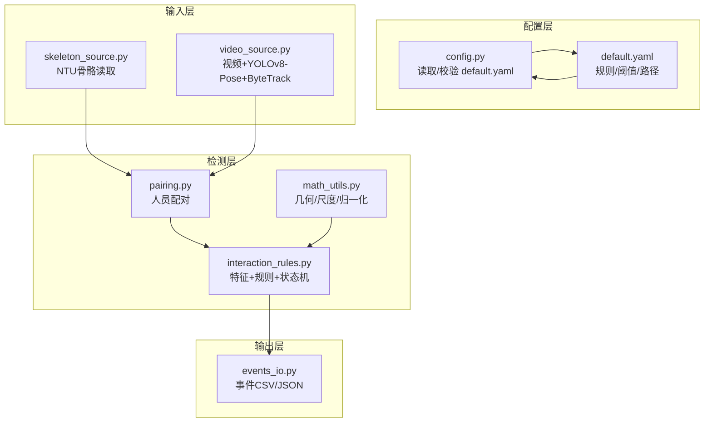
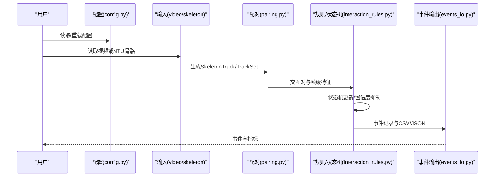
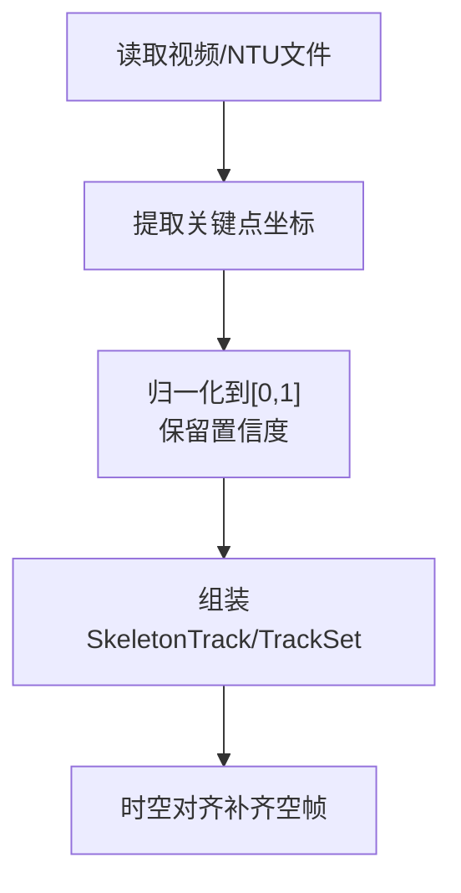
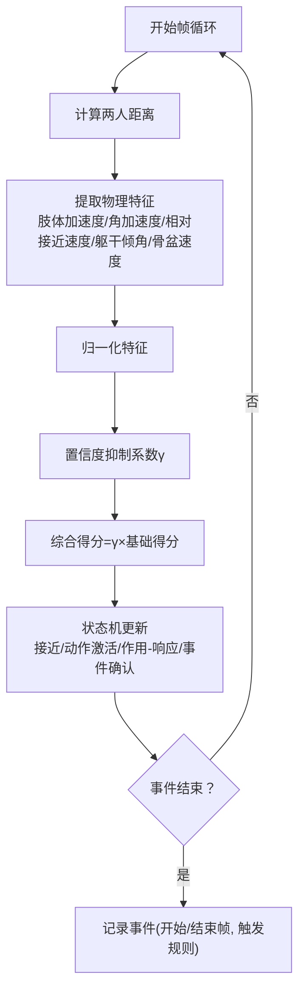
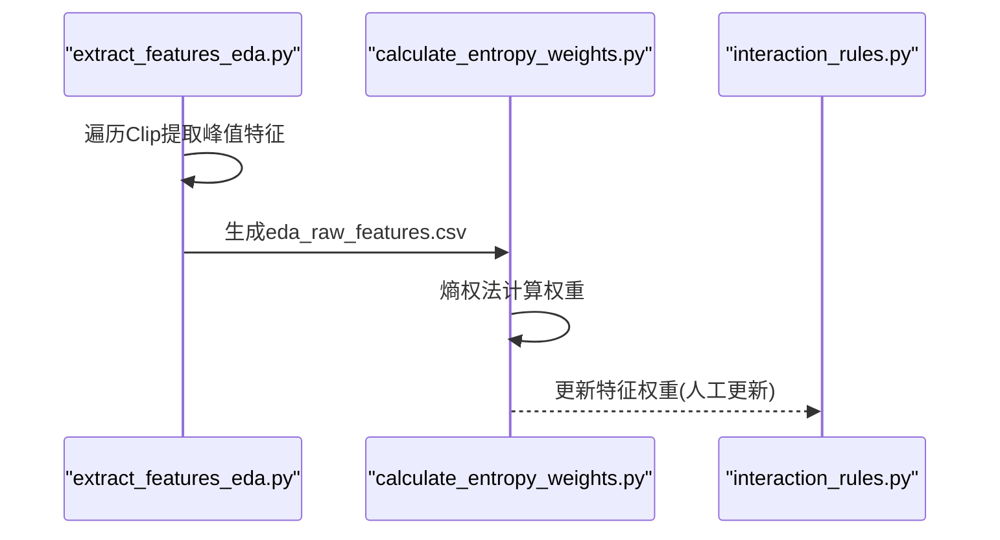
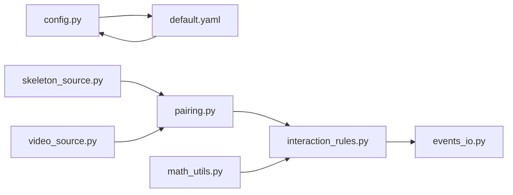

# 项目概述

<cite>
**本文引用的文件**
- [README.md](file://README.md)
- [configs/default.yaml](file://configs/default.yaml)
- [src/fightguard/config.py](file://src/fightguard/config.py)
- [src/fightguard/contracts.py](file://src/fightguard/contracts.py)
- [src/fightguard/inputs/skeleton_source.py](file://src/fightguard/inputs/skeleton_source.py)
- [src/fightguard/inputs/video_source.py](file://src/fightguard/inputs/video_source.py)
- [src/fightguard/detection/math_utils.py](file://src/fightguard/detection/math_utils.py)
- [src/fightguard/detection/pairing.py](file://src/fightguard/detection/pairing.py)
- [src/fightguard/detection/interaction_rules.py](file://src/fightguard/detection/interaction_rules.py)
- [src/fightguard/reporting/events_io.py](file://src/fightguard/reporting/events_io.py)
- [scripts/extract_features_eda.py](file://scripts/extract_features_eda.py)
- [scripts/calculate_entropy_weights.py](file://scripts/calculate_entropy_weights.py)
- [scripts/eval_video_dataset.py](file://scripts/eval_video_dataset.py)
- [docs/phase2_todo.md](file://docs/phase2_todo.md)
</cite>

## 目录
1. [引言](#引言)
2. [项目结构](#项目结构)
3. [核心组件](#核心组件)
4. [架构总览](#架构总览)
5. [详细组件分析](#详细组件分析)
6. [依赖分析](#依赖分析)
7. [性能考量](#性能考量)
8. [故障排查指南](#故障排查指南)
9. [结论](#结论)
10. [附录](#附录)

## 引言
KidGuard 是面向幼儿园等儿童聚集场所的冲突风险管理分析系统，基于计算机视觉与运动学特征，通过骨骼关键点空间几何关系构建规则库，实现轻量化、实时、可解释的冲突行为识别与风险评估。系统以“数据驱动+规则引擎+状态机”的方式，结合熵权法进行特征赋权，形成从输入到输出的完整流水线。

## 项目结构
项目采用模块化分层组织：
- 配置层：统一读取与校验 configs/default.yaml，提供全局阈值与规则参数
- 输入层：支持 NTU RGBD 骨骼数据与真实视频（YOLOv8-Pose + ByteTrack）两类输入
- 检测层：关键点提取、人员配对、物理特征提取、规则判定与状态机
- 输出层：事件记录、评测指标与 CSV/JSON 持久化
- 脚本层：阶段化运行入口与数据驱动流程

图表来源
- [src/fightguard/config.py:32-120](file://src/fightguard/config.py#L32-L120)
- [configs/default.yaml:1-62](file://configs/default.yaml#L1-L62)
- [src/fightguard/inputs/skeleton_source.py:211-331](file://src/fightguard/inputs/skeleton_source.py#L211-L331)
- [src/fightguard/inputs/video_source.py:57-193](file://src/fightguard/inputs/video_source.py#L57-L193)
- [src/fightguard/detection/pairing.py:14-54](file://src/fightguard/detection/pairing.py#L14-L54)
- [src/fightguard/detection/math_utils.py:10-52](file://src/fightguard/detection/math_utils.py#L10-L52)
- [src/fightguard/detection/interaction_rules.py:410-503](file://src/fightguard/detection/interaction_rules.py#L410-L503)
- [src/fightguard/reporting/events_io.py:12-36](file://src/fightguard/reporting/events_io.py#L12-L36)

章节来源
- [README.md:46-76](file://README.md#L46-L76)
- [src/fightguard/config.py:32-120](file://src/fightguard/config.py#L32-L120)
- [configs/default.yaml:1-62](file://configs/default.yaml#L1-L62)

## 核心组件
- 配置与契约
  - 配置读取与校验：统一从 default.yaml 读取，提供缓存与字段校验
  - 数据契约：定义 Keypoints、SkeletonTrack、TrackSet、InteractionEvent 的统一结构
- 输入模块
  - NTU 骨骼读取：解析 .skeleton 文件，映射到 COCO-17，归一化坐标
  - 视频输入：OpenCV + YOLOv8-Pose（OpenVINO 加速）+ ByteTrack，时空对齐与占位补齐
- 检测模块
  - 几何与尺度：人体中心、肩宽尺度、归一化
  - 物理特征：肢体加速度、关节角加速度、相对接近速度、躯干倾角变化、骨盆速度
  - 规则与状态机：四段式状态机（接近/动作激活/作用-响应/事件确认），置信度抑制
  - 人员配对：基于平均距离的最优配对，剔除“幽灵 ID”
- 输出模块
  - 事件持久化：CSV/JSON 记录事件、指标
- 脚本模块
  - EDA 特征提取：提取四个核心特征峰值，生成 eda_raw_features.csv
  - 熵权法赋权：基于熵权法客观计算特征权重
  - 视频数据集评测：批量评测，输出指标与错判分析

章节来源
- [src/fightguard/config.py:32-120](file://src/fightguard/config.py#L32-L120)
- [src/fightguard/contracts.py:18-241](file://src/fightguard/contracts.py#L18-L241)
- [src/fightguard/inputs/skeleton_source.py:211-331](file://src/fightguard/inputs/skeleton_source.py#L211-L331)
- [src/fightguard/inputs/video_source.py:57-193](file://src/fightguard/inputs/video_source.py#L57-L193)
- [src/fightguard/detection/math_utils.py:10-52](file://src/fightguard/detection/math_utils.py#L10-L52)
- [src/fightguard/detection/pairing.py:14-54](file://src/fightguard/detection/pairing.py#L14-L54)
- [src/fightguard/detection/interaction_rules.py:36-503](file://src/fightguard/detection/interaction_rules.py#L36-L503)
- [src/fightguard/reporting/events_io.py:12-36](file://src/fightguard/reporting/events_io.py#L12-L36)
- [scripts/extract_features_eda.py:28-106](file://scripts/extract_features_eda.py#L28-L106)
- [scripts/calculate_entropy_weights.py:12-71](file://scripts/calculate_entropy_weights.py#L12-L71)
- [scripts/eval_video_dataset.py:24-132](file://scripts/eval_video_dataset.py#L24-L132)

## 架构总览
系统以“输入 → 预处理 → 配对 → 特征 → 规则/状态机 → 事件输出”的流水线为核心，配合配置中心与数据契约，确保跨模块一致性与可维护性。

图表来源
- [src/fightguard/config.py:32-120](file://src/fightguard/config.py#L32-L120)
- [src/fightguard/inputs/video_source.py:57-193](file://src/fightguard/inputs/video_source.py#L57-L193)
- [src/fightguard/inputs/skeleton_source.py:211-331](file://src/fightguard/inputs/skeleton_source.py#L211-L331)
- [src/fightguard/detection/pairing.py:14-54](file://src/fightguard/detection/pairing.py#L14-L54)
- [src/fightguard/detection/interaction_rules.py:410-503](file://src/fightguard/detection/interaction_rules.py#L410-L503)
- [src/fightguard/reporting/events_io.py:12-36](file://src/fightguard/reporting/events_io.py#L12-L36)

## 详细组件分析

### 骨骼关键点提取
- NTU 骨骼读取：解析 .skeleton 文件，按 NTU 25 点映射到 COCO-17，归一化坐标并保留置信度
- 视频骨骼提取：OpenCV 读取帧，YOLOv8-Pose（OpenVINO 加速）推理，ByteTrack 跟踪，时空对齐补齐空帧
- 关键点契约：统一使用 COCO-17 名称访问，避免硬编码索引

图表来源
- [src/fightguard/inputs/skeleton_source.py:211-331](file://src/fightguard/inputs/skeleton_source.py#L211-L331)
- [src/fightguard/inputs/video_source.py:57-193](file://src/fightguard/inputs/video_source.py#L57-L193)
- [src/fightguard/contracts.py:96-171](file://src/fightguard/contracts.py#L96-L171)

章节来源
- [src/fightguard/inputs/skeleton_source.py:211-331](file://src/fightguard/inputs/skeleton_source.py#L211-L331)
- [src/fightguard/inputs/video_source.py:57-193](file://src/fightguard/inputs/video_source.py#L57-L193)
- [src/fightguard/contracts.py:96-171](file://src/fightguard/contracts.py#L96-L171)

### 冲突行为识别
- 物理特征提取：肢体末端加速度、关节角加速度、相对接近速度、躯干倾角变化、骨盆速度
- 归一化与置信度抑制：按肩宽尺度归一化，使用平均置信度抑制系数降低低质量帧的影响
- 规则与状态机：四段式状态机（接近/动作激活/作用-响应/事件确认），同步因果律，平滑窗口与事件确认阈值
- 对称检测：双向视角（A→B 与 B→A）评分取主导，提升召回

图表来源
- [src/fightguard/detection/interaction_rules.py:363-503](file://src/fightguard/detection/interaction_rules.py#L363-L503)
- [src/fightguard/detection/math_utils.py:10-52](file://src/fightguard/detection/math_utils.py#L10-L52)

章节来源
- [src/fightguard/detection/interaction_rules.py:36-503](file://src/fightguard/detection/interaction_rules.py#L36-L503)
- [src/fightguard/detection/math_utils.py:10-52](file://src/fightguard/detection/math_utils.py#L10-L52)

### 风险管理分析
- 风险等级：由状态机与置信度平滑得分共同决定，冲突持续帧数与阈值控制误报
- 教师在场与区域：事件记录中预留教师是否在场与功能区域字段，便于后续扩展
- 可解释性：记录触发的具体规则（高肢体加速度、高关节角加速度、躯干倾角变化、骨盆速度变化、低置信度抑制）

章节来源
- [src/fightguard/detection/interaction_rules.py:476-503](file://src/fightguard/detection/interaction_rules.py#L476-L503)
- [src/fightguard/contracts.py:192-241](file://src/fightguard/contracts.py#L192-L241)

### 事件记录与数据驱动
- 事件记录：CSV/JSON 输出，包含片段ID、事件类型、起止帧、持续帧、涉及人员、得分、触发规则、教师在场、区域
- 数据驱动：EDA 提取四个核心特征峰值，熵权法客观赋权，消除主观经验

图表来源
- [scripts/extract_features_eda.py:28-106](file://scripts/extract_features_eda.py#L28-L106)
- [scripts/calculate_entropy_weights.py:12-71](file://scripts/calculate_entropy_weights.py#L12-L71)
- [src/fightguard/detection/interaction_rules.py:394-408](file://src/fightguard/detection/interaction_rules.py#L394-L408)

章节来源
- [src/fightguard/reporting/events_io.py:12-36](file://src/fightguard/reporting/events_io.py#L12-L36)
- [scripts/extract_features_eda.py:28-106](file://scripts/extract_features_eda.py#L28-L106)
- [scripts/calculate_entropy_weights.py:12-71](file://scripts/calculate_entropy_weights.py#L12-L71)

### 配置与契约
- 配置读取：统一从 default.yaml 读取，缓存与字段校验，支持强制重载
- 数据契约：Keypoints、SkeletonTrack、TrackSet、InteractionEvent 的统一结构，避免硬编码索引

章节来源
- [src/fightguard/config.py:32-120](file://src/fightguard/config.py#L32-L120)
- [src/fightguard/contracts.py:18-241](file://src/fightguard/contracts.py#L18-L241)

## 依赖分析
- 模块耦合
  - 配置模块与所有模块解耦，通过 get_config() 提供统一访问
  - 输入模块产出 TrackSet，检测模块消费 TrackSet，输出模块消费事件
- 外部依赖
  - OpenCV、Ultralytics YOLOv8-Pose（OpenVINO 加速）、ByteTrack、Pandas、NumPy、PyYAML
- 可能的循环依赖
  - math_utils 为纯数学工具，避免循环导入
  - pairing 与 interaction_rules 通过 contracts 类型进行弱耦合

图表来源
- [src/fightguard/config.py:32-120](file://src/fightguard/config.py#L32-L120)
- [configs/default.yaml:1-62](file://configs/default.yaml#L1-L62)
- [src/fightguard/inputs/skeleton_source.py:211-331](file://src/fightguard/inputs/skeleton_source.py#L211-L331)
- [src/fightguard/inputs/video_source.py:57-193](file://src/fightguard/inputs/video_source.py#L57-L193)
- [src/fightguard/detection/pairing.py:14-54](file://src/fightguard/detection/pairing.py#L14-L54)
- [src/fightguard/detection/interaction_rules.py:410-503](file://src/fightguard/detection/interaction_rules.py#L410-L503)
- [src/fightguard/detection/math_utils.py:10-52](file://src/fightguard/detection/math_utils.py#L10-L52)
- [src/fightguard/reporting/events_io.py:12-36](file://src/fightguard/reporting/events_io.py#L12-L36)

章节来源
- [src/fightguard/config.py:32-120](file://src/fightguard/config.py#L32-L120)
- [src/fightguard/detection/math_utils.py:10-52](file://src/fightguard/detection/math_utils.py#L10-L52)
- [src/fightguard/detection/pairing.py:14-54](file://src/fightguard/detection/pairing.py#L14-L54)
- [src/fightguard/detection/interaction_rules.py:410-503](file://src/fightguard/detection/interaction_rules.py#L410-L503)
- [src/fightguard/reporting/events_io.py:12-36](file://src/fightguard/reporting/events_io.py#L12-L36)

## 性能考量
- 轻量化设计：YOLOv8n-pose 轻量模型，OpenVINO 加速，适合 CPU 运行
- 实时性保证：ByteTrack 跟踪器在低分检测下更稳健，减少 ID 切换；帧级特征计算与状态机平滑窗口控制
- 准确性保障：置信度抑制、对称检测、状态机同步因果律、熵权法特征赋权
- 可解释性：事件记录包含触发规则与置信度，便于回溯与优化
- 可扩展性：模块化设计，易于添加新规则、特征与可视化

## 故障排查指南
- 配置文件缺失或字段不全
  - 现象：启动时报错提示缺少必要字段
  - 处理：检查 default.yaml 是否存在，字段是否完整
- 视频读取失败
  - 现象：无法打开视频文件或未检测到人
  - 处理：确认路径正确、视频可读；检查 ByteTrack 配置与 YOLO 模型加载
- 事件为空
  - 现象：未生成事件记录
  - 处理：检查配对是否成功、状态机阈值是否合理、置信度抑制是否过强
- 熵权法权重未生效
  - 现象：特征权重未更新
  - 处理：先运行 EDA 特征提取，再运行熵权法脚本，按提示更新规则模块中的权重

章节来源
- [src/fightguard/config.py:60-120](file://src/fightguard/config.py#L60-L120)
- [src/fightguard/inputs/video_source.py:80-165](file://src/fightguard/inputs/video_source.py#L80-L165)
- [scripts/calculate_entropy_weights.py:12-71](file://scripts/calculate_entropy_weights.py#L12-L71)

## 结论
KidGuard 以“数据驱动 + 规则引擎 + 状态机”为核心，结合熵权法实现特征客观赋权，具备轻量化、实时性、准确性与可解释性的技术特色。通过模块化设计与统一数据契约，系统在幼儿园冲突风险管理场景中具有良好的可扩展性与落地价值。

## 附录
- 应用场景：幼儿园、托儿所、学校活动区、家庭监控等
- 后续优化方向：教师行为识别、复杂人员追踪、Web 界面、环境自适应、告警集成

章节来源
- [README.md:108-131](file://README.md#L108-L131)
- [docs/phase2_todo.md:1-26](file://docs/phase2_todo.md#L1-L26)