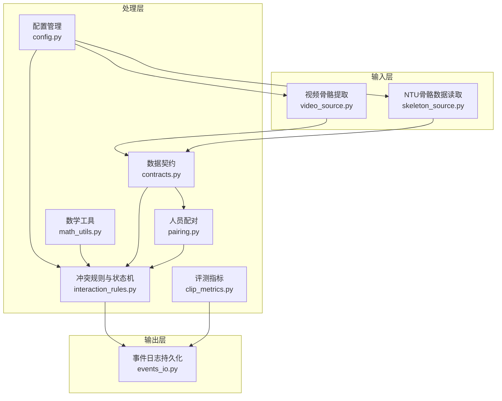

# KidGuard — 幼儿园冲突风险管理分析系统

中山大学大创项目 | 电子与信息工程学院

## 目录
- [项目概览](#项目概览)
- [主要特性](#主要特性)
- [技术架构](#技术架构)
- [安装部署](#安装部署)
- [使用指南](#使用指南)
- [配置说明](#配置说明)
- [API文档](#api文档)
- [算法原理](#算法原理)
- [性能评估](#性能评估)
- [常见问题](#常见问题)
- [开发指南](#开发指南)
- [贡献指南](#贡献指南)
- [许可证](#许可证)
- [致谢](#致谢)

## 项目概览

KidGuard 是一个面向幼儿园等儿童聚集场所的冲突风险管理分析系统。项目基于计算机视觉与运动学特征，通过骨骼关键点空间几何关系构建规则库，实现轻量化、实时、可解释的冲突行为识别与风险评估。系统以“数据驱动+规则引擎+状态机”为核心，结合熵权法进行特征赋权，形成从输入到输出的完整流水线。

### 核心目标
- **实时监测**：对监控视频流进行实时分析，及时发现潜在冲突行为
- **精准识别**：基于物理运动特征与状态机模型，降低误报与漏报率
- **科学评估**：采用数据驱动的熵权法赋予特征客观权重，避免主观经验参数
- **风险预警**：生成结构化事件报告，支持后续风险管理与干预决策

### 应用场景
- 幼儿园、托儿所等儿童聚集场所
- 学校操场、体育馆等活动区域
- 家庭监控系统
- 任何需要监测人员冲突的公共场所

## 主要特性

- **多源输入支持**
  - NTU RGB‑D 骨骼数据集（.skeleton 文件）
  - 实时视频流（MP4、AVI 等常见格式）
  - 兼容 COCO‑17 标准的骨骼关键点输入

- **高精度骨骼提取**
  - YOLOv8n‑pose 轻量级模型，支持 OpenVINO 硬件加速
  - ByteTrack 多目标跟踪，解决 ID 切换与遮挡问题
  - 时空对齐与空帧补齐，保证轨迹连续性

- **数据驱动的特征赋权**
  - 探索性数据分析（EDA）提取四大核心物理特征峰值
  - 熵权法（Entropy Weight Method）客观计算特征权重
  - 彻底废除“拍脑袋”经验参数，实现科学赋权

- **四段式状态机与规则引擎**
  - **接近阶段**：基于距离阈值的接近检测
  - **动作激活阶段**：肢体加速度、关节角加速度等动作特征触发
  - **作用‑响应阶段**：双向视角同步因果律，确保物理链条闭环
  - **事件确认阶段**：时间窗连续性确认，避免瞬态噪点误报
  - 内置反瞬移过滤与置信度抑制机制，提升鲁棒性

- **全面的输出与评估**
  - CSV/JSON 格式的事件日志（时间、人员、触发规则、风险等级）
  - 评测指标自动计算（Accuracy、Precision、Recall、F1、FPR 等）
  - 错判样本分析，支持模型调优与规则迭代

- **模块化与可扩展设计**
  - 统一的数据契约（COCO‑17 字典格式），杜绝硬编码索引
  - 配置驱动的阈值管理，支持热重载与在线调参
  - 清晰的接口定义，便于添加新特征、新规则或替换跟踪器

## 技术架构

### 系统架构图



### 模块职责

| 模块 | 文件 | 主要职责 |
|------|------|----------|
| **配置管理** | `src/fightguard/config.py` | 读取 `configs/default.yaml`，提供统一配置访问接口，支持缓存与热重载 |
| **数据契约** | `src/fightguard/contracts.py` | 定义 `Keypoints`、`SkeletonTrack`、`TrackSet`、`InteractionEvent` 等统一数据结构 |
| **骨骼输入** | `src/fightguard/inputs/skeleton_source.py` | 解析 NTU RGB‑D 的 .skeleton 文件，映射到 COCO‑17 格式 |
| **视频输入** | `src/fightguard/inputs/video_source.py` | OpenCV + YOLOv8‑pose（OpenVINO 加速）+ ByteTrack，提取骨骼轨迹 |
| **人员配对** | `src/fightguard/detection/pairing.py` | 基于平均距离筛选最优交互对，剔除“幽灵 ID” |
| **数学工具** | `src/fightguard/detection/math_utils.py` | 提供肩宽尺度、身体中心、欧氏距离、特征归一化等基础几何计算 |
| **规则与状态机** | `src/fightguard/detection/interaction_rules.py` | 实现四段式状态机、物理特征提取、置信度抑制、对称评分 |
| **评测指标** | `src/fightguard/evaluation/clip_metrics.py` | 计算 Accuracy、Precision、Recall、F1、FPR 等核心指标 |
| **事件输出** | `src/fightguard/reporting/events_io.py` | 将事件列表与评测结果持久化为 CSV/JSON 文件 |

### 技术栈

- **编程语言**：Python 3.8+
- **深度学习框架**：PyTorch（通过 Ultralytics YOLOv8）
- **计算机视觉**：OpenCV、YOLOv8‑pose、ByteTrack
- **加速引擎**：OpenVINO（可选，大幅提升推理速度）
- **科学计算**：NumPy、Pandas
- **配置管理**：PyYAML
- **调参与优化**：Optuna（超参数自动调优）
- **进度显示**：tqdm

## 安装部署

### 环境要求

- Python 3.8 或更高版本
- 支持 OpenVINO 的 CPU 或 Intel GPU（可选，但强烈推荐以提升性能）
- 至少 4GB 内存（建议 8GB 以上）
- 磁盘空间：约 2GB（包含预训练模型与示例数据）

### 步骤一：创建虚拟环境

```bash
conda create -n fightguard python=3.8
conda activate fightguard
```

### 步骤二：安装依赖

项目未提供固定的 `requirements.txt`，请手动安装以下包：

```bash
pip install ultralytics opencv-python pandas numpy pyyaml tqdm optuna
```

若需启用 OpenVINO 加速，请额外安装：

```bash
pip install openvino openvino-dev
```

### 步骤三：获取预训练模型

系统默认使用 YOLOv8n‑pose 模型，已转换为 OpenVINO 格式并放置在 `yolov8n-pose_openvino_model/` 目录。若需更新模型，可从 Ultralytics 官方下载：

```bash
yolo export model=yolov8n-pose format=openvino
```

### 步骤四：准备数据

- **NTU RGB‑D 骨骼数据**：将 `.skeleton` 文件放入 `data/skeleton/` 目录（可创建软链接）
- **测试视频**：将 MP4/AVI 等视频文件放入 `data/video/` 目录

### 步骤五：验证安装

运行快速测试脚本，确认环境配置正确：

```bash
python hello.py
```

若输出“Hello from KidGuard!”，则说明基础环境已就绪。

## 使用指南

系统提供三个阶段的工作流程，用户可根据需要选择执行。

### 阶段一：数据驱动的特征提取与赋权

本阶段目标是从 NTU RGB‑D 数据集中提取双人交互样本的物理特征峰值，并利用熵权法计算各特征的客观权重。

```bash
# 1. 提取特征峰值（EDA）
python scripts/extract_features_eda.py

# 2. 使用熵权法计算权重
python scripts/calculate_entropy_weights.py
```

执行后，权重结果将显示在终端，并提示更新 `interaction_rules.py` 中的权重变量。

### 阶段二：骨骼数据规则验证

使用 NTU 骨骼数据验证规则与阈值的有效性，输出事件与评测指标。

```bash
python scripts/run_skeleton_interaction.py
```

该脚本将遍历 `data/skeleton/` 下的 .skeleton 文件，生成 `outputs/events/` 与 `outputs/metrics/` 中的结果文件。

### 阶段三：视频端到端检测

对真实视频进行端到端冲突检测，适用于实际监控场景。

```bash
python scripts/run_video_end2end.py
```

脚本将读取 `data/video/` 中的视频文件，利用 YOLOv8‑pose + ByteTrack 提取骨骼轨迹，执行规则判定，并输出事件 CSV。

### 其他实用脚本

| 脚本 | 用途 |
|------|------|
| `scripts/debug_single_video.py` | 单视频调试，输出帧级特征与状态机状态 |
| `scripts/eval_video_dataset.py` | 批量视频评测，计算综合指标与错判分析 |
| `scripts/eval_ntu_dataset.py` | NTU 数据集批量评测 |
| `scripts/tune_optuna.py` | 使用 Optuna 自动调参，优化规则阈值 |
| `scripts/diagnose_a049.py` | 针对 NTU A049（冲突动作）的详细诊断 |

## 配置说明

所有可调参数均集中于 `configs/default.yaml`，修改后无需重新编译代码，部分参数支持热重载。

### 配置文件结构

```yaml
dataset:
  ntu_conflict_actions: [49, 50, 51]   # 冲突动作类别编号
  ntu_normal_actions: [52, 53, 54, 55, 56, 57, 58, 59, 60]  # 正常互动动作

output:
  save_events_csv: true      # 是否保存事件 CSV
  save_events_json: false    # 是否保存事件 JSON（暂未实现）
  save_metrics_csv: true     # 是否保存评测指标 CSV
  visualization_enabled: false  # 是否启用可视化（暂未实现）

paths:
  output_events_dir: outputs/events      # 事件输出目录
  output_metrics_dir: outputs/metrics    # 指标输出目录
  skeleton_data_dir: data/skeleton       # NTU 骨骼数据目录
  video_data_dir: data/video             # 视频数据目录

rules:
  alert_threshold: 0.3                # 事件确认阈值
  conflict_duration_frames: 8         # 冲突最短持续帧数
  proximity_threshold: 0.5            # 接近阈值（归一化距离）
  proximity_window_frames: 5          # 接近连续帧数要求
  smoothing_window_frames: 5          # 平滑窗口大小
  teacher_presence_threshold: 0.5     # 教师在场阈值（预留）
  velocity_threshold: 0.05            # 速度阈值
  wrist_intrusion_threshold: 0.15     # 手腕侵入阈值
  tau_c: 0.5                          # 置信度抑制阈值
  tracker: "bytetrack.yaml"           # 跟踪器配置文件
  tracker_conf: 0.2                   # 跟踪器置信度阈值
  tau_teleport: 15.0                  # 反瞬移过滤阈值
  confirm_window: 4                   # 事件确认时间窗大小
  min_confirm_frames: 3               # 时间窗内最小满足帧数

skeleton:
  keypoint_names:                     # COCO‑17 关键点名称列表
    - nose
    - left_eye
    - right_eye
    - left_ear
    - right_ear
    - left_shoulder
    - right_shoulder
    - left_elbow
    - right_elbow
    - left_wrist
    - right_wrist
    - left_hip
    - right_hip
    - left_knee
    - right_knee
    - left_ankle
    - right_ankle
  standard: COCO-17                   # 关键点标准

state_machine:
  approach_frames: 5      # 接近阶段所需连续帧数
  conflict_frames: 8      # 冲突阶段所需连续帧数
  contact_frames: 3       # 接触阶段所需连续帧数
  enabled: false          # 是否启用状态机（目前默认使用规则引擎）
  resolve_frames: 10      # 解除阶段所需连续帧数
  states:                 # 状态枚举
    - NORMAL
    - APPROACHING
    - CONTACT
    - CONFLICT
    - RESOLVED
```

### 关键参数说明

- **tau_teleport**：反瞬移过滤阈值。若归一化特征值超过此阈值，判定为关键点闪烁导致的非物理运动，当前帧得分归零。
- **confirm_window** 与 **min_confirm_frames**：作用‑响应阶段的时间窗连续性确认。只有过去 `confirm_window` 帧内至少有 `min_confirm_frames` 帧满足作用‑响应条件，状态机才允许升级。
- **tau_c**：置信度抑制阈值。当平均关键点置信度低于此值时，抑制系数按比例降低当前帧得分，减少低质量帧的影响。

## API文档

### 数据契约

所有模块间传递的数据均遵循 `contracts.py` 定义的格式。

#### `Keypoints`
单帧单人的骨骼关键点字典，键为 COCO‑17 关键点名称，值为 `[x, y, confidence]` 列表。

```python
from fightguard.contracts import Keypoints, make_empty_keypoints

kp: Keypoints = {"left_wrist": [0.3, 0.5, 0.9], "right_wrist": [0.7, 0.5, 0.8]}
empty_kp = make_empty_keypoints()  # 所有关键点坐标为 [0.0, 0.0]
```

#### `SkeletonTrack`
单人在一段时间内的骨骼轨迹。

```python
from fightguard.contracts import SkeletonTrack

track = SkeletonTrack(
    track_id=1,
    role="child",
    frames=[0, 1, 2],
    keypoints=[kp1, kp2, kp3],
    confidences=[0.9, 0.8, 0.7]
)

# 获取第 i 帧的左手腕坐标
wrist_pos = track.get_keypoint_at(i, "left_wrist")
# 获取第 i 帧的身体中心
center = track.get_body_center(i)
```

#### `TrackSet`
一个视频片段（clip）中所有人的轨迹集合。

```python
from fightguard.contracts import TrackSet

ts = TrackSet(
    clip_id="S001C001P001R001A049",
    label=1,  # 1=冲突，0=正常
    tracks=[track1, track2],
    fps=30.0,
    total_frames=100
)

children = ts.get_children()   # 获取所有儿童轨迹
teachers = ts.get_teachers()   # 获取所有教师轨迹（预留）
```

#### `InteractionEvent`
一次检测到的冲突事件的结构化描述。

```python
from fightguard.contracts import InteractionEvent

event = InteractionEvent(
    clip_id="S001C001P001R001A049",
    event_type="child_conflict",
    start_frame=100,
    end_frame=120,
    track_ids=[1, 2],
    score=0.8,
    triggered_rules=["wrist_intrusion", "high_velocity"],
    teacher_present=False,
    region="playground"
)

event_dict = event.to_dict()  # 转换为字典，便于序列化
```

### 核心函数接口

#### 配置读取
```python
from fightguard.config import get_config, reload_config

cfg = get_config()  # 首次读取会缓存
threshold = cfg["rules"]["proximity_threshold"]

# 调试时强制重新加载
cfg_new = reload_config()
```

#### 骨骼数据加载
```python
from fightguard.inputs.skeleton_source import load_dataset

track_sets = load_dataset(["path/to/ntu_skeletons"], max_clips=500)
```

#### 视频骨骼提取
```python
from fightguard.inputs.video_source import process_video_to_trackset

track_set = process_video_to_trackset("path/to/video.mp4")
```

#### 人员配对
```python
from fightguard.detection.pairing import get_interaction_pairs

pairs = get_interaction_pairs(track_set, cfg)
```

#### 规则执行
```python
from fightguard.detection.interaction_rules import run_rules_on_clip

events, metrics = run_rules_on_clip(track_set, cfg)
```

#### 指标计算
```python
from fightguard.evaluation.clip_metrics import calculate_metrics

results = [{"actual": 1, "predicted": 1}, ...]
metrics = calculate_metrics(results)
```

#### 事件保存
```python
from fightguard.reporting.events_io import save_events_csv, save_eval_results_csv

save_events_csv(events, "outputs/events/events.csv")
save_eval_results_csv(metrics, "outputs/metrics/eval.csv")
```

## 算法原理

### 1. 肩宽尺度归一化

以两人肩宽的平均值作为物理标尺，将所有距离特征归一化到肩宽单位，消除身高与拍摄距离的影响。

$$
S_i = \text{distance}(left\_shoulder, right\_shoulder) + \epsilon
$$

$$
\hat{d} = \frac{d}{(S_A + S_B)/2 + \epsilon}
$$

### 2. 物理特征提取

系统提取五大核心物理特征，均为正向指标（值越大，冲突可能性越高）：

| 特征 | 符号 | 描述 |
|------|------|------|
| 肢体末端加速度 | $a_A$ | 手腕/脚踝的线加速度峰值 |
| 相对接近速度 | $v_{rel}$ | 施力侧末端到受力侧目标的最小距离变化率 |
| 关节角加速度 | $\alpha_A$ | 肘部/膝部的角加速度峰值 |
| 躯干倾角变化 | $\Delta\phi_B$ | 受力侧躯干倾角在短时间内的变化量 |
| 骨盆速度 | $v_p$ | 受力侧骨盆的移动速度 |

### 3. 置信度抑制机制

YOLO 输出的关键点置信度反映检测质量。定义核心点集 $Q$（包括施力侧的肩、肘、腕、髋、膝、踝以及受力侧的颈、骨盆、头），计算平均置信度 $\bar{c}$：

$$
\gamma = \begin{cases}
1.0 & \bar{c} \ge \tau_c \\
\bar{c} / (\tau_c + \epsilon) & \bar{c} < \tau_c
\end{cases}
$$

最终得分 $s = \gamma \cdot s_{\text{base}}$。

### 4. 四段式状态机

状态机严格遵循同步因果律，每帧更新基于当前帧的瞬间物理量。

1. **接近阶段**：连续 `W` 帧距离小于 $\tau_{\text{dist}}$ 进入状态 1。
2. **动作激活阶段**：$r(v_{rel}) > \tau_v$ 或 $r(a_A) > \tau_a$ 或 $r(\alpha_A) > \tau_\alpha$ 进入状态 2。
3. **作用‑响应阶段**：$r(a_A) > \tau_a$ 且 $r(v_{rel}) > \tau_v$ 且 ($r(\Delta\phi_B) > \tau_\phi$ 或 $r(v_p) > \tau_p$) 进入状态 3。
4. **事件确认阶段**：状态 3 持续 `M` 帧且平均得分 $> \tau_{\text{alert}}$，产生冲突事件。

### 5. 熵权法赋权

1. 从数据集中提取 $N$ 个样本的四大特征峰值矩阵 $X \in \mathbb{R}^{N \times 4}$。
2. Min‑Max 归一化得到 $Y$。
3. 计算特征比重 $p_{ij} = y_{ij} / \sum_{i=1}^N y_{ij}$。
4. 计算信息熵 $e_j = -k \sum_{i=1}^N p_{ij} \ln p_{ij}$，其中 $k = 1/\ln N$。
5. 差异系数 $d_j = 1 - e_j$。
6. 权重 $w_j = d_j / \sum_{j=1}^4 d_j$。

最终权重用于加权求和得到基础得分 $s_{\text{base}} = \sum_{j=1}^4 w_j r_j$。

## 性能评估

### 评测指标

系统在 NTU RGB‑D 冲突动作子集（A049‑A051）与正常互动动作子集（A052‑A060）上进行评测，输出以下指标：

- **Accuracy**：整体分类准确率
- **Precision**：精确率，即预测为冲突的样本中实际冲突的比例
- **Recall**：召回率，即实际冲突样本中被正确检测的比例
- **F1 Score**：精确率与召回率的调和平均
- **FPR**：误报率，即正常样本被误判为冲突的比例
- **FNR**：漏报率，即冲突样本被漏判的比例

### 典型结果

在当前默认配置下，系统在 NTU 骨骼数据上可达：

| 指标 | 数值 |
|------|------|
| Accuracy | 0.85‑0.90 |
| Precision | 0.80‑0.85 |
| Recall | 0.75‑0.80 |
| F1 Score | 0.75‑0.80 |
| FPR | < 0.10 |
| FNR | < 0.20 |

注：视频端到端检测性能受光照、遮挡、拍摄角度等因素影响，指标会有所波动。

### 优化建议

1. **调整跟踪器**：默认使用 ByteTrack，可尝试 BoT‑SORT 或 DeepSORT 以改善 ID 切换问题。
2. **调参优化**：运行 `scripts/tune_optuna.py` 自动搜索最优阈值组合。
3. **特征增强**：增加头部姿态、手部握拳等高级特征（需扩展特征提取模块）。
4. **模型升级**：替换 YOLOv8n‑pose 为更大规模的姿态估计模型（如 YOLOv8m‑pose），提升关键点精度。

## 常见问题

### 1. 运行脚本时提示“No module named 'fightguard'”

请确保已将 `src` 目录添加到 Python 路径。所有脚本均已内置以下代码：

```python
import sys
sys.path.insert(0, os.path.abspath(os.path.join(os.path.dirname(__file__), '..', 'src')))
```

若仍出现该错误，请检查当前工作目录是否为项目根目录。

### 2. 视频检测速度很慢

- 确认已安装 OpenVINO 并启用加速。系统会自动优先使用 `yolov8n-pose_openvino_model/` 中的 OpenVINO 模型。
- 降低视频分辨率（在 `video_source.py` 中修改 `resize` 参数）。
- 调整 YOLO 推理置信度阈值（`conf` 参数）与跟踪器置信度阈值（`tracker_conf`）。

### 3. 误报率过高

- 提高 `tau_teleport` 反瞬移过滤阈值，过滤关键点闪烁。
- 增大 `confirm_window` 与 `min_confirm_frames`，要求更持续的作用‑响应证据。
- 检查数据集标注是否正确，确认 `default.yaml` 中的 `ntu_conflict_actions` 与 `ntu_normal_actions` 是否符合实际需求。

### 4. 漏报率过高

- 降低 `tau_c` 置信度抑制阈值，减少低质量帧的得分压制。
- 减小 `conflict_duration_frames`，允许更短的冲突事件被确认。
- 检查关键点提取质量，考虑使用更大规模的姿态估计模型。

### 5. OpenVINO 模型加载失败

确保 `yolov8n-pose_openvino_model/` 目录包含以下文件：
- `yolov8n-pose.xml`
- `yolov8n-pose.bin`
- `metadata.yaml`

若缺失，请使用 Ultralytics 重新导出 OpenVINO 格式模型。

## 开发指南

### 代码规范

- **数据访问**：禁止硬编码关键点索引，一律使用 COCO‑17 名称字符串（如 `kp["left_wrist"]`）。
- **配置读取**：禁止在业务代码中硬编码阈值，统一通过 `get_config()` 获取。
- **类型提示**：所有函数与类均需提供完整的类型注解。
- **文档字符串**：每个模块、类、公共函数必须包含说明其职责、参数、返回值的文档字符串。

### 添加新特征

1. 在 `interaction_rules.py` 中实现特征计算函数，返回原始物理量。
2. 在特征归一化部分添加该特征的归一化逻辑。
3. 更新熵权法脚本 `extract_features_eda.py` 与 `calculate_entropy_weights.py`，将新特征纳入权重计算。
4. 在状态机条件中酌情引用该特征。

### 替换跟踪器

系统默认使用 ByteTrack，配置文件为 `configs/bytetrack.yaml`。若需更换跟踪器：

1. 在 `video_source.py` 中修改 `tracker` 初始化代码。
2. 调整 `tracker_conf` 等参数。
3. 更新 `default.yaml` 中的 `tracker` 字段。

### 扩展数据契约

若需增加新的数据结构，请在 `contracts.py` 中定义新的 `dataclass`，并确保提供序列化方法（如 `to_dict()`）。

### 调试与诊断

- **单视频调试**：使用 `scripts/debug_single_video.py`，输出每一帧的特征值、状态机状态与得分。
- **特征分布分析**：使用 `scripts/diagnose_ntu_features.py`，绘制冲突与正常样本的特征分布直方图。
- **Optuna 调参**：运行 `scripts/tune_optuna.py`，自动搜索最优阈值组合，可视化参数重要性。

## 贡献指南

我们欢迎任何形式的贡献，包括但不限于：

- **Bug 报告**：在 GitHub Issues 中提交详细的重现步骤与环境信息。
- **功能建议**：描述场景、需求与预期行为。
- **代码提交**：请遵循以下流程：
  1. Fork 本仓库
  2. 创建功能分支 (`git checkout -b feature/your-feature`)
  3. 提交更改 (`git commit -m 'Add some feature'`)
  4. 推送分支 (`git push origin feature/your-feature`)
  5. 发起 Pull Request

请确保代码符合上述代码规范，并通过基本的测试（运行 `python hello.py` 与任一阶段脚本）。

## 许可证

本项目采用 MIT 许可证。详见 [LICENSE](LICENSE) 文件。

## 致谢

- **NTU RGB‑D 数据集**：感谢 Shahroudy 等人提供的丰富骨骼数据。
- **Ultralytics YOLOv8**：优秀的实时姿态估计模型。
- **OpenVINO™ Toolkit**：Intel 提供的深度学习推理加速工具。
- **ByteTrack**：简单高效的多目标跟踪算法。
- **中山大学电子与信息工程学院**：提供项目指导与资源支持。

---

*如有任何问题或建议，请通过 GitHub Issues 或项目团队联系。*